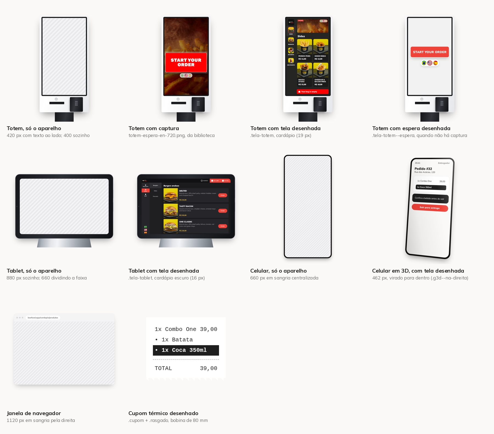

# Aparelhos, telas e fotos que a skill já tem prontos

Esta é a prateleira. Antes de desenhar aparelho, recortar foto de comida ou
inventar tela, olhe o que já está aqui — tudo abaixo já passou por render,
revisão e aprovação em carrossel publicado.



A folha sai de `scripts/catalogo.py`, e as peças soltas ficam em
`assets/catalogo/`. **Rode o script depois de mexer no `base.css`**: a folha é a
prova de que o aparelho continua lendo como aparelho.

| Peça | Classe | Largura de uso | Tela |
|---|---|---|---|
| Totem de Autoatendimento | `.totem` | 400 sozinho, 420 com texto ao lado, 384 dividindo a capa | captura ou `.tela-totem` |
| Cardápio Digital no Tablet | `.tablet` | 880 sozinho, 660 dividindo a faixa | `.tela-tablet` |
| Celular | `.celular` | 660 em sangria, 462 em 3D | captura ou `.tela-app` |
| Janela de navegador | `.navegador` | 1120, sangrando pela direita | captura recortada |
| Cupom térmico | `.cupom` + `.rasgado` | até 460 | desenho, sempre |

## A biblioteca de imagens, e como o slide alcança ela

`assets/fotos/` guarda o que serve para **mais de um** carrossel. O slide aponta
para lá com o prefixo `skill:`, que o `renderizar.py` troca pelo caminho de
`assets/`:

```html

```

O que é prova de um carrossel só (modal do painel, cupom daquele pedido, tela do
cadastro) continua em `carrosseis/<slug>/imagens-puras/`, com caminho relativo.
Regra prática: **se o próximo carrossel pode querer, entra na biblioteca.**

| Arquivo | O que é |
|---|---|
| `foto-batata.png`, `foto-cebola.png`, `foto-mozza.png`, `foto-batata-cheddar.png` | porções, do cardápio da ONE Stand |
| `foto-melted.png`, `foto-tasty-bacon.png`, `foto-one-classic.png`, `foto-smash.png` | hambúrgueres |
| `foto-brownie.png`, `foto-shake.png`, `foto-refri.png`, `foto-molho.png` | sobremesa, milk-shake, refrigerante e molho |
| `totem-espera-en-720.png` | tela de espera do totem em inglês, capturada em 720p |
| `totem-espera-idioma-720.png` | a mesma tela em português |
| `totem-banner-en.png` | faixa do topo do cardápio, com `CANCEL ORDER` e as bandeiras |

As fotos são as que a **API serve** para o aparelho (`s3Link`), baixadas pelo
`capturar-totem.py` e convertidas de WEBP para PNG. São 1024x1024, e é por isso
que aguentam ir para dentro de uma tela desenhada sem embolar.

São fotos do cardápio de uma loja de exemplo. Servem de **conteúdo de cardápio**
em qualquer carrossel; o que não se reaproveita é a arte de campanha dela —
cartaz de promoção rouba o assunto da peça (ver `assets/fundos/` abaixo).

`assets/fundos/` tem as duas artes que entram no lugar do cartaz da loja durante
a captura: `fundo-totem-espera.png` (9/16, atrás do botão) e
`fundo-totem-banner.png` (a faixa do cardápio). Saem de um vídeo de comida pelo
`scripts/preparar-fundo.py`.

## Totem de Autoatendimento

O aparelho é um **armário branco**: tela em pé (9/16) com moldura preta fina,
painel embaixo dela e coluna + base pretas, as duas mais estreitas que a
carcaça. Referência: `beefood.com.br/totem-de-autoatendimento`.

O que faz ler "autoatendimento" é o **painel** — leitor de aproximação, boca da
impressora e pinpad. A primeira versão saiu sem ele, com carcaça escura e canto
arredondado, e lia como celular gigante em pé. Numa capa a **coluna** pode sair
pela base do slide (a borda de baixo lê como chão); o painel, nunca.

**Totem vai sempre reto.** O 3D valoriza a espessura girando a peça, e armário
em pé não tem espessura: girado, lê como armário tombando.

Três telas possíveis, em ordem de preferência:

1. **captura de verdade.** O totem é web, abre no Playwright, e a tela de espera
   já está na biblioteca. Em mockup de 400 px ela sobrevive: imagem e botão são
   grandes.
2. **`.tela-totem`** — o cardápio desenhado, para quando a captura reduzida fica
   ilegível (o cardápio inteiro em 400 px dá letra de 5 px no feed). O desenho
   copia o layout da captura e usa as fotos reais da API.
3. **`.tela-totem--espera`** — a espera desenhada, só quando não há captura.

O `font-size` da `.tela-totem` é o que decide **onde a rolagem corta** (tudo lá
dentro é `em`). Varra alguns valores e fique com o que deixa o último cartão
inteiro, ou cortado dentro da foto: corte em cima de `R$ 8,90` lê como falha de
render. Em 420 px de largura deu 19 px, com quatro cartões em duas linhas.

A grade desenhada tem **duas** colunas, e o aparelho tem três: em três, o nome
do produto some na largura do mockup.

### Capturar o totem, com tradução e com fundo nosso

```bash
python .cursor/skills/carrossel-novidades/scripts/capturar-totem.py \
    --saida carrosseis/<slug>/imagens-puras \
    --conteudo carrosseis/<slug>/traducoes.json
```

Sai a tela de espera, o cardápio em português, inglês e espanhol, um produto
aberto, o recorte de um cartão nos três idiomas, e — na biblioteca — as fotos de
produto e o banner. **Nenhum pedido é finalizado.**

O script abre o totem de exemplo da ONE Stand e **intercepta a resposta da API**
para ligar o que a loja não tem cadastrado: `aaTraducao: true` na filial e o
campo `traducao` de cada setor, produto e grupo de complemento, a partir do JSON
de conteúdo. O aplicativo de produção é que renderiza — layout, tipografia,
fotos e seletor de idioma são dele; nosso é só o texto que o lojista escreveria.

O que custou tempo, e não custa mais:

- **capture na resolução em que o mockup vai usar.** O aplicativo desenha botão e
  bandeira em px fixo: a captura de 1080p reduzida para 400 px na arte engole a
  pílula de bandeiras. Daí existir a versão de 720p.
- **clique setor por índice**, nunca por nome — o nome muda de idioma, que é
  justamente o que o carrossel está mostrando.
- **service worker.** O totem é PWA e pede as imagens pelo worker dele:
  `page.route` não enxerga esse pedido e a tela sai preta. Contexto com
  `service_workers="block"` e rota no **contexto**.
- **fuja do setor de combo.** Preço de combo sai como "A partir de R$ 35,90", e
  esse "A partir de" é string fixa do aplicativo, que não passa pelo idioma —
  uma frase em português no meio da tela em inglês desmente o slide.
- **recorte medido no DOM.** Para comparar o mesmo item em dois idiomas, meça a
  caixa do cartão na página (`medir_primeiro_cartao`) e passe em `clip`; capture
  com `device_scale_factor=2`, senão a letra sai pastosa na arte.

## Cardápio Digital no Tablet

Tablet **preto** deitado num suporte de mesa. Referência:
`beefood.com.br/cardapio-digital-tablet`.

Três tentativas saíram lendo "monitor de mesa", e o que corrigiu foi:

- **moldura grossa e proporcional** — 4,4% da largura, medido na foto, igual nos
  quatro lados, em `%` e nunca em px (em px ela desaparece quando o mockup
  cresce);
- **canto bem arredondado** — 20 px em 880 de largura é canto de monitor;
- **suporte em chapa única**, larga (58% da largura do aparelho) e rasa, abrindo
  para os lados. Coluna com base é pedestal de monitor; trapézio sai como chapéu
  de papel; chapa de 46% volta a ler como pé de monitor;
- **fio de alumínio** em volta da moldura, senão o aparelho vira um retângulo
  preto sobre fundo escuro;
- ponto da câmera na moldura da **esquerda**, e dois botões na lateral direita.

A tela é 16/10, do tablet Android que roda o aplicativo. 4/3 parece "mais
tablet" e só inventa aparelho.

A `.tela-tablet` é **escura** porque o print de produção é escuro: barra de topo
com logo, `SEARCH` e as duas ações em vermelho; coluna de atalhos com as
bandeiras **retangulares** no pé; coluna de setores; e cartões deitados com foto
à esquerda, preço em amarelo e botão `Order`. Em 880 px, `font-size: 16px` deixa
três itens com o preço visível — preço cortado lê como bug.

O aplicativo é Android e **não roda no Cloud Agent**: a tela é sempre desenhada
em cima do print de produção que está em `manuais/`, com as fotos reais da API.

## Celular, janela e cupom

- **Celular** (`.celular`): 390x844, sem notch de propósito — ilha desenhada em
  cima de print tapa o cabeçalho da tela que o slide quer mostrar. Sangra pela
  **base**. Aceita 3D.
- **Janela de navegador** (`.navegador`): é o mockup de computador. Sangra pela
  **direita**, porque é deitada, e é assim que passa de 1000 px de largura. O
  recorte capturado precisa ter no máximo ~620 px de largura lógica para o
  rótulo da interface sobreviver. Aceita 3D.
- **Cupom** (`.cupom` + `.rasgado`): bobina de 80 mm em monoespaçada. É o caso
  mais tranquilo de desenho — em monoespaçada ninguém confunde com impressão
  real, e é a única forma de mostrar o "antes", que não existe como captura. O
  `.rasgado` serrilha a base para o corte de papel não parecer erro de render.

## 3D: só celular e janela, só com conteúdo ao lado

`.cena3d` no contêiner e `.g3d .g3d--na-direita` (ou `--na-esquerda`) no mockup.
O modificador é o **lado do slide em que o mockup está**, e o giro é sempre
**para dentro**: a quina que aponta para o texto é a que afunda, e o aparelho
parece entrar no slide. Ao contrário, parece cair para fora da arte.

Sozinho na faixa, mockup vai centralizado, grande e reto — inclinar ali troca
tamanho por efeito. Um 3D a cada dois ou três mockups; em todos, vira efeito. E
nunca no slide em que o leitor precisa ler rótulo da interface: a face que recua
come contraste justo onde está a informação.

## Quando faltar um aparelho novo

O método que deu certo duas vezes, nesta ordem:

1. **junte referência antes de escrever CSS** — a página do produto no
   `beefood.com.br`, a foto do catálogo e o print do aplicativo rodando nele. Os
   dois primeiros dão a carcaça; o terceiro dá a tela.
2. **liste o que identifica o aparelho** e desenhe só isso. No totem é o painel;
   no tablet é a moldura grossa mais a chapa do suporte. Peça que não identifica
   nada é peça que só some na redução.
3. **meça na foto, em proporção da largura** (`%`, `aspect-ratio`, `em`), nunca
   em px. O mockup vai ser usado em três larguras diferentes.
4. **renderize vazio primeiro** e pergunte a alguém o que é aquilo. Se a resposta
   for "um monitor" ou "um celular grande", falta peça.
5. **só depois** monte a tela dentro, e registre no `catalogo.py` — aparelho que
   não está na folha é aparelho que a próxima rodada vai desenhar de novo.
