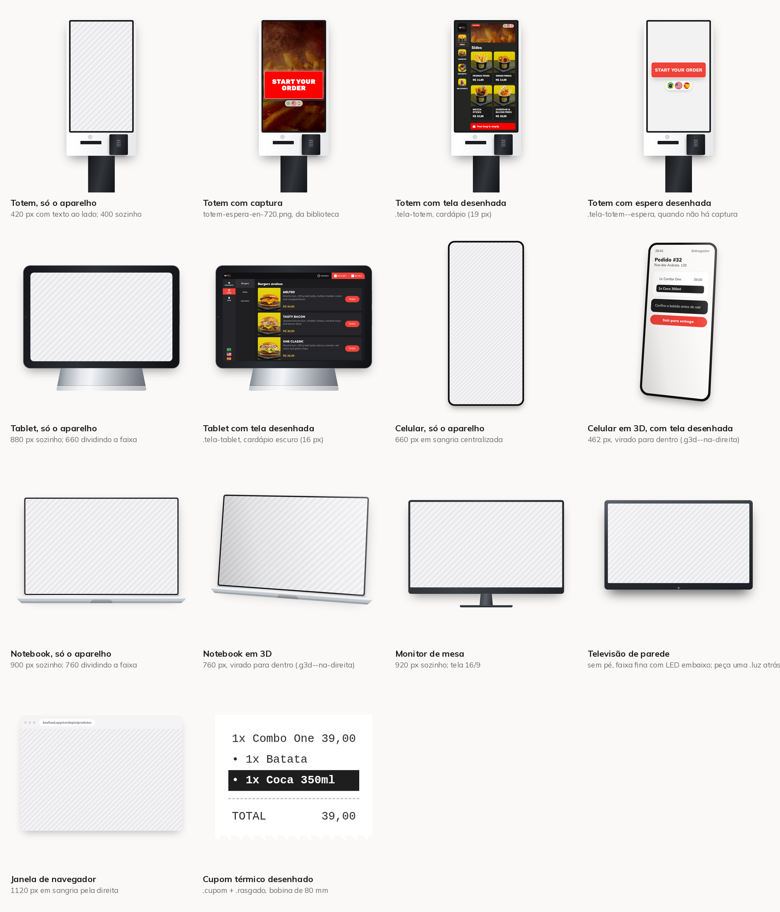

# Aparelhos, telas e fotos que a skill já tem prontos

Esta é a prateleira. Antes de desenhar aparelho, recortar foto de comida ou
inventar tela, olhe o que já está aqui — tudo abaixo já passou por render,
revisão e aprovação em carrossel publicado.



A folha sai de `scripts/catalogo.py`, e as peças soltas ficam em
`assets/catalogo/`. **Rode o script depois de mexer no `base.css`**: a folha é a
prova de que o aparelho continua lendo como aparelho.

| Peça | Classe | Largura de uso | Tela |
|---|---|---|---|
| Totem de Autoatendimento | `.totem` | 400 sozinho, 420 com texto ao lado, 384 dividindo a capa | captura ou `.tela-totem` |
| Cardápio Digital no Tablet | `.tablet` | 880 sozinho, 660 dividindo a faixa | `.tela-tablet` |
| Celular | `.celular` | 660 em sangria, 462 em 3D | captura ou `.tela-app` |
| Notebook | `.notebook` | 900 sozinho, 940 numa capa, 760 dividindo a faixa | captura de página deitada |
| Monitor de mesa | `.monitor` | 920 sozinho, 780 dividindo a faixa | captura de painel (16/9) |
| Janela de navegador | `.navegador` | 1120, sangrando pela direita | captura recortada |
| Cupom térmico | `.cupom` + `.rasgado` | até 460 | desenho, sempre |

## Fluxo: o caminho de várias coisas até uma tela só

`.origem` (a bolinha), `.fio` (o tracejado) e `.selo-ok` (o visto no meio do
caminho) montam a cena de convergência — três marcas entrando no mesmo painel,
quatro canais caindo na mesma fila. Nasceram na capa de dark kitchen, e a razão
é a mesma de sempre: **recorte de tela mostra o fim do caminho, nunca o
caminho**.

O slide é quem posiciona, como no `.realce`, e a cor de cada trio vem de
`--cor` — a mesma com que aquela marca aparece no painel embaixo, senão as
bolinhas viram enfeite. O fio é feito de borda, então a curva sai sem SVG: a
caixa vazia é que diz para onde ela vai. Para descer, virar e descer de novo,
são duas caixas (`fio--vira-direita` + `fio--desce-direita`).

Duas armadilhas, as duas pagas na primeira tentativa: **posicione a bolinha por
número**, não por `space-between` (o nome embaixo é mais largo que o disco e
muda de marca para marca, e o fio nasce ao lado dela); e **termine o fio atrás
do aparelho**, nunca encostado nele — linha que para na borda da tampa lê como
risco, linha que some atrás dela lê como entrando.

A referência de composição foi a ilustração do alto de
`beefood.com.br/sistema-dark-kitchen`. Referência, como print de manual: nada
foi recortado, e o que ela mostra (bolinhas em cima, fios descendo, computador
embaixo recebendo) foi desenhado de novo com o nosso CSS.

## A biblioteca de imagens, e como o slide alcança ela

`assets/fotos/` guarda o que serve para **mais de um** carrossel. O slide aponta
para lá com o prefixo `skill:`, que o `renderizar.py` troca pelo caminho de
`assets/`:

```html

```

O que é prova de um carrossel só (modal do painel, cupom daquele pedido, tela do
cadastro) continua em `carrosseis/<slug>/imagens-puras/`, com caminho relativo.
Regra prática: **se o próximo carrossel pode querer, entra na biblioteca.**

| Arquivo | O que é |
|---|---|
| `foto-batata.png`, `foto-cebola.png`, `foto-mozza.png`, `foto-batata-cheddar.png` | porções, do cardápio da ONE Stand |
| `foto-melted.png`, `foto-tasty-bacon.png`, `foto-one-classic.png`, `foto-smash.png` | hambúrgueres |
| `foto-brownie.png`, `foto-shake.png`, `foto-refri.png`, `foto-molho.png` | sobremesa, milk-shake, refrigerante e molho |
| `totem-espera-en-720.png` | tela de espera do totem em inglês, capturada em 720p |
| `totem-espera-idioma-720.png` | a mesma tela em português |
| `totem-banner-en.png` | faixa do topo do cardápio, com `CANCEL ORDER` e as bandeiras |

As fotos são as que a **API serve** para o aparelho (`s3Link`), baixadas pelo
`capturar-totem.py` e convertidas de WEBP para PNG. São 1024x1024, e é por isso
que aguentam ir para dentro de uma tela desenhada sem embolar.

São fotos do cardápio de uma loja de exemplo. Servem de **conteúdo de cardápio**
em qualquer carrossel; o que não se reaproveita é a arte de campanha dela —
cartaz de promoção rouba o assunto da peça (ver `assets/fundos/` abaixo).

`assets/fundos/` tem as duas artes que entram no lugar do cartaz da loja durante
a captura: `fundo-totem-espera.png` (9/16, atrás do botão) e
`fundo-totem-banner.png` (a faixa do cardápio). Saem de um vídeo de comida pelo
`scripts/preparar-fundo.py`.

`assets/midia/` é o estúdio: banners, cartazes de aviso e os MP4 que entram
**dentro** do cardápio digital na hora da captura. Veja a seção
[Estúdio de mídia](#estúdio-de-mídia-quando-a-novidade-é-a-mídia).

## Totem de Autoatendimento

O aparelho é um **armário branco**: tela em pé (9/16) com moldura preta fina,
painel embaixo dela e coluna + base pretas, as duas mais estreitas que a
carcaça. Referência: `beefood.com.br/totem-de-autoatendimento`.

O que faz ler "autoatendimento" é o **painel** — leitor de aproximação, boca da
impressora e pinpad. A primeira versão saiu sem ele, com carcaça escura e canto
arredondado, e lia como celular gigante em pé. Numa capa a **coluna** pode sair
pela base do slide (a borda de baixo lê como chão); o painel, nunca.

**Totem vai sempre reto.** O 3D valoriza a espessura girando a peça, e armário
em pé não tem espessura: girado, lê como armário tombando.

Três telas possíveis, em ordem de preferência:

1. **captura de verdade.** O totem é web, abre no Playwright, e a tela de espera
   já está na biblioteca. Em mockup de 400 px ela sobrevive: imagem e botão são
   grandes.
2. **`.tela-totem`** — o cardápio desenhado, para quando a captura reduzida fica
   ilegível (o cardápio inteiro em 400 px dá letra de 5 px no feed). O desenho
   copia o layout da captura e usa as fotos reais da API.
3. **`.tela-totem--espera`** — a espera desenhada, só quando não há captura.

O `font-size` da `.tela-totem` é o que decide **onde a rolagem corta** (tudo lá
dentro é `em`). Varra alguns valores e fique com o que deixa o último cartão
inteiro, ou cortado dentro da foto: corte em cima de `R$ 8,90` lê como falha de
render. Em 420 px de largura deu 19 px, com quatro cartões em duas linhas.

A grade desenhada tem **duas** colunas, e o aparelho tem três: em três, o nome
do produto some na largura do mockup.

### A quarta saída: tirar o aparelho e mostrar só o recorte

As três acima assumem que a tela vai **dentro** do totem, e essa é a pergunta
que faltava. Na peça de autoatendimento ela se inverteu: o que precisa ser lido
não cabe numa moldura de 420 px, e o aparelho já foi estabelecido na capa.

| | Aparelho com a tela dentro | Recorte da tela, sozinho |
|---|---|---|
| onde | capa e CTA | miolo, onde a tela é a prova |
| o que a tela faz | atmosfera: "é este aparelho" | é **lida** |
| tamanho da letra do cardápio | 11 px no feed | 24 px, com o recorte em 940 px |

O recorte continua lendo como totem porque o aplicativo é escuro e a tela é em
pé — não é preciso repetir a carcaça em todo slide, e repeti-la custaria a
legibilidade de cada prova.

**Tela que vai dentro do mockup precisa nascer na proporção da moldura.** O
`.totem__tela` é 9/16 com `object-fit: cover`: qualquer imagem em outra
proporção é recortada nas laterais. Um recorte de 1080×800 do cardápio entrou
assim no CTA e saiu com a terceira coluna de produtos cortada no meio do nome —
que lê como render quebrado, não como sangria. A correção é na captura: para
dentro do aparelho, capture a tela **inteira** em 720×1280; o recorte é para
quando a imagem aparece sozinha.

**Onde o recorte termina, quando ele aparece sozinho.** Entre cortar dentro de
uma foto e cortar no vão entre duas fileiras, o vão ganha: no cardápio do totem
o recorte para 14 px depois da primeira fileira de produtos, e a grade não
parece interrompida. Cortar dentro da foto continua valendo quando não há
alternativa — é melhor que cortar em cima de um preço.

**E o vão que você mede tem que existir na próxima captura.** A sugestão da
sacola é gerada por IA e muda a cada rodada: o recorte que fechava limpo numa
captura, na seguinte pegou a lasca de um cartão a mais, com nome e preço
cortados no meio. O que não muda é a **grade** — no totem, cartão de 256 px com
12 px de vão — então a coordenada foi para o vão da grade (1030 de 1080) e não
para a borda da lista daquele dia. Recorte de tela com conteúdo variável se
mede pela grade; pela borda, só onde o conteúdo é fixo.

**Recorte é faixa contínua, nunca montagem.** No slide de pagamento as duas
partes que interessavam — a pergunta do consumo, no topo, e a barra de `Total` e
`Ir para pagamento`, embaixo — têm 800 px de fundo vazio entre elas. Coladas
passariam por uma tela só, que é o que não são; por isso foram dois `.recorte`
separados, com respiro, no mesmo slide.

### A quinta saída: `.selo-recurso`, quando nem o aparelho nem o recorte cabem

Na capa aparece um terceiro caso: a peça entrega mais de um eixo, o título só
carrega um, e os outros precisam de anúncio. Pendurar **recortes de tela** ao
lado do aparelho é a tentação, e falha nas duas pontas — reduzido para a coluna
que sobra o recorte fica ilegível; aumentado, cobre o vidro, ou seja, rótulo e
preço. O `.selo-recurso` é a etiqueta desenhada que ocupa esse lugar.

```html
<div class="selo-recurso" style="left: 44px; top: 606px;
                                 background: var(--primaria); color: #fff">
  <span class="selo-recurso__nome">Cupom</span>
  <span class="selo-recurso__nota">de desconto</span>
</div>
```

Três coisas para ele não sair pior que o recorte:

- **duas alturas, não uma.** Ao lado de um aparelho em pé sobra uma coluna de
  ~320 px, e nela a frase inteira numa linha não passa de corpo 22 — que ao
  lado de um título de 68 lê como crédito de rodapé. Nome grande em cima, nota
  em caixa alta embaixo: o que estoura a largura é a frase, não a fonte.
- **cor da interface, nome do recurso** — e **nunca um número que o lojista
  configura**. Dentro de um print o `5% de cashback` é da loja que aparece ali;
  desenhado, vira promessa nossa.
- **meça onde a carcaça acaba.** No `.totem` de 360 px sobram ~12 px de branco
  de cada lado na altura do vidro: não há carcaça em que encostar, e o lugar do
  selo é o fundo escuro, com folga. Sobreposição em cima de coisa decorativa
  vira profundidade; em cima de rótulo, vira defeito.

#### Com ícone: `.selo-recurso--com-icone`

O formato é o que o próprio site usa para anunciar esses recursos — ícone num
quadrado, nome ao lado, nota embaixo do nome. E o ícone não é enfeite: na
miniatura do feed, onde a capa é decidida, o nome do recurso tem 9 px de altura
e o desenho tem 30. Ele é a parte do selo que sobrevive ao tamanho em que a
peça é vista pela primeira vez.

```html
<span class="selo-recurso__icone" style="background: rgba(255,255,255,.22)">
  <svg viewBox="0 0 24 24">…</svg>
</span>
<span class="selo-recurso__texto">
  <span class="selo-recurso__nome">Cupom</span>
  <span class="selo-recurso__nota">de desconto</span>
</span>
```

- **SVG inline, `stroke: currentColor`.** Herda a cor do selo, escala sem
  borrar, não vira arquivo para manter. Emoji não serve: cada máquina desenha o
  seu, e o mesmo carrossel sai diferente em duas máquinas.
- **Desenho que já é conhecido** — bilhete picotado para cupom, cifrão com seta
  de volta para cashback. Ícone que precisa de legenda não é ícone.
- **Quadrado translúcido da cor do selo**, e não um bloco branco: o ícone é
  parte do selo, não um adesivo em cima dele.
- **O texto perde ~90 px**, e a nota que cabia passa a quebrar em duas linhas.
  Selo mais alto que o outro desmonta o par: `.selo-recurso__texto` é `nowrap`,
  e quem encurta é a frase.

#### Preso ao aparelho: `.selo-recurso--encaixado`

Legível, na cor certa e dizendo a coisa certa, o selo ainda pode sair errado —
e o retorno vem nesta forma: *"tá só um texto com um painel atrás"*. Está
certo. Dois retângulos pousados na arte **dividem o slide** com o aparelho; não
pertencem a ele. O reflexo é acrescentar efeito, e efeito não resolve, porque o
problema é profundidade e não acabamento.

Resolve **oclusão**: a silhueta do aparelho cortando a ponta do selo. É a pista
mais barata de composição e a única que o olho não discute.

```html
<div class="selo-recurso selo-recurso--encaixado"
     style="left: 44px; top: 606px; padding: 26px 96px 26px 34px;
            background: linear-gradient(104deg, #ff8078, #f2483f 46%, #a3201a)">
```

O modificador põe o selo abaixo da `.sangria`. O resto é medida, e as três
andam juntas:

- a ponta escondida entra **~60 px** atrás da carcaça — o bastante para o corte
  ser intenção, pouco para virar etiqueta espetada;
- **padding maior desse lado**, porque o que some tem que ser margem e nunca
  texto;
- gradiente **escurecendo para a ponta oculta**: tab que dobra para trás entra
  na sombra do aparelho. Chapado, o corte lê como "faltou espaço".

Do outro lado, a régua do vidro sai de graça: passando **atrás**, o selo nunca
cobre nome nem preço. A mesma sobreposição que era defeito virou profundidade
só por trocar de lado.

### Luz: `.luz` no escuro, `.luz--tinta` no branco

Luz é `div` vazio com gradiente, `filter: blur()` e mistura — nunca imagem.
Renderiza igual em qualquer máquina e se ajusta com um número. O que muda é o
**modo de mistura**, e ele depende da cor da superfície, não da cor da luz:

| onde a luz cai | classe | mistura |
|---|---|---|
| fundo escuro, atrás do aparelho | `.luz` | `screen` |
| carcaça clara, por cima do mockup | `.luz--tinta` | `multiply` |

`screen` sobre branco **não faz nada** — branco já é o teto. É o erro que
aparece como "a luz não pegou no aparelho", e a correção é `multiply`, não mais
opacidade. E `.luz--tinta` só passa por superfície opaca (painel, carcaça): em
cima do vidro ela lava a tela, que é a prova.

Numa cena com aparelho aceso, três camadas dão conta, e vale conferir se as
três estão lá antes de mexer em número:

1. **o brilho da tela**, atrás do aparelho — é o que faz o mockup parecer
   ligado, e não recortado e colado;
2. **uma luz só** no pé, se houver mais de um selo colorido: duas poças
   separadas põem os selos em cenas diferentes;
3. **a tinta na carcaça** — é a única que prova que a luz bate no aparelho.

Mais a **sombra de contato** na quina em que o selo some. Sem ela o selo encosta
no aparelho, mas não entra nele.

### Capturar o totem, com tradução e com fundo nosso

```bash
python .cursor/skills/carrossel/scripts/capturar-totem.py \
    --saida carrosseis/<slug>/imagens-puras \
    --conteudo carrosseis/<slug>/traducoes.json
```

Sai a tela de espera, o cardápio em português, inglês e espanhol, um produto
aberto, o recorte de um cartão nos três idiomas, e — na biblioteca — as fotos de
produto e o banner. **Nenhum pedido é finalizado.**

O script abre o totem de exemplo da ONE Stand e **intercepta a resposta da API**
para ligar o que a loja não tem cadastrado: `aaTraducao: true` na filial e o
campo `traducao` de cada setor, produto e grupo de complemento, a partir do JSON
de conteúdo. O aplicativo de produção é que renderiza — layout, tipografia,
fotos e seletor de idioma são dele; nosso é só o texto que o lojista escreveria.

O que custou tempo, e não custa mais:

- **capture na resolução em que o mockup vai usar.** O aplicativo desenha botão e
  bandeira em px fixo: a captura de 1080p reduzida para 400 px na arte engole a
  pílula de bandeiras. Daí existir a versão de 720p.
- **clique setor por índice**, nunca por nome — o nome muda de idioma, que é
  justamente o que o carrossel está mostrando.
- **service worker.** O totem é PWA e pede as imagens pelo worker dele:
  `page.route` não enxerga esse pedido e a tela sai preta. Contexto com
  `service_workers="block"` e rota no **contexto**.
- **fuja do setor de combo.** Preço de combo sai como "A partir de R$ 35,90", e
  esse "A partir de" é string fixa do aplicativo, que não passa pelo idioma —
  uma frase em português no meio da tela em inglês desmente o slide.
- **recorte medido no DOM.** Para comparar o mesmo item em dois idiomas, meça a
  caixa do cartão na página (`medir_primeiro_cartao`) e passe em `clip`; capture
  com `device_scale_factor=2`, senão a letra sai pastosa na arte.

## Cardápio Digital no Tablet

Tablet **preto** deitado num suporte de mesa. Referência:
`beefood.com.br/cardapio-digital-tablet`.

Três tentativas saíram lendo "monitor de mesa", e o que corrigiu foi:

- **moldura grossa e proporcional** — 4,4% da largura, medido na foto, igual nos
  quatro lados, em `%` e nunca em px (em px ela desaparece quando o mockup
  cresce);
- **canto bem arredondado** — 20 px em 880 de largura é canto de monitor;
- **suporte em chapa única**, larga (58% da largura do aparelho) e rasa, abrindo
  para os lados. Coluna com base é pedestal de monitor; trapézio sai como chapéu
  de papel; chapa de 46% volta a ler como pé de monitor;
- **fio de alumínio** em volta da moldura, senão o aparelho vira um retângulo
  preto sobre fundo escuro;
- ponto da câmera na moldura da **esquerda**, e dois botões na lateral direita.

A tela é 16/10, do tablet Android que roda o aplicativo. 4/3 parece "mais
tablet" e só inventa aparelho.

A `.tela-tablet` é **escura** porque o print de produção é escuro: barra de topo
com logo, `SEARCH` e as duas ações em vermelho; coluna de atalhos com as
bandeiras **retangulares** no pé; coluna de setores; e cartões deitados com foto
à esquerda, preço em amarelo e botão `Order`. Em 880 px, `font-size: 16px` deixa
três itens com o preço visível — preço cortado lê como bug.

O aplicativo é Android e **não roda no Cloud Agent**: a tela é sempre desenhada
em cima do print de produção que está em `manuais/`, com as fotos reais da API.

## Notebook e monitor de mesa

Página web deitada tem três mockups, e eles dizem coisas diferentes:

| Peça | O que ela mostra | Quando |
|---|---|---|
| `.navegador` | a **página** | recorte de painel, com `.realce` em cima de um campo |
| `.notebook` | a **cena**: alguém sentado, olhando aquilo | capa, e todo slide em que o assunto é o cliente vendo a tela |
| `.monitor` | o lugar de trabalho do dono | painel visto de onde ele trabalha, em 16/9 |

Numa capa o notebook vale mais que 100 px a mais de tela: a moldura conta que
tem gente do outro lado. Foi o que a capa do carrossel de capas e destaques
pediu — o assunto era o cardápio virar vitrine, e vitrine se olha de longe.

O que faz o desenho ler como notebook, e não como monitor:

- **tela 16/10.** 16/9 lê como televisão.
- **moldura preta fina e igual** nos quatro lados, com o queixo um pouco maior.
- **fio prateado** em volta da tampa: é a carcaça aparecendo.
- **base mais larga que a tampa**, baixa, com a frente arredondada e o recorte
  de abrir no meio. Sem a base é monitor sem pé; sem o recorte, a base lê como
  barra de som.

E o monitor é o contrário do tablet: aqui **pescoço mais pé é exatamente o que
se quer**, com tela 16/9 e um queixo de 4% embaixo dela — sem o queixo vira
televisão de parede.

Os dois têm a peça de baixo (base, pescoço) **absoluta, pendurada fora da caixa
do elemento**, como o totem e o tablet. Em 3D, o brilho do `.g3d::after` cobre
`inset: 0` do elemento girado e pintaria o vão transparente das quinas.

Duas armadilhas que custaram render:

- **`clip-path` recorta os filhos.** O afunilamento do pescoço do monitor não
  pode ficar no invólucro `.monitor__pe`, senão o pé sai com a largura do
  pescoço. Pescoço no `::before`, pé no `::after`.
- **`overflow: hidden` do slide come a base do notebook** quando ele fica no
  limite de baixo. Suba o mockup alguns pixels em vez de encolher.

O notebook **aceita 3D** (tampa tem espessura, e o giro valoriza). O monitor
também, mas tem menos a ganhar: a peça é uma chapa.

### `.monitor--parede`: a televisão, que é o monitor sem o que o faz monitor

Tela de parede é outro produto, e o Painel para Entregadores é o caso: ele fica
numa TV perto da retirada, não na mesa de ninguém. O modificador tira o queixo,
afina a moldura e **o `.monitor__pe` não entra no HTML**.

```html
<!-- a luz que põe uma parede atrás do aparelho -->
<div class="luz" style="left: 50%; top: 500px; width: 1360px; height: 900px;
                        margin-left: -680px; filter: blur(70px);
                        background: radial-gradient(ellipse 46% 50% at 50% 47%,
                                    rgba(255, 244, 232, 0.9) 0%,
                                    rgba(255, 216, 186, 0.38) 62%,
                                    rgba(0, 0, 0, 0) 82%)"></div>

<div class="monitor monitor--parede" style="width: 944px">
  <div class="monitor__tela"></div>
</div>
```

A primeira versão deste mockup voltou do dono — *"não é só uma imagem, precisa
ter um mockup"* —, e o diagnóstico vale para qualquer aparelho novo daqui:
**moldura fina e uniforme em volta de um print é o desenho de uma borda, não de
um objeto.** O que faz o olho ver aparelho:

- **massa, e assimétrica.** A moldura precisa ser mais grossa que a do produto
  real (televisão de hoje é quase só painel, e 0,65% fiel a isso vira 6 px em
  1000), e a **borda de baixo maior que as outras três** — 4,2% contra 2,2%. A
  assimetria é o que toda TV tem e nenhuma moldura de imagem tem;
- **volume na moldura:** fio de luz no topo, sombra no pé, e cinza mais claro
  que o do monitor de mesa. Moldura escura em capa escura some, e o que sobra na
  tela é o print;
- **o detalhe barato:** o LED no meio da faixa de baixo, e um reflexo diagonal
  fraco sobre o vidro. Custam duas regras e dizem "aparelho ligado" e "aqui tem
  vidro" — sem lavar o print;
- **luz na parede, que é a camada que mais rende.** Uma `.luz` branca e quente
  atrás do aparelho. O `box-shadow` sozinho não dá conta: ele desenha contorno,
  e o que falta é **fundo**. Sem ela a TV flutua no preto; com ela existe uma
  parede, e a tela está acesa nela.

E por isso a imagem que entra na moldura é a do tema **claro**, mesmo numa capa
escura: tela acesa e branca sobre fundo escuro é televisão ligada. O tema escuro
do painel vai no slide que fala de tema, onde ele tem função.

A imagem precisa ser **16/9 de verdade**: o `object-fit: cover` do
`.monitor__tela` come uma faixa de qualquer captura fora da proporção. Capture
em 1280×720 em vez de recortar depois.

## Estúdio de mídia: quando a novidade é a mídia

Tem novidade em que o recurso **é o conteúdo que o lojista sobe** — banner de
capa, vitrine, cartaz de aviso. Aí não existe "captura do recurso": o cardápio
de exemplo está vazio, e o de produção tem a campanha de um cliente. A saída é
fazer a mídia e **entregar ela para o aplicativo de verdade renderizar**.

```bash
# 1. as artes: PNG/JPG e os MP4
python .cursor/skills/carrossel/scripts/fazer-midia.py

# 2. o cardápio modelo rodando com elas dentro
python .cursor/skills/carrossel/scripts/capturar-cardapio.py \
    --saida carrosseis/<slug>/imagens-puras \
    --conteudo carrosseis/<slug>/midias.json
```

O `fazer-midia.py` renderiza fragmentos de `assets/midia/artes/*.html` com o
`arte.css` e, para os que pedem vídeo, gera um MP4 com um movimento de zoom
lento no FFmpeg (6 s, H.264, **mudo** — o cardápio toca `<video muted>`). O
`capturar-cardapio.py` intercepta o `validaDelivery` do cardápio público,
descompacta o JSON (base64 + zlib), escreve `bannersJson` e `avisosJson` com a
nossa mídia e devolve. Os arquivos saem do disco por outra rota, com suporte a
`Range` — sem isso o Chromium não toca o MP4.

O que essa rodada ensinou:

- **a arte é da loja, não da BeeFood.** O `arte.css` tem uma paleta própria (a
  da hamburgueria do cardápio modelo). Banner com o vermelho da BeeFood dentro
  do cardápio de um cliente lê como anúncio nosso no cardápio dele.
- **meça o vão antes de desenhar.** O cardápio corta a mídia com
  `object-fit: cover`: ~4,1/1 no computador e ~2,6/1 no celular. A primeira
  rodada saiu em 16/9 e o aplicativo comeu o selo e o preço. Em **1920×580**
  (3,3/1), com 14% de margem segura, o texto sobrevive aos dois cortes.
- **desvie do que o aplicativo desenha por cima.** O logotipo da loja fica
  embaixo à esquerda no computador e no meio no celular, e o selo de avaliação
  no alto à direita: o texto do banner de capa mora na faixa de cima, à
  esquerda.
- **preço e nome saem da API do cardápio**, nunca da cabeça. Banner com preço
  inventado é o tipo de detalhe que volta como reclamação.
- **o zoom do vídeo come a margem segura, e por isso tem âncora.** No centro,
  ele aperta os quatro lados e o corte do aplicativo termina o serviço: o selo
  do alto sai pela metade no último segundo. `"ancora": "topo"` prende a borda
  de cima, e a arte de capa — que já é toda na faixa de cima — só se afasta da
  borda. Na largura não há âncora que salve: 10% de corte no celular mais 14%
  de margem segura dão teto de ~1,08 para peça que vai **rodar inteira** no
  celular. Acima disso, mire no computador e escolha o segundo da captura.
- **`service_workers="block"` e rota no contexto**, a mesma armadilha do totem.
- **o cupom verde de cupons** ("Você tem 2 cupons!") tapa o topo do cardápio: o
  `capturar-cardapio.py` fecha pelo `.promo-banner`, e não por texto.

## Celular, janela e cupom

- **Celular** (`.celular`): 390x844, sem notch de propósito — ilha desenhada em
  cima de print tapa o cabeçalho da tela que o slide quer mostrar. Sangra pela
  **base**. Aceita 3D.
- **Janela de navegador** (`.navegador`): é o mockup de computador. Sangra pela
  **direita**, porque é deitada, e é assim que passa de 1000 px de largura. O
  recorte capturado precisa ter no máximo ~620 px de largura lógica para o
  rótulo da interface sobreviver. Aceita 3D.
- **Cupom** (`.cupom` + `.rasgado`): bobina de 80 mm em monoespaçada. É o caso
  mais tranquilo de desenho — em monoespaçada ninguém confunde com impressão
  real, e é a única forma de mostrar o "antes", que não existe como captura. O
  `.rasgado` serrilha a base para o corte de papel não parecer erro de render.

## 3D: só celular e janela, só com conteúdo ao lado

`.cena3d` no contêiner e `.g3d .g3d--na-direita` (ou `--na-esquerda`) no mockup.
O modificador é o **lado do slide em que o mockup está**, e o giro é sempre
**para dentro**: a quina que aponta para o texto é a que afunda, e o aparelho
parece entrar no slide. Ao contrário, parece cair para fora da arte.

Sozinho na faixa, mockup vai centralizado, grande e reto — inclinar ali troca
tamanho por efeito. Um 3D a cada dois ou três mockups; em todos, vira efeito. E
nunca no slide em que o leitor precisa ler rótulo da interface: a face que recua
come contraste justo onde está a informação.

## Quando faltar um aparelho novo

O método que deu certo duas vezes, nesta ordem:

1. **junte referência antes de escrever CSS** — a página do produto no
   `beefood.com.br`, a foto do catálogo e o print do aplicativo rodando nele. Os
   dois primeiros dão a carcaça; o terceiro dá a tela.
2. **liste o que identifica o aparelho** e desenhe só isso. No totem é o painel;
   no tablet é a moldura grossa mais a chapa do suporte. Peça que não identifica
   nada é peça que só some na redução.
3. **meça na foto, em proporção da largura** (`%`, `aspect-ratio`, `em`), nunca
   em px. O mockup vai ser usado em três larguras diferentes.
4. **renderize vazio primeiro** e pergunte a alguém o que é aquilo. Se a resposta
   for "um monitor" ou "um celular grande", falta peça.
5. **só depois** monte a tela dentro, e registre no `catalogo.py` — aparelho que
   não está na folha é aparelho que a próxima rodada vai desenhar de novo.
