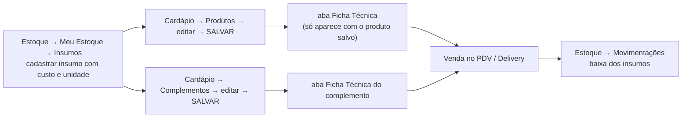

# Plano — manual de Ficha Técnica

> **Status:** ✅ **O manual de hambúrguer virou o #72** (`manuais/ficha-tecnica/`, concluído em
> 01/09/2026). A **pizza** segue em espera — o estudo dela está guardado inteiro na seção 9, e a
> dúvida técnica que a travava **já foi respondida** (seção 8).
> **Última atualização:** 01/09/2026
> **Conta sandbox:** BeeFood3 - Manual — `contato@beefood.com.br` (`https://beefood.app`)
> **Rotas:** `/cardapio` (Produtos e Complementos) e `/meu-estoque` — a ficha é uma **aba** do
> modal de produto/complemento, não tem tela própria
> **Permissão:** nenhuma específica. Depende do submenu **Cardápio** ou **Estoque**
> **API:** `GET /api/estoque2/produtoInsumos/...` · `POST /api/estoque2/insumoProduto` ·
> `DELETE /api/estoque2/insumoProduto/...`

Documento de estudo, no padrão do [`PLANO-PARAMETROS.md`](PLANO-PARAMETROS.md). Serve para o dono
aprovar o recorte **antes** de qualquer captura.

---

## 1. Resumo em cinco linhas

1. A **Ficha Técnica** é a lista de insumos que compõem um produto **ou um complemento**. Ela faz
   duas coisas: calcula o **custo** do item e **baixa o estoque dos insumos quando há venda**.
2. A baixa automática **existe e já rodou neste sandbox**: das 228 movimentações de insumo do ano,
   **170 vieram de venda** (evidência na seção 6).
3. A baixa acontece em **dois níveis**: a ficha do **produto** e a ficha do **complemento
   escolhido como opção**. Todo cardápio com adicionais usa os dois.
4. **Não existe conversão de unidade.** Insumo cadastrado em KG é sempre lançado em fração de KG:
   100 g são `0,1`, 50 g são `0,05` e 5 g são `0,005` (seção 5).
5. O primeiro manual sai no **hambúrguer**, que já está montado no sandbox e ainda permite rodar
   o teste do qual a pizza depende (seção 8).

---

## 2. Não confundir: três coisas com nome parecido

| Nome | Onde fica | O que faz | Manual |
|------|-----------|-----------|--------|
| **Ficha Técnica** | Aba do modal de **produto** e de **complemento** (Cardápio ou Meu Estoque) | Insumos que compõem o item → custo e baixa na venda | **é este estudo** |
| **Receita** + **Produção** | Menu **Estoque → Receitas** e **Estoque → Produção** | Insumo que vira **outro insumo** (maionese da casa, molho especial). Tem rendimento e campo de perda | fora deste manual (seção 14) |
| **Ficha de consumo** | Configuração → Parâmetros | Papel impresso no PDV (Individual × Lista) | já é o **#45** (`manuais/pdv-fichas/`) |

O sandbox já tem duas receitas ativas — *Maionese da Casa* e *Molho Especial (receita)* —, o que
prova que os três assuntos convivem e que misturá-los no mesmo manual confundiria o leitor.

---

## 3. Onde fica e o que é pré-requisito

Dois pré-requisitos, e os dois derrubam quem tenta começar pela ficha:

1. **O insumo tem que existir antes.** A aba Ficha Técnica só **seleciona** insumo já cadastrado —
   não cria. O cadastro é em **Estoque → Meu Estoque → Insumos** (ou Importar Excel).
2. **O produto precisa estar salvo.** Em produto novo a aba mostra *"Salve o produto primeiro —
   A ficha técnica estará disponível após salvar o produto"*.

Caminhos que chegam à mesma aba: **Cardápio → Produtos**, **Cardápio → Complementos**,
**Estoque → Meu Estoque → Produtos** e **→ Complementos**. No celular a aba é **somente leitura**
(*"Acesse pelo navegador do computador para adicionar ou editar insumos"*).

---

## 4. Os campos, e o que não existe

A aba é enxuta: uma faixa **Adicionar Insumo** e uma tabela.

| Campo | Tipo | Obrigatório | Observação |
|-------|------|-------------|------------|
| **Insumo** | busca (*Buscar insumo…*) | sim | mostra unidade, setor e custo de cada insumo na lista |
| **Quantidade** | texto, até **4 casas decimais** | sim, maior que zero | vírgula brasileira; **Enter** já adiciona |
| **Un.** | somente leitura | — | vem do insumo, não dá para trocar |
| **Custo** (coluna) | calculado | — | `quantidade × custo do insumo` |
| **%** (coluna) | calculado | — | participação daquele insumo no custo total |

**O que o BeeFood não tem** (importante dizer no manual, porque todo mundo pergunta):

- **conversão de unidade** — é o assunto da seção 5;
- **perda / quebra** e **rendimento** na ficha do produto (existem só no módulo Receitas);
- **markup** ou **preço sugerido** — o painel calcula margem, não sugere preço;
- **repetir o mesmo insumo** na ficha — a segunda tentativa devolve *"Este insumo já foi
  adicionado à ficha técnica"*;
- **ficha na opção** do grupo de opções — a ficha mora no produto/complemento que a opção aponta.

---

## 5. Unidade e conversão — a regra do manual

**Decisão do dono (01/09/2026):** o insumo é cadastrado numa unidade grande — **KG** para o que se
compra por peso, **L** para líquido — e a ficha lança a **fração** dessa unidade. Não há conversão
automática: quem digita faz a conta.

O campo aceita **4 casas decimais**, então o menor lançamento em KG é `0,0001` (0,1 g) — sobra
precisão até para tempero.

| Você usa | Insumo em KG, digite | Insumo em L, digite |
|----------|---------------------:|--------------------:|
| 1 quilo / 1 litro | `1` | `1` |
| 500 g / 500 ml | `0,5` | `0,5` |
| 200 g / 200 ml | `0,2` | `0,2` |
| 100 g / 100 ml | `0,1` | `0,1` |
| 50 g / 50 ml | `0,05` | `0,05` |
| 20 g / 20 ml | `0,02` | `0,02` |
| 5 g / 5 ml | `0,005` | `0,005` |
| 1 g / 1 ml | `0,001` | `0,001` |

> **A conta é sempre gramas ÷ 1000.** O erro clássico é confundir `0,05` (50 g) com `0,005` (5 g) —
> um fator de dez que passa despercebido na tela e só aparece quando o estoque não bate. Essa
> tabela vira um quadro destacado no manual.

O sistema aceita cadastrar o insumo em **GR** ou **ML** (as duas unidades existem), e aí a
quantidade é digitada inteira. O custo, porém, passa a ser por grama — R$ 0,042 em vez de
R$ 42,00 o quilo —, o que arredonda mal e não bate com a nota do fornecedor. **O manual recomenda
KG e L**, e cita GR/ML só como alternativa possível.

---

## 6. As contas — e a baixa, comprovada no sandbox

### As contas

| Onde | Conta |
|------|-------|
| Linha da ficha | `quantidade × custo do insumo` |
| **Custo Total** (rodapé da ficha) | soma das linhas |
| **Custo Ficha Técnica** (aba Produto, só leitura) | o mesmo Custo Total, trazido para o formulário |
| **Custo Total** (aba Produto) | `Custo` (digitado à mão) **+** `Custo Ficha Técnica` |
| Etiqueta de margem | `Lucro = Venda − Custo total` e `Margem = Lucro ÷ Venda × 100` |

Duas consequências que viram alerta no manual: o **Custo** digitado à mão **soma** com o da ficha
(quem preenche os dois conta o custo duas vezes), e a margem é **sobre a venda**, não markup — o
próprio tooltip do sistema faz questão de dizer isso.

### A baixa de estoque (evidência)

Consultei o histórico do sandbox pela API de movimentações (somente leitura, período do ano):

| Tipo de movimentação | Quantidade |
|----------------------|-----------:|
| Produto — por venda | 417 |
| Produto — manual | 66 |
| **Insumo — por venda** | **170** |
| Insumo — manual | 58 |

E a coluna **Descrição** mostra a trilha de onde a baixa veio — em **dois ou três níveis**:

| Trilha | Nível | O que significa |
|--------|-------|-----------------|
| `Açaí Médio -> Copo 550ml - Médio` | 2 | ficha do **produto**: vendeu o açaí, baixou o copo |
| `Açaí Médio -> Açaí - Médio -> Açai KG` | 3 | ficha do **complemento** escolhido como opção: baixou 0,25 KG de açaí |
| `Selecione seu suco -> Suco abacaxi 1L -> Polpa abacaxi` | 3 | mesma coisa, em outro produto |

Das 170 baixas de insumo por venda, **87 são de três níveis** e **83 de dois** — ou seja, a ficha
do complemento funciona tanto quanto a do produto.

**A quantidade do item multiplica.** Na venda #218 a baixa foi `-12` de Polpa abacaxi com
`origemQtd 4` (ficha de 3 polpas × 4), e na #222 foi `-3` com `origemQtd 1`.

**Estorno existe:** a venda #189 tem `-0,35`, `+0,35` e `-0,35` do mesmo insumo — alterar ou
cancelar a venda devolve o insumo ao estoque. Vale uma nota no manual.

---

## 7. O segmento do primeiro manual: hambúrguer

### Por que hambúrguer

| Motivo | Detalhe |
|--------|---------|
| **Cenário já existe** | O sandbox é uma hamburgueria completa hoje: 7 setores, 67 produtos, 41 complementos. Nada a limpar, nada a montar |
| **Exercita as duas camadas** | Ficha no produto (o lanche) e ficha no complemento (o adicional) — sem a armadilha de metade que a pizza tem |
| **Responde a pergunta da pizza** | Os adicionais **Carne 100g** e **Bacon** já estão cadastrados com **máximo 2** por opção. É o teste da seção 8 |
| **A margem funciona** | O One Burger tem preço próprio (R$ 28,00), então a etiqueta de margem aparece verde e faz sentido — didaticamente melhor que a pizza, que tem preço R$ 0,00 |
| **Três tipos de insumo num cardápio só** | Unidade (pão, embalagem), peso (blend, queijo, bacon) e volume (óleo) |
| **Encaixe com Receitas** | O insumo *Maionese da casa (sache)* já é **gerado por uma receita**. Dá para mostrar o encaixe em um parágrafo, sem ensinar Receitas |

**Segmentos que ficam para depois:** açaí (ótimo para conversão por peso e tamanhos, mas os
produtos foram apagados do cardápio e teria de remontar o setor), japonesa (contagem de peças
ensina pouco sobre custo) e cafeteria (não existe no sandbox). **Pizza fica em espera** — seção 9.

### Cenário proposto

Insumos a cadastrar em **Estoque → Meu Estoque → Insumos**:

| Insumo | Un. | Custo | Observação |
|--------|-----|------:|------------|
| Pão brioche | UN | R$ 1,80 | |
| Blend 100 g (carne) | KG | R$ 42,00 | |
| Queijo prato fatiado | KG | R$ 39,00 | |
| Bacon em fatias | KG | R$ 34,00 | |
| Alface | KG | R$ 8,00 | |
| Tomate | KG | R$ 6,00 | |
| Embalagem do lanche | UN | R$ 0,90 | |
| Óleo de fritura | L | R$ 9,00 | o caso de volume |
| Embalagem da porção | UN | R$ 0,45 | |
| Batata Frita Congelada | KG | R$ 10,00 | **já existe** no sandbox |
| Maionese da casa (sache) | KG | R$ 10,19 | **já existe** — vem da Receita |

**Ficha do produto One Burger** (venda R$ 28,00):

| Insumo | Qtd | Un. | Equivale a | Custo |
|--------|----:|-----|------------|------:|
| Pão brioche | 1 | UN | 1 pão | R$ 1,80 |
| Blend 100 g | 0,1 | KG | 100 g | R$ 4,20 |
| Queijo prato | 0,02 | KG | 20 g | R$ 0,78 |
| Alface | 0,01 | KG | 10 g | R$ 0,08 |
| Tomate | 0,02 | KG | 20 g | R$ 0,12 |
| Maionese da casa | 0,02 | KG | 20 g | R$ 0,20 |
| Embalagem do lanche | 1 | UN | 1 caixa | R$ 0,90 |
| **Custo Total** | | | | **R$ 8,08** |

Margem sobre R$ 28,00: lucro **R$ 19,92**, **71,1%** — a etiqueta verde que o manual mostra.

**Fichas dos complementos** (adicionais):

| Complemento | Venda | Ficha | Custo |
|-------------|------:|-------|------:|
| **Carne 100g** | R$ 9,00 | Blend 0,1 KG | R$ 4,20 |
| **Bacon** | R$ 4,00 | Bacon 0,03 KG (30 g) | R$ 1,02 |
| **Fatia de queijo** | R$ 3,00 | Queijo prato 0,02 KG | R$ 0,78 |

**Ficha da porção Batata frita** (venda R$ 14,00) — o caso de granel + volume:

| Insumo | Qtd | Un. | Equivale a | Custo |
|--------|----:|-----|------------|------:|
| Batata Frita Congelada | 0,2 | KG | 200 g | R$ 2,00 |
| Óleo de fritura | 0,01 | L | 10 ml | R$ 0,09 |
| Embalagem da porção | 1 | UN | | R$ 0,45 |
| **Custo Total** | | | | **R$ 2,54** |

---

## 8. O teste decisivo — ✅ respondido

A pergunta que travava a pizza era: **quando a mesma opção é escolhida duas vezes, a ficha é
baixada duas vezes?** O teste foi feito no hambúrguer, porque *Carne 100g* já estava com
**máximo 2** por opção — é o smash duplo.

**Venda #928:** One Burger + 2 × Carne 100g = R$ 32,00. O que a tela **Movimentações** devolveu:

| Insumo | Baixa | Trilha |
|--------|------:|--------|
| Blend bovino | **−0,2** | `Venda de 2 "One Burger -> Carne 100g -> Blend bovino"` |
| Blend bovino | **−0,1** | `One Burger -> Blend bovino` |
| Pão brioche | −1 | `One Burger -> Pão brioche` |
| Alface | −0,01 | `One Burger -> Alface` |
| Tomate | −0,02 | `One Burger -> Tomate` |
| Queijo prato fatiado | −0,02 | `One Burger -> Queijo prato fatiado` |
| Embalagem do lanche | −1 | `One Burger -> Embalagem do lanche` |

**Saíram 0,3 KG de blend — os três hambúrgueres do pedido.** O multiplicador funciona, e com isso
**a pizza pode usar o modelo Proporcional com a ficha do sabor em meia pizza** (seção 9.2).

Outras três respostas que a execução trouxe:

- **A baixa acontece no `Receber`**, na criação da pré-venda, antes de qualquer pagamento.
- **Insumo com *Controlar Estoque* desligado não movimenta.** A maionese da casa está na ficha,
  entra no custo e **não** apareceu nas movimentações. (Era a pergunta 2 da seção 12.)
- **A quantidade do item multiplica:** a venda #927, com duas porções de batata frita, gerou dois
  conjuntos de baixas.

---

## 9. Pizza — em espera

O estudo da pizza está completo e fica guardado aqui. **Ele não entra no primeiro manual**, por
decisão do dono, enquanto o comportamento da pizza é corrigido.

### 9.1 Por que a pizza precisa de duas camadas

No BeeFood a pizza não é um produto só: o preço vem dos **sabores**, e o produto fica com
**R$ 0,00** (é o que o manual **#29** ensina). Com a ficha técnica acontece a mesma divisão: a base
(massa, molho, mussarela, caixa) fica no produto e é cadastrada **uma vez**; o recheio de cada
sabor fica no complemento daquele sabor.

### 9.2 A armadilha da metade

A ficha do sabor é baixada **uma vez por opção escolhida**, e o número de opções muda conforme o
modelo de preço do #29:

| Modelo (#29) | Grupo | Pizza de 1 sabor | Meio a meio |
|--------------|-------|------------------|-------------|
| **A — Valor da Maior** | mín 1 / máx 2, opção 0-1 | **1** opção | **2** opções |
| **B — Proporcional** | mín 2 / máx 2, opção 0-2 | **2** opções (o mesmo sabor 2×) | **2** opções |

| Modelo | Ficha do sabor cadastrada como… | Pizza de 1 sabor | Meio a meio |
|--------|--------------------------------|------------------|-------------|
| A | pizza inteira | ✅ certo | ❌ baixa o **dobro** |
| A | meia pizza | ❌ baixa **metade** | ✅ certo |
| **B** | **meia pizza** | ✅ certo (2 × meia) | ✅ certo |

**No Modelo A não existe cadastro que acerte os dois casos.** No Modelo B acerta — desde que o
teste da seção 8 confirme o multiplicador.

### 9.3 Cenário guardado

Insumos: Farinha de trigo KG R$ 4,50 · Molho de tomate KG R$ 12,00 · Mussarela KG R$ 38,00 ·
Caixa de pizza UN R$ 1,20 · Calabresa KG R$ 28,00 · Cebola KG R$ 5,00 · Presunto KG R$ 24,00 ·
Ovo UN R$ 0,70 · Azeitona KG R$ 22,00 · Requeijão KG R$ 32,00.

**Ficha do produto Pizza Média:** Farinha 0,25 KG (R$ 1,13) + Molho 0,08 KG (R$ 0,96) +
Mussarela 0,15 KG (R$ 5,70) + Caixa 1 UN (R$ 1,20) = **R$ 8,99**.

**Fichas dos sabores** (quantidade de **meia** pizza): Calabresa = calabresa 0,06 KG + cebola
0,02 KG = **R$ 1,78**; Portuguesa = presunto 0,05 KG + ovo 0,5 UN + azeitona 0,01 KG + cebola
0,02 KG = **R$ 1,87**; Borda Catupiry = requeijão 0,08 KG = **R$ 2,56**.

| Pedido | Custo | Venda | Margem |
|--------|------:|------:|-------:|
| Pizza inteira de Calabresa | 8,99 + 2 × 1,78 = **R$ 12,55** | R$ 40,00 | 68,6% |
| Meio a meio Calabresa + Portuguesa | 8,99 + 1,78 + 1,87 = **R$ 12,64** | R$ 42,50 | 70,3% |
| Meio a meio + Borda Catupiry | 12,64 + 2,56 = **R$ 15,20** | R$ 50,50 | 69,9% |

### 9.4 Duas coisas que o painel não mostra

1. **O custo da pizza montada não existe em lugar nenhum.** O painel mostra R$ 8,99 no produto e
   R$ 1,78 no complemento, cada um no seu modal. Somar base + sabores + borda é conta de quem
   administra.
2. **A margem da pizza aparece negativa, e está tudo certo.** Preço R$ 0,00 com custo de ficha
   R$ 8,99 faz a etiqueta mostrar **−R$ 8,99 (0,0%)** em vermelho.

### 9.5 O que falta para tirar a pizza da espera

- a correção que o dono está fazendo;
- ~~o resultado do teste da seção 8~~ — **feito: a opção repetida baixa em dobro**, então o modelo
  Proporcional com ficha de meia pizza está liberado;
- decidir se a pizza vira um manual próprio (`ficha-tecnica-pizza`) ou um capítulo do #72.

---

## 10. Provas a capturar (~16 imagens)

| # | Imagem | Tipo |
|---|--------|------|
| 1 | Meu Estoque → aba **Insumos** (lista, contadores Regular/Sem controle) | contexto |
| 2 | Modal do insumo: Descrição\*, Custo, Unidade, Categoria | setas |
| 3 | Aba **Estoque** do insumo: Controlar Estoque, mínimo, aceita negativo | setas |
| 4 | Aba **Ficha Técnica** vazia com a faixa **Adicionar Insumo** | setas |
| 5 | Ficha do **One Burger** preenchida: Custo Total R$ 8,08 e a coluna % | setas |
| 6 | Aba **Produto**: Custo, Custo Ficha Técnica, Custo Total e a margem verde (71,1%) | setas |
| 7 | Quadro da conversão aplicado: o campo com `0,1` para 100 g de blend | setas |
| 8 | Ficha do complemento **Carne 100g** | setas |
| 9 | Ficha do complemento **Bacon** | contexto |
| 10 | Ficha da porção **Batata frita** (granel + óleo em L + embalagem) | setas |
| 11 | Meu Estoque → Produtos com a coluna **Ficha Técnica = Sim** e o filtro | setas |
| 12 | PDV: One Burger + 2 × Carne 100g montado — R$ 46,00 | setas |
| 13 | **Movimentações** da venda: as baixas de 2 e 3 níveis — **a prova** | setas |
| 14 | Movimentações da venda de 2 lanches (multiplicação pela quantidade) | contexto |
| 15 | Editar quantidade na linha (lápis → ✓) e o diálogo **Remover Insumo** | setas |
| 16 | Insumo *Maionese da casa* mostrando que veio de uma **Receita** | contexto |

---

## 11. Estrutura proposta do manual

**`#72 — Ficha técnica: o custo do prato`** (pasta `manuais/ficha-tecnica/`)

1. O que é a ficha técnica e as duas coisas que ela faz (custo e baixa de estoque)
2. Não confundir com Receita, Produção e ficha de consumo
3. Pré-requisito: cadastrar o insumo (custo, unidade, controlar estoque)
4. **Unidade e conversão** — o quadro de gramas ÷ 1000
5. A ficha do lanche, do começo ao fim
6. O que a ficha calcula: custo da linha, %, Custo Total, Custo Ficha Técnica, margem
7. A ficha do **adicional** (complemento) e por que ela é separada
8. A porção: granel, óleo em litro e embalagem
9. A prova: venda no PDV e a baixa em Movimentações
10. Manter a ficha: mudou o custo do insumo, mudou tudo; editar e remover linha
11. Limites e erros comuns (sem conversão, custo em dobro, mobile só leitura, insumo repetido)
12. Perguntas frequentes

A pizza entra depois, como manual próprio ou como capítulo — decisão da seção 9.5.

---

## 12. Perguntas em aberto

Respondidas na execução do #72:

1. ✅ **A opção escolhida duas vezes baixa em dobro?** Sim (seção 8).
2. ✅ **A baixa acontece com *Controlar Estoque* desligado?** **Não.** O insumo entra no custo, mas
   não gera movimentação nenhuma.

Ainda em aberto (não bloqueiam nada):

3. **Cancelar a venda devolve os insumos?** O histórico da conta mostra estorno; falta confirmar em
   que ação exatamente ele acontece.
4. **A Importação de NF-e atualiza o custo do insumo** (e portanto a ficha inteira)?
5. **O produto "esgota" no cardápio quando o insumo zera?** O front cita esse comportamento.
6. **O combo desce até a ficha dos itens escolhidos?** O sandbox tem 9 combos (Burger + Porção +
   Bebida) cujas opções são produtos com ficha própria.

---

## 13. Como o #72 foi executado

1. **Insumos zerados** a pedido do dono: 20 dos 21 apagados. O único que ficou —
   *Maionese da casa (sache)* — é travado por três receitas já usadas em produção (só dá para
   desativar a receita, e a API recusa receita com `itens: []`). Ele virou conteúdo do manual: é o
   exemplo de **insumo com custo controlado por receita**.
2. **10 insumos novos** cadastrados com custo, unidade, controle de estoque e saldo inicial.
3. **Cinco fichas**: One Burger, Carne 100g, Bacon, Fatia de queijo e Batata frita.
4. **Três vendas reais** no PDV (#925, #927, #928), pagas em dinheiro.
5. **15 imagens, 41 setas**, validadas por `python3 validar-imagens.py ficha-tecnica`.

Só falta o dono avisar quando a **pizza** estiver corrigida, para tirar a seção 9 da espera.

---

## 14. Fora deste manual

| Assunto | Onde está | Sugestão |
|---------|-----------|----------|
| **Receitas + Produção** | `Estoque → Receitas` e `→ Produção` | manual próprio (**#74**, já que o #73 ficou com o produto de encomenda): insumo que vira insumo, com rendimento e perda |
| Movimentação manual de estoque, saldo, mínimo | `Estoque → Meu Estoque` e `Movimentações` | manual próprio de estoque (já está no backlog) |
| Importar NF-e | `Estoque → Importar NFe` | manual próprio |
| Ficha de consumo do PDV | Parâmetros | já é o **#45** |
| Preço do hambúrguer e da pizza | Cardápio | já são o **#28** e o **#29** — este manual **cita** e não repete |

---

## 15. Checklist de execução

Tudo concluído para o **#72** (hambúrguer):

1. ✅ `manuais/ficha-tecnica/` no padrão completo (`MEMORIA.md`, `fluxo-codigo.md`,
   `ficha-tecnica.md`, `texto-documentation.ia.md`, `annotate.py`, `capturar.py`,
   `imagens-puras/`, `imagens-tratadas/`).
2. ✅ Insumos e fichas cadastrados; custos conferidos contra as tabelas da seção 7.
3. ✅ Teste da seção 8 rodado **antes** de escrever o texto.
4. ✅ Captura com Playwright (1440×900, DPR 1,5, tema claro, `LANG=pt_BR.UTF-8`, espera do spinner
   **e mais 5 segundos**).
5. ✅ Anotação e `python3 validar-imagens.py ficha-tecnica` limpo.
6. ✅ `README.md`, `CHECKLIST-MANUAIS.md`, `MEMORIA-GERAL.md` e `spec.md` atualizados.

Quando a pizza voltar, repetir os mesmos passos com o cenário da seção 9.3.
