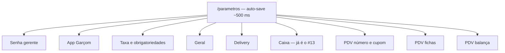

# Plano — manuais de Parâmetros (Configuração)

> **Status:** ✅ Concluído (Opção **B** — 8 manuais).  
> **Última atualização:** 21/08/2026  
> **Conta sandbox:** BeeFood3 - Manual — `contato@beefood.com.br` (`https://beefood.app`)  
> **Rota:** `/parametros` — menu **Configuração → Parâmetros**  
> **Permissão:** `parametros`  
> **API:** `GET` / `POST` `/api/empresa2/empresaConfig`

Documento mestre. Consultar **antes de iniciar cada manual**. Não produzir até o dono pedir o primeiro da fila (ou confirmar a ordem).

---

## 1. Visão geral

A tela tem **6 cards**. Um card não é necessariamente um manual: senha gerente, App Garçom, mesas/taxa, PDV operação, fichas e balança rendem artigos próprios. O card **Caixa** já é o **#13**.



Não confundir com:

- Configuração fiscal (`/configuracao-fiscal`)
- Parâmetros RFV (`ModalRFVParametros`)
- Área de Entrega (#34–#38)
- Operar o PDV / Mesas / Delivery no dia a dia (backlog separado)

Código de referência (somente leitura):

- `~/refs/beefood-web-react/src/pages/Parametros.tsx`
- `~/refs/beefood-web-react/src/hooks/useEmpresaParametros.ts`
- `~/refs/beefood-web-react/src/utils/balancaParser.ts`
- `~/refs/beefood-web-react/src/hooks/usePDVImpressaoFichas.ts`
- `~/refs/beefood-web-react/src/lib/impressao-service.ts`
- `~/refs/beefood-web-react/src/components/ModalValidarSenhaGerente.tsx`

Vídeos já embutidos na rota (não repetir; no máximo linkar):

- Código do Operador — `G5PH7VOlunw`
- Senha Gerente — `CeXewqyMX6w`

---

## 2. Estrutura aprovada — Opção B (8 manuais)

| Nº | Manual | Pasta | Prova | Ordem de produção |
|----|--------|-------|-------|-------------------|
| **#39** | Senha gerente | `manuais/senha-gerente/` | usuário **novo** não gerente + efeito no PDV | **1º** |
| **#40** | App Garçom | `manuais/app-garcom-parametros/` | **só a tela de configuração** | 6º |
| **#41** | Taxa e obrigatoriedades de mesa/comanda | `manuais/mesas-taxa-obrigatorias/` | Mesas **web** | 5º |
| **#42** | Geral (motivo + operador) | `manuais/parametros-geral/` | PDV | 2º |
| **#43** | Delivery — pagamento automático | `manuais/delivery-pagamento-auto/` | pedido entregue | 7º |
| **#44** | PDV — número e cupom | `manuais/pdv-numero-cupom/` | PDV + preview do navegador | 3º |
| **#45** | PDV — fichas de consumo | `manuais/pdv-fichas/` | PDV + preview do navegador | **4º** |
| **#46** | PDV — balança (códigos) | `manuais/pdv-balanca/` | PDV digitando o EAN-13 | **8º** (o mais denso) |

**Fora do bloco:** card Caixa / `caixaPorUsuario` → **#13**. Não reescrever.

**Total estimado:** ~90–110 imagens (balança e fichas puxam o volume).

---

## 3. Regras que valem para os oito

1. **Um assunto = uma pasta** no padrão do `CHECKLIST-MANUAIS.md`.
2. **Auto-save:** no computador a alteração grava sozinha (~500 ms). O texto **não** pede “clique em Salvar”.
3. **App Garçom:** texto + print da configuração. Frase padrão: *“Este parâmetro vale no aplicativo do garçom, que não faz parte deste manual.”*
4. **Não mentir a descrição da tela.** `caixaPorUsuario` já ensinou isso no #13.
5. **Restaurar o sandbox** no fim de cada manual (switches e usuário de teste no estado combinado).
6. **Impressão:** não há servidor BeeImpressão neste ambiente. O código tenta o servidor, falha e cai em `imprimirViaIframe` → `window.print()`. **O preview do navegador é a prova.** Vale para cupom (#44) e fichas (#45).
7. **Balança:** não há balança física. A prova é **digitar o EAN-13 de 13 dígitos na busca do PDV** (o mesmo campo do scanner; auto-insere em ~180 ms).
8. Playwright: 1440×900, DPR 1.5, tema claro, `LANG=pt_BR.UTF-8`, esconder `div.fixed.bottom-6` e toasts. Não usar `button:has-text('Alterar')`.
9. Prefixo de commit: `docs(#NN): ...`
10. Validar: `python3 validar-imagens.py <pasta>`
11. Manuais são do **painel web desktop**. Não documentar o `MobileParametrosPage` (lá existe botão Salvar).
12. `operadorPDVObrigar` existe na API e no mobile — **sem switch no desktop**. Só nota no `fluxo-codigo.md` do #42.

---

## 4. Usuário de teste — Senha gerente (#39)

O `contato@beefood.com.br` **é gerente**. Com ele o modal **não abre** (atalho em `ModalValidarSenhaGerente`: se `config_cache.gerente === true`, sucesso imediato).

O `caixa.manual` / `manual123` **já foi usado no #13**. **Não reutilizar.**

### Criar usuário novo (produção interna + capítulo do #39)

| Campo | Valor |
|-------|-------|
| Login | `atendente.parametros` |
| Senha | `manual123` |
| Nome | Atendente Parâmetros |
| Função Gerente | **desligada** |
| Grupo | **Acesso Funcionário** (`grupoAcessoID` 71880), com PDV, Caixa, Estoque e Mesas ligados |
| Onde cadastrar | **Configuração → Usuários → aba Usuários → novo** |

A senha do gerente, na hora de validar, é a do `contato@beefood.com.br` (`1q2w3e4r`).

Dois contextos Playwright no mesmo script (já funcionou no #13): admin configura; atendente prova o modal.

O #39 **ensina a criar esse usuário** (print do cadastro com Gerente desligado) e depois mostra o efeito. Não documentar a senha `1q2w3e4r` no texto publicado — dizer “senha do gerente”.

---

## 5. Manual por manual

### #39 — Senha gerente

**Pasta:** `manuais/senha-gerente/`  
**Pergunta do leitor:** *“Quais operações pedem a senha do gerente — e como eu testo?”*

#### Inventário

| Campo na tela | Flag | Onde o código usa |
|---|---|---|
| Cancelar Operação Caixa | `geCai` | `CaixaVerModal`, `useCaixaVerDetalhes` |
| Cancelar Pagamento | `gePag` | `useModalPagamentosLogic`, `VendaDetalhes` |
| Cancelar Venda | `geVen` | PDV, Delivery, `usePDV` |
| Cancelar Produto Lançado | `gePro` | item já persistido no PDV |
| Editar Estoque | `geEst` | `ModalAlterarEstoque` |
| Aplicar Desconto | `geDesc` | `useDescontoGuard` |
| Desconto máximo (%) | `geDescMax` | só aparece se `geDesc` estiver on; `0` = sem limite; **vale inclusive para o gerente** |
| Testar Validação | — | `ModalValidarSenhaGerente` |

#### Roteiro

1. Como gerente (`contato@…`): ligar os 6 switches + `geDescMax` = **10**.
2. Criar `atendente.parametros` (Gerente off). Mostrar o cadastro.
3. Testar no próprio `/parametros` logado como atendente → modal abre.
4. Prova principal no PDV: aplicar desconto **15%** → recusado pelo teto; **10%** → pede senha; senha do gerente libera.
5. Uma segunda prova curta: cancelar produto lançado **ou** editar estoque (escolher a que estiver mais limpa no sandbox).
6. Voltar como gerente e mostrar o Testar: toast *“Acesso autorizado! Você possui permissão de gerente.”* sem modal.

#### Não fazer

- Não usar `caixa.manual`.
- Não repetir o vídeo do YouTube.
- Não ligar `motivoCancelamento` neste manual (é o #42) — senão o desconto pede motivo **antes** da senha e confunde.

#### Imagens (~12)

Card dos switches; campo %; cadastro do usuário (Gerente off); login do atendente; Testar com modal; PDV desconto recusado; PDV pedindo senha; PDV após validar; (opcional) estoque ou cancelar item.

---

### #40 — App Garçom (só configuração)

**Pasta:** `manuais/app-garcom-parametros/`  
**Pergunta:** *“O que cada menu do aplicativo do garçom liga?”*

Não temos o app. **Nenhum print de celular.**

| Campo | Flag | Efeito (texto) |
|---|---|---|
| Comandas | `appGarcomComanda` | mostra o menu para abrir venda por comanda |
| Mesas | `appGarcomMesa` | idem por mesa |
| Nome Avulso | `appGarcomNomeAvulso` | idem por nome avulso |
| Cliente | `appGarcomCliente` | idem por cliente cadastrado |

#### Roteiro

1. Card **Taxa de Serviço e Mesas** → bloco *Aplicativo do Garçom*.
2. Um print do bloco inteiro + um print com os 4 switches ligados.
3. Tabela “o que o garçom vê” em texto, com a frase padrão.
4. Avisar que **obrigatoriedade de mesa/comanda** é o manual **#41** (outro bloco da mesma tela).

#### Imagens (~4)

Tela Parâmetros / card; bloco App Garçom; os 4 switches on; (opcional) destaque do texto de ajuda do próprio card.

---

### #41 — Taxa e obrigatoriedades (Mesas web)

**Pasta:** `manuais/mesas-taxa-obrigatorias/`  
**Pergunta:** *“Como a taxa e as obrigatoriedades funcionam no salão?”*

Estes cinco flags valem no **web e no app** (changelog do produto). A prova é só no web.

| Campo | Flag | Prova |
|---|---|---|
| Taxa de Serviço Padrão | `taxaServicoPadrao` | liga o % |
| Valor da Taxa (%) | `taxaServicoValor` | usar **10** |
| Cliente obrigatório | `mesaClienteObrigatorio` | Mesas / PDV de mesa recusa sem cliente |
| Comanda obrigatória | `appGarcomComandaObrigatoria` | `useMesasData` / `PedidoFields` |
| Mesa obrigatória | `appGarcomMesaObrigatoria` | idem |

No PDV, se há mesa ou comanda e a taxa padrão está on, o código já preenche `taxaServico` com `taxaServicoValor` (`PDV.tsx`).

#### Roteiro

1. Ligar taxa 10% → abrir mesa no web → taxa aparece.
2. Ligar cliente obrigatório → tentar abrir sem cliente → bloqueio.
3. Mesa obrigatória / comanda obrigatória: uma prova cada (a que o mapa do salão deixar mais clara).
4. Restaurar switches.

#### Imagens (~10)

Card do bloco *Parâmetros gerais*; taxa on + 10%; mesa com taxa; cliente obrigatório recusando; mesa/comanda obrigatória.

---

### #42 — Geral (motivo + operador)

**Pasta:** `manuais/parametros-geral/`  
**Pergunta:** *“Por que o sistema pede motivo ao cancelar? E o código do operador?”*

| Campo | Flag | Observação |
|---|---|---|
| Motivo de cancelamento | `motivoCancelamento` | também entra no fluxo de **desconto** (`useDescontoGuard`) |
| Operador | `operadorPDV` | seleção no PDV quando o carrinho está vazio |
| Testar | — | `ModalValidarOperador` |

Pegadinhas do Testar (texto da própria tela):

- Usuário com `funcionarioID` no login → modal **não** abre.
- Parâmetro Operador **desligado** → sucesso sem operador.
- Parâmetro **ligado** e sem `funcionarioID` → modal pede o código.

`contato@beefood.com.br` provavelmente **não** tem `funcionarioID`. Confirmar na hora. Se tiver, o Testar só funciona com outro usuário sem funcionário vinculado.

Para o operador existir, precisa de um **funcionário** com código em Cadastros → Funcionários. Se o sandbox não tiver, cadastrar um *Operador Manual* código **10** (só para a prova) e anotar no `MEMORIA.md`.

#### Roteiro

1. Ligar motivo → cancelar item/venda no PDV → campo de motivo.
2. Ligar operador → Testar (e, se o modal abrir, PDV ao entrar).
3. Nota no `fluxo-codigo.md`: `operadorPDVObrigar` sem UI.

#### Imagens (~8)

Card Geral; motivo on; PDV pedindo motivo; operador on; Testar (modal ou toast de skip); PDV com operador (se abrir).

---

### #43 — Delivery — pagamento automático

**Pasta:** `manuais/delivery-pagamento-auto/`  
**Pergunta:** *“Por que o pedido já nasceu pago quando eu marquei Entregue?”*

Flag: `deliveryPagamentoAuto`.

Backend (`alteraSituacaoDelivery.js`): ao ir para **ENTREGUE**, se o parâmetro está on **e** existe intenção de pagamento (`tipoPag` ou `tipoPagStr`) **e** `valorPago === 0`, registra o pagamento.

#### Roteiro

1. Ligar o switch.
2. Criar um pedido delivery **no cardápio** (ou no painel) com forma **Dinheiro** / pagar na entrega — **sem** pagar ainda.
3. Aceitar → despachar → **Entregue**.
4. Abrir o pedido: pagamento registrado.
5. Contraprova curta (opcional): desligar o parâmetro, repetir, pagamento **não** entra sozinho.

Se não houver pedido entregável, montar um no cardápio `https://menu.beefood.com.br/beefood3` com o endereço de teste (Arthur Gomes, 13).

#### Imagens (~7)

Switch; pedido criado com forma de pagamento; coluna Entregue; detalhe com pagamento; (opcional) parâmetro off sem pagamento.

---

### #44 — PDV — número do pedido e cupom automático

**Pasta:** `manuais/pdv-numero-cupom/`  
**Pergunta:** *“Como aparece o número da venda? E o cupom que imprime sozinho?”*

| Campo | Flag | Efeito |
|---|---|---|
| Número de Pedido no PDV | `pdvNumeroPedido` | mostra o número na venda |
| Imprimir Venda Sempre | `pvdImprimirVendaSempre` | cupom ao finalizar (typo histórico na flag) |

Impressão: mesmo fallback das fichas. Sem BeeImpressão → preview do navegador. **Fotografar o preview** (é o cupom do cliente, não a ficha).

Fichas desligadas neste manual, para não misturar dois `window.print()`.

#### Roteiro

1. Ligar só o número → uma venda → print do PDV com o número visível.
2. Ligar o cupom automático → finalizar → preview do navegador.
3. Explicar: “se não houver servidor de impressão, o BeeFood abre o preview do navegador — é o mesmo cupom.”

#### Imagens (~8)

Card PDV (só os dois switches); PDV sem número; PDV com número; finalizar; preview do cupom.

---

### #45 — PDV — fichas de consumo (completo)

**Pasta:** `manuais/pdv-fichas/`  
**Pergunta:** *“O que é a ficha, qual a diferença de Individual e Lista, e o que sai na impressão?”*

Este manual é **explicado de ponta a ponta**. Não resumir em “ligue o switch”.

#### O que é

A **Ficha de Consumo** não é cupom fiscal nem o cupom do cliente. É o ticket de passagem ( balcão / produção ): o que foi pedido, para quem, em qual mesa/comanda.

Dispara **ao receber a venda no PDV**, **antes** do cupom (`PDV.tsx` chama `imprimirFichas` e só depois `pvdImprimirVendaSempre`).

#### Os três switches

| Campo | Flag | Regra |
|---|---|---|
| Impressão de Ficha | `impressaoFicha` | mestre; se ligar e nenhum modo estiver on, o código força **Individual** |
| Individual | `impressaoFichaIndividual` | **XOR** com Lista — uma ficha **por item** |
| Lista | `impressaoFichaLista` | **XOR** com Individual — **uma** ficha com todos os itens |

Não dá para desligar os dois modos ao mesmo tempo (a UI ignora o clique).

#### Conteúdo impresso (os dois modos)

Cabeçalho `FICHA DE CONSUMO`; venda nº (pedido e/ou pré-venda); cliente; mesa; comanda; item `Nx descrição` em destaque; opções `• Nx opção`; `Obs:`; rodapé `Impresso em dd/mm/aaaa hh:mm`.

**Individual:** esse bloco se repete, um `window.print()` por item.  
**Lista:** um único bloco com título `ITENS:` e todos os produtos.

Código: `usePDVImpressaoFichas.ts` → se `checkPrinterConnection()` falha → `gerarHtmlParaImpressao` + `imprimirViaIframe` → `window.print()`.

#### Roteiro

1. Ligar Ficha (Individual entra sozinho). Print da configuração.
2. Venda no PDV com **2 produtos** + 1 observação + (se fácil) 1 opção.
3. Finalizar → **dois** previews (Individual). Fotografar os dois.
4. Trocar para Lista → nova venda com os mesmos 2 produtos → **um** preview com os dois itens.
5. Tabela comparando Individual × Lista.
6. Avisar a diferença para o #44 (cupom do cliente).

`pvdImprimirVendaSempre` **desligado** neste manual, senão o preview do cupom invade o das fichas.

#### Imagens (~14)

Bloco fichas off; on (Individual forçado); XOR explicado; PDV com 2 itens; preview ficha 1; preview ficha 2; troca para Lista; preview lista; (opcional) ficha com mesa/cliente.

---

### #46 — PDV — balança (completo, interpreta o código)

**Pasta:** `manuais/pdv-balanca/`  
**Pergunta:** *“Como o BeeFood lê a etiqueta da balança — e como eu acerto os dígitos?”*

Manual **técnico e longo**. A ajuda oficial (`https://ajuda.beefood.com.br/baseconhecimento/balanca/`) é um diagrama; este artigo ensina a **ler o número**. Sem balança física.

#### 5.1 O que a balança imprime

Quase toda balança de checkout no Brasil gera um **EAN-13** de **13 dígitos que começa com `2`**. Não é o código de barras do fabricante: é um código **montado na hora**, com o produto e o peso (ou o valor) daquela pesagem.

Se o parâmetro **Balança Ativada** estiver off, o PDV trata o número como código de barras comum e **não** extrai peso.

Parser: `src/utils/balancaParser.ts`. Regras duras:

- exatamente 13 dígitos
- começa com `2`
- só números
- senão, `isBalanca = false`

#### 5.2 Anatomia (posições 1 a 13)

O BeeFood conta os dígitos **de 1 a 13**, esquerda → direita, **inclusive o `2` inicial**. Os quatro campos da tela são o recorte:

| Campo na tela | Flag | Default no código | O que recorta |
|---|---|---|---|
| Dígito Código (Início) | `balancaDigitoCodigo` | **1** | começo do código do produto |
| Dígito Código (Fim) | `balancaDigitoCodigoFim` | **5** | fim do código do produto |
| Dígito Preço (Início) | `balancaDigitoPreco` | **6** | começo do peso **ou** do valor |
| Dígito Preço (Fim) | `balancaDigitoPrecoFim` | **11** | fim do peso/valor |

O dígito 13 é o **verificador EAN-13**. O 12 muitas vezes sobra, conforme o layout da balança.

**Layout que o manual ensina como padrão de padaria/açougue** (prefixo `2` fora do código do produto):

```
posição   1  2 3 4 5 6  7 8 9 10 11 12  13
conteúdo  2  C C C C C  P P P  P  P  P   V
          └prefixo┘ └── código ─┘ └── peso/valor ──┘ └dígito
```

Nesse layout a tela fica:

- Código: início **2**, fim **6**
- Preço/peso: início **7**, fim **12**

O default 1–5 / 6–11 **inclui o `2` no código do produto**. O manual mostra os dois e recomenda o layout 2–6 / 7–12, alinhado à figura da ajuda oficial.

Zeros à esquerda do código extraído são removidos (`"00199"` vira `"199"`). O produto é achado pelo campo **Código** do cadastro (`produto.codigo`), não pelo código de barras do fabricante.

#### 5.3 Tipo de leitura

| Tipo na tela | `balancaTipoLeitura` | Conta |
|---|---|---|
| **Peso** | `0` | `quantidade (kg) = número extraído / 1000` (o campo está em **gramas**) |
| **Valor** | `1` | `quantidade = (número extraído / 100) / preço do produto` (o campo está em **centavos**) |

No tipo Valor, o PDV ainda guarda o total em reais (`valorOriginal / 100`) para não perder centavo no arredondamento.

#### 5.4 Contas prontas (usar no texto e nas capturas)

Produto de exemplo: **Queijo Mussarela**, código interno **`199`**, venda presencial **R$ 39,90 / kg**, unidade kg.

**Leitura = Peso**, layout 2–6 / 7–12, peso **0,350 kg** (350 g):

```
2 00199 000350 V
código = 199
peso   = 000350 / 1000 = 0,350 kg
total  = 0,350 × 39,90 = R$ 13,97
```

O 13º dígito `V` é calculado na produção com `gerarCodigoBalanca` **depois** de gravar a config (o gerador lê o cache). O número completo vai no `MEMORIA.md` e no texto do manual.

**Leitura = Valor**, mesmo layout, etiqueta com **R$ 19,95**:

```
2 00199 001995 V
valor      = 001995 / 100 = R$ 19,95
quantidade = 19,95 / 39,90 = 0,5000 kg
```

Uma terceira conta curta mostra o default 1–5 / 6–11 **errando** o mesmo número (para o leitor ver por que a faixa importa).

#### 5.5 Prova no PDV (sem hardware)

1. Ligar Balança + tipo Peso + dígitos 2–6 / 7–12.
2. Cadastrar o queijo com código `199` (e foto, regra do spec).
3. No PDV, **digitar** o EAN-13 de 13 dígitos no campo de busca (o scanner faria o mesmo).
4. Em ~180 ms o item entra no carrinho com **0,350 kg** e o total certo.
5. Trocar para tipo Valor, gerar o segundo código, repetir: **0,500 kg** / R$ 19,95.

Não inventar leitor USB nem aplicativo de balança (Aplicativos → Balança / pesagem automática é **outro** produto).

#### 5.6 Armadilhas a escrever em destaque

- Balança desligada: o EAN-13 vira busca comum e não pesa.
- Código do produto no cadastro diferente do recorte (ex.: cadastrou `199` e a faixa pega `00199` — ok; cadastrou `200199` e a faixa é 2–6 — **não acha**).
- Tipo Peso × Valor invertido: 350 g lido como valor vira R$ 3,50 e quantidade absurda.
- `geDescMax` / senha gerente não entram aqui.
- Artigo da ajuda: linkar a figura; **não** copiar o PNG com direitos — redesenhar o diagrama em markdown (tabela de posições).

#### Imagens (~16)

Bloco Balança off; on + tipo Peso; dígitos 2–6 / 7–12; diagrama de posições (tabela anotada); cadastro do queijo (código 199); PDV digitando o EAN; item 0,350 kg no carrinho; tipo Valor; segundo EAN; item 0,500 kg; (opcional) default 1–5 lendo o mesmo código errado.

---

## 6. Ordem de produção e dependências

| Ordem | Nº | Por quê nesta posição |
|-------|----|------------------------|
| 1 | **#39** | Cria o usuário `atendente.parametros` que os outros podem reusar |
| 2 | **#42** | Curto; valida PDV + motivo sem briga de impressão |
| 3 | **#44** | Primeiro contato com o preview do navegador (um print só) |
| 4 | **#45** | Fichas completas, já sabendo fotografar o preview |
| 5 | **#41** | Precisa do mapa de Mesas web |
| 6 | **#40** | Só config; encaixa em qualquer folga |
| 7 | **#43** | Depende de pedido delivery entregável |
| 8 | **#46** | Mais denso; produto próprio; não misturar config de dígitos com outro manual |

Publicação sugerida na mesma ordem dos cards da tela: #39 → #40 → #41 → #42 → #43 → #44 → #45 → #46.

---

## 7. Estado do sandbox e restauração

| Item | Valor / regra |
|------|----------------|
| Empresa | BeeFood3 - Manual, `empresaID` 38311, `filialID` 39202 |
| Admin | `contato@beefood.com.br` / `1q2w3e4r` — **Gerente**, grupo Administrador2 |
| Usuário #13 (não usar no #39) | `caixa.manual` / `manual123` |
| Usuário deste bloco | `atendente.parametros` / `manual123` — **criar no #39**, Gerente off |
| Caixa | precisa estar **aberto** para PDV (#39, #42, #44, #45, #46) |
| Endereço delivery | Arthur Gomes, 13 — só se o #43 for pelo cardápio |
| Parâmetros ao final de cada manual | voltar ao estado encontrado no começo (anotar no `MEMORIA.md`) |
| `atendente.parametros` ao final do bloco | **manter** (serve de prova permanente). Não apagar. |

Limpeza de **cardápio** só se o dono pedir. Balança e fichas cadastram produto de exemplo; se a base estiver suja, usar nome realista (*Queijo Mussarela*) e foto.

---

## 8. Captura do preview de impressão

Sem servidor em `localhost:1314` / BeeImpressão, `checkPrinterConnection()` retorna falso e o front chama `imprimirViaIframe`.

O iframe é invisível (`opacity: 0`, 0×0) e dispara `win.print()`. No Chromium isso abre o **diálogo de impressão / preview**.

Como fotografar:

1. Playwright **headed** (não headless) — o diálogo precisa existir.
2. Esperar o diálogo (timeout folgado; o código ainda espera fontes/imagens).
3. Screenshot da janela com o preview visível.
4. Cancelar o diálogo (`Escape`) para não empilhar a fila — no Individual do #45 haverá **um diálogo por item**.
5. Se o diálogo nativo não aparecer no Cloud Agent: gravar o HTML gerado por `gerarHtmlParaImpressao` numa página visível e fotografar **esse** HTML (mesmo conteúdo da ficha/cupom). Registrar no `MEMORIA.md` qual caminho foi o que funcionou.

Não mentir que “saiu na impressora térmica”.

---

## 9. O que este bloco **não** cobre

- Aplicativos → Balança (cadastro de modelo, arquivo de PLU, conexão serial)
- Pesagem automática / self-service / totem
- BeeImpressão (cadastro de impressoras, layouts)
- Operar o PDV completo (carrinho, TEF, reabrir venda)
- App do garçom de verdade
- RFV, fiscal, área de entrega
- Reescrever o #13

---

## 10. Checklist do dono (já marcado)

- [x] **B — 8 manuais**
- [x] App Garçom = só tela de configuração
- [x] Caixa = #13, não repetir
- [x] Balança = manual completo, interpreta os códigos, sem hardware
- [x] Fichas = impressão normal; preview do navegador é a prova
- [x] Senha gerente = **criar** usuário não gerente **novo** (não `contato@` e não `caixa.manual`)
- [x] Numerar **#39 a #46**

Quando o dono disser “pode começar o #39”, iniciar a produção nessa pasta.
