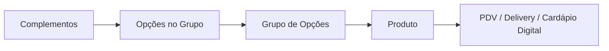

# Plano — Manuais de Cardápio (#27 a #31)

> **Status:** ☑️ Aprovado pelo dono (Opção A — 6 manuais segmentados).  
> **Última atualização:** 2026-08-20  
> **Conta sandbox:** BeeFood3 - Manual — `contato@beefood.com.br` (`https://beefood.app`)

Documento mestre com **todas** as decisões, cenários, ordem de produção e regras operacionais.
Consultar **antes de iniciar cada manual**.

---

## 1. Visão geral

Ensinar cadastro de cardápio no BeeFood:

1. **Complementos** (catálogo reutilizável)
2. **Grupo de Opções** (regras: mín/máx + Formação de Preço)
3. **Opções** dentro do grupo (vínculo com complementos e/ou produtos)
4. **Produto** (aba **Grupo de Opções** para vincular grupos)
5. **Teste no PDV** (fim de cada manual)



### Telas (Cardápio)

| Aba | Função |
|-----|--------|
| **Complementos** | Cadastro base (bacon, granola, shoyu…) |
| **Grupo de Opções** | Regras + aba **Opções** (filtro, edição, **edição em lote**) |
| **Produtos** | Item vendável; modal com 6 abas |

### Modal do produto (escopo destes manuais)

| Aba | Entra nos manuais? |
|-----|-------------------|
| Produto | ✅ Sim |
| Cardápios | ✅ Sim (só se necessário para o exemplo aparecer) |
| Estoque | ❌ Manual futuro |
| Restrições/Detalhes | ⚪ Só se relevante ao exemplo |
| **Grupo de Opções** | ✅ Sim |
| Ficha Técnica | ❌ Manual futuro |

### Modal do grupo (3 abas)

| Aba | Conteúdo |
|-----|----------|
| Detalhes do Grupo | Nome, mín/máx, **Formação de Preço** |
| **Opções** | Lista, **filtro**, edição, **edição em lote** |
| Produtos | Visão inversa (quais produtos usam o grupo) |

### Formação de Preço

| Modo | Cálculo | Uso típico |
|------|---------|------------|
| **Normal** | Soma de cada opção escolhida | Adicionais, coberturas, extras |
| **Brinde** | Sem cobrança extra | Retirar ingrediente, ponto da carne |
| **Valor da Maior** | Cobra só a opção mais cara | Porções; **pizza meio a meio (mais simples)** |
| **Proporcional** | **Soma** as opções; a média é só o rateio interno | Pizza em que cada opção é uma **fração** e leva o preço da fração |

> ⚠️ **Corrigido em 20/08/2026, no #29:** o Proporcional **não faz média** do preço cadastrado —
> ele soma, como o Normal. Comprovado no PDV: preço inteiro em dois sabores (R$ 40 + R$ 45)
> cobra **R$ 85,00**. Para o meio a meio sair pela média, cada opção precisa ter o preço de
> **meia pizza**, com o grupo em mín 2 / máx 2 e cada opção com máximo 2.

**Regra crítica:** grupo compartilhado entre produtos **afeta todos** — alertar no #27.

---

## 2. Estrutura aprovada — Opção A (6 manuais)

| Nº | Manual | Pasta | Imagens ~ | Ordem |
|----|--------|-------|-----------|-------|
| **#27** | Cardápio — **fundamentos** | `manuais/cardapio-fundamentos/` | **25 (feito)** | **1º ✅** |
| **#28** | Cardápio — **hambúrguer** | `manuais/cardapio-hamburguer/` | **16 (feito)** | **3º ✅** |
| **#29** | Cardápio — **pizza** | `manuais/cardapio-pizza/` | **15 (feito)** | **2º ✅** |
| **#30** | Cardápio — **açaí** | `manuais/cardapio-acai/` | ~12 | 4º |
| **#31** | Cardápio — **comida japonesa** | `manuais/cardapio-japonesa/` | ~14 | 5º |

**Ordem de produção:** #27 → #29 → #28 → #30 → #31  
(Pizza logo após fundamentos — valida as formações mais complexas.)

**Total estimado:** ~73 imagens.

### Fora deste bloco (backlog)

- Importar cardápio do iFood
- Rodízio
- Exibir/Ocultar em massa
- Estoque e Ficha Técnica
- Cardápio Digital (config loja online)
- Manual **#32 Reajuste avançado** — só se o código revelar fluxos além do filtro/lote na aba Opções

---

## 3. Regras operacionais (OBRIGATÓRIAS)

### 3.1 Limpeza da base antes de cada manual

> ⚠️ **O dono limpa a base da empresa BeeFood3 - Manual antes de cada manual.**

**Fluxo do agente:**

1. **Parar** — não cadastrar produtos, não capturar telas do cardápio.
2. **Avisar o dono** com mensagem explícita:

   > *"Vou iniciar o manual #XX — [nome]. Por favor, **limpe a base de dados** da empresa BeeFood3 - Manual. Avise quando terminar para eu continuar."*

3. **Aguardar confirmação** do dono.
4. Só então: montar cenário, inserir fotos, capturar, escrever.

Registrar no `MEMORIA.md` de cada manual: data da limpeza confirmada pelo dono.

| Manual | Aviso enviado? | Base limpa? | Data |
|--------|----------------|-------------|------|
| #27 Fundamentos | ☑ | ☑ | 2026-08-20 (setor, produto, complemento e grupo zerados) |
| #29 Pizza | ☑ | ☑ | 2026-08-20 |
| #28 Hambúrguer | ☑ | ☑ | 2026-08-20 |
| #30 Açaí | ☐ | ☐ | |
| #31 Japonesa | ☐ | ☐ | |

### 3.2 Fotos em produtos e opções (produção interna)

> **Inserir imagem em todos os produtos e opções/complementos usados nos exemplos.**  
> **Não documentar no texto do manual** — é só para as capturas ficarem bonitas (PDV, listagens, cardápio digital).

Checklist interno por manual (marcar no `MEMORIA.md`):

- [ ] Foto em **cada complemento** do cenário
- [ ] Foto em **cada produto** do cenário
- [ ] Foto nas **opções** quando o cadastro permitir imagem na opção/complemento
- [ ] Conferir visualmente no PDV antes das capturas finais

**Fonte das imagens:** stock genérico / placeholders coerentes com o segmento (sanduíche, pizza, açaí, sushi). Sem marcas de terceiros.

> **Aprendido no #27:** a **opção não tem foto própria** — ela herda a imagem do complemento
> ou produto vinculado. Basta uma foto por complemento e uma por produto; ela reaparece na aba
> Opções, no modal do PDV e no cardápio digital. Fotos em 900×900 JPG (70–170 KB) bastam.

### 3.3 Convenções no sandbox

| Regra | Valor |
|-------|-------|
| Prefixo nos nomes | **Não usar.** Abandonado no #27: com a base limpa e dedicada, o `[Manual]` só apareceria em todas as capturas. Usar nomes realistas. |
| Setor | O do segmento (no #27 foi **Lanches**) |
| Estoque | **Desligado** em todos os exemplos |
| PDV | Caixa aberto para capturas finais |
| Dados pessoais | Borrão se aparecer cliente (padrão MEMORIA-GERAL) |

### 3.4 Padrão de pasta (cada manual)

```
manuais/<nome>/
├── <nome>.md
├── fluxo-codigo.md
├── MEMORIA.md
├── texto-documentation.ia.md
├── annotate.py
├── imagens-puras/
└── imagens-tratadas/
```

Validação: `python validar-imagens.py <pasta>`

---

## 4. Edição em lote — estratégia de documentação

**Decisão:** não criar manual #32 separado por enquanto.

| Onde | O quê |
|------|-------|
| **#27 Parte 8** | Ensino **completo** com ~3 imagens: filtro, edição unitária, edição em lote |
| **#28 a #31** | **Dica extra** repetida (mesmo texto) + 1 linha de exemplo contextual |
| Manual #32 | Backlog — só se houver fluxo grande extra no código |

### Texto padrão — Dica extra (repetir nos 6 manuais)

```markdown
### Dica extra — Reajustar preços das opções em lote

Depois de montar complementos e grupos, use **Cardápio → Grupo de Opções → [seu grupo] → aba Opções**:

1. **Filtro** — encontre opções por nome.
2. **Edição** — altere o preço de uma opção na linha.
3. **Edição em lote** — marque várias opções e aplique o novo preço de uma vez.

Ideal para **reajuste de cardápio** sem abrir produto por produto.  
Passo a passo com telas: manual **#27 Cardápio — fundamentos**, Parte 8.
```

**Exemplos contextuais (1 linha cada):**

| Manual | Exemplo |
|--------|---------|
| #27 | …ex.: subir todos os adicionais de R$ 3 para R$ 4. |
| #28 | …ex.: reajustar Bacon, Cheddar e Ovo no grupo Adicionais. |
| #29 | …ex.: corrigir preço de Calabresa/Portuguesa no grupo Sabores. |
| #30 | …ex.: atualizar Morango e Nutella no grupo Coberturas. |
| #31 | …ex.: ajustar preços das peças no grupo Monte seu combinado. |

### Parte 8 do #27 — cenário de captura

Grupo **Adicionais** com Bacon R$ 3, Queijo R$ 2, Ovo R$ 4 → reajuste +R$ 1 em lote.

| Passo | Captura |
|-------|---------|
| 8.1 | Grupo → aba Opções (lista) |
| 8.2 | Filtro digitando "Que" |
| 8.3 | Edição em lote — marcar 3 opções → aplicar novo preço → salvar |
| 8.4 | *(opcional)* PDV conferindo preço atualizado |

Mapear nomes exatos dos botões em `fluxo-codigo.md` antes de capturar.

---

## 5. Detalhamento por manual

### #27 — Cardápio — fundamentos

**Objetivo:** fluxo completo genérico (lanchonete neutra).

**Cenário:**

| Item | Detalhe |
|------|---------|
| Complementos | Bacon +R$ 3, Queijo +R$ 2, Ovo +R$ 4 |
| Grupo | "Adicionais" — **Normal**, mín 0 / máx 3 |
| Produto | `[Manual] Sanduíche Natural` — R$ 15,00 |

**Partes:**

| Parte | Conteúdo | Img ~ |
|-------|----------|-------|
| 1 | Menu Cardápio e 3 abas | 2 |
| 2 | Cadastrar complementos (+ **fotos**) | 2 |
| 3 | Criar grupo Adicionais | 3 |
| 4 | Aba Opções — incluir complementos | 2 |
| 5 | Produto + vínculo (+ **foto**) | 2 |
| 6 | Teste PDV | 2 |
| 7 | Tabela 4 formações de preço | 1 |
| **8** | **Filtro, edição, edição em lote** | **3** |
| 9 | FAQ + **Dica extra** (referência à Parte 8) | — |

---

### #28 — Cardápio — hambúrguer

**Produto:** `[Manual] X-Burger` — R$ 28,00

| Grupo | Formação | Mín / Máx | Opções |
|-------|----------|-----------|--------|
| Ponto da carne | **Brinde** | 1 / 1 | Mal passado, Ao ponto, Bem passado |
| Adicionais | **Normal** | 0 / 5 | Bacon, Cheddar, Ovo… |
| Retirar | **Brinde** | 0 / 3 | Sem cebola, Sem tomate… |

**Opcional:** `[Manual] X-Salada` reutilizando grupo Adicionais (grupo compartilhado).

**Partes:** complementos → grupos → produto → PDV (ponto + adicional + retirada) → **Dica extra**.

**Decisão pendente (default):** incluir X-Salada opcional — ✅ sim, se couber nas imagens.

---

### #29 — Cardápio — pizza

**Dois produtos** no mesmo manual (mesma base, formações diferentes):

| Produto | Grupo Sabores | Formação |
|---------|---------------|----------|
| `[Manual] Pizza Média — Proporcional` | 1–2 sabores | **Proporcional** |
| `[Manual] Pizza Média — Valor da Maior` | 1–2 sabores | **Valor da Maior** |

**Executado assim** (o cenário real ficou diferente do previsto, depois do teste de cálculo):

| Grupo | Formação | Mín / Máx do grupo | Máx da opção | Preço na opção |
|-------|----------|--------------------|--------------|----------------|
| Sabores (Valor da Maior) | Valor da Maior | 1 / 2 | 1 | **inteiro** (40 / 42 / 45 / 48) |
| Sabores (Proporcional) | Proporcional | **2 / 2** | **2** | **metade** (20 / 21 / 22,50 / 24) |
| Borda | Normal | 0 / 1 | 1 | 8 / 6 |

Sabores: Calabresa, Marguerita, Portuguesa, Quatro Queijos. Os dois produtos ficaram com
**Preço de Venda R$ 0,00** — o preço vem dos sabores.

**Grupos auxiliares (ambos produtos):**

| Grupo | Formação | Exemplo |
|-------|----------|---------|
| Borda | Normal | Catupiry +R$ 8 |
| Retirar | Brinde | Sem cebola |

**Comparativo conferido no PDV (Calabresa R$ 40 + Portuguesa R$ 45):**

| Modo | Cadastro | Total |
|------|----------|-------|
| Valor da Maior | preço inteiro | **R$ 45,00** |
| Proporcional | preço de metade | **R$ 42,50** |
| Proporcional | preço inteiro (**erro comum**) | **R$ 85,00** |

**Partes:** conceito → grupo sabores → produto Proporcional + PDV → produto Valor da Maior + PDV → tabela → borda → **Dica extra**.

---

### #30 — Cardápio — açaí

**Modelo:** um produto por tamanho (**decisão default aprovada implicitamente**).

| Produto | Preço |
|---------|-------|
| `[Manual] Açaí 300 ml` | R$ 18 |
| `[Manual] Açaí 500 ml` | R$ 22 |
| `[Manual] Açaí 700 ml` | R$ 26 |

**Grupos compartilhados:**

| Grupo | Formação | Mín / Máx |
|-------|----------|-----------|
| Acompanhamentos | Normal | 0 / 8 |
| Coberturas | Normal | 0 / 3 |
| Extras premium | Normal | 0 / 2 |

Complementos exemplo: Granola R$ 0, Banana R$ 0, Morango R$ 2, Nutella R$ 4.

**PDV:** Açaí 500 ml + 5 acompanhamentos + 1 extra pago → **Dica extra**.

---

### #31 — Cardápio — comida japonesa

**Dois cenários (default):**

**1. `[Manual] Combinado 30 peças` — R$ 89**

| Grupo | Formação | Regra |
|-------|----------|-------|
| Monte seu combinado | Normal | mín **30** / máx **30** |
| Extras | Normal | Shoyu extra, Wasabi extra |

**2. `[Manual] Temaki Salmão` — R$ 24**

| Grupo | Formação |
|-------|----------|
| Adicionais | Normal |
| Retirar | Brinde |

**Produtos simples (sem grupo):** Sashimi 12 fatias, Sunomono — só se couber; opcional.

**Partes:** combo + temaki + PDV → **Dica extra**. Rodízio → manual futuro.

---

## 6. Checklist de execução (por manual)

Repetir para #27, #29, #28, #30, #31:

- [ ] **Avisar dono** — limpar base → aguardar OK
- [ ] Criar branch `cursor/cardapio-<nome>-fc2a`
- [ ] Clonar/ler código (`beefood-web-react`) → `fluxo-codigo.md`
- [ ] Criar setor **Treinamento** + prefixo `[Manual]`
- [ ] Cadastrar cenário (complementos, grupos, produtos)
- [ ] **Inserir fotos** em todos produtos e opções/complementos
- [ ] Capturas Playwright → `imagens-puras/`
- [ ] `annotate.py` → `imagens-tratadas/`
- [ ] Escrever `<nome>.md`, `texto-documentation.ia.md`, `MEMORIA.md`
- [ ] Teste PDV end-to-end
- [ ] `python validar-imagens.py <pasta>`
- [ ] Commit, push, PR draft
- [ ] Atualizar `CHECKLIST-MANUAIS.md`

---

## 7. Referências técnicas (mapear no fluxo-codigo)

| Área | Arquivos esperados no `beefood-web-react` |
|------|-------------------------------------------|
| Página Cardápio | `src/pages/Cardapio.tsx` |
| Modal produto | `ModalEditarProduto.tsx`, `ProdutoGrupoOpcoesTab.tsx` |
| Modal grupo | `ModalEditarGrupoOpcao.tsx`, `GrupoOpcaoOpcoesTab.tsx` |
| PDV seleção | `ModalCombo.tsx` |
| Backend | `beetech-server-node-2.0` — `processaGrupoOpcao` em pedido |

---

## 8. Histórico de decisões

| Data | Decisão |
|------|---------|
| 2026-08-20 | Opção **A** aprovada — 6 manuais (#27–#31) |
| 2026-08-20 | Pizza: **Proporcional + Valor da Maior** no mesmo manual #29, dois produtos |
| 2026-08-20 | Edição em lote: **completo no #27**; dica repetida nos demais; **sem #32** por enquanto |
| 2026-08-20 | **Limpar base** antes de cada manual — dono avisa quando pronto |
| 2026-08-20 | **Fotos** em todos produtos/opções — produção interna, não explicar no manual |
| 2026-08-20 | Açaí: **3 produtos por tamanho**; Japonesa: **combinado + temaki** |
| 2026-08-20 | Cada manual termina com **teste no PDV** |

---

## 9. Próximo passo

**#27 concluído** em 20/08/2026 — 25 imagens, cenário validado no PDV (R$ 20,00) e reajuste real
em lote. **#29 concluído** no mesmo dia — 15 imagens, os dois modelos de preço de pizza
conferidos no PDV. Ambos aguardando publicação pelo dono.

**#28 concluído** também em 20/08/2026 — 16 imagens, Brinde e Obrigatório provados no PDV.

**Próximo da fila: #30 Cardápio — açaí.** Antes de começar, o agente precisa avisar:

> *Vou iniciar o manual **#30 — Cardápio — açaí**. Por favor, **limpe a base de dados** da empresa **BeeFood3 - Manual** (setor, produto, complemento e grupo de opções). Quando terminar, avise para eu montar o cenário, inserir as fotos e começar as capturas.*

### Aprendizados que valem para os próximos

| Item | Detalhe | Veio do |
|------|---------|---------|
| Edição em lote | Está na **sub-aba** `Grupo de Opções → Opções`, não no modal do grupo (lá é linha por linha) | #27 |
| Fotos | Só complemento e produto precisam; a opção herda | #27 |
| Formação de Preço | A imagem `25-formacao-preco.png` do #27 ilustra os quatro modos | #27 |
| Nomes | Realistas, sem prefixo e **sem travessão** (vira "?" na tela) | #27 / #29 |
| Setas | Mirar a **borda** dos botões (~0,716 nos assistentes, ~0,688 no PDV); não cruzar linhas de tabela | #27 |
| Imagens em par | Quando há dois caminhos, capturar os dois com as setas nas mesmas coordenadas | #29 |
| Conferência | Rodar o comparador `annotate.py` × `.md` antes de fechar | #27 |
| Contador de quantidade no PDV | Depende do **máximo da opção**; o botão "+" é travado, aumenta clicando na linha | #29 |
| Preço base do produto | Sempre **soma** ao que vem dos grupos | #29 |
| Buscar e Cadastrar | **Não usar a busca** antes de marcar: limpar o campo desmarca tudo | #29 |
| Captura de modal do PDV | Zerar o `scrollTop` antes do screenshot, senão a captura perde o topo | #29 |
| Brinde | Declara a intenção, mas o que garante preço zero é o **valor da opção** | #28 |
| Obrigatório | Bloqueia **no clique** com toast; o botão não fica desabilitado | #28 |
| Ordem dos grupos | Vinculados em lote entram todos como `1`, em ordem alfabética — reordenar na mão | #28 |
| Fotos em grupo de remoção | Não precisa; o contraste na listagem é didático | #28 |
| Checkbox do modal | Precisa de `click(force=True)` | #28 |
| Seletores Playwright | Seção 4 das MEMORIA de `cardapio-fundamentos` e `cardapio-pizza` | #27 / #29 |
