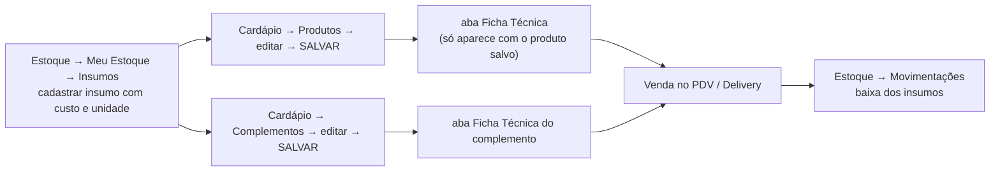
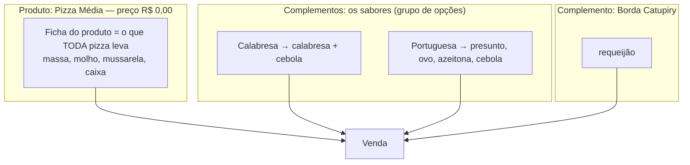

# Plano — manual de Ficha Técnica (exemplo: pizza)

> **Status:** 💡 **ESTUDO — aguardando aprovação.** Nenhum manual foi produzido, nenhuma imagem
> foi capturada, nada foi alterado no sandbox.
> **Data:** 31/08/2026
> **Conta sandbox:** BeeFood3 - Manual — `contato@beefood.com.br` (`https://beefood.app`)
> **Rotas:** `/cardapio` (Produtos e Complementos) e `/meu-estoque` — a ficha é uma **aba** do
> modal de produto/complemento, não tem tela própria
> **Permissão:** nenhuma específica. Depende do submenu **Cardápio** ou **Estoque**
> **API:** `GET /api/estoque2/produtoInsumos/...` · `POST /api/estoque2/insumoProduto` ·
> `DELETE /api/estoque2/insumoProduto/...`

Documento de estudo, no padrão do [`PLANO-PARAMETROS.md`](PLANO-PARAMETROS.md). Serve para o dono
aprovar o recorte **antes** de qualquer captura.

---

## 1. Resumo em cinco linhas

1. A **Ficha Técnica** é a lista de insumos que compõem um produto **ou um complemento**. Ela faz
   duas coisas: calcula o **custo** do item e **baixa o estoque dos insumos quando há venda**.
2. A baixa automática **existe e já rodou neste sandbox**: das 228 movimentações de insumo do ano,
   **170 vieram de venda** (evidência na seção 5).
3. A baixa acontece em **dois níveis**: a ficha do **produto** e a ficha do **complemento
   escolhido como opção** — e é exatamente isso que torna a pizza um exemplo bom.
4. A pizza precisa da ficha **dividida em duas camadas**: a base (massa, molho, mussarela, caixa)
   fica no produto; o recheio de cada sabor fica no complemento do sabor.
5. Existe uma **armadilha de meia pizza** que muda a recomendação do manual, e ela depende de um
   teste que só a venda no PDV responde (seção 6.2).

---

## 2. Não confundir: três coisas com nome parecido

| Nome | Onde fica | O que faz | Manual |
|------|-----------|-----------|--------|
| **Ficha Técnica** | Aba do modal de **produto** e de **complemento** (Cardápio ou Meu Estoque) | Insumos que compõem o item → custo e baixa na venda | **é este estudo** |
| **Receita** + **Produção** | Menu **Estoque → Receitas** e **Estoque → Produção** | Insumo que vira **outro insumo** (maionese da casa, molho especial). Tem rendimento e campo de perda | fora deste manual (proposta na seção 11) |
| **Ficha de consumo** | Configuração → Parâmetros | Papel impresso no PDV (Individual × Lista) | já é o **#45** (`manuais/pdv-fichas/`) |

O sandbox já tem duas receitas ativas — *Maionese da Casa* e *Molho Especial (receita)* —, o que
prova que os três assuntos convivem e que misturá-los no mesmo manual confundiria o leitor.

---

## 3. Onde fica e o que é pré-requisito

Dois pré-requisitos, e os dois derrubam quem tenta começar pela ficha:

1. **O insumo tem que existir antes.** A aba Ficha Técnica só **seleciona** insumo já cadastrado —
   não cria. O cadastro é em **Estoque → Meu Estoque → Insumos** (ou Importar Excel).
2. **O produto precisa estar salvo.** Em produto novo a aba mostra *"Salve o produto primeiro —
   A ficha técnica estará disponível após salvar o produto"*.

Caminhos que chegam à mesma aba: **Cardápio → Produtos**, **Cardápio → Complementos**,
**Estoque → Meu Estoque → Produtos** e **→ Complementos**. No celular a aba é **somente leitura**
(*"Acesse pelo navegador do computador para adicionar ou editar insumos"*).

---

## 4. Os campos, e o que não existe

A aba é enxuta: uma faixa **Adicionar Insumo** e uma tabela.

| Campo | Tipo | Obrigatório | Observação |
|-------|------|-------------|------------|
| **Insumo** | busca (*Buscar insumo…*) | sim | mostra unidade, setor e custo de cada insumo na lista |
| **Quantidade** | texto, até **4 casas decimais** | sim, maior que zero | vírgula brasileira; **Enter** já adiciona |
| **Un.** | somente leitura | — | vem do insumo, não dá para trocar |
| **Custo** (coluna) | calculado | — | `quantidade × custo do insumo` |
| **%** (coluna) | calculado | — | participação daquele insumo no custo total |

**O que o BeeFood não tem** (importante dizer no manual, porque todo mundo pergunta):

- **conversão de unidade** — insumo em KG e receita em gramas viram `0,15`, não `150`;
- **perda / quebra** e **rendimento** na ficha do produto (existem só no módulo Receitas);
- **markup** ou **preço sugerido** — o painel calcula margem, não sugere preço;
- **repetir o mesmo insumo** na ficha — a segunda tentativa devolve *"Este insumo já foi
  adicionado à ficha técnica"*;
- **ficha na opção** do grupo de opções — a ficha mora no produto/complemento que a opção aponta.

---

## 5. As contas — e a baixa, comprovada no sandbox

### As contas

| Onde | Conta |
|------|-------|
| Linha da ficha | `quantidade × custo do insumo` |
| **Custo Total** (rodapé da ficha) | soma das linhas |
| **Custo Ficha Técnica** (aba Produto, só leitura) | o mesmo Custo Total, trazido para o formulário |
| **Custo Total** (aba Produto) | `Custo` (digitado à mão) **+** `Custo Ficha Técnica` |
| Etiqueta de margem | `Lucro = Venda − Custo total` e `Margem = Lucro ÷ Venda × 100` |

Duas consequências que viram alerta no manual: o **Custo** digitado à mão **soma** com o da ficha
(quem preenche os dois conta o custo duas vezes), e a margem é **sobre a venda**, não markup — o
próprio tooltip do sistema faz questão de dizer isso.

### A baixa de estoque (evidência)

Consultei o histórico do sandbox pela API de movimentações (somente leitura, período do ano):

| Tipo de movimentação | Quantidade |
|----------------------|-----------:|
| Produto — por venda | 417 |
| Produto — manual | 66 |
| **Insumo — por venda** | **170** |
| Insumo — manual | 58 |

E a coluna **Descrição** mostra a trilha de onde a baixa veio — em **dois ou três níveis**:

| Trilha | Nível | O que significa |
|--------|-------|-----------------|
| `Açaí Médio -> Copo 550ml - Médio` | 2 | ficha do **produto**: vendeu o açaí, baixou o copo |
| `Açaí Médio -> Açaí - Médio -> Açai KG` | 3 | ficha do **complemento** escolhido como opção: baixou 0,25 KG de açaí |
| `Selecione seu suco -> Suco abacaxi 1L -> Polpa abacaxi` | 3 | mesma coisa, em outro produto |

Das 170 baixas de insumo por venda, **87 são de três níveis** e **83 de dois** — ou seja, a ficha
do complemento funciona tanto quanto a do produto. É a base técnica do exemplo da pizza.

**A quantidade multiplica.** Na venda #218 a baixa foi `-12` de Polpa abacaxi com `origemQtd 4`
(ficha de 3 polpas × 4), e na #222 foi `-3` com `origemQtd 1`. O sistema multiplica a ficha pela
quantidade vendida — falta confirmar se ele faz o mesmo quando a **mesma opção é escolhida duas
vezes** dentro de um item (é o teste da seção 6.2).

**Estorno existe:** a venda #189 tem `-0,35`, `+0,35` e `-0,35` do mesmo insumo — alterar ou
cancelar a venda devolve o insumo ao estoque. Vale uma nota no manual.

---

## 6. O exemplo da pizza

### 6.1 Por que a pizza precisa de duas camadas

No BeeFood a pizza não é um produto só: o preço vem dos **sabores**, e o produto fica com
**R$ 0,00** (é o que o manual **#29** ensina). Com a ficha técnica acontece a mesma divisão:

Ninguém precisa cadastrar "Pizza de Calabresa" com a ficha inteira: cada sabor cuida do que só ele
leva, e a base é cadastrada **uma vez**. Quatro sabores × ficha completa seria quatro vezes o mesmo
trabalho — e quatro lugares para errar quando a mussarela mudar de preço.

### 6.2 A armadilha da metade (a decisão do manual)

A ficha do sabor é baixada **uma vez por opção escolhida**. E o número de opções muda conforme o
modelo de preço do #29:

| Modelo (#29) | Grupo | Pizza de 1 sabor | Meio a meio |
|--------------|-------|------------------|-------------|
| **A — Valor da Maior** | mín 1 / máx 2, opção 0-1 | **1** opção | **2** opções |
| **B — Proporcional** | mín 2 / máx 2, opção 0-2 | **2** opções (o mesmo sabor 2×) | **2** opções |

Daí sai a conclusão que o manual precisa dar de bandeja:

| Modelo | Ficha do sabor cadastrada como… | Pizza de 1 sabor | Meio a meio |
|--------|--------------------------------|------------------|-------------|
| A | pizza inteira | ✅ certo | ❌ baixa o **dobro** |
| A | meia pizza | ❌ baixa **metade** | ✅ certo |
| **B** | **meia pizza** | ✅ certo (2 × meia) | ✅ certo |

**No Modelo A não existe cadastro que acerte os dois casos.** Quem quer estoque de pizza batendo
usa o **Modelo B (Proporcional)** com a ficha do sabor em **meia pizza** — o mesmo modelo que já
fazia a média do preço no #29. É a descoberta que dá título ao manual.

> **Isso depende de um teste.** O Modelo B só fecha se o sistema multiplicar a ficha pela
> quantidade da opção (sabor escolhido 2× → baixa 2×). O histórico do sandbox indica que sim
> (seção 5), mas a prova é vender uma pizza inteira de calabresa no PDV e conferir se a calabresa
> saiu **0,12 KG** e não 0,06. **Se o teste falhar**, o manual muda de recomendação: cadastra-se a
> ficha do sabor pela pizza inteira, usa-se o Modelo A e o texto assume o erro no meio a meio.

### 6.3 Cenário proposto (números para conferir na tela)

Insumos a cadastrar em **Estoque → Meu Estoque → Insumos**:

| Insumo | Un. | Custo |
|--------|-----|------:|
| Farinha de trigo | KG | R$ 4,50 |
| Molho de tomate | KG | R$ 12,00 |
| Mussarela | KG | R$ 38,00 |
| Caixa de pizza | UN | R$ 1,20 |
| Calabresa | KG | R$ 28,00 |
| Cebola | KG | R$ 5,00 |
| Presunto | KG | R$ 24,00 |
| Ovo | UN | R$ 0,70 |
| Azeitona | KG | R$ 22,00 |
| Requeijão | KG | R$ 32,00 |

**Ficha do produto Pizza Média** (a base):

| Insumo | Qtd | Un. | Custo | % |
|--------|----:|-----|------:|--:|
| Farinha de trigo | 0,25 | KG | R$ 1,13 | 12,5% |
| Molho de tomate | 0,08 | KG | R$ 0,96 | 10,7% |
| Mussarela | 0,15 | KG | R$ 5,70 | 63,4% |
| Caixa de pizza | 1 | UN | R$ 1,20 | 13,4% |
| **Custo Total** | | | **R$ 8,99** | 100% |

**Fichas dos complementos** (quantidade de **meia** pizza — Modelo B):

| Complemento | Insumos | Custo |
|-------------|---------|------:|
| **Calabresa** | Calabresa 0,06 KG + Cebola 0,02 KG | **R$ 1,78** |
| **Portuguesa** | Presunto 0,05 KG + Ovo 0,5 UN + Azeitona 0,01 KG + Cebola 0,02 KG | **R$ 1,87** |
| **Borda Catupiry** | Requeijão 0,08 KG | **R$ 2,56** |

O **Ovo 0,5 UN** entra de propósito: mostra que dá para usar fração até em unidade.

**As contas que o manual vai fechar** (preços de venda vêm do #29):

| Pedido | Custo | Venda | Margem |
|--------|------:|------:|-------:|
| Pizza inteira de Calabresa | 8,99 + 2 × 1,78 = **R$ 12,55** | R$ 40,00 | 68,6% |
| Meio a meio Calabresa + Portuguesa | 8,99 + 1,78 + 1,87 = **R$ 12,64** | R$ 42,50 | 70,3% |
| Meio a meio + Borda Catupiry | 12,64 + 2,56 = **R$ 15,20** | R$ 50,50 | 69,9% |

**Baixa esperada na venda da pizza inteira de calabresa** (o que a tela Movimentações deve mostrar):

| Insumo | Qtd | Trilha esperada |
|--------|----:|-----------------|
| Farinha de trigo | −0,25 | `Pizza Média -> Farinha de trigo` |
| Molho de tomate | −0,08 | `Pizza Média -> Molho de tomate` |
| Mussarela | −0,15 | `Pizza Média -> Mussarela` |
| Caixa de pizza | −1 | `Pizza Média -> Caixa de pizza` |
| **Calabresa** | **−0,12** | `Pizza Média -> Calabresa -> Calabresa` ← **o número que decide o manual** |
| Cebola | −0,04 | `Pizza Média -> Calabresa -> Cebola` |

### 6.4 Duas coisas que o painel não mostra (e o manual precisa avisar)

1. **O custo da pizza montada não existe em lugar nenhum.** O painel mostra R$ 8,99 no produto e
   R$ 1,78 no complemento, cada um no seu modal. Somar base + sabores + borda é conta de quem
   administra — e o manual entrega essa tabela pronta.
2. **A margem da pizza aparece negativa, e está tudo certo.** Como o produto tem preço R$ 0,00 e
   custo de ficha R$ 8,99, a etiqueta ao lado de *Custo Total* mostra **−R$ 8,99 (0,0%)** em
   vermelho. É consequência de o preço vir dos sabores. Onde a margem funciona de verdade é em
   produto de preço próprio (refrigerante, sobremesa) — e o manual mostra os dois casos lado a
   lado para o leitor não achar que está no prejuízo.

---

## 7. Provas a capturar (~17 imagens)

| # | Imagem | Tipo |
|---|--------|------|
| 1 | Meu Estoque → aba **Insumos** (lista, contadores Regular/Sem controle) | contexto |
| 2 | Modal do insumo: Descrição\*, Custo, Unidade, Categoria | setas |
| 3 | Aba **Estoque** do insumo: Controlar Estoque, mínimo, aceita negativo | setas |
| 4 | Aba **Ficha Técnica** vazia com a faixa **Adicionar Insumo** | setas |
| 5 | Ficha de um **produto simples** preenchida: Custo Total e coluna % | setas |
| 6 | Aba **Produto** do mesmo item: Custo, Custo Ficha Técnica, Custo Total e a margem verde | setas |
| 7 | Ficha do produto **Pizza Média** (4 insumos, R$ 8,99) | setas |
| 8 | Margem **vermelha** da pizza (preço R$ 0,00) — o alerta | setas |
| 9 | Ficha do complemento **Calabresa** (meia pizza) | setas |
| 10 | Ficha do complemento **Portuguesa** | contexto |
| 11 | Ficha da **Borda Catupiry** | contexto |
| 12 | Meu Estoque → Produtos com a coluna **Ficha Técnica = Sim** e o filtro | setas |
| 13 | PDV: pizza **inteira de calabresa** montada (2 metades) — R$ 40,00 | setas |
| 14 | **Movimentações** da venda: as baixas de 2 e 3 níveis — **a prova** | setas |
| 15 | PDV: **meio a meio** — R$ 42,50 | contexto |
| 16 | Movimentações do meio a meio (calabresa −0,06 e presunto −0,05) | setas |
| 17 | Editar quantidade na linha (lápis → ✓) e o diálogo **Remover Insumo** | setas |

---

## 8. Estrutura proposta do manual

**Opção A (recomendada) — um manual: `#72 Ficha técnica: o custo do prato`**

1. O que é a ficha técnica e as duas coisas que ela faz (custo e baixa de estoque)
2. Não confundir com Receita, Produção e ficha de consumo
3. Pré-requisito: cadastrar o insumo (custo, unidade, controlar estoque)
4. Ficha de um produto simples, do começo ao fim
5. O que a ficha calcula: custo da linha, %, Custo Total, Custo Ficha Técnica, margem
6. **A pizza: por que a ficha se divide em duas camadas**
7. Cadastrar a ficha da base (Pizza Média)
8. Cadastrar a ficha de cada sabor — e por que a quantidade é de **meia** pizza
9. A conta completa da pizza (tabela) e a margem vermelha que não é prejuízo
10. A prova: venda no PDV e a baixa em Movimentações
11. Manter a ficha: mudou o custo do insumo, mudou tudo; editar e remover linha
12. Limites e erros comuns (sem conversão de unidade, custo em dobro, mobile só leitura, insumo repetido)
13. Perguntas frequentes

**Opção B — dois manuais:** `#72` fundamentos (produto simples) e `#73` pizza. Fica mais leve de
ler, mas separa a descoberta principal do assunto que a explica. **Recomendo a Opção A**, no mesmo
espírito dos manuais de cardápio #27–#31: um assunto, um cenário completo, contas conferidas.

---

## 9. Perguntas que só a execução responde

1. **A opção escolhida duas vezes baixa em dobro?** É a pergunta da seção 6.2 e define a
   recomendação do manual.
2. **A baixa acontece com *Controlar Estoque* desligado no insumo?** Hoje 18 insumos do sandbox
   estão "Sem Controle" e mesmo assim têm histórico de baixa. Se a resposta for sim, o manual
   precisa explicar que o consumo é registrado, mas o saldo só existe com o controle ligado.
3. **Cancelar a venda devolve os insumos?** O histórico mostra estorno; falta confirmar em que
   ação exatamente ele acontece.
4. **A Importação de NF-e atualiza o custo do insumo** (e portanto a ficha inteira)? Se sim, vale
   um parágrafo — é o que mantém a ficha viva sem trabalho manual.
5. **O produto "esgota" no cardápio quando o insumo zera?** O front cita esse comportamento; se for
   verdade, é um argumento forte para o leitor.

---

## 10. O que preciso do dono antes de começar

1. **Base do cardápio.** Hoje o sandbox é uma **hamburgueria** (67 produtos, 41 complementos,
   7 setores) e **não existe pizza** — o cenário do #29 já foi limpo. Prefiro a base limpa antes de
   começar (regra do bloco de cardápio), mas dá para criar o setor **Pizzas** por cima do que existe.
   **Decide o dono.**
2. **Insumos atuais.** São 21, vários de teste (`Maionse`, `Temero y`, custo R$ 0,00). Posso
   ignorá-los e cadastrar os dez novos, ou o dono limpa junto com o resto.
3. **Duas vendas reais no PDV** para provar a baixa (é sandbox, mas confirmo por escrito).
4. **Recorte e número:** Opção A (um manual, **#72**) ou Opção B (dois).
5. Confirmar se **Receitas + Produção** viram um manual próprio depois (seção 11).

---

## 11. Fora deste manual

| Assunto | Onde está | Sugestão |
|---------|-----------|----------|
| **Receitas + Produção** | `Estoque → Receitas` e `→ Produção` | manual próprio (**#73**): insumo que vira insumo, com rendimento e perda |
| Movimentação manual de estoque, saldo, mínimo | `Estoque → Meu Estoque` e `Movimentações` | manual próprio de estoque (já está no backlog) |
| Importar NF-e | `Estoque → Importar NFe` | manual próprio |
| Ficha de consumo do PDV | Parâmetros | já é o **#45** |
| Preço da pizza (Valor da Maior × Proporcional) | Cardápio | já é o **#29** — este manual **cita** e não repete |

---

## 12. Checklist de execução (depois de aprovado)

1. Criar `manuais/ficha-tecnica/` com o padrão completo (`MEMORIA.md`, `fluxo-codigo.md`,
   `<nome>.md`, `texto-documentation.ia.md`, `annotate.py`, `imagens-puras/`, `imagens-tratadas/`).
2. Cadastrar os dez insumos e montar a pizzaria (setor, sabores, bordas, produto R$ 0,00).
3. Cadastrar as fichas e conferir os custos contra a tabela da seção 6.3.
4. **Rodar o teste da seção 6.2 antes de escrever o texto** — ele decide a recomendação.
5. Capturar com Playwright (1440×900, DPR 1,5, tema claro, `LANG=pt_BR.UTF-8`, esperar o spinner
   sumir **e mais 5 segundos**).
6. Anotar com `annotate.py` e validar com `python3 validar-imagens.py ficha-tecnica`.
7. Atualizar `CHECKLIST-MANUAIS.md`, `MEMORIA-GERAL.md` e `spec.md`.
8. Commits `docs(#72): ...`, sempre com push.
