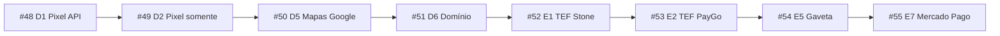

# Plano — migração do manual antigo (ajuda.beefood.com.br)

> **Status:** ✅ Produzidos (#48–#55) em 22/08/2026.  
> **Última atualização:** 22/08/2026  
> **Conta sandbox:** BeeFood3 - Manual — `contato@beefood.com.br` (`https://beefood.app`)  
> **Fonte antiga:** [https://ajuda.beefood.com.br](https://ajuda.beefood.com.br) (sitemap `sitemap.xml` → `lipi_kb-sitemap.xml`)

Documento mestre desta fila. Consultar **antes de iniciar cada manual**.

---

## 1. Recorte aprovado

Do levantamento do manual antigo, o dono escolheu **oito** itens. O resto da lista anterior **não entra** nesta fila.

| Código | Artigo antigo | Nº novo | Pasta |
|--------|---------------|---------|-------|
| **D1** | [API de Conversões + Pixel da Meta (Novo)](https://ajuda.beefood.com.br/baseconhecimento/como-criar-uma-api-de-conversoes-e-pixel-da-meta-para-seu-cardapio-digital-novo/) | **#48** | `manuais/pixel-meta-api/` |
| **D2** | [Pixel da Meta somente (Antigo)](https://ajuda.beefood.com.br/baseconhecimento/como-criar-um-pixel-do-facebook-para-seu-cardapio-digital/) | **#49** | `manuais/pixel-meta-somente/` |
| **D5** | [Mapas do Google no Cardápio Digital](https://ajuda.beefood.com.br/baseconhecimento/como-configurar-mapas-do-google-no-cardapio-digital/) | **#50** | `manuais/mapas-google/` |
| **D6** | [Domínio próprio + verificação no Facebook](https://ajuda.beefood.com.br/baseconhecimento/utilizando-dominio-proprio-no-cardapio-digital-e-verificando-no-facebook/) | **#51** | `manuais/dominio-proprio/` |
| **E1** | [TEF Stone (AutoTEF)](https://ajuda.beefood.com.br/baseconhecimento/tef-stone-manual-de-configuracao/) | **#52** | `manuais/tef-stone/` |
| **E2** | TEF / PayGo / Client PayGo | **#53** | `manuais/tef-paygo/` |
| **E5** | Gaveta de dinheiro (artigo interno) | **#54** | `manuais/gaveta-dinheiro/` |
| **E7** | Mercado Pago (cartão no cardápio) | **#55** | `manuais/mercado-pago/` |

`#47` já é **Avisos do cardápio digital**. Esta fila começa no **#48**.

---

## 2. Sequência de produção (obrigatória)

Ordem do dono. Um de cada vez.

| Ordem | Nº | Manual | Por que nesta posição |
|-------|----|--------|------------------------|
| **1º** | #48 | Pixel Meta + API de Conversões | Tela nova compartilhada com o #49; método recomendado no produto |
| **2º** | #49 | Pixel Meta somente | Mesmo modal do #48; só o campo Pixel ID |
| **3º** | #50 | Mapas Google | Independente; artigo antigo só mostrava o Windows |
| **4º** | #51 | Domínio próprio | Independente; no web **não há campo** — só suporte |
| **5º** | #52 | TEF Stone | Hardware + tela nova `/configuracao-tef` |
| **6º** | #53 | TEF PayGo | Mesma página do #52; depois de Stone |
| **7º** | #54 | Gaveta | Risco: **não há tela web** no React; pode travar |
| **8º** | #55 | Mercado Pago | “Se conseguir”; artigo antigo 404; modal novo existe |

Fila executada de ponta a ponta a pedido do dono (22/08/2026). #53 recebeu os 3 artigos liberados (Stone config + A001 no #52; PayGo Client no #53). #54 copiado como config de impressora. #55 com o artigo do Mercado Pago.

---

## 3. Regra de ouro desta fila (D1, D2, D5, E7)

O dono pediu: **mostrar a tela nova** e **migrar somente a imagem em que se cola a configuração final**.

Isso vale para **#48, #49, #50 e #55**:

1. **Lado externo** (Meta, Google Cloud, Mercado Pago): reaproveitar o passo a passo do artigo antigo (texto + prints do painel de terceiros). Não recriar o Gerenciador de Eventos / Cloud Console do zero, a menos que a tela externa tenha mudado a ponto de quebrar o texto.
2. **Lado BeeFood:** **não** usar print antigo de *Cardápio Digital → aba Marketing* nem de *BeeFood Windows*. Capturar a **tela nova** e anotar **só o campo** onde cola Pixel ID, Token, chave de Maps, Public Key / Access Token.
3. Uma (no máximo duas) imagens do BeeFood por esses manuais: a lista/cardápio se for preciso chegar no modal, e o **modal com o campo final**.
4. Não ensinar a operar o cardápio, o PDV nem o pedido.

**#51 (D6)** é exceção: não existe campo para colar. O artigo antigo inteiro (DNS + TXT do Facebook) entra; a tela nova é o modal *Domínio Personalizado* (contato com o suporte).

**#52 e #53 (TEF):** o Slim/PayGo no Windows continua; a parte “cadastre no BeeFood” vira a tela nova **Configuração → TEF**.

---

## 4. Tela nova de cada item (código)

Código de referência (somente leitura): `~/refs/beefood-web-react`.

| Nº | Caminho no produto | Componente | O que o print final mostra |
|----|--------------------|------------|----------------------------|
| #48 | **Aplicativos → Marketing e CRM → Facebook Pixel** → Configurar | `FacebookPixelContent` + `ModalFacebookPixel` | **Pixel ID Delivery** + **Token Delivery** (`fbPixel`, `fbPixelT`) |
| #49 | Mesmo modal | idem | Só **Pixel ID Delivery** (`fbPixel`). Sem token. Presencial só se o texto antigo pedir |
| #50 | **Aplicativos → Entrega → Mapas Google** → Configurar | `GoogleMapsModal` + `GoogleMapsConfigModal` | Campo **chave da API** (`googleMapsKey`) |
| #51 | **Aplicativos → Marketing e CRM → Domínio Próprio** | `DominioModal` | Modal “fale com o suporte”. Sem input |
| #52 | **Configuração → TEF** (`/configuracao-tef`) → **Novo TEF Stone (F1)** | `ConfiguracaoTef` + `ModalEditarTefConfig` (`tipoIndex` 4) | **Código Terminal** + **Porta Pin Pad** (+ título/vias) |
| #53 | Mesma página → **Novo TEF PayGo (F2)** | idem (`tipoIndex` 1) | Título + vias. PayGo **não** tem StoneCode/porta no modal |
| #54 | **Não encontrado no web React** | — | Ver §7 |
| #55 | **Aplicativos → Pagamento Online → Mercado Pago** | `MercadoPagoContent` + `ModalMercadoPago` | **Public Key**, **Access Token**, switch *Habilitar Cartão de Crédito* |

O card **Aplicativos → AutoTEF Stone / TEF PayGo** é só contratação (quantidade + preço + suporte). **Não é** a tela de cadastro. Cadastro = `/configuracao-tef`.

O modal de Pixel também tem **Pixel ID Presencial** e **Token Presencial**. No #48 o texto antigo fala só Delivery; presencial entra só se o dono pedir.

---

## 5. Manual por manual

### #48 — Pixel Meta + API de Conversões (D1) — 1º

**Pasta:** `manuais/pixel-meta-api/`  
**Antigo:** criar fonte Web → “API de Conversões e Pixel da Meta” → copiar Identificador e Token.  
**BeeFood antigo (não migrar print):** *Cardápio Digital → aba Marketing → Pixel / Token*.  
**BeeFood novo:** Aplicativos → Facebook Pixel → modal *Pixel da Meta (Facebook)*.

- Eventos rastreados (ViewContent, AddToCart, InitiateCheckout, Purchase): manter do antigo.
- Prints da Meta: reaproveitar os do artigo (2024/2025).
- Print BeeFood: **só o modal novo** com setas em Pixel ID Delivery e Token Delivery (botão *Adicionar token*).
- Grava com **SALVAR (F2)**.
- Não documentar BeeFood Pixel Analytics (#17) — é outro produto.

### #49 — Pixel Meta somente (D2) — 2º

**Pasta:** `manuais/pixel-meta-somente/`  
**Antigo:** criar Pixel “somente Meta”, copiar o ID, colar em “Pixel da Meta Somente”.  
**BeeFood novo:** o mesmo modal do #48; **não preencher token**.

- Abrir dizendo que a API de Conversões (#48) é o método recomendado; este é o caminho antigo / só Pixel.
- Print BeeFood: **só o campo Pixel ID Delivery** na tela nova.
- Reaproveitar a captura do #48 se o recorte servir; senão capturar de novo com o token vazio.
- Link para “como testar o Pixel” do antigo: **não migrar** (não está nesta fila).

### #50 — Mapas Google (D5) — 3º

**Pasta:** `manuais/mapas-google/`  
**Antigo:** crédito Google ($300 / $200), APIs (Geocoding, Maps JS, Places New, Routes), criar chave — e no fim **só o Windows**.  
**BeeFood novo:** Aplicativos → Entrega → Mapas Google → modal da chave.

- Manter o tutorial do Google Cloud (é o grosso do artigo, 13 mil views).
- **Substituir** o print do Windows pela tela nova: campo da chave + validação (`GoogleMapsApiValidatorPanel`) se ela aparecer depois de colar.
- Não ensinar a desenhar área de entrega (#34–#38 já cobrem).

### #51 — Domínio próprio (D6) — 4º

**Pasta:** `manuais/dominio-proprio/`  
**Antigo:** DNS (Registro.br e HostGator) + TXT da Meta via suporte.  
**BeeFood novo:** modal *Domínio Personalizado* — exemplos de domínio e botão de suporte. **Não há campo para o usuário colar DNS.**

- Migrar o artigo quase inteiro (prints de Registro.br / HostGator).
- Trocar “entre em contato com o time” pela tela nova + `ModalSuporte`.
- Não inventar um formulário que o produto não tem.

### #52 — TEF Stone / AutoTEF (E1) — 5º

**Pasta:** `manuais/tef-stone/`  
**Antigo:** pinpads homologados, Slim em `C:\autotef`, inicializar no Windows, depois Gerenciador TEF + StoneCode + Porta no **Windows**.

- Manter instalação do Slim (é setup, não uso de tela).
- **Substituir** o print `tefstone.png` do Windows por **Configuração → TEF → Novo TEF Stone**: Código Terminal + Porta Pin Pad.
- O card Aplicativos → AutoTEF Stone só entra se precisar falar de contratação (qtd / R$ 39,90). O cadastro não é ali.
- Artigo interno “troca TEF → AutoTEF” (erro A001): **não** vira manual próprio; no máximo uma dica de “peça à Stone o produto AutoTEF”.

### #53 — TEF PayGo (E2) — 6º

**Pasta:** `manuais/tef-paygo/`  
**Antigos:** `tef/` (DLL até Windows 2.1.4.8), `tef-client-paygo-...` (a partir de 2.1.4.9), `autotef-stone-procedimento-troca...`. Os três estão em **Procedimentos Internos** (login).

- Manual de usuário = tela nova **Novo TEF PayGo** (título + vias). Sem StoneCode.
- Instalação do Client PayGo no Windows: só entra se o dono **liberar o artigo interno** ou mandar o texto. Sem isso, o #53 fica só no web + “instale o Client PayGo com o suporte”.
- DLL antiga (≤ 2.1.4.8): **não migrar**.

### #54 — Gaveta de dinheiro (E5) — 7º

**Pasta:** `manuais/gaveta-dinheiro/` (só criar se destravar)  
**Antigo:** interno; print de gaveta na impressora Control iD.

**Bloqueio:** no `beefood-web-react` **não existe** campo/tela “gaveta”. O que existe é `openDrawer` na ponte de impressão Android (`ANDROID_PRINT.md`) — não é tela de configuração do painel. `ModalEditarImpressora` também não fala em gaveta.

Antes de produzir: o dono confirma **onde** isso se configura hoje (Windows / painel da impressora / Impressão web). Sem tela, este item **pula**.

### #55 — Mercado Pago (E7) — 8º

**Pasta:** `manuais/mercado-pago/`  
**Antigo:** slug `configuracao-mercado-pago-para-cartao-de-credito-no-cardapio-digital` — **404**. O modal novo ainda aponta para essa URL no botão de ajuda.

- **Dá para migrar o lado BeeFood:** Aplicativos → Mercado Pago → modal *Public Key* + *Access Token* + switch.
- Lado Mercado Pago (como gerar as chaves): só se o dono mandar o artigo antigo ou um print do painel MP. Sem isso, o manual fica curto: “gere no Mercado Pago e cole aqui”, **uma imagem** do modal novo.
- Não documentar Pix Online (app separado).

---

## 6. Regras que valem para os oito

1. Um assunto = uma pasta no padrão do `CHECKLIST-MANUAIS.md`.
2. Manuais do **painel web desktop**. Não documentar as páginas `Mobile*`.
3. Playwright: 1440×900, DPR 1.5, tema claro, `LANG=pt_BR.UTF-8`, esconder `div.fixed.bottom-6` e toasts. Depois de cada clique: spinner some, **depois 5 s**, só então o print.
4. Prefixo de commit: `docs(#NN): ...`
5. Validar: `python3 validar-imagens.py <pasta>`
6. Não gravar token/chave reais de produção no texto. No sandbox, mascarar token longo (o próprio modal já mostra `abc...xyz`).
7. Restaurar o sandbox no fim se tiver gravado chave de teste.
8. `#48` e `#49` compartilham modal: capturar no #48 pensando no recorte do #49.
9. `#52` e `#53` compartilham `/configuracao-tef`. Limite contratado (`qtdTefStone` / `qtdTefPayGo`) pode zerar o botão Novo — diagnosticar pela API/cache **antes** de planejar a captura.
10. Não produzir até o dono pedir o da vez.

---

## 7. Riscos e pendências com o dono

| Item | Risco | O que precisa |
|------|--------|----------------|
| #49 vs #48 | Dois manuais no mesmo modal | Confirmar que quer dois artigos (antigo + novo), não um só com dois caminhos |
| #51 | Sem campo de DNS no web | Ok seguir com suporte + prints de Registro.br |
| #53 | Artigos PayGo internos | **Resolvido:** dono liberou o Client PayGo; migrado no #53 |
| #54 | Sem tela no React | **Resolvido:** copiado como config de impressora (Control iD) |
| #55 | Artigo antigo 404 | **Resolvido:** artigo voltou; tutorial MP + modal novo |
| TEF no Cloud Agent | Sem pinpad / Slim / Windows | #52/#53 = só a tela web; Slim/PayGo com prints do artigo antigo ou do dono |

---

## 8. Como retomar

1. Ler `MEMORIA-GERAL.md`.
2. Ler **este arquivo**.
3. A fila **#48–#55** já foi produzida.
4. Próximo passo: o dono publica e avisa — só então marcar 🌐 no checklist.
