# App do entregador: receber na porta

Este é o manual do dinheiro. Você chegou, entregou, e agora recebe — em dinheiro, no cartão, no
Pix ou no vale — e o aplicativo registra isso no caixa do restaurante na hora.

> **A tela de pagamento pode estar desligada.** Cada restaurante decide, num parâmetro do painel,
> se o aplicativo do entregador tem tela de pagamento. É a **seção 1**, e é por onde começar: com a
> chave desligada, o entregador entrega e o pagamento é lançado só no caixa, pela loja. De fábrica
> a chave vem **ligada**, e tudo o que vem depois da seção 1 descreve esse modo.

> **Cobrar é finalizar.** Não existe "recebo agora e finalizo depois": no fim da cobrança a
> entrega é encerrada na mesma operação, e o pedido sai da sua lista.

Com a tela de pagamento ligada são três caminhos, e o rodapé da entrega mostra os dois primeiros:

| Caminho | Quando |
|---------|--------|
| **INICIAR COBRANÇA** | o cliente paga na porta |
| **DIVIDIR CONTA**, dentro da cobrança | mais de uma pessoa paga, cada uma do seu jeito |
| **FINALIZAR SEM COBRAR** | você entregou e não recebeu nada — e precisa explicar por quê |

> As imagens têm **setas numeradas** (1, 2, 3…). Cada número indica o campo correspondente na
> tela.

## Para que serve

- Escolher, no painel, **se o entregador cobra pelo celular** ou se o pagamento é lançado no caixa.
- Receber do cliente e registrar no caixa do restaurante sem ligar para a loja.
- Registrar **o que aconteceu de verdade**, mesmo quando é diferente do combinado.
- Encerrar a entrega — com pagamento ou sem — deixando explicação no histórico.

## Antes de começar

- Saiba em que modo o seu restaurante está: **com ou sem tela de pagamento** no aplicativo
  (seção 1).
- Confira a sacola **antes** de tocar em qualquer botão. Depois de confirmar, o valor está no
  caixa.
- O celular precisa de **internet**: a cobrança é registrada no servidor, não no aparelho.
- **Troco é sua responsabilidade.** O aplicativo calcula; o dinheiro é seu.

---

## 1. O restaurante decide se o entregador cobra

A tela de pagamento do aplicativo é **opcional**. Quem liga e desliga é o dono ou o gerente, no
computador, e a escolha muda tudo o que vem depois neste manual.

**Configuração → Parâmetros**, card **Delivery**. A alteração **grava sozinha**: não existe botão
de salvar, e logo depois de mexer na chave aparece o aviso *Parâmetros salvos*.

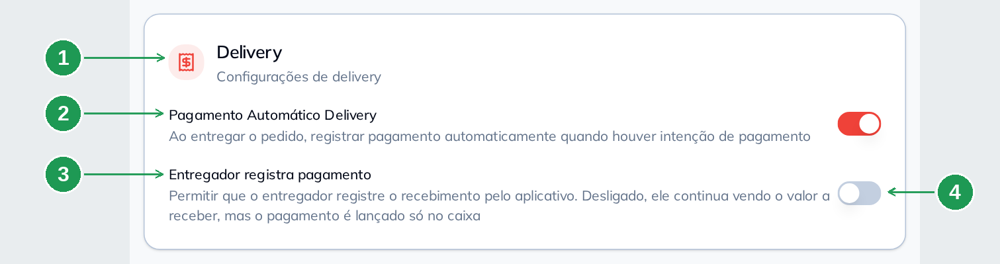

| Nº | Onde | O que é |
|----|------|---------|
| 1. | **Card Delivery** | Onde as duas chaves do delivery moram, uma embaixo da outra. |
| 2. | **Pagamento Automático Delivery** | **Não é esta.** É a vizinha, que registra o pagamento sozinho quando o pedido chega em *Entregue* — ela tem [manual próprio](../delivery-pagamento-auto/delivery-pagamento-auto.md). |
| 3. | **Entregador registra pagamento** | É esta. *"Permitir que o entregador registre o recebimento pelo aplicativo."* |
| 4. | **O interruptor** | Neste exemplo está **desligado**. De fábrica ele vem **ligado**. |

**Os nomes são parecidos e as duas chaves são vizinhas.** Confira o nome antes de mexer: a de
cima trata do pagamento automático no painel, a de baixo é a que tira ou põe a tela de pagamento
no celular do entregador.

### O que muda no celular

| No aplicativo | **Ligada** (padrão de fábrica) | **Desligada** |
|---|---|---|
| O valor a receber | aparece no rodapé da entrega | **continua aparecendo** |
| **INICIAR COBRANÇA** | abre a tela de pagamento | não abre a tela: o aplicativo avisa que o **pagamento pelo aplicativo está desativado** e que a loja pediu para registrar o recebimento só no caixa |
| Quem lança o pagamento | o entregador, na porta | o restaurante, no caixa |
| Como o entregador encerra | cobrando (seções 3 e 4) ou **FINALIZAR SEM COBRAR** (seção 5) | **FINALIZAR SEM COBRAR** (seção 5), com observação |

**Desligada não quer dizer "entrega de graça".** O entregador continua vendo quanto tem de
receber, continua recebendo o dinheiro do cliente e continua prestando contas na loja. O que muda
é onde o pagamento é lançado: no caixa do restaurante, e não pelo celular.

### Quando vale desligar

| Situação da loja | Por quê |
|------------------|---------|
| O caixa da loja lança tudo | quem fecha o caixa quer um só lugar de lançamento |
| Os pedidos já chegam pagos | marketplace e Pix antecipado não têm cobrança na porta |
| Entregador terceirizado ou de rodízio | o celular dele deixa de poder registrar dinheiro no seu caixa |
| Você usa o **Pagamento Automático Delivery** | o pagamento é registrado sozinho ao chegar em *Entregue*; a cobrança na porta seria um segundo caminho para a mesma coisa |

> **Se desligar esta, olhe a chave de cima.** Com o **Pagamento Automático Delivery** ligado, o
> pedido que tem **intenção de pagamento** gravada é registrado como pago ao chegar em *Entregue*
> — e a finalização do entregador leva o pedido para lá. É a combinação que evita o pedido ficar
> em aberto sem ninguém lançar. Com **as duas desligadas**, alguém na loja tem de lançar o
> pagamento à mão, e a observação que o entregador escreve ao finalizar passa a ser a única pista
> do que foi recebido.

**A mudança vale para todos os entregadores da loja**, não dá para ligar em um e desligar em
outro. Se o entregador já estava com o aplicativo aberto quando você mexeu na chave, peça para ele
atualizar a lista de *Entregas* — arrastando a tela para baixo — ou sair e entrar de novo.

---

## 2. Por onde a cobrança começa

> Desta seção em diante o manual descreve o modo **ligado**, com tela de pagamento. Se a chave da
> seção 1 está desligada, o que vale para o entregador é o rodapé da entrega e o **FINALIZAR SEM
> COBRAR** da seção 5.

Nos detalhes da entrega, o rodapé escuro traz o resumo do dinheiro e os dois botões.

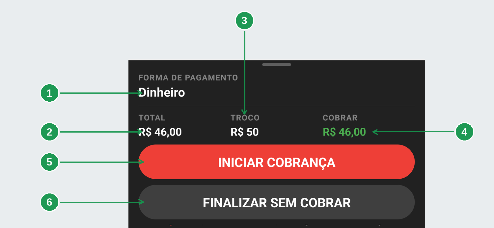

| Nº | Onde | O que é |
|----|------|---------|
| 1. | **Forma de pagamento** | O que o cliente **disse** ao pedir. Não é o que ele vai pagar. |
| 2. | **TOTAL** | O valor do pedido. |
| 3. | **TROCO** | Para quanto o cliente pediu troco, quando pediu. |
| 4. | **COBRAR**, em verde | O que você tem de receber agora. É este o número que importa. |
| 5. | **INICIAR COBRANÇA** | Abre a tela de pagamento. |
| 6. | **FINALIZAR SEM COBRAR** | Encerra sem registrar pagamento (seção 5). |

**A forma no rodapé é uma previsão.** Quem decide na porta é o cliente, e você registra o que
aconteceu de fato.

### Se o pedido tem item em destaque, o aplicativo pergunta antes

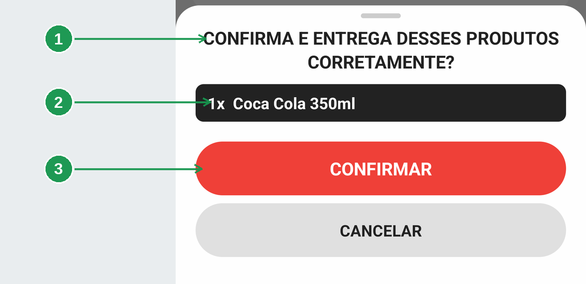

| Nº | Onde | O que é |
|----|------|---------|
| 1. | **CONFIRMA E ENTREGA DESSES PRODUTOS CORRETAMENTE?** | A pergunta que aparece antes de cobrar ou de finalizar. |
| 2. | **A linha preta** | O item que precisa de conferência: o refrigerante, o brinde, o que mais volta como reclamação. |
| 3. | **CONFIRMAR** | Só depois dele a cobrança abre. |

**Olhe na sacola antes de tocar.** Essa folha existe porque item esquecido é o que mais gera
reclamação — e ela aparece nos dois caminhos, cobrando ou finalizando sem cobrar.

---

## 3. A tela de pagamento

É a tela central desta operação. Tudo o que você precisa está nela.

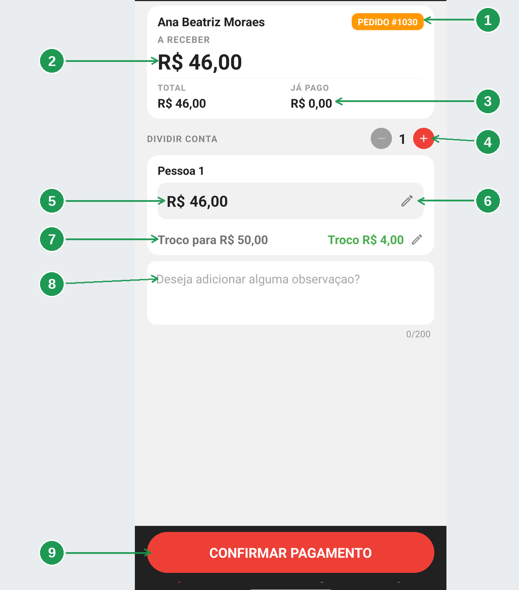

| Nº | Onde | O que é |
|----|------|---------|
| 1. | **PEDIDO #1030** | O número do pedido. **É a única tela do aplicativo que mostra ele** — na lista e nos detalhes o mesmo crachá laranja vem só com o `#`. |
| 2. | **A RECEBER** | O valor grande: é o que falta receber. O **TOTAL**, abaixo, é o valor do pedido. |
| 3. | **JÁ PAGO** | Quanto já foi pago antes. Normalmente R$ 0,00. |
| 4. | **+** do **DIVIDIR CONTA** | Cria uma pessoa a mais. É o assunto da seção 4. |
| 5. | **O valor da Pessoa 1** | Com uma pessoa só, é o valor cheio. |
| 6. | **Lápis** | Edita o valor. Use quando o cliente paga só parte agora. |
| 7. | **Troco para / Troco** | Quanto ele vai entregar, e o troco já calculado em verde. |
| 8. | **Campo de observação** | Até 200 caracteres, para o restaurante. |
| 9. | **CONFIRMAR PAGAMENTO** | Abre a escolha da forma e, no fim, registra. |

Com **uma pessoa** não há campo de forma na tela: o **CONFIRMAR PAGAMENTO** abre a lista de formas
primeiro. Essa é a diferença mais visível entre cobrar direto e cobrar dividido.

### Escolher a forma

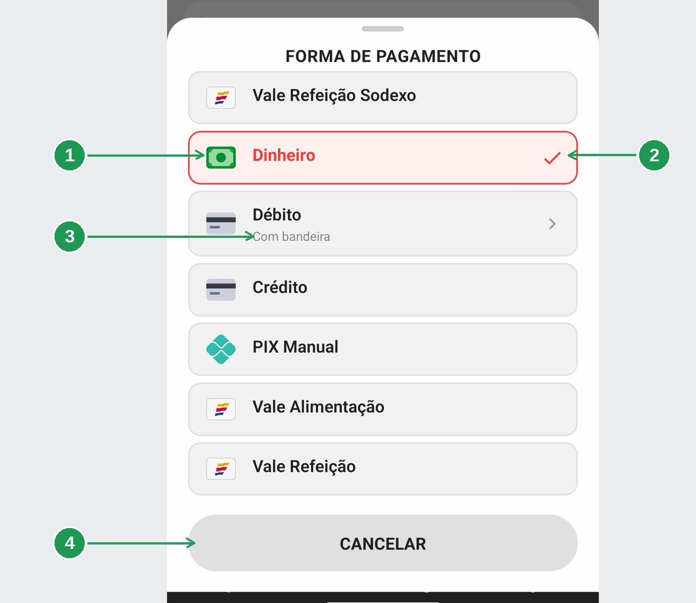

| Nº | Onde | O que é |
|----|------|---------|
| 1. | **Dinheiro** | A forma prevista já vem marcada. Se o cliente mudou de ideia, toque na forma certa. |
| 2. | **O tique vermelho** | Marca a forma escolhida. |
| 3. | **Com bandeira** | As formas de cartão trazem esse aviso e uma seta: dá para escolher a bandeira. |
| 4. | **CANCELAR** | Fecha a lista sem escolher nada. |

**A lista é o que o restaurante habilitou para delivery.** Fiado, Pix automático e as formas de
marketplace não aparecem de propósito: não são dinheiro trocando de mão na calçada.

### A bandeira do cartão é opcional

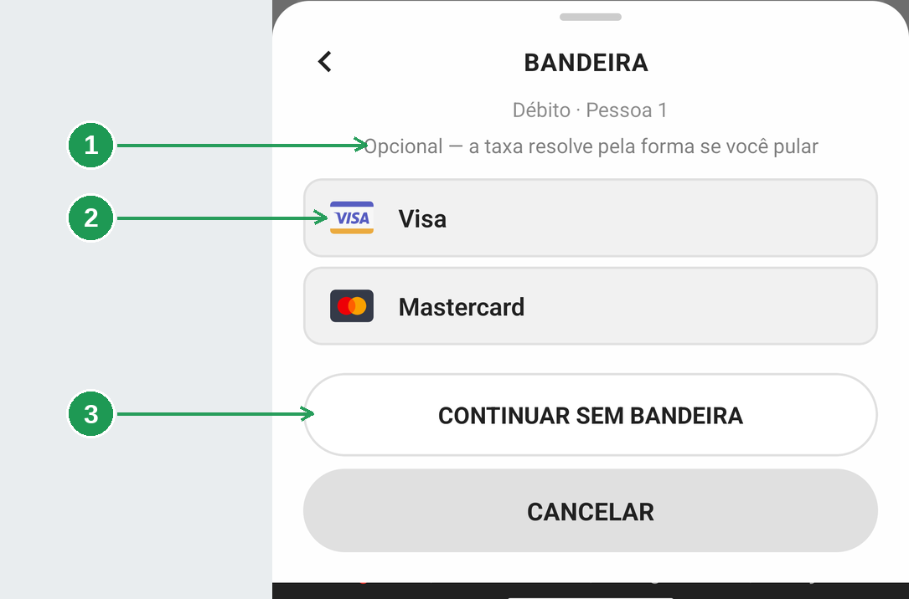

| Nº | Onde | O que é |
|----|------|---------|
| 1. | **Opcional — a taxa resolve pela forma se você pular** | A própria tela diz: pular não quebra nada. |
| 2. | **As bandeiras** | As que o restaurante cadastrou. |
| 3. | **CONTINUAR SEM BANDEIRA** | Registra pela forma, e a taxa se resolve por ela. |

Escolha a bandeira quando souber. Na dúvida, siga sem — melhor sem bandeira do que com a errada.

### Troco, quando é dinheiro

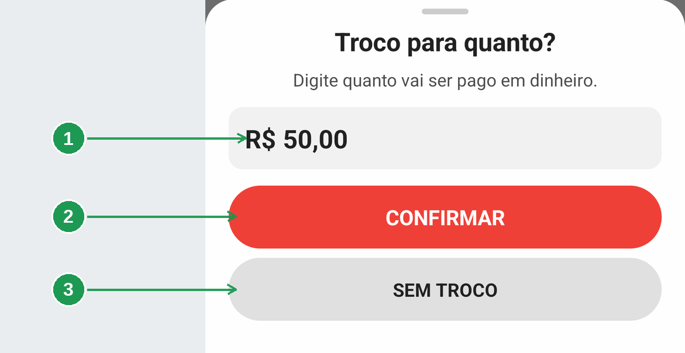

| Nº | Onde | O que é |
|----|------|---------|
| 1. | **O valor** | Já vem preenchido com o que o cliente pediu no pedido. |
| 2. | **CONFIRMAR** | Vale o valor que está no campo. |
| 3. | **SEM TROCO** | Para quem pagou justo. |

Se o cliente chegou com outra nota, **corrija aqui**. O troco que o aplicativo mostra é o que ele
espera receber de volta.

### A última conferência

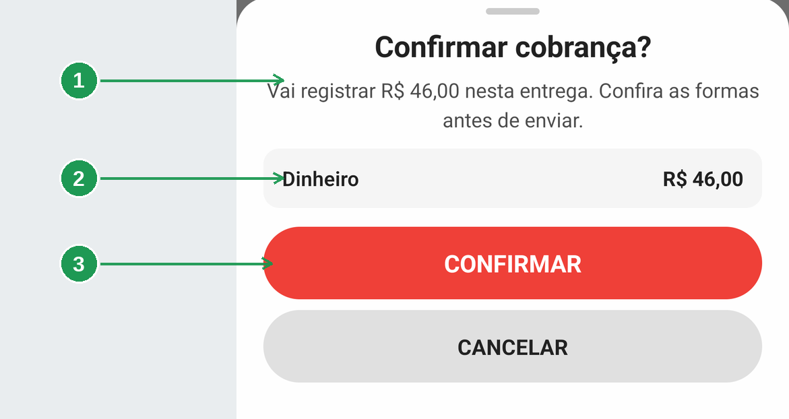

| Nº | Onde | O que é |
|----|------|---------|
| 1. | **Vai registrar R$ … nesta entrega** | O valor exato que entra no caixa. |
| 2. | **A linha da forma** | Cada forma e quanto em cada uma. |
| 3. | **CONFIRMAR** | Depois deste toque, o dinheiro está registrado. |

**Esta é a hora de conferir.** É a última tela antes do registro.

### Pronto

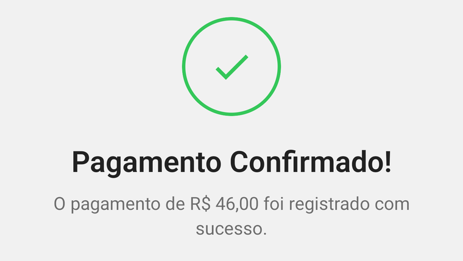

**Pagamento Confirmado!** A entrega foi finalizada junto, e o **VOLTAR PARA ENTREGAS** te devolve
à lista — já sem aquele pedido. Se a entrega fazia parte de uma rota, o contador do cabeçalho sobe:
**1 de 3 entregues**.

A entrega passa a aparecer no seu
[histórico](../app-entregador-entregas-do-dia/app-entregador-entregas-do-dia.md) do dia.

---

## 4. Quando mais de uma pessoa paga

Três amigos pediram juntos e cada um quer pagar a sua parte, um no Pix e outro em dinheiro. É para
isso que existe o **DIVIDIR CONTA**: em vez de uma cobrança, você registra **uma por pessoa**,
cada uma com a sua forma.

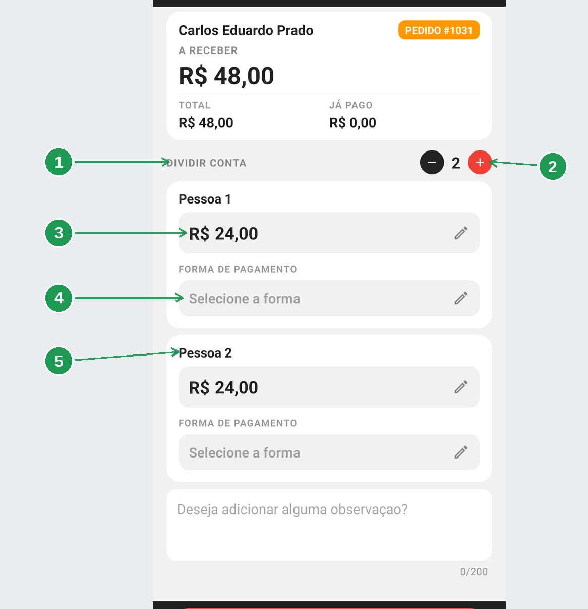

| Nº | Onde | O que é |
|----|------|---------|
| 1. | **DIVIDIR CONTA** | O contador mostra em quantas partes a conta está. |
| 2. | **+** | Cada toque cria uma pessoa. O **−** ao lado volta atrás e junta as partes. |
| 3. | **O valor da pessoa** | O aplicativo divide **em partes iguais**: R$ 48,00 viraram duas de R$ 24,00. |
| 4. | **Selecione a forma** | Campo que só existe na divisão: aqui cada pessoa tem a sua forma. |
| 5. | **Pessoa 2** | Um bloco por pessoa, um embaixo do outro. |

**Na divisão, nenhuma forma vem marcada.** É esperado: com a conta dividida o aplicativo não tenta
adivinhar quem paga como.

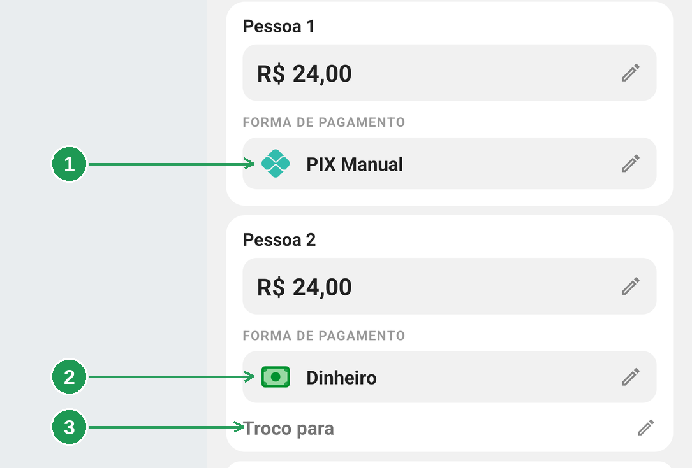

| Nº | Onde | O que é |
|----|------|---------|
| 1. | **A forma da Pessoa 1** | Pix, no exemplo. |
| 2. | **A forma da Pessoa 2** | Dinheiro. |
| 3. | **Troco para** | Apareceu porque a Pessoa 2 paga em dinheiro. As regras de troco são as mesmas. |

### Valores diferentes

O lápis ao lado do valor abre a edição — use quando a divisão não é meio a meio, um pagando R$ 30
e o outro R$ 18.

> **A soma precisa fechar com o valor a receber.** É a única regra rígida aqui: se as partes não
> somam o total, o aplicativo avisa e não deixa confirmar.

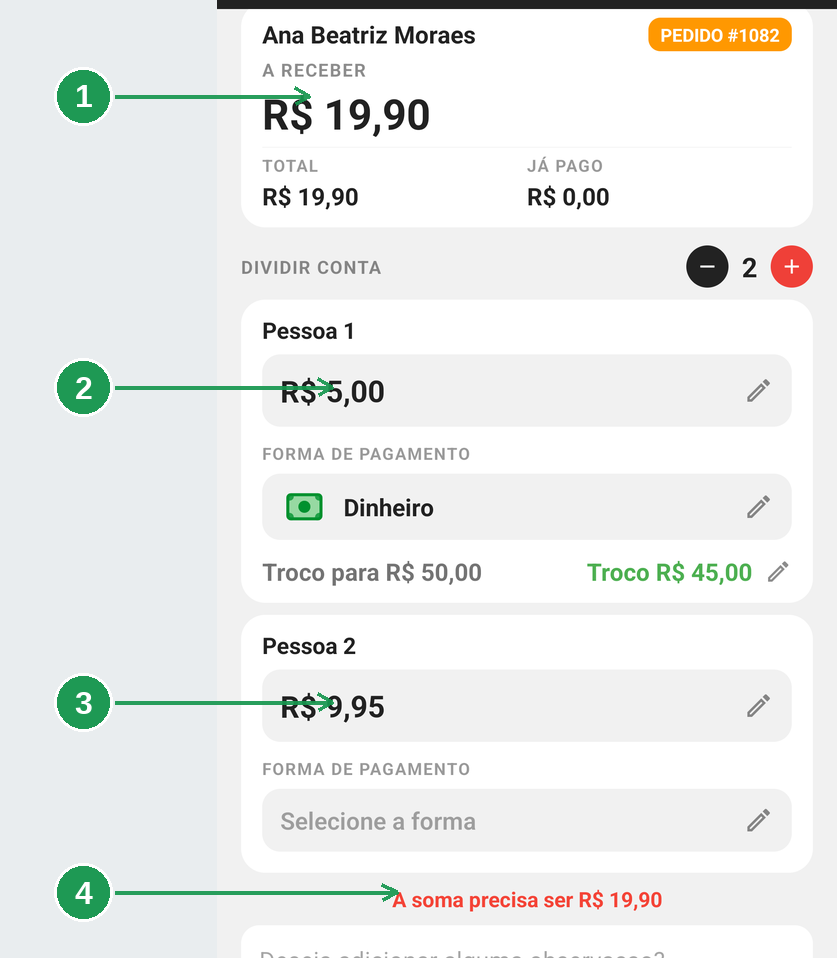

| Nº | Onde | O que é |
|----|------|---------|
| 1. | **A RECEBER** | O valor que as partes têm de somar: R$ 19,90. |
| 2. | **R$ 5,00** | A parte da Pessoa 1, editada pelo lápis. |
| 3. | **R$ 9,95** | A parte da Pessoa 2, que o aplicativo havia calculado como metade. |
| 4. | **A soma precisa ser R$ 19,90** | O aviso em vermelho, logo acima da observação. |

No exemplo faltam R$ 4,95: o valor da Pessoa 1 foi mudado para R$ 5,00 e o da Pessoa 2 ficou como
estava. **Corrija o valor de uma das pessoas até o aviso desaparecer.** O CONFIRMAR PAGAMENTO
continua na tela, mas não passa enquanto a soma não fechar.

> **Editar um valor não reajusta o outro.** O aplicativo divide em partes iguais uma vez, na hora
> em que você cria as pessoas; a partir daí a conta é sua.

### A confirmação mostra uma linha por pessoa

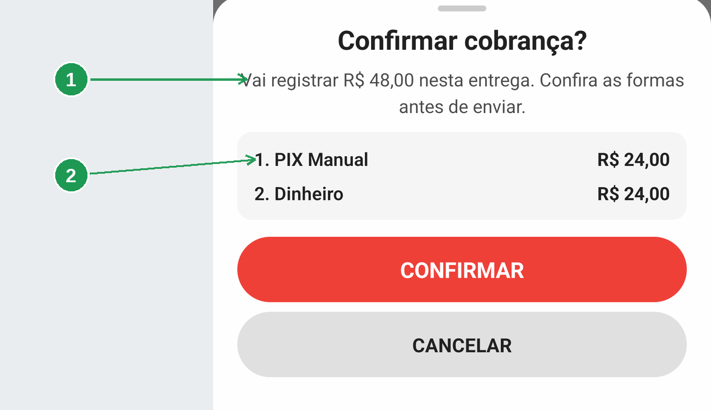

| Nº | Onde | O que é |
|----|------|---------|
| 1. | **Vai registrar R$ 48,00** | O valor cheio: a soma das partes. |
| 2. | **As linhas numeradas** | Uma por pessoa, com a forma e o valor. Confira se cada um pagou o que está escrito. |

### Como pensar na divisão

- **Uma pessoa, uma forma.** Se a mesma pessoa quer pagar metade no cartão e metade em dinheiro,
  trate como duas pessoas: para o caixa, o que importa é quanto entrou em cada forma.
- **É tudo ou nada.** As partes são enviadas juntas: ou todas registram, ou nenhuma. Não existe "a
  Pessoa 1 pagou e a 2 ficou pendente".
- **Confirme depois de receber de todos.** Uma vez confirmado, não há como mexer pelo aplicativo.
- **Cobrar menos que o total não é divisão de conta.** Aí é um pagamento só, com o valor ajustado
  pelo lápis e uma observação explicando.

---

## 5. Finalizar sem cobrar

**FINALIZAR SEM COBRAR** encerra a entrega sem registrar pagamento nenhum. É o caminho do pedido
que você entregou e não recebeu na porta: o marketplace já cobrou, a loja vai acertar depois, ou
foi combinado assim.

**Se o seu restaurante desligou a tela de pagamento** (seção 1), este deixa de ser a exceção e
passa a ser o caminho de sempre: você entrega, recebe o dinheiro se houver o que receber, finaliza
por aqui e escreve na observação o que aconteceu. A observação é o que a loja vai ler para lançar
o pagamento no caixa — um *"Recebido R$ 44,00 em dinheiro"* vale mais que qualquer recado de voz.

O aplicativo não te impede, mas avisa **três vezes**: a conferência dos itens em destaque, o aviso
do saldo em aberto e o campo de observação.

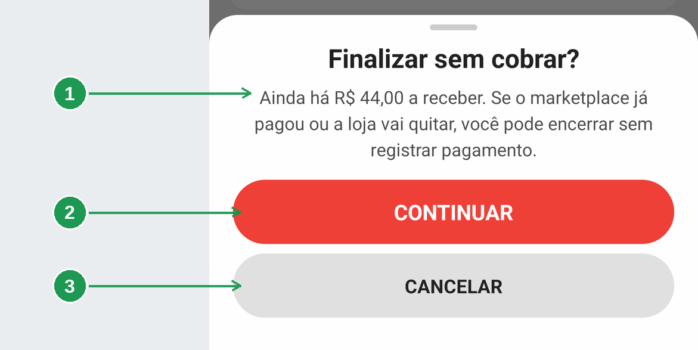

| Nº | Onde | O que é |
|----|------|---------|
| 1. | **Ainda há R$ … a receber** | O valor aparece no texto de propósito: se você tocou por engano, é aqui que percebe. |
| 2. | **CONTINUAR** | Segue para a observação. |
| 3. | **CANCELAR** | A saída, se o toque foi errado. |

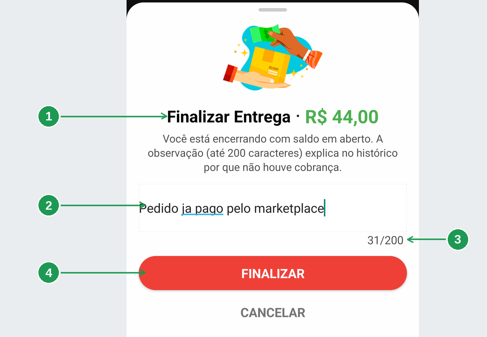

| Nº | Onde | O que é |
|----|------|---------|
| 1. | **Finalizar Entrega · R$ 44,00** | O saldo que fica em aberto, em verde. |
| 2. | **A observação** | *Por que não houve cobrança?* — escreva sempre. |
| 3. | **O contador** | Até 200 caracteres. |
| 4. | **FINALIZAR** | Encerra a entrega. O **CANCELAR** fica embaixo, longe do polegar. |

**Escreva sempre a observação.** Ela é o que aparece no histórico e é a sua explicação para a loja
quando alguém perguntar, meses depois, por que aquele pedido fechou sem pagamento. Um *"Pedido já
pago pelo marketplace"* resolve a dúvida.

### Quando usar cada caminho

| Situação | Caminho certo |
|----------|---------------|
| Cliente paga na porta | **INICIAR COBRANÇA** |
| **A loja desligou a tela de pagamento** | **FINALIZAR SEM COBRAR**, com o que você recebeu escrito na observação |
| Pedido de iFood ou 99Food, já pago | **FINALIZAR SEM COBRAR** — e nesses o botão de cobrar nem existe |
| A loja vai cobrar do cliente depois | **FINALIZAR SEM COBRAR**, explicando na observação |
| Cliente pagou parte agora | **INICIAR COBRANÇA** com o valor ajustado pelo lápis, e observação |
| **Cliente não estava em casa** | **nenhum dos dois** — ligue para o restaurante |

> **Entrega que não aconteceu não deve ser finalizada.** Finalizar é dizer que o pedido foi
> entregue.

---

## 6. Quando a cobrança não fecha

Quatro telas respondem quase todas as ligações que o suporte recebe sobre cobrança. As três
primeiras são independentes; a quarta é uma sequência, e é a mais importante de reconhecer.

### "Erro no Pagamento"

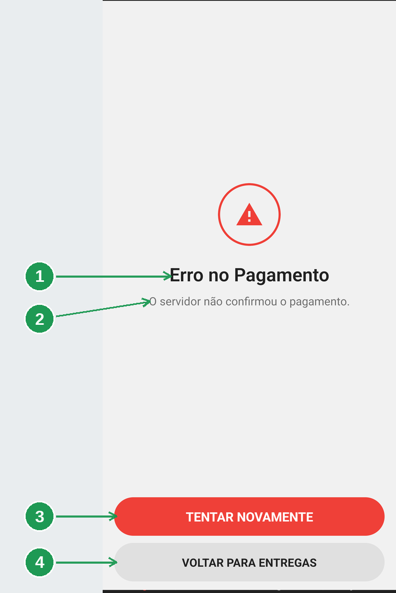

| Nº | Onde | O que é |
|----|------|---------|
| 1. | **Erro no Pagamento** | O título, com a marca **vermelha**. |
| 2. | **O servidor não confirmou o pagamento** | O envio saiu do celular e não voltou resposta. |
| 3. | **TENTAR NOVAMENTE** | Repete o envio, com os mesmos valores. |
| 4. | **VOLTAR PARA ENTREGAS** | Sai sem registrar. |

**Nada foi registrado nesta tela** — é o que a mensagem diz. Confira o sinal e toque em **TENTAR
NOVAMENTE**.

> **Se você tocou em TENTAR NOVAMENTE e ficou na dúvida, confira o histórico antes de cobrar de
> novo.** É o único jeito de não receber duas vezes: a entrega paga sai da aba *Entregas* e aparece
> no [histórico](../app-entregador-entregas-do-dia/app-entregador-entregas-do-dia.md).

### "Pedido já pago"

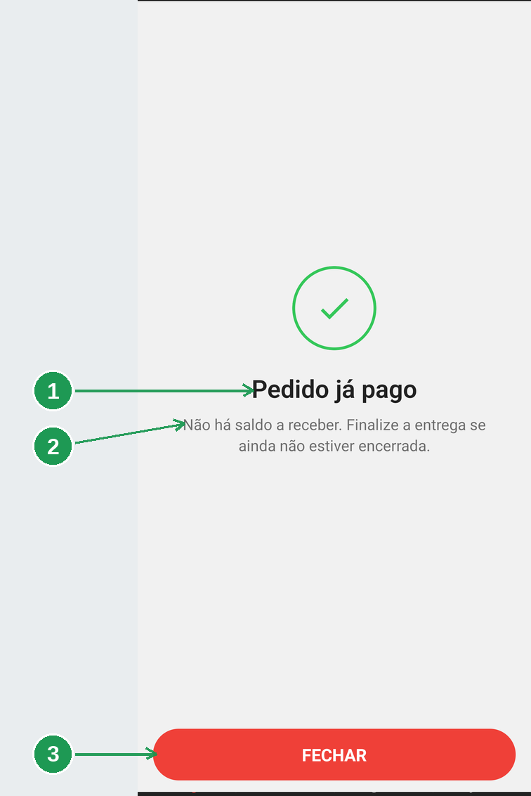

| Nº | Onde | O que é |
|----|------|---------|
| 1. | **Pedido já pago** | O título, com a marca **verde**. Não é erro. |
| 2. | **Não há saldo a receber. Finalize a entrega se ainda não estiver encerrada.** | O que fazer. |
| 3. | **FECHAR** | Volta aos detalhes. |

**Marca verde, e não vermelha, de propósito:** não há nada errado, só não há o que receber. O pedido
chegou pago (marketplace, Pix antecipado) ou alguém já registrou o pagamento.

**Não receba nada do cliente.** Volte aos detalhes e use **FINALIZAR SEM COBRAR**, com uma
observação dizendo por quê.

### Pagamento registrado, entrega em aberto

Esta é a sequência que vira ligação. **O pagamento entra no caixa e a baixa da entrega não sai** —
acontece quando a rede cai entre as duas coisas, ou quando o restaurante mexeu na rota enquanto você
cobrava.

A primeira tela é quase igual à do pagamento bem-sucedido. **O que muda é a frase de baixo.**

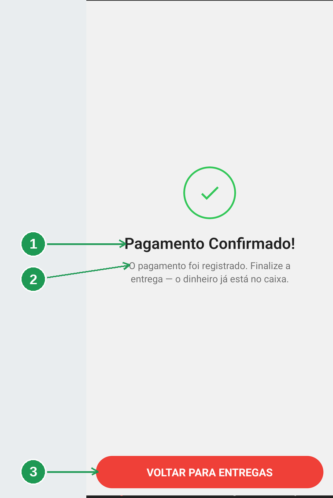

| Nº | Onde | O que é |
|----|------|---------|
| 1. | **Pagamento Confirmado!** | O mesmo título e a mesma marca verde do pagamento normal. |
| 2. | **Finalize a entrega — o dinheiro já está no caixa** | **É esta frase que diferencia.** No pagamento normal está escrito *registrado com sucesso*, e a entrega já fechou. |
| 3. | **VOLTAR PARA ENTREGAS** | O único botão. |

Ao abrir os detalhes daquela entrega de novo, o aplicativo repete o aviso:

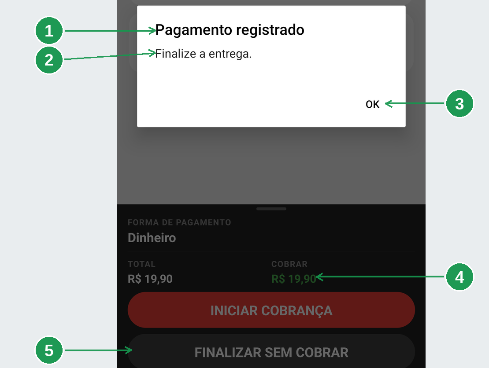

| Nº | Onde | O que é |
|----|------|---------|
| 1. | **Pagamento registrado** | O título do alerta. |
| 2. | **Finalize a entrega.** | O que falta fazer. |
| 3. | **OK** | Fecha o alerta. |
| 4. | **COBRAR R$ 19,90** | **Cuidado: o rodapé é o de antes.** Esta tela não recarregou, e continua mostrando o valor como se nada tivesse sido pago. |
| 5. | **FINALIZAR SEM COBRAR** | O caminho certo agora. O dinheiro já está registrado. |

> **Não toque em INICIAR COBRANÇA nesta tela.** O valor em verde já foi recebido; cobrar de novo
> registra o dobro no caixa do restaurante.

E o FINALIZAR pode falhar na primeira tentativa:

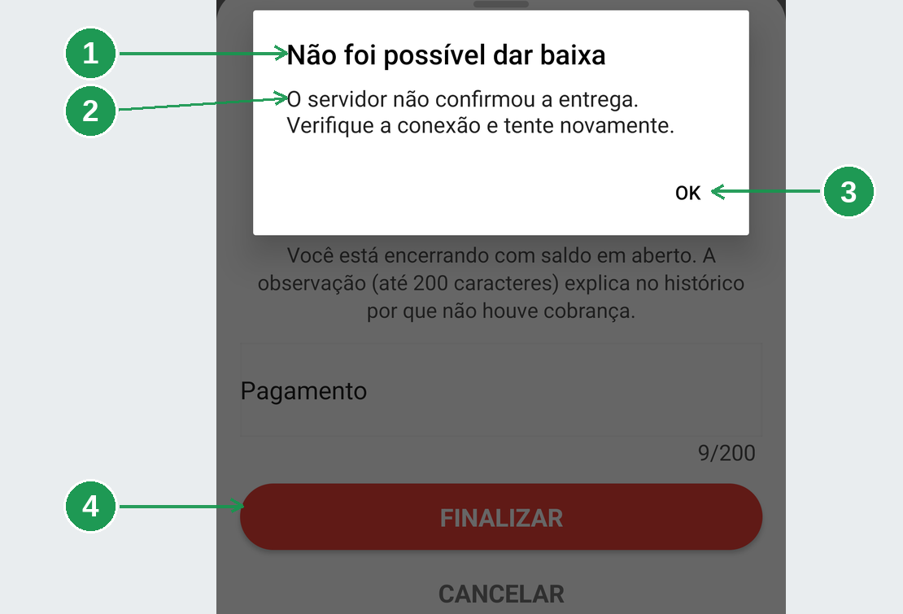

| Nº | Onde | O que é |
|----|------|---------|
| 1. | **Não foi possível dar baixa** | O título da janela. |
| 2. | **O servidor não confirmou a entrega. Verifique a conexão e tente novamente.** | O texto. |
| 3. | **OK** | Fecha a janela. |
| 4. | **FINALIZAR** | O botão que você tocou — e ele estava certo. |

**A saída é atualizar a lista.** Toque em OK, volte para a aba *Entregas*, arraste a tela para
baixo, abra a entrega de novo e finalize. O aplicativo estava mandando dados velhos; com a lista
recarregada, a baixa passa.

### O resumo dos quatro casos

| A tela diz | O dinheiro | O que fazer |
|------------|------------|-------------|
| **A soma precisa ser R$ …** | nada foi enviado | corrigir os valores das pessoas |
| **Erro no Pagamento** | nada foi registrado | conferir o sinal e TENTAR NOVAMENTE |
| **Pedido já pago** | já estava pago antes | FINALIZAR SEM COBRAR, com observação |
| **Finalize a entrega — o dinheiro já está no caixa** | **registrado** | atualizar a lista e FINALIZAR SEM COBRAR |

---

## 7. Regras que valem sempre

**Não tem como desfazer.** Confirmada a cobrança ou a finalização, a entrega sai da sua lista e
você não consegue reabri-la pelo aplicativo. Corrigir depende do restaurante, pelo sistema dele.

**Não toque duas vezes em CONFIRMAR.** O aplicativo bloqueia o botão enquanto envia, e é nisso que
você deve confiar. Se a tela travar e você não souber se passou, **confira no histórico** antes de
tentar de novo.

**Você registra o que aconteceu, não o que estava combinado.** Pedido marcado como cartão e pago em
dinheiro se registra como **dinheiro** — quem fecha o caixa à noite depende disso.

**A observação é para o restaurante.** Use para o que o dono precisa saber: *"cliente pagou R$ 40 e
ficou devendo R$ 6"*, *"conferiu a sacola e faltava o refrigerante"*.

---

## Perguntas frequentes

### A tela de pagamento do aplicativo

**Como desativar a tela de pagamento do aplicativo do entregador?**
Em **Configuração → Parâmetros**, card **Delivery**, desligue **Entregador registra pagamento**. A
alteração grava sozinha. A partir daí o entregador continua vendo o valor a receber, mas não
consegue abrir a tela de pagamento: o registro passa a ser feito no caixa do restaurante. É a
seção 1.

**Como liberar o entregador para receber pelo aplicativo de novo?**
Mesmo lugar: ligue **Entregador registra pagamento** no card **Delivery** dos Parâmetros. Ligada, a
tela de pagamento volta e o entregador cobra na porta como descrito neste manual.

**O parâmetro vem ligado ou desligado de fábrica?**
**Ligado.** Quem nunca mexeu nele tem a tela de pagamento no aplicativo, e é o comportamento que
este manual descreve das seções 2 em diante.

**Onde fica o botão de salvar dos Parâmetros?**
Não existe. A tela de Parâmetros **grava sozinha** alguns instantes depois de você mexer na chave,
e confirma com o aviso *Parâmetros salvos*.

**O aplicativo avisa que o pagamento pelo app está desativado. O que eu faço?**
Não é erro nem falta de sinal: a loja desligou a tela de pagamento. Entregue o pedido, receba o
dinheiro se houver o que receber e encerre com **FINALIZAR SEM COBRAR**, escrevendo na observação o
que recebeu e em qual forma. Quem lança no caixa é o restaurante.

**O entregador não consegue iniciar a cobrança: não abre a tela de pagamento.**
Confira primeiro o parâmetro **Entregador registra pagamento** (seção 1) — desligado, ele é
exatamente esse sintoma. Se o parâmetro está ligado, o caso é outro: veja a seção 6.

**Desliguei o parâmetro e o entregador continua vendo o valor a receber. Está errado?**
Está certo, e é de propósito. Ele precisa saber quanto receber do cliente. O que a chave desligada
tira é o **lançamento** pelo celular, não a informação do valor.

**Desliguei a tela de pagamento e o entregador conseguiu cobrar mesmo assim.**
O aplicativo dele estava aberto desde antes da mudança, com a configuração antiga em mão. Peça para
atualizar a lista de *Entregas*, arrastando a tela para baixo, ou sair e entrar de novo.

**Dá para desligar só para um entregador?**
Não. A chave vale para **todos os entregadores da loja**.

**Se o entregador não lança o pagamento, quem lança?**
O restaurante, no caixa. Vale olhar a chave vizinha: com o **Pagamento Automático Delivery**
ligado, o pedido que tem intenção de pagamento gravada é registrado como pago ao chegar em
*Entregue*, o que fecha a conta sem lançamento à mão — está no
[manual do pagamento automático](../delivery-pagamento-auto/delivery-pagamento-auto.md). Com as
duas chaves desligadas, o lançamento é manual.

### A cobrança, no dia a dia

**A forma que eu preciso não está na lista.**
A lista é o que o restaurante habilitou para delivery. Fiado, Pix automático e formas de
marketplace não aparecem de propósito. Se faltar uma que deveria estar, use o botão de atualizar
formas no alto da tela de pagamento e avise a loja.

**"Forma de pagamento não encontrada" ou a forma está inativa.**
O restaurante mudou o cadastro. O aplicativo recarrega a lista sozinho nesse caso; se insistir,
cobre por outra forma e avise a loja.

**Não consigo confirmar a divisão.**
Confira duas coisas: se **toda** pessoa tem forma escolhida e se a **soma das partes** bate com o
valor a receber. O aviso vermelho da soma está na seção 4.

**Dividi em pessoas demais.**
O **−** reagrupa, e os valores voltam a ser divididos igualmente.

**Erro ao confirmar.**
Se a tela é a de **Erro no Pagamento** (marca vermelha), nada foi registrado: confira o sinal e
toque em TENTAR NOVAMENTE. Se você já tentou mais de uma vez, **confira no histórico** antes de
repetir. Está na seção 6.

**Diz "Pedido já pago".**
Não há saldo a receber: o pedido chegou pago ou alguém já registrou o pagamento. **Não receba nada
do cliente** — volte e use FINALIZAR SEM COBRAR, com observação. Está na seção 6.

**Registrou o pagamento e a entrega continuou na lista.**
O pagamento entrou e a baixa não. A tela de sucesso diz *Finalize a entrega — o dinheiro já está no
caixa*, e ao reabrir os detalhes o aplicativo repete o aviso. **O rodapé ainda mostra o valor a
cobrar, e não deve ser cobrado de novo**: atualize a lista e finalize sem cobrar. A sequência inteira
está na seção 6.

**Finalizei e apareceu "Não foi possível dar baixa".**
O botão estava certo; a lista é que estava velha. Toque em OK, volte para *Entregas*, arraste a tela
para baixo, abra a entrega de novo e finalize. Está na seção 6.

**Finalizei e a entrega continuou na lista.**
O envio não chegou ao servidor. Puxe a lista para atualizar antes de tentar de novo.

**Finalizei o pedido errado.**
Fale com o restaurante imediatamente. Pelo aplicativo não há volta.

---

## Onde continuar

| Manual | O que cobre |
|--------|-------------|
| [App do entregador: as entregas do dia e o histórico](../app-entregador-entregas-do-dia/app-entregador-entregas-do-dia.md) | A lista, o cartão, os detalhes e o histórico |
| [App do entregador: chegar no endereço](../app-entregador-rota/app-entregador-rota.md) | Mapa, rota e melhor rota |
| [App do entregador: pedido de iFood e de 99Food](../app-entregador-marketplace/app-entregador-marketplace.md) | O pedido que já está pago |
| [Pagamento automático no Delivery](../delivery-pagamento-auto/delivery-pagamento-auto.md) | A chave vizinha: registrar o pagamento sozinho quando o pedido chega em *Entregue* |
| [Formas de recebimento](../formas-recebimento/formas-recebimento.md) | Quem decide, no painel, quais formas o entregador vê |
| [Conferência de caixa](../caixa-conferencia-2/caixa-conferencia-2.md) | Onde o dinheiro recebido na rua aparece no fim do dia |

*Última atualização: setembro/2026 — BeeFood · Gestão de Entregas 2.0*
