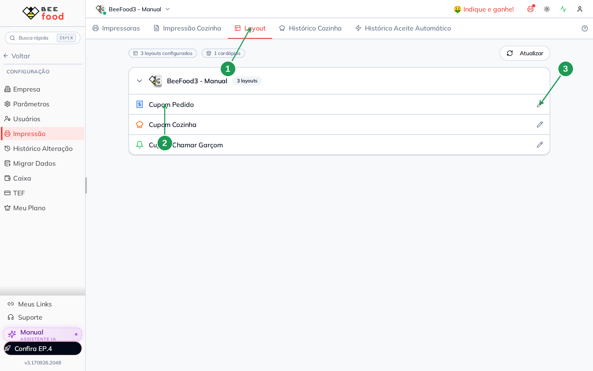
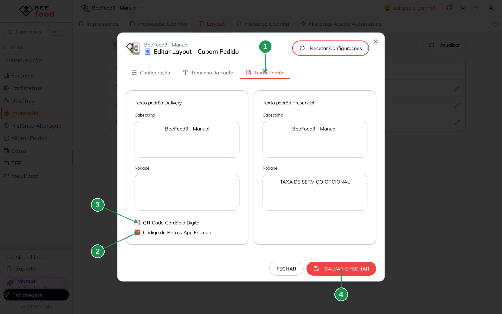
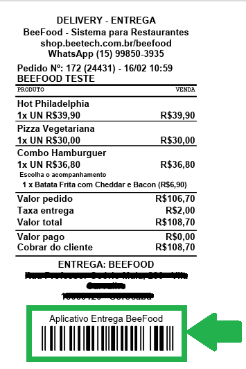
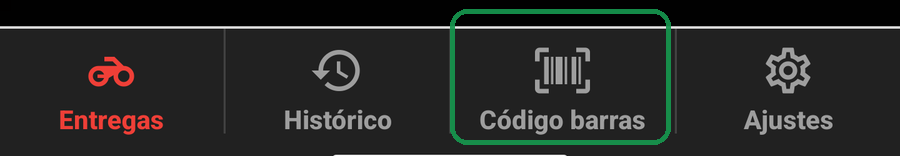
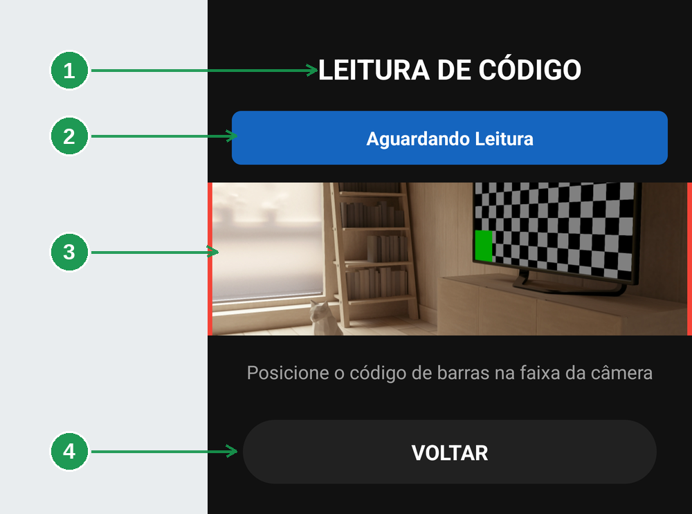
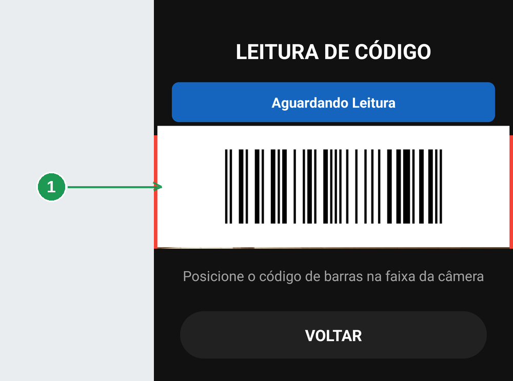
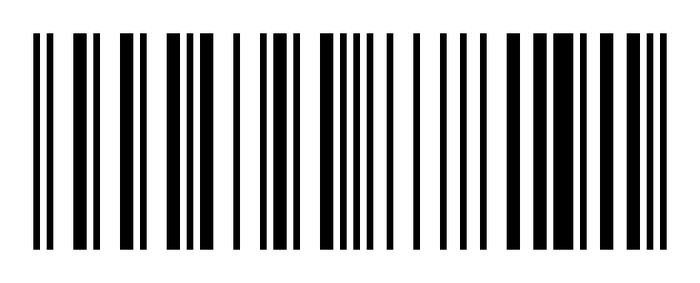

# Código de barras: ligar a etiqueta e ler o pedido no aplicativo

O cupom do delivery pode sair com uma **etiqueta de código de barras** no pé. O entregador
aponta a câmera do aplicativo para ela, e o pedido é despachado ali, no balcão, sem ninguém
mexer no computador.

> **Ler a etiqueta é despachar, não conferir.** No instante da leitura o pedido passa para *saiu
> para entrega*, o cliente recebe a mensagem, o marketplace é avisado e o cupom imprime. **Pelo
> aplicativo não há como desfazer.** Só leia a etiqueta do pedido que você está pegando **agora**
> para levar.

São duas metades: uma no painel (ligar a etiqueta, uma vez) e uma no celular (ler, todo dia).

> As imagens têm **setas numeradas** (1, 2, 3…). Cada número indica o campo correspondente na
> tela.

## Para que serve

- Despachar pedido pelo celular, no balcão, sem voltar ao computador.
- Servir o restaurante que manda **um pedido por vez**, sem agrupar em rota.
- Amarrar o pedido ao entregador que bipou — é ele que fica registrado como responsável.

## Antes de começar

- O entregador precisa estar **liberado no aplicativo**: funcionário com a função *Entregador* e
  usuário com *Aplicativos* ligado. Está em
  [Liberar o entregador](../gestao-entregas-liberar-entregador/gestao-entregas-liberar-entregador.md).
- A impressora do **cupom de pedido** precisa estar funcionando: a etiqueta sai no papel.
- O celular precisa dar **permissão de câmera** ao aplicativo.

---

## 1. Ligar a etiqueta no cupom

A etiqueta não vem ligada. Ela é uma opção do **layout do cupom**, e é preciso marcá-la uma vez.

Abra **Configuração → Impressão**.

| Nº | Onde | O que fazer |
|----|------|-------------|
| 1. | **Layout** | A aba dos desenhos de cupom. As outras abas são das impressoras. |
| 2. | **Cupom Pedido** | O cupom do delivery. É neste, e só neste, que a etiqueta existe. |
| 3. | **Lápis** | Abre o layout para edição. |

Dentro do layout, vá para a aba **Texto Padrão**.

| Nº | Onde | O que fazer |
|----|------|-------------|
| 1. | **Texto Padrão** | A terceira aba do layout. A caixinha não está na primeira — é onde a maioria procura e não acha. |
| 2. | **Código de Barras App Entrega** | Marque. É esta que imprime a etiqueta que o aplicativo lê. |
| 3. | **QR Code Cardápio Digital** | Outra coisa: é o QR do cardápio, para o **cliente**. Não confunda. |
| 4. | **SALVAR E FECHAR** | Grava o layout. Sem salvar, nada muda no cupom. |

---

## 2. Onde a etiqueta sai

A partir do próximo pedido impresso, o código aparece no **pé do cupom**, depois do endereço de
entrega, com o rótulo *Aplicativo Entrega BeeFood*.

A moldura verde marca a etiqueta: é ela, e só ela, que a câmera lê. O endereço do cliente sai
coberto na imagem porque este material é público.

Ela sai só em pedido de **delivery com entrega** — não sai em retirada no balcão nem em venda
presencial, porque nesses casos não há entregador para ler.

---

## 3. Abrir o leitor no aplicativo

No aplicativo do entregador, o leitor é a terceira aba do rodapé: **Código barras**.

Não é preciso achar o pedido na lista antes. O leitor trabalha direto pela etiqueta.

---

## 4. Ler a etiqueta

A tela do leitor tem três partes.

| Nº | Onde | O que é |
|----|------|---------|
| 1. | **LEITURA DE CÓDIGO** | O título: confirma que você está no leitor. |
| 2. | **Faixa de status** | A faixa azul que conta o que está acontecendo. Começa em *Aguardando Leitura*. |
| 3. | **Faixa da câmera** | A área entre as duas linhas vermelhas. É a única parte que a câmera analisa. |
| 4. | **VOLTAR** | Fecha o leitor e volta para a aba *Entregas*, com a lista recarregada. |

Encoste o celular na etiqueta até o código ficar **dentro da faixa**, entre as linhas vermelhas.

| Nº | Onde | O que fazer |
|----|------|-------------|
| 1. | **Código na faixa** | Aproxime e mantenha firme. **Não precisa tocar em nada**: a leitura é automática. |

A faixa é estreita de propósito — código fora dela não é analisado. Abaixo dela o aplicativo repete
a instrução: *Posicione o código de barras na faixa da câmera*.

### O que a faixa de status diz

São **seis** mensagens, e vale saber que as duas últimas são situações diferentes.

| Faixa | Significa |
|-------|-----------|
| **Aguardando Leitura** | pronto, procurando um código |
| **Lendo código…** | achou, e está avisando a loja |
| **Pedido lido com sucesso!** | deu certo. O pedido **foi despachado** |
| **Pedido já lido.** | você bipou a mesma etiqueta duas vezes; nada foi enviado de novo |
| **Erro na leitura, tente novamente** | não chegou a sair do celular. Aproxime e leia de novo |
| **Erro: {mensagem}** | o pedido saiu do celular e **a loja respondeu recusando**. A mensagem depois dos dois pontos é a explicação, e é ela que você repassa ao restaurante |

Nas duas de erro o pedido **não** foi despachado. A diferença está em onde parou: na primeira o
envio não aconteceu, e ler de novo resolve; na segunda o servidor respondeu, e ler de novo vai dar
a mesma coisa até alguém olhar o pedido.

Você pode ler **várias etiquetas em sequência** sem sair da tela: é o caso normal de sair com
três ou quatro pedidos.

---

## 5. O que a leitura dispara

É o mesmo efeito do botão de despachar no painel, só que disparado do celular. No instante do
*Pedido lido com sucesso*:

- o pedido passa para **saiu para entrega**;
- fica atrelado **àquele** entregador, o que bipou;
- o **marketplace** é avisado, quando o pedido vem de um (iFood, 99Food e afins);
- o **cliente** recebe o aviso de WhatsApp, se os avisos estiverem ligados;
- o cupom imprime, conforme a configuração da impressora.

Duas consequências práticas, e as duas valem uma conversa com a equipe:

- **Não peça para o entregador "testar o leitor" com pedido de cliente.** O cliente recebe aviso
  e o marketplace registra a saída.
- **Bipou a etiqueta errada?** Fale com o restaurante na hora. A correção é no painel — pelo
  aplicativo não há volta.

No histórico do pedido, no painel, a linha fica registrada como *App Entregador* — é assim que
você sabe, depois, que aquele despacho veio do celular e não do computador.

---

## 6. A etiqueta é EAN-13, e só

O leitor entende **apenas EAN-13**, o código de barras comum de supermercado, de 13 dígitos. Os
12 primeiros são o número interno do pedido; o último é o dígito verificador.

**QR Code não funciona. Outro formato não funciona.** Se a etiqueta do seu cupom não é EAN-13, o
leitor simplesmente não reage — e é por isso que a etiqueta precisa vir do próprio BeeFood, pela
opção da seção 1.

---

## Perguntas frequentes

**A câmera abre e nada acontece.**
Dê alguns segundos: o leitor só começa a analisar depois de a câmera terminar de iniciar. Depois
disso, aproxime mais e mantenha firme, com o código **dentro** da faixa.

**Aparece "Permissão de câmera necessária".**
A própria tela oferece **Solicitar Permissão** e **Abrir Configurações**. Sem câmera não há
leitura.

**Bipo e a faixa fica vermelha.**
Leia o que vem escrito, porque são dois casos. **Erro na leitura, tente novamente** é sinal ruim na
maioria das vezes: o aviso à loja não chegou a sair, e ler de novo resolve. **Erro:** seguido de uma
mensagem é a loja respondendo e recusando — ler de novo vai repetir a resposta, e o que resolve é
repassar a mensagem ao restaurante. Nos dois casos o pedido **não** foi despachado, e o caminho de
saída é despachar pelo painel.

**Bipo, diz sucesso, mas o pedido não mudou no painel.**
O aplicativo do entregador é um recurso contratado. Quando ele não está no plano da loja, a
leitura não produz efeito. Fale com o suporte.

**O cupom sai sem a etiqueta.**
A caixinha **Código de Barras App Entrega** está marcada no layout do **Cupom Pedido**, aba
*Texto Padrão*? O pedido é delivery **com entrega**? O cupom foi impresso **depois** de você
salvar o layout?

**Preciso ler a etiqueta se o restaurante monta rota?**
Não. Com rota, quem despacha é o painel, ou o próprio entregador com o **INICIAR ROTA** do
aplicativo. O leitor é o atalho de quem manda um pedido por vez.

**Dá para ler a etiqueta de um pedido que não é meu?**
Dá — e é exatamente o cuidado a tomar: o pedido passa a ser da pessoa que bipou. Leia só o que
você vai levar.

---

## Onde continuar

| Manual | O que cobre |
|--------|-------------|
| [Liberar o entregador](../gestao-entregas-liberar-entregador/gestao-entregas-liberar-entregador.md) | Cadastro e acesso ao aplicativo |
| [App do entregador: instalar, entrar e ficar disponível](../app-entregador-entrar/app-entregador-entrar.md) | O primeiro acesso, as permissões e a pílula ONLINE |
| [App do entregador: as entregas do dia](../app-entregador-entregas-do-dia/app-entregador-entregas-do-dia.md) | A lista, o card do pedido e os detalhes |
| [Despachar a rota e acompanhar no mapa](../gestao-entregas-despachar/gestao-entregas-despachar.md) | O mesmo despacho, pelo painel |
| [Avisos de WhatsApp da entrega](../gestao-entregas-avisos-whatsapp/gestao-entregas-avisos-whatsapp.md) | A mensagem que a leitura dispara para o cliente |

*Última atualização: setembro/2026 — BeeFood · Gestão de Entregas 2.0*
