# App do entregador: instalar, entrar e ficar disponível

Este é o manual do **celular do entregador** — o aplicativo **BeeFood Entregador**. Ele cobre o
começo: as permissões que o Android pede, o login, a tela onde você vai trabalhar, o aviso de
disponibilidade e como sair.

Da primeira abertura até estar pronto para receber entrega são poucos minutos, e quase tudo é
responder *permitir*.

> As imagens têm **setas numeradas** (1, 2, 3…). Cada número indica o campo correspondente na
> tela.

## Para que serve

- Entrar no aplicativo com o acesso que o restaurante criou para você.
- Conceder as quatro permissões sem as quais o restaurante não consegue te acompanhar.
- Avisar o restaurante se você está rodando, em intervalo ou de folga.
- Encerrar a sessão no fim do expediente, ou quando o aparelho for de outra pessoa.

## Antes de começar

- O restaurante precisa ter **liberado o seu acesso**: um funcionário com a função *Entregador* e
  um usuário com os *Aplicativos* ligados. Quem faz isso é o painel, e está em
  [Liberar o entregador](../gestao-entregas-liberar-entregador/gestao-entregas-liberar-entregador.md).
- O aplicativo é instalado no celular pelo arquivo que o restaurante envia, ou pela loja de
  aplicativos, conforme o que ele combinar com você.
- **Não existe "esqueci minha senha" no aplicativo.** Quem cria e troca o seu acesso é o
  restaurante.

---

## 1. As permissões que o celular pede

O aplicativo pede permissão **antes** da tela de login. Não é enfeite: é o que permite ao
restaurante ver onde você está e mandar entrega para o seu celular.

A primeira é a **localização**.

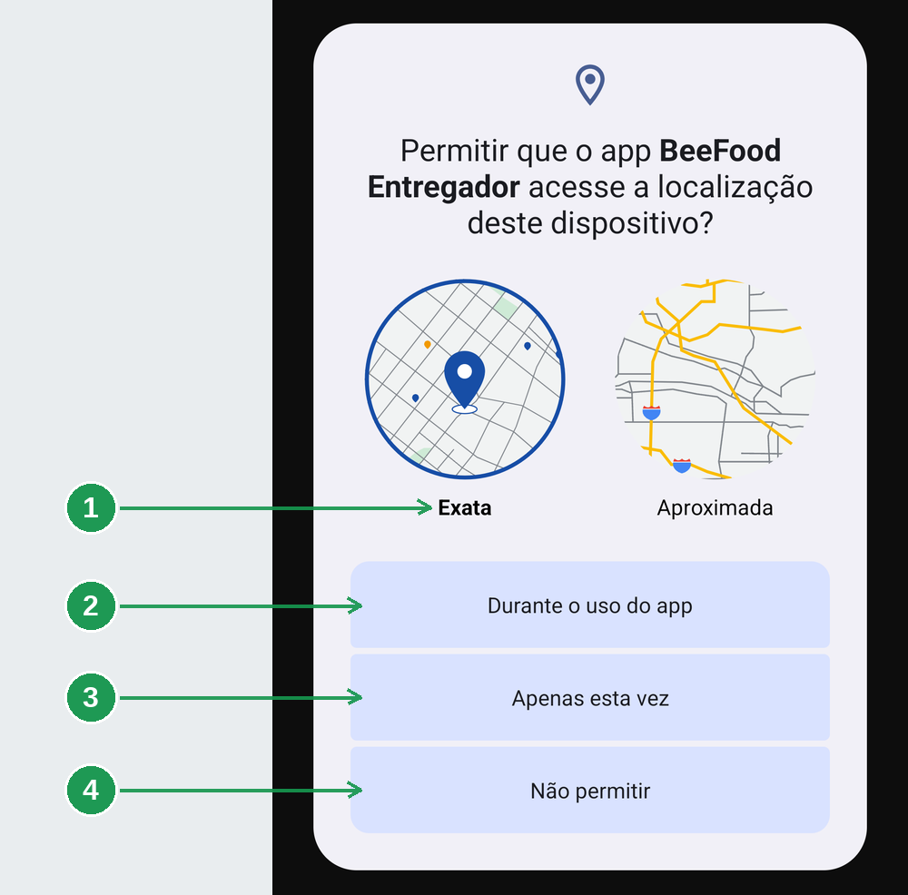

| Nº | Onde | O que fazer |
|----|------|-------------|
| 1. | **Exata** | Deixe marcada. Já vem assim. |
| 2. | **Durante o uso do app** | Toque aqui. É a resposta certa. |
| 3. | **Apenas esta vez** | Evite: funciona hoje e volta a perguntar amanhã. |
| 4. | **Não permitir** | Recusa. O restaurante deixa de te ver no mapa. |

O mapinha da direita, **Aproximada**, erra por centenas de metros: serve para saber a cidade, não
para acompanhar entrega. Com ela, o painel do restaurante te mostra a quadras de onde você está.

Em seguida o aplicativo abre as **configurações do Android** para pedir a localização em segundo
plano. Esta tela é do sistema, não do aplicativo — por isso o desenho diferente.

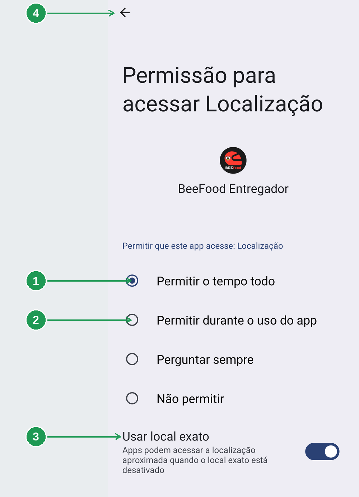

| Nº | Onde | O que fazer |
|----|------|-------------|
| 1. | **Permitir o tempo todo** | Marque esta. |
| 2. | **Permitir durante o uso do app** | Não serve aqui: vale só com o aplicativo aberto na tela. |
| 3. | **Usar local exato** | Confirme que a chave está ligada (azul). |
| 4. | **Flecha de voltar** | Volta ao aplicativo. Não há botão de salvar: a escolha já valeu. |

**Por que "o tempo todo" e não "durante o uso".** Na rua você guarda o celular no bolso, abre o
mapa, atende o telefone. Nesses momentos, com a permissão limitada, o restaurante deixaria de
receber a sua posição — e é exatamente quando você está rodando.

Por último, a **câmera**.

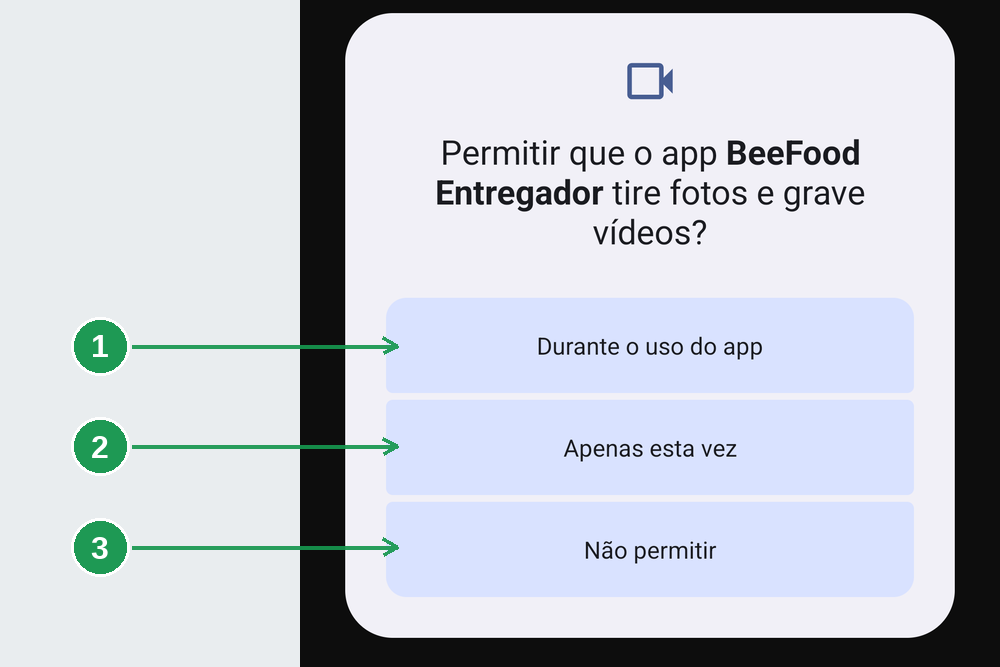

| Nº | Onde | O que fazer |
|----|------|-------------|
| 1. | **Durante o uso do app** | Toque aqui. |
| 2. | **Apenas esta vez** | Evite, pelo mesmo motivo da localização. |
| 3. | **Não permitir** | O leitor de código de barras deixa de abrir. |

A câmera serve para **uma coisa só**: ler a etiqueta de código de barras do cupom, como mostra
[Código de barras no aplicativo](../app-entregador-codigo-barras/app-entregador-codigo-barras.md).
O aplicativo não tira foto de entrega nem grava vídeo.

### Para que serve cada permissão

| Permissão | Para que o aplicativo usa | O que quebra sem ela |
|-----------|---------------------------|----------------------|
| **Localização exata** | mostrar sua posição ao restaurante e traçar rotas | o restaurante te perde de vista no mapa |
| **Localização o tempo todo** | continuar enviando posição com o celular no bolso | sua posição congela quando você sai do aplicativo |
| **Câmera** | ler o código de barras do cupom | o leitor não abre |
| **Notificações** | avisar que chegou entrega para você | você só descobre abrindo o aplicativo |

**Nenhuma é opcional na prática.** O aplicativo funciona sem elas, mas o restaurante passa a te
ligar para saber onde você está.

---

## 2. Entrar

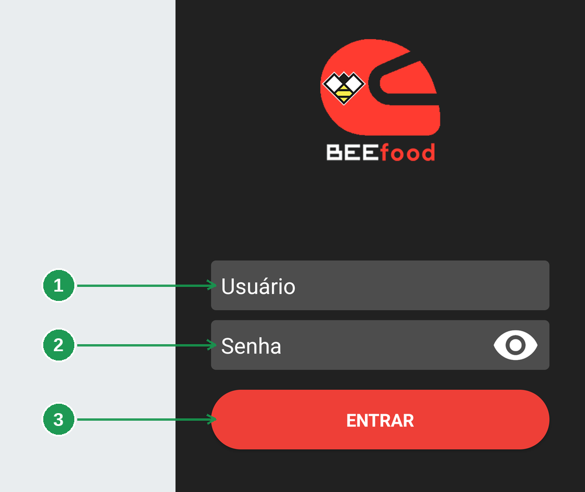

| Nº | Campo | O que fazer |
|----|-------|-------------|
| 1. | **Usuário** | O e-mail que o restaurante cadastrou para você. |
| 2. | **Senha** | A senha que ele definiu. |
| 3. | **ENTRAR** | Entra no aplicativo. |

Dois campos e um botão — não há cadastro nem recuperação de senha aqui.

O ícone de **olho**, à direita do campo de senha, mostra o que você digitou.

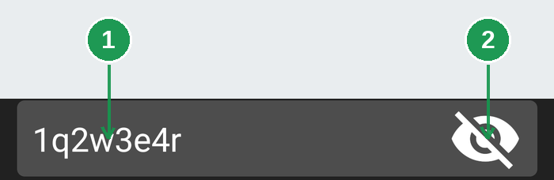

| Nº | Onde | O que é |
|----|------|---------|
| 1. | **Senha em texto** | O que você digitou, legível. |
| 2. | **Olho cortado** | Toque para esconder de novo. |

Vale usar antes de tocar em ENTRAR, especialmente na primeira vez: conferir leva um segundo,
errar custa uma tentativa. Só lembre que a senha fica visível para quem estiver ao lado.

### Quando o acesso é recusado

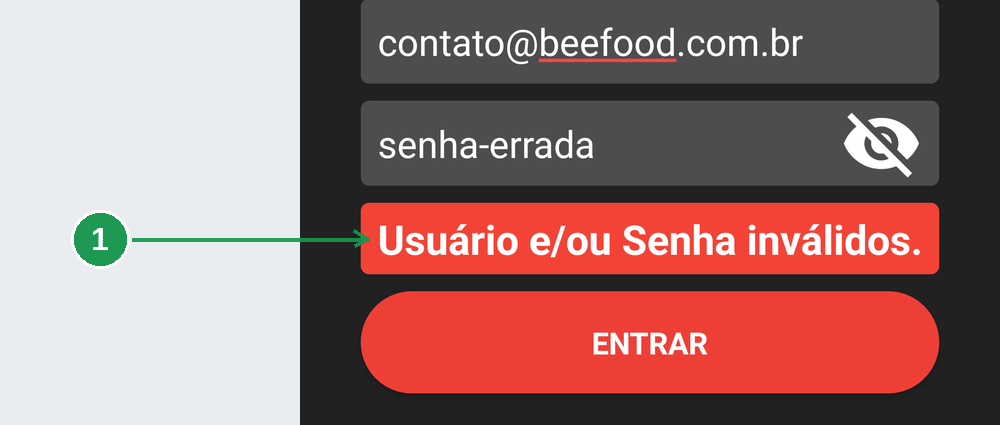

| Nº | Onde | O que é |
|----|------|---------|
| 1. | **Usuário e/ou Senha inválidos.** | A faixa vermelha do acesso recusado. |

Ela **desaparece sozinha** depois de alguns segundos, e volta em cada tentativa recusada. Os
campos continuam preenchidos, então você corrige só o que errou.

**A mensagem é a mesma para vários casos, de propósito:** senha errada, e-mail que não existe e
acesso desativado mostram exatamente este texto. É proteção — ninguém descobre, por tentativa,
quais e-mails estão cadastrados.

Se você tem certeza do usuário e da senha e a faixa insiste, o acesso pode ter sido desativado ou
a senha trocada no painel. Aí só o restaurante resolve.

### A última permissão

Depois do login aceito vem o pedido de **notificações**.

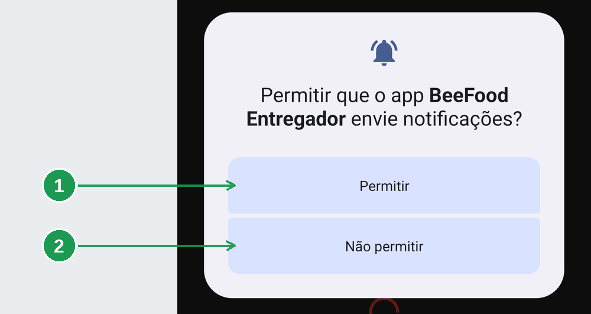

| Nº | Onde | O que fazer |
|----|------|-------------|
| 1. | **Permitir** | Toque aqui. |
| 2. | **Não permitir** | Os pedidos continuam chegando, mas em silêncio. |

---

## 3. A tela de trabalho

Passado o login, você chega na aba **Entregas**. Sem nada para entregar ela fica assim — e isso é
sinal de que deu tudo certo, não de problema.

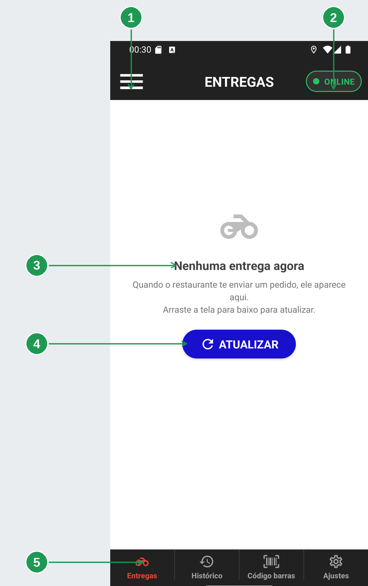

| Nº | Onde | O que é |
|----|------|---------|
| 1. | **Três riscos** | Abre o menu do aplicativo. É por ele que se chega a *Permissões* e *Sair*. |
| 2. | **Pílula ONLINE** | Sua disponibilidade. É o que o restaurante vê. |
| 3. | **Nenhuma entrega agora** | Nada no seu nome neste momento. |
| 4. | **ATUALIZAR** | Recarrega a lista. Arrastar a tela para baixo faz o mesmo. |
| 5. | **As quatro abas** | *Entregas*, *Histórico*, *Código barras* e *Ajustes*. |

Você raramente precisa atualizar à mão: o aplicativo recarrega a lista sozinho toda vez que você
volta para esta aba, e também quando você toca na notificação de entrega nova.

**Se você acha que deveria ter entrega aqui:** o aplicativo mostra **apenas** os pedidos no seu
nome. Pedido despachado para outro entregador, ou ainda sem entregador, não aparece — nem
atualizando. Confirme com o restaurante para quem o pedido foi.

### Você não precisa entrar de novo amanhã

O aplicativo guarda a sessão no aparelho. Fechar o aplicativo, reiniciar o celular ou ficar dias
sem usar **não** derruba o login: a tela de login só volta se **você** sair pelo menu.

---

## 4. Avisar se você está rodando

A pílula do canto direito é o seu aviso de disponibilidade. Toque nela e a folha **Sua
disponibilidade** sobe.

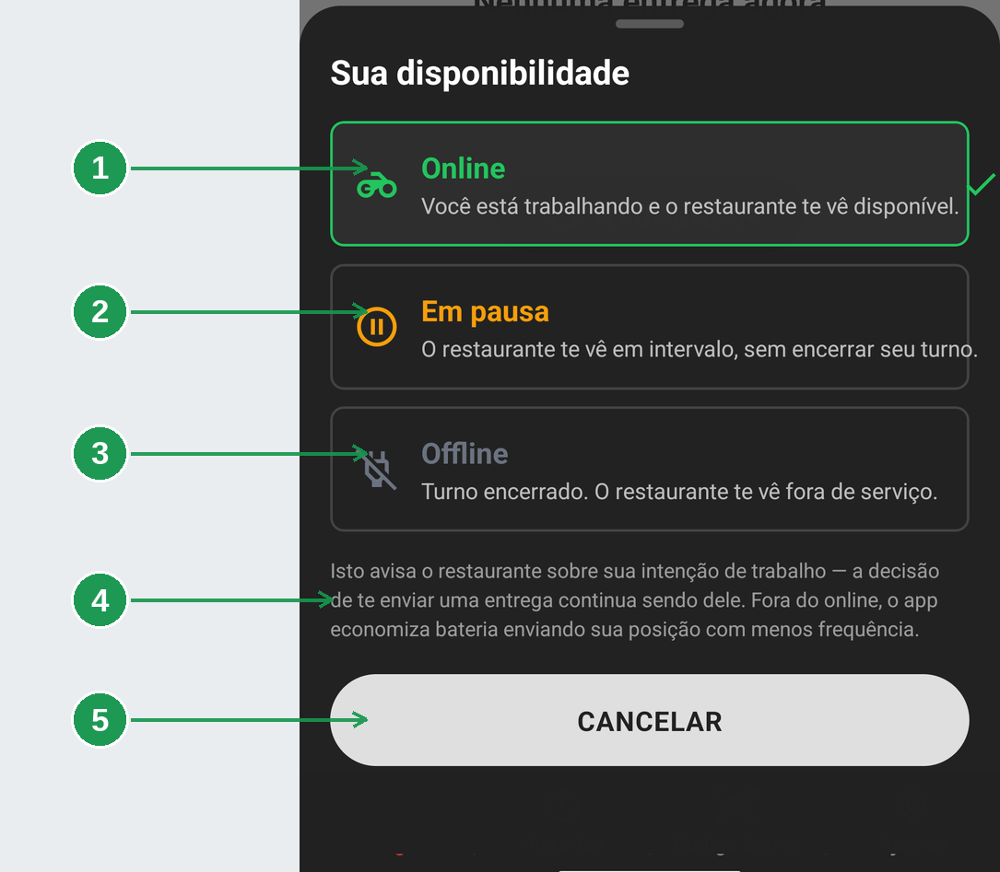

| Nº | Opção | Quando usar |
|----|-------|-------------|
| 1. | **Online** | Trabalhando e disponível. É a opção atual quando tem borda verde e um tique à direita. |
| 2. | **Em pausa** | Almoço, banheiro, abastecer — o que tem hora de volta. O turno segue aberto. |
| 3. | **Offline** | Acabou por hoje. |
| 4. | **O aviso em cinza** | Leia: é a parte mais importante desta tela. |
| 5. | **CANCELAR** | Fecha sem mudar nada. |

Não existe botão de confirmar: a folha fecha e a pílula muda no mesmo toque. Para fechar sem
mudar nada, use o CANCELAR, arraste a folha para baixo ou toque na área escurecida acima dela.

A pílula muda de cor conforme o estado, e é assim que você reconhece o seu de relance:

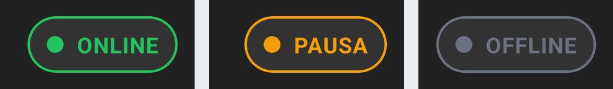

**ONLINE** em verde, **PAUSA** em laranja, **OFFLINE** em cinza. O resto da tela não muda em
nenhum dos três: você continua vendo suas entregas e pode finalizar e cobrar normalmente.

### O que a disponibilidade faz — e o que ela não faz

**Faz:** avisa o restaurante da sua intenção de trabalho, e regula a frequência com que o
aplicativo envia sua posição. Fora do ONLINE ele envia menos, e a bateria dura mais — por isso
marcar **Em pausa** no intervalo é melhor que só guardar o celular.

**Não faz:** bloquear entrega. Como a própria folha explica, *a decisão de te enviar uma entrega
continua sendo dele*. Ficar OFFLINE **não** impede o restaurante de despachar um pedido para
você, e as entregas que já estão na sua lista continuam suas.

> **A pílula é um recado, não uma tranca.** Se você precisa de verdade parar de receber, avise o
> restaurante.

---

## 5. O menu, as permissões e o sair

A quarta aba, **Ajustes**, não é uma tela de configuração: é o **menu** do aplicativo. Ele também
abre pelos três riscos do cabeçalho.

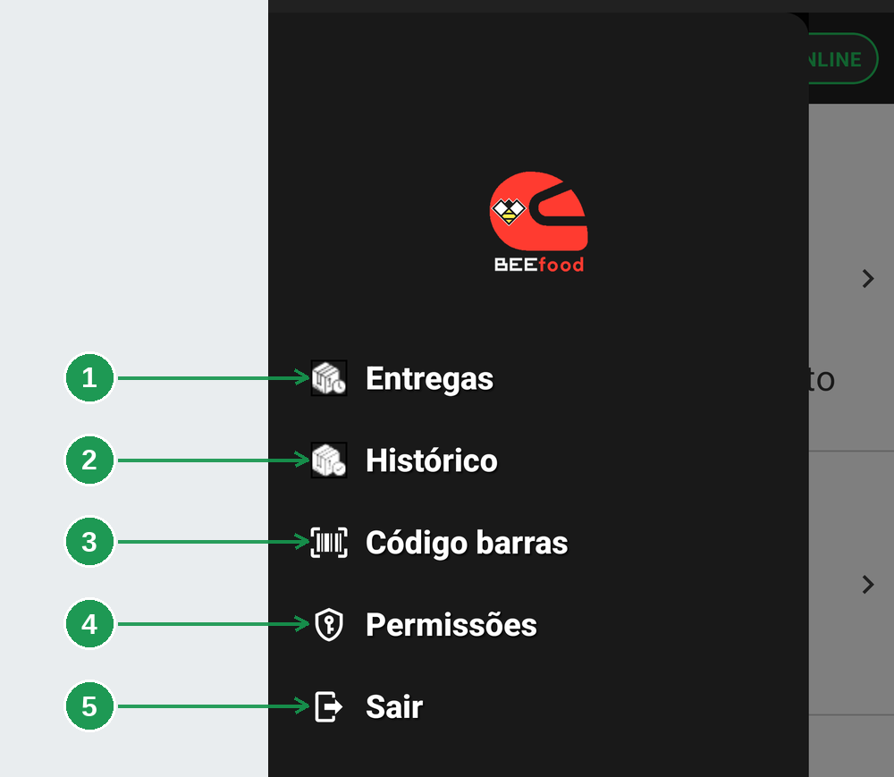

| Nº | Item | O que faz |
|----|------|-----------|
| 1. | **Entregas** | A lista de entregas abertas — a mesma aba do rodapé. |
| 2. | **Histórico** | O que você já entregou. |
| 3. | **Código barras** | O leitor de etiquetas. |
| 4. | **Permissões** | O estado das permissões do aparelho. |
| 5. | **Sair** | Encerra a sessão. |

Os três primeiros são atalhos para as abas do rodapé. O menu existe para chegar a **Permissões**
e a **Sair**, que não têm aba própria. O logo no alto é decoração, não botão.

### Conferir as permissões

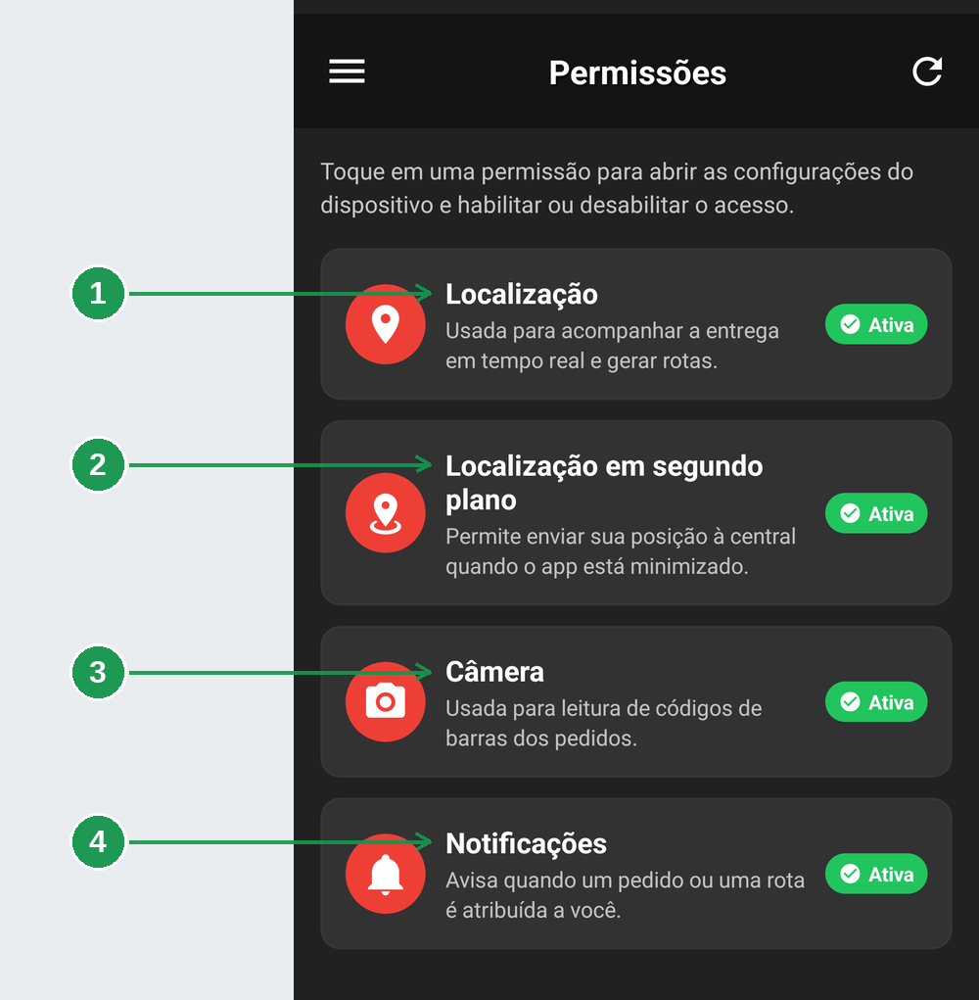

| Nº | Permissão | O que quebra sem ela |
|----|-----------|----------------------|
| 1. | **Localização** | o restaurante deixa de ver você no mapa |
| 2. | **Localização em segundo plano** | sua posição congela quando você sai do aplicativo |
| 3. | **Câmera** | o leitor da aba *Código barras* não abre |
| 4. | **Notificações** | você só descobre entrega nova abrindo o aplicativo |

Cada cartão traz à direita o selo de estado: **Ativa** em verde quando está concedida. O ícone de
recarregar, no alto à direita, relê o estado — use depois de mexer nas configurações do Android.

**Tocar num cartão abre as configurações do Android.** O aplicativo não liga permissão nenhuma
sozinho: é regra do sistema, não limitação dele.

> **Vale conferir esta tela no começo do turno.** O Android revoga permissão de aplicativo que
> fica dias sem uso, e não avisa ninguém. Você descobriria pelo problema.

### Sair

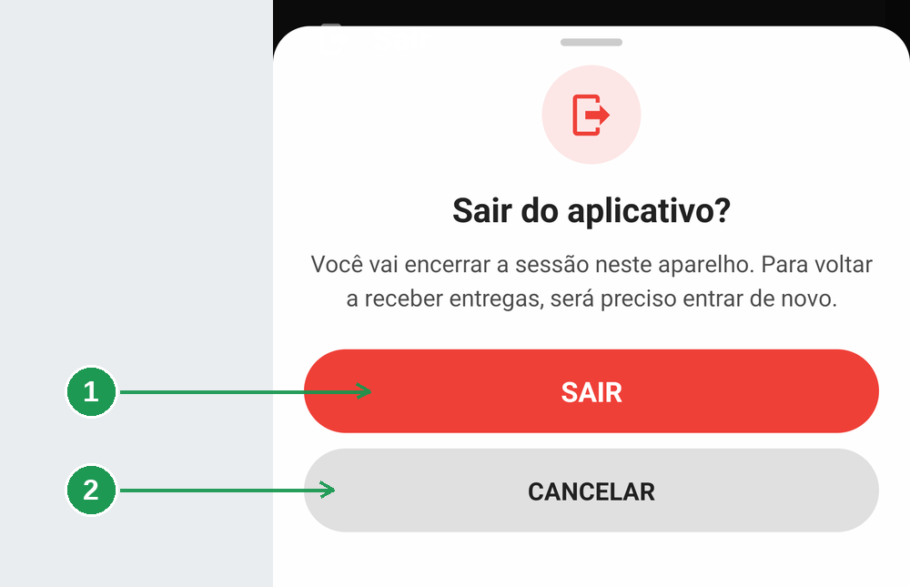

| Nº | Botão | O que faz |
|----|-------|-----------|
| 1. | **SAIR** | Encerra a sessão e volta para a tela de login. |
| 2. | **CANCELAR** | Volta ao menu sem mexer em nada. |

**Sair não é ficar offline.** Para uma pausa, use a pílula de disponibilidade. Sair é para o fim
do expediente em aparelho compartilhado, troca de turno, ou quando outra pessoa vai usar o mesmo
celular.

Ao sair, o aparelho esquece a sessão, a lista de entregas e as formas de pagamento guardadas — e
é o que garante que o próximo a entrar não veja nada do anterior. **As entregas em si estão no
restaurante: nada se perde.** Basta entrar de novo com o mesmo login.

---

## Perguntas frequentes

**O aplicativo abre e volta para o login sozinho.**
A sessão foi encerrada no servidor. Entre de novo; se repetir, fale com o restaurante.

**A pílula não fica ONLINE.**
Falta internet. O aplicativo mostra um ícone de nuvem cortada e tenta de novo sozinho.

**A pílula volta sozinha para outro estado.**
O restaurante pode ajustar a sua situação pelo painel. Se acontecer sem explicação, pergunte a
ele.

**Marquei OFFLINE e recebi entrega.**
É o comportamento esperado. A pílula informa, não bloqueia.

**Uma permissão está inativa e eu não consigo ligar.**
Toque nela para abrir as configurações do Android e conceda por lá. Em muitos aparelhos, a
localização em segundo plano exige escolher **Permitir o tempo todo**.

**Recusei a câmera e agora o Android não pergunta mais.**
Depois de duas recusas ele para de perguntar. A liberação passa a ser pela tela de **Permissões**
do menu.

**Nenhuma entrega aparece, mas o restaurante diz que enviou.**
Arraste a tela para baixo ou toque em ATUALIZAR. Persistindo, confirme com o restaurante se o
pedido foi atribuído ao **seu** nome.

**Saí sem querer.**
Entre de novo com o mesmo login. A lista vem do restaurante, não do aparelho.

---

## Onde continuar

| Manual | O que cobre |
|--------|-------------|
| [Liberar o entregador](../gestao-entregas-liberar-entregador/gestao-entregas-liberar-entregador.md) | O lado do painel: cadastro e acesso ao aplicativo |
| [App do entregador: as entregas do dia e o histórico](../app-entregador-entregas-do-dia/app-entregador-entregas-do-dia.md) | A lista, o card do pedido e os detalhes |
| [Código de barras no aplicativo](../app-entregador-codigo-barras/app-entregador-codigo-barras.md) | O leitor, e por que ler a etiqueta despacha o pedido |
| [Ler o mapa e o painel de entregas](../gestao-entregas-mapa-painel/gestao-entregas-mapa-painel.md) | Como o restaurante te vê do outro lado |

*Última atualização: setembro/2026 — BeeFood · Gestão de Entregas 2.0*
