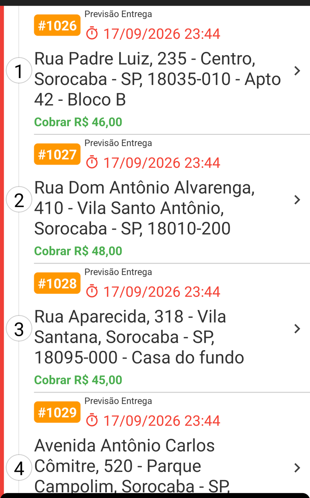
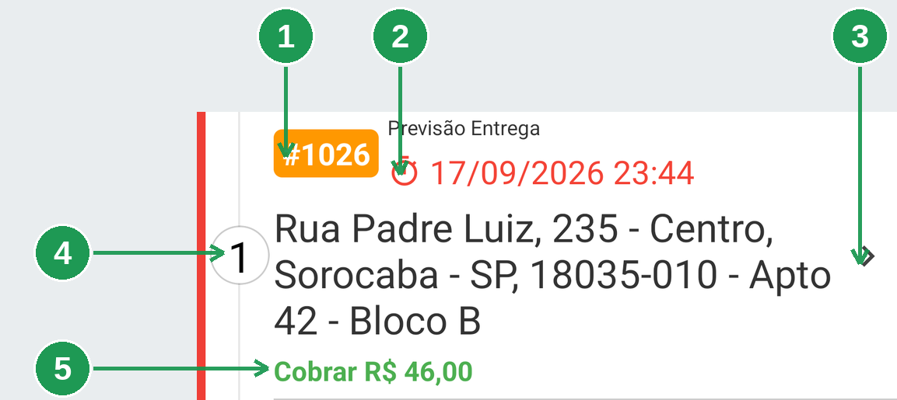
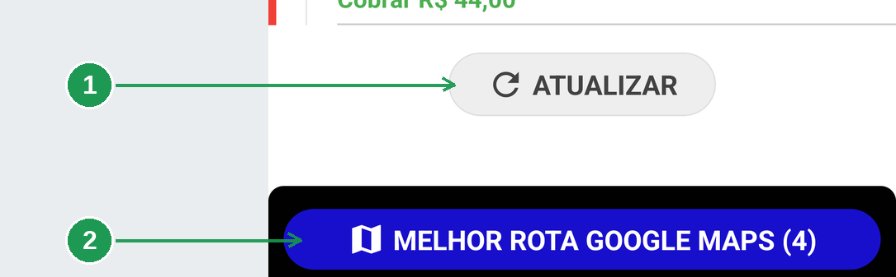
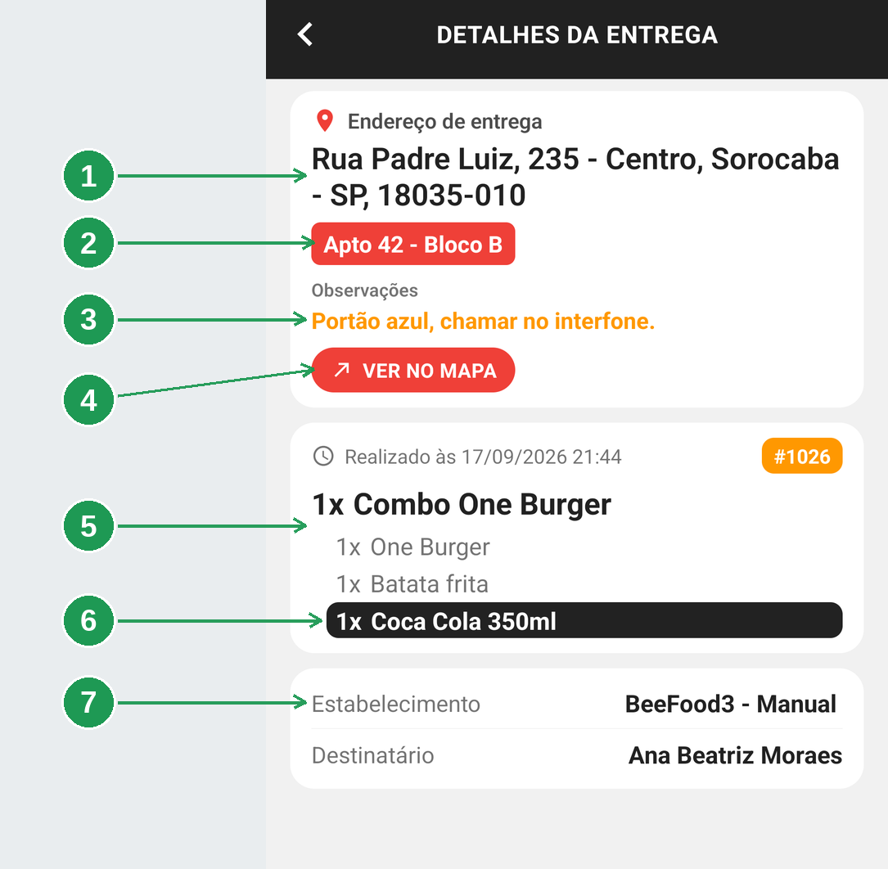
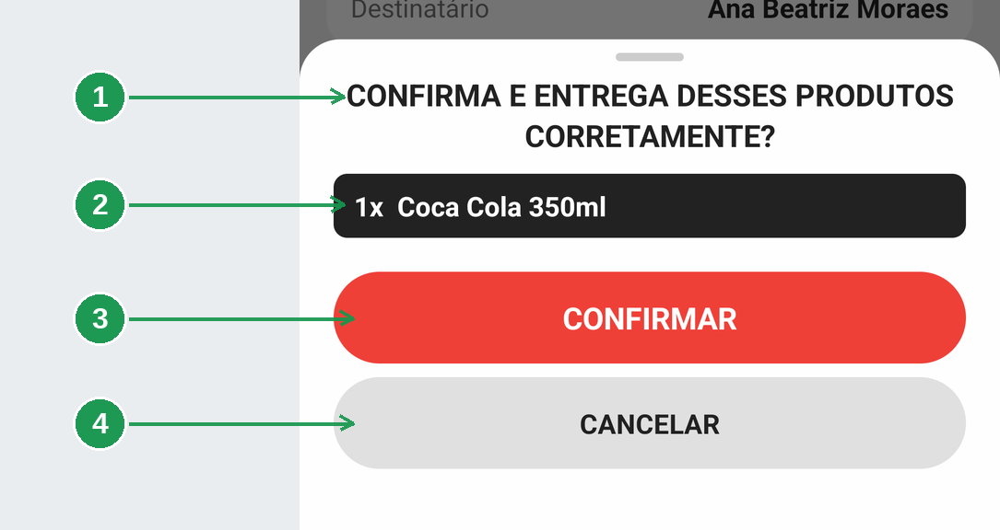
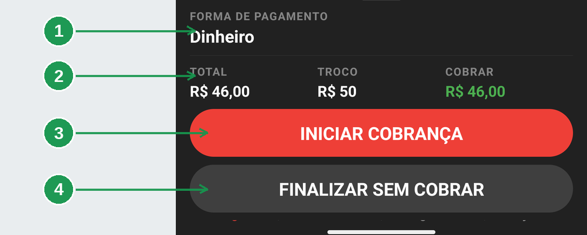
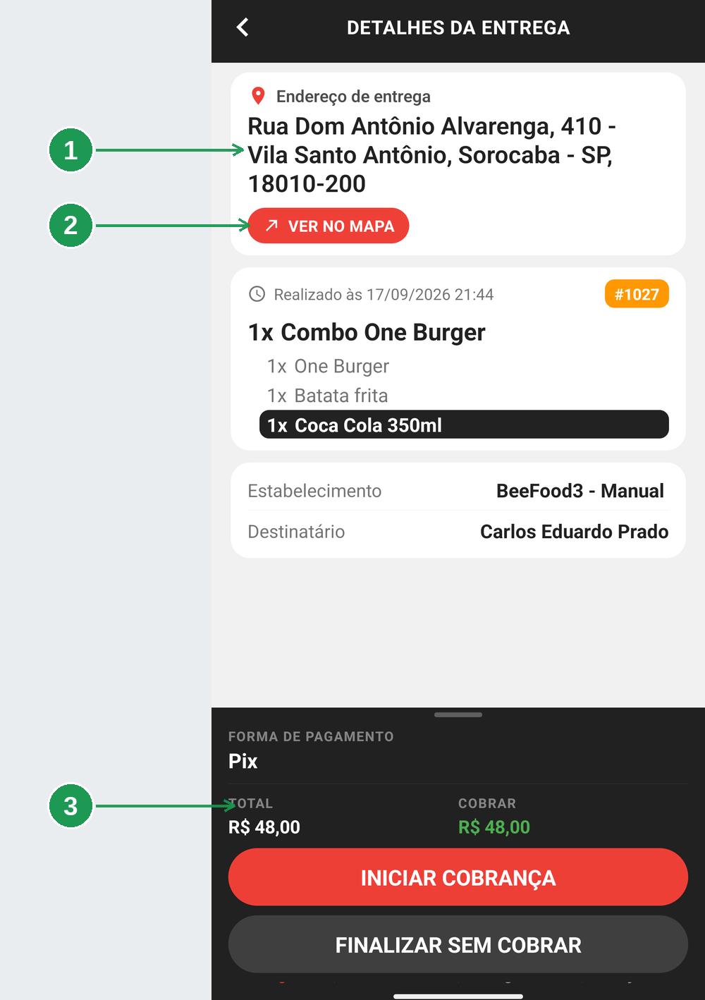
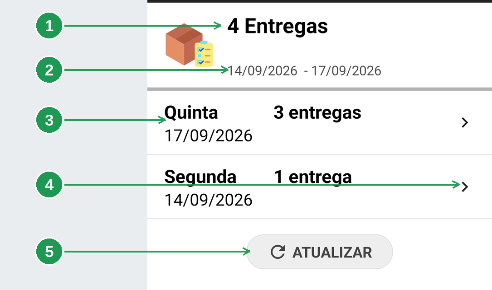
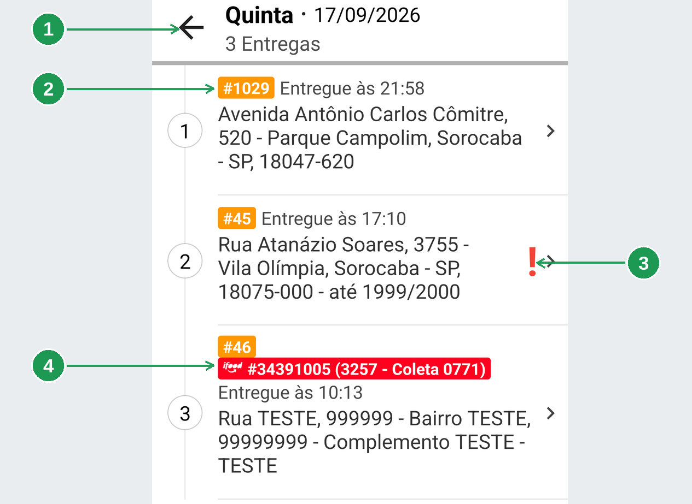
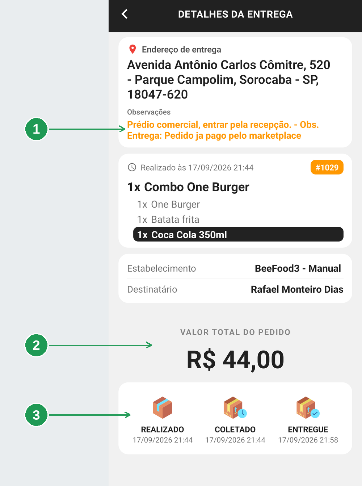

# App do entregador: as entregas do dia e o histórico

Esta é a tela onde o entregador passa o turno: a **lista de entregas** no nome dele, os
**detalhes** de cada uma e o **histórico** do que já foi entregue.

> As imagens têm **setas numeradas** (1, 2, 3…). Cada número indica o campo correspondente na
> tela.

## Para que serve

- Ver as entregas que são suas, na ordem que faz sentido rodar.
- Saber, antes de sair, o que tem dentro da sacola, o que conferir e quanto cobrar.
- Achar uma entrega antiga e provar a hora em que ela aconteceu.

## Antes de começar

- Você precisa estar dentro do aplicativo. O primeiro acesso está em
  [App do entregador: instalar, entrar e ficar disponível](../app-entregador-entrar/app-entregador-entrar.md).
- A lista mostra **apenas** os pedidos atribuídos a você. Pedido de outro entregador, ou ainda
  sem entregador, não aparece.

---

## 1. A lista de entregas

Cada cartão é uma entrega. A ordem em que eles aparecem já é uma sugestão de roteiro.

**A ordem não é por chegada, é por distância da loja** — do mais perto para o mais longe. Neste
exemplo: 1 km, 1,4 km, 1,8 km e 2,7 km. Pedido sem coordenada cai no fim da lista.

A faixa vermelha da esquerda, e a linha que liga os círculos numerados, desenham essa sequência
de cima para baixo. **Os números dos círculos são do aplicativo**, e valem a posição da entrega
na sequência — não confunda com o número do pedido, que é a etiqueta laranja.

> Quando o restaurante monta uma **rota** para você, a ordem passa a ser a que **ele** definiu.
> Isso está em [App do entregador: chegar no endereço](../app-entregador-rota/app-entregador-rota.md).

### Como ler um cartão

| Nº | Onde | O que é |
|----|------|---------|
| 1. | **#1026** | O número do pedido, na etiqueta laranja. |
| 2. | **Previsão Entrega** | Quando o pedido está prometido ao cliente. Fica em vermelho quando já passou da hora. |
| 3. | **Flecha `>`** | Abre os detalhes da entrega. |
| 4. | **Círculo com o número** | A posição desta entrega na sequência. |
| 5. | **Cobrar R$** | Em verde, o que você recebe na porta. Não aparece quando o pedido já está pago. |

O endereço é o texto grande em preto: rua, número, bairro, cidade, CEP e o complemento, quando
existir.

**O que o cartão não mostra:** os itens do pedido, o telefone do cliente e a forma de pagamento.
Isso está nos detalhes, a um toque de distância. Também não há aqui nenhum botão de cobrar ou
finalizar — essas ações vivem **dentro** dos detalhes, para ninguém baixar a entrega errada com
um toque no lugar errado.

### O fim da lista

| Nº | Onde | O que faz |
|----|------|-----------|
| 1. | **ATUALIZAR** | Recarrega a lista. Arrastar a tela para baixo faz o mesmo. |
| 2. | **MELHOR ROTA GOOGLE MAPS (4)** | Abre as paradas no Google Maps, na melhor ordem. O número entre parênteses é quantas ele vai abrir de uma vez. |

O botão azul fica **fixo** acima das abas, e não desaparece ao rolar. Ele está explicado em
[App do entregador: chegar no endereço](../app-entregador-rota/app-entregador-rota.md).

### Três formas de atualizar

Arrastar a tela para baixo, tocar em **ATUALIZAR**, ou sair e voltar para a aba *Entregas* — o
aplicativo recarrega sozinho ao voltar. Quando chega pedido novo pela notificação, ele já faz
isso por você: abre em *Entregas*, fecha o detalhe que estiver aberto e recarrega.

---

## 2. Os detalhes da entrega

Tocar num cartão abre esta tela. É aqui que está tudo o que você precisa na porta do cliente.

| Nº | Onde | O que é |
|----|------|---------|
| 1. | **Endereço de entrega** | O endereço completo. Fica **fixo no alto**: ao rolar para ver o pedido, ele continua visível. |
| 2. | **Tarja vermelha** | O complemento — apartamento, bloco, "casa do fundo". |
| 3. | **Observações** | Em laranja, o recado que o cliente deixou no pedido. |
| 4. | **VER NO MAPA** | Abre o endereço no Google Maps ou no Waze. |
| 5. | **Os itens** | O que tem dentro da sacola, com a quantidade sempre como `1x`. |
| 6. | **A linha preta** | Item que a loja marcou para **conferir antes de entregar**. |
| 7. | **Estabelecimento e Destinatário** | A loja que enviou e o nome de quem recebe. |

**O complemento é vermelho porque é o que mais se erra.** Número de apartamento, bloco e "casa do
fundo" são a informação que faz subir o prédio errado — então ela é a mais gritante da tela.

### A linha preta é uma conferência

O item com fundo preto não é enfeite: é o que a loja marcou para você conferir antes de entregar
— tipicamente bebida, sobremesa e brinde, que são os que ficam para trás na sacola.

A marcação é **linha por linha**. Se a loja marcar só uma opção, só aquela linha fica preta; se
marcar o produto e todas as opções, o cartão inteiro do item fica preto.

E ela **te para** antes de fechar a entrega:

| Nº | Onde | O que é |
|----|------|---------|
| 1. | **CONFIRMA E ENTREGA DESSES PRODUTOS CORRETAMENTE?** | A pergunta que sobe antes de cobrar ou finalizar. |
| 2. | **A lista** | Só os itens marcados, não o pedido inteiro. |
| 3. | **CONFIRMAR** | Segue para a cobrança ou para a baixa. |
| 4. | **CANCELAR** | Volta aos detalhes, sem fazer nada. |

É a última chance de olhar dentro da sacola antes de dar a entrega por feita.

### O rodapé escuro

| Nº | Onde | O que é |
|----|------|---------|
| 1. | **FORMA DE PAGAMENTO** | Como o cliente **disse** que vai pagar. |
| 2. | **TOTAL, TROCO e COBRAR** | O valor do pedido, para quanto o cliente vai pagar, e o que você recebe na porta (em verde). |
| 3. | **INICIAR COBRANÇA** | Receber na porta. |
| 4. | **FINALIZAR SEM COBRAR** | Baixar a entrega sem receber nada. |

O **TROCO** só aparece quando o cliente informou o valor. O cinza do segundo botão é deliberado:
os dois estão disponíveis, mas cobrar é o caminho normal.

> **A forma de pagamento é o que o cliente informou no pedido, não uma decisão fechada.** Se ele
> disser que vai pagar de outro jeito, você escolhe na hora da cobrança —
> [App do entregador: receber na porta](../app-entregador-cobranca/app-entregador-cobranca.md).

### Quando o pedido não tem complemento nem observação

| Nº | Onde | O que mudou |
|----|------|-------------|
| 1. | **Endereço** | Sem tarja vermelha e sem a linha de observações. |
| 2. | **VER NO MAPA** | Subiu, encostado no endereço. |
| 3. | **O rodapé** | Pedido em **Pix**: há TOTAL e COBRAR, e a coluna **TROCO nem existe**. |

**Nada fica vazio nem com traço:** o que não existe simplesmente não aparece na tela. É por isso
que dois pedidos podem ter alturas de tela bem diferentes.

---

## 3. O histórico

A aba **Histórico** guarda o que você já entregou. É o seu comprovante dentro do aplicativo.

| Nº | Onde | O que é |
|----|------|---------|
| 1. | **4 Entregas** | O total do período. |
| 2. | **O período** | As datas que o histórico está mostrando. |
| 3. | **O cartão do dia** | Dia da semana, data e quantas entregas você fez nele. |
| 4. | **Flecha `>`** | Abre as entregas daquele dia. |
| 5. | **ATUALIZAR** | Recarrega. |

**O aplicativo não tem filtro de data.** O período vem do restaurante, e o histórico traz apenas
**as suas** entregas — pedido que outro entregador levou não aparece aqui.

### Abrir um dia

| Nº | Onde | O que é |
|----|------|---------|
| 1. | **Flecha de voltar** | Volta para a lista de dias. |
| 2. | **#1029 · Entregue às 21:58** | O número do pedido e a hora em que você deu baixa. |
| 3. | **`!` vermelho** | Esta entrega saiu **atrasada** em relação à previsão. |
| 4. | **Etiqueta do marketplace** | O código do pedido na plataforma. iFood em vermelho, 99Food em amarelo, Uber Eats em preto. |

Os círculos numerados à esquerda são do aplicativo, e valem a ordem daquele dia.

### Abrir uma entrega do histórico

| Nº | Onde | O que é |
|----|------|---------|
| 1. | **Observações** | O recado do cliente **e** a observação que você escreveu ao finalizar. |
| 2. | **VALOR TOTAL DO PEDIDO** | No lugar de TOTAL / TROCO / COBRAR. |
| 3. | **A linha do tempo** | REALIZADO, COLETADO e ENTREGUE, com a hora de cada um. |

Três diferenças em relação à entrega aberta:

| | Entrega aberta | No histórico |
|---|---|---|
| Rodapé | botões de cobrar e finalizar | não existe |
| Valor | TOTAL / TROCO / COBRAR | **VALOR TOTAL DO PEDIDO** |
| Fim da tela | — | **linha do tempo** com os três horários |

A linha do tempo é o que você usa para provar **quando** a entrega aconteceu.

> **A sua observação fica registrada para sempre.** No exemplo, o texto *"Obs. Entrega: Pedido ja
> pago pelo marketplace"* é o que o entregador escreveu ao finalizar sem cobrar. Vale escrever
> com cuidado: é o registro permanente daquela entrega.

---

## Perguntas frequentes

**Uma entrega que eu já fiz continua na lista.**
A finalização provavelmente não chegou ao servidor. Abra o detalhe: se o botão de finalizar ainda
está lá, ela não foi baixada.

**Uma entrega desapareceu sem eu fazer nada.**
O restaurante pode tê-la passado para outro entregador, ou cancelado o pedido. O histórico só
guarda o que **você** entregou.

**Os itens do pedido não aparecem.**
Eles são buscados no momento em que você abre o detalhe. Sem internet, o cartão do pedido fica
vazio — volte e abra de novo com sinal. Vale para o histórico também.

**O complemento está errado ou faltando.**
Ele vem do cadastro do cliente. Ligue para o restaurante: o aplicativo não edita endereço.

**A forma de pagamento não é a que o cliente diz.**
Normal. Siga para a cobrança e escolha a forma correta lá.

**O histórico está vazio.**
Ou você ainda não finalizou nada, ou o aplicativo perdeu a conexão. Toque em **ATUALIZAR**.

**Uma entrega que eu fiz não está no histórico.**
Se ela ainda aparece na aba *Entregas*, não foi finalizada. Se não aparece em nenhuma das duas,
fale com o restaurante.

---

## Onde continuar

| Manual | O que cobre |
|--------|-------------|
| [App do entregador: instalar, entrar e ficar disponível](../app-entregador-entrar/app-entregador-entrar.md) | Permissões, login e a pílula de disponibilidade |
| [App do entregador: chegar no endereço](../app-entregador-rota/app-entregador-rota.md) | VER NO MAPA, a rota do restaurante e a melhor rota |
| [App do entregador: receber na porta](../app-entregador-cobranca/app-entregador-cobranca.md) | A cobrança, a divisão de conta e finalizar sem cobrar |
| [Código de barras no aplicativo](../app-entregador-codigo-barras/app-entregador-codigo-barras.md) | Despachar o pedido pela etiqueta do cupom |
| [Ler o mapa e o painel de entregas](../gestao-entregas-mapa-painel/gestao-entregas-mapa-painel.md) | O mesmo pedido pelo lado do restaurante |

*Última atualização: setembro/2026 — BeeFood · Gestão de Entregas 2.0*
