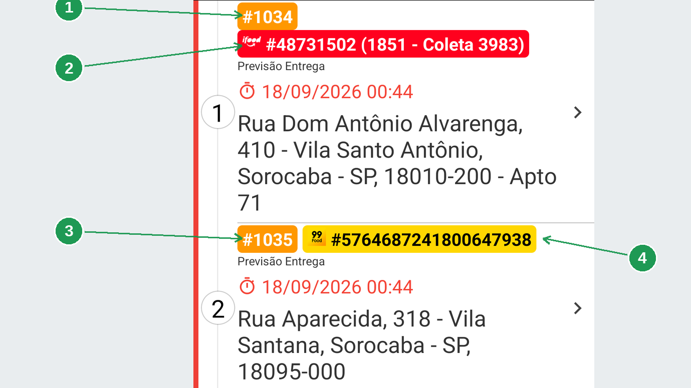
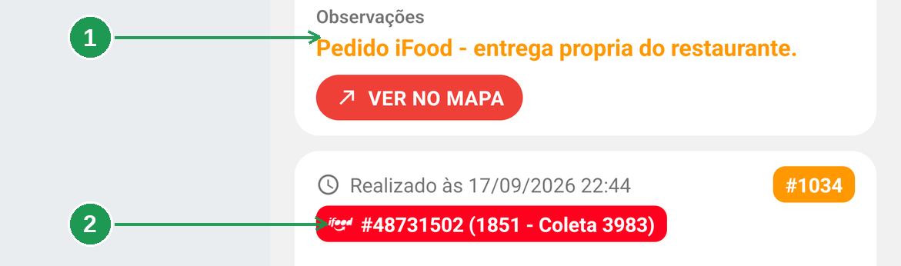
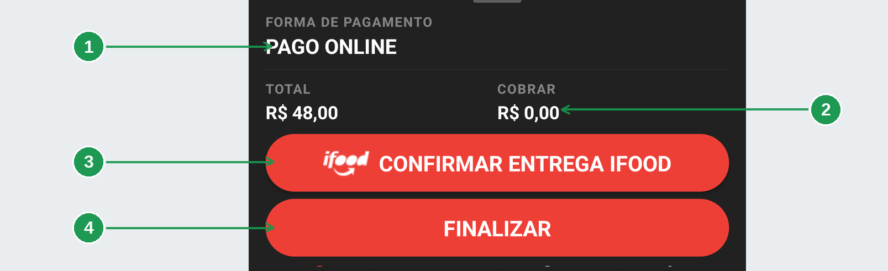
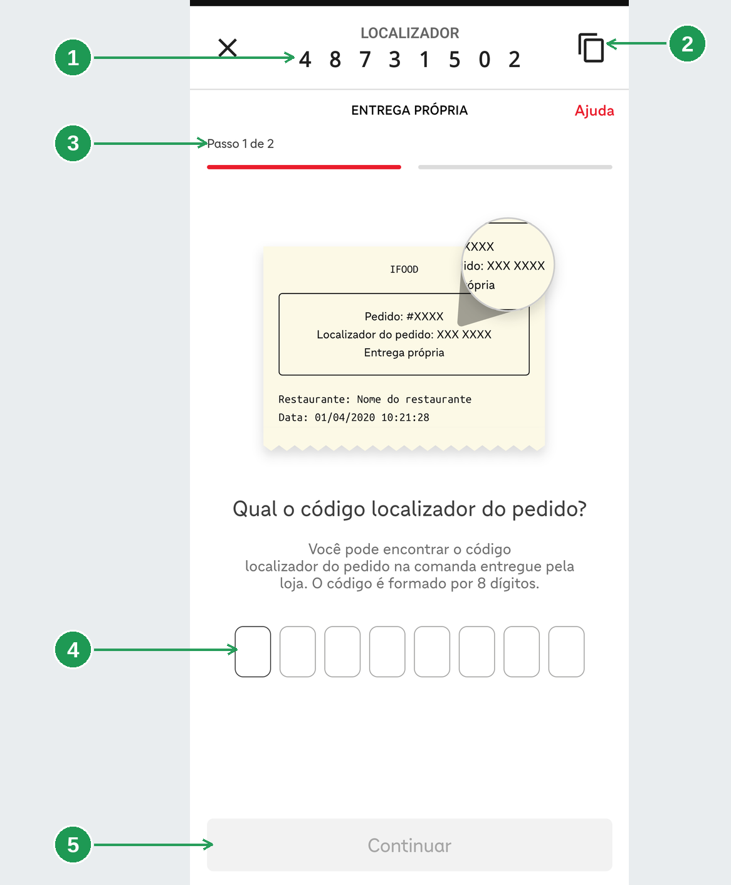
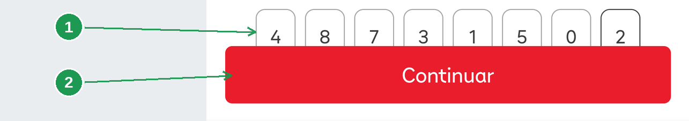
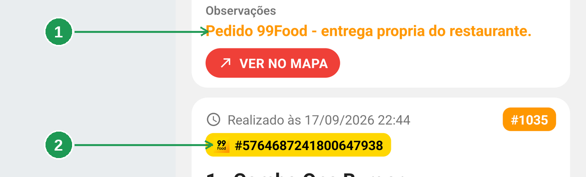
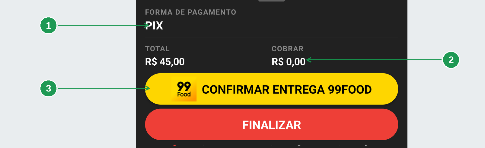
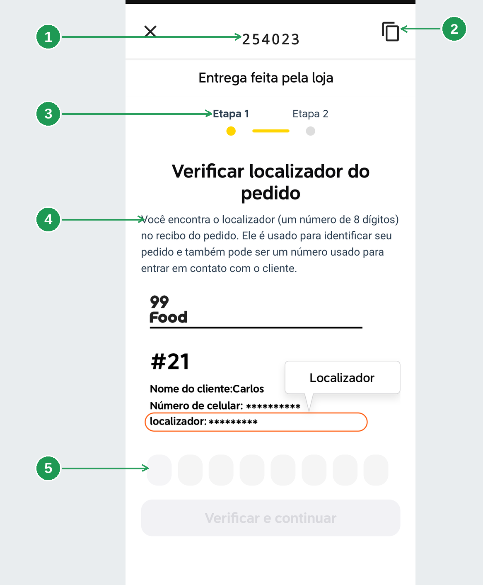
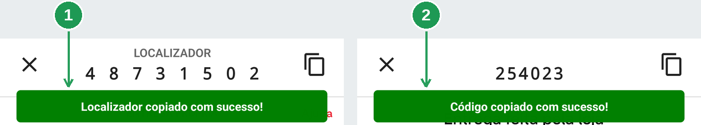

# App do entregador: pedido de iFood e de 99Food

Pedido que entrou pelo **iFood** ou pelo **99Food** e o restaurante entrega com o próprio
entregador tem duas diferenças, e as duas mudam o que você faz na porta do cliente:

| O que muda | O que significa |
|------------|-----------------|
| **Não há nada a receber** | o cliente pagou dentro do aplicativo da plataforma |
| **Há um passo a mais** | confirmar a entrega **no site da plataforma**, com um código |

> As imagens têm **setas numeradas** (1, 2, 3…). Cada número indica o campo correspondente na
> tela.

## Para que serve

- Reconhecer, antes de sair, que aquele pedido é de marketplace e já está pago.
- Confirmar a entrega na plataforma sem sair do aplicativo, e sem digitar o código à mão.
- Fechar a entrega no restaurante depois disso — são dois registros diferentes.

## Antes de começar

- **Não cobre nada** nesses pedidos. O valor a cobrar é R$ 0,00, e isso não é erro.
- O celular precisa de **internet**: o site da plataforma abre dentro do aplicativo.
- O **cupom impresso** do pedido junto: é dele que sai o código, quando a tela não mostrar.

---

## 1. Como reconhecer na lista

O cartão do pedido de marketplace ganha um **segundo selo**, colorido pela plataforma, ao lado
do número do restaurante.

| Nº | Onde | O que é |
|----|------|---------|
| 1. | **#1034**, laranja | O número do pedido **no restaurante**. É por ele que você fala com a loja. |
| 2. | **Selo vermelho do iFood** | O número do pedido **no iFood**, com o localizador de 8 dígitos e a referência da coleta. |
| 3. | **#1035**, laranja | O mesmo número de restaurante do segundo pedido. |
| 4. | **Selo amarelo do 99Food** | O número do pedido **no 99Food** — um número bem mais longo. |

Os dois números convivem, e cada um serve a um interlocutor: o **laranja** para falar com a
loja, o **colorido** para falar com a plataforma.

**Repare no que não está no cartão: não há linha *Cobrar R$*.** Em pedido de marketplace ela não
aparece porque não há saldo a receber.

---

## 2. Pedido de iFood

### Os detalhes

| Nº | Onde | O que é |
|----|------|---------|
| 1. | **Pedido iFood - entrega propria do restaurante** | A observação escrita pela integração, em laranja, no cartão do endereço. |
| 2. | **Selo do iFood** | O mesmo selo da lista, repetido junto aos itens. |

Endereço, itens, item em destaque e **VER NO MAPA** funcionam como em qualquer entrega. Está em
[as entregas do dia](../app-entregador-entregas-do-dia/app-entregador-entregas-do-dia.md).

### O rodapé: pago, sem cobrança, com um botão a mais

| Nº | Onde | O que é |
|----|------|---------|
| 1. | **PAGO ONLINE** | A forma de pagamento. O cliente pagou no aplicativo do iFood. |
| 2. | **COBRAR R$ 0,00** | Nada a receber. O **TOTAL** ao lado é o valor do pedido, só para você conferir. |
| 3. | **CONFIRMAR ENTREGA IFOOD** | O passo a mais. Abre o site do iFood dentro do aplicativo. |
| 4. | **FINALIZAR** | Fecha a entrega no restaurante. |

**Não existe INICIAR COBRANÇA aqui, e não existe FINALIZAR SEM COBRAR.** Sem nada a receber,
**FINALIZAR** é a única ação de baixa.

### A confirmação no site do iFood

O botão vermelho abre o site de confirmação do iFood **dentro do aplicativo**, com o código já
na mão.

| Nº | Onde | O que é |
|----|------|---------|
| 1. | **LOCALIZADOR** | Os 8 dígitos do pedido, espaçados para você ler sem errar. Esta faixa é do aplicativo. |
| 2. | **Ícone de copiar** | Copia o localizador. |
| 3. | **Passo 1 de 2** | Daqui para baixo quem conduz é o iFood. |
| 4. | **Os oito quadradinhos** | Onde o código entra: digitado ou colado. |
| 5. | **Continuar** | Apagado enquanto faltar dígito. |

Tocar no ícone de copiar mostra **Localizador copiado com sucesso!** e põe o código na área de
transferência — dá para colar em vez de digitar.

| Nº | Onde | O que é |
|----|------|---------|
| 1. | **Os oito dígitos** | O localizador completo. |
| 2. | **Continuar** | Ficou vermelho: agora vale o toque. Daí em diante é o passo 2 de 2 do iFood. |

---

## 3. Pedido de 99Food

O 99Food funciona igual: pedido pago, confirmação no site da plataforma, baixa no aplicativo. O
que muda são as cores, o texto e o formato do código.

### Os detalhes

| Nº | Onde | O que é |
|----|------|---------|
| 1. | **Pedido 99Food - entrega propria do restaurante** | A observação da integração, no mesmo lugar. |
| 2. | **Selo amarelo** | O número do pedido no 99Food, bem mais longo que o localizador do iFood. |

### O rodapé

| Nº | Onde | O que é |
|----|------|---------|
| 1. | **PIX** | A forma que o cliente usou **na plataforma**. Aqui o pagamento já aconteceu — pode ser Pix, cartão ou outra. |
| 2. | **COBRAR R$ 0,00** | Nada a receber, como no iFood. |
| 3. | **CONFIRMAR ENTREGA 99FOOD** | Amarelo, com letras escuras. Abre o site do 99Food. |

O **FINALIZAR** continua logo abaixo, vermelho, igual ao do iFood.

### A confirmação no site do 99Food

| Nº | Onde | O que é |
|----|------|---------|
| 1. | **O código, no alto** | A faixa do aplicativo. Aqui **não** há a palavra *LOCALIZADOR*: é só o número que veio no pedido. |
| 2. | **Ícone de copiar** | O mesmo de sempre. O aviso, aqui, diz *Código copiado com sucesso!* |
| 3. | **Etapa 1 e Etapa 2** | A confirmação do 99Food tem duas etapas, como o iFood tem dois passos. |
| 4. | **A frase da própria página** | *Você encontra o localizador (um número de 8 dígitos) no recibo do pedido.* |
| 5. | **Os oito quadradinhos** | Onde o localizador entra. |

> **Atenção ao formato.** O código que o aplicativo mostra no alto é o que veio no pedido, e no
> 99Food ele costuma ter **6 dígitos** — não é necessariamente o localizador de **8 dígitos** que
> o site pede. Se não casar, o número que vale é o do **recibo do pedido**, e é o que a própria
> tela do 99Food indica.

No fim das duas etapas, quem conduz é o site: o botão **Verificar e continuar** é dele.

---

## 4. As duas plataformas, lado a lado

A única diferença entre os dois avisos de cópia é o texto:

| Nº | Onde | O que é |
|----|------|---------|
| 1. | **Localizador copiado com sucesso!** | O aviso do iFood. |
| 2. | **Código copiado com sucesso!** | O aviso do 99Food. |

| | iFood | 99Food |
|---|---|---|
| Cor do selo | vermelho | amarelo |
| O que o selo mostra | localizador de 8 dígitos + referência da coleta | o número longo do pedido |
| Rótulo na faixa do aplicativo | **LOCALIZADOR** | nenhum, só o código |
| Aviso ao copiar | *Localizador copiado com sucesso!* | *Código copiado com sucesso!* |
| Passos no site | *Passo 1 de 2* | *Etapa 1* e *Etapa 2* |
| Cor do botão de confirmar | vermelho, letras brancas | amarelo, letras escuras |

O resto é igual: pedido pago, **COBRAR R$ 0,00**, botão de confirmação acima do **FINALIZAR** e
nenhuma cobrança na porta.

---

## 5. A ordem certa das coisas

1. **Confirme na plataforma**, pelo botão colorido, até o site dizer que acabou.
2. **Finalize no aplicativo**, pelo **FINALIZAR**.

**Uma coisa não faz a outra.** A confirmação é a prova de entrega que a plataforma pede; o
**FINALIZAR** é o que fecha a entrega no restaurante, tira o pedido da sua lista e manda ele
para o seu histórico.

> **Fechar a tela de confirmação com o X não desfaz nada e não finaliza nada.** É só sair do
> site. Você pode reabrir quantas vezes quiser, pelo mesmo botão.

O **FINALIZAR** é o mesmo dos outros pedidos: se houver item em destaque, ele abre a folha de
conferência antes, e há campo de observação. Está em
[receber na porta](../app-entregador-cobranca/app-entregador-cobranca.md).

---

## Perguntas frequentes

**O cliente quer pagar na entrega.**
Não é o caso. O pedido está pago na plataforma, e o aplicativo mostra **COBRAR R$ 0,00**. Não
receba nada.

**A tela da plataforma não carrega.**
É um site, e precisa de internet. Sem sinal, fica em branco ou carregando — o aplicativo desiste
do indicador depois de alguns segundos. Tente de novo com sinal melhor.

**O código não aparece no alto da tela.**
Acontece quando o pedido não trouxe o identificador completo da plataforma. O código está na
**comanda impressa** que a loja entregou — é exatamente o que o desenho de comanda da tela da
plataforma mostra.

**A plataforma diz que o código não existe.**
Confira dígito a dígito com a comanda. No 99Food, confira também o **formato**: o site pede 8
dígitos. Se persistir, fale com o restaurante — pode ser outro pedido.

**Confirmei na plataforma e esqueci de finalizar.**
O pedido continua na sua lista e a loja continua vendo a entrega aberta. Abra os detalhes e toque
em **FINALIZAR**.

**Finalizei e não confirmei na plataforma.**
O restaurante fechou a entrega, mas a plataforma não recebeu a prova. Avise a loja: a confirmação
pode ser feita pelo portal da plataforma.

**O pedido é de outra plataforma e não tem botão de confirmação.**
Nem toda plataforma pede confirmação de entrega própria. Nesse caso o pedido traz só o selo, e
você finaliza direto.

---

## Onde continuar

| Manual | O que cobre |
|--------|-------------|
| [App do entregador: as entregas do dia e o histórico](../app-entregador-entregas-do-dia/app-entregador-entregas-do-dia.md) | A lista, o cartão e os detalhes |
| [App do entregador: receber na porta](../app-entregador-cobranca/app-entregador-cobranca.md) | Cobrar, dividir a conta e finalizar |
| [App do entregador: chegar no endereço](../app-entregador-rota/app-entregador-rota.md) | Mapa, rota e melhor rota |
| [Vincular produto do marketplace](../vinculo-marketplace/vinculo-marketplace.md) | Como o pedido da plataforma entra no restaurante |
| [Entrega fácil iFood](../entrega-facil-ifood/entrega-facil-ifood.md) | Quando a entrega é do iFood, e não do restaurante |

*Última atualização: setembro/2026 — BeeFood · Gestão de Entregas 2.0*
