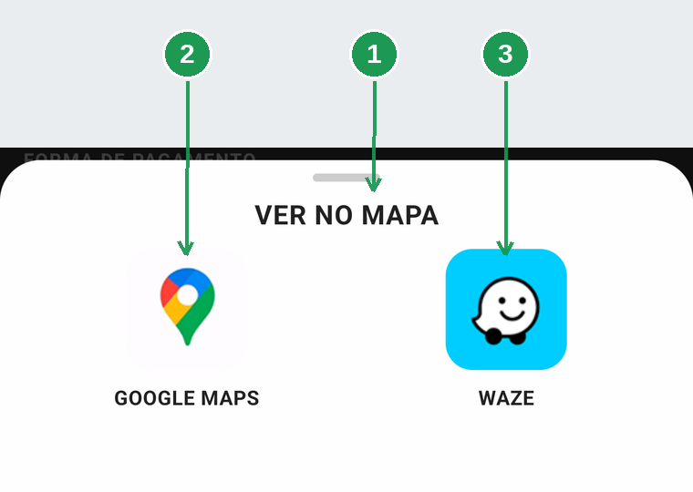
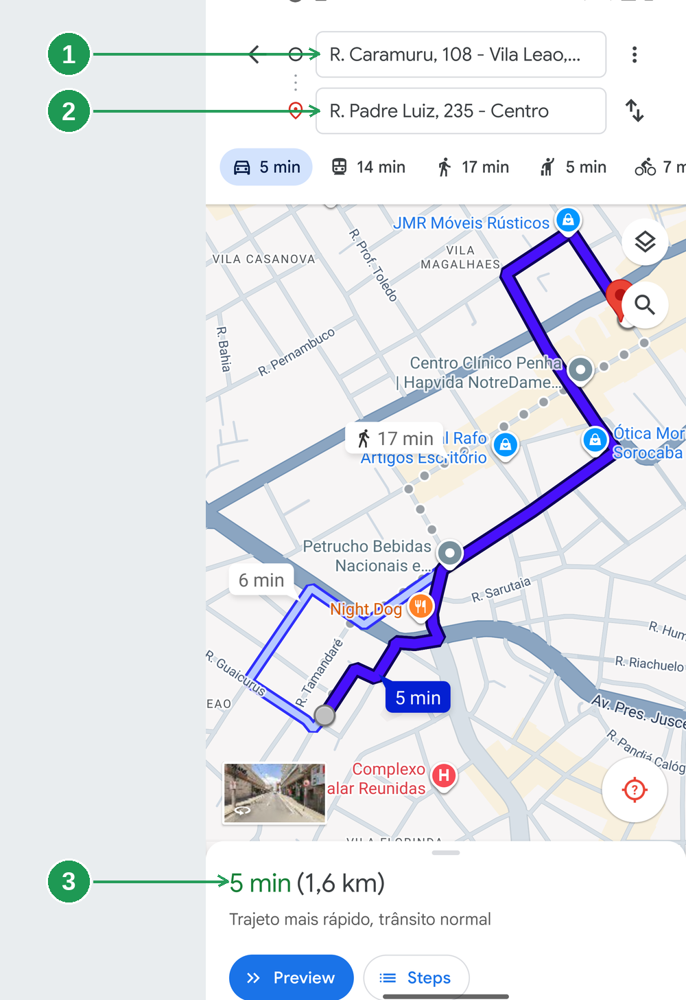
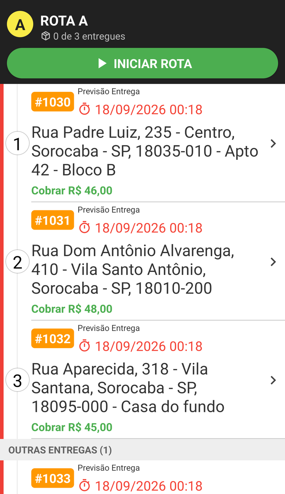
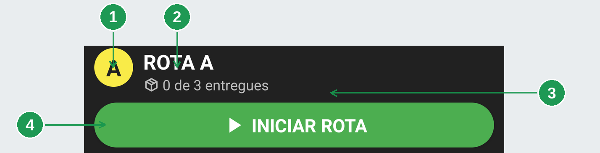
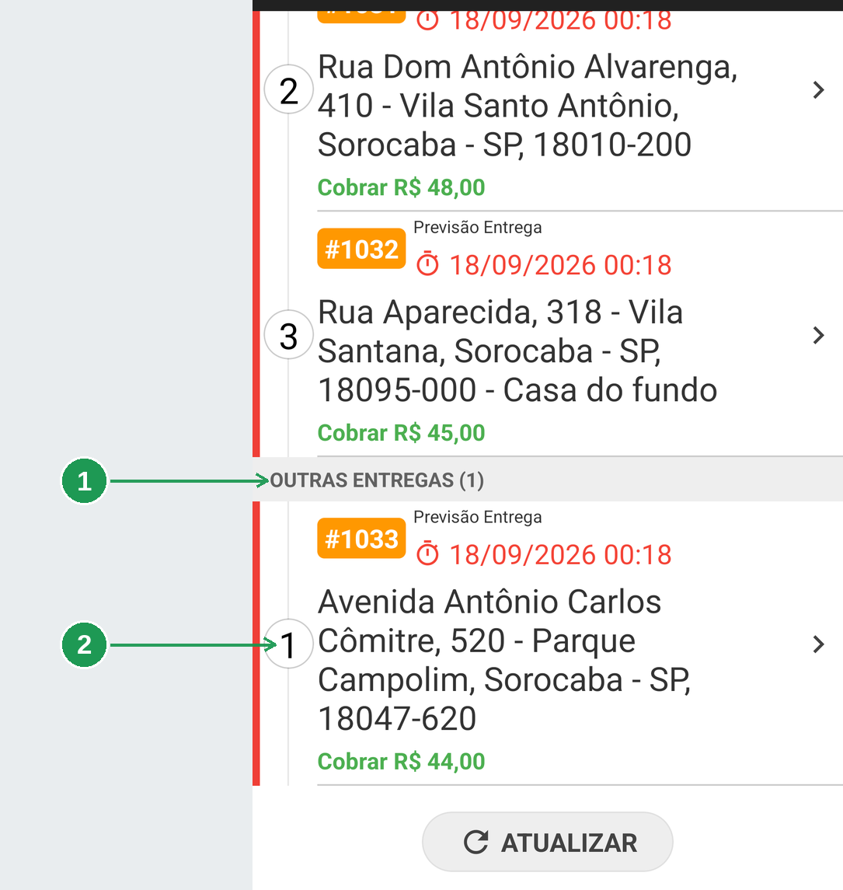
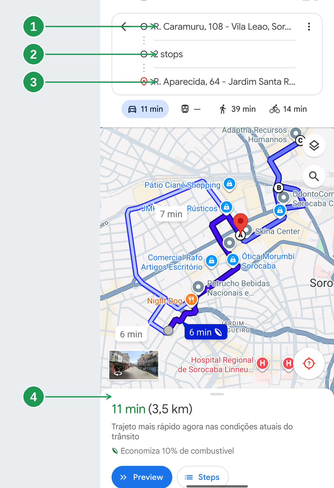
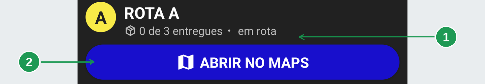
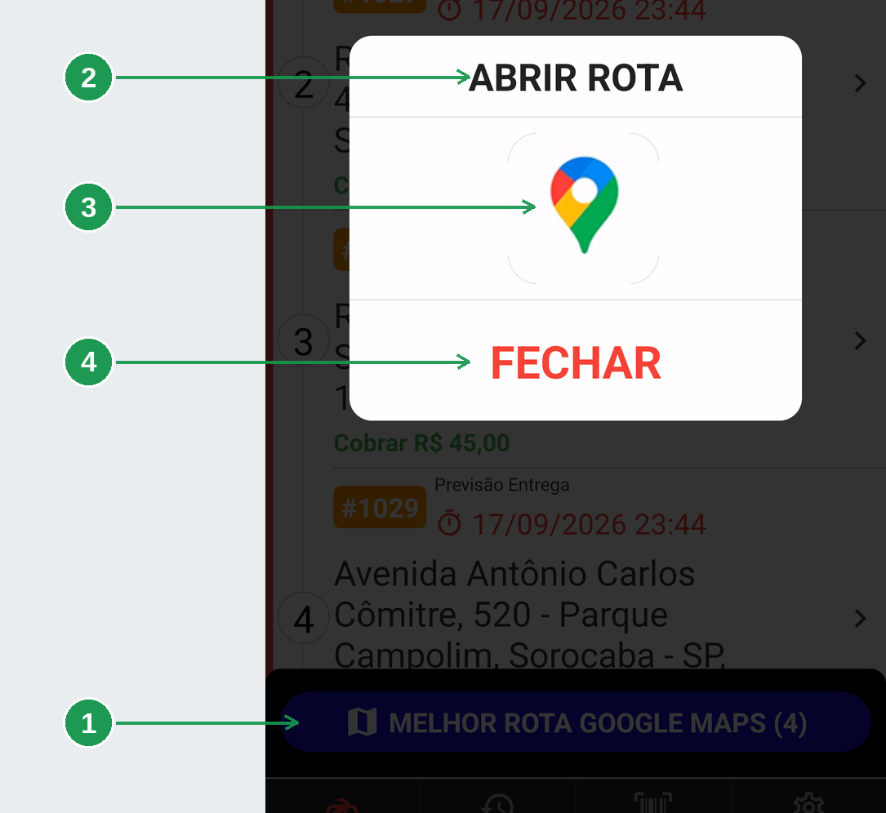
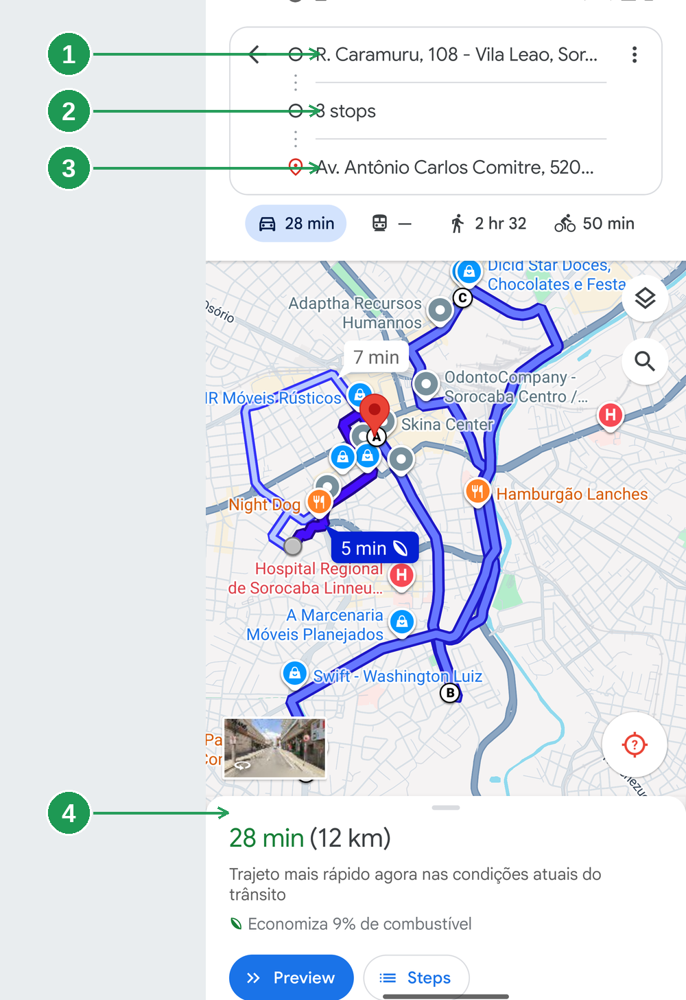

# App do entregador: chegar no endereço

São **três caminhos** para o mapa, e cada um serve a uma situação diferente:

| Caminho | Quando usar |
|---------|-------------|
| **VER NO MAPA**, nos detalhes | uma entrega só |
| **INICIAR ROTA**, no cabeçalho da rota | o restaurante montou a rota para você |
| **MELHOR ROTA GOOGLE MAPS**, no pé da lista | várias entregas soltas, e você escolhe a ordem |

Escolher o errado custa caminho — e, no caso do **INICIAR ROTA**, dispara aviso para o cliente.

> As imagens têm **setas numeradas** (1, 2, 3…). Cada número indica o campo correspondente na
> tela.

## Para que serve

- Abrir a navegação até o endereço do cliente, sem digitar nada.
- Sair da loja com três ou quatro entregas numa rota única.
- Seguir a ordem que o restaurante montou, quando ele montou.

## Antes de começar

- O **Google Maps** precisa estar instalado. É por ele que tudo funciona.
- O **Waze** só aparece como opção para uma entrega — e só funciona se estiver instalado no
  celular.
- A **permissão de localização** precisa estar concedida: toda rota começa na sua posição. Está em
  [App do entregador: instalar, entrar e ficar disponível](../app-entregador-entrar/app-entregador-entrar.md).

---

## 1. Uma entrega: VER NO MAPA

O botão **VER NO MAPA** está no cartão do endereço, dentro dos detalhes da entrega. Tocar nele
não abre o mapa direto: sobe uma folha para você escolher.

| Nº | Onde | O que é |
|----|------|---------|
| 1. | **VER NO MAPA** | O título da folha. |
| 2. | **GOOGLE MAPS** | Abre no Google Maps. |
| 3. | **WAZE** | Abre no Waze. |

O mapa sai da sua **posição atual** e vai até o endereço do cliente, com a rota já traçada.

| Nº | Onde | O que é |
|----|------|---------|
| 1. | **Origem** | Onde você está agora. |
| 2. | **Destino** | O endereço do cliente. |
| 3. | **Tempo e distância** | No exemplo, 5 min e 1,6 km. |

Daí para frente é o Google Maps de sempre. Para voltar ao BeeFood, use o botão Voltar do celular.

### O endereço vai como texto, não como ponto no mapa

Esta é a parte que evita rodar em vão: o aplicativo manda para o mapa o **endereço escrito** —
rua, número, bairro, cidade e CEP — e quem procura o ponto é o próprio Google Maps ou Waze.

**Consequência prática: endereço mal cadastrado leva o mapa para o lugar errado.** Um bairro com
nome parecido com o de uma clínica, por exemplo, e o mapa propõe rota para a clínica.

> Se o destino no mapa não parecer com o endereço do cartão, **confie no cartão**. Na dúvida,
> digite o endereço à mão dentro do aplicativo de mapa.

A exceção são os pedidos de **marketplace**: neles o aplicativo manda a coordenada, porque o
endereço vem abreviado da plataforma. Está em
[App do entregador: pedido de iFood e de 99Food](../app-entregador-marketplace/app-entregador-marketplace.md).

### O Waze precisa estar instalado

O botão do Waze abre um link. Com o Waze instalado, o celular joga o link nele e a navegação
começa. **Sem o Waze, o mesmo link cai no navegador** — e você vê uma página, não uma rota. Se
você navega pelo Waze, instale antes do turno.

---

## 2. Quando o restaurante monta a rota

Até aqui a lista era uma lista, e você decidia a ordem. Quando o restaurante monta uma **rota**,
ele escolhe quais pedidos saem juntos e em que ordem — e a lista muda de cara.

A rota aparece como um **grupo**, com cabeçalho próprio, e os pedidos dela ficam logo abaixo,
numerados. **Esse número é a ordem que o restaurante definiu**, não a posição na tela.

Quem não usa rota não vê nada disso: a lista continua exatamente como antes.

### O cabeçalho da rota

| Nº | Onde | O que é |
|----|------|---------|
| 1. | **Círculo amarelo** | A letra da rota. Com duas rotas na tela, é como você distingue uma da outra. |
| 2. | **ROTA A** | O nome da rota. |
| 3. | **0 de 3 entregues** | Quantas paradas você já fechou, de quantas a rota tem. |
| 4. | **INICIAR ROTA** | O botão verde. Leia a próxima seção antes de tocar. |

### O que não está na rota

| Nº | Onde | O que é |
|----|------|---------|
| 1. | **OUTRAS ENTREGAS (1)** | A faixa que separa as entregas soltas das paradas da rota. |
| 2. | **O cartão solto** | Funciona como sempre funcionou, e tem numeração própria, que começa do 1. |

Essa faixa **só aparece quando as duas coisas estão na tela ao mesmo tempo**. Sem rota, a lista é
a lista, sem cabeçalho nenhum.

### INICIAR ROTA faz duas coisas de uma vez

> **É um caminho só de ida.** Um toque em **INICIAR ROTA**:
>
> 1. **avisa que você saiu** — os pedidos da rota passam para *em transporte*, o painel do
>    restaurante mostra isso na hora e o cliente recebe a mensagem de *saiu para entrega*;
> 2. **abre o Google Maps** com as paradas na ordem da rota, partindo de onde você está.
>
> Depois de iniciar, o restaurante já contou com você na rua. **Não toque para "só ver o
> caminho".**

| Nº | Onde | O que é |
|----|------|---------|
| 1. | **Origem** | Onde você está agora. |
| 2. | **2 stops** | As paradas do meio do caminho. |
| 3. | **Destino** | A última parada da rota. |
| 4. | **Tempo e distância** | Do trajeto inteiro: no exemplo, 11 min e 3,5 km. |

Aqui as paradas vão por **coordenada**, não por texto — é por isso que o Maps pode mostrar um
endereço um pouco diferente do cartão. O endereço que vale continua sendo o do cartão.

### Depois de iniciar, o cabeçalho muda

| Nº | Onde | O que mudou |
|----|------|-------------|
| 1. | **em rota** | A etiqueta ao lado do contador. É o sinal de que o restaurante já registrou a sua saída. |
| 2. | **ABRIR NO MAPS** | O botão verde virou azul. **Só reabre o mapa** — pode tocar quantas vezes quiser, sem avisar ninguém de novo. |

### A rota organiza o caminho; entregar continua sendo pedido por pedido

Toque no cartão, confira os itens e receba — ou finalize sem cobrar — como em
[receber na porta](../app-entregador-cobranca/app-entregador-cobranca.md).

Cada entrega concluída sobe o contador do cabeçalho: **1 de 3**, **2 de 3**. Quando a última
fecha, a rota se encerra sozinha e o grupo desaparece da tela.

O contador vem da **rota**, não dos cartões visíveis — por isso ele continua dizendo *de 3* mesmo
quando já sobraram dois cartões na tela.

---

## 3. Várias entregas soltas: MELHOR ROTA

O botão azul do pé da lista abre **todas as suas entregas soltas** numa rota única, na ordem que
economiza caminho. O número entre parênteses é quantas entregas vão entrar.

| Nº | Onde | O que faz |
|----|------|-----------|
| 1. | **MELHOR ROTA GOOGLE MAPS (4)** | Calcula a ordem das paradas. Fica fixo acima das abas. |
| 2. | **ABRIR ROTA** | A janela que aparece depois do cálculo. |
| 3. | **Ícone do Google Maps** | Abre a rota. |
| 4. | **FECHAR** | Desiste, sem abrir nada. |

| Nº | Onde | O que é |
|----|------|---------|
| 1. | **Origem** | Onde você está agora. |
| 2. | **3 stops** | As paradas do meio. |
| 3. | **Destino final** | A entrega mais distante. |
| 4. | **Tempo e distância** | Do trajeto inteiro: no exemplo, 28 min e 12 km. |

**A ordem é por proximidade**, calculada pelo BeeFood. Não é a ordem em que os pedidos chegaram
nem a ordem dos cartões na tela: saem primeiro as entregas do mesmo bairro, e a mais distante
sobra para o fim.

> **Este botão ignora a rota que o restaurante montou.** Ele cobre **só as entregas soltas** e
> reordena tudo por distância. Se você recebeu uma rota pronta, use o **INICIAR ROTA** do
> cabeçalho dela — cada rota tem o próprio botão.

**Só Google Maps.** Diferente do VER NO MAPA de uma entrega, aqui não há opção de Waze: o link
com várias paradas é recurso do Google Maps.

E com **uma** entrega solta o botão nem aparece: não há o que ordenar.

---

## Perguntas frequentes

**O mapa abre num lugar que não parece o endereço do cliente.**
Endereço cadastrado de forma ambígua. O endereço do cartão é o que vale; procure-o à mão no
aplicativo de mapa.

**Aparece "Permissão de localização é necessária para continuar".**
Toda rota começa na sua posição. Libere a localização pela tela de *Permissões* do menu.

**O mapa não traça a rota.**
Costuma ser sinal fraco. O aplicativo de mapa precisa de internet para calcular; o BeeFood só
entrega o endereço a ele.

**"Ocorreu uma falha ao gerar a melhor rota."**
O cálculo é feito no servidor. Sem internet, a rota não sai — tente de novo ou abra as entregas
uma a uma.

**Tenho duas rotas na tela.**
É normal em restaurante movimentado. Cada uma tem seu cabeçalho, sua letra e seu botão.

**Apareceu "Despacho não confirmado".**
O mapa é oferecido de qualquer forma, com um aviso. O aplicativo não tem como saber se o
restaurante registrou a saída — avise a loja.

**A rota sumiu da minha lista.**
O restaurante pode ter excluído a rota ou passado para outro entregador. Os pedidos saem da sua
lista junto.

**O contador diz "de 3" e só tem dois cartões na tela.**
Certo: o contador é da rota, não dos cartões. Uma das três já foi entregue.

---

## Onde continuar

| Manual | O que cobre |
|--------|-------------|
| [App do entregador: as entregas do dia e o histórico](../app-entregador-entregas-do-dia/app-entregador-entregas-do-dia.md) | A lista, o cartão e os detalhes |
| [App do entregador: receber na porta](../app-entregador-cobranca/app-entregador-cobranca.md) | Cobrar, dividir a conta e finalizar |
| [App do entregador: pedido de iFood e de 99Food](../app-entregador-marketplace/app-entregador-marketplace.md) | O que muda no pedido de marketplace |
| [Montar a rota](../gestao-entregas-montar-rota/gestao-entregas-montar-rota.md) | Como o restaurante monta a rota que aparece aqui |
| [Despachar a rota e acompanhar no mapa](../gestao-entregas-despachar/gestao-entregas-despachar.md) | O mesmo despacho, pelo painel |

*Última atualização: setembro/2026 — BeeFood · Gestão de Entregas 2.0*
