# BeeFood Entregador — aplicativo para motoboy

O **BeeFood Entregador** é o aplicativo do motoboy do restaurante. Com ele o entregador:

- Lê o **código de barras** do cupom e atrela o pedido a ele
- Vê a lista de entregas e o histórico recente
- Consulta endereço, produtos e forma de pagamento
- Abre a rota no **Google Maps** ou no **Waze**
- Marca a entrega como concluída (e confirma no iFood, quando for o caso)

> As imagens do **BeeFood web** têm **marcações em verde** (setas e números).
> As telas do celular são as do aplicativo — o desenho delas já vem do artigo original.

---

## Antes de começar

1. Celular **Android** ou **iPhone** do entregador.
2. Permissão para cadastrar **funcionário** e **usuário** no BeeFood.
3. Impressora do cupom de delivery (para o código de barras).

Baixe o aplicativo:

O login do app **não** é o do dono. Cada motoboy entra com o **usuário** que você criar para ele.

---

## Parte 1 — Configurar no BeeFood

### Passo 1. Abrir o card BeeFood Entregador

No menu, abra **Aplicativos**. Na seção **Entrega**, clique em **BeeFood Entregador** (1).

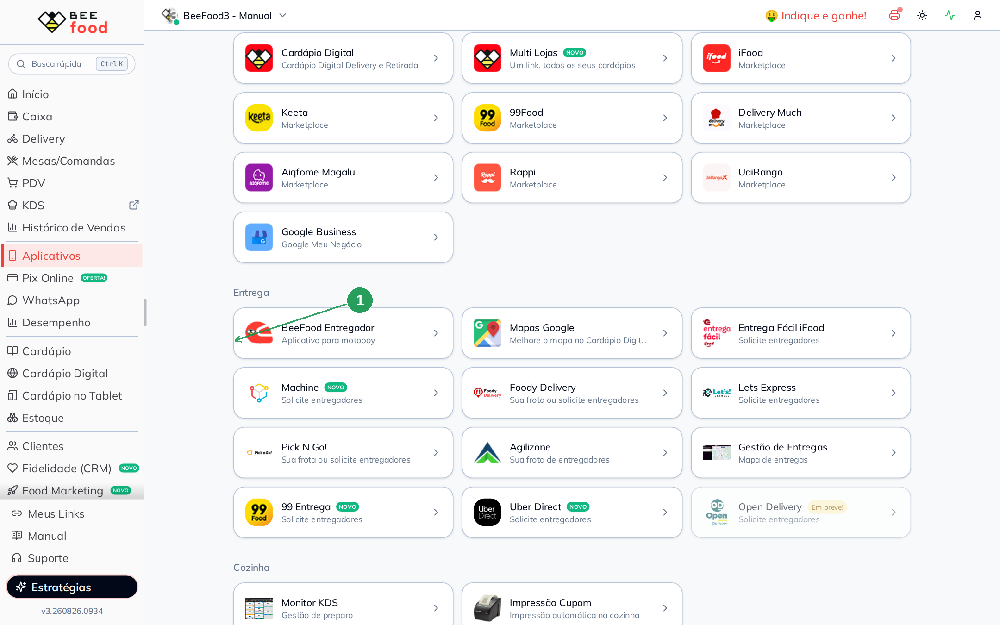

| Nº | O que fazer |
|----|-------------|
| 1 | Card **BeeFood Entregador** — *Aplicativo para motoboy*. |

### Passo 2. Ver o que o sistema pede

O modal não grava nada: ele lembra os dois cadastros e aponta as lojas.

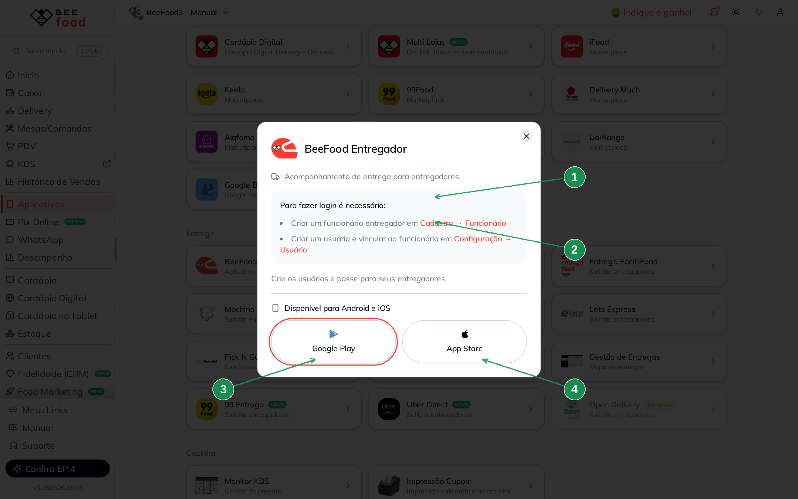

| Nº | O que fazer |
|----|-------------|
| 1 | Atalho para **Cadastro → Funcionário** (criar o entregador). |
| 2 | Atalho para **Configuração → Usuário** (criar o login e vincular). |
| 3 | **Google Play** (Android). |
| 4 | **App Store** (iPhone). |

Crie os usuários e passe login e senha para cada motoboy.

### Passo 3. Cadastrar o funcionário como Entregador

Em **Cadastro → Funcionários**, clique em **Novo Funcionário (F1)** (ou abra um já existente). Na aba **Dados**, coloque um **nome único**. Depois abra a aba **Função** (1) e marque **Entregador** (2).

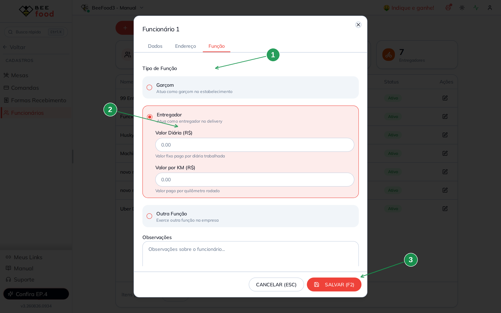

| Nº | O que fazer |
|----|-------------|
| 1 | Aba **Função**. |
| 2 | Tipo **Entregador**. Diária e valor por KM são opcionais (só para o seu controle). |
| 3 | **SALVAR (F2)**. |

Sem a função **Entregador**, o motoboy não entra na lista de entregadores do Delivery.

### Passo 4. Criar o usuário e ligar os Aplicativos

Em **Configuração → Usuários**, clique em **Novo Usuário**. Informe **login** e **senha**, vincule o **Funcionário** (1) e ligue o switch **Aplicativos** (2).

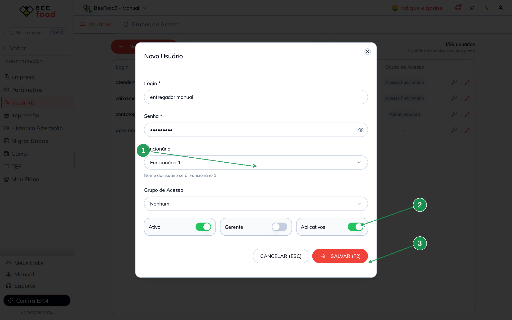

| Nº | O que fazer |
|----|-------------|
| 1 | **Funcionário** — o entregador do passo anterior. O nome do usuário passa a ser o dele. |
| 2 | Switch **Aplicativos** ligado. Sem isso o login não entra no app. |
| 3 | **SALVAR (F2)**. |

Deixe **Gerente** desligado. **Grupo de Acesso** pode ficar *Nenhum* se esse usuário só usa o celular.

### Passo 5. Ligar o código de barras no cupom

Em **Configuração → Impressão**, aba **Layout**, abra o **Cupom Pedido**. Vá em **Texto Padrão** (1) e marque **Código de Barras App Entrega** (2).

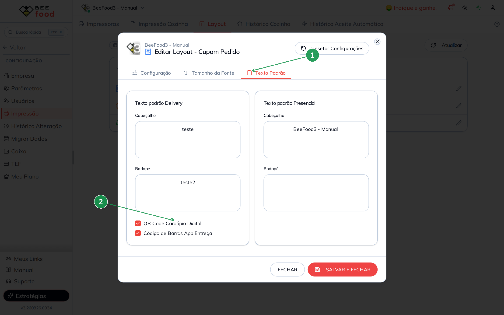

| Nº | O que fazer |
|----|-------------|
| 1 | Aba **Texto Padrão** do Cupom Pedido. |
| 2 | Checkbox **Código de Barras App Entrega**. Salve o layout. |

O código só sai em pedido de **delivery com entrega** (não sai em retirada nem no presencial). No cupom ele aparece **depois do endereço**:

---

## Parte 2 — Usar o aplicativo

O entregador entra com o login e a senha do Passo 4.

### Ler o código de barras

No menu do app, toque em **LER CÓDIGO BARRAS** e aponte o centro da câmera para o código do cupom. O pedido fica atrelado a esse entregador.

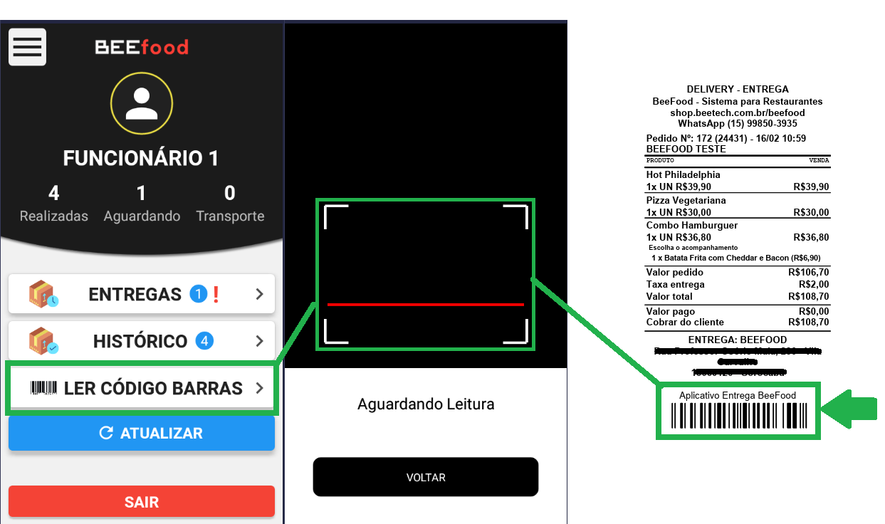

### Ver as entregas

Em **ENTREGAS** aparece a lista. Ao abrir um pedido, o app mostra produtos, endereço, forma de pagamento e os botões de rota e finalizar.

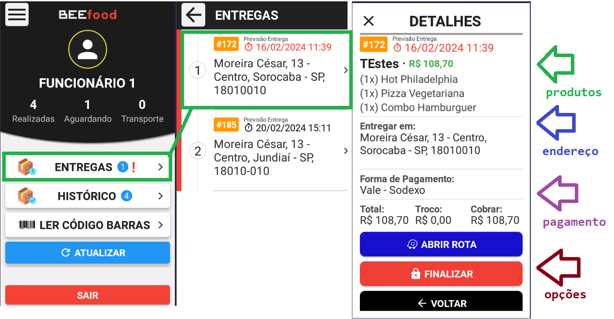

### Abrir a rota (Google Maps ou Waze)

No detalhe do pedido, toque em **ABRIR ROTA** e escolha **Google Maps** ou **Waze**.

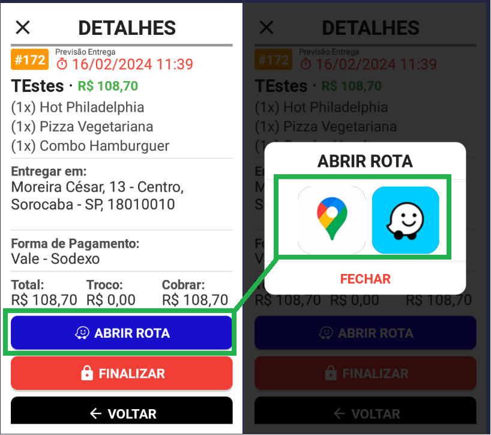

### Marcar como entregue

Toque em **FINALIZAR**, escreva uma observação se quiser e confirme **FINALIZAR**.

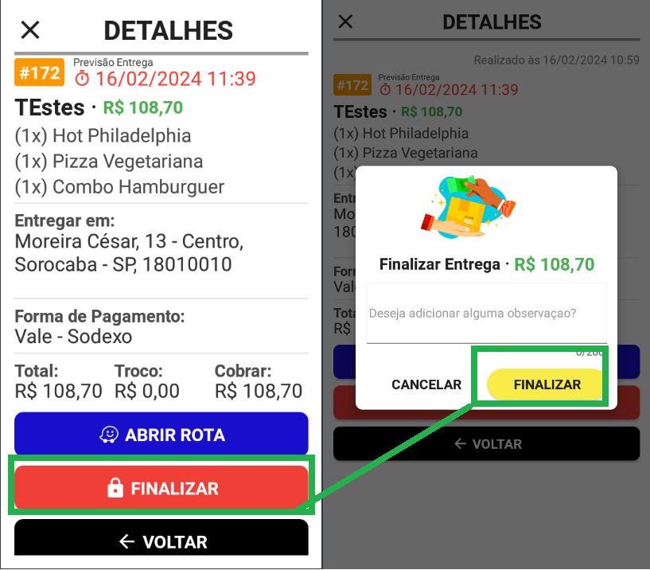

### Pedido do iFood — confirmar a entrega

Em pedido do iFood aparece **CONFIRMAR ENTREGA IFOOD**.

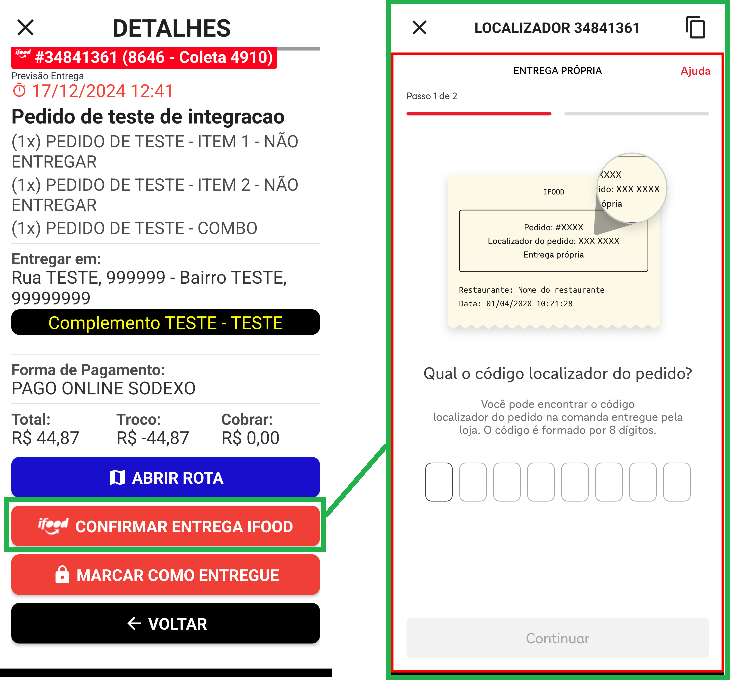

Cole o **localizador** do pedido (fica no topo da tela; dá para copiar no botão ao lado).

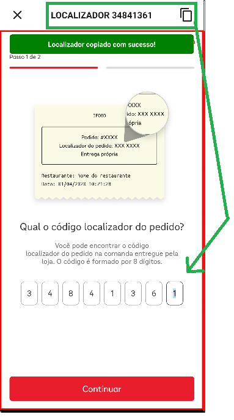

Peça ao cliente o **código de confirmação** do iFood e toque em **CONTINUAR**.

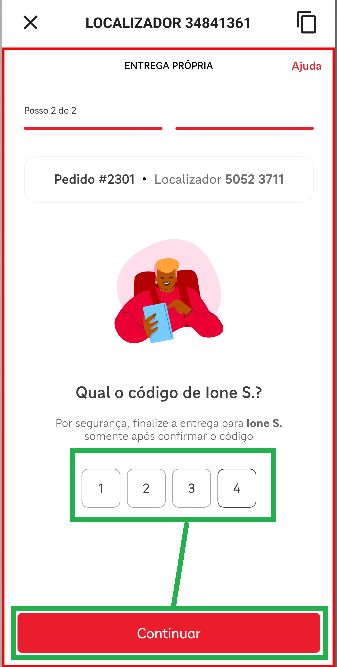

---

## Problemas comuns

| Sintoma | O que verificar |
|---------|-----------------|
| Não consegue entrar no app | Usuário com **Funcionário** entregador e switch **Aplicativos** ligado? |
| Pedido não aparece para o motoboy | Leu o código de barras? O cupom é de **entrega** (não retirada)? |
| Cupom sem código de barras | Checkbox **Código de Barras App Entrega** no layout do Cupom Pedido? Pedido é delivery com entrega? |
| Sem botão de iFood | Só pedidos do iFood mostram **CONFIRMAR ENTREGA IFOOD**. |

---

## Precisa de ajuda?

Fale com o **suporte BeeFood** informando o login do entregador e se o problema é no cadastro, no cupom ou no aplicativo.

---

*Última atualização: agosto/2026 — BeeFood · Aplicativo para entregadores*
