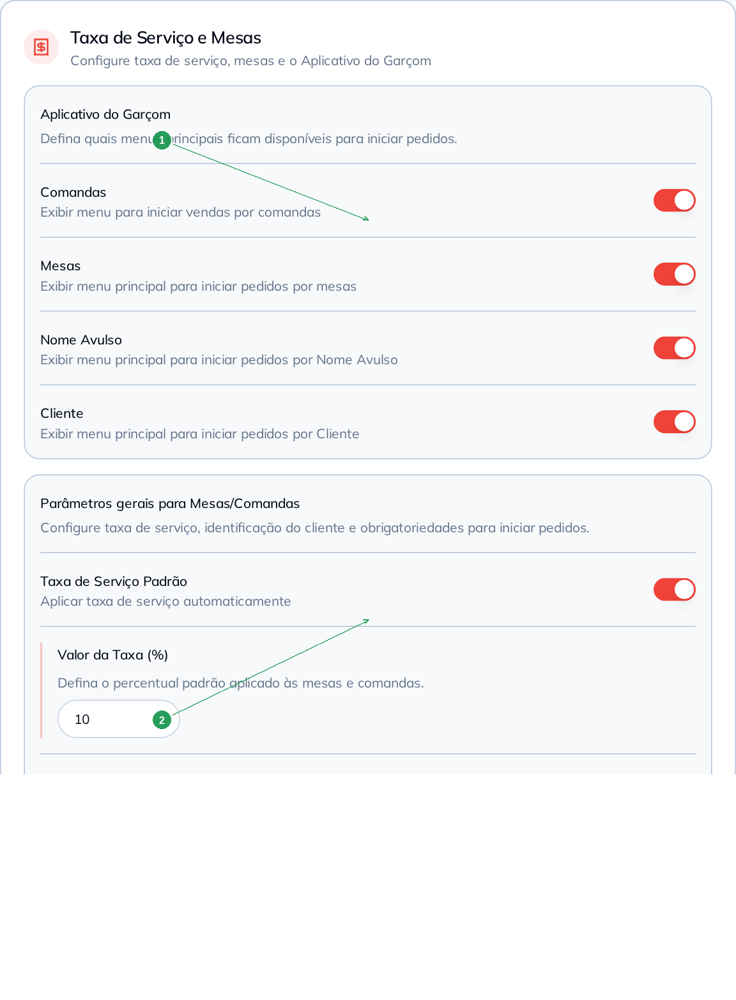
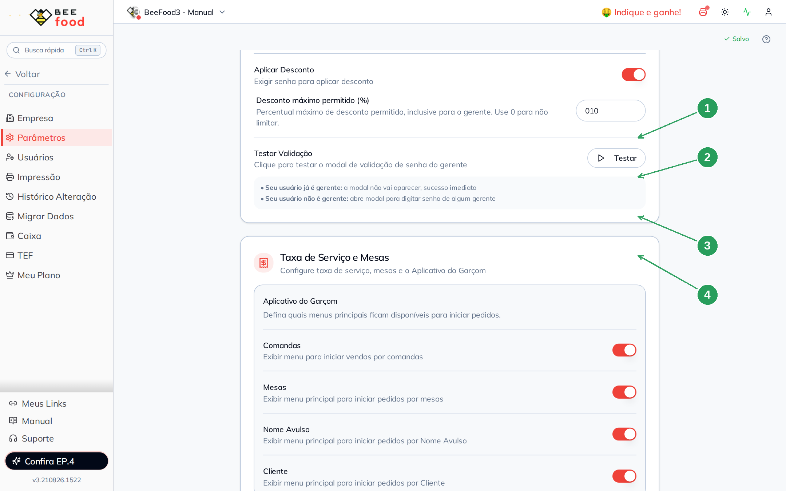

# Manual — App do Garçom (parâmetros)

Este manual mostra **quais menus o aplicativo do garçom pode exibir** ao iniciar um pedido:
comandas, mesas, nome avulso e cliente.

> Este parâmetro vale no aplicativo do garçom, que não faz parte deste manual.
> Aqui você configura a tela; o efeito aparece no celular do garçom.

> As imagens têm **setas numeradas** (1, 2, 3…). Cada número indica o campo ou botão
> correspondente na tela.

---

## Onde fica

**Configuração → Parâmetros**, no card **Taxa de Serviço e Mesas**, bloco
**Aplicativo do Garçom**.

A alteração **grava sozinha**. Não procure o botão Salvar.

| Nº | Item | O que é |
|----|------|---------|
| 1 | **Aplicativo do Garçom** | Os quatro menus do app. |
| 2 | **Parâmetros gerais** | Taxa e obrigatoriedades — é o outro manual. |

---

## Os quatro menus

Cada switch mostra ou esconde um jeito de **começar o pedido** no app:

| Menu | O que o garçom vê |
|------|-------------------|
| **Comandas** | Iniciar venda por comanda |
| **Mesas** | Iniciar pedido pela mesa |
| **Nome Avulso** | Iniciar pelo nome digitado (sem cadastro) |
| **Cliente** | Iniciar por um cliente já cadastrado |

Neste exemplo os **quatro** estão ligados — o garçom vê todos os caminhos:

| Nº | Item | O que fazer |
|----|------|-------------|
| 1 | **Comandas** | Liga o menu de comandas no app. |
| 2 | **Mesas** | Liga o menu de mesas. |
| 3 | **Nome Avulso** | Liga o pedido por nome. |
| 4 | **Cliente** | Liga o pedido por cliente cadastrado. |

Desligue o que a sua operação não usa. Uma pizzaria que só trabalha com mesa pode deixar
só **Mesas** ligado, por exemplo.

---

## O que este card não é

Logo abaixo estão a **taxa de serviço** e as **obrigatoriedades** (cliente, mesa, comanda).
Elas valem no **painel web** e no app. A configuração e a prova no salão estão no manual
**Taxa e obrigatoriedades de mesa**.

O card **Caixa** desta mesma tela (Caixa por Usuário) já é o manual **Restrições de caixa**.

---

## Resumo do caminho

1. **Configuração → Parâmetros** → card Taxa de Serviço e Mesas.
2. No bloco **Aplicativo do Garçom**, ligue só os menus que o garçom deve ver.
3. A tela grava sozinha. O efeito aparece no aplicativo do garçom.

---

## Perguntas frequentes

**Liguei Mesas e o mapa do painel web não mudou.** Este bloco só mexe no **app do garçom**.
O mapa de Mesas do computador é outra tela.

**O app não mostra o menu que eu liguei.** Peça para o garçom fechar e abrir o aplicativo —
ele guarda uma cópia da configuração.

---

## Manuais relacionados

- **Taxa e obrigatoriedades de mesa** — o outro bloco desta mesma tela
- **Senha do gerente** — o card de cima, na mesma página
