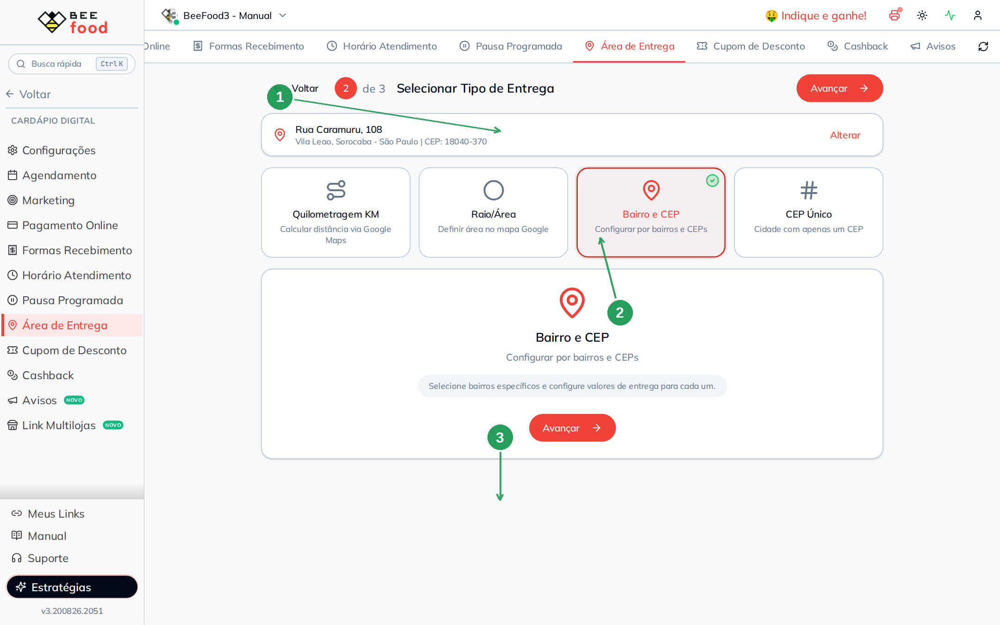
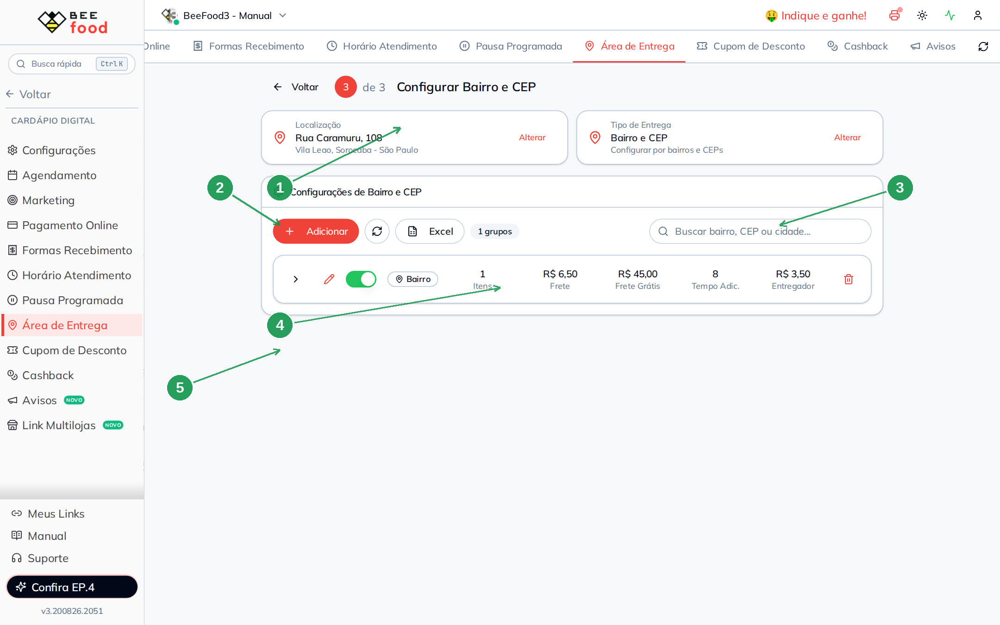
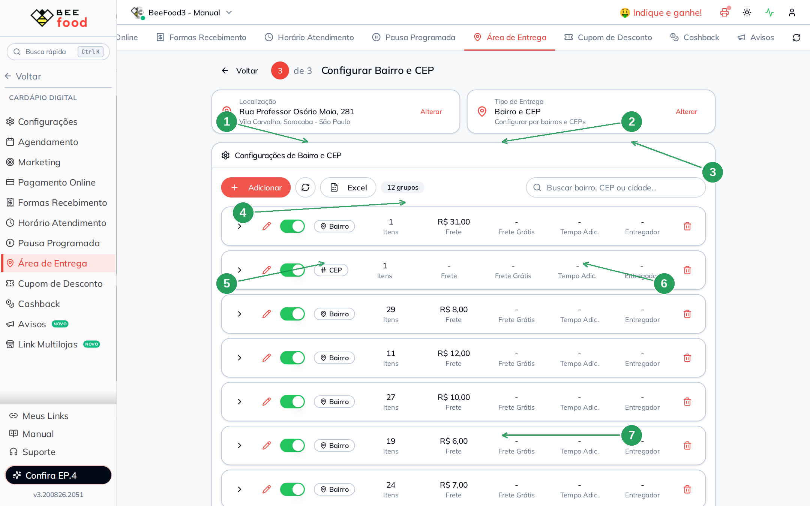
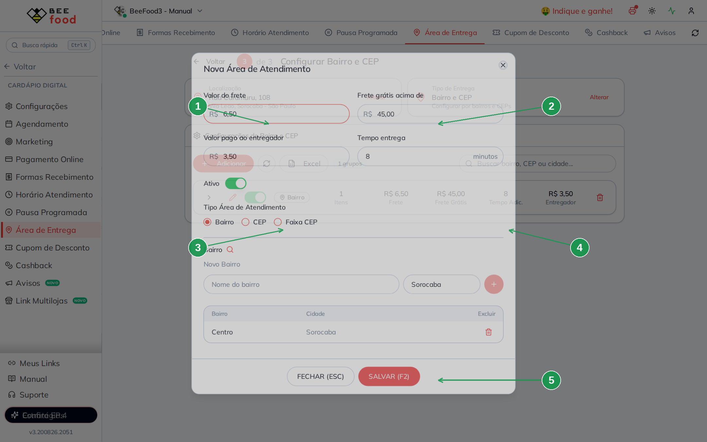
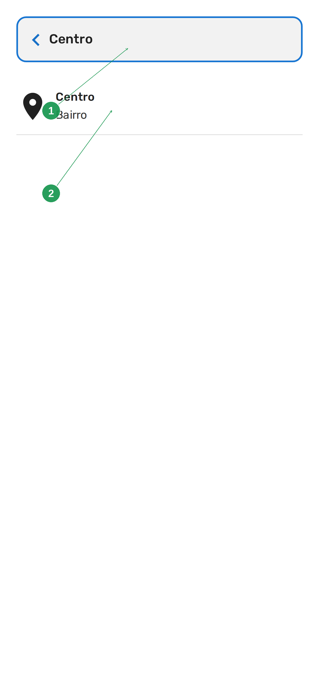
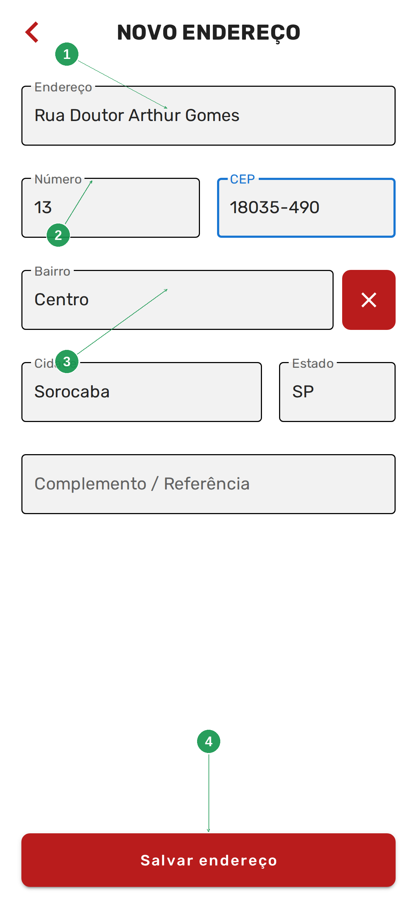
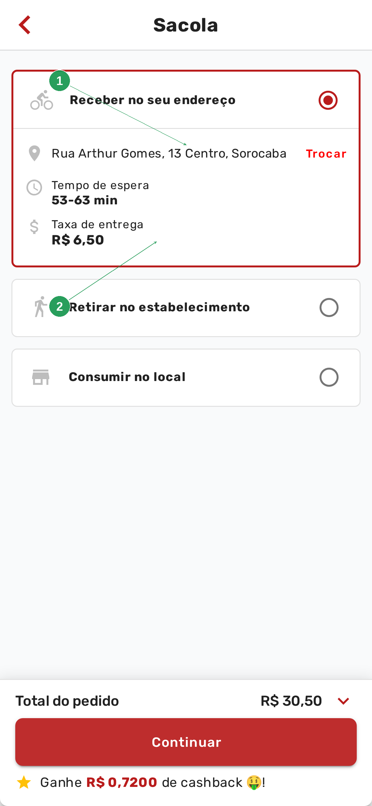

# Manual da Configuração por Bairro

Este manual ensina a cobrar o frete **pelo bairro (ou pelo CEP) do cliente**: um grupo
“Centro — R$ 6,50”, outro com vários bairros no mesmo valor, ou uma faixa de CEPs.

> A loja precisa ter endereço marcado. Se ainda não marcou, veja o manual
> **Configurar endereço do restaurante**.

> As imagens têm **setas numeradas** (1, 2, 3…). Cada número indica o campo ou botão
> correspondente na tela.

---

## Quando usar bairro

Use **Bairro e CEP** quando a regra for uma **lista de nomes**, não distância nem desenho:

- Centro — R$ 6,50;
- um conjunto de bairros vizinhos no mesmo valor;
- um CEP isolado, ou uma faixa (18035-000 a 18039-999).

O cardápio compara o **bairro** (ou o **CEP**) que o cliente digitou com os grupos ativos.
Quem não estiver em nenhum grupo vê *Endereço fora da área de atendimento*.

O mesmo passo 3 também cadastra **CEP** e **Faixa CEP**. Este manual mostra o caminho do
**bairro**, que é o mais usado. Os outros dois tipos moram no mesmo modal, nos rádios do
meio.

---

## Parte 1 — Escolher Bairro e CEP

Em **Cardápio Digital → Área de Entrega**, clique em **Alterar** no cartão **Tipo de Entrega**.
No passo 2, marque **Bairro e CEP** e avance.



| Nº | Item | O que fazer |
|----|------|-------------|
| 1 | **Endereço da loja** | Confira. O bairro da loja não entra na lista sozinho — você cadastra os bairros que atende. |
| 2 | **Bairro e CEP** | O card com o visto verde. Texto: *"Configurar por bairros e CEPs"*. |
| 3 | **Avançar** | Abre a lista de grupos. |

O texto de ajuda diz: *"Selecione bairros específicos e configure valores de entrega para
cada um."*

---

## Parte 2 — A lista de grupos

Cada linha é um **grupo**: um valor de frete e um ou mais bairros (ou CEPs) dentro.



| Nº | Item | Para que serve |
|----|------|----------------|
| 1 | **Localização** e **Tipo** | Os cartões do assistente. |
| 2 | **+ Adicionar** | Novo grupo. |
| 3 | **Buscar bairro, CEP ou cidade** | Filtra a lista. Útil quando já existem muitos grupos. |
| 4 | **A linha do grupo** | Tipo (Bairro / # CEP / Faixa), quantidade de itens, frete, frete grátis, tempo extra, valor do entregador. |
| 5 | **Seta, lápis, switch e lixeira** | Abrir os itens, editar, desligar ou excluir o grupo. |

O exemplo didático é um grupo **Bairro** com **Centro** (Sorocaba), frete **R$ 6,50**, frete
grátis a partir de **R$ 45,00**, **+8 min** e entregador **R$ 3,50**.

---

## Parte 3 — Criar um grupo de bairro

Clique em **+ Adicionar**. Abre o modal **Nova Área de Atendimento**:



| Nº | Campo | O que fazer |
|----|-------|-------------|
| 1 | **Valor do frete** | O que o cliente paga neste grupo. |
| 2 | **Frete grátis acima de**, **Valor pago ao entregador**, **Tempo entrega** | Opcionais — iguais aos do KM. **0** no frete grátis = não usa a regra. |
| 3 | **Ativo** | Ligado, o grupo vale. |
| 4 | **Tipo Área de Atendimento** | **Bairro**, **CEP** ou **Faixa CEP**. O resto do modal muda com o rádio. |
| 5 | **Nome do bairro** e **Cidade** | Digite o bairro e confira a cidade (já vem a da loja). |
| 6 | **Botão +** | Inclui o bairro na tabela. Sem isso, **SALVAR** grava um grupo vazio. |
| 7 | **SALVAR (F2)** | Grava o grupo. |

O nome do bairro precisa ser o mesmo que o cliente vai ter no endereço — o do correio, não
um apelido. “Centro” e “Centro Histórico” são coisas diferentes para o sistema.

Digite o bairro, clique no **+** (a linha entra na tabela) e depois em **SALVAR (F2)**. Sem o
**+**, o grupo grava vazio.

Dá para colocar **vários bairros no mesmo grupo** (mesmo frete) clicando **+** de novo.
Para um frete diferente, crie outro grupo.

No exemplo, o grupo pronto fica assim:



---

## Parte 4 — CEP e faixa de CEP (no mesmo modal)

Os outros dois rádios do modal:

| Tipo | O que pedir | Serve para |
|------|-------------|------------|
| **CEP** | Um CEP de 8 dígitos | Um prédio, um condomínio ou uma rua com CEP próprio |
| **Faixa CEP** | CEP início e CEP fim | Um pedaço da cidade sem listar bairro por bairro |

O valor do frete é o mesmo campo do topo. Não misture bairro e CEP no mesmo grupo — o tipo
trava depois que o primeiro item entra.

---

## Parte 5 — O que o cliente vê no cardápio

O cliente informa o **próprio** endereço. A mudança leva **1 a 2 minutos**. Neste tipo a
busca do cardápio é pelo **bairro**, não pelo CEP. O teste deste bloco é o bairro
**Centro** — e, depois, a rua **Arthur Gomes, 13**.

Na sacola, em **Receber no seu endereço**, o cliente toca em *Clique aqui e informe o
endereço* (ou em **Trocar** → **Novo endereço**). No campo *Digite seu Bairro*, ele
digita o nome:



| Nº | Item | O que o cliente faz |
|----|------|---------------------|
| 1 | **Digite seu Bairro** | Digita o nome. No teste, **Centro**. |
| 2 | **Sugestão** | A linha *Centro — Bairro*. Só entram na lista os bairros que você cadastrou. |

Ao escolher a sugestão, o cardápio abre o **NOVO ENDEREÇO** com o bairro e a cidade
preenchidos. O cliente completa a rua e o número:



| Nº | Item | O que aparece |
|----|------|---------------|
| 1 | **Endereço** | *Rua Doutor Arthur Gomes*. |
| 2 | **Número** e **CEP** | **13** e **18035-490**. |
| 3 | **Bairro** | *Centro* — veio da busca. |
| 4 | **Salvar endereço** | Grava na sacola. |

A sacola mostra o endereço escolhido e a taxa do grupo:



| Nº | Item | O que o cliente vê |
|----|------|--------------------|
| 1 | **Receber no seu endereço** | O endereço confirmado e o link **Trocar**. |
| 2 | **Taxa de entrega** | O valor do grupo — no exemplo, **R$ 6,50** para o Centro. |

---

## Resumo do caminho

```
1. Cardápio Digital → Área de Entrega
2. Confira o endereço da loja (manual do endereço)
3. Tipo de Entrega → Bairro e CEP → Avançar
4. + Adicionar → valor do frete → tipo Bairro
5. Digite o bairro e a cidade → + → SALVAR (F2)
6. Espere 1 a 2 minutos e teste no cardápio: busque o bairro Centro e complete a rua
```

---

## Perguntas frequentes

**Cadastrei o bairro e o cliente ainda fica de fora.**
Três checagens: o **tipo ativo** é Bairro e CEP? o nome está **igual** ao do correio? já
passaram 1 a 2 minutos e o cliente **Trocou** o endereço?

**Posso ter o mesmo bairro em dois grupos?**
Evite. Se acontecer, o sistema usa um dos valores e a taxa fica imprevisível. Um bairro, um
grupo.

**A lista já veio com vários grupos.**
São cadastros antigos. Use a busca, desligue o switch dos que não valem ou exclua. O grupo
novo não apaga os outros.

**Quero cobrar por distância, não por nome.**
Troque o tipo para **Quilometragem KM**. Os grupos de bairro ficam salvos.

---

## Manuais relacionados

| Manual | O que traz |
|--------|------------|
| **Configurar endereço do restaurante** | O pin da loja — pré-requisito |
| **Configuração por mapa** | Desenho no mapa em vez de lista |
| **Configuração por KM** | Faixas de distância |
| **Configuração por CEP Fixo** | Um único CEP para a cidade inteira |
