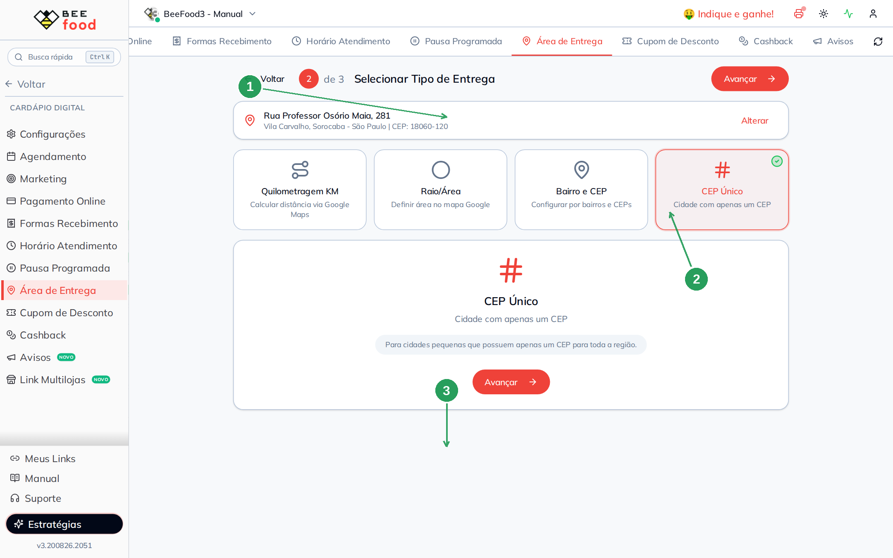
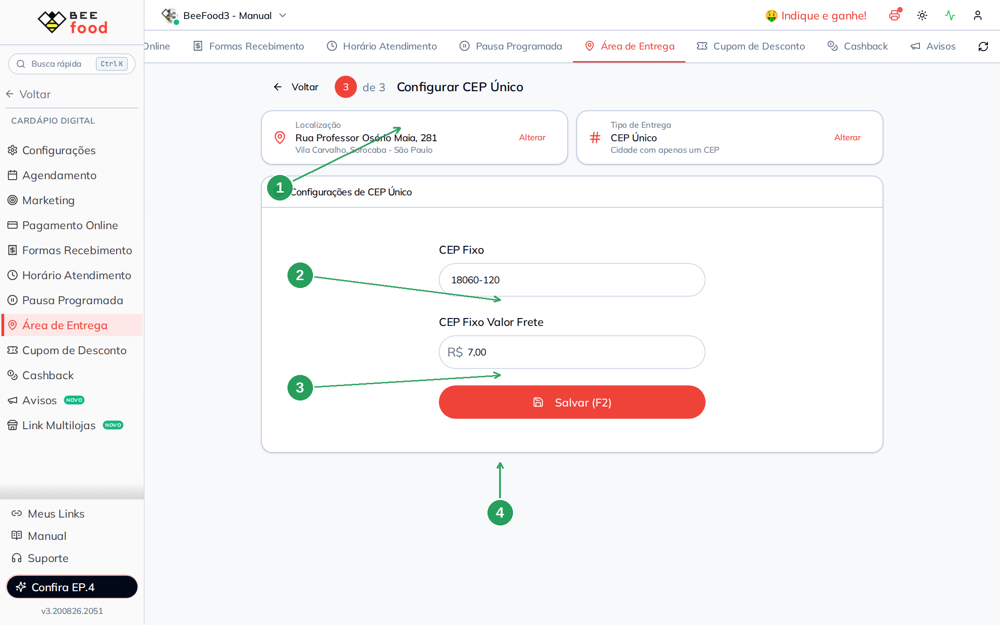
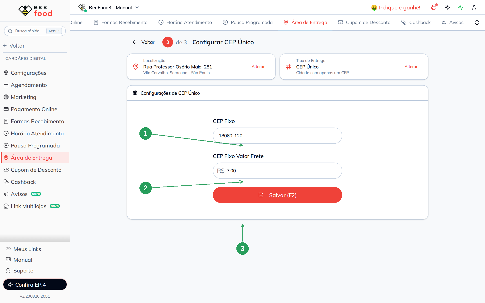
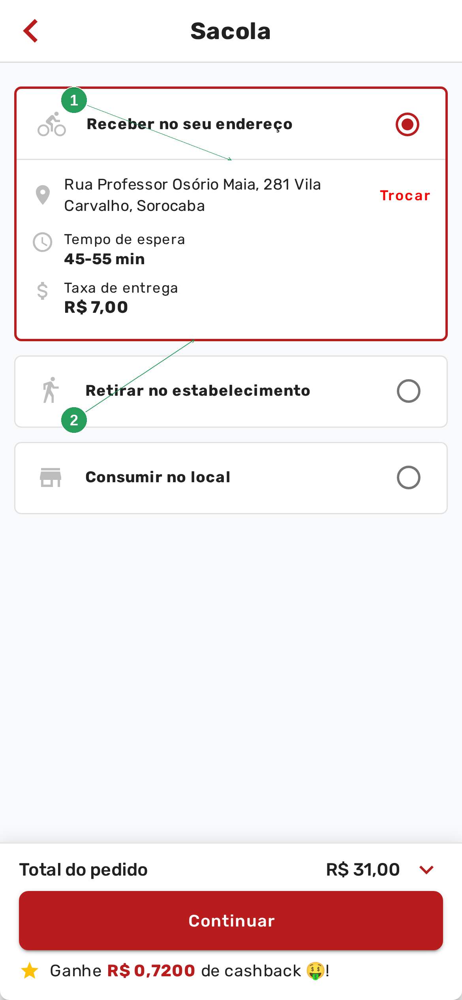
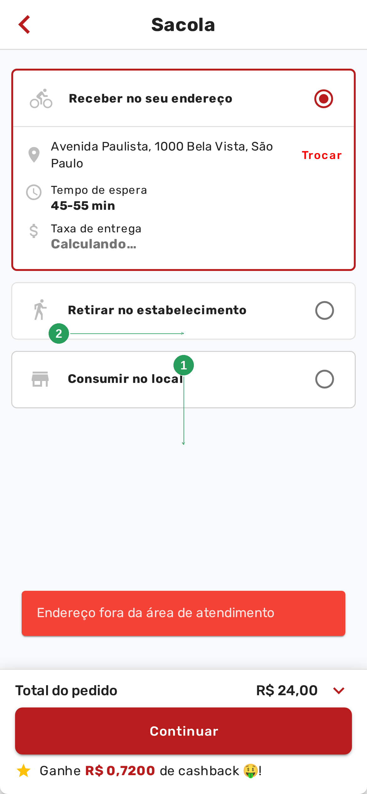

# Manual da Configuração por CEP Fixo

Este manual ensina o tipo **CEP Único**: a cidade tem **um CEP só**, e todo mundo que pede
nesse CEP paga o mesmo frete.

> A loja precisa ter endereço marcado. Se ainda não marcou, veja o manual
> **Configurar endereço do restaurante**.

> As imagens têm **setas numeradas** (1, 2, 3…). Cada número indica o campo ou botão
> correspondente na tela.

---

## Quando usar CEP Único

Use **só** quando a cidade (ou o distrito) realmente compartilha um CEP. Cidade grande, com
CEP por rua, **não** é este caminho — use **Bairro e CEP** ou **KM**.

O sistema compara o CEP do cliente com o CEP Fixo. Se for **igual**, cobra o valor
cadastrado. Se for **diferente**, o endereço fica fora da área.

Não é “frete único para qualquer CEP”. É “este CEP, este valor”.

---

## Parte 1 — Escolher CEP Único

Em **Cardápio Digital → Área de Entrega**, clique em **Alterar** no cartão **Tipo de Entrega**.
No passo 2, marque **CEP Único** e avance.



| Nº | Item | O que fazer |
|----|------|-------------|
| 1 | **Endereço da loja** | Confira. O CEP da loja costuma ser o mesmo que você vai colar no campo. |
| 2 | **CEP Único** | O card com o visto verde. Texto: *"Cidade com apenas um CEP"*. |
| 3 | **Avançar** | Abre os dois campos do passo 3. |

O texto de ajuda diz: *"Para cidades pequenas que possuem apenas um CEP para toda a região."*

---

## Parte 2 — Os dois campos

O passo 3 não tem lista. São **dois campos** e o botão **Salvar (F2)**.



| Nº | Campo | O que fazer |
|----|-------|-------------|
| 1 | **Localização** e **Tipo** | Os cartões do assistente. **Alterar** no tipo volta aos quatro cards. |
| 2 | **CEP Fixo** | Os 8 dígitos, com máscara `00000-000`. |
| 3 | **CEP Fixo Valor Frete** | O valor único. No exemplo, **R$ 7,00**. |
| 4 | **Salvar (F2)** | Grava. Sem salvar, o cardápio continua com o valor antigo. |

Diferente do horário de atendimento, **esta tela não grava sozinha**. Sem o Salvar, a
mudança não vale.

No exemplo, o CEP da loja (**18060-120**) e o frete **R$ 7,00**:



| Nº | Campo | Valor do exemplo |
|----|-------|------------------|
| 1 | **CEP Fixo** | 18060-120 |
| 2 | **CEP Fixo Valor Frete** | R$ 7,00 |
| 3 | **Salvar (F2)** | Confirma. |

---

## Parte 3 — O que o cliente vê no cardápio

O cliente informa o **próprio** endereço. A mudança leva **1 a 2 minutos**. Se o CEP for o
mesmo do cadastro, a taxa aparece:



| Nº | Item | O que o cliente vê |
|----|------|--------------------|
| 1 | **Receber no seu endereço** | O endereço confirmado. |
| 2 | **Taxa de entrega** | O valor fixo — no exemplo, **R$ 7,00**. |

Qualquer **outro CEP** (no exemplo, Avenida Paulista) fica de fora:



| Nº | Item | O que significa |
|----|------|-----------------|
| 1 | **Endereço fora da área de atendimento** | O CEP do cliente não é o CEP Fixo. |
| 2 | **Retirar** e **Consumir no local** | Continuam disponíveis. |

---

## Resumo do caminho

```
1. Cardápio Digital → Área de Entrega
2. Confira o endereço da loja (manual do endereço)
3. Tipo de Entrega → CEP Único → Avançar
4. CEP Fixo + Valor Frete → Salvar (F2)
5. Espere 1 a 2 minutos e teste no cardápio com o CEP cadastrado e com outro
```

---

## Perguntas frequentes

**Salvei e o cardápio ainda mostra outro valor.**
Confira se o tipo ativo é **CEP Único** (não Bairro e CEP). Espere 1 a 2 minutos e peça para
**Trocar** o endereço.

**Minha cidade tem vários CEPs.**
Este tipo não serve. Use **Bairro e CEP** (um grupo por CEP ou por faixa) ou **KM**.

**O CEP da loja e o CEP Fixo precisam ser iguais?**
Não é obrigatório, mas na prática são o mesmo: a cidade inteira compartilha aquele CEP. Se
você cadastrar outro, só quem digitar *esse* outro CEP vê o frete.

**Tem frete grátis ou tempo extra neste tipo?**
Não. Só CEP e valor. Para regras extras, use KM, mapa ou bairro.

---

## Manuais relacionados

| Manual | O que traz |
|--------|------------|
| **Configurar endereço do restaurante** | O pin da loja — pré-requisito |
| **Configuração por bairro** | Vários bairros ou CEPs, cada um com um valor |
| **Configuração por KM** | Faixas de distância |
| **Configuração por mapa** | Círculos e polígonos |
