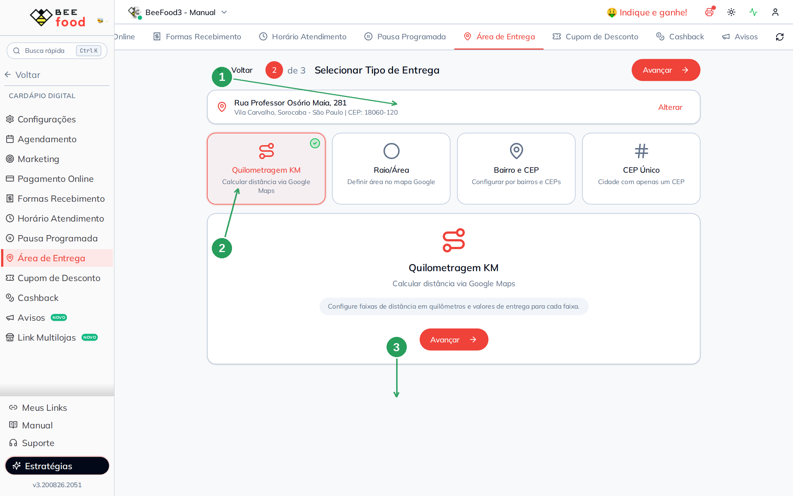
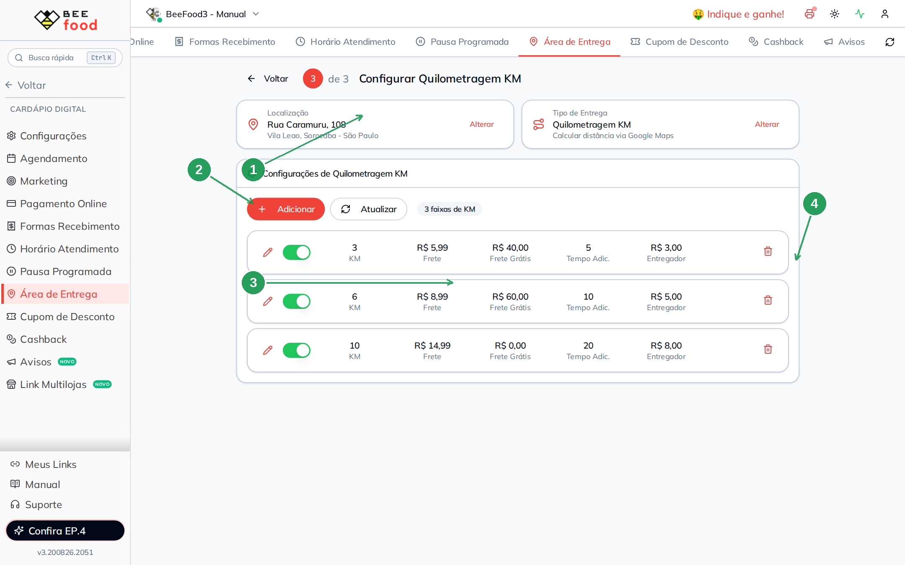
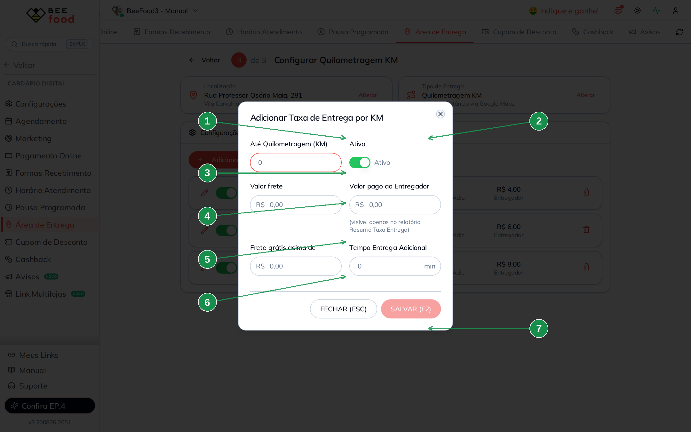
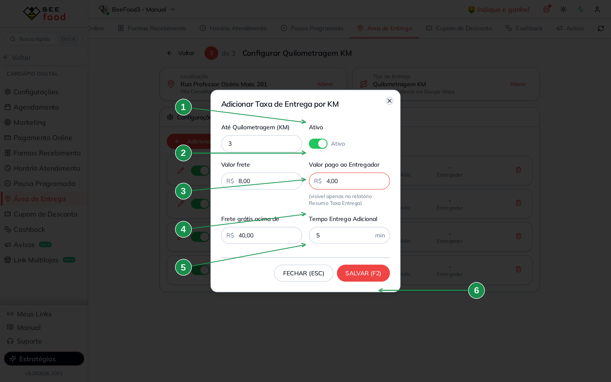
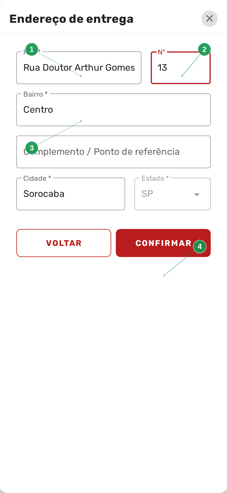
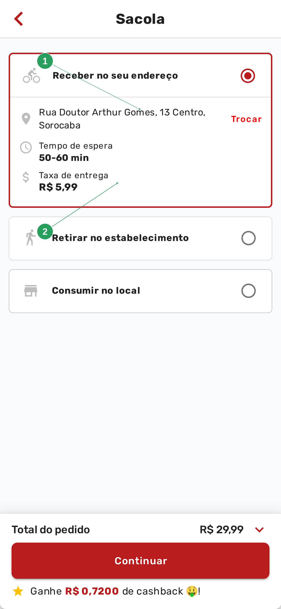

# Manual da Configuração por KM

Este manual ensina a cobrar o frete **pela distância** entre a loja e o cliente: até 3 km um
valor, até 6 km outro, até 10 km outro. O Google Maps calcula o caminho; você só monta as
faixas.

> A loja precisa ter endereço marcado — é de lá que a distância começa. Se ainda não marcou,
> veja o manual **Configurar endereço do restaurante**.

> As imagens têm **setas numeradas** (1, 2, 3…). Cada número indica o campo ou botão
> correspondente na tela.

---

## Quando usar KM

Use **Quilometragem KM** quando a regra for “quanto mais longe, mais caro”, sem se preocupar
com o nome do bairro:

- até 3 km — R$ 5,99 (frete grátis a partir de R$ 40,00);
- até 6 km — R$ 8,99 (frete grátis a partir de R$ 60,00);
- até 10 km — R$ 14,99.

Quem estiver **além da maior faixa** vê *Endereço fora da área de atendimento*. Não existe
faixa “o resto”.

Se você prefere desenhar o contorno no mapa, o caminho é o manual **Configuração por mapa**.
Se a regra é por nome de bairro, use o **bairro**.

---

## Parte 1 — Escolher Quilometragem KM

Em **Cardápio Digital → Área de Entrega**, clique em **Alterar** no cartão **Tipo de Entrega**.
No passo 2, marque **Quilometragem KM** e avance.



| Nº | Item | O que fazer |
|----|------|-------------|
| 1 | **Endereço da loja** | A origem do cálculo. Se o pin estiver errado, a distância sai errada. |
| 2 | **Quilometragem KM** | O card com o visto verde. Texto: *"Calcular distância via Google Maps"*. |
| 3 | **Avançar** | Abre a lista de faixas. |

O texto de ajuda diz: *"Configure faixas de distância em quilômetros e valores de entrega
para cada faixa."*

---

## Parte 2 — As faixas

O passo 3 é a lista. Cada linha é um teto: **até X km**, com frete, frete grátis, tempo a
mais e valor do entregador.



| Nº | Item | Para que serve |
|----|------|----------------|
| 1 | **Localização** e **Tipo** | Os cartões do assistente. **Alterar** no tipo volta aos quatro cards. |
| 2 | **+ Adicionar** | Nova faixa. |
| 3 | **As três faixas** | No exemplo: 3 km / R$ 5,99 (frete grátis acima de R$ 40,00), 6 km / R$ 8,99 (acima de R$ 60,00) e 10 km / R$ 14,99. |
| 4 | **Lápis, switch e lixeira** | Editar, desligar sem apagar, ou excluir. |

A distância do cliente cai na **menor faixa que ainda cabe**. Quem está a 2 km paga a de 3 km
(R$ 5,99). Quem está a 5 km paga a de 6 km (R$ 8,99). Quem está a 11 km fica de fora.

**Frete grátis 0** na faixa de 10 km quer dizer: esta faixa **não** zera o frete, seja qual
for o valor do pedido. O cliente sempre paga os R$ 14,99.

---

## Parte 3 — Criar uma faixa

Clique em **+ Adicionar**. O modal **Adicionar Taxa de Entrega por KM** abre vazio:



| Nº | Campo | O que fazer |
|----|-------|-------------|
| 1 | **Até Quilometragem (KM)** | O teto desta faixa. Exemplo: 3. |
| 2 | **Ativo** | Ligado, a faixa vale. Desligado, ela some do cálculo sem ser apagada. |
| 3 | **Valor frete** | O que o cliente paga nesta faixa. |
| 4 | **Valor pago ao Entregador** | Só no relatório *Resumo Taxa Entrega* — o cliente não vê. |
| 5 | **Frete grátis acima de** | Pedido a partir deste valor zera o frete. Deixe 0 se não usar. |
| 6 | **Tempo Entrega Adicional** | Minutos a mais no prazo desta faixa (5, 10, 20…). |
| 7 | **SALVAR (F2)** | Grava. **FECHAR (ESC)** descarta. |

Preenchido, o mesmo modal fica assim — é a faixa de 3 km do exemplo:



| Nº | Campo | Valor do exemplo |
|----|-------|------------------|
| 1 | **Até Quilometragem** | 3 |
| 2 | **Valor frete** | R$ 5,99 |
| 3 | **Valor pago ao Entregador** | R$ 3,00 |
| 4 | **Frete grátis acima de** | R$ 40,00 |
| 5 | **Tempo Entrega Adicional** | 5 min |
| 6 | **SALVAR (F2)** | Grava a faixa. |

Repita para 6 km e 10 km. A lista do passo 3 mostra as três juntas.

---

## Parte 4 — O que o cliente vê no cardápio

No cardápio o cliente informa o **próprio** endereço — não o da loja. A mudança leva
**1 a 2 minutos**. O teste deste bloco é o CEP **18035-490**, número **13**
(**R. Arthur Gomes, Centro**), a cerca de 1 km da loja.

Na sacola, em **Receber no seu endereço**, o cliente toca em *Clique aqui e informe o
endereço* (ou em **Trocar**). Abre a busca:


| Nº | Item | O que o cliente faz |
|----|------|---------------------|
| 1 | **Campo do CEP** | Digita o CEP. No teste, **18035-490**. |
| 2 | **BUSCAR CEP** | Confere se a loja entrega nessa região. |

O sistema devolve a rua. O cliente confere, preenche o **número** e toca em **CONFIRMAR**:



| Nº | Item | O que aparece |
|----|------|---------------|
| 1 | **Rua** | *Rua Doutor Arthur Gomes* — veio da busca do CEP. |
| 2 | **Nº** | O cliente digita **13**. |
| 3 | **Bairro** e **cidade** | *Centro*, *Sorocaba*. |
| 4 | **CONFIRMAR** | Grava o endereço na sacola. |

A sacola mostra o endereço escolhido e a taxa da faixa (aqui, a de 3 km):



| Nº | Item | O que o cliente vê |
|----|------|--------------------|
| 1 | **Receber no seu endereço** | O endereço confirmado e o link **Trocar**. |
| 2 | **Taxa de entrega** | O valor da faixa — no exemplo, **R$ 5,99**. |

---

## Resumo do caminho

```
1. Cardápio Digital → Área de Entrega
2. Confira o endereço da loja (manual do endereço)
3. Tipo de Entrega → Quilometragem KM → Avançar
4. + Adicionar → teto em km, frete, frete grátis, tempo, entregador → SALVAR (F2)
5. Repita para cada faixa
6. Espere 1 a 2 minutos e teste no cardápio: BUSCAR CEP 18035-490, número 13
```

---

## Perguntas frequentes

**Mudei a faixa e o cardápio ainda mostra o valor do mapa.**
O tipo ativo precisa ser **Quilometragem KM** (passo 2) e o cardápio leva 1 a 2 minutos.
Depois, **Trocar** o endereço e confirmar de novo.

**E se o cliente estiver exatamente em 3 km?**
Ele cai na faixa “até 3 km”. A próxima (6 km) só vale depois desse teto.

**Preciso cadastrar as faixas em ordem?**
Não. O sistema usa o teto, não a ordem da lista. Ainda assim, cadastrar 3, 6 e 10 deixa a
tela mais fácil de ler.

**O valor do entregador aparece para o cliente?**
Não. Só no relatório *Resumo Taxa Entrega*.

**Quero um desenho no mapa, não km.**
Troque o tipo para **Raio/Área**. As faixas de KM ficam salvas.

---

## Manuais relacionados

| Manual | O que traz |
|--------|------------|
| **Configurar endereço do restaurante** | O pin da loja — origem da distância |
| **Configuração por mapa** | Círculos e polígonos em vez de faixas |
| **Configuração por bairro** | Frete pelo nome do bairro ou CEP |
| **Configuração por CEP Fixo** | Um CEP e um valor |
