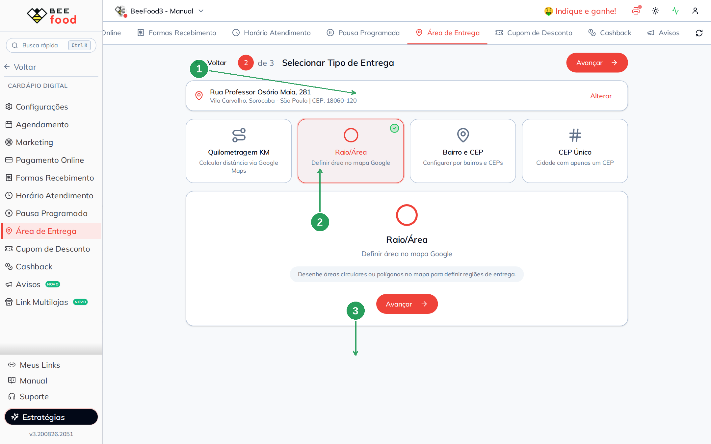
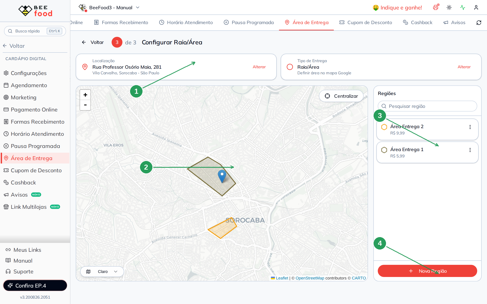
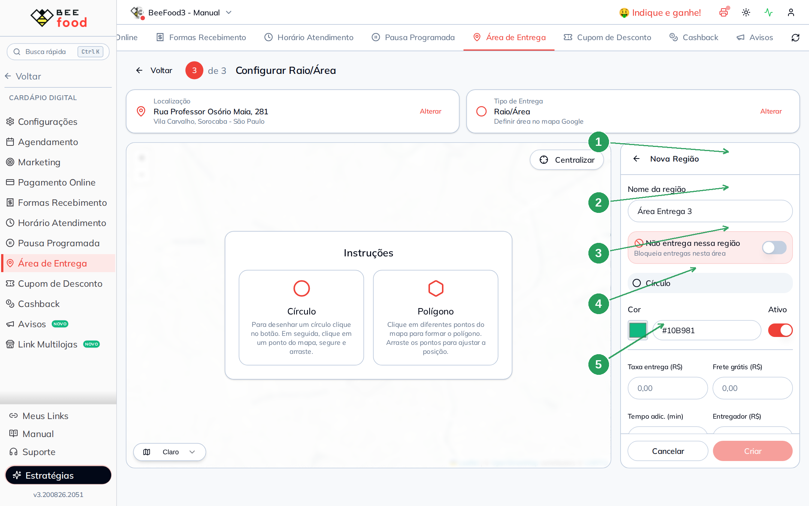
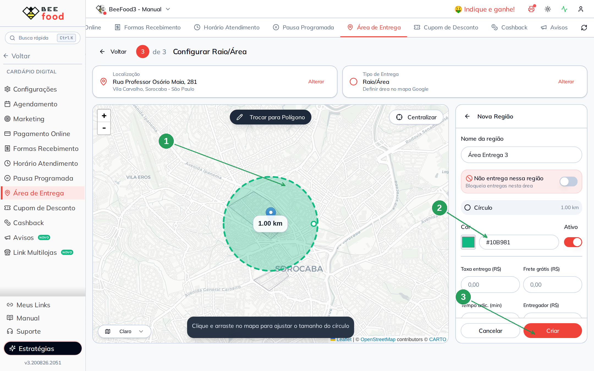
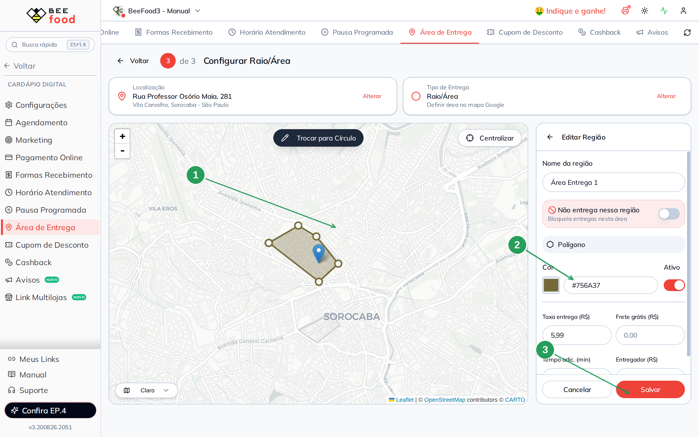
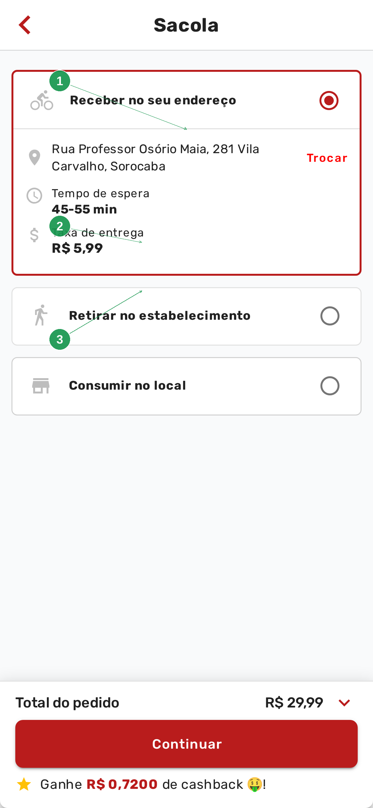

# Manual da Configuração por Mapa (Área)

Este manual ensina a **desenhar no mapa as regiões que você atende** e cobrar um frete para
cada uma: um círculo de 1 km em volta da loja, um polígono no bairro vizinho, ou uma área
onde você **não entrega**.

> Antes de desenhar, a loja precisa ter endereço marcado. Se ainda não marcou, veja o manual
> **Configurar endereço do restaurante** — é o passo 1 deste mesmo assistente.

> As imagens têm **setas numeradas** (1, 2, 3…). Cada número indica o campo ou botão
> correspondente na tela.

---

## Quando usar o mapa

Use **Raio/Área** quando o frete depende do **lugar no mapa**, não de uma lista de nomes:

- o centro da cidade tem um valor, o bairro ao lado tem outro;
- você quer um círculo simples em volta da loja;
- existe um pedaço no meio da cidade em que **não entrega** (rio, área de risco, condomínio
  fechado).

Se a regra for “até 3 km, até 6 km”, o caminho é o manual **Configuração por KM**. Se for
“Vila Carvalho R$ 7,00”, o caminho é o **bairro**.

---

## Parte 1 — Escolher Raio/Área

Em **Cardápio Digital → Área de Entrega**, clique em **Alterar** no cartão **Tipo de Entrega**.
No passo 2, marque **Raio/Área** e avance.



| Nº | Item | O que fazer |
|----|------|-------------|
| 1 | **Endereço da loja** | Confira. Sem o pin certo, as áreas ficam deslocadas. |
| 2 | **Raio/Área** | O card com o visto verde. Texto: *"Definir área no mapa Google"*. |
| 3 | **Avançar** | Abre o mapa do passo 3. |

O texto de ajuda diz: *"Desenhe áreas circulares ou polígonos no mapa para definir regiões de
entrega."*

---

## Parte 2 — As regiões no mapa

O passo 3 abre com o mapa à esquerda e a lista **Regiões** à direita. O pin azul é a loja.



| Nº | Item | Para que serve |
|----|------|----------------|
| 1 | **Localização** e **Tipo** | Os dois cartões do assistente. **Alterar** volta ao endereço ou aos quatro tipos. |
| 2 | **Mapa** | As áreas coloridas. Use **Centralizar** se perder o pin. |
| 3 | **Lista de regiões** | Nome, cor e taxa de cada área. O menu de três pontos edita ou exclui. |
| 4 | **+ Nova Região** | Começa uma área nova. |

No exemplo, **Área Entrega 1** cobra **R$ 5,99** e **Área Entrega 2** cobra **R$ 9,99**. No
cardápio, o cliente de dentro da primeira área vê R$ 5,99; o da segunda, R$ 9,99.

---

## Parte 3 — Criar uma região

Clique em **+ Nova Região**. O painel da direita vira o formulário, e o mapa mostra as duas
formas de desenhar:



| Nº | Campo | O que fazer |
|----|-------|-------------|
| 1 | **Nome da região** | Um nome que você reconheça (Centro, Até 2 km, Não entrega — zona X). |
| 2 | **Não entrega nessa região** | Liga o bloqueio. Quem cair nesta forma vê *Endereço fora da área de atendimento*, mesmo que outra área cubra o mesmo ponto. |
| 3 | **Círculo** ou **Polígono** | Círculo: clique, segure e arraste. Polígono: clique ponto a ponto e arraste os vértices. |
| 4 | **Cor** e **Ativo** | A cor aparece no mapa. Desligar **Ativo** guarda a área sem usá-la. |
| 5 | **Taxa entrega**, **Frete grátis**, **Tempo adic.**, **Entregador** | O que o cliente paga, a partir de qual valor o frete zera, minutos a mais no prazo e o valor do entregador (só no relatório). |

---

## Parte 4 — Desenhar o círculo

Com **Círculo** marcado, clique no mapa, segure e arraste. O raio aparece em km (no exemplo,
**1,00 km**). Dá para ajustar depois: *"Clique e arraste no mapa para ajustar o tamanho do
círculo"*.



| Nº | Item | O que fazer |
|----|------|-------------|
| 1 | **Círculo no mapa** | O tamanho da área. **Trocar para Polígono** muda a forma sem perder o nome. |
| 2 | **Taxa entrega** | O valor desta região. |
| 3 | **Criar** | Grava. Sem desenho, o botão não cria. |

O polígono serve quando o bairro não é redondo — você recorta as ruas que realmente atende.

---

## Parte 5 — Editar uma região pronta

Clique na região na lista (ou no polígono no mapa). O painel vira **Editar Região**:



| Nº | Campo | O que fazer |
|----|-------|-------------|
| 1 | **Nome** e a forma no mapa | Os pontinhos brancos nos cantos arrastam o polígono. **Trocar para Círculo** refaz a forma. |
| 2 | **Taxa entrega** | No exemplo, **R$ 5,99** — é o valor que o cliente vê. |
| 3 | **Salvar** | Grava nome, taxa e desenho. |

---

## Parte 6 — O que o cliente vê no cardápio

No cardápio digital o cliente informa o **próprio** endereço (CEP e número). Não é o endereço
da loja.

A mudança leva **1 a 2 minutos** para chegar ao cardápio. Depois disso, um endereço **dentro**
da Área Entrega 1 aparece assim:



| Nº | Item | O que o cliente vê |
|----|------|--------------------|
| 1 | **Receber no seu endereço** | O endereço confirmado e o link **Trocar**. |
| 2 | **Tempo de espera** | O prazo da loja, mais o tempo adicional da região (se você preencheu). |
| 3 | **Taxa de entrega** | **R$ 5,99** — o valor da área que cobriu o ponto. |

Um endereço **fora** de todas as áreas ativas (no exemplo, Avenida Paulista) mostra o aviso
vermelho:


| Nº | Item | O que significa |
|----|------|-----------------|
| 1 | **Endereço fora da área de atendimento** | O ponto não caiu em nenhuma região ativa. A taxa fica em *Calculando…* e o pedido de entrega não segue. |
| 2 | **Retirar** e **Consumir no local** | Continuam disponíveis — o bloqueio é só da entrega. |

Se duas áreas se sobrepõem, vale a que o sistema encontrar para aquele ponto. Para um buraco
no meio (não entrega), desenhe uma região com **Não entrega nessa região** ligado.

---

## Resumo do caminho

```
1. Cardápio Digital → Área de Entrega
2. Confira o endereço da loja (manual do endereço)
3. Tipo de Entrega → Raio/Área → Avançar
4. + Nova Região → nome e taxa → Círculo ou Polígono → desenhe → Criar
5. Espere 1 a 2 minutos e teste no cardápio com um CEP de dentro e um de fora
```

---

## Perguntas frequentes

**Desenhei e o cliente ainda vê o frete antigo.**
Espere 1 a 2 minutos e peça para **Trocar** o endereço no cardápio e confirmar de novo.

**Posso ter várias áreas com valores diferentes?**
Sim. Cada região tem a própria taxa. No exemplo, R$ 5,99 e R$ 9,99.

**O que é “Não entrega nessa região”?**
Um recorte de bloqueio. Útil para um pedaço no meio da cidade que você não quer atender,
sem apagar a área maior ao redor.

**O pin da loja está no lugar errado.**
Não desenhe por cima. Volte em **Localização → Alterar** e acerte o endereço — é o manual
**Configurar endereço do restaurante**.

**Quero cobrar por quilômetro, não por desenho.**
Troque o tipo para **Quilometragem KM**. As áreas ficam salvas se um dia você voltar ao mapa.

---

## Manuais relacionados

| Manual | O que traz |
|--------|------------|
| **Configurar endereço do restaurante** | O pin da loja — pré-requisito deste manual |
| **Configuração por KM** | Faixas de distância em vez de desenho |
| **Configuração por bairro** | Lista de bairros e CEPs |
| **Configuração por CEP Fixo** | Um CEP e um valor |
