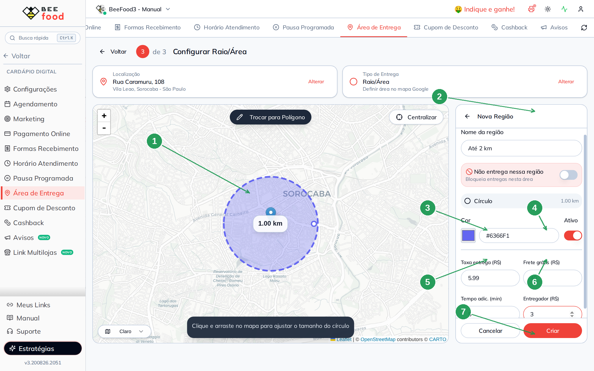
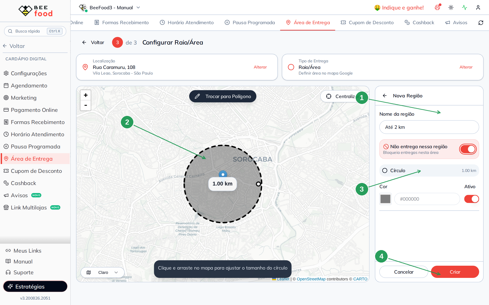
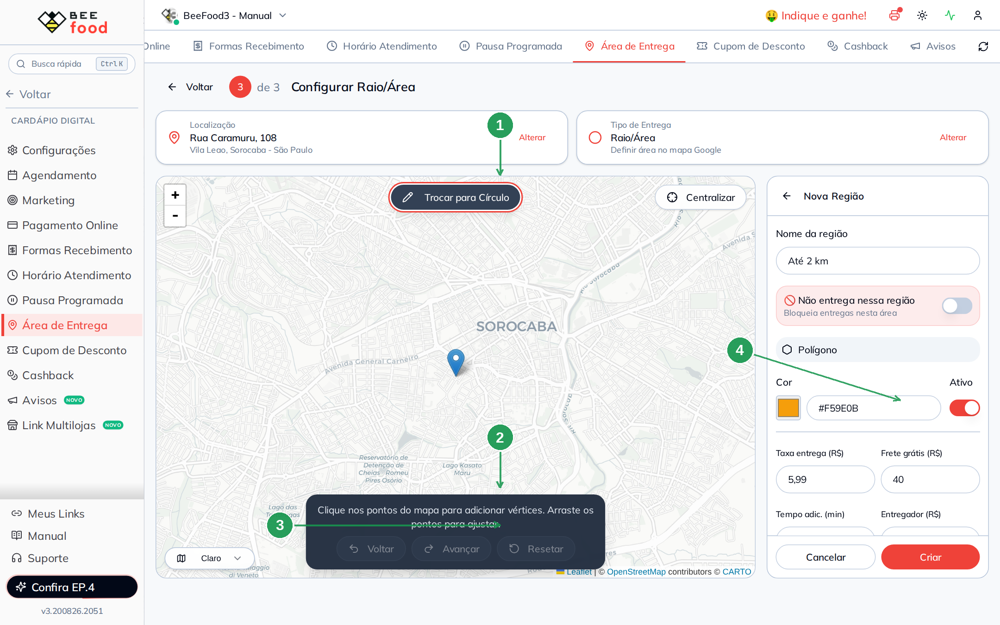
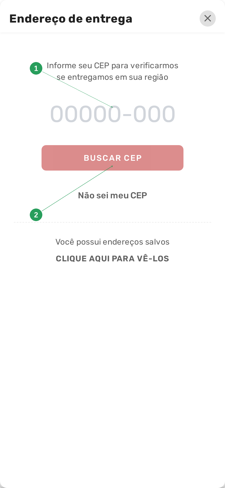

# Manual da Configuração por Mapa (Área)

Este manual ensina a **desenhar no mapa as regiões que você atende** e cobrar um frete para
cada uma: um círculo em volta da loja, um polígono no bairro vizinho, ou uma área onde você
**não entrega**.

> Antes de desenhar, a loja precisa ter endereço marcado. Se ainda não marcou, veja o manual
> **Configurar endereço do restaurante** — é o passo 1 deste mesmo assistente.

> As imagens têm **setas numeradas** (1, 2, 3…). Cada número indica o campo ou botão
> correspondente na tela.

---

## Quando usar o mapa

Use **Raio/Área** quando o frete depende do **lugar no mapa**, não de uma lista de nomes:

- um círculo simples em volta da loja (até 2 km, até 5 km);
- um polígono que recorta as ruas de um bairro (o Centro, o Campolim);
- um pedaço no meio da cidade em que **não entrega** (zona industrial, área de risco,
  condomínio fechado).

Se a regra for “até 3 km, até 6 km”, o caminho é o manual **Configuração por KM**. Se for
“Centro R$ 6,50”, o caminho é o **bairro**.

---

## Parte 1 — Escolher Raio/Área

Em **Cardápio Digital → Área de Entrega**, clique em **Alterar** no cartão **Tipo de Entrega**.
No passo 2, marque **Raio/Área** e avance.


| Nº | Item | O que fazer |
|----|------|-------------|
| 1 | **Endereço da loja** | Confira. Sem o pin certo, as áreas ficam deslocadas. |
| 2 | **Raio/Área** | O card com o visto verde. Texto: *"Definir área no mapa Google"*. |
| 3 | **Avançar** | Abre o mapa do passo 3. |

O texto de ajuda diz: *"Desenhe áreas circulares ou polígonos no mapa para definir regiões de
entrega."*

---

## Parte 2 — Criar uma região: círculo ou polígono

O passo 3 abre com o mapa à esquerda e a lista **Regiões** à direita. Se ainda não cadastrou
nada, a lista diz *Nenhuma região cadastrada*. Clique em **+ Nova Região**.

O mapa mostra as duas formas de desenhar; o painel da direita vira o formulário **Nova Região**:


| Nº | Item | O que fazer |
|----|------|-------------|
| 1 | **Círculo** | Clique no card. Depois, no mapa, clique, segure e arraste para o tamanho. |
| 2 | **Polígono** | Clique ponto a ponto no mapa. Arraste os vértices para acertar as ruas. |
| 3 | **Nome da região** | Um nome que você reconheça (Até 2 km, Centro, Zona industrial). |
| 4 | **Não entrega nessa região** | Liga o bloqueio. Detalhe na Parte 4. |
| 5 | **Cor** e **Ativo** | A cor aparece no mapa. Desligar **Ativo** guarda a área sem usá-la. |
| 6 | **Taxa, frete grátis, tempo, entregador** | Os quatro valores da região — veja a Parte 3. |

---

## Parte 3 — O círculo e os valores de frete

Com **Círculo** marcado, o mapa já desenha um círculo de **1,00 km** em volta da loja. O
texto embaixo diz: *"Clique e arraste no mapa para ajustar o tamanho do círculo"*. O botão
**Trocar para Polígono** muda a forma sem perder o nome.



| Nº | Campo | O que fazer |
|----|-------|-------------|
| 1 | **Círculo no mapa** | Arraste a borda até o tamanho certo. O raio aparece em km. |
| 2 | **Nome da região** | No exemplo, **Até 2 km**. |
| 3 | **Taxa entrega (R$)** | O que o cliente paga nesta região. No exemplo, **5,99**. |
| 4 | **Frete grátis (R$)** | Pedido a partir deste valor **zera o frete**. No exemplo, **40** — pedido de R$ 40,00 ou mais sai sem taxa. Deixe 0 se não usar. |
| 5 | **Tempo adic. (min)** | Minutos a mais no prazo desta região (5, 10…). Soma com o tempo da loja. |
| 6 | **Entregador (R$)** | O que você paga ao entregador. Só no relatório *Resumo Taxa Entrega* — o cliente não vê. |
| 7 | **Criar** | Grava. Sem desenho, o botão não cria. |

Os quatro campos de valor somem se **Não entrega nessa região** estiver ligado.

No exemplo didático o círculo cobre o Centro (a cerca de 1 km da loja). Quem pede em
**R. Arthur Gomes, 13** cai nesta região e vê **R$ 5,99** — ou frete grátis se o pedido
passar de R$ 40,00.

---

## Parte 4 — Não entrega nessa região

Ligue o switch **🚫 Não entrega nessa região**. Três coisas acontecem na hora:

- a cor vira **preto** (`#000000`) e a forma ganha borda tracejada no mapa;
- **Taxa entrega**, **Frete grátis**, **Tempo adic.** e **Entregador** somem — não faz
  sentido cobrar o que você não vai levar;
- no cardápio, quem cair **dentro** desta forma vê *Endereço fora da área de atendimento*,
  **mesmo que outra área cubra o mesmo ponto**.



| Nº | Item | O que significa |
|----|------|-----------------|
| 1 | **Não entrega nessa região** | O switch ligado. Bloqueia a entrega neste recorte. |
| 2 | **Círculo preto** | A forma de bloqueio no mapa. Dá para ser polígono também. |
| 3 | **Cor #000000** | Trava no preto enquanto o bloqueio estiver ligado. |
| 4 | **Criar** | Grava o bloqueio. |

Use para um pedaço no meio da cidade que você não quer atender (rio, área de risco, zona
industrial), sem apagar a área maior ao redor.

---

## Parte 5 — O polígono

O círculo é redondo. Quando o bairro não é, use **Polígono**: clique ponto a ponto e recorte
as ruas que realmente atende. Embaixo do mapa aparecem **Voltar**, **Avançar** e **Resetar**
— desfaz o último ponto, refaz ou apaga todos.



| Nº | Item | O que fazer |
|----|------|-------------|
| 1 | **Trocar para Círculo** | Volta à forma redonda sem perder o nome. |
| 2 | **Instrução** | *"Clique nos pontos do mapa para adicionar vértices."* |
| 3 | **Voltar / Avançar / Resetar** | Edita os pontos antes de criar. |
| 4 | **Os mesmos campos da direita** | Nome, não entrega, cor, ativo, taxa, frete grátis, tempo, entregador. |

No exemplo, o polígono **Campolim** cobra **R$ 7,90**, frete grátis a partir de **R$ 50,00**,
**+10 min** e entregador **R$ 4,00**. Ele não cobre o Centro — fica ao sul da loja.

---

## Parte 6 — As regiões no mapa

Depois de criar, o passo 3 mostra as três juntas. O pin azul é a loja
(**R. Caramuru, 108**).


| Nº | Item | Para que serve |
|----|------|----------------|
| 1 | **Localização** e **Tipo** | Os dois cartões do assistente. **Alterar** volta ao endereço ou aos quatro tipos. |
| 2 | **Mapa** | Círculo verde (Até 2 km), polígono azul (Campolim) e círculo preto tracejado (Zona industrial). **Centralizar** se perder o pin. |
| 3 | **Lista de regiões** | Nome, cor, taxa (ou *Não entrega*) e tempo. O menu de três pontos edita ou exclui. |
| 4 | **+ Nova Região** | Começa uma área nova. |

No exemplo:

| Região | Forma | Taxa | Frete grátis | Tempo+ | Entregador |
|--------|-------|------|--------------|--------|------------|
| **Até 2 km** | Círculo | R$ 5,99 | R$ 40,00 | 5 min | R$ 3,00 |
| **Campolim** | Polígono | R$ 7,90 | R$ 50,00 | 10 min | R$ 4,00 |
| **Zona industrial** | Círculo | — | — | — | — (não entrega) |

Se duas áreas se sobrepõem, vale a que o sistema encontrar para aquele ponto. Para um buraco
no meio, desenhe a região com **Não entrega** ligado — o bloqueio ganha da área de entrega.

---

## Parte 7 — Editar uma região pronta

Clique no menu de três pontos da região → **Editar**. O painel vira **Editar Região**. Dá
para mudar nome, taxa, frete grátis, tempo, entregador, cor, ativo, o switch de não entrega
e o tamanho da forma (arraste a borda do círculo ou os vértices do polígono).


| Nº | Campo | O que fazer |
|----|-------|-------------|
| 1 | **Forma no mapa** | Os pontinhos na borda arrastam o tamanho. **Trocar para Polígono** refaz a forma. |
| 2 | **Nome, taxa, frete grátis** | No exemplo, Até 2 km / R$ 5,99 / R$ 40,00. |
| 3 | **Salvar** | Grava. **Cancelar** descarta. |

---

## Parte 8 — O que o cliente vê no cardápio

No cardápio digital o cliente informa o **próprio** endereço (CEP e número). Não é o endereço
da loja. A mudança leva **1 a 2 minutos**.

Na sacola, em **Receber no seu endereço**, o cliente toca em *Clique aqui e informe o
endereço* (ou em **Trocar**). Abre a busca:



| Nº | Item | O que o cliente faz |
|----|------|---------------------|
| 1 | **Campo do CEP** | Digita o CEP. No teste, **18035-490**. |
| 2 | **BUSCAR CEP** | Confere se o ponto cai numa região ativa. |

O sistema devolve a rua. O cliente confere, preenche o **número** e toca em **CONFIRMAR**:


| Nº | Item | O que aparece |
|----|------|---------------|
| 1 | **Rua** | *Rua Doutor Arthur Gomes* — veio da busca do CEP. |
| 2 | **Nº** | O cliente digita **13**. |
| 3 | **Bairro** e **cidade** | *Centro*, *Sorocaba*. |
| 4 | **CONFIRMAR** | Grava o endereço na sacola. |

O ponto cai no círculo de 2 km. A sacola mostra a taxa dessa região:


| Nº | Item | O que o cliente vê |
|----|------|--------------------|
| 1 | **Receber no seu endereço** | O endereço confirmado e o link **Trocar**. |
| 2 | **Taxa de entrega** | **R$ 5,99** — o valor da área que cobriu o ponto. Se o pedido passar do frete grátis (R$ 40,00), a taxa some. |

---

## Resumo do caminho

```
1. Cardápio Digital → Área de Entrega
2. Confira o endereço da loja (manual do endereço)
3. Tipo de Entrega → Raio/Área → Avançar
4. + Nova Região → Círculo ou Polígono → desenhe
5. Nome + taxa + frete grátis + tempo + entregador → Criar
   (ou ligue Não entrega nessa região, se for bloqueio)
6. Espere 1 a 2 minutos e teste no cardápio: BUSCAR CEP 18035-490, número 13
```

---

## Perguntas frequentes

**Desenhei e o cliente ainda vê o frete antigo.**
Espere 1 a 2 minutos e peça para **Trocar** o endereço no cardápio e confirmar de novo.

**Posso ter várias áreas com valores diferentes?**
Sim. Cada região tem a própria taxa, o próprio frete grátis e o próprio tempo. No exemplo,
R$ 5,99 (círculo) e R$ 7,90 (polígono).

**O que é “Não entrega nessa região”?**
Um recorte de bloqueio. Útil para um pedaço no meio da cidade que você não quer atender,
sem apagar a área maior ao redor. Ganha de qualquer outra área no mesmo ponto.

**Frete grátis 0 e frete grátis 40 são a mesma coisa?**
Não. **0** = não usa a regra (o cliente sempre paga a taxa). **40** = pedido a partir de
R$ 40,00 zera o frete desta região.

**O pin da loja está no lugar errado.**
Não desenhe por cima. Volte em **Localização → Alterar** e acerte o endereço — é o manual
**Configurar endereço do restaurante**.

**Quero cobrar por quilômetro, não por desenho.**
Troque o tipo para **Quilometragem KM**. As áreas ficam salvas se um dia você voltar ao mapa.

---

## Manuais relacionados

| Manual | O que traz |
|--------|------------|
| **Configurar endereço do restaurante** | O pin da loja — pré-requisito deste manual |
| **Configuração por KM** | Faixas de distância em vez de desenho |
| **Configuração por bairro** | Lista de bairros e CEPs |
| **Configuração por CEP Fixo** | Um CEP e um valor |
