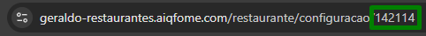
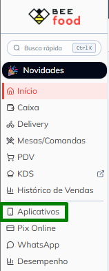
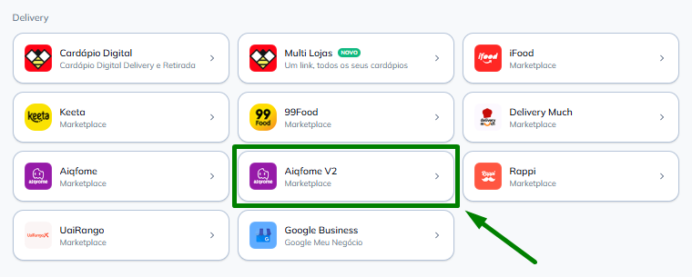
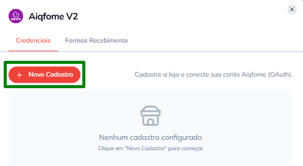
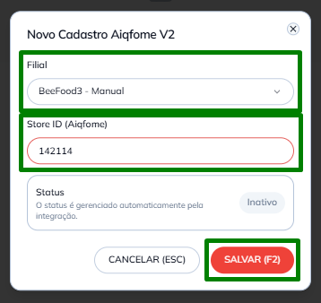
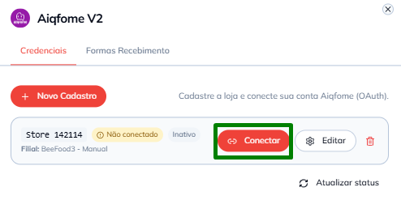
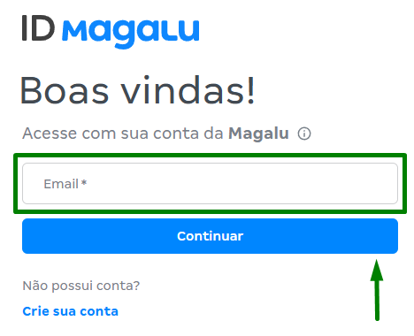
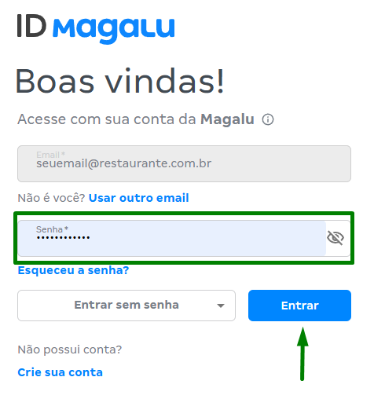
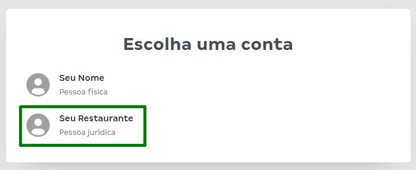
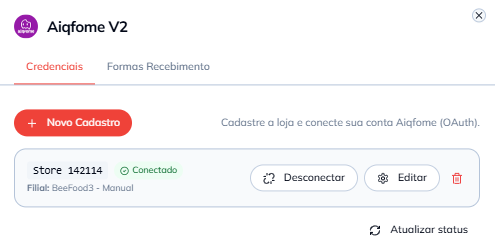

# Ativação da integração Aiqfome V2 no BeeFood

Guia para o **restaurante** conectar a loja do **Aiqfome** ao sistema **BeeFood** (PDV, pedidos e cardápio).

> As imagens têm **marcações em verde** (destaques e setas) indicando exatamente onde clicar ou o que
> observar em cada tela.

O processo tem três partes:

1. **Descobrir o código da loja** no painel do Aiqfome
2. **Cadastrar a filial** no BeeFood (menu **Aplicativos → Aiqfome V2**)
3. **Autorizar o acesso** com o login **ID Magalu** (conta da Magalu/Aiqfome)

---

## O que você ganha depois de ativar

- Pedidos do Aiqfome chegando automaticamente no PDV BeeFood
- Aceitar e marcar pedidos como prontos a partir do sistema
- Sincronização de status entre Aiqfome e o restaurante

---

## Antes de começar

| Item | Por quê |
|------|---------|
| Loja já cadastrada e ativa no **Aiqfome** | A integração liga uma loja que já existe na plataforma |
| Acesso ao painel **Geraldo** do Aiqfome (`geraldo-restaurantes.aiqfome.com`) | É lá que você encontra o código da loja |
| Filial já criada no **BeeFood** | Cada filial do BeeFood conecta **uma** loja do Aiqfome |
| Login **ID Magalu** da conta vinculada à loja | E-mail e senha usados no passo de autorização |

> **Atenção:** use sempre **Aiqfome V2** no BeeFood. A opção antiga **Aiqfome** (sem o "V2") é outra
> integração e **não** deve ser usada para este fluxo.

---

## Parte 1 — Obter o código da loja no Aiqfome

### Passo 1. Abrir as configurações da loja

No painel **Geraldo** do Aiqfome, no menu lateral, clique no item com o **nome do seu restaurante**
(no print aparece como "Seu Restaurante", mas na sua conta estará o nome real da loja, por exemplo
*Pizzaria do João*) e clique em **configurações da loja**.


---

### Passo 2. Anotar o Store ID (código da loja)

Com a tela de configuração aberta, olhe a **barra de endereço** do navegador.

O número no **final da URL**, após `/configuracao/`, é o **Store ID** da sua loja. No exemplo abaixo, o
código é `142114`:

```
geraldo-restaurantes.aiqfome.com/restaurante/configuracao/142114
                                                          ^^^^^^
                                                       Store ID
```



Guarde esse número — você vai informá-lo no BeeFood no **Passo 6**.

---

## Parte 2 — Cadastrar a integração no BeeFood

### Passo 3. Ir até Aplicativos

No BeeFood, no menu lateral, clique em **Aplicativos**.



---

### Passo 4. Selecionar Aiqfome V2

Na área **Delivery**, localize o card **Aiqfome V2** e clique nele (seta verde).

> Não confunda com o card **Aiqfome** (sem "V2"), que aparece logo ao lado na mesma lista.



---

### Passo 5. Novo cadastro

Na aba **Credenciais**, clique em **+ Novo Cadastro**.

> Se ainda não houver nenhuma loja ligada, a tela mostra **"Nenhum cadastro configurado"** — é normal.



---

### Passo 6. Preencher filial e Store ID

Na janela **Novo Cadastro Aiqfome V2**:

| Nº | Campo | O que preencher |
|----|-------|-----------------|
| ① | **Filial** | Selecione a unidade do BeeFood que receberá os pedidos |
| ② | **Store ID (Aiqfome)** | Cole o número anotado no Passo 2 (ex.: `142114`) |
| ③ | **SALVAR (F2)** | Clique para gravar o cadastro |

O campo **Status** aparece como **Inativo** com a observação *"O status é gerenciado automaticamente
pela integração"* — isso é normal **antes** de conectar; ele é atualizado sozinho após a autorização.



---

### Passo 7. Conectar

De volta à lista da aba **Credenciais**, o cadastro aparece com o status **Não conectado** (e **Inativo**).

Clique no botão vermelho **Conectar** da loja que você acabou de salvar. O BeeFood abrirá o fluxo de
login do **ID Magalu**.



> **Dica:** conclua os Passos 8 a 10 em até **10 minutos**. Se demorar muito, a sessão expira e será
> preciso clicar em **Conectar** novamente.

---

## Parte 3 — Autorizar com o ID Magalu

### Passo 8. Informar o e-mail

Na tela **ID Magalu** ("Boas vindas!"), digite o **e-mail da conta Magalu** vinculada à sua loja no
Aiqfome e clique em **Continuar**.

> Use a conta do **proprietário ou gestor** da loja — não use e-mail pessoal sem vínculo com o restaurante.



---

### Passo 9. Informar a senha

Digite a **senha** da conta e clique em **Entrar**.

> - Se não lembrar a senha, use **Esqueceu a senha?** na própria tela do Magalu.
> - Errou o e-mail? Clique em **Não é você? Usar outro email**.



---

### Passo 10. Escolher a conta do restaurante

Se aparecer a tela **Escolha uma conta**, selecione o perfil **Pessoa jurídica** (nome do seu
restaurante).

> Não escolha a conta **Pessoa física**, a menos que seja essa a conta oficial da loja no Aiqfome.



Em seguida, se o Magalu pedir, confirme as **permissões** do BeeFood (ler pedidos, atualizar status,
etc.) clicando em **Autorizar** / **Permitir**.

---

## Passo 11. Confirmação

Após a autorização, você volta ao BeeFood. Na aba **Credenciais** do **Aiqfome V2**, o status da loja
deve aparecer como **Conectado** (verde), e os botões mudam para **Desconectar** / **Editar**.



A integração está funcionando quando:

- O status mostra **Conectado**
- Novos pedidos do Aiqfome começam a aparecer no PDV

> Se o status não atualizar sozinho, clique em **Atualizar status** (canto inferior direito da tela).

---

## Como saber se está tudo certo

| Sinal | Significado |
|-------|-------------|
| **Conectado** no BeeFood | Autorização concluída |
| Pedido de teste no Aiqfome aparece no PDV | Sincronização OK |
| Aceitar / pronto respondem no PDV | Comunicação com Aiqfome OK |

---

## Problemas comuns

### "OAuth state expired" / sessão expirada

Você demorou mais de **10 minutos** entre clicar em **Conectar** e terminar o login no Magalu.

**Solução:** volte ao BeeFood, clique em **Conectar** de novo e conclua o fluxo sem pausas longas.

---

### Pedidos não chegam no PDV

A conexão pode estar OK, mas o pedido depende também da loja estar operando no Aiqfome.

Verifique:

- O **Store ID** está correto?
- A loja está **aberta** no Aiqfome?
- O teste foi feito **depois** de aparecer **Conectado**?

---

## Desconectar a integração

1. BeeFood → **Aplicativos** → **Aiqfome V2** → aba **Credenciais**
2. No card da loja, clique em **Desconectar**
3. Os pedidos deixam de sincronizar até uma nova autorização (**Conectar**)

---

## Precisa de ajuda?

Entre em contato com o **suporte BeeFood** informando:

- Nome da loja e **CNPJ**
- **Filial** no BeeFood e **Store ID** usado
- Print da mensagem de erro (se houver)
- Horário em que tentou conectar

---

*Última atualização: junho/2026 — BeeFood · integração Aiqfome V2*
