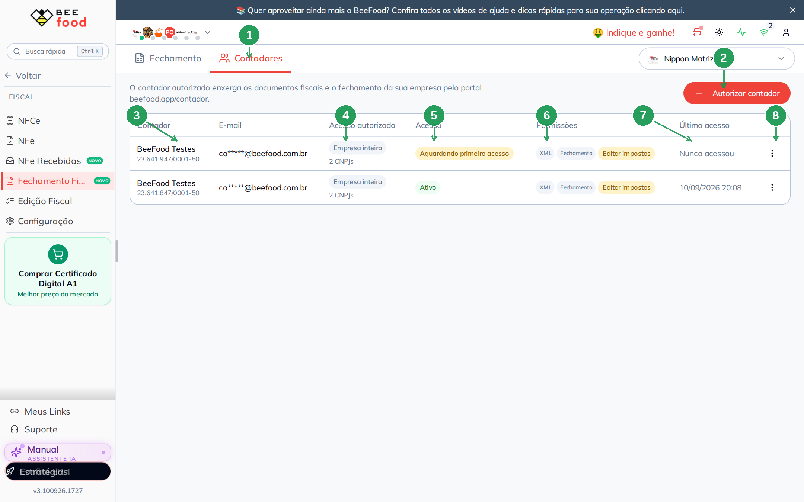
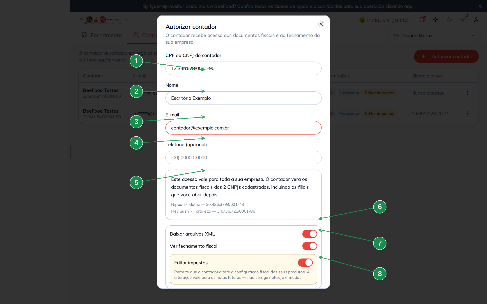
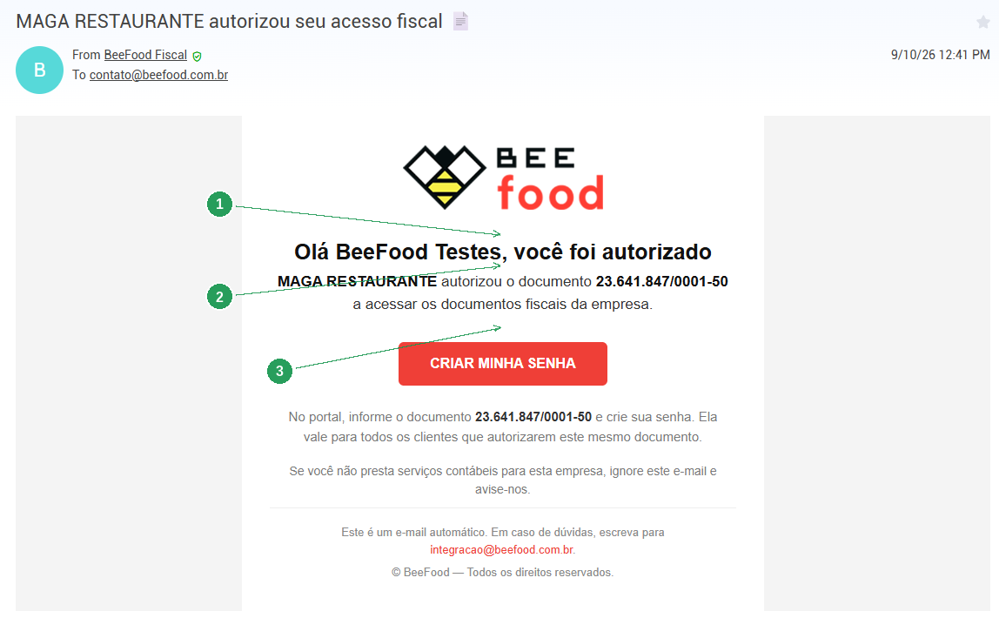
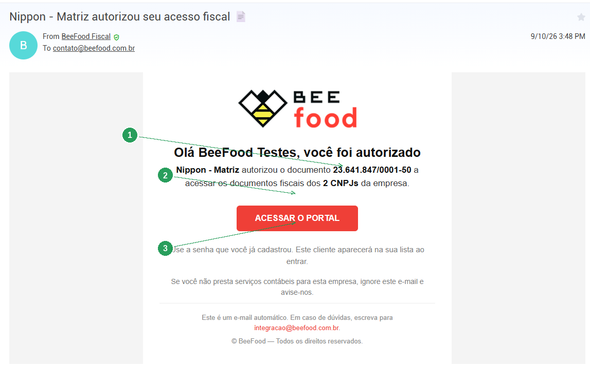
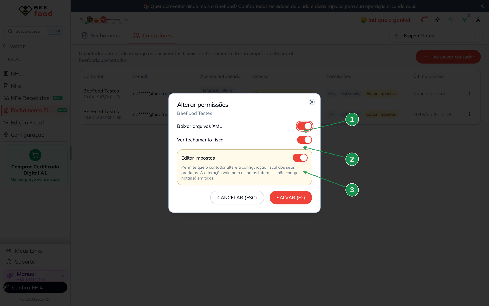
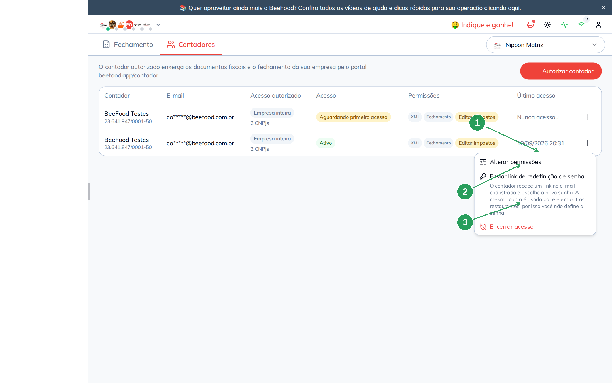
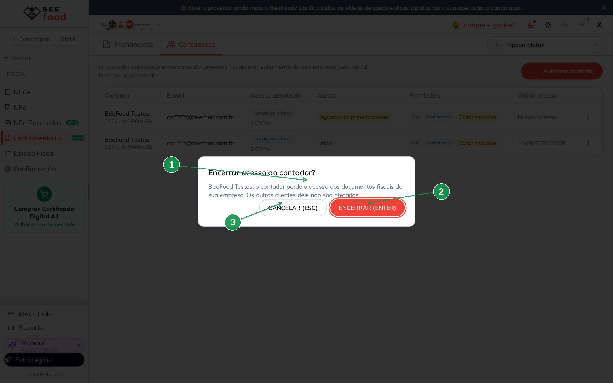

# Autorizar o contador

Este manual mostra como o restaurante **libera o escritório contábil** para ver o fechamento
fiscal e baixar os XMLs pelo portal `beefood.app/contador`.

Tudo acontece na aba **Contadores** de **Fiscal → Fechamento Fiscal**. O lojista **não escolhe
a senha** do contador: a mesma conta serve para todos os clientes daquele CPF/CNPJ.

> As imagens têm **setas com números** (1, 2, 3...). No texto, cada número indica exatamente o
> campo ou botão correspondente na tela.

---

## Índice

- [1. A aba Contadores](#1-a-aba-contadores)
- [2. Autorizar um contador](#2-autorizar-um-contador)
- [3. O e-mail que ele recebe](#3-o-e-mail-que-ele-recebe)
- [4. As três permissões](#4-as-três-permissões)
- [5. Encerrar, reativar e redefinir senha](#5-encerrar-reativar-e-redefinir-senha)
- [6. Perguntas rápidas](#6-perguntas-rápidas)

---

## 1. A aba Contadores

Em **Fiscal → Fechamento Fiscal**, clique na aba **Contadores**.

A permissão é a mesma da aba Fechamento (manual *Fechamento Fiscal*). Quem vê uma vê a outra.

| Nº | Item | O que é |
|----|------|---------|
| 1 | Aba **Contadores** | Quem pode ver os documentos fiscais da empresa. |
| 2 | **+ Autorizar contador** | Abre o cadastro. |
| 3 | Contador | Nome e o CPF/CNPJ. |
| 4 | **Empresa inteira** | O acesso vale para **todos** os CNPJs da empresa, inclusive filial nova. |
| 5 | Status | **Aguardando primeiro acesso**, **Ativo** ou **Revogado**. |
| 6 | Permissões | XML, Fechamento e, em destaque, **Editar impostos**. |
| 7 | Último acesso | Quando ele entrou no portal — ou *Nunca acessou*. |
| 8 | Os três pontinhos | Alterar permissões, redefinir senha, encerrar ou reativar. |

O e-mail já chega **mascarado** (`co****@beefood.com.br`). É o cadastrado na conta dele, não
necessariamente o que você digitou na segunda autorização.

**Aguardando primeiro acesso** tem prioridade sobre Ativo: ele ainda não criou a senha.
**Ativo** significa que a conta tem senha e o vínculo está válido.

---

## 2. Autorizar um contador

Clique em **+ Autorizar contador**.

| Nº | Campo | O que fazer |
|----|-------|-------------|
| 1 | **CPF ou CNPJ do contador** | Com ou sem máscara. É a identidade da conta. |
| 2 | **Nome** | Escritório ou responsável. Até 120 caracteres. |
| 3 | **E-mail** | Para onde vão o convite, a redefinição de senha e o aviso de encerramento. |
| 4 | **Telefone** | Opcional. |
| 5 | O aviso dos CNPJs | Este acesso vale para **toda a empresa**. A lista mostra os CNPJs (no exemplo, matriz e filial). |
| 6 | **Baixar arquivos XML** | Ligada por padrão. |
| 7 | **Ver fechamento fiscal** | Ligada por padrão. |
| 8 | **Editar impostos** | Liga a edição fiscal no portal. A alteração vale para as **próximas** notas — não corrige nota já emitida. |

Clique em **CONFIRMAR (F2)**.

Se o documento **já tiver conta** no BeeFood, a tela não cria usuário novo. Aparece uma
confirmação com o nome e o e-mail cadastrados (mascarado). Se o e-mail que você digitou for
outro, o recado avisa: **continua valendo o cadastrado**. Confirme só se for realmente o seu
contador.

Depois do OK, a lista recarrega e o escritório recebe o e-mail.

---

## 3. O e-mail que ele recebe

O remetente é **BeeFood Fiscal** (`integracao@beefood.com.br`). O assunto é
*{nome da empresa} autorizou seu acesso fiscal*.

Há **dois** textos, conforme a conta já exista ou não.

### Primeiro acesso — criar senha

Quem ainda não tem senha recebe o botão **CRIAR MINHA SENHA**. No portal, informa o mesmo
CPF/CNPJ e cria a senha. Essa senha vale para **todos** os clientes que autorizarem o mesmo
documento.

| Nº | Item | O que observar |
|----|------|----------------|
| 1 | O título | *Olá …, você foi autorizado*. |
| 2 | A empresa | Quem autorizou e o documento liberado. |
| 3 | **CRIAR MINHA SENHA** | Leva a `beefood.app/contador`. |

### Conta que já existe — só entrar

Se o escritório já criou senha (por outro cliente), o botão vira **ACESSAR O PORTAL**. O
texto pede para usar a senha já cadastrada. Quando a empresa tem mais de um CNPJ, o e-mail
diz quantos ele vai ver.

| Nº | Item | O que observar |
|----|------|----------------|
| 1 | Os **2 CNPJs** | Acesso à empresa inteira, não só à matriz. |
| 2 | **ACESSAR O PORTAL** | Não cria senha de novo. |
| 3 | A frase da senha | *Use a senha que você já cadastrou.* |

Outros e-mails que o mesmo endereço pode receber:

- **Senha criada** — com data e IP, no momento do primeiro acesso.
- **Redefinição de senha** — quando você (ou ele) pede o link. O assunto cita o nome da
  empresa, para ele não achar que foi invasão.
- **Acesso encerrado** — quando você revoga. Sem isso, ele tenta entrar e abre chamado.

Se o e-mail não chegar, peça para olhar o spam. O cadastro **não depende** do e-mail ter
aberto: o vínculo já está válido.

---

## 4. As três permissões

Nos três pontinhos da linha, **Alterar permissões**.

| Nº | Permissão | Efeito no portal |
|----|-----------|------------------|
| 1 | **Baixar arquivos XML** | ZIP do mês e XML avulso. |
| 2 | **Ver fechamento fiscal** | Resumo, produtos e documentos. |
| 3 | **Editar impostos** | Aba Edição fiscal + taxa de serviço. |

Desligar **Ver fechamento** não tira o login: tira o conteúdo daquele cliente. Desligar
**Editar impostos** esconde a aba no portal.

A revogação é imediata. O token do contador continua válido por até 12 horas, mas **cada
clique** consulta o vínculo: ele perde o cliente na hora.

---

## 5. Encerrar, reativar e redefinir senha

Os três pontinhos da linha **Ativa**:

| Nº | Ação | Quando aparece |
|----|-------|----------------|
| 1 | **Alterar permissões** | Enquanto o vínculo não está revogado. |
| 2 | **Enviar link de redefinição de senha** | Só com conta já ativada. Você **não** define a senha nova. |
| 3 | **Encerrar acesso** | Confirmação na sequência. |

Na linha **Aguardando primeiro acesso** não há redefinição de senha: ainda não existe senha
para resetar.

**Encerrar** pede confirmação:

| Nº | Item | O que acontece |
|----|------|----------------|
| 1 | O recado | Ele perde os documentos **desta empresa**. Os outros clientes dele não são afetados. |
| 2 | **ENCERRAR (ENTER)** | Revoga. Ele recebe o e-mail de encerramento. |
| 3 | **CANCELAR (ESC)** | Não faz nada. |

Linha revogada ganha a ação **Reativar acesso**. A conta e a senha continuam: só o vínculo
com a sua empresa volta.

Não existe campo de senha nesta tela. A senha é do escritório, não da loja. Se você
pudesse escolhê-la, cairiam os outros clientes dele.

---

## 6. Perguntas rápidas

**Posso autorizar só a matriz, sem a filial?**
Não. O acesso é da empresa inteira. Filial aberta depois entra automaticamente.

**Digitei o e-mail errado.**
Se a conta **já existia**, o e-mail cadastrado continua valendo — a confirmação avisa. Se a
conta é nova, o convite foi para o endereço errado: encerre e autorize de novo com o e-mail
certo, ou peça o reset depois que ele criar a senha.

**O contador não recebeu o e-mail.**
O vínculo já está na lista. Ele pode ir em `beefood.app/contador`, informar o documento e
criar a senha (primeiro acesso) ou entrar. O e-mail é o aviso, não o token.

**Posso ter dois contadores?**
Sim. Cada CPF/CNPJ é uma conta. Vários escritórios na mesma empresa são linhas diferentes.

**Alguém chegou antes e criou a senha do meu contador.**
O risco existe: o primeiro acesso não exige clicar no e-mail. A mitigação é o aviso com data
e IP no e-mail cadastrado, e o status *Aguardando primeiro acesso* na sua lista. Se não foi
ele, envie o link de redefinição e troque o e-mail com o suporte se precisar.
