# Manual — Cadastrar comandas e gerar o QR Code

Comanda é a **conta que anda com o cliente**: ele chega, recebe a comanda (cartão, ficha ou
número), consome pelo salão e paga no fim. No BeeFood, cada comanda precisa estar cadastrada
para virar um card na tela **Mesas/Comandas** e para poder receber um **QR Code**.

Este manual percorre a tela inteira — cadastro individual, criação em lote, edição, exclusão e os
**três tipos de QR Code** — e termina com um exemplo completo, do cadastro à comanda impressa.

> As imagens têm **setas numeradas** (1, 2, 3…). Cada número indica o campo correspondente
    10|> na tela.

---

## Onde fica

No menu lateral, clique em **Cadastros** e depois em **Comandas** (1).

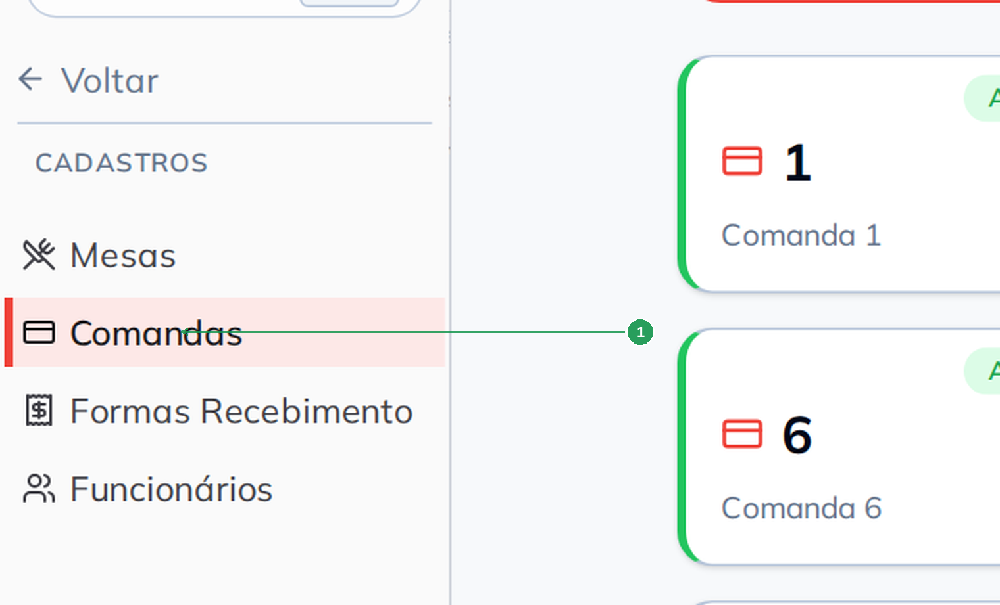

    20|| Nº | Item | O que é |
|----|------|---------|
| 1 | **Comandas** | O cadastro que este manual explica. Ao lado ficam **Mesas** e **Formas Recebimento**. |

---

## A tela de comandas

Uma comanda por card, em ordem de código: o **código** (o número grande), a **descrição** e a
etiqueta **Ativo** ou **Inativo**.
    30|
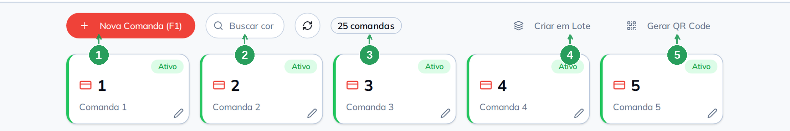

| Nº | Item | O que faz |
|----|------|-----------|
| 1 | **Nova Comanda (F1)** | Cadastra uma comanda por vez. O atalho **F1** faz o mesmo. |
| 2 | **Buscar comanda...** | Filtra por código ou descrição. Qualquer tecla digitada na tela cai nesta busca. |
| 3 | Contador de comandas | Quantas comandas existem no cadastro. |
| 4 | **Criar em Lote** | Cria uma faixa numerada de uma vez — é como se cadastram 50 ou 100 comandas. |
| 5 | **Gerar QR Code** | Abre os três tipos de QR Code. |

    40|Ao lado da busca ficam o botão **atualizar** (atalho **F5**) e, no card, o lápis de edição.

> **Ativo × Livre.** *Ativo* é do cadastro. *Livre*, *Ocupado* e *Fechado* são do dia a dia, na
> tela Mesas/Comandas, e dependem de existir venda aberta naquela comanda.

---

## Cadastrar uma comanda

Clique em **Nova Comanda (F1)**. O código já vem sugerido com o próximo número livre e a
descrição vem montada.
    50|
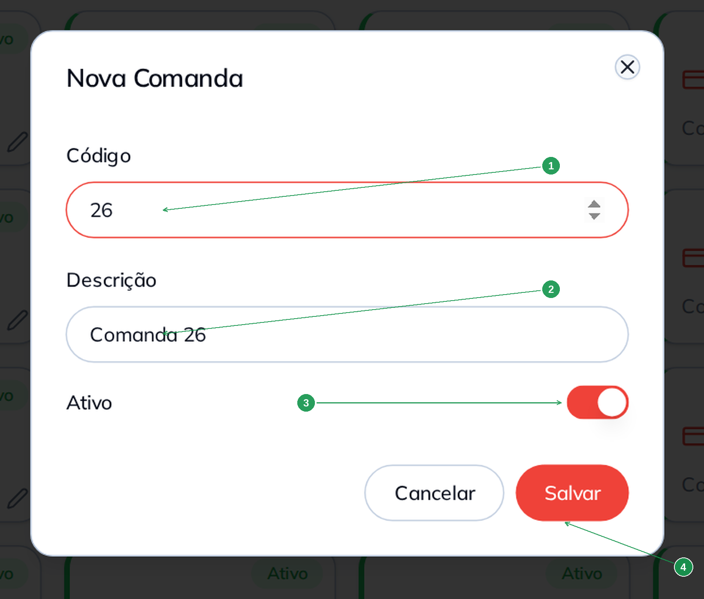

| Nº | Campo | O que fazer |
|----|-------|-------------|
| 1 | **Código*** | O número impresso na comanda física. É o que o operador digita ou lê no PDV. |
| 2 | **Descrição*** | O nome que aparece no card. Vem como `Comanda <código>` e aceita qualquer texto. |
| 3 | **Ativo** | Ligado, a comanda entra na tela Mesas/Comandas. |
| 4 | **Salvar** | Grava e o card aparece na lista. |

> **O código tem de ser o número do cartão.** Se as comandas físicas vão de 1 a 50, cadastre de
    60|> 1 a 50. É esse casamento que faz o pedido cair na comanda certa.

---

## Editar e excluir

Clique no card para reabrir a comanda (**Editar Comanda**). O modal ganha um botão **Excluir**, e
a exclusão pede confirmação repetindo a descrição:

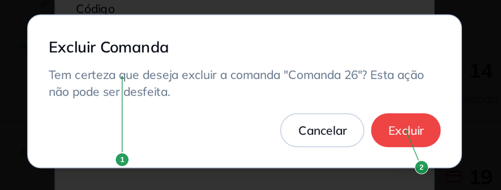

    70|| Nº | Item | O que conferir |
|----|------|----------------|
| 1 | O texto do aviso | Repete a **descrição** da comanda. Leia antes de confirmar. |
| 2 | **Excluir** | Confirma. **Esta ação não pode ser desfeita.** |

> Comanda que saiu de circulação (cartão perdido, ficha quebrada): prefira **desativar** a
> excluir — assim o histórico das vendas antigas continua fazendo sentido.

---

    80|## Criar a faixa inteira de uma vez

O **Criar em Lote** é o caminho normal para comandas, porque elas costumam vir em blocos de 50 ou
100 cartões numerados.

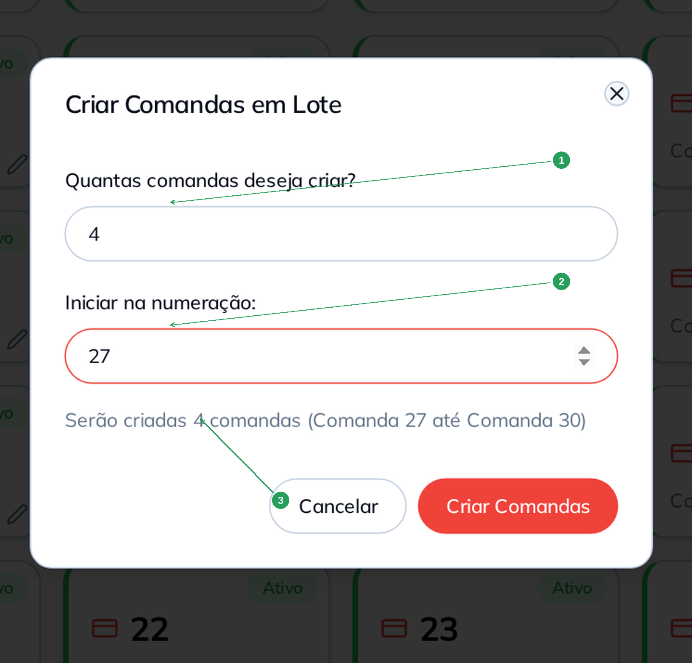

| Nº | Campo | O que fazer |
|----|-------|-------------|
| 1 | **Quantas comandas deseja criar?** | De 1 a 100 por vez. Para 200 comandas, repita a operação. |
| 2 | **Iniciar na numeração:** | O primeiro código da faixa. |
    90|| 3 | A previsão | Diz a primeira e a última comanda que serão criadas. Se a faixa esbarrar em comandas que já existem, aparece o aviso **Conflito de numeração** com os códigos repetidos, e o botão fica bloqueado até você mudar o número inicial. |

Criado o lote, o contador sobe:

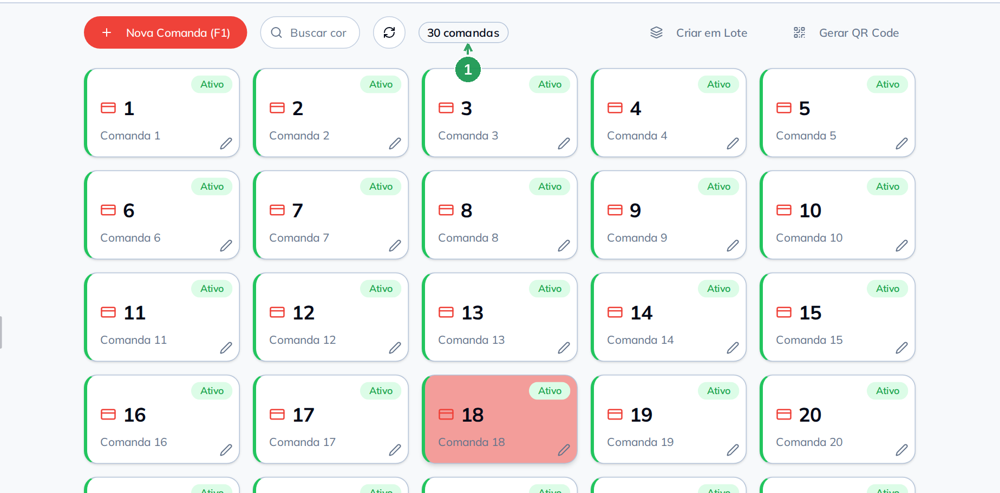

| Nº | Item | O que conferir |
|----|------|----------------|
| 1 | Contador | Quantas comandas existem agora no cadastro. |

   100|---

## Os três tipos de QR Code

O botão **Gerar QR Code** oferece três saídas diferentes:

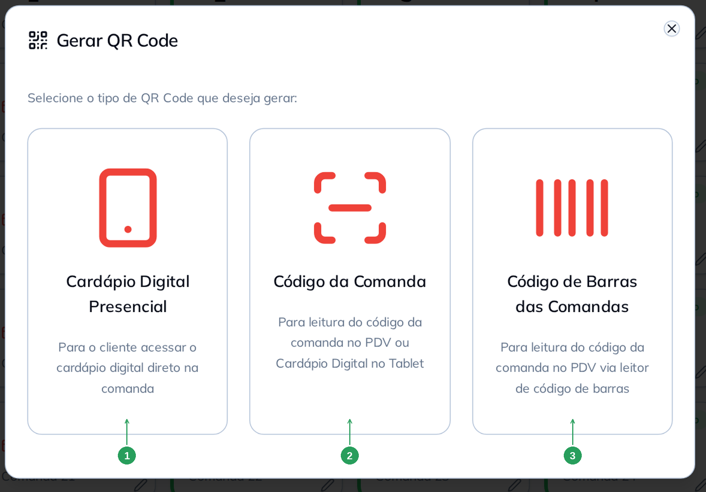

| Nº | Tipo | Para que serve | Quem lê |
|----|------|----------------|---------|
| 1 | **Cardápio Digital Presencial** | O cliente aponta a câmera e o cardápio abre no celular dele, **já na comanda dele** | O cliente |
   110|| 2 | **Código da Comanda** | Identificar a comanda **dentro do BeeFood**: o operador lê no PDV ou no Cardápio no Tablet | Você |
| 3 | **Código de Barras das Comandas** | O mesmo, em **EAN-13**, para leitor a laser no balcão | Você |

> **Por que o QR de comanda é melhor que o de mesa.** Com o QR na comanda, cada cliente lê o
> código da **sua** conta e o pedido não tem como ir para a comanda errada. Com o QR na mesa, o
> cliente ainda escolhe a comanda na hora de pedir — e dois clientes podem escolher a mesma. O
> próprio sistema faz essa recomendação quando você tenta gerar QR Code de mesa tendo comanda
> (veja o manual de mesas).

### 1. Cardápio Digital Presencial

   120|Informe a faixa e gere. Diferente do cadastro de mesas, aqui **não há** a pergunta "você usa
comanda?" — o sistema vai direto ao ponto.

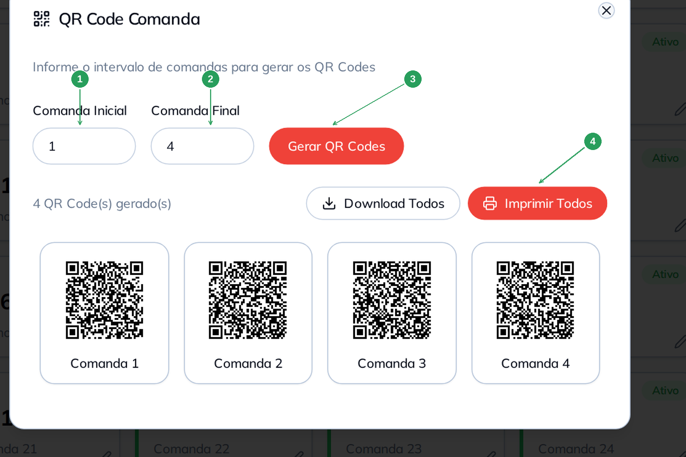

| Nº | Campo | O que fazer |
|----|-------|-------------|
| 1 | **Comanda Inicial** | Primeiro número da faixa. |
| 2 | **Comanda Final** | Último número. Máximo de **100 QR Codes** por vez. |
| 3 | **Gerar QR Codes** | Desenha os códigos, um por comanda. |
| 4 | **Imprimir Todos** | Abre a folha pronta para imprimir. O **Download Todos**, ao lado, salva um PNG por comanda. |
   130|
A folha sai em grade, com o logo da loja e o número da comanda embaixo de cada código — é o que
você recorta e cola (ou plastifica) na comanda física:

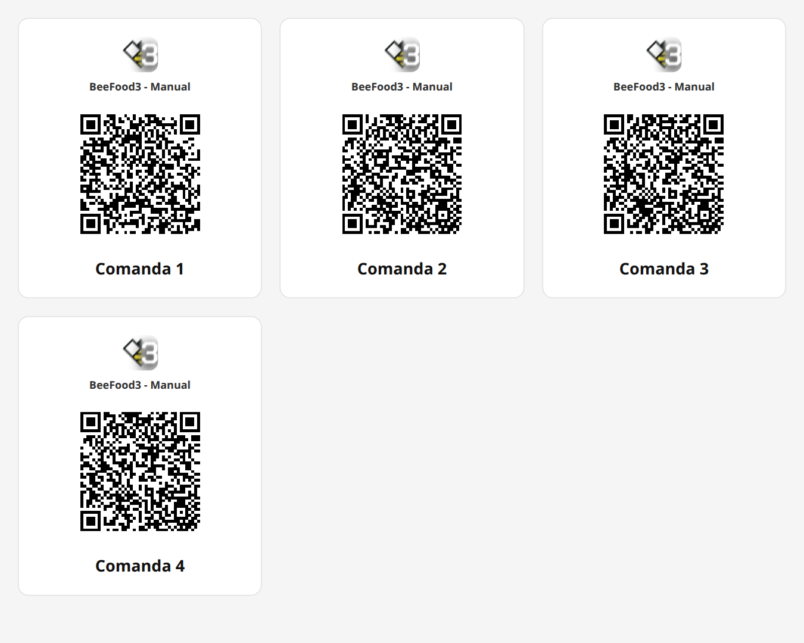

> Este tipo gera pela **faixa** informada, sem conferir o cadastro: se você pedir de 1 a 40 e só
> existirem 30 comandas, ele desenha 40 códigos.

### 2. Código da Comanda

   140|Este QR **não é um endereço de internet**: é o código interno que o BeeFood entende. O operador
lê no PDV e a venda já sai na comanda certa.

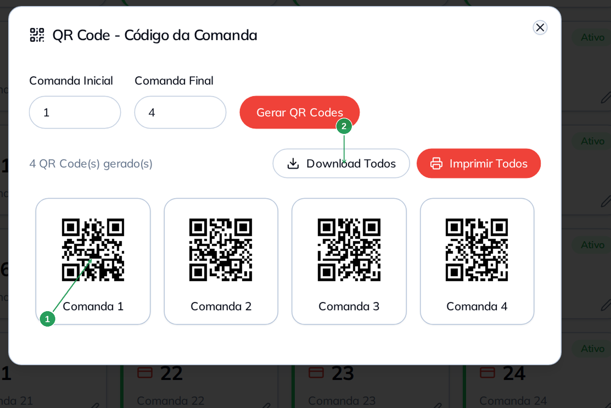

| Nº | Item | O que é |
|----|------|---------|
| 1 | O QR de cada comanda | Com a etiqueta **Comanda N** embaixo. Só gera para comandas que **existem** no cadastro. |
| 2 | **Download Todos** | Um PNG por comanda. |

   150|### 3. Código de Barras das Comandas

Mesma função, em **EAN-13**, para quem já tem leitor de código de barras no balcão.

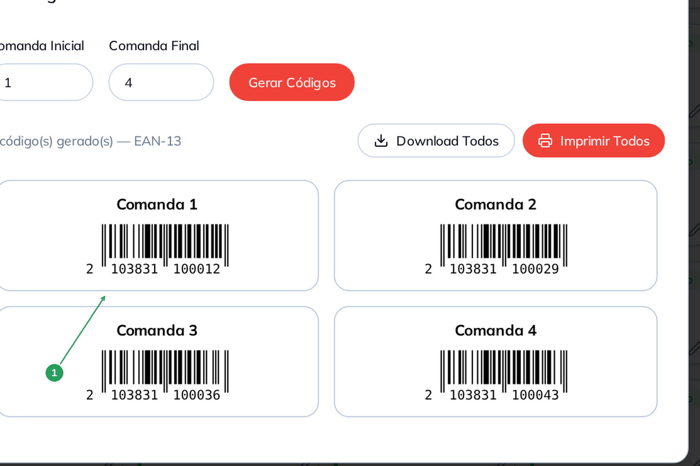

| Nº | Item | O que observar |
|----|------|----------------|
| 1 | O código de barras | Um EAN-13 exclusivo por comanda, com a etiqueta **Comanda N**. O limite é a comanda **9999**. |

   160|> O código da **comanda** e o da **mesa** são diferentes de propósito: o sistema sabe, pelo
> código lido, se aquilo é uma mesa ou uma comanda. Por isso não dá para reaproveitar a etiqueta
> de uma na outra.

---

## O que o cadastro habilita no dia a dia

Cada comanda cadastrada vira um card na aba **Comandas** da tela Mesas/Comandas:

   170|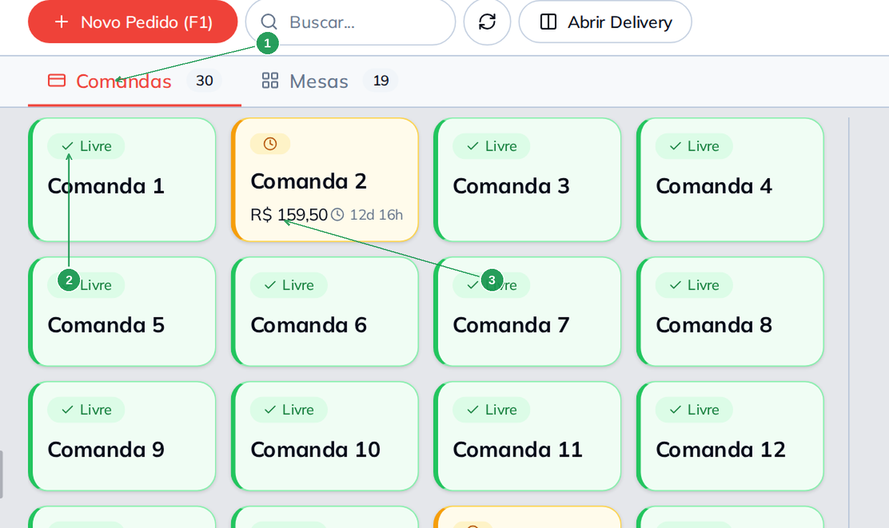

| Nº | Item | O que é |
|----|------|---------|
| 1 | Aba **Comandas** | Alterna entre comandas e mesas. O número ao lado é a contagem do cadastro. |
| 2 | Card **Livre** | Comanda cadastrada e sem venda aberta — pronta para entregar ao cliente. |
| 3 | Card **Ocupado** | Comanda em uso: mostra o valor consumido e o tempo. |

Existe ainda o status **Fechado** (com cadeado), para a comanda que já pediu o fechamento.

> Comanda **inativa** não aparece aqui. Se faltou uma comanda no mapa, confira o switch **Ativo**
   180|> no cadastro.

---

## Exemplo prático: 30 comandas em circulação

O caminho completo, do zero ao cartão na mão do cliente:

1. **Conte os cartões físicos.** Se você tem 30 comandas numeradas de 1 a 30, é essa a faixa que
   precisa existir no cadastro.
   190|2. **Cadastre a primeira à mão** (Nova Comanda F1) para conferir o padrão de descrição.
3. **Crie o resto em lote**: no exemplo, 4 comandas a partir da 27, fechando a faixa 1–30. O
   aviso de conflito segura o botão se algum número já existir.
4. **Gere o QR Code do Cardápio Digital Presencial** para a faixa — no exemplo, de 1 a 4.
5. **Imprima a folha, recorte e cole** cada código na comanda correspondente. Vale plastificar:
   a comanda passa o dia na mão do cliente.
6. **Entregue a comanda na chegada.** O cliente lê o QR do próprio cartão, pede pelo celular, e
   o pedido cai na comanda dele — sem garçom digitando número errado.
7. **Acompanhe pela aba Comandas.** A comanda sai de *Livre*, mostra o valor consumido e, no
   fim, é onde você recebe o pagamento.
   200|
> **Quer também o código para o balcão?** Gere o **Código de Barras das Comandas** na mesma faixa
> e cole no verso do cartão. Aí o operador só passa o leitor para abrir a conta no PDV.

---

## Resumo

1. **Cadastros → Comandas**: um card por comanda, com **código**, **descrição** e **Ativo**.
2. O **código** tem de ser o número impresso na comanda física.
   210|3. Para blocos de cartões, use **Criar em Lote** (até 100 por vez).
4. São **três QR Codes**: cardápio para o **cliente**; código da comanda e código de barras para
   **você**.
5. Tendo comanda, o QR Code que o cliente lê deve ser o **de comanda**, não o de mesa.
6. Comanda **inativa** sai da tela Mesas/Comandas, mas continua no cadastro.

---

## Perguntas frequentes

   220|**Preciso cadastrar mesas também?**
Só se você controla o salão por mesa. Muitos estabelecimentos usam apenas comandas; outros usam
os dois (a comanda anda com o cliente, a mesa organiza o salão).

**Tenho 200 comandas. Dá para criar todas de uma vez?**
O lote vai até 100 por vez. Faça duas rodadas (1–100 e 101–200).

**Perdi um cartão de comanda. O que faço?**
Abra a comanda no cadastro e **desative**. Ela sai da tela de operação e o número não é oferecido
por engano. Se imprimir um cartão novo com o mesmo número, reative.
   230|
**Posso repetir o número de uma comanda?**
Não. O código é único, e o lote avisa com **Conflito de numeração** quando você tenta criar um
número que já existe.

**O cliente leu o QR da comanda e o cardápio abriu, mas o pedido caiu em outra comanda.**
Confira se o adesivo colado no cartão é o daquele número — a folha impressa sai em grade e é
fácil trocar dois códigos na hora de recortar. O número aparece embaixo de cada QR justamente
para isso.

   240|**Excluí uma comanda com vendas antigas. Perdi o histórico?**
Não. As vendas continuam no Histórico de Vendas com a comanda que tinham quando foram feitas.

**Qual QR Code eu colo no cartão do cliente?**
O do **Cardápio Digital Presencial**. O *Código da Comanda* e o *Código de Barras* são para o
operador ler no balcão.

---

## Manuais relacionados

   250|- **Cadastrar mesas e gerar o QR Code** — o par deste manual
- **Cardápio digital presencial e QR Code** — a configuração do canal presencial e o *Meus Links*
- **Taxa e obrigatoriedades de mesa** — comanda obrigatória e taxa de serviço
- **Cadastrar forma de recebimento** — como a forma de pagamento chega ao fechamento da comanda
