# Manual — Cadastrar mesas e gerar o QR Code

O cadastro de mesas é o que desenha o **mapa do seu salão** dentro do BeeFood: cada mesa
cadastrada vira um card na tela **Mesas/Comandas**, aparece no PDV e pode ganhar um **QR Code**
para o cliente pedir do próprio celular.

Este manual percorre a tela inteira — cadastro individual, criação em lote, edição, exclusão e
os **três tipos de QR Code** — e termina com um exemplo completo, do cadastro à folha impressa.

> As imagens têm **setas numeradas** (1, 2, 3…). Cada número indica o campo correspondente
    10|> na tela.

---

## Onde fica

No menu lateral, clique em **Cadastros** e depois em **Mesas** (1). Para voltar ao menu
principal, use o **Voltar** do topo do submenu (2).

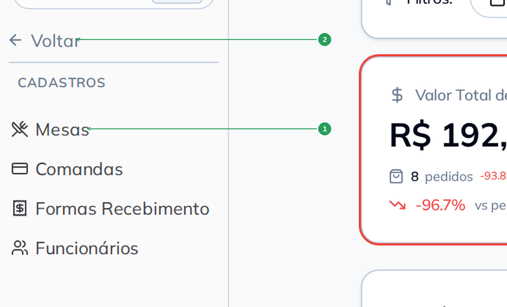

    20|| Nº | Item | O que é |
|----|------|---------|
| 1 | **Mesas** | O cadastro que este manual explica. |
| 2 | **Voltar** | Sai do submenu Cadastros e devolve o menu principal. |

No mesmo submenu ficam **Comandas** (manual próprio) e **Formas Recebimento**.

---

## A tela de mesas

    30|A tela lista **uma mesa por card**, em ordem de código. Em cada card você vê o **código** (o
número grande), a **descrição** e a etiqueta **Ativo** ou **Inativo**.

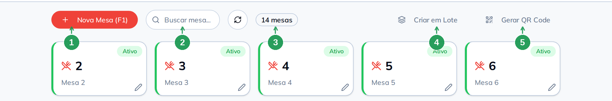

| Nº | Item | O que faz |
|----|------|-----------|
| 1 | **Nova Mesa (F1)** | Cadastra uma mesa por vez. O atalho **F1** faz o mesmo. |
| 2 | **Buscar mesa...** | Filtra por código ou por descrição. Dentro da tela, qualquer tecla que você digitar cai nesta busca. |
| 3 | Contador de mesas | Quantas mesas existem hoje no cadastro. |
| 4 | **Criar em Lote** | Cria várias mesas numeradas de uma vez — é o caminho para montar o salão. |
    40|| 5 | **Gerar QR Code** | Abre os três tipos de QR Code (explicados adiante). |

Há também o botão de **atualizar** (o círculo com as setas), ao lado da busca, com o atalho
**F5**.

> **Ativo × Livre não são a mesma coisa.** *Ativo* é do cadastro: diz se a mesa existe para o
> sistema. *Livre*, *Ocupado* e *Fechado* são do dia a dia, na tela Mesas/Comandas, e dependem de
> haver uma venda aberta naquela mesa.

---

    50|## Cadastrar uma mesa

Clique em **Nova Mesa (F1)**. O BeeFood já sugere o **próximo código livre** e monta a descrição
para você — normalmente é só conferir e salvar.

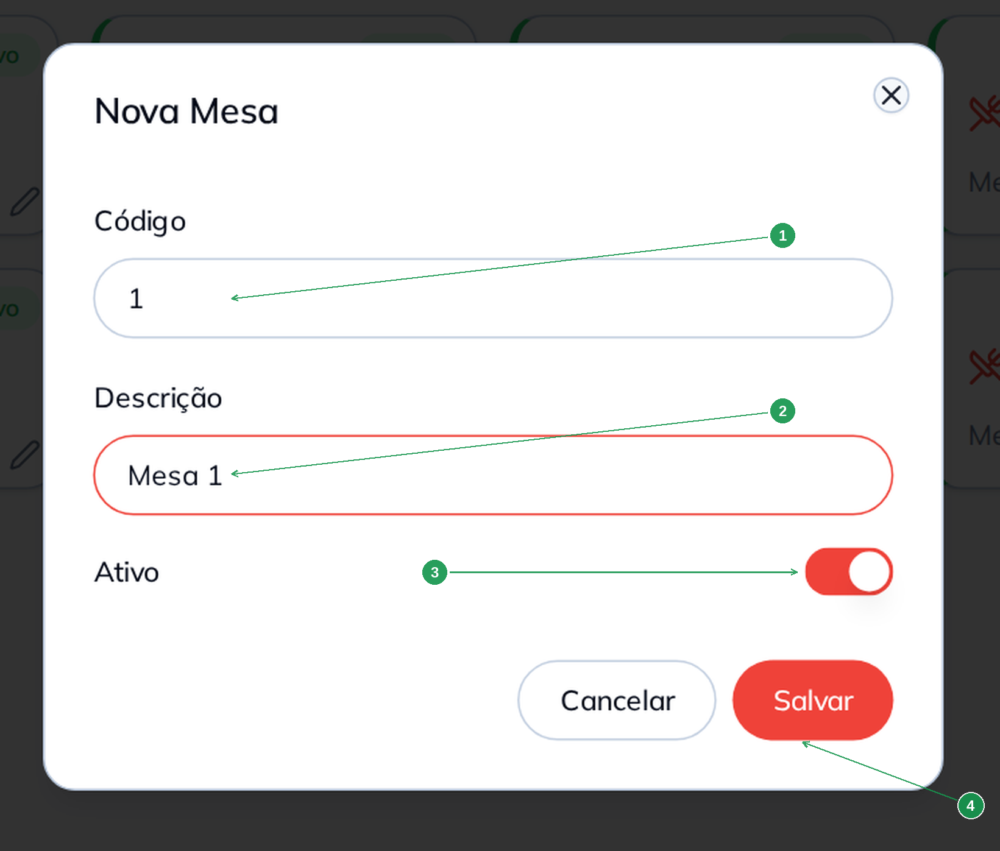

| Nº | Campo | O que fazer |
|----|-------|-------------|
| 1 | **Código*** | O número da mesa. É por ele que a mesa é chamada no PDV e no QR Code. Vem preenchido com o próximo número livre. |
| 2 | **Descrição*** | O nome que aparece no card e no mapa do salão. Vem como `Mesa <código>`, e você pode trocar por qualquer texto — *Varanda 1*, *Deck*, *Balcão 2*. |
    60|| 3 | **Ativo** | Ligado, a mesa entra no mapa do salão. Desligado, ela fica só no cadastro. |
| 4 | **Salvar** | Grava. O card novo aparece na lista, em ordem de código. |

Os dois campos são obrigatórios: com qualquer um deles vazio, o **Salvar** não conclui.

> **Dica de numeração.** Use o mesmo número que está colado na mesa física. Se o salão tem uma
> mesa 12 na parede, ela deve ser a mesa **12** aqui — é isso que evita pedido na conta errada.

---

## Editar e excluir

    70|Clique em qualquer card para reabrir a mesa. O modal é o mesmo, agora chamado **Editar Mesa**,
com um botão **Excluir** a mais (1).

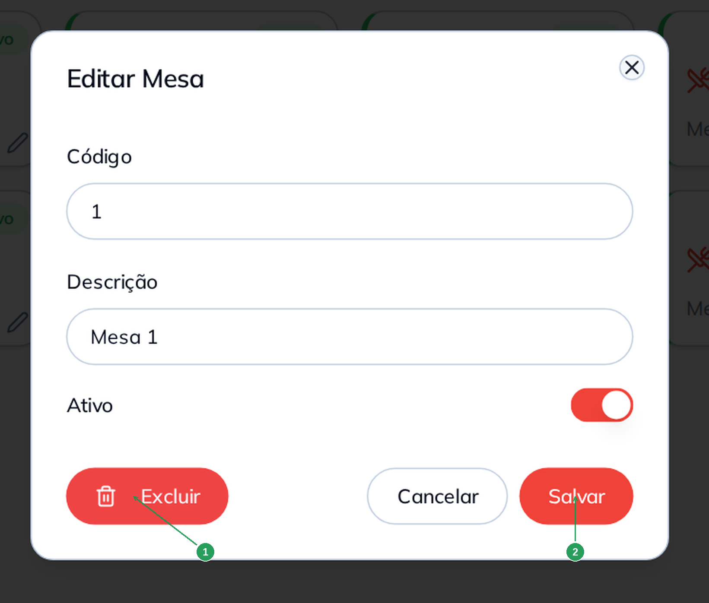

| Nº | Item | O que faz |
|----|------|-----------|
| 1 | **Excluir** | Apaga a mesa do cadastro. Pede confirmação. |
| 2 | **Salvar** | Grava a alteração de código, descrição ou do switch **Ativo**. |

A exclusão avisa que não tem volta:
    80|
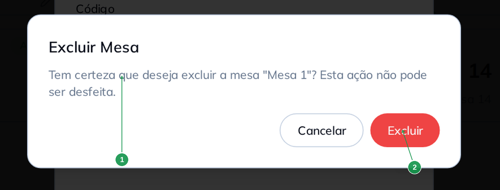

| Nº | Item | O que conferir |
|----|------|----------------|
| 1 | O texto do aviso | Ele repete a **descrição** da mesa. Leia antes de confirmar: é a garantia de que você não está apagando a mesa errada. |
| 2 | **Excluir** | Confirma. **Esta ação não pode ser desfeita.** |

> **Prefira desativar a excluir.** Se a mesa saiu do salão mas você quer preservar o histórico,
> desligue o switch **Ativo** em vez de apagar o cadastro.

    90|---

## Criar o salão inteiro de uma vez

O **Criar em Lote** é para quem está montando a loja: você diz **quantas** mesas quer e **de qual
número** começar, e o BeeFood cria todas, já com a descrição `Mesa <n>`.

Se a faixa pega mesas que já existem, a tela avisa e **bloqueia** o botão:

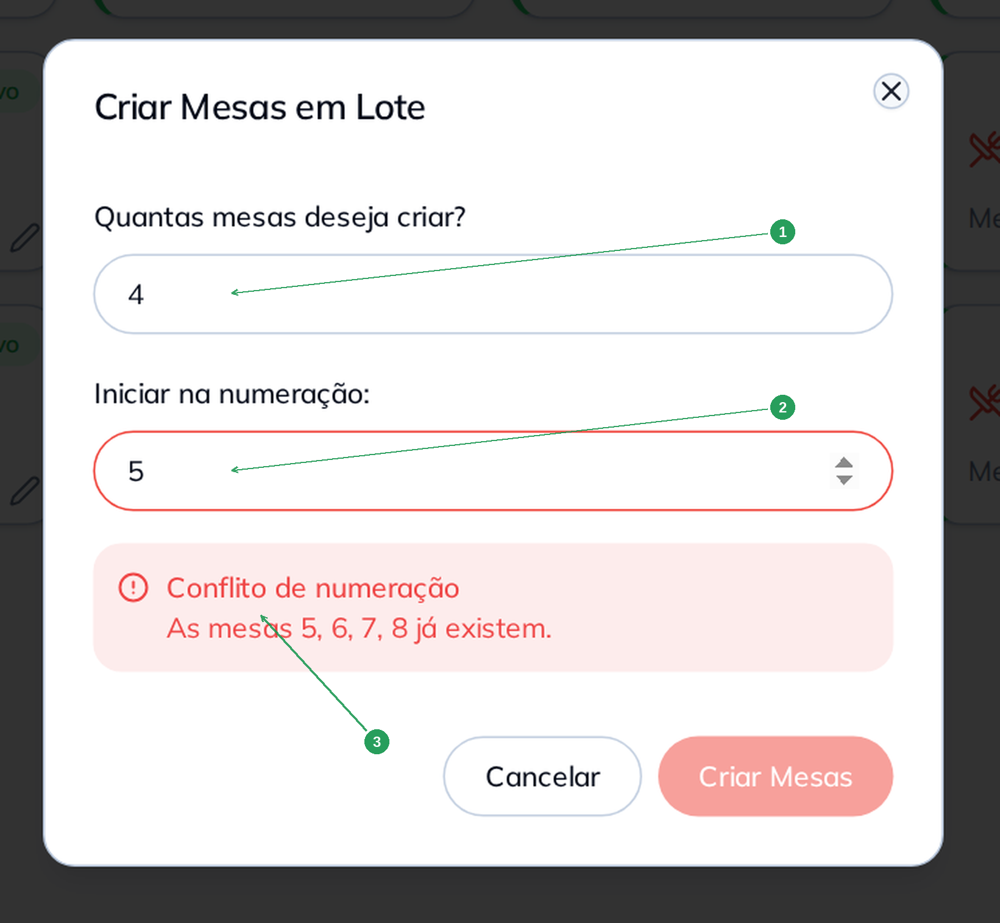

   100|| Nº | Campo | O que fazer |
|----|-------|-------------|
| 1 | **Quantas mesas deseja criar?** | De 1 a 100 por vez. |
| 2 | **Iniciar na numeração:** | O primeiro código da faixa. |
| 3 | **Conflito de numeração** | O aviso lista exatamente quais códigos já existem. Enquanto ele aparecer, o **Criar Mesas** fica desabilitado — mude o número inicial. |

Com a faixa livre, o aviso vira a previsão do que vai ser criado (1):

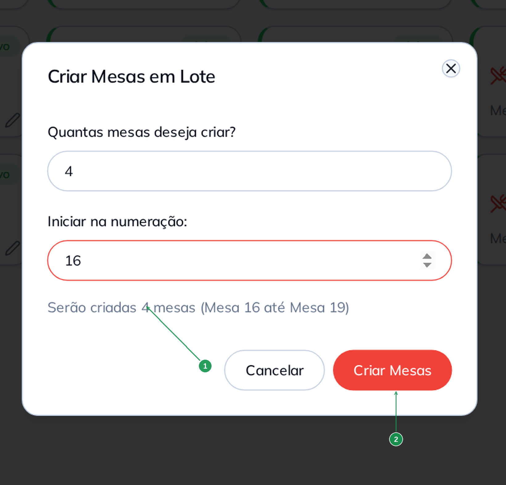

   110|| Nº | Item | O que conferir |
|----|-------|----------------|
| 1 | A previsão | Diz a primeira e a última mesa da faixa. Confira antes de clicar. |
| 2 | **Criar Mesas** | Cria a faixa inteira de uma vez. |

Terminado o lote, o contador sobe (1) e os cards novos entram no fim da lista (2):

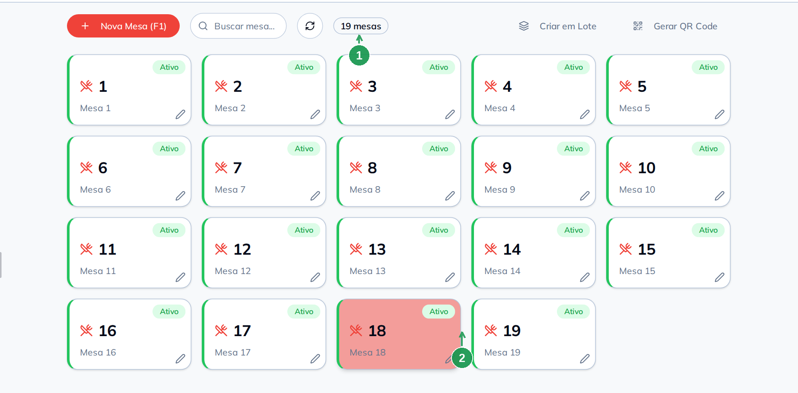

| Nº | Item | O que conferir |
   120||----|------|----------------|
| 1 | Contador | Confirma quantas mesas existem agora. |
| 2 | Os cards novos | Já nascem **Ativos** e com a descrição padrão. Renomeie os que precisam de nome próprio. |

---

## Os três tipos de QR Code

O botão **Gerar QR Code** oferece três coisas diferentes. É a parte da tela que mais gera
dúvida, então vale entender o que cada uma serve antes de imprimir:

   130|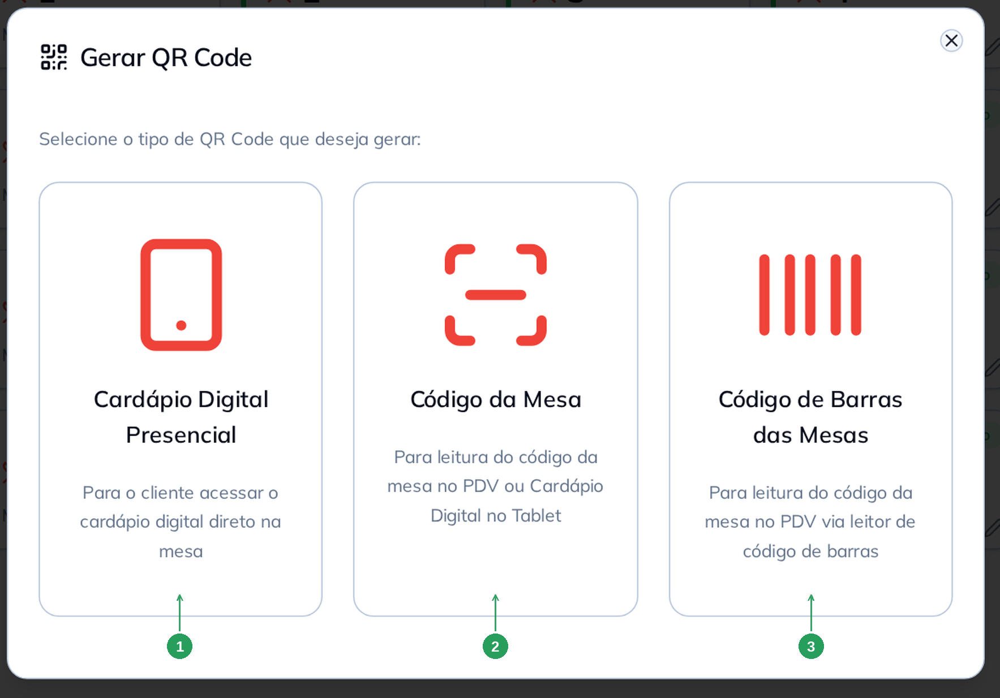

| Nº | Tipo | Para que serve | Quem lê |
|----|------|----------------|---------|
| 1 | **Cardápio Digital Presencial** | O cliente aponta a câmera e o **cardápio digital abre no celular dele**, já na mesa certa | O cliente |
| 2 | **Código da Mesa** | Identificar a mesa **dentro do BeeFood**: o operador lê o QR no PDV ou no Cardápio no Tablet e a venda já vai para aquela mesa | Você |
| 3 | **Código de Barras das Mesas** | O mesmo que o anterior, em **código de barras EAN-13**, para quem usa leitor a laser no balcão | Você |

Os três geram por **faixa** (da mesa X até a mesa Y), com **Download Todos** (um PNG por mesa) e
**Imprimir Todos** (uma folha com todos).

   140|### 1. Cardápio Digital Presencial

Escolhendo esta opção **no cadastro de mesas**, o BeeFood pergunta primeiro se você trabalha com
comanda:

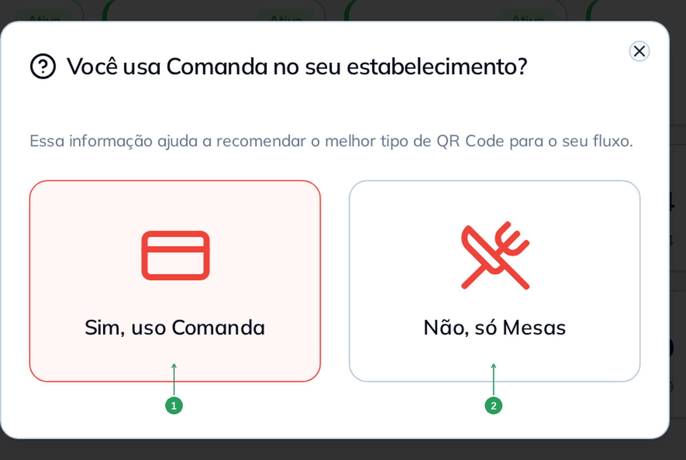

| Nº | Resposta | O que acontece |
|----|----------|----------------|
| 1 | **Sim, uso Comanda** | O sistema mostra um comparativo e **recomenda** gerar o QR Code de comanda, não de mesa. |
| 2 | **Não, só Mesas** | Segue direto para a geração dos QR Codes de mesa. |
   150|
A recomendação existe por um motivo prático: com QR Code **de mesa**, o cliente ainda escolhe a
comanda na hora do pedido — e dois clientes podem escolher a mesma. Com QR Code **de comanda**,
cada pessoa lê o código da sua comanda e o pedido cai no lugar certo.

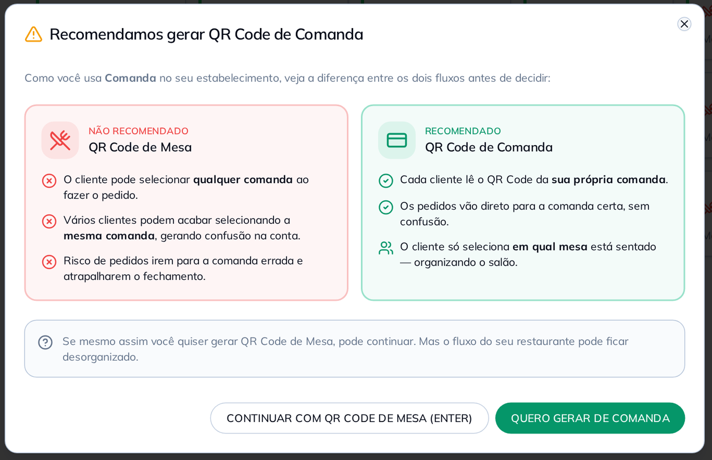

Você pode continuar com o QR de mesa pelo botão **CONTINUAR COM QR CODE DE MESA (ENTER)**, ou
aceitar a recomendação em **QUERO GERAR DE COMANDA** — que leva direto para o cadastro de
comandas, com a geração já aberta.

   160|Seguindo com mesa, informe a faixa e gere:

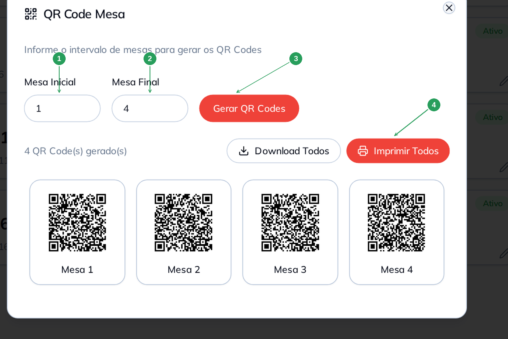

| Nº | Campo | O que fazer |
|----|-------|-------------|
| 1 | **Mesa Inicial** | Primeiro número da faixa. |
| 2 | **Mesa Final** | Último número. Máximo de **100 QR Codes** por vez. |
| 3 | **Gerar QR Codes** | Desenha os códigos na tela, um por mesa. |
| 4 | **Imprimir Todos** | Abre a folha pronta para imprimir (o **Download Todos**, ao lado, salva um PNG por mesa). |
   170|
> **Este tipo gera pela faixa, não pelo cadastro.** Se você pedir da mesa 1 até a 20 e só existirem
> 19 mesas, ele desenha 20 QR Codes. Confira a faixa antes de imprimir.

### 2. Código da Mesa

Aqui o QR **não é um endereço de internet**: é o código interno que o BeeFood entende. Serve para
o operador apontar o leitor no PDV e a venda já sair na mesa certa.

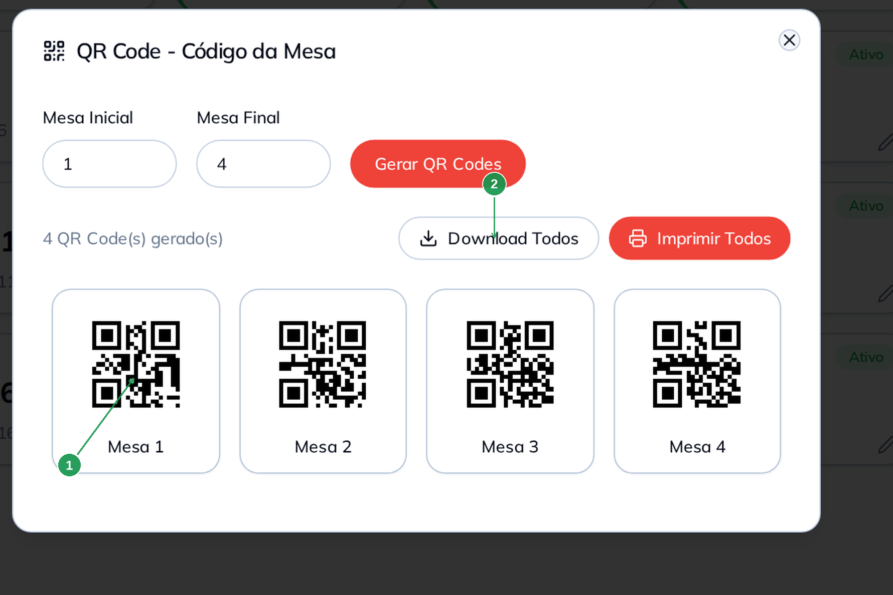

   180|| Nº | Item | O que é |
|----|------|---------|
| 1 | O QR de cada mesa | Vem com a etiqueta **Mesa N** embaixo. Diferente do tipo anterior, este só gera para mesas que **existem** no cadastro. |
| 2 | **Download Todos** | Salva um PNG por mesa, para colar no caixa ou na comanda de papel. |

### 3. Código de Barras das Mesas

Mesma função do **Código da Mesa**, em **EAN-13** — o padrão que qualquer leitor de código de
barras lê.

   190|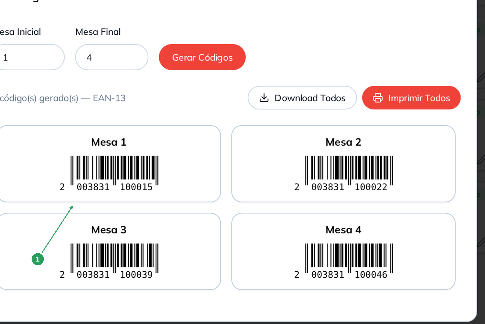

| Nº | Item | O que observar |
|----|------|----------------|
| 1 | O código de barras | Cada mesa recebe um EAN-13 exclusivo, com a etiqueta **Mesa N**. O limite é a mesa **9999**. |

---

## O que o cadastro habilita no dia a dia

   200|Cada mesa cadastrada vira um card na tela **Mesas/Comandas**:

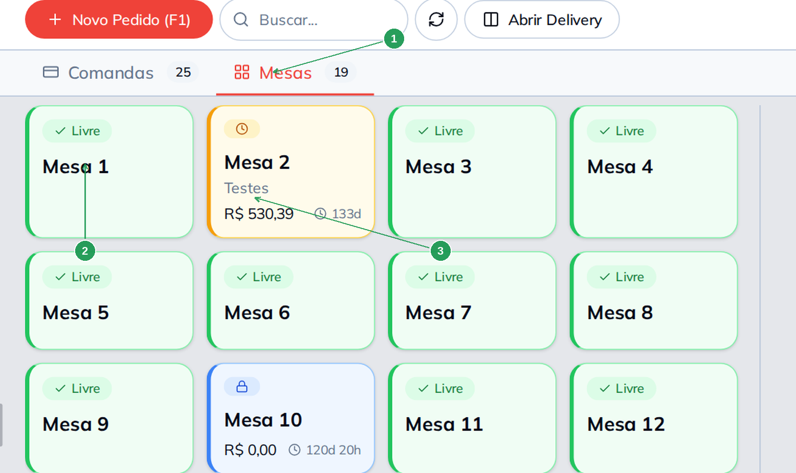

| Nº | Item | O que é |
|----|------|---------|
| 1 | Aba **Mesas** | Alterna entre mesas e comandas. O número ao lado é a contagem do cadastro. |
| 2 | Card **Livre** | Mesa cadastrada e sem venda aberta. Clique nela para começar um pedido. |
| 3 | Card **Ocupado** | Mesa com venda em andamento: mostra o valor e o tempo. |

Existe ainda o status **Fechado** (com um cadeado), que é a mesa que pediu o fechamento da conta.
   210|
> Mesa **inativa** não aparece no mapa. Se uma mesa cadastrada não apareceu aqui, confira o switch
> **Ativo** no cadastro dela.

---

## Exemplo prático: montando um salão de 19 mesas

O caminho completo, do zero até o QR Code na mesa:

   220|1. **Cadastre a primeira mesa à mão** (Nova Mesa F1) para conferir o padrão de descrição que você
   quer usar — no exemplo, `Mesa 1`.
2. **Crie o resto em lote**: quantidade 4, iniciando na 16, e o BeeFood cria da **Mesa 16** à
   **Mesa 19**. Se a faixa bater com mesas existentes, o aviso de conflito aparece antes de
   qualquer estrago.
3. **Renomeie o que precisa de nome próprio** (a mesa da varanda, o balcão) clicando no card.
4. **Gere o QR Code do Cardápio Digital Presencial** para a faixa de mesas que vai receber
   adesivo — no exemplo, da 1 à 4.
5. **Imprima a folha** e recorte: cada quadradinho já sai com o logo da loja e o nome da mesa.

   230|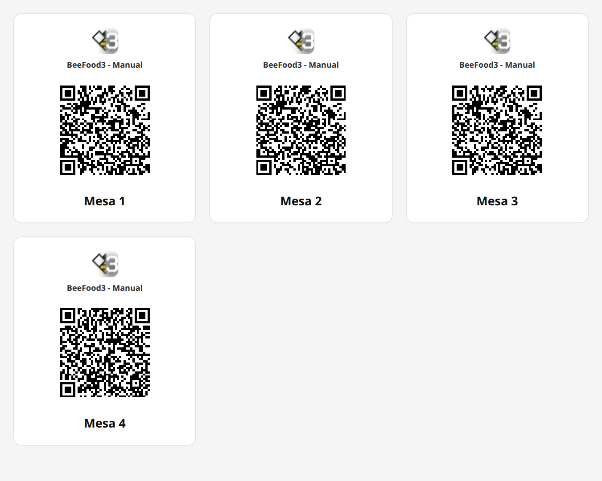

6. **Cole o adesivo na mesa.** O cliente aponta a câmera e o cardápio abre no celular dele, já
   vinculado àquela mesa:

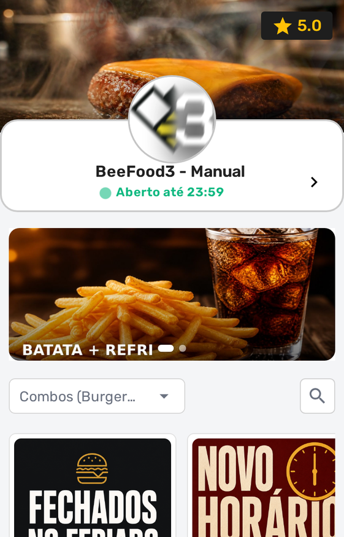

7. **Acompanhe pelo mapa do salão.** Quando o pedido entra, a mesa sai de *Livre* e passa a
   mostrar valor e tempo.

   240|---

## Resumo

1. **Cadastros → Mesas**: um card por mesa, com **código**, **descrição** e **Ativo**.
2. Para o salão inteiro, use **Criar em Lote** — ele avisa se a faixa esbarra em mesas existentes.
3. **Código** é o número que a mesa tem na parede; **descrição** é o nome que você lê na tela.
4. São **três QR Codes**: cardápio para o **cliente**, código da mesa e código de barras para
   **você**.
5. Mesa **inativa** sai do mapa do salão, mas continua no cadastro.
   250|
---

## Perguntas frequentes

**Posso ter mesa 1 e mesa 01?**
Não faz sentido: o código é numérico, então `01` e `1` são a mesma mesa. Para diferenciar
ambientes, use a **descrição** (*Varanda 1*, *Salão 1*).

**Criei mesas demais no lote. Preciso apagar uma por uma?**
   260|Sim — a exclusão é individual, pelo card. Se as mesas extras não incomodam, uma alternativa mais
rápida é **desativá-las**.

**A mesa não aparece no mapa do salão.**
Confira o switch **Ativo** no cadastro. Se estiver ligado e a mesa ainda não aparecer, atualize a
tela (o botão de atualizar, ou **F5**).

**Excluí uma mesa que tinha vendas antigas. Perdi o histórico?**
Não. As vendas já registradas continuam no Histórico de Vendas com a mesa que tinham no momento
da venda.

   270|**O QR Code que colei na mesa parou de funcionar.**
O QR do cardápio guarda o **link do seu cardápio digital** e o número da mesa. Se o link do
cardápio mudou (domínio novo, por exemplo), gere e imprima os QR Codes de novo.

**Dá para imprimir um QR Code por folha?**
A impressão sai em grade, três por linha, para economizar papel. Para um por folha, use o
**Download Todos** e imprima o PNG da mesa que você quer.

**Qual QR Code eu colo na mesa: o do cardápio ou o código da mesa?**
O do **Cardápio Digital Presencial**. O *Código da Mesa* e o *Código de Barras* são para o
   280|operador ler no balcão, não para o cliente.

**Uso comanda. Ainda preciso cadastrar mesas?**
Sim, se você controla o salão por mesa. Mas, para o QR Code que o cliente lê, o próprio sistema
recomenda o **QR Code de comanda** — veja o manual de comandas.

---

## Manuais relacionados

   290|- **Cadastrar comandas e gerar o QR Code** — o par deste manual
- **Cardápio digital presencial e QR Code** — a configuração do canal presencial e o *Meus Links*
- **Taxa e obrigatoriedades de mesa** — a taxa de serviço e as obrigatoriedades no atendimento
- **Cadastrar forma de recebimento** — como a forma de pagamento chega ao fechamento da mesa
