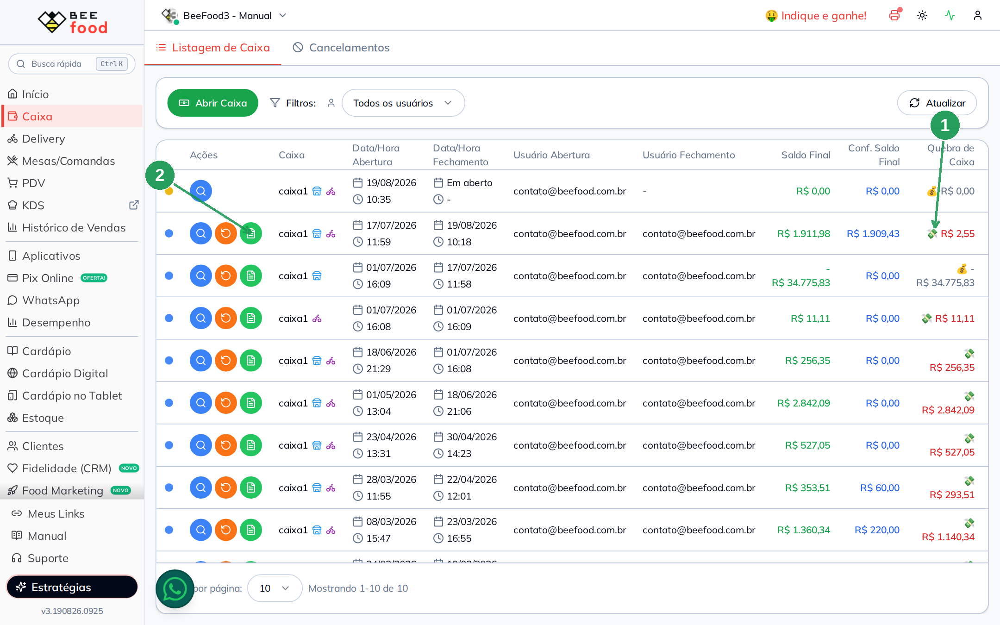
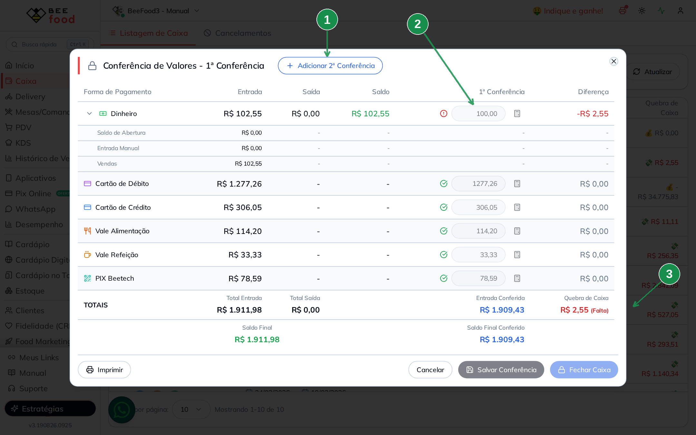
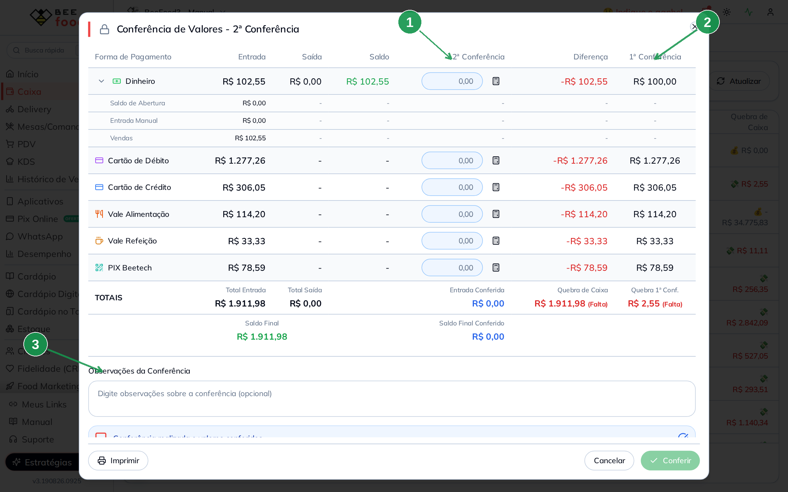
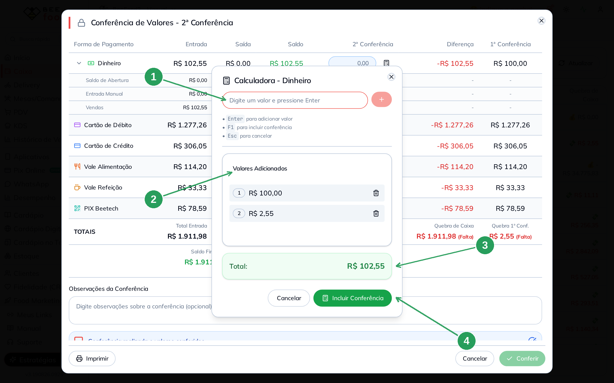
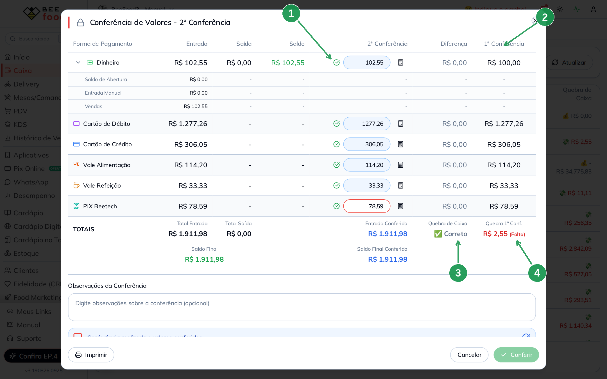
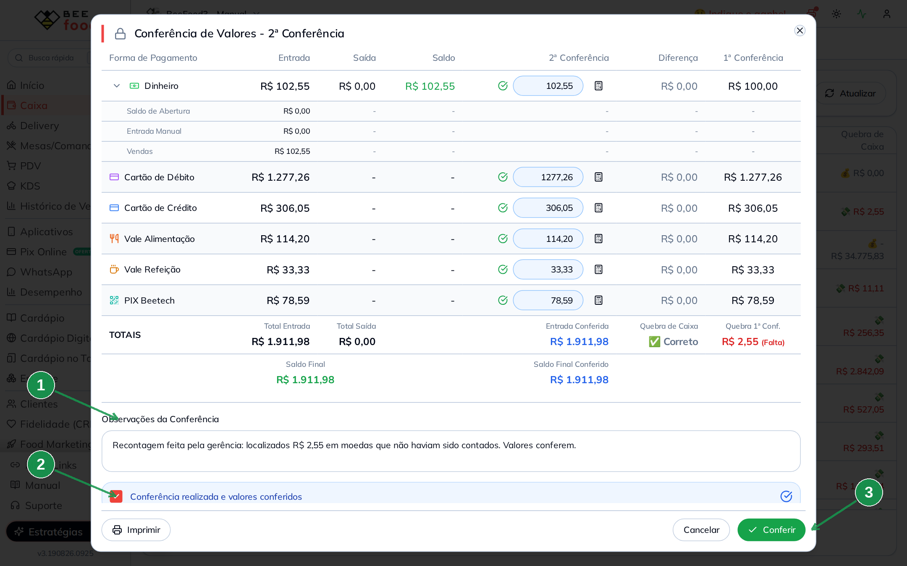
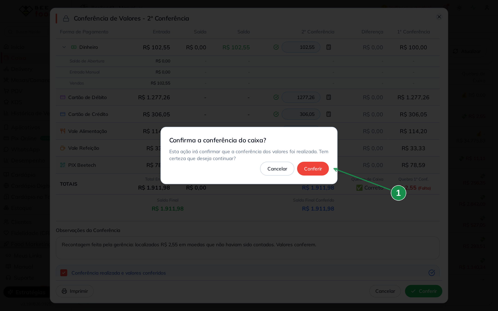
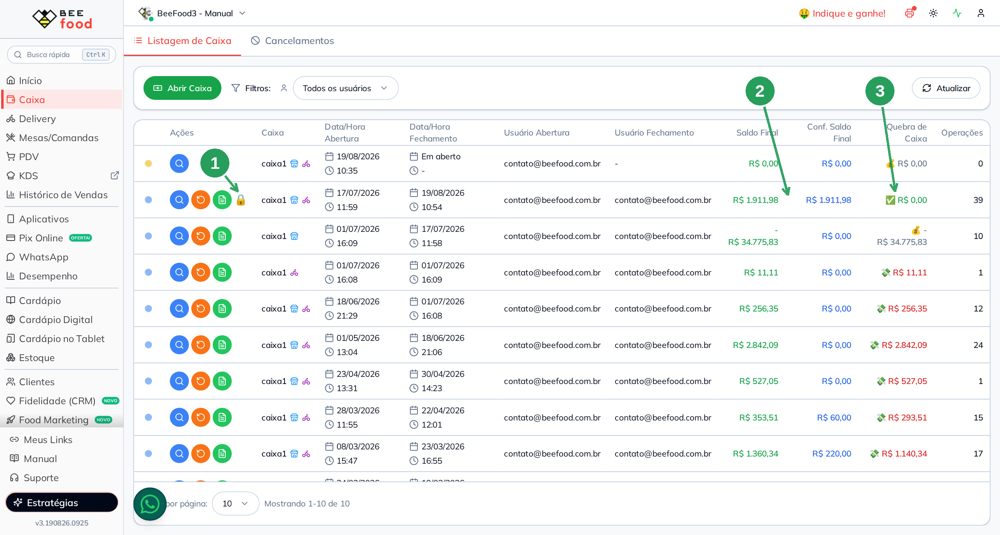
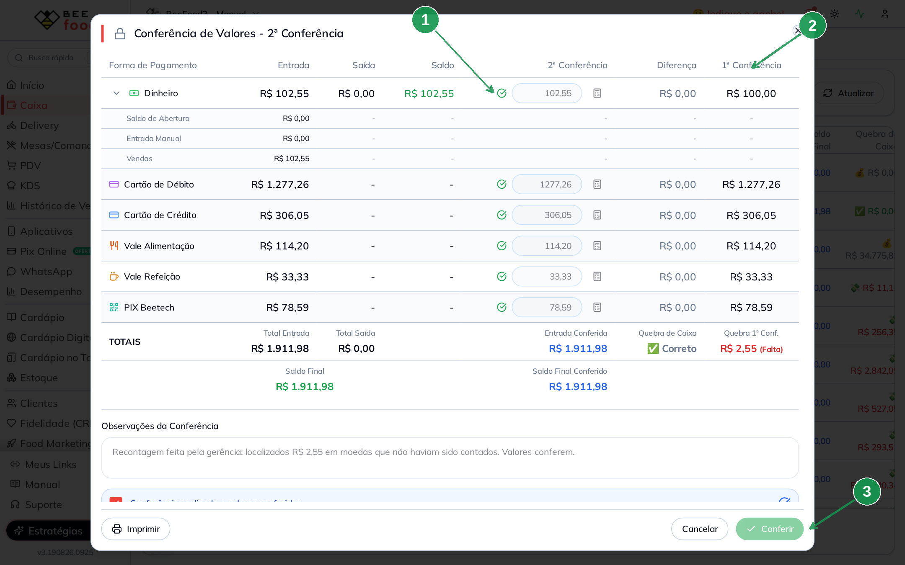

# Manual do Caixa — Segunda conferência (dupla checagem)

Este manual ensina, passo a passo, a:

1. **Abrir a conferência** de um caixa que já foi fechado
2. **Iniciar a segunda conferência** (a dupla checagem)
3. **Recontar os valores**, usando a calculadora
4. **Comparar** com a primeira conferência e resolver a **quebra de caixa**
5. **Registrar a observação** e confirmar a conferência
6. Entender **o que muda** depois de conferir

> As imagens têm **setas com números** (1, 2, 3...). No texto, cada número indica
> exatamente o campo ou botão correspondente na tela.

---

## Por que a segunda conferência importa

Quando um caixa fecha com **quebra**, a primeira pergunta costuma ser "faltou dinheiro?".
Na prática, muitas vezes **não faltou nada**: o valor estava ali e não foi contado. Cédula
grudada, moedas esquecidas no fundo da gaveta, um comprovante que ficou de fora — todos são
erros de contagem, não de caixa.

A segunda conferência existe para separar esses dois casos. Ela permite que **outra pessoa**
reconte os mesmos valores, sem apagar o que a primeira contou. Isso traz três ganhos:

- **Protege a equipe.** Uma quebra que era erro de contagem deixa de virar suspeita sobre
  quem operou o caixa.
- **Deixa registro.** As duas contagens ficam guardadas lado a lado, com observação, autor e
  data — se alguém questionar meses depois, a informação está lá.
- **Fecha o número certo.** O saldo conferido do caixa passa a refletir a recontagem, e a
  quebra some quando os valores realmente conferem.

> **Atenção:** a segunda conferência é feita **uma única vez** por caixa. Depois de confirmada,
> os valores ficam travados e não há como editar. Reconte com calma antes de confirmar.

---

## Pré-requisitos

- Ter um caixa **já fechado** (com a primeira conferência feita).
- O caixa **não pode** ter a segunda conferência concluída ainda (sem o cadeado na listagem).
- Ter permissão de acesso à conferência — se os botões não aparecem, é permissão.
- Ter em mãos o dinheiro e os comprovantes para recontar.

---

## Etapa 1 — Abrir a conferência do caixa fechado

1. No menu lateral, clique em **Caixa**.
2. Localize o caixa fechado que você quer revisar:

| Nº | Item | Descrição |
|----|------|-----------|
| 1 | **Quebra de Caixa** | A diferença registrada no fechamento (no exemplo, **R$ 2,55**). É o que vamos investigar. |
| 2 | **Ver Conferência** (botão verde) | Abre a conferência que foi feita no fechamento. |

> Também é possível chegar aqui por **Ver Caixa → VER CONFERÊNCIA**, dentro do caixa.

3. A conferência abre em **modo leitura**: você vê o que a primeira pessoa contou, sem poder
   alterar nada.

| Nº | Item | Descrição |
|----|------|-----------|
| 1 | **Adicionar 2ª Conferência** | Inicia a dupla checagem. Só aparece em caixa fechado que ainda não foi conferido. |
| 2 | **Campos travados** | Os valores da primeira conferência aparecem em cinza, sem edição. O ícone de alerta marca a linha que não bateu. |
| 3 | **Quebra de Caixa** | A diferença apurada na primeira conferência: **R$ 2,55 (Falta)**. |

---

## Etapa 2 — Iniciar a segunda conferência

Clique em **Adicionar 2ª Conferência**. O título muda para **Conferência de Valores -
2ª Conferência** e a tela ganha uma coluna nova:

| Nº | Item | Descrição |
|----|------|-----------|
| 1 | **2ª Conferência** | A coluna onde você digita a **sua** contagem. Começa em branco de propósito: a ideia é recontar sem se apoiar no valor anterior. |
| 2 | **1ª Conferência** | Mostra o que foi contado no fechamento, só para consulta. No exemplo, **R$ 100,00** de dinheiro. |
| 3 | **Observações da Conferência** | Espaço para registrar o que você encontrou. Aparece junto com a segunda conferência. |

> Enquanto os campos estão vazios, o sistema mostra a quebra como se tudo estivesse faltando.
> É normal — os números se ajustam conforme você digita.

---

## Etapa 3 — Recontar e digitar os valores

Conte novamente cada forma de pagamento e lance o resultado na coluna **2ª Conferência**.
**Enter** pula para o campo seguinte.

No dinheiro, vale usar a calculadora. No exemplo, a recontagem encontrou os **R$ 2,55** que
tinham passado batido — estavam em moedas:

| Nº | Item | O que fazer |
|----|------|-------------|
| 1 | **Digite um valor e pressione Enter** | Lance cada valor contado. Cada **Enter** adiciona à lista. |
| 2 | **Valores Adicionados** | O que já foi lançado: **R$ 100,00** (o que estava contado) e **R$ 2,55** (as moedas encontradas). A **lixeira** remove um lançamento errado. |
| 3 | **Total** | A soma da recontagem: **R$ 102,55**. |
| 4 | **Incluir Conferência** | Joga o total no campo. **F1** faz o mesmo e **Esc** cancela. |

---

## Etapa 4 — Comparar e ver a quebra resolvida

Com todos os campos preenchidos, a tela mostra as duas contagens lado a lado:

| Nº | Item | Descrição |
|----|------|-----------|
| 1 | **Valor recontado** | Com o **check verde**, indicando que a sua contagem bate com o valor apurado pelo sistema. |
| 2 | **1ª Conferência** | O que a primeira contagem registrou (**R$ 100,00**), preservado para comparação. |
| 3 | **Quebra de Caixa** | A quebra **da sua** conferência. Aqui aparece **Correto**, porque tudo bateu. |
| 4 | **Quebra 1ª Conf.** | A quebra da primeira conferência continua registrada: **R$ 2,55 (Falta)**. |

**Como ler o exemplo:** a primeira contagem apontou falta de R$ 2,55. A recontagem encontrou o
valor completo. Comparando as duas colunas fica claro que **não faltou dinheiro no caixa** — o
que houve foi uma contagem incompleta. E as duas versões continuam visíveis, sem apagar
nenhuma.

> Se a sua recontagem também não bater, a quebra permanece. Aí a diferença provavelmente é
> real e vale investigar as movimentações do caixa.

---

## Etapa 5 — Registrar a observação e confirmar

Antes de confirmar, escreva o que você encontrou e marque a declaração:

| Nº | Item | O que fazer |
|----|------|-------------|
| 1 | **Observações da Conferência** | Registre o motivo da diferença ou a conclusão da recontagem. É opcional, mas é o que explica a quebra para quem olhar depois. |
| 2 | **Conferência realizada e valores conferidos** | Marque para declarar que você realmente recontou. **Sem marcar, o botão Conferir fica bloqueado.** |
| 3 | **Conferir** | Fica verde e disponível assim que a declaração é marcada. |

Ao clicar em **Conferir**, o sistema pede a confirmação final:

| Nº | Item | Descrição |
|----|------|-----------|
| 1 | **Conferir** | Confirma a dupla checagem. **Esta ação não pode ser desfeita.** |

---

## Etapa 6 — O que muda depois de conferir

Na listagem, o caixa aparece com a conferência concluída:

| Nº | Item | Descrição |
|----|------|-----------|
| 1 | **Cadeado** | Sinaliza **segunda conferência concluída**. Passe o mouse para ver a dica. |
| 2 | **Conf. Saldo Final** | Passa a mostrar o valor da **recontagem** (**R$ 1.911,98**), no lugar do valor antigo. |
| 3 | **Quebra de Caixa** | Aparece zerada, com o check verde: a diferença foi resolvida. |

Se você abrir a conferência de novo, ela está preservada e travada:

| Nº | Item | Descrição |
|----|------|-----------|
| 1 | **Campos travados** | Nenhum valor pode ser alterado. |
| 2 | **As duas contagens** | Primeira e segunda conferência seguem registradas lado a lado. |
| 3 | **Conferir desabilitado** | O botão **Adicionar 2ª Conferência** também desaparece: não há terceira conferência. |

---

## Dicas rápidas

- **Quem confere não deve ser quem contou.** O ganho da dupla checagem vem justamente de um
  segundo olhar.
- **Reconte de verdade, do zero.** A coluna da primeira conferência está ali para comparar
  depois, não para copiar antes.
- **Escreva a observação mesmo quando fecha certo.** Um "recontado, valores conferem" resolve
  dúvidas futuras em segundos.
- **Confirme só no fim.** Depois do **Conferir** não há edição nem nova conferência; para
  mexer, seria preciso reabrir o caixa.
- **A quebra continua registrada.** Mesmo com a segunda conferência correta, o campo
  **Quebra 1ª Conf.** preserva a diferença original — o histórico não é apagado.
- **Não vê o botão de conferência?** É permissão de acesso. Fale com o responsável pelo sistema.
