# Manual do Caixa — Fechar o caixa e conferir os valores

Este manual ensina, passo a passo, a:

1. **Abrir a tela de fechamento** do caixa
2. **Resolver as vendas sem pagamento total** antes de fechar
3. **Conferir os valores** de cada forma de pagamento (1ª conferência)
4. **Entender a quebra de caixa** (falta ou sobra)
5. **Fechar o caixa** e imprimir o resumo da conferência
6. **Confirmar o resultado** na listagem de caixas

> As imagens têm **setas com números** (1, 2, 3...). No texto, cada número indica
> exatamente o campo ou botão correspondente na tela.

---

## Pré-requisitos

- Estar com a sessão iniciada no sistema (`https://beefood.app`).
- Ter um caixa **aberto** (status **Em aberto** na listagem).
- Ter em mãos o **dinheiro da gaveta contado** e os comprovantes das outras formas de
  pagamento (cartões, vales, PIX).

---

## Etapa 1 — Abrir a tela de fechamento

1. No menu lateral, clique em **Caixa**.
2. Na linha do caixa com status **Em aberto**, clique em **Ver Caixa** (ícone de lupa azul):

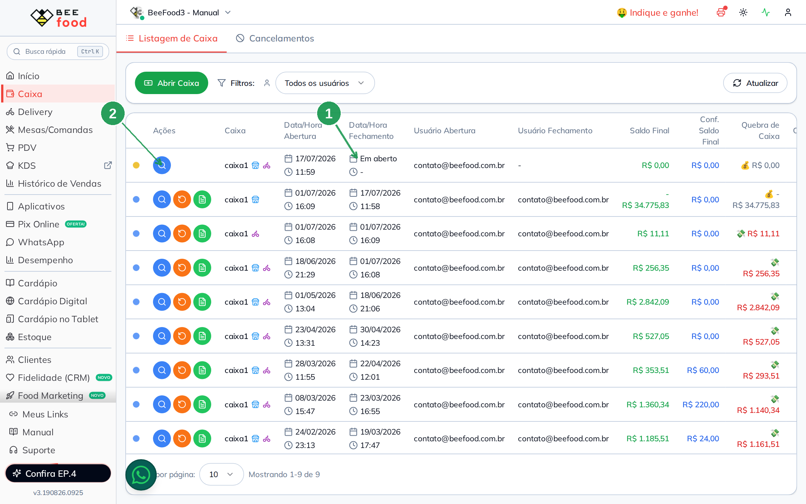

| Nº | Item | Descrição |
|----|------|-----------|
| 1 | **Em aberto** | Confirma que este é o caixa que ainda está aberto. Só é possível fechar um caixa em aberto. |
| 2 | **Ver Caixa** (lupa azul) | Abre os detalhes do caixa, de onde parte o fechamento. |

3. Dentro do caixa, clique em **FECHAR CAIXA**, no painel da direita:

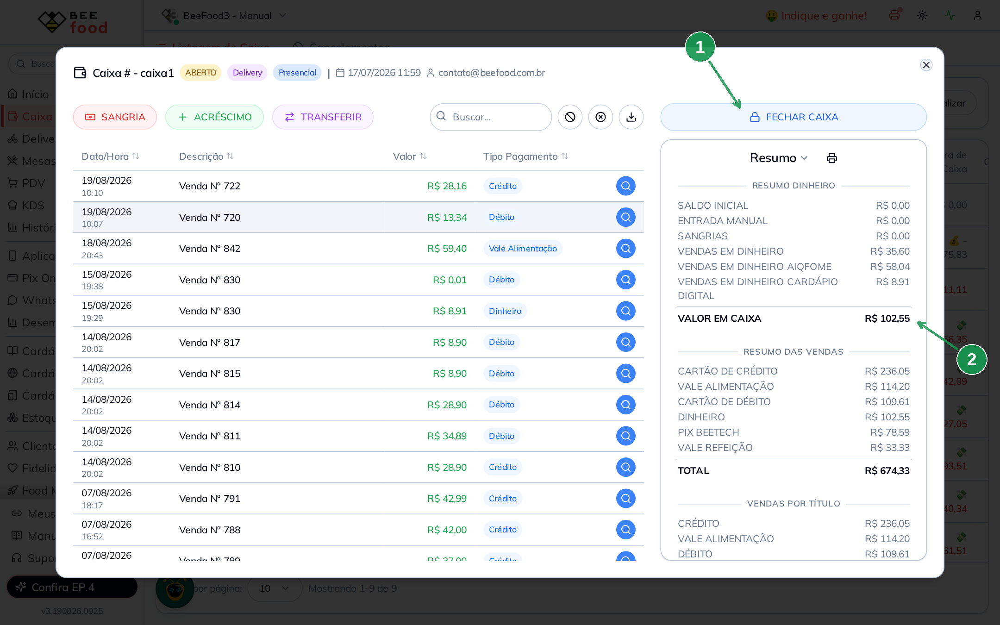

| Nº | Item | Descrição |
|----|------|-----------|
| 1 | **FECHAR CAIXA** | Inicia o fechamento. O botão mostra **VALIDANDO...** por alguns segundos, porque o sistema verifica as vendas do período antes de continuar. |
| 2 | **VALOR EM CAIXA** | É o valor de dinheiro que o sistema calculou (no exemplo, **R$ 102,55**). Guarde esse número: é com ele que você vai comparar o dinheiro contado na gaveta. |

> Não existe botão de fechar direto na listagem: o caminho é sempre **Ver Caixa → FECHAR CAIXA**.

---

## Etapa 2 — Resolver as vendas sem pagamento total

Se houver vendas do período com **valor pago menor que o valor total**, o sistema mostra
esta tela antes de deixar você conferir os valores:

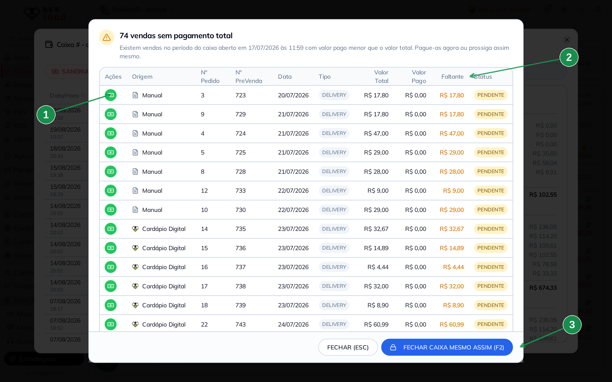

| Nº | Item | O que fazer |
|----|------|-------------|
| 1 | **Botão verde** (da linha) | Abre o pagamento daquela venda sem sair do fechamento. É o caminho recomendado. |
| 2 | **Faltante** | Quanto ainda falta receber em cada venda. |
| 3 | **FECHAR CAIXA MESMO ASSIM (F2)** | Segue para a conferência deixando as pendências como estão. Use apenas se você já sabe o motivo de cada pendência. |

### Como quitar uma venda por aqui

1. Clique no **botão verde** da linha.
2. Na janela **Conferir e Dividir**, escolha a forma de pagamento (no exemplo, **Débito**). O
   valor já vem preenchido com o que falta; confirme em **CONFIRMAR (ENTER/F1)**:

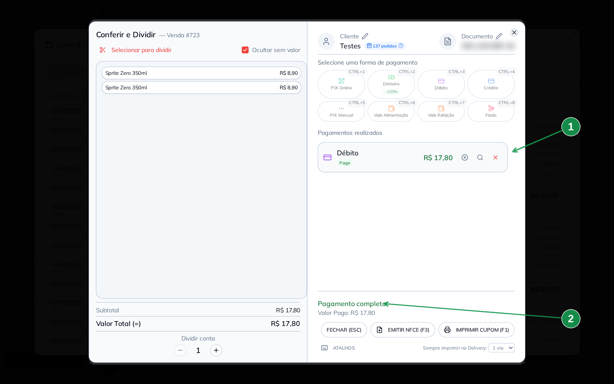

| Nº | Item | Descrição |
|----|------|-----------|
| 1 | **Pagamentos realizados** | O pagamento aparece registrado com a forma escolhida e a marca **Pago** (no exemplo, **Débito R$ 17,80**). |
| 2 | **Pagamento completo** | Confirma que a venda foi quitada por inteiro. |

3. Feche a janela em **FECHAR (ESC)**. A venda volta para a lista já resolvida:

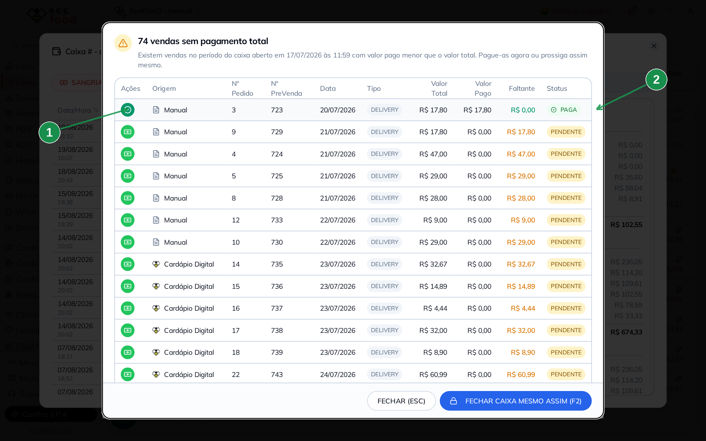

| Nº | Item | Descrição |
|----|------|-----------|
| 1 | **Botão virou um check** | Agora ele serve para **ver os pagamentos** daquela venda, não para pagar de novo. |
| 2 | **PAGA** | A linha fica verde, o **Faltante** vai para **R$ 0,00** e o status muda para **PAGA**. |

### Se você optar por fechar com pendências

Ao clicar em **FECHAR CAIXA MESMO ASSIM (F2)**, o sistema pede uma confirmação e explica
o que acontece:

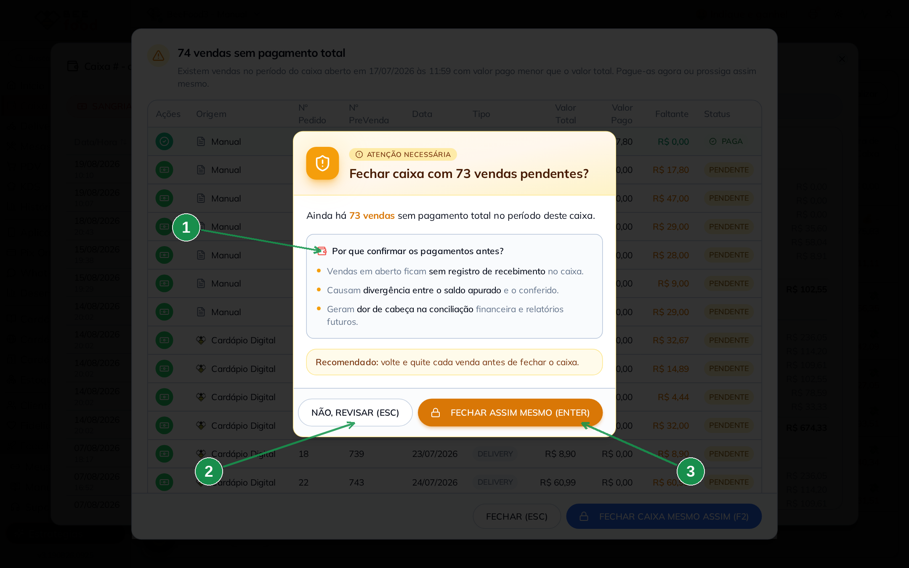

| Nº | Item | Descrição |
|----|------|-----------|
| 1 | **Por que confirmar os pagamentos antes?** | As vendas em aberto ficam **sem registro de recebimento** no caixa, causam **divergência entre o saldo apurado e o conferido** e atrapalham a **conciliação** financeira depois. |
| 2 | **NÃO, REVISAR (ESC)** | Volta para a lista para você quitar as vendas. |
| 3 | **FECHAR ASSIM MESMO (ENTER)** | Segue para a conferência mantendo as pendências. |

---

## Etapa 3 — Conferir os valores (1ª conferência)

Aqui você informa **quanto realmente tem**, forma por forma. A tela se chama
**Conferência de Valores - 1ª Conferência**:

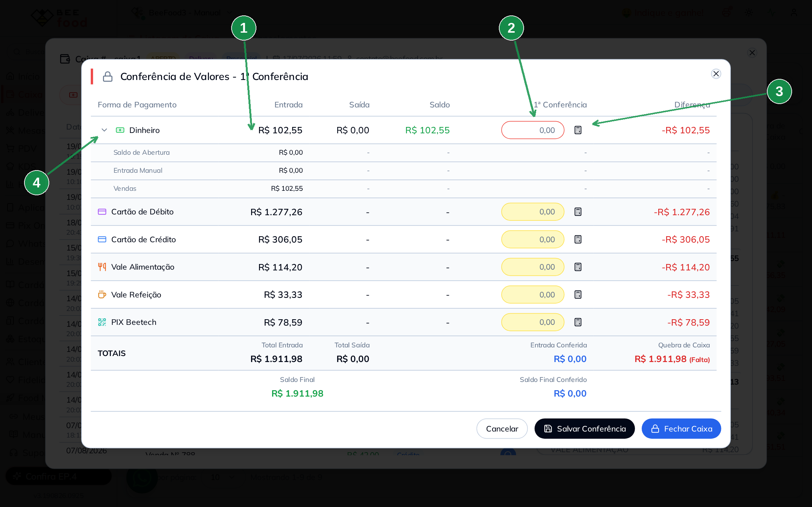

| Nº | Item | Descrição |
|----|------|-----------|
| 1 | **Entrada** | O que o sistema apurou naquela forma de pagamento. É o valor a ser comparado. |
| 2 | **1ª Conferência** | Onde você digita o valor conferido. Use **vírgula** para os centavos. **Enter** ou **Tab** pula para o campo seguinte. |
| 3 | **Calculadora** | Abre uma calculadora para somar cédulas ou comprovantes. Existe em **todas** as linhas. |
| 4 | **Seta ao lado de Dinheiro** | Abre o detalhe do dinheiro: **Saldo de Abertura**, **Entrada Manual** e **Vendas**. |

> Só aparecem as formas de pagamento que **tiveram movimento** neste caixa. Se a loja não
> recebeu em Vale Refeição, por exemplo, essa linha não é exibida.

### Usando a calculadora para contar o dinheiro

Em vez de somar de cabeça, lance cada cédula na calculadora. No exemplo foram contadas
quatro cédulas — uma de R$ 50, duas de R$ 20 e uma de R$ 10 — totalizando **R$ 100,00**:

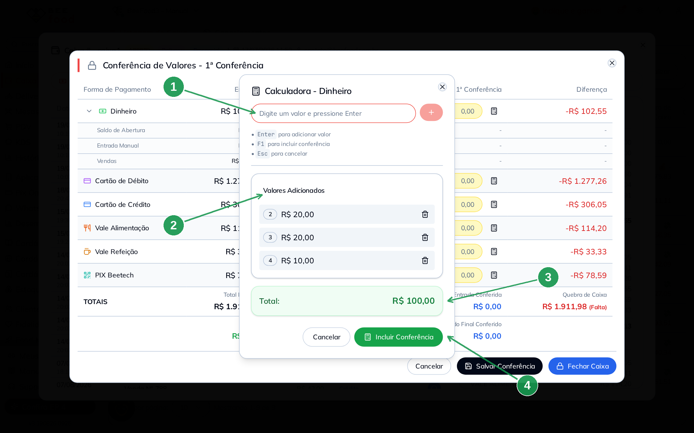

| Nº | Item | O que fazer |
|----|------|-------------|
| 1 | **Digite um valor e pressione Enter** | Lance uma cédula (ou um comprovante) por vez. Cada **Enter** adiciona o valor à lista. |
| 2 | **Valores Adicionados** | Mostra os valores lançados, numerados. A lista rola quando passa de três itens — na imagem, o primeiro lançamento (R$ 50,00) está acima da parte visível. Use a **lixeira** para remover um valor digitado errado. |
| 3 | **Total** | A soma de tudo que você lançou (**R$ 100,00**). |
| 4 | **Incluir Conferência** | Joga o total no campo da forma de pagamento. O atalho **F1** faz o mesmo, e **Esc** cancela sem aplicar. |

> Ao aplicar, o campo mostra o valor sem os centavos zerados (aparece **100** em vez de
> **100,00**). O valor considerado é o mesmo; depois de salvar, ele aparece formatado.

### Atenção ao Dinheiro

No **Dinheiro**, o sistema compara o que você contou com o **Saldo** (entradas menos saídas),
e não com a soma das vendas. Ou seja: se houve **sangria**, ela já está descontada do valor
que você precisa encontrar na gaveta.

---

## Etapa 4 — Entender os totais e a quebra de caixa

Com os campos preenchidos, a tela mostra o resultado da conferência:

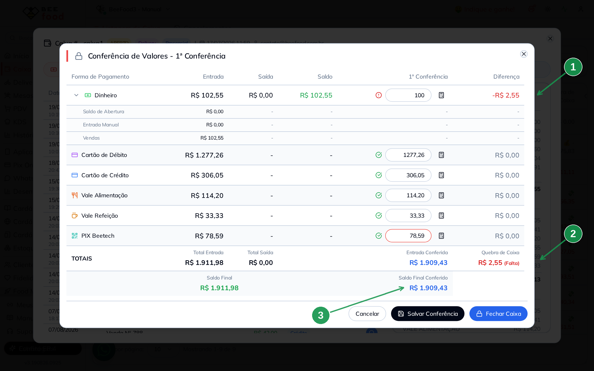

| Nº | Item | Descrição |
|----|------|-----------|
| 1 | **Diferença** | A diferença daquela linha. No exemplo, contamos **R$ 100,00** de dinheiro contra **R$ 102,55** apurados, então aparece **-R$ 2,55**. As linhas que batem ficam com **R$ 0,00** e ganham um **check verde**. |
| 2 | **Quebra de Caixa** | A diferença total do caixa, com a indicação **(Falta)** ou **(Sobra)**. No exemplo: **R$ 2,55 (Falta)**. |
| 3 | **Saldo Final Conferido** | O total que você conferiu (**R$ 1.909,43**), ao lado do **Saldo Final** apurado pelo sistema (**R$ 1.911,98**). |

**Como ler o exemplo:** o sistema apurou **R$ 1.911,98** no total. A contagem fechou em
**R$ 1.909,43** porque faltaram **R$ 2,55** em dinheiro — uma diferença pequena, típica de
troco dado errado. Todas as outras formas de pagamento conferiram exatamente.

> **Falta** significa que você encontrou menos do que o sistema apurou. **Sobra** é o
> contrário. Vale registrar o motivo com a gerência quando a diferença for relevante.

---

## Etapa 5 — Salvar sem fechar, ou fechar o caixa

No rodapé existem duas saídas diferentes:

- **Salvar Conferência** — grava os valores digitados e **mantém o caixa aberto**. Serve para
  conferir em duas etapas ou deixar a contagem pronta para outra pessoa terminar.
- **Fechar Caixa** — encerra o caixa de vez.

Se você tentar sair com valores digitados e não salvos, o sistema avisa:
*"Você possui dados de conferência não salvos"*.

Ao clicar em **Fechar Caixa**, aparece a confirmação:

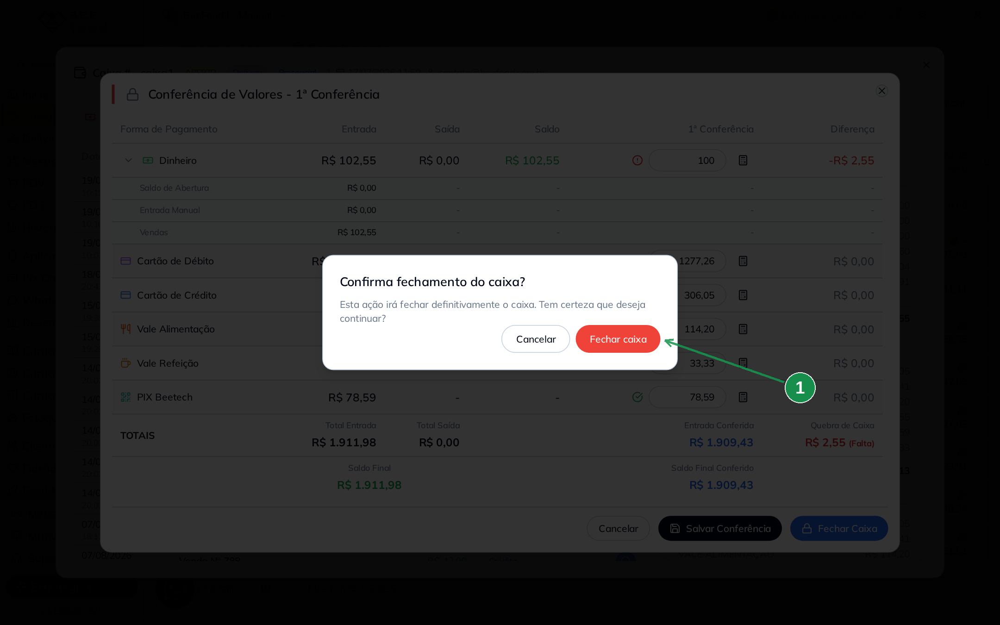

| Nº | Item | Descrição |
|----|------|-----------|
| 1 | **Fechar caixa** | Confirma o fechamento. Essa ação encerra o caixa e grava a conferência. |

Em seguida o sistema oferece a impressão do resumo:

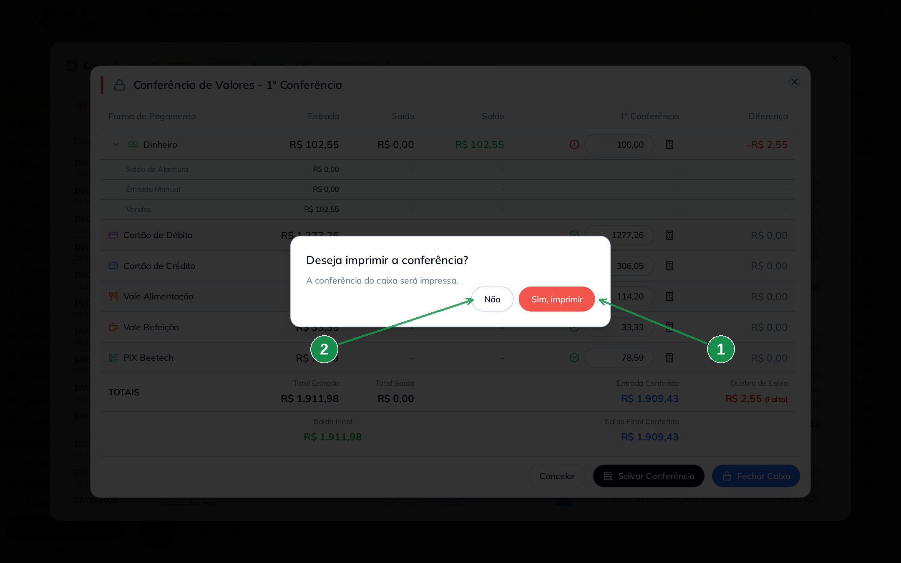

| Nº | Item | Descrição |
|----|------|-----------|
| 1 | **Sim, imprimir** | Imprime o **Resumo Conferência de Caixa**, com os valores apurados, os conferidos e a quebra. |
| 2 | **Não** | Fecha sem imprimir. O resumo continua disponível depois, pelo botão de impressão dentro do caixa. |

---

## Etapa 6 — Confirmar o resultado na listagem

De volta à listagem, o caixa aparece fechado e com o resultado da conferência:

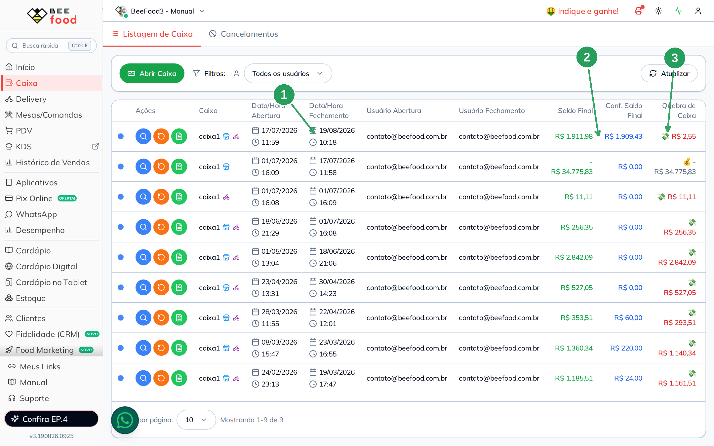

| Nº | Item | Descrição |
|----|------|-----------|
| 1 | **Data/Hora Fechamento** | Passa a exibir quando o caixa foi fechado (no exemplo, **19/08/2026 10:18**). |
| 2 | **Conf. Saldo Final** | O total que foi conferido (**R$ 1.909,43**). |
| 3 | **Quebra de Caixa** | A diferença registrada no fechamento (**R$ 2,55**). |

---

## Dicas rápidas

- **Conte antes de abrir a tela.** Tenha o dinheiro e os comprovantes separados; a conferência
  fica bem mais rápida.
- **Use a calculadora em todas as linhas**, não só no dinheiro: ela também soma as notinhas e
  os comprovantes de cartão e vale.
- **Enter é seu amigo:** ele pula de um campo para o outro na ordem das formas de pagamento.
- **Quitou as vendas pendentes?** Fechar com pendências não trava o sistema, mas deixa a
  conciliação confusa depois.
- **Fechou por engano?** Um caixa fechado pode ser reaberto pelo botão **Reabrir Caixa** na
  listagem, se o seu usuário tiver essa permissão.
- **Não vê os botões de conferência ou de reabrir?** Eles dependem de permissão no perfil de
  acesso. Fale com o responsável pelo sistema.
- **Deu diferença?** O caixa fechado permite uma **segunda conferência**, feita por outra
  pessoa, para recontar os valores e resolver a quebra.
