# Manual do Caixa — Restrições por grupo de acesso

Este manual mostra **todas as restrições de caixa** que você pode aplicar a um usuário do
BeeFood e, para cada uma, **como configurar** e **como o caixa fica** depois.

São sete restrições, em três lugares diferentes do sistema:

1. **Abrir e Fechar Caixa** — tira o caixa inteiro do usuário
2. **Visualizar Valores de Referência** — esconde os valores e cria a *conferência cega*
3. **Visualizar Caixas Fechados** — deixa só o caixa aberto à vista
4. **Transferência de Operações** — tira o TRANSFERIR e o histórico de cancelamentos
5. **Cadastro de Caixas** — esconde o cadastro dos terminais
6. **Função Gerente** — controla a aba **Cancelamentos**
7. **Usuário Fixo** — faz cada pessoa ver **só o próprio caixa**

> As imagens têm **setas com números** (1, 2, 3...). No texto, cada número indica exatamente o
> campo ou botão correspondente na tela.

---

## Por que restringir o caixa

Nem todo mundo que opera o caixa precisa ver tudo o que há nele. Um operador precisa receber
pagamentos e fechar o turno; não precisa saber quanto os outros caixas fecharam no mês passado,
nem transferir operações entre eles.

As restrições servem a três objetivos práticos:

- **Reduzir erro.** Menos botões na tela é menos chance de alguém clicar no que não devia.
- **Proteger informação.** Faturamento, saldos e histórico de quebras não precisam circular.
- **Conferência honesta.** Escondendo os valores esperados, a contagem do dinheiro deixa de ser
  "copiar o número da tela" e passa a ser contagem de verdade.

---

## Onde tudo se configura

As sete restrições ficam em três telas:

| O que | Onde |
|-------|------|
| Restrições 1, 2, 3, 4 e 5 | **Configuração → Usuários → aba Grupos de Acesso** |
| Restrição 6 (Função Gerente) | **Configuração → Usuários → aba Usuários**, no cadastro da pessoa |
| Restrição 7 (Usuário Fixo) | **Configuração → Caixa**, no cadastro do terminal |

O grupo de acesso vale para **todas as pessoas daquele grupo**. Ao mexer num switch, você está
mexendo em todo mundo que usa esse grupo.

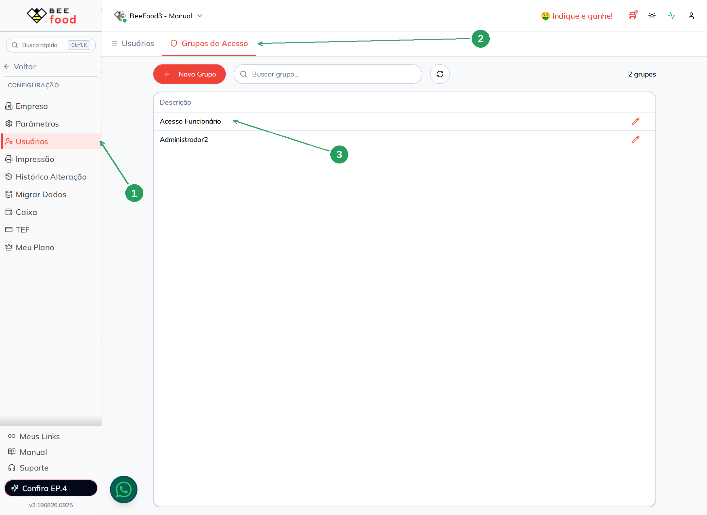

| Nº | Item | O que fazer |
|----|------|-------------|
| 1 | Menu **Usuários** | Em Configuração, no menu lateral. |
| 2 | Aba **Grupos de Acesso** | Alterna entre a lista de pessoas e a lista de grupos. |
| 3 | O grupo | Clique no nome do grupo para abrir as permissões dele. |

---

## Antes de começar — três avisos importantes

**1. Cada switch salva na hora.** Não existe "salvar tudo no final". No instante em que você
clica, a permissão já mudou para todo o grupo. O botão **Salvar** do rodapé serve apenas para o
campo **Descrição** do grupo.

**2. A mudança pode demorar até um minuto para valer.** O sistema guarda as permissões em
memória por cerca de um minuto. Se você desligar algo e a tela do funcionário continuar igual,
espere um pouco e peça para ele **sair e entrar de novo** — o aplicativo também guarda uma cópia
das permissões no navegador.

**3. Nunca desligue "Usuários" no seu próprio grupo.** É a permissão que dá acesso a esta tela.
Se você desligar, perde o caminho de volta e não há como religar por dentro do sistema.

> **O usuário Principal não é exceção.** Muita gente supõe que o dono da conta ignora as
> restrições do grupo. Não ignora. Se você desligar uma permissão no grupo que é o seu, ela
> some da **sua** tela também. Para testar o efeito de uma restrição, prefira usar um usuário
> de teste em um grupo separado.

---

## O caixa completo — o ponto de partida

Guarde esta tela na cabeça: é o caixa de quem tem **todas** as permissões. Todas as comparações
deste manual são contra ela.

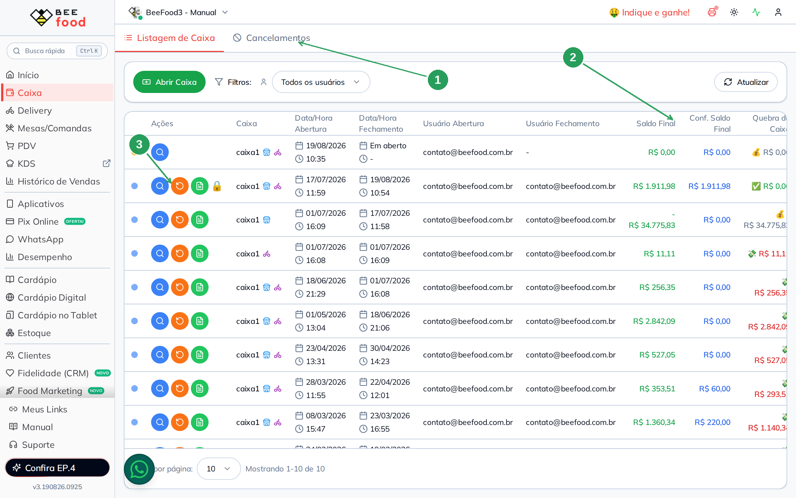

| Nº | Item | O que é |
|----|------|---------|
| 1 | Aba **Cancelamentos** | Histórico de itens cancelados e excluídos nos caixas. |
| 2 | **Saldo Final**, **Conf. Saldo Final** e **Quebra de Caixa** | As três colunas de dinheiro. |
| 3 | Botões de ação | Ver caixa (lupa), reabrir, resumo e o cadeado da segunda conferência. |

E este é o caixa por dentro, também com tudo liberado:

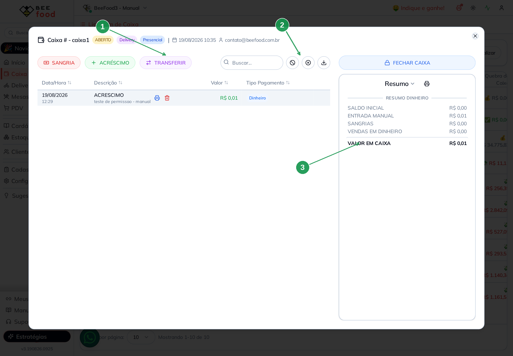

| Nº | Item | O que é |
|----|------|---------|
| 1 | **TRANSFERIR** | Move operações de um caixa para outro. |
| 2 | Ícones de **Cancelamentos** e **Excluídos** | Ao lado da busca, mostram o que foi cancelado ou apagado neste caixa. |
| 3 | Painel **Resumo** | Saldo inicial, entradas, sangrias e o valor em caixa. |

---

## Restrição 1 — Abrir e Fechar Caixa

É a restrição mais ampla: sem ela, **o caixa deixa de existir** para o usuário.

### Como configurar

No modal do grupo, procure por **caixa** no campo de busca. O item **Abrir e Fechar Caixa**
aparece na seção **Venda**.

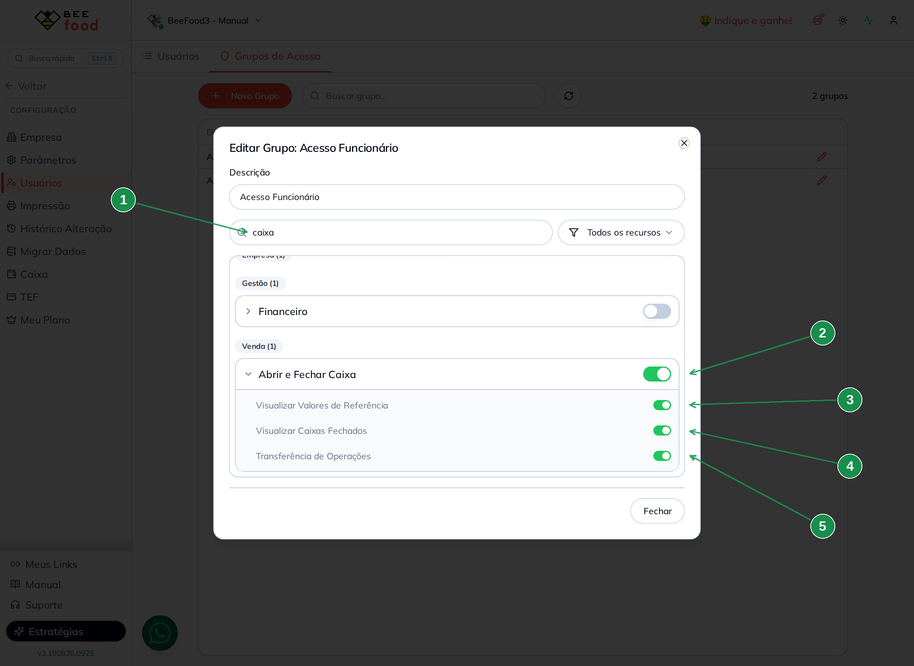

| Nº | Item | O que faz |
|----|------|-----------|
| 1 | **Buscar permissão...** | Digite `caixa` para filtrar. Veja o aviso logo abaixo desta tabela. |
| 2 | **Abrir e Fechar Caixa** | A permissão principal (restrição 1). |
| 3 | **Visualizar Valores de Referência** | Sub-item (restrição 2). |
| 4 | **Visualizar Caixas Fechados** | Sub-item (restrição 3). |
| 5 | **Transferência de Operações** | Sub-item (restrição 4). |

> **Cuidado com a busca.** Ela esconde os sub-itens quando o texto não casa com o nome deles.
> Se você buscar exatamente **"Abrir e Fechar"**, os três sub-itens **não aparecem** — parece
> que não existem. Busque **"caixa"**, que casa com os quatro, e clique na setinha (`>`) à
> esquerda do nome para expandir.

Para aplicar a restrição, desligue o switch **2**.

### Como fica o caixa

O menu **Caixa** simplesmente desaparece do menu lateral. E digitar o endereço direto não
adianta: o sistema devolve o usuário para a tela inicial.

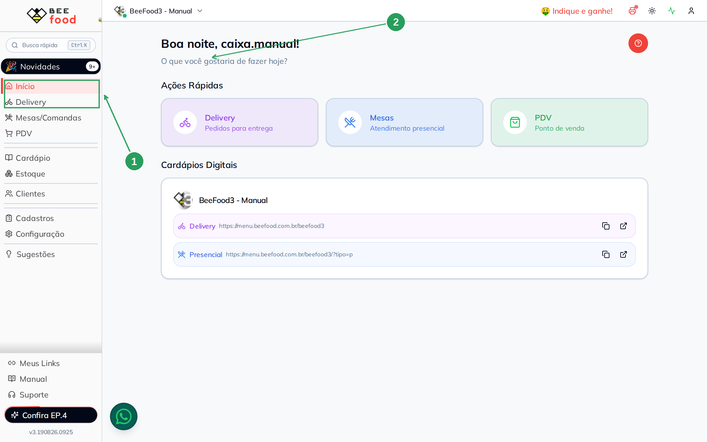

| Nº | Item | O que observar |
|----|------|----------------|
| 1 | O vão no menu | Onde havia **Caixa**, entre **Início** e **Delivery**, agora não há nada. |
| 2 | A saudação | Confirma que é a tela do funcionário restrito, não a sua. |

> Os três sub-itens (restrições 2, 3 e 4) só fazem sentido com esta permissão **ligada**. Se
> você desligar a principal, os sub-itens ficam sem efeito — não há mais caixa para restringir.

---

## Restrição 2 — Visualizar Valores de Referência

A restrição mais interessante do manual. Ela mantém o caixa funcionando, mas **apaga todos os
valores** que o sistema calcularia sozinho.

### Como configurar

Na mesma tela da restrição anterior, desligue o switch **3** da imagem do modal do grupo:
**Visualizar Valores de Referência**.

### Como fica o caixa — 1. a listagem perde as colunas de dinheiro

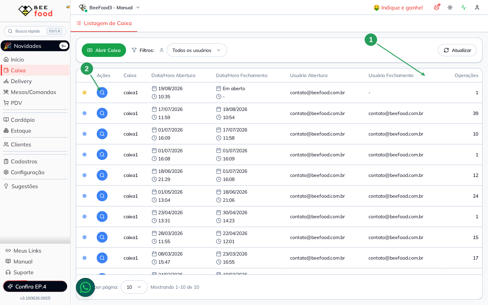

| Nº | Item | O que observar |
|----|------|----------------|
| 1 | O fim da tabela | **Saldo Final**, **Conf. Saldo Final** e **Quebra de Caixa** sumiram. Sobrou **Operações**. |
| 2 | Coluna **Ações** | Só restou a lupa. Os botões de reabrir, resumo e conferência foram embora. |

### Como fica o caixa — 2. o Resumo fica vazio

Dentro do caixa, o painel da direita não mostra mais nada.

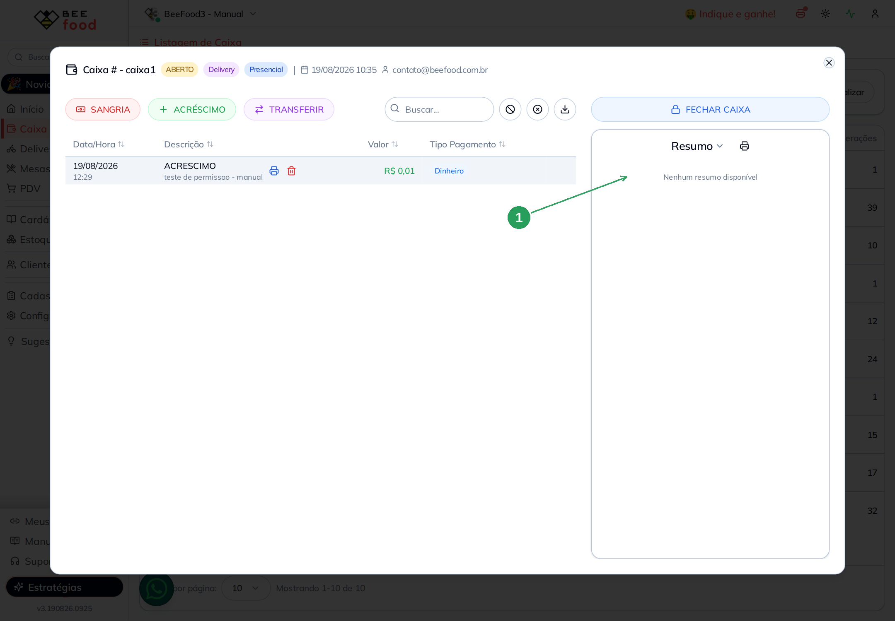

| Nº | Item | O que observar |
|----|------|----------------|
| 1 | **Nenhum resumo disponível** | Saldo inicial, entradas, sangrias e valor em caixa deixam de aparecer. |

### Como fica o caixa — 3. a conferência cega

Este é o efeito que dá nome à restrição. Compare as duas telas de fechamento.

**Com a permissão ligada**, quem fecha vê o que o sistema esperava e o que foi contado, lado a
lado:

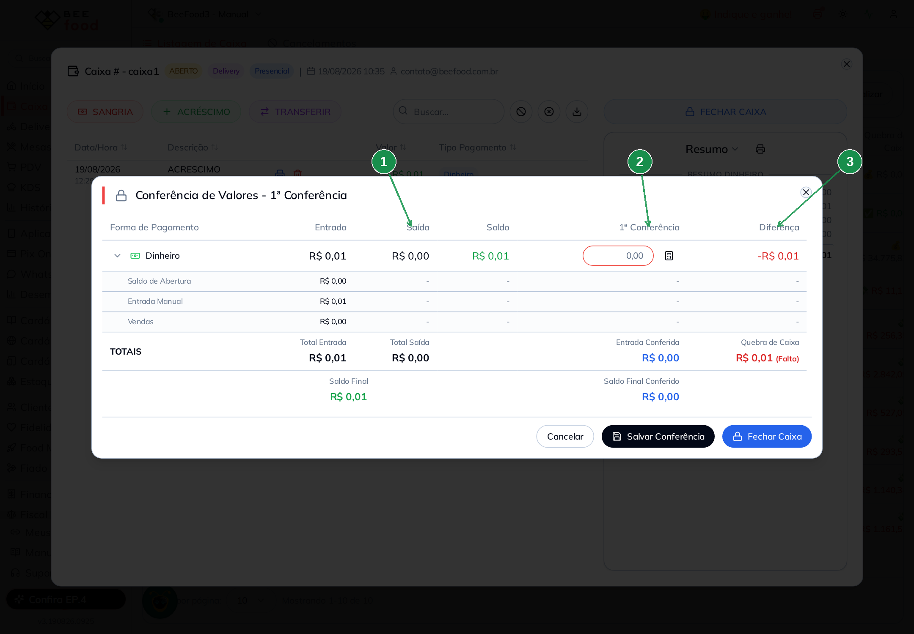

| Nº | Coluna | O que mostra |
|----|--------|--------------|
| 1 | **Entrada**, **Saída** e **Saldo** | O que o sistema registrou no turno. |
| 2 | **1ª Conferência** | O campo onde se digita o que foi contado. |
| 3 | **Diferença** | A quebra, calculada na hora. |

**Com a permissão desligada**, sobra só o campo de digitar:

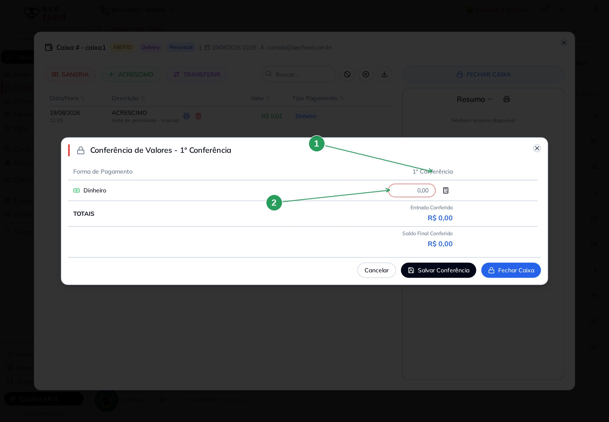

| Nº | Item | O que observar |
|----|------|----------------|
| 1 | O cabeçalho | Restaram **Forma de Pagamento** e **1ª Conferência**. Entrada, Saída, Saldo e Diferença sumiram. |
| 2 | O campo de conferência | O operador digita o que contou **sem saber** quanto o sistema esperava. |

> **Para que serve.** A conferência deixa de ser uma cópia do número da tela e passa a ser uma
> contagem de verdade. A quebra continua sendo calculada e registrada normalmente — só quem
> está contando é que não a vê. O gerente confere depois, com os valores à vista.

---

## Restrição 3 — Visualizar Caixas Fechados

Limita a listagem ao presente: o usuário só enxerga o caixa que está aberto agora.

### Como configurar

Desligue o switch **4** da imagem do modal do grupo: **Visualizar Caixas Fechados**.

### Como fica o caixa

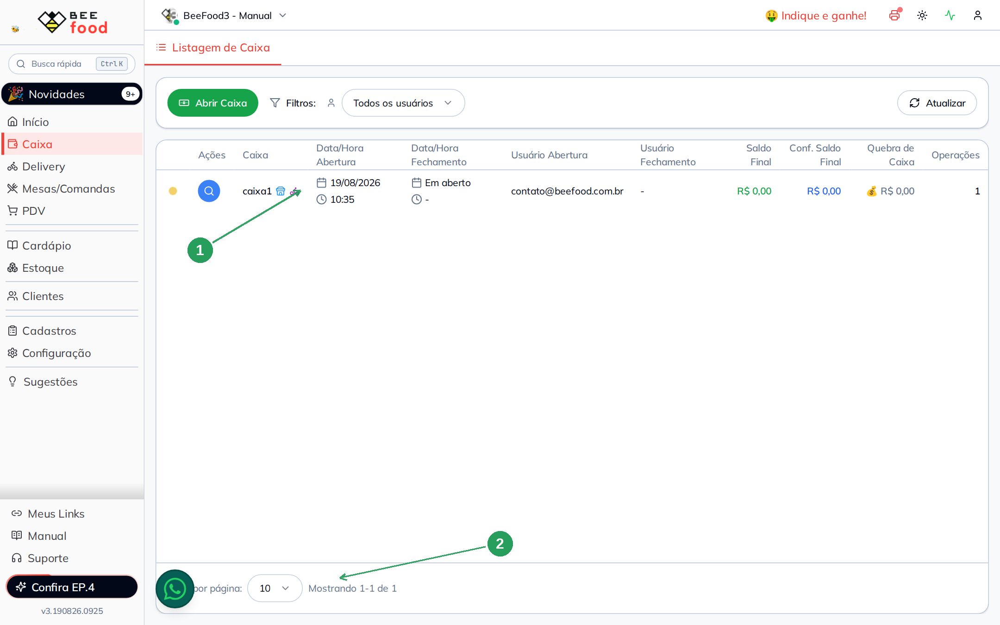

| Nº | Item | O que observar |
|----|------|----------------|
| 1 | A única linha | Apenas o caixa **Em aberto**. Todo o histórico saiu da lista. |
| 2 | O rodapé | De "Mostrando 1-10 de 10" para **"Mostrando 1-1 de 1"**. |

> Os caixas fechados não são apagados nem alterados — apenas deixam de ser listados para quem
> não tem a permissão. Quem tem continua vendo tudo.

---

## Restrição 4 — Transferência de Operações

Esta restrição faz mais do que o nome sugere.

### Como configurar

Desligue o switch **5** da imagem do modal do grupo: **Transferência de Operações**.

### Como fica o caixa

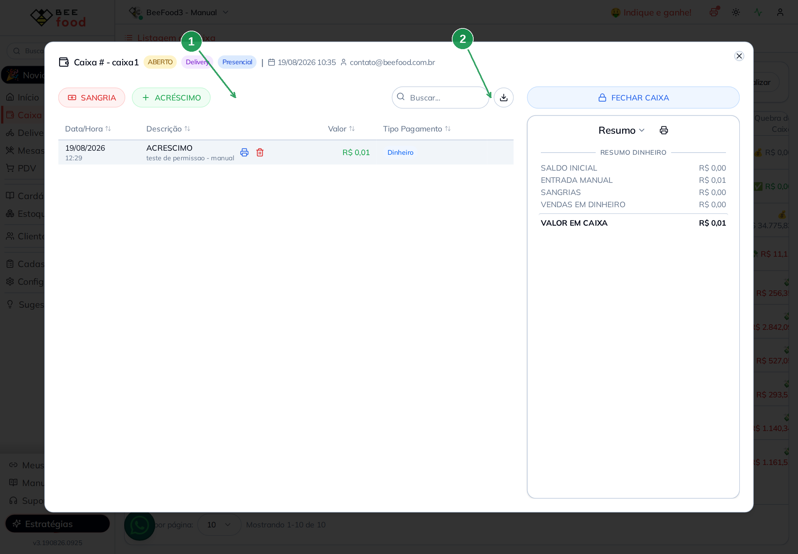

| Nº | Item | O que observar |
|----|------|----------------|
| 1 | Depois de **ACRÉSCIMO** | O botão **TRANSFERIR** desapareceu. |
| 2 | Ao lado da busca | Os ícones de **Cancelamentos** e **Excluídos** também sumiram. Sobrou só o de baixar. |

> **Ela também tranca a ação, não só esconde o botão.** Mesmo que alguém consiga chegar à
> transferência por outro caminho, o sistema recusa e responde *"Usuário sem permissão para
> realizar transferências no caixa"*.

> **Sangria e Acréscimo continuam liberados.** Não existe hoje uma permissão separada para
> eles: quem pode abrir e fechar o caixa pode lançar sangria e acréscimo. Se você precisa
> impedir essas operações, a única saída atual é tirar a restrição 1 inteira.

---

## Restrição 5 — Cadastro de Caixas

Controla o acesso ao cadastro dos terminais, em **Configuração → Caixa** — a tela onde se cria,
renomeia e ativa cada caixa.

### Como configurar

Ainda no modal do grupo, busque por **cadastro de caixas**. O item fica na seção **Empresa**.

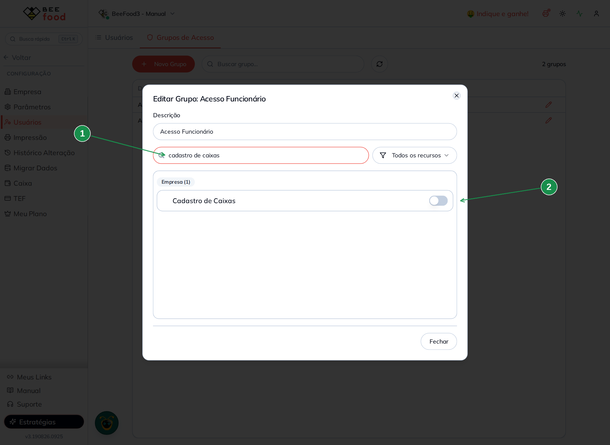

| Nº | Item | O que fazer |
|----|------|-------------|
| 1 | **Buscar permissão...** | Digite `cadastro de caixas`. |
| 2 | **Cadastro de Caixas** | Desligue para esconder a tela. |

### Como fica o caixa

O item **Caixa** some do menu Configuração. Compare o antes e o depois:

| Nº | Item | O que observar |
|----|------|----------------|
| 1 | **Caixa** | Entre **Migrar Dados** e **TEF**. |

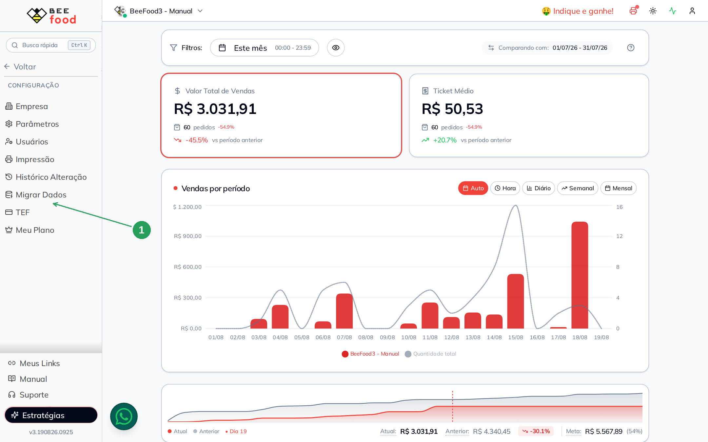

| Nº | Item | O que observar |
|----|------|----------------|
| 1 | O vão | O item sumiu, e **Migrar Dados** passou a ficar colado em **TEF**. |

> Esta restrição **não afeta o dia a dia do caixa**: o usuário continua abrindo, recebendo e
> fechando normalmente. Ela só impede que ele mexa na configuração dos terminais.

---

## Restrição 6 — Função Gerente

A Função Gerente não fica no grupo de acesso: é uma marcação no cadastro de cada pessoa. No
caixa, ela controla a aba **Cancelamentos**.

### Como configurar

Em **Configuração → Usuários**, aba **Usuários**, clique na linha da pessoa.

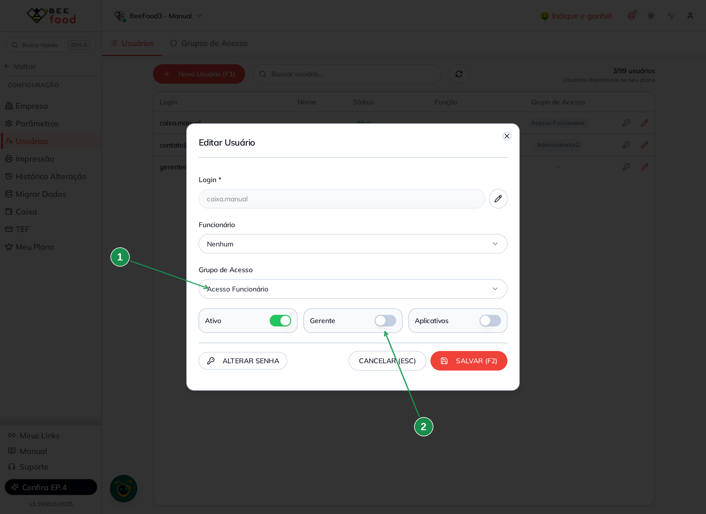

| Nº | Item | O que fazer |
|----|------|-------------|
| 1 | **Grupo de Acesso** | Define quais permissões a pessoa herda (restrições 1 a 5). |
| 2 | **Gerente** | Ligue ou desligue a função. Aqui é preciso clicar em **SALVAR (F2)**. |

### Como fica o caixa

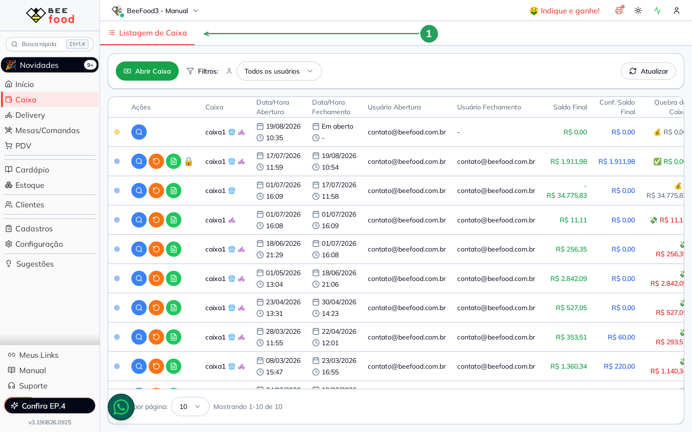

| Nº | Item | O que observar |
|----|------|----------------|
| 1 | A barra de abas | Só **Listagem de Caixa**. A aba **Cancelamentos** não existe para quem não é gerente. |

> Repare que o resto da tela está completo: todas as colunas, todos os botões. A única diferença
> em relação ao caixa completo é a aba que falta.

> **A aba Cancelamentos exige três coisas ao mesmo tempo:** a Função Gerente **e** a permissão
> *Visualizar Valores de Referência* **e** a permissão *Visualizar Caixas Fechados*. Se qualquer
> uma das três estiver faltando, a aba não aparece. Ou seja: as restrições 2 e 3 também derrubam
> os Cancelamentos, mesmo em quem é gerente.

---

## Restrição 7 — Cada usuário vê só o seu caixa

Esta é a restrição que mais gera confusão, porque **não é onde as pessoas procuram**. Ela mora
no cadastro do terminal, no campo **Usuário Fixo**.

### Como configurar

Vá em **Configuração → Caixa**.

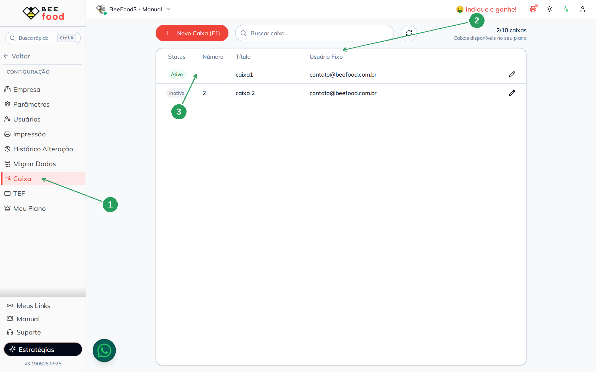

| Nº | Item | O que fazer |
|----|------|-------------|
| 1 | Menu **Caixa** | Dentro de Configuração. |
| 2 | Coluna **Usuário Fixo** | Mostra a quem cada terminal está vinculado. |
| 3 | A linha do caixa | Clique nela para editar. |

No modal, escolha a pessoa em **Usuário Fixo** e salve.

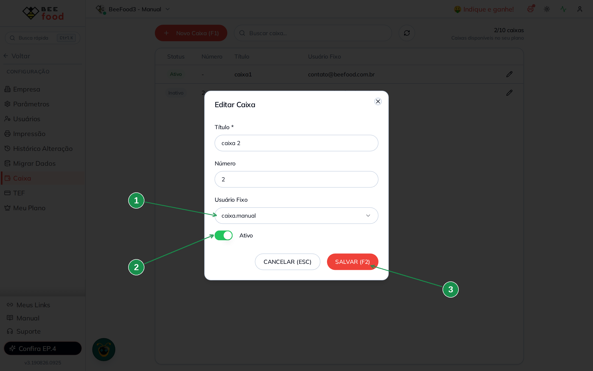

| Nº | Campo | O que fazer |
|----|-------|-------------|
| 1 | **Usuário Fixo** | Escolha a pessoa. **Nenhum** deixa o caixa livre para qualquer um. |
| 2 | **Ativo** | O terminal precisa estar ativo para ser usado na abertura. |
| 3 | **SALVAR (F2)** | Grava. |

### Como fica o caixa

A partir daí, essa pessoa passa a ver **somente os caixas que ela mesma abriu**.

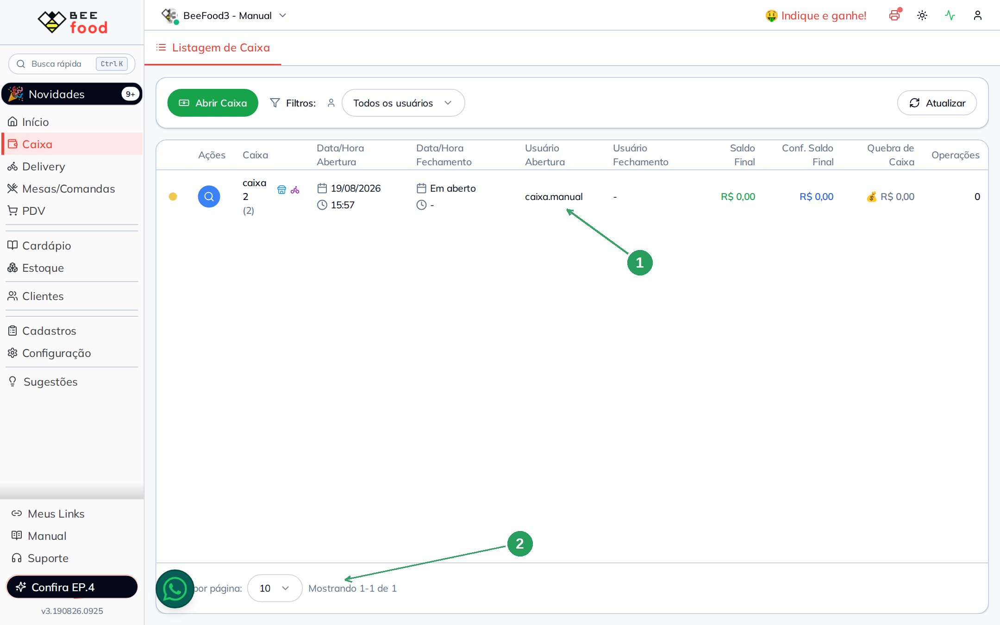

| Nº | Item | O que observar |
|----|------|----------------|
| 1 | **Usuário Abertura** | Só aparece o próprio login. Os caixas dos colegas sumiram da lista. |
| 2 | O rodapé | **"Mostrando 1-1 de 1"**, contra 10 antes da vinculação. |

### Três coisas que você precisa saber antes de usar

**1. A regra é invertida.** O filtro só vale para quem **tem** um caixa no próprio nome. Quem
não está vinculado a nenhum terminal continua vendo **todos** os caixas. Não adianta vincular
os caixas de uns e esquecer os outros: quem ficou de fora enxerga tudo.

**2. O gerente também fica restrito.** Não existe exceção para gerente aqui. Se o terminal do
gerente estiver no nome dele, ele deixa de ver os caixas dos funcionários — inclusive os que
estão abertos naquele momento. Se você quer que alguém continue vendo tudo, **deixe o Usuário
Fixo dessa pessoa em branco**.

**3. A mudança pode demorar alguns minutos.** O sistema guarda o cadastro dos terminais em
memória. Logo depois de salvar, é normal a listagem oscilar entre a versão antiga e a nova.
Espere alguns minutos antes de concluir que não funcionou.

---

## E o parâmetro "Caixa por Usuário"?

Em **Configuração → Parâmetros**, na seção **Caixa**, existe um parâmetro chamado **Caixa por
Usuário**, descrito como *"Cada usuário tem e só consegue ver seu próprio caixa"*.

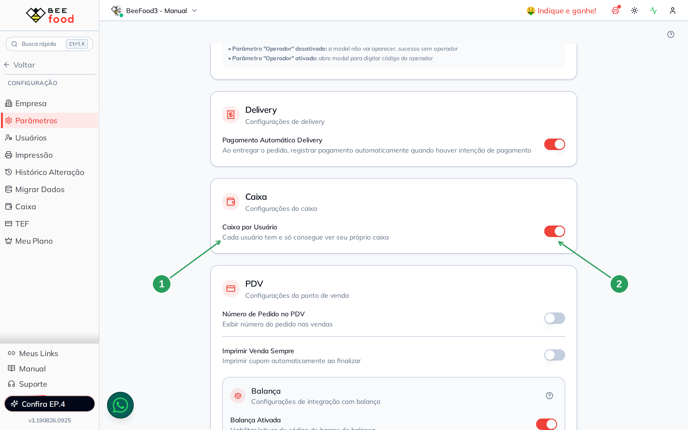

| Nº | Item | O que observar |
|----|------|----------------|
| 1 | O texto | Promete exatamente o comportamento da restrição 7. |
| 2 | O switch | Liga e desliga o parâmetro. |

> **Este parâmetro não restringe o caixa.** Apesar da descrição, ligá-lo não muda nada na
> listagem, nos detalhes nem na abertura de caixa. Quem faz "cada um vê só o seu" é o campo
> **Usuário Fixo** do Cadastro de Caixas — a restrição 7 deste manual. O parâmetro atua em
> outra parte do sistema, no Histórico de Vendas.

> **Atenção: esta tela salva sozinha.** A tela de Parâmetros não tem botão Salvar — ela grava
> cerca de meio segundo depois do clique. Não clique num switch "só para ver o que acontece",
> porque a mudança já vale.

---

## Resumo — quero que ele não consiga...

| Quero que o usuário não... | Desligue | Onde |
|----------------------------|----------|------|
| ...entre no caixa de jeito nenhum | **Abrir e Fechar Caixa** | Grupo de acesso → Venda |
| ...veja saldos, quebras e o resumo (conferência cega) | **Visualizar Valores de Referência** | Sub-item de Abrir e Fechar Caixa |
| ...consulte caixas de dias anteriores | **Visualizar Caixas Fechados** | Sub-item de Abrir e Fechar Caixa |
| ...transfira operações nem veja cancelados/excluídos | **Transferência de Operações** | Sub-item de Abrir e Fechar Caixa |
| ...mexa no cadastro dos terminais | **Cadastro de Caixas** | Grupo de acesso → Empresa |
| ...abra a aba Cancelamentos | **Gerente** | Cadastro do usuário |
| ...veja os caixas dos colegas | vincule o **Usuário Fixo** | Cadastro do caixa |
| ...faça sangria ou acréscimo | *não é possível hoje* | — |

---

## Dicas finais

- **Teste com um usuário de teste.** Crie um usuário num grupo separado, aplique a restrição e
  entre com ele. É mais seguro do que mexer no seu próprio grupo.
- **Mude uma coisa por vez.** Se você desligar três permissões de uma vez e algo parecer errado,
  não vai saber qual delas causou.
- **Anote o que desligou.** Não existe histórico de "o que estava ligado antes" nesta tela.
- **Se algo sumiu e ninguém sabe por quê**, comece por aqui: quase toda tela que "desapareceu"
  do BeeFood é permissão de grupo, não erro.

---

### Referências internas (não publicar)

Estudo, evidências e mapeamento técnico: `MEMORIA.md` e `fluxo-codigo.md` desta pasta.
