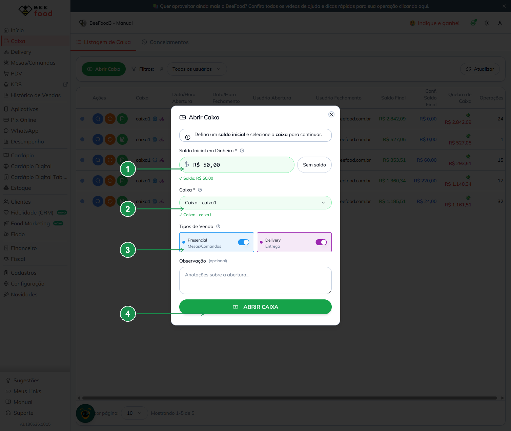
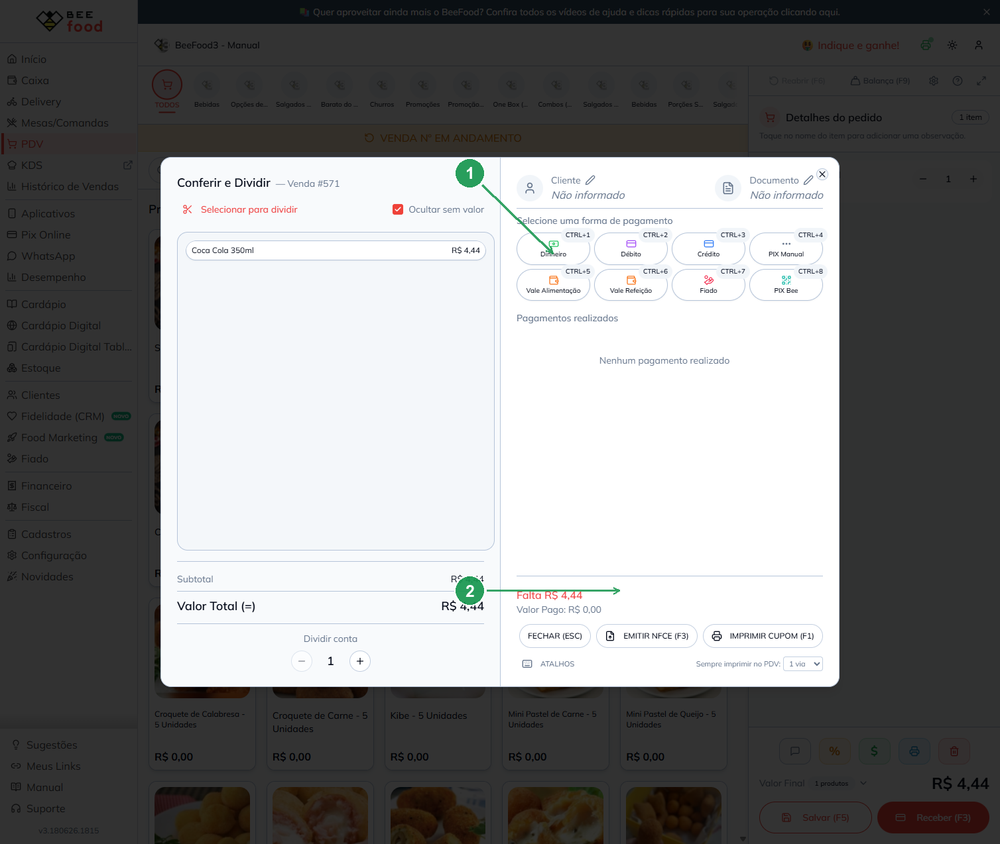
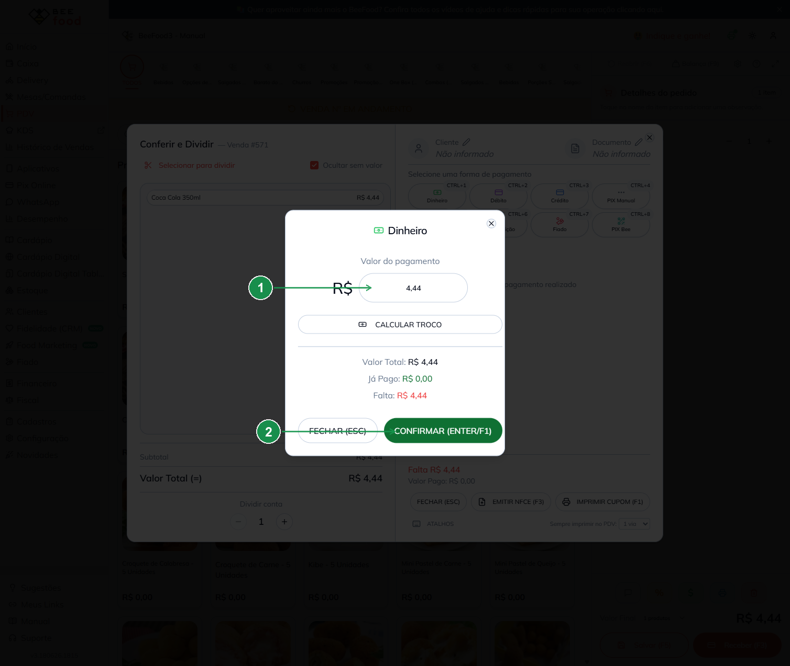
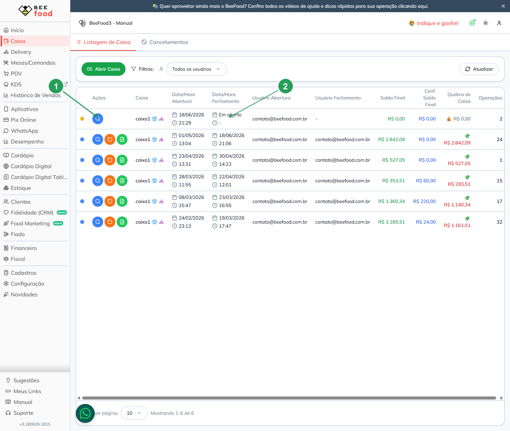
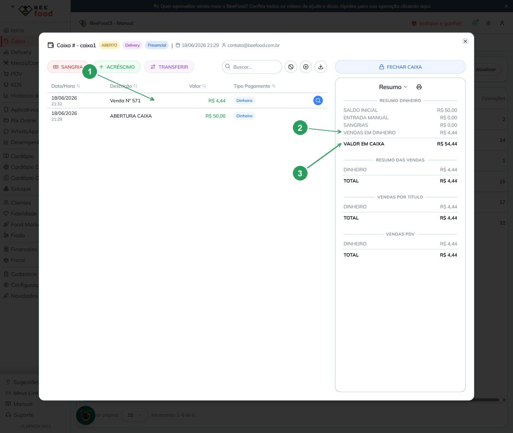

# Manual do Caixa — Abrir, receber um pagamento e consultar o valor

Este manual ensina, passo a passo, a:

1. **Abrir um caixa**
2. **Receber um pagamento** (que cai automaticamente no caixa)
3. **Consultar o valor** no caixa que foi aberto

> As imagens têm **setas com números** (①, ②, ③...). No texto, cada número indica
> exatamente o campo ou botão correspondente na tela. Campos marcados com **\*** são **obrigatórios**.

---

## Pré-requisitos

- Estar com a sessão iniciada no sistema (`https://beefood.app`).
- Ter acesso ao menu **Caixa** (menu lateral esquerdo).

---

## Etapa 1 — Abrir o caixa

1. No menu lateral, clique em **Caixa**.
2. Na tela **Listagem de Caixa**, clique no botão verde **Abrir Caixa**.
3. Preencha a janela **Abrir Caixa** conforme a imagem abaixo:

| Nº | Campo | Obrigatório | O que fazer |
|----|-------|:-----------:|-------------|
| ① | **Saldo Inicial em Dinheiro \*** | **Sim** | Informe quanto há de dinheiro (troco) no início. Se não houver, clique em **Sem saldo** para usar R$ 0,00. |
| ② | **Caixa \*** | **Sim** | Selecione o caixa/terminal que será aberto. |
| ③ | **Tipos de Venda** | Não | Deixe ligado **Presencial** e/ou **Delivery** conforme o que esse caixa vai atender (ambos já vêm ligados). |
| ④ | **ABRIR CAIXA** | — | Clique para concluir a abertura. |

> O campo **Observação (opcional)** pode ser usado para anotações sobre a abertura.

4. Ao confirmar, aparece a mensagem **“Caixa aberto com sucesso”** e o caixa passa a
   figurar na listagem com o status **Em aberto**.

---

## Etapa 2 — Receber um pagamento (cai no caixa)

> Importante: o valor entra no caixa **automaticamente** quando você finaliza o pagamento
> de uma venda. Não existe uma tela separada de “lançar dinheiro no caixa”.

1. No menu lateral, abra o **PDV**.
2. Clique no produto desejado para adicioná-lo ao pedido (ele aparece em **Detalhes do pedido**, à direita).
3. Clique em **Receber (F3)**.
4. Na janela **Conferir e Dividir**, escolha a forma de pagamento:

| Nº | Item | O que fazer |
|----|------|-------------|
| ① | **Dinheiro** | Clique para receber em dinheiro (essa forma é a que soma em **“Vendas em Dinheiro”** no caixa). As demais opções: Débito, Crédito, PIX Manual, Vale Alimentação, Vale Refeição, Fiado, PIX Bee. |
| ② | **Valor a receber** | Confira o **Valor Total** e quanto ainda **Falta** receber. |

5. Confirme o valor recebido:

| Nº | Campo | O que fazer |
|----|-------|-------------|
| ① | **Valor do pagamento** | Já vem preenchido com o valor da venda. Se o cliente pagar com nota maior, use **Calcular Troco**. |
| ② | **CONFIRMAR (ENTER/F1)** | Clique para registrar o pagamento. |

6. O pagamento aparece em **Pagamentos realizados** como **“Dinheiro — Pago”** e o sistema
   mostra **“Pagamento completo”**. A venda está finalizada e o valor já foi para o caixa aberto.

---

## Etapa 3 — Consultar o valor no caixa aberto

1. Volte ao menu **Caixa**.
2. Na linha do caixa com status **Em aberto**, clique em **Ver Caixa** (ícone de lupa azul):

| Nº | Item | Descrição |
|----|------|-----------|
| ① | **Ver Caixa** (lupa azul) | Abre os detalhes e o resumo do caixa. |
| ② | **Em aberto** | Confirma que este é o caixa atualmente aberto. |

3. Na tela do caixa, confira as movimentações (à esquerda) e o **Resumo Dinheiro** (à direita):

| Nº | Item | Descrição |
|----|------|-----------|
| ① | **Operação da venda** | Cada pagamento aparece na lista. Ex.: **Venda Nº 571 — R$ 4,44 — Dinheiro**. |
| ② | **VENDAS EM DINHEIRO** | Soma dos pagamentos recebidos em dinheiro (ex.: **R$ 4,44**). |
| ③ | **VALOR EM CAIXA** | É o total em dinheiro no caixa: **Saldo Inicial + Vendas em Dinheiro − Sangrias**. No exemplo: R$ 50,00 + R$ 4,44 = **R$ 54,44**. |

> Resumindo o exemplo: abrimos o caixa com **R$ 50,00**, recebemos uma venda de **R$ 4,44**
> em dinheiro e o **Valor em Caixa** passou a ser **R$ 54,44** — exatamente o esperado.

---

## Dicas rápidas

- **Sangria**: retirar dinheiro do caixa (saída). Botão **SANGRIA** dentro de **Ver Caixa**.
- **Acréscimo**: colocar dinheiro no caixa (entrada/“suprimento”). Botão **ACRÉSCIMO**.
- Só é possível registrar sangria/acréscimo e receber vendas com um **caixa aberto**.
- Para encerrar o dia, use **FECHAR CAIXA** e faça a conferência dos valores.
