# Manual — Campanhas de SMS

O SMS chega **direto no celular**, sem o cliente precisar ter WhatsApp aberto ou estar
online. É o canal certo para promoção rápida, lembrete e recuperação — e **não usa o
número de WhatsApp da loja**, então não existe risco de banimento.

Este manual ensina a:

1. Entender **créditos e segmentos** (e como economizar sem acento e emoji)
2. **Criar** uma campanha nos três passos (mensagem, destinatários, resumo)
3. **Enviar** e ler o resultado
4. **Comprar créditos** por PIX
5. Usar a **blacklist / opt-out**

> As imagens têm **setas com números** (1, 2, 3...). No texto, cada número indica
> exatamente o campo ou botão correspondente na tela.

---

## Onde encontrar

No menu lateral, em **Food Marketing**, abra **Campanhas SMS**. A página tem três abas:

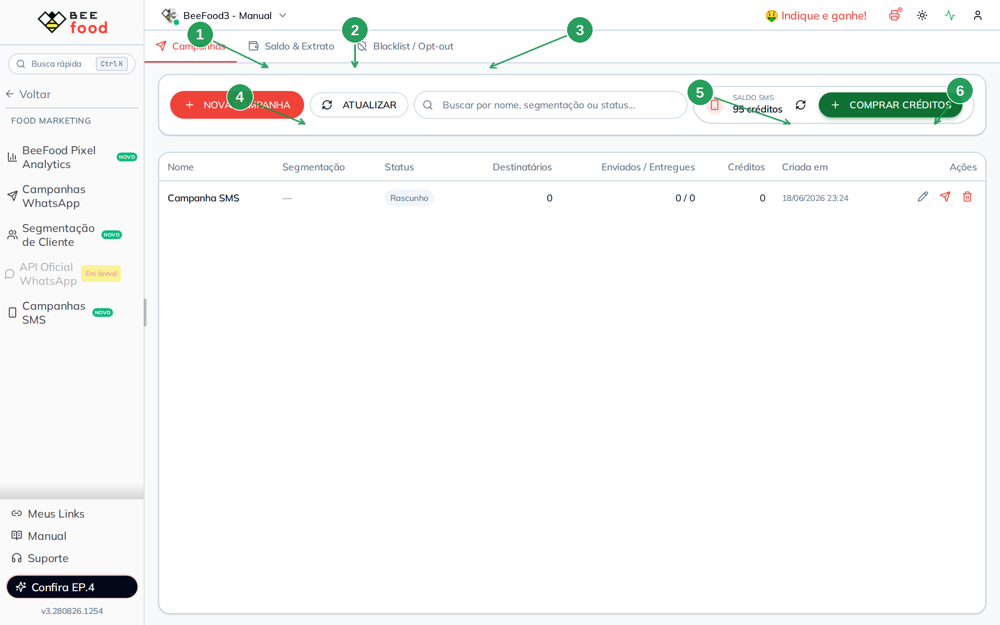

1. Aba **Campanhas** — a lista e o botão de criar
2. Aba **Saldo & Extrato** — créditos, PIX pendente e movimentações
3. Aba **Blacklist / Opt-out** — quem não recebe mais
4. **NOVA CAMPANHA** — abre o editor
5. **Saldo SMS** — quantos créditos a loja tem agora
6. **COMPRAR CRÉDITOS** — gera um PIX (veja a seção de compra)

A lista mostra nome, status (**Rascunho**, **Enviando**, **Enviada**), destinatários,
enviados/entregues e créditos gastos. Em rascunho você edita, envia ou descarta. Depois
de enviada, só dá para **ver o detalhe** — não dá para excluir.

Há versão no celular, com as mesmas três abas. Este manual é do **desktop**.

---

## Como o crédito é cobrado

Cada **segmento** da mensagem custa **1 crédito por destinatário**.

O celular corta o SMS em pedaços. O tamanho de cada pedaço depende do alfabeto:

| Codificação | Quando entra | 1 segmento | Se passar disso |
|---|---|---|---|
| **GSM-7** | só letras sem acento (e uns poucos símbolos) | **160** caracteres | 153 por segmento extra |
| **UCS-2** | qualquer acento fora do GSM, ou emoji | **70** caracteres | 67 por segmento extra |

Uma mensagem curta e sem acento custa **1 crédito**. A mesma ideia com “Olá” e um emoji
já cai em UCS-2: o limite despenca para 70, e o segundo pedaço começa muito antes.

O sistema cobra o **pior caso** da lista. Se um único nome da lista tiver acento e o
switch estiver desligado, **toda a campanha** pode ir para UCS-2.

O switch **Enviar sem acento e emoji** nasce **ligado** em campanha nova. Ele tira acento
e emoji **no envio** — inclusive dos nomes — e a mensagem vai em GSM-7. A prévia já
mostra o texto limpo.

> **Regra prática:** deixe o switch ligado. Escreva curto. Use `{{meu_link}}` em vez de
> colar um link enorme. Confira o canto do editor: `88 chars · 1 cred./envio · GSM` é o
> que você quer ver antes de avançar.

---

## Passo 1 — A mensagem

Clique em **NOVA CAMPANHA** (a seta 4 da imagem acima). O editor abre à direita, em
três passos: **Mensagem**, **Destinatários**, **Resumo**.

**Não existe salvamento automático.** O rascunho só é gravado quando você avança do
passo 1 para o 2. Se estiver só ensaiando, saia por **FECHAR (ESC)** — nada é criado.

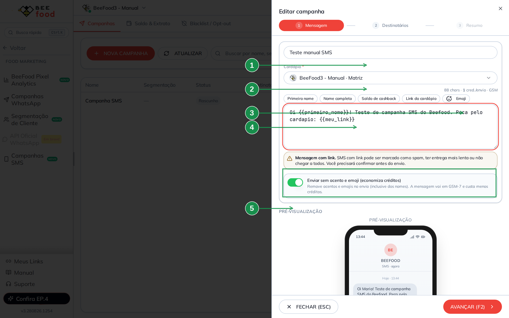

1. **Cardápio** — de qual loja sai o `{{meu_link}}`. Obrigatório se a mensagem usa essa
   variável. O nome da campanha fica no campo logo acima (ex.: Promoção Quarta Maluca)
2. Os botões de **variável** — eles inserem `{{chave}}` no cursor. Use só esses
3. A variável `{{primeiro_nome}}` no texto
4. A variável `{{meu_link}}` no texto. No canto do editor, o **contador** mostra
   caracteres, créditos por envio e se está em **GSM** ou **UCS-2**
5. A **prévia** do celular. O switch **Enviar sem acento e emoji** fica acima dela,
   ligado por padrão

O quadro amarelo (destaque na imagem) aparece quando a mensagem tem link. SMS com link
pode ir para spam, demorar mais ou não chegar em todo mundo. Você vai confirmar isso de
novo no envio.

Variáveis que o sistema reconhece:

| Botão na tela | O que entra na mensagem | Exemplo na prévia |
|---|---|---|
| Primeiro nome | `{{primeiro_nome}}` | Maria |
| Nome completo | `{{nome}}` | Maria Silva |
| Saldo de cashback | `{{saldo_cashback}}` | R$ 00,00 |
| Link do cardápio | `{{meu_link}}` | `menu.beefood.com.br/seurestaurante?sms=…` |

A prévia do celular troca as variáveis por exemplos. No envio, cada cliente recebe os
dados dele. O `{{meu_link}}` ganha `?sms=` com o número da campanha — é assim que o
sistema conta clique e conversão. Link de outro domínio (que não seja
`menu.beefood.com.br` ou `shop.beetech.com.br`) **não é medido**.

Se a mensagem usa `{{saldo_cashback}}`, quem **não tem saldo** não recebe e **não
consome crédito**.

Variável digitada à mão e que o sistema não conhece trava o passo 1 — um aviso vermelho
lista o que está errado.

### Quando o limite cai para 70 caracteres

Desligue o switch e escreva com acento ou emoji. O contador muda para **UCS-2** e o
aviso aparece:

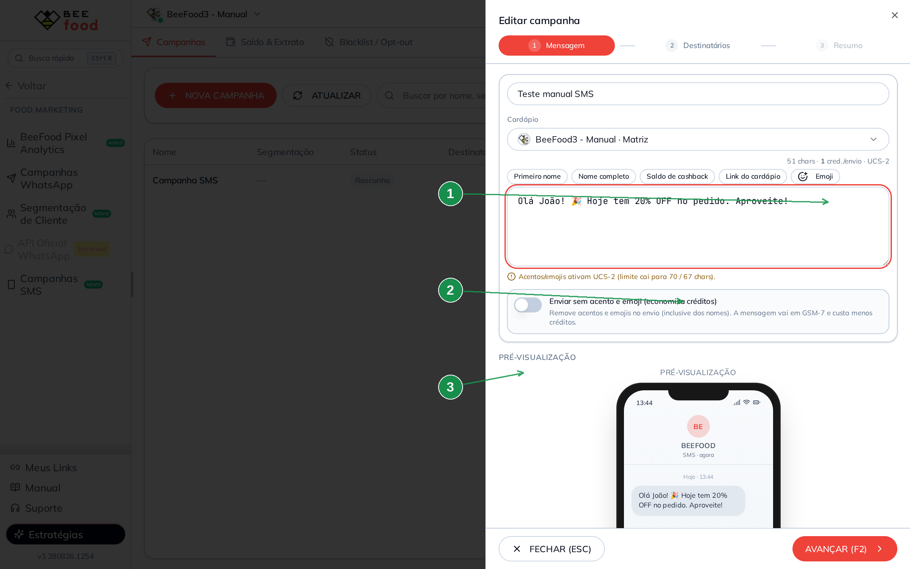

1. O contador em **UCS-2** — 1 crédito ainda, mas o teto é 70 (ou 67 se passar)
2. O aviso: acentos e emojis ativam UCS-2
3. O switch **desligado** — religue para voltar ao GSM e economizar

Atalho do passo: **AVANÇAR (F2)**. Só habilita com nome e mensagem preenchidos.

---

## Passo 2 — Os destinatários

Três jeitos de montar a lista. Pode misturar.

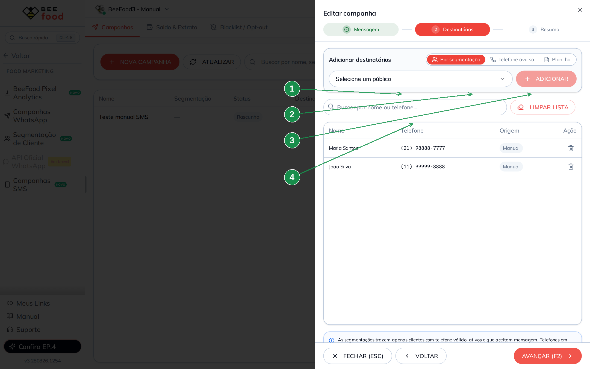

1. **Por segmentação** — um público que você já salvou em
   **Food Marketing → Segmentação de Cliente**
2. **Telefone avulso** — um número por vez
3. **Planilha** — vários de uma vez (.xlsx, .xls ou .csv)
4. O seletor do público (só segmentações **ativas**) e o botão **ADICIONAR**

A segmentação já traz só cliente com telefone válido, ativo e que aceita mensagem.
Quem está na blacklist **não entra**. O sistema avisa quantos foram ignorados
(duplicado ou opt-out).

### Telefone avulso

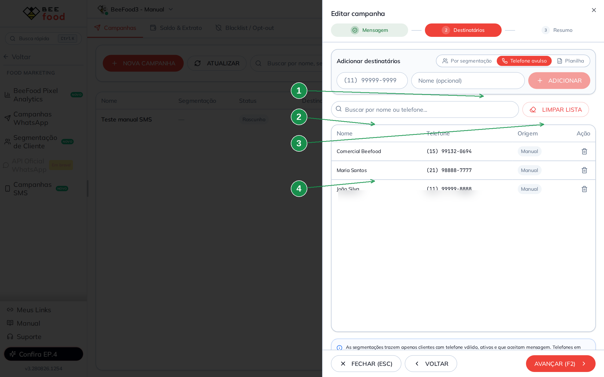

1. Os campos do modo **Telefone avulso** (número com DDD e nome opcional)
2. A **lista** de quem já foi adicionado
3. **LIMPAR LISTA** — esvazia tudo (pede confirmação)
4. Uma linha na lista, com origem **Manual**. A lixeira à direita tira só aquele número

### Planilha

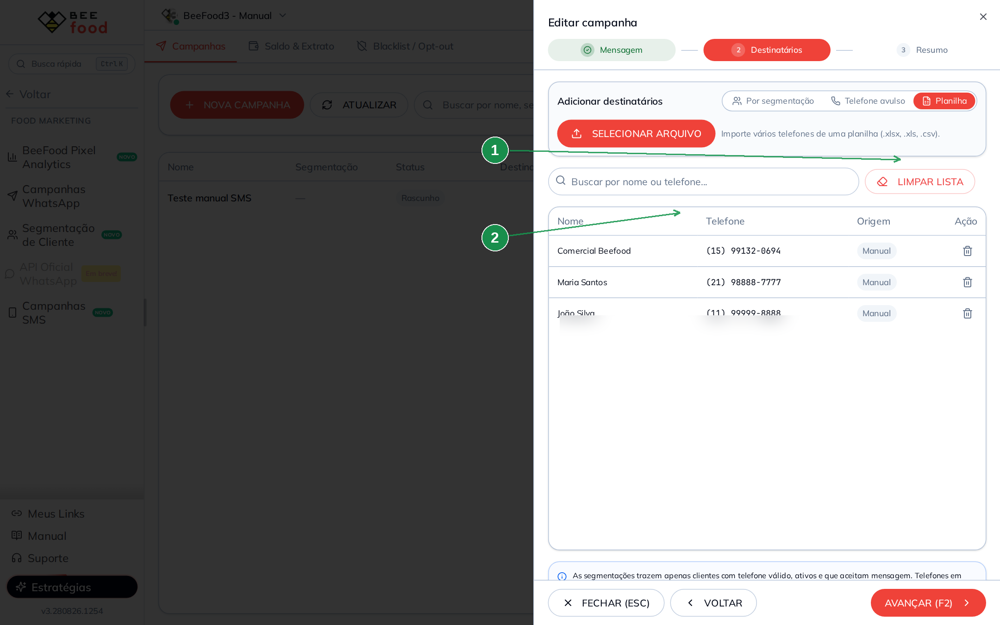

1. O modo **Planilha**
2. **SELECIONAR ARQUIVO** — aceita Excel e CSV

**LIMPAR LISTA** esvazia tudo (pede confirmação). A lixeira de cada linha tira só
aquele número. Sem pelo menos um destinatário, o **AVANÇAR (F2)** não libera.

---

## Passo 3 — Resumo e envio

O passo 3 mostra a prévia do celular (já com o nome de exemplo e o link medido) e o
**Resumo do envio**: destinatários, créditos por envio, custo total e saldo.

Se a mensagem tem link, o quadro amarelo volta. Clique em **ENVIAR AGORA (F2)**.

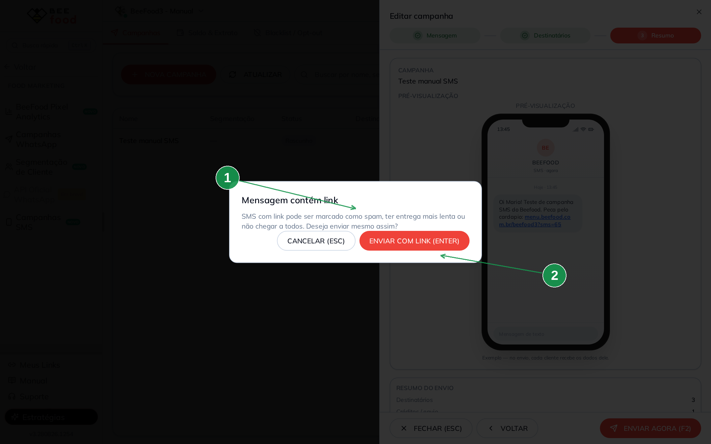

1. O texto do risco: spam, atraso ou falha de entrega
2. **ENVIAR COM LINK (ENTER)** — só se você realmente quer o link. **CANCELAR (ESC)**
   volta sem gastar crédito

Depois vem a confirmação final. **Essa ação não tem volta.**

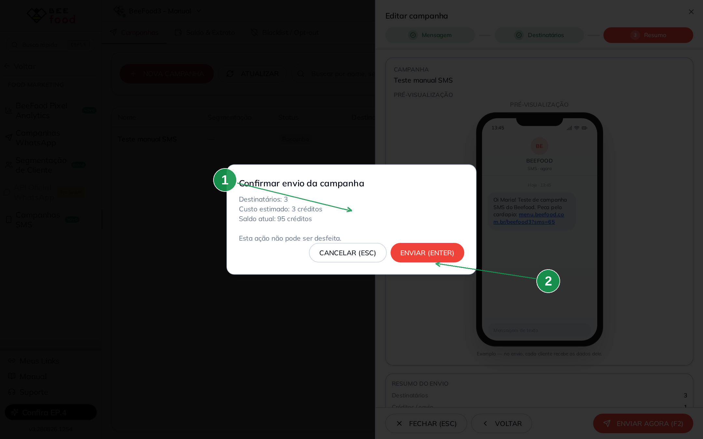

1. Destinatários, custo estimado e saldo atual — confira os três
2. **ENVIAR (ENTER)**

Na conta de testes deste manual, o disparo foi para 3 destinatários, a **1 crédito**
cada: custo **3**, saldo **95 → 92**.

---

## Depois de enviar

A lista troca o selo para **Enviada**. O olho abre o detalhe.

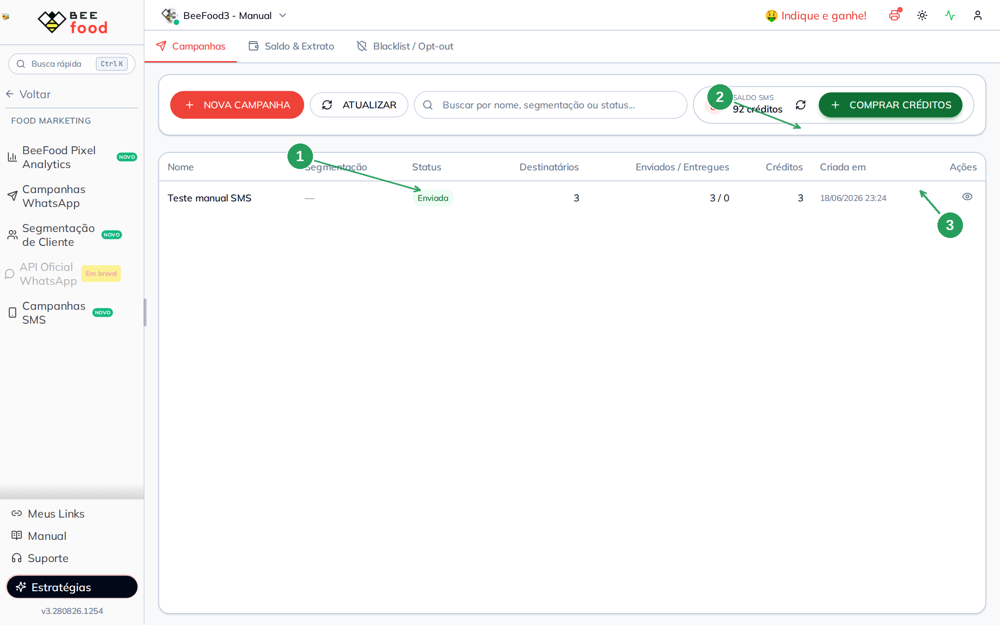

1. O selo **Enviada**
2. O saldo já descontado
3. O ícone de **ver detalhe**

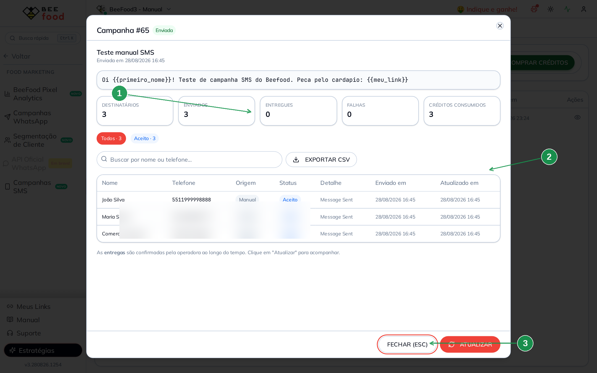

1. Os cartões: destinatários, enviados, entregues, falhas e créditos consumidos
2. **EXPORTAR CSV** da lista de envios
3. **ATUALIZAR** — a operadora confirma a entrega com o tempo; o **Entregues** começa
   em 0 e sobe quando você atualiza

Status que aparecem na tabela: **Aceito** (a operadora recebeu), **Enviado**,
**Entregue**, **Falha**, **Opt-out**, **Sem cashback**.

O débito entra no extrato na hora:

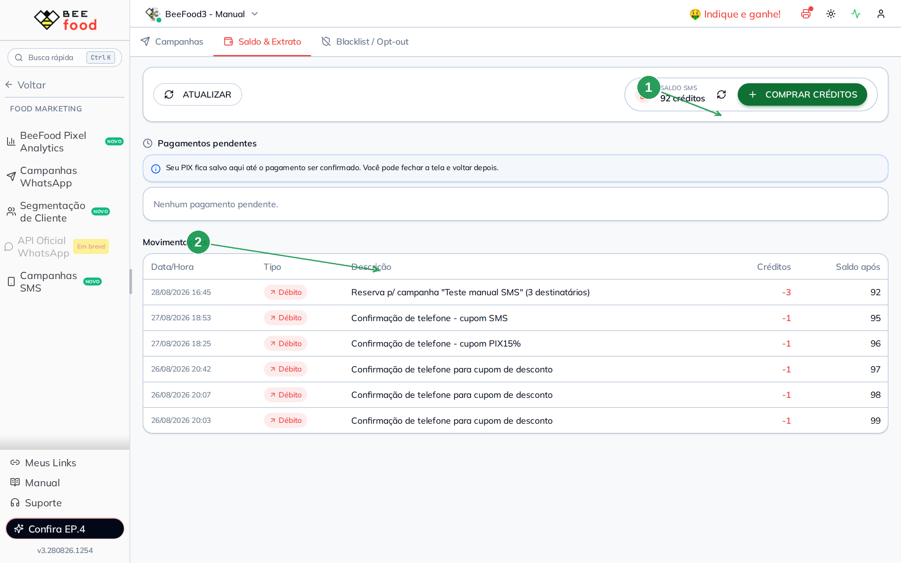

1. O saldo depois do envio
2. A linha **Débito** da campanha, com os créditos gastos e o saldo após

Outras linhas de **Confirmação de telefone** no extrato não são campanha: o sistema
também gasta 1 crédito quando manda SMS para validar o celular de um cupom.

---

## Comprar créditos por PIX

Pelo badge **COMPRAR CRÉDITOS** (qualquer aba) ou pela aba **Saldo & Extrato**.

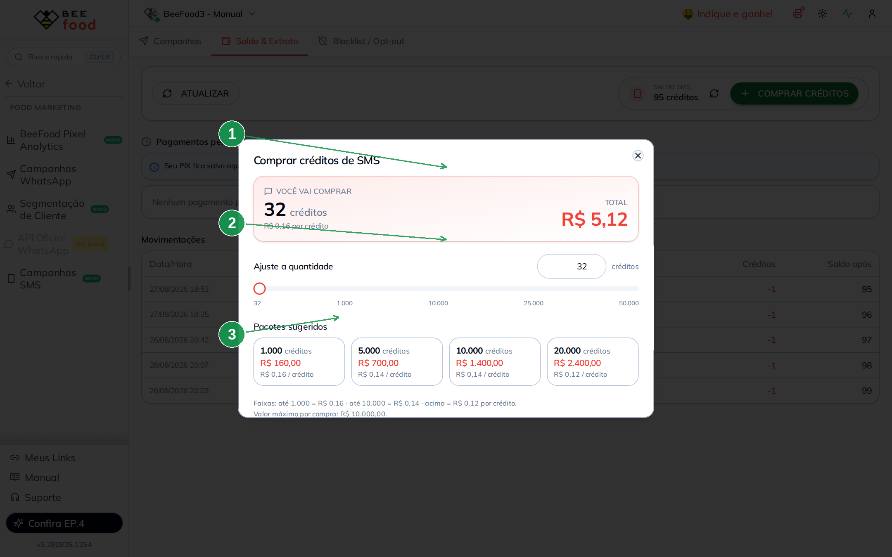

1. Quanto você vai levar e o **total em reais**
2. O **slider** (ou o campo ao lado) para ajustar a quantidade
3. Os **pacotes sugeridos** — um clique já posiciona o slider

O preço cai por faixa:

| Faixa | Preço por crédito |
|---|---|
| Até 1.000 | R$ 0,16 |
| Até 10.000 | R$ 0,14 |
| Acima | R$ 0,12 |

Mínimo de compra: **R$ 5,00** (32 créditos na faixa mais cara). Máximo por pedido:
**R$ 10.000**. Para mais, faça outro PIX.

**GERAR PIX (F2)** cria o QR e o copia-e-cola. O pedido fica em **Saldo & Extrato →
Pagamentos pendentes** até o pagamento cair. O saldo só sobe depois da confirmação —
não precisa ficar na tela; volte e clique em **ATUALIZAR**.

---

## Blacklist / opt-out

Telefone nesta lista **não recebe** campanha e **não gasta crédito**.

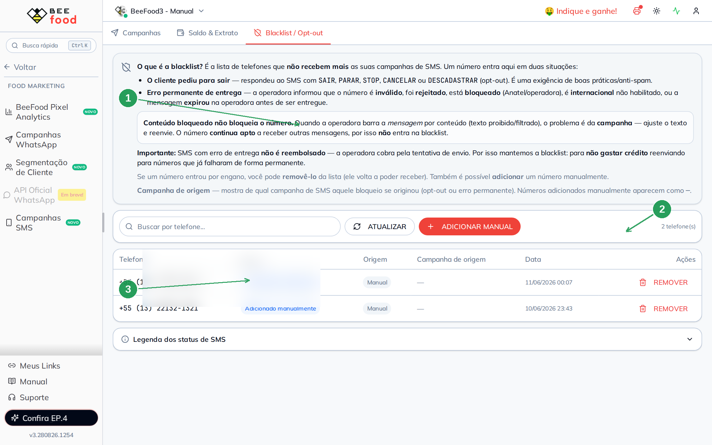

1. O texto da própria tela: o número entra sozinho quando o cliente pede para sair
   ou quando a operadora devolve um erro **permanente**
2. **ADICIONAR MANUAL** — você inclui um número
3. A tabela (telefone, motivo, origem, campanha de origem) e o **REMOVER**

O cliente sai respondendo o SMS com **SAIR**, **PARAR**, **STOP**, **CANCELAR** ou
**DESCADASTRAR**.

Erro permanente (número inválido, rejeitado, bloqueio Anatel/operadora, internacional
não habilitado, expirado na operadora) também entra. **SMS com erro de entrega não
devolve crédito** — por isso a lista existe.

**Conteúdo bloqueado não coloca o número na blacklist.** Se a operadora barrar o
*texto*, ajuste a mensagem e reenvie: o telefone continua apto.

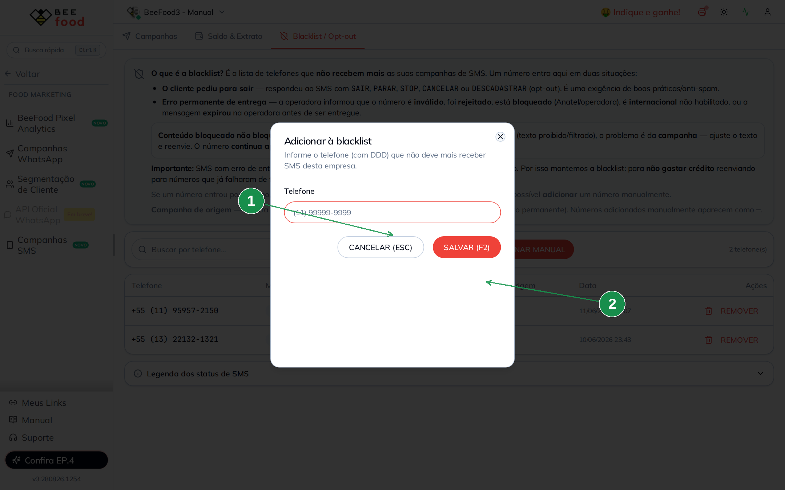

1. O telefone com DDD
2. **SALVAR (F2)**

Número colocado sem querer: **REMOVER**. Ele volta a poder receber.

Na parte de baixo da aba há a **Legenda dos status de SMS** — o que é permanente
(fica na blacklist) e o que pode ser reenviado.

---

## Dicas

- **Deixe o switch de acento ligado.** É a economia mais fácil.
- **Prefira `{{meu_link}}` a um link colado.** Você mede clique e conversão, e o
  texto fica mais curto.
- **Teste com um telefone avulso** antes de jogar uma segmentação grande. O envio
  não tem volta.
- **Não dispare para quem pediu para sair.** A blacklist cuida disso; não tire
  número de opt-out para “tentar de novo”.
- **Saldo baixo?** Compre antes. Sem crédito suficiente o passo 3 trava e oferece
  **COMPRAR CRÉDITOS**.
- Segmentação é assunto do manual
  [Segmentação de clientes](../segmentacao-clientes/segmentacao-clientes.md).
  Campanha automática de WhatsApp é o
  [Campanhas Inteligentes](../campanhas-inteligentes/campanhas-inteligentes.md).

---

## Referências internas

- Pasta: `manuais/campanhas-sms/`
- Memória: `MEMORIA.md`
- Mapa do código: `fluxo-codigo.md`
