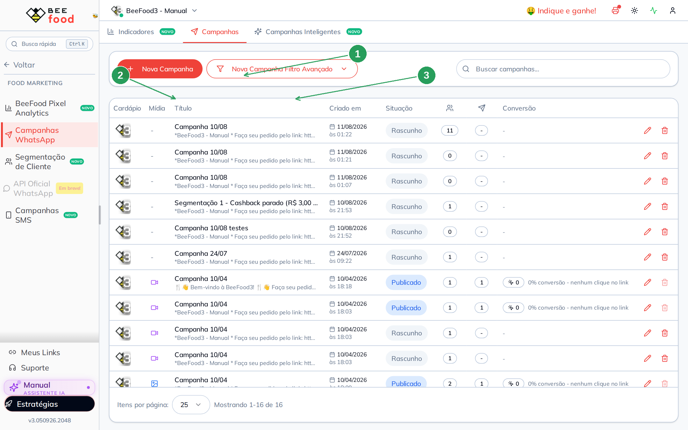
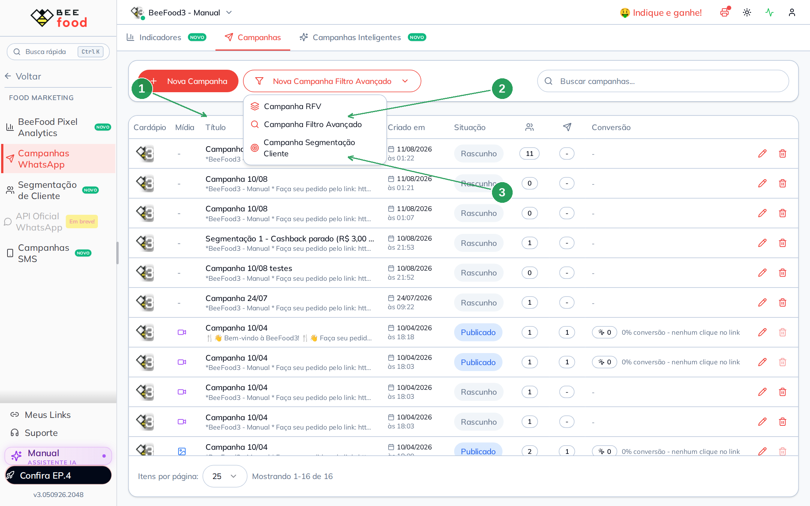
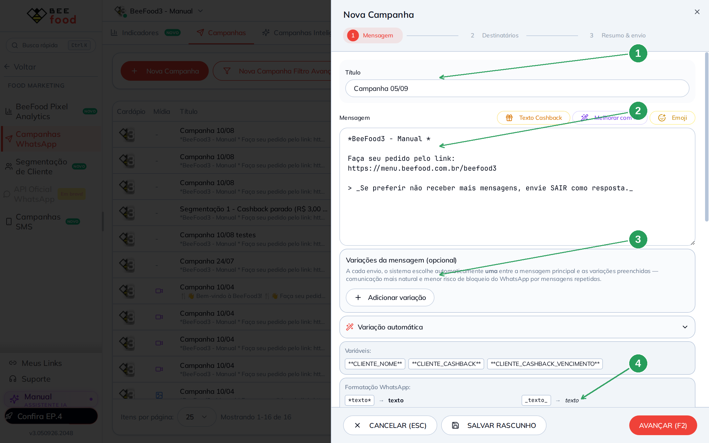
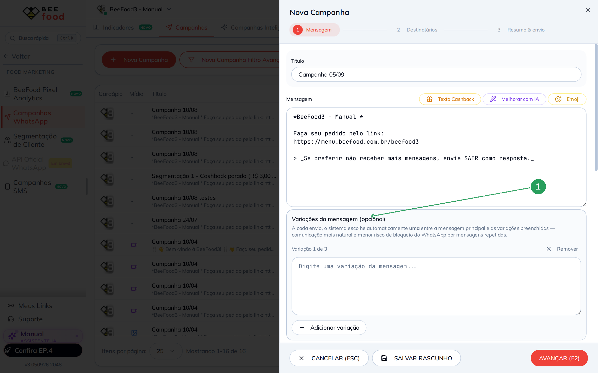
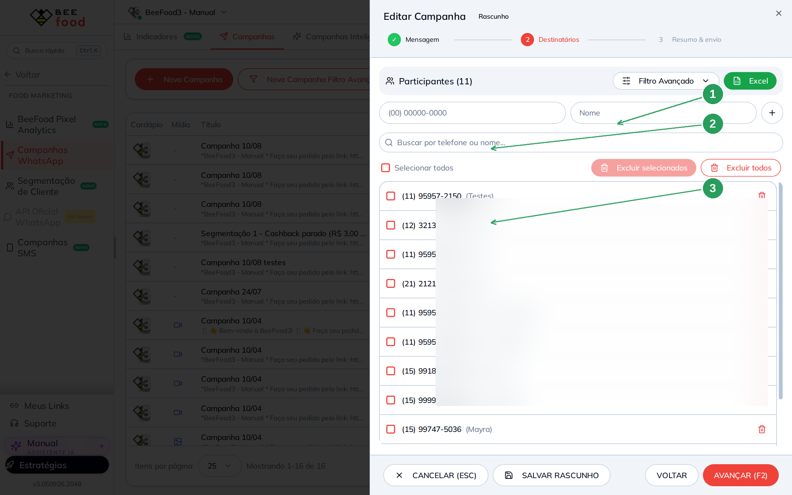
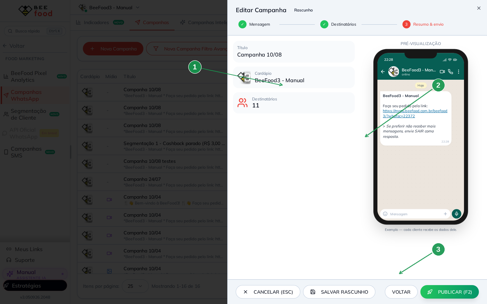
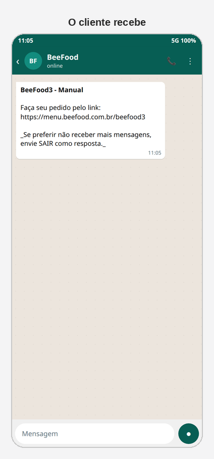

# Campanhas de WhatsApp

Campanha de WhatsApp é o disparo **que você publica**: uma mensagem, uma lista
de destinatários, o botão **PUBLICAR**. Não espera gatilho. Diferente das
**Campanhas Inteligentes**, que enviam sozinhas quando o cliente abandona o
carrinho ou some.

A tela mora em **Food Marketing → Campanhas WhatsApp**, aba **Campanhas**.
O menu **WhatsApp → Envios em Massa** abre **a mesma tela**.

Este manual **não dispara** mensagem de verdade. Os prints são de rascunho. O
exemplo do celular é simulação.

> As imagens têm **setas numeradas** (1, 2, 3…). Cada número indica o campo
> correspondente na tela.

---

## Onde encontrar

No menu **Food Marketing**, abra **Campanhas WhatsApp**. A página tem três
abas: **Indicadores**, **Campanhas** e **Campanhas Inteligentes**.

| Nº | Item | O que faz |
|----|--------|-----------|
| 1. | **Nova Campanha Filtro Avançado** | Atalho RFV, filtro ou segmentação |
| 2. | **Nova Campanha** | Começa em branco (passo Mensagem) |
| 3. | Lista | Rascunho, Publicado, quantos destinatários |

A lista mostra título, data, situação, participantes, enviados e conversão
do link (`?whatsc=`). Lápis edita; lixeira apaga **rascunho**. Publicado não
se exclui — no máximo **aborta**.

---

## Cinco jeitos de montar a lista

Clique em **Nova Campanha Filtro Avançado**:

| Nº | Item | O que faz |
|----|--------|-----------|
| 1. | **Nova Campanha** | Lista vazia: você adiciona na mão |
| 2. | **Filtro Avançado** | Abre o menu dos três atalhos |
| 3. | **RFV / Filtro / Segmentação** | Já nasce com um público |

Os cinco caminhos, no total:

1. **Avulso** — telefone + nome, um a um (passo Destinatários).
2. **RFV** — grupos da classificação (#78).
3. **Filtro avançado** — última compra, ticket, canal…
4. **Segmentação** — público salvo do Food Marketing (#14).
5. **Excel** — planilha no passo Destinatários.

---

## Passo 1 — A mensagem

**Nova Campanha** abre o editor à direita. Três passos: **Mensagem**,
**Destinatários**, **Resumo & envio**.

Não existe auto-save. **SALVAR RASCUNHO** ou **AVANÇAR (F2)** grava.
**CANCELAR (ESC)** descarta se ainda não salvou.

| Nº | Item | O que faz |
|----|--------|-----------|
| 1. | Passo **Mensagem** | Onde você está |
| 2. | Texto | Já vem com o link do cardápio e o pedido de **SAIR** |
| 3. | **Variáveis** | `**CLIENTE_NOME**`, cashback e vencimento |
| 4. | **AVANÇAR (F2)** | Vai para a lista |

**Texto Cashback** cola um modelo pronto. **Melhorar com IA** sugere outra
redação (não publica sozinho). Dá para anexar arquivo (máx. 10 MB).

**Adicionar variação** abre até 3 textos extras. O sistema escolhe um a cada
envio — o mesmo cuidado anti-bloqueio das notificações.

Use `{Olá|Oi|E aí}` dentro da frase. Deixe o convite **SAIR** no rodapé: quem
responde SAIR para de receber.

O link `https://menu.beefood.com.br/…` ganha `/?whatsc=` na publicação. É isso
que o Pixel e a aba **Indicadores** usam para contar clique e pedido.

---

## Passo 2 — Destinatários

| Nº | Item | O que faz |
|----|--------|-----------|
| 1. | Nome (e o telefone ao lado) | Inclusão avulsa, um a um |
| 2. | Busca | Filtra a lista já incluída |
| 3. | Lista | Quem vai receber (nomes ofuscados neste print). **Excel** e **Filtro Avançado** ficam no topo direito |

**Filtro Avançado** neste passo é o mesmo trio RFV / filtro / segmentação, só
que **somando** gente numa campanha que já existe.

---

## Passo 3 — Revisar (e não disparar à toa)

| Nº | Item | O que faz |
|----|--------|-----------|
| 1. | Resumo | Título, cardápio, quantos destinatários |
| 2. | Prévia | Como a mensagem aparece no celular |
| 3. | **PUBLICAR (F2)** | **Dispara de verdade** pelo número da loja |

**SALVAR RASCUNHO** guarda sem enviar. **ABORTAR CAMPANHA** só aparece se já
estiver **Publicado** — interrompe o que ainda não saiu.

Não publique em conta de teste cheia de clientes reais. O rascunho basta para
conferir texto, variação e lista.

---

## O que o cliente recebe

Simulação da mensagem padrão (link + opt-out):

---

## Perguntas frequentes

**Envios em Massa e Campanhas WhatsApp são coisas diferentes?**
Não. São a mesma tela, em dois menus.

**Por que a conversão está 0%?**
Ninguém clicou no link com `whatsc`, ou o Pixel ainda não viu a sessão. A aba
**Indicadores** lê esses cliques.

**Campanha Inteligente entra aqui?**
Não. Inteligente é a terceira aba — manual **#16**.

---

## Referências internas (não publicar)

`WhatsAppEnviosMassaTab` + `ModalEditarCampanha`. Permissão: item Campanhas do
WhatsApp. Pasta `manuais/campanhas-whatsapp/`. **Não publicar** no sandbox.

*Última atualização: setembro/2026 — BeeFood · Campanhas de WhatsApp*
