# Manual do Cardápio — Açaí

Este manual monta um açaí no BeeFood com a regra que quase toda açaiteria usa: **alguns
acompanhamentos entram no preço e os demais são pagos**. Você também vai ver como fazer
**tamanhos** e como um mesmo grupo serve aos três tamanhos ao mesmo tempo.

> Leia antes o manual **Cardápio — fundamentos**. Ele ensina o fluxo básico (complemento →
> grupo → produto → vínculo) que aqui aparece resumido.

> As imagens têm **setas numeradas** (1, 2, 3…). Cada número indica o campo ou botão
> correspondente na tela. Campos com **\*** são **obrigatórios**.

---

## O problema do açaí

A açaiteria vende assim: *"escolha até 3 acompanhamentos inclusos; os extras custam à parte"*.

O BeeFood **não tem** um campo de "3 primeiros grátis". O que ele tem é **limite de quantidade
por grupo**. A solução, então, é usar **dois grupos**:

| Grupo | Formação | Limite | O que faz |
|-------|----------|--------|-----------|
| **Acompanhamentos inclusos** | **Brinde** | máx **3** | o cliente escolhe até 3 e **nada soma** |
| **Acompanhamentos extras** | **Normal** | máx 5 | cada item escolhido **soma** o seu preço |

O limite de 3 do primeiro grupo é o que traduz o "até 3 inclusos". Quando o cliente marca o
terceiro, o quarto **trava** — e se ele quiser mais, usa o grupo de extras, que cobra.

> **Um grupo só não resolve.** Se você colocar tudo num grupo Normal e deixar alguns itens com
> preço zero, o cliente pode marcar oito itens grátis. Se colocar tudo em Brinde, nada cobra
> nunca. É a dupla de grupos que dá o resultado.

---

## O exemplo deste manual

| Item | Valor |
|------|-------|
| Setor | Açaí |
| Produtos | **Açaí 300 ml** R$ 18,00 · **Açaí 500 ml** R$ 22,00 · **Açaí 700 ml** R$ 26,00 |
| Inclusos (até 3) | Granola · Banana · Leite em pó · Paçoca — **sem preço** |
| Extras (até 5) | Morango R$ 3,00 · Creme de avelã R$ 6,00 · Leite condensado R$ 2,00 |
| Cobertura (1) | Calda de chocolate R$ 2,00 · Calda de morango R$ 2,00 |

A conta que vamos conferir: **R$ 22,00 + 3 inclusos + Morango + Creme de avelã + calda =
R$ 33,00**.

---

## Pré-requisitos

- Sessão iniciada em `https://beefood.app`.
- Permissão de menu **Cardápio**.
- Ter lido o manual **Cardápio — fundamentos**.

---

## Parte 1 — Cadastrar os complementos

Tudo que vai em cima do açaí é **complemento**. A diferença entre incluso e pago está só no
**preço**.

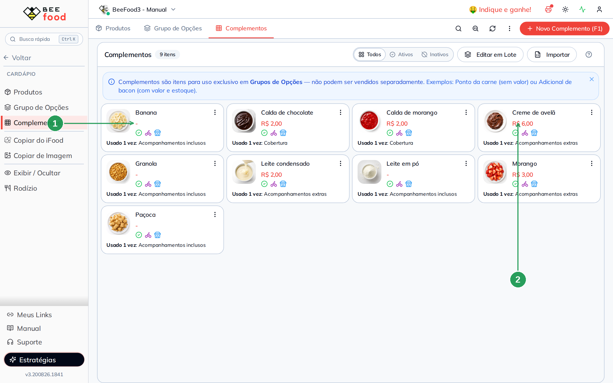

| Nº | Item | Como cadastrar |
|----|------|----------------|
| 1 | **Acompanhamento incluso** | **Sem preço** (R$ 0,00). Vai para o grupo Brinde. |
| 2 | **Extra pago** | **Com preço** — é ele que soma. Vai para o grupo Normal. |

> **A foto compensa muito no açaí.** São muitos itens parecidos, e a imagem ajuda o cliente a
> escolher no cardápio digital. A foto que você cadastra no complemento reaparece na opção, no
> PDV e no cardápio, sem trabalho extra.

---

## Parte 2 — O grupo dos inclusos (Brinde com limite)

Crie o grupo em **Cardápio → Grupo de Opções → Novo Grupo (F1)**.

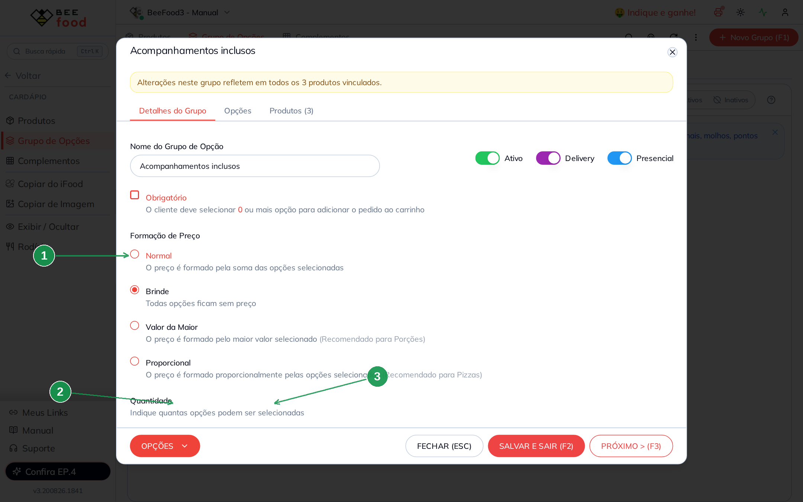

| Nº | Campo | O que preencher |
|----|-------|-----------------|
| 1 | **Brinde** | Nada do que for escolhido aqui soma no preço. |
| 2 | **Mínimo** | `0` — o cliente pode não querer nenhum acompanhamento. |
| 3 | **Máximo** | `3` — **é este número que define quantos são inclusos.** Se a sua casa dá 5, coloque 5. |

Dê ao grupo um nome que o cliente entenda, porque ele aparece na tela de venda e no cardápio
digital. **Acompanhamentos inclusos** já explica sozinho.

### As opções ficam a R$ 0,00

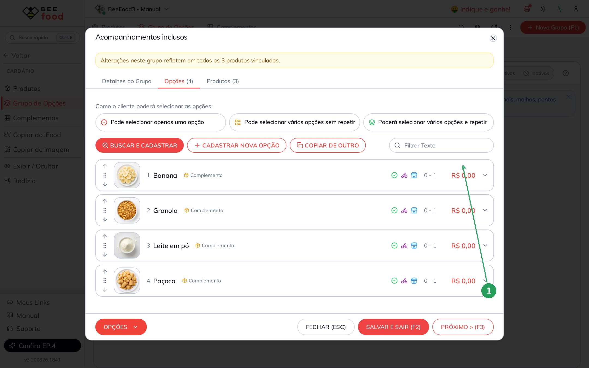

| Nº | Coluna | O que confere |
|----|--------|---------------|
| 1 | **Valor** | **R$ 0,00** nas quatro opções. É isso que garante que nada some. |

> Repare que aqui há **quatro** opções e o limite do grupo é **três**: o cliente escolhe três
> entre as quatro. É assim que funciona — a lista pode ser bem maior que o limite.

---

## Parte 3 — O grupo dos extras (Normal)

| Nº | Campo | O que preencher |
|----|-------|-----------------|
| 1 | **Normal** | Soma o preço de cada extra escolhido. |
| 2 | **Mínimo** | `0` — extra é opcional. |
| 3 | **Máximo** | `5`. |

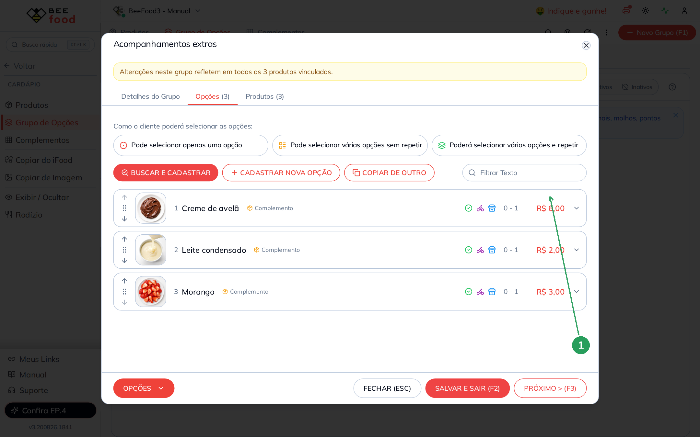

| Nº | Coluna | O que confere |
|----|--------|---------------|
| 1 | **Valor** | O preço de cada extra: R$ 6,00, R$ 2,00 e R$ 3,00. Neste grupo o valor **soma**. |

> **Um item pode estar nos dois grupos?** Pode, mas evite: o cliente veria "Morango" duas
> vezes, uma grátis e uma paga. Se um item premium não pode entrar no pacote incluso, deixe-o
> só nos extras.

---

## Parte 4 — A cobertura, compartilhada pelos três tamanhos

A cobertura é um terceiro grupo, com formação **Normal** e máximo **1**.

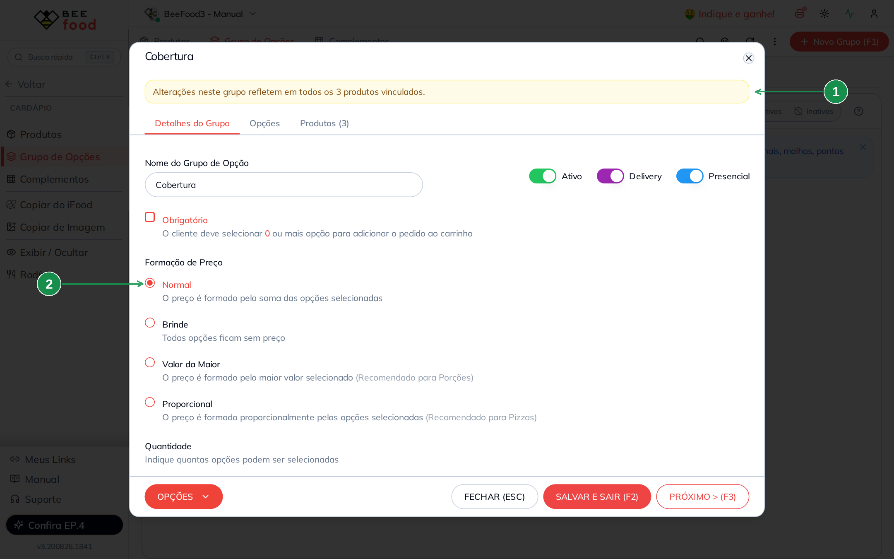

| Nº | Item | O que observar |
|----|------|----------------|
| 1 | **Aviso de grupo compartilhado** | *Alterações neste grupo refletem em todos os 3 produtos vinculados.* Este grupo serve aos três tamanhos. |
| 2 | **Normal** | A calda soma o seu preço. |

O máximo `1` faz o cliente escolher **uma** calda — não dá para pedir chocolate e morango juntos.

### A prova do compartilhamento

Dentro do grupo, a aba **Produtos** mostra quem o usa:

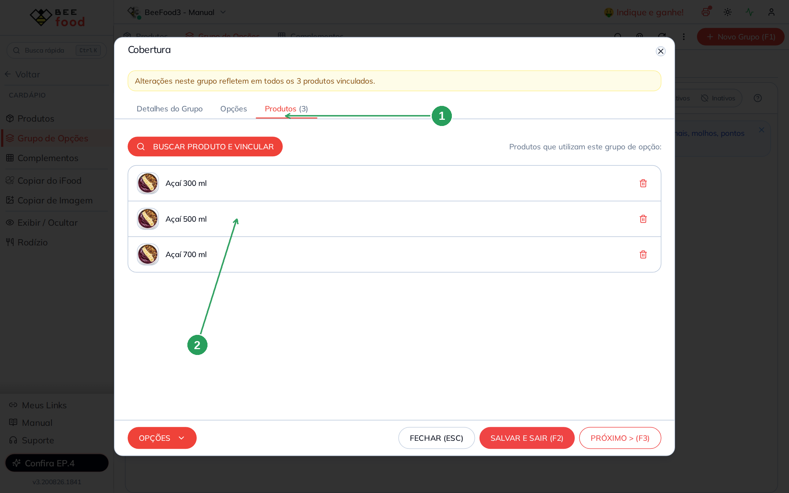

| Nº | Item | O que confere |
|----|------|---------------|
| 1 | **Produtos (3)** | O contador na aba já diz em quantos produtos o grupo está. |
| 2 | **Os três tamanhos** | Açaí 300 ml, 500 ml e 700 ml usando o mesmo grupo. |

> **É por isso que tamanhos com grupos compartilhados valem tanto a pena.** Quando a calda subir
> de R$ 2,00 para R$ 2,50, você altera **uma vez** e os três tamanhos acompanham. Sem
> compartilhar, seriam três alterações — e a chance de esquecer uma.

---

## Parte 5 — Um produto por tamanho

Em **Cardápio → Produtos**, crie o setor **Açaí** e depois um produto para cada tamanho.

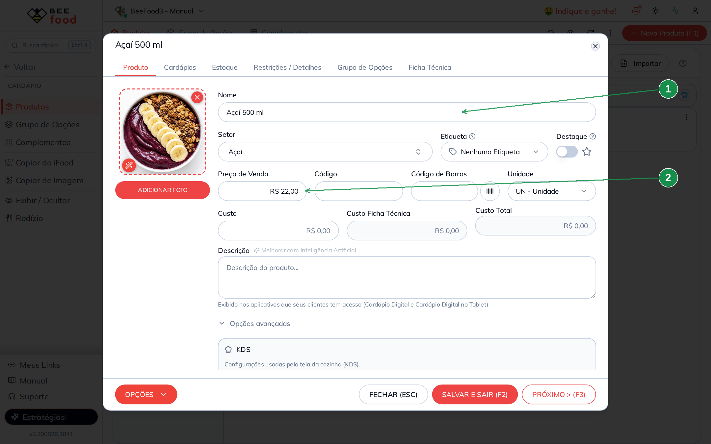

| Nº | Campo | O que preencher |
|----|-------|-----------------|
| 1 | **Nome** | Com o tamanho no nome: `Açaí 500 ml`. É assim que o cliente diferencia. |
| 2 | **Preço de Venda** | O preço **daquele tamanho**: R$ 22,00. |

Repita para 300 ml (R$ 18,00) e 700 ml (R$ 26,00). Pode usar a **mesma foto** nos três.

> **Por que não um grupo de "Tamanho" em vez de três produtos?** Porque o preço ficaria estranho:
> o produto teria preço R$ 0,00 e o tamanho seria uma opção paga. Funciona, mas o cliente perde
> a referência de preço no cardápio (todos apareceriam como R$ 0,00) e você perde o relatório de
> vendas por tamanho. **Um produto por tamanho é mais simples e informa melhor.**

---

## Parte 6 — Vincular os três grupos em cada tamanho

Na aba **Grupo de Opções** de cada produto, vincule os três grupos.

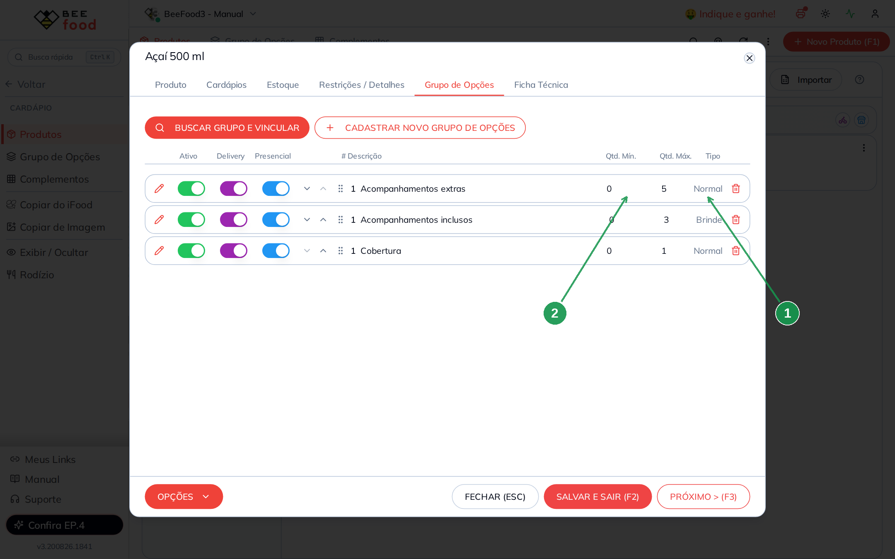

| Nº | Coluna | O que confere |
|----|--------|---------------|
| 1 | **Tipo** | `Brinde` nos inclusos e `Normal` nos extras e na cobertura. |
| 2 | **Qtd. Mín.** e **Qtd. Máx.** | `0` e `3` nos inclusos, `0` e `5` nos extras, `0` e `1` na cobertura. |

**Faça isso nos três tamanhos.** São os mesmos grupos — você está reaproveitando, não
duplicando.

---

## Parte 7 — Conferir no PDV

Abra o **PDV** e clique no Açaí 500 ml.

| Nº | Item | O que confere |
|----|------|---------------|
| 1 | **Escolha 0 a 3** | A regra dos inclusos aparece para o operador. |
| 2 | **Total** | R$ 22,00 — só o preço do tamanho. |

### Três inclusos: o quarto trava e o total não muda

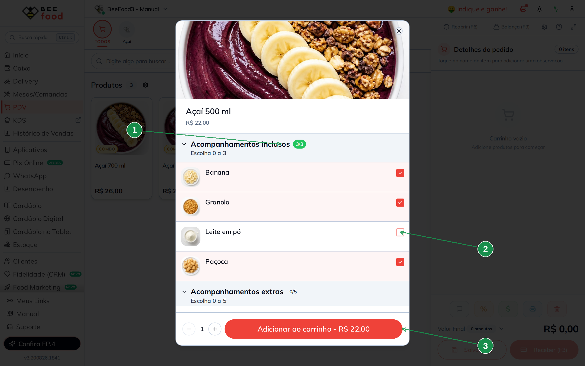

| Nº | Item | O que confere |
|----|------|---------------|
| 1 | **Contador 3/3** | Três de três escolhidos — o limite foi atingido. |
| 2 | **Quarta opção travada** | *Leite em pó* fica **desabilitado**: o sistema não deixa passar de três. |
| 3 | **Total** | Continua **R$ 22,00**. Os três acompanhamentos não custaram nada. |

Essas duas coisas juntas — o **contador que trava** e o **total que não muda** — são exatamente
o "até 3 inclusos" que a açaiteria anuncia.

### Os extras somam

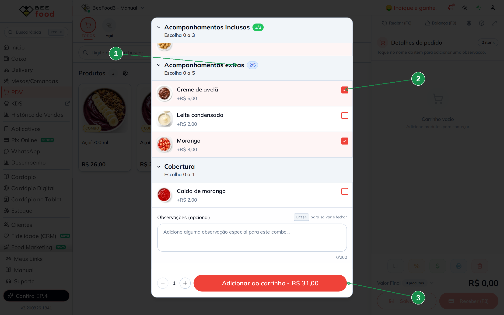

| Nº | Item | O que confere |
|----|------|---------------|
| 1 | **Contador 2/5** | Dois extras de até cinco. |
| 2 | **Extra marcado** | Aqui cada opção mostra o acréscimo (*+R$ 6,00*). |
| 3 | **Total** | **R$ 31,00** = R$ 22,00 + R$ 6,00 (Creme de avelã) + R$ 3,00 (Morango). |

### A cobertura fecha a conta

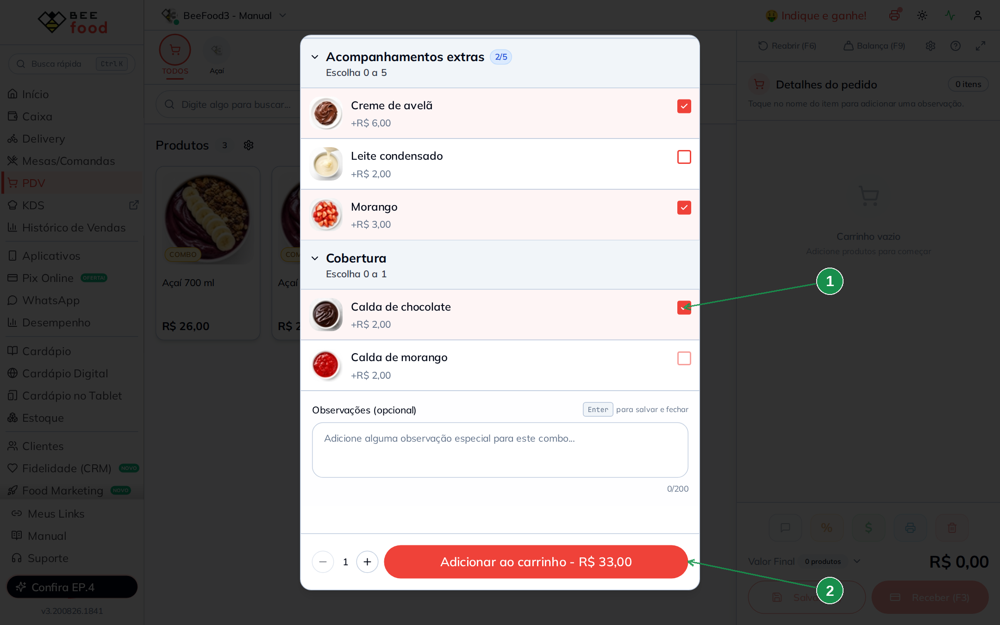

| Nº | Item | O que confere |
|----|------|---------------|
| 1 | **Calda escolhida** | Com o máximo 1, escolher uma calda **trava a outra**. |
| 2 | **Total** | **R$ 33,00** = R$ 31,00 + R$ 2,00 da calda. |

### E no carrinho aparece tudo

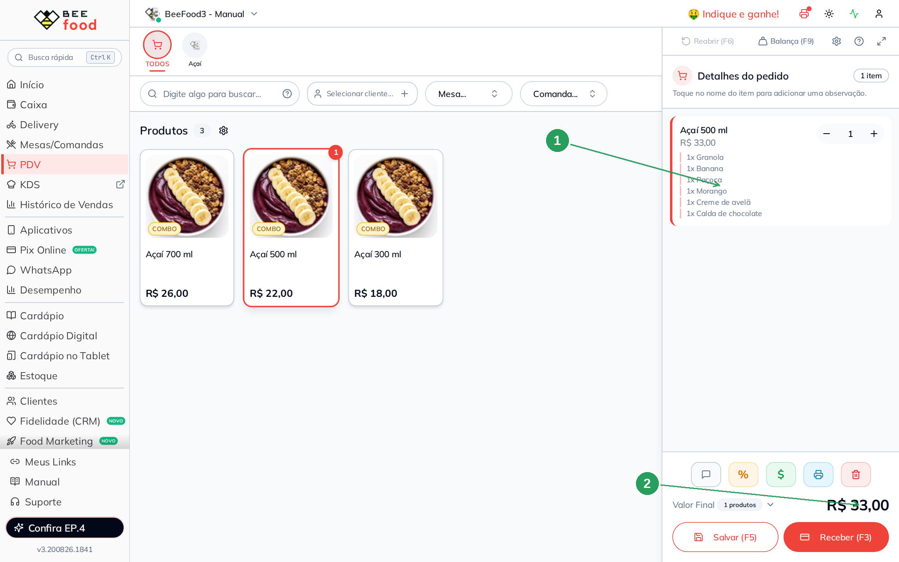

| Nº | Item | O que confere |
|----|------|---------------|
| 1 | **Escolhas listadas** | Os seis itens escolhidos, inclusos e pagos. **Tudo vai para quem monta o açaí.** |
| 2 | **Valor Final** | R$ 33,00. |

Os três tamanhos ficam assim no cardápio:

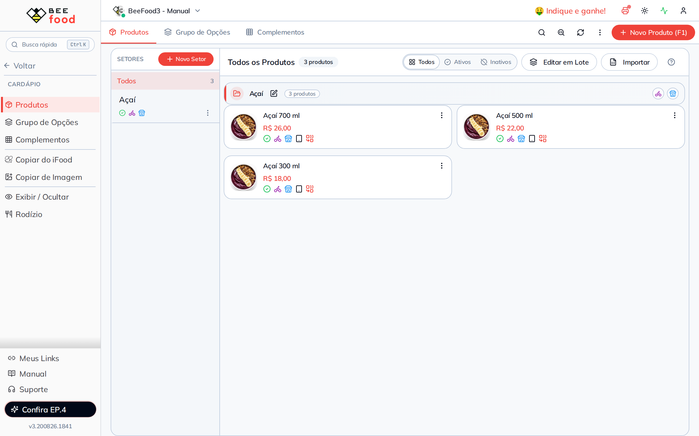

---

## Resumo das contas (conferido no PDV)

| Situação | Conta | Total |
|----------|-------|-------|
| Açaí 500 ml | 22,00 | **R$ 22,00** |
| + Granola, Banana e Paçoca (**inclusos**) | 22,00 + 0 | **R$ 22,00** |
| + Creme de avelã e Morango (**extras**) | 22,00 + 6,00 + 3,00 | **R$ 31,00** |
| + Calda de chocolate (**cobertura**) | 31,00 + 2,00 | **R$ 33,00** |

---

## Dica extra — Reajustar preços das opções em lote

Depois de montar complementos e grupos, use **Cardápio → Grupo de Opções → Opções**:

1. **Filtro** — encontre as opções pelo funil da coluna (Descrição, Grupo, Tipo ou Status).
2. **Edição** — para uma opção só, clique na linha dentro do grupo e altere o valor.
3. **Edição em lote** — marque várias e aplique o novo preço de uma vez.

Ideal para **reajuste de cardápio** sem abrir produto por produto — por exemplo, atualizar
Morango e Creme de avelã no grupo Acompanhamentos extras. Passo a passo com telas: manual
**Cardápio — fundamentos**, Parte 8.

> **Na açaiteria isso é especialmente útil**, porque a lista de acompanhamentos é longa. Duas
> cautelas: filtre pelo **grupo Acompanhamentos extras** (o grupo dos inclusos precisa continuar
> em R$ 0,00) e lembre que, com os grupos compartilhados, **um reajuste vale para os três
> tamanhos** de uma vez.

---

## Perguntas frequentes

**Como faço "os 3 primeiros grátis e o quarto pago" de verdade, no mesmo grupo?**
Não dá num grupo só — o sistema limita quantidade, não valor. O caminho é a dupla de grupos
deste manual: um Brinde com o limite dos inclusos e um Normal com os pagos. Na prática o cliente
entende bem, porque os dois grupos aparecem separados e com nomes claros.

**Tenho 20 acompanhamentos. Fica ruim?**
A lista fica longa no PDV, mas funciona. Duas coisas ajudam: dar **nomes curtos** e usar o campo
**Filtrar Texto** dentro do grupo na hora de cadastrar. Se muitos itens saem pouco, considere
tirá-los do cardápio: lista enorme atrasa o atendimento.

**Preciso repetir os grupos em cada tamanho?**
Você precisa **vincular** em cada um, mas são **os mesmos grupos** — não duplique. A aba
**Produtos** do grupo mostra em quais tamanhos ele está.

**Quero cobrar acompanhamento diferente por tamanho.**
Aí os grupos não podem ser compartilhados: clone o grupo (menu do grupo → **Clonar**) e vincule
a cópia só naquele tamanho, com os preços dele.

**Como faço açaí no copo e na tigela com preços diferentes?**
Do mesmo jeito que os tamanhos: um produto para cada. Se a diferença for só a embalagem, um
grupo **Normal** com máximo 1 e a embalagem paga também resolve.

**Vendo açaí por peso. Serve este manual?**
Parcialmente. A montagem dos acompanhamentos é igual, mas o preço por peso usa a **balança**,
que é outro assunto. O que vale daqui é a estrutura dos grupos.

**O acompanhamento incluso aparece na etiqueta e na cozinha?**
Sim. Tudo que o cliente escolhe entra no pedido — o Brinde só não soma no valor.

---

## Manuais relacionados

| Manual | O que traz |
|--------|------------|
| **Cardápio — fundamentos** | O fluxo completo, as quatro formações de preço e a edição em lote |
| **Cardápio — hambúrguer** | **Brinde** para ponto da carne e grupo **Obrigatório** |
| **Cardápio — pizza** | **Valor da Maior** e **Proporcional** para sabores e meio a meio |
| **Cardápio — comida japonesa** | Combinado com contagem exata de peças |
