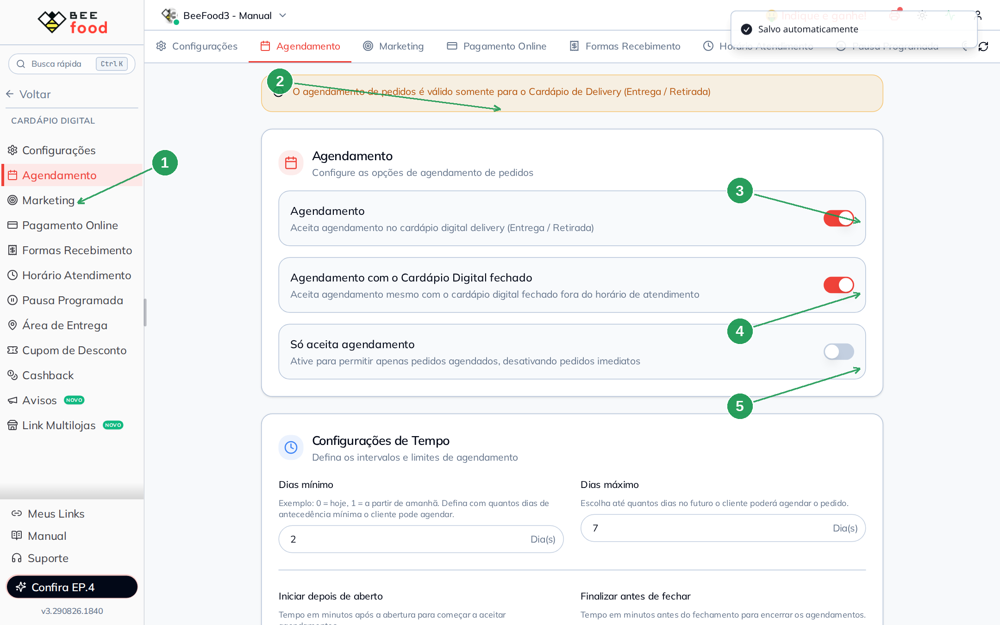
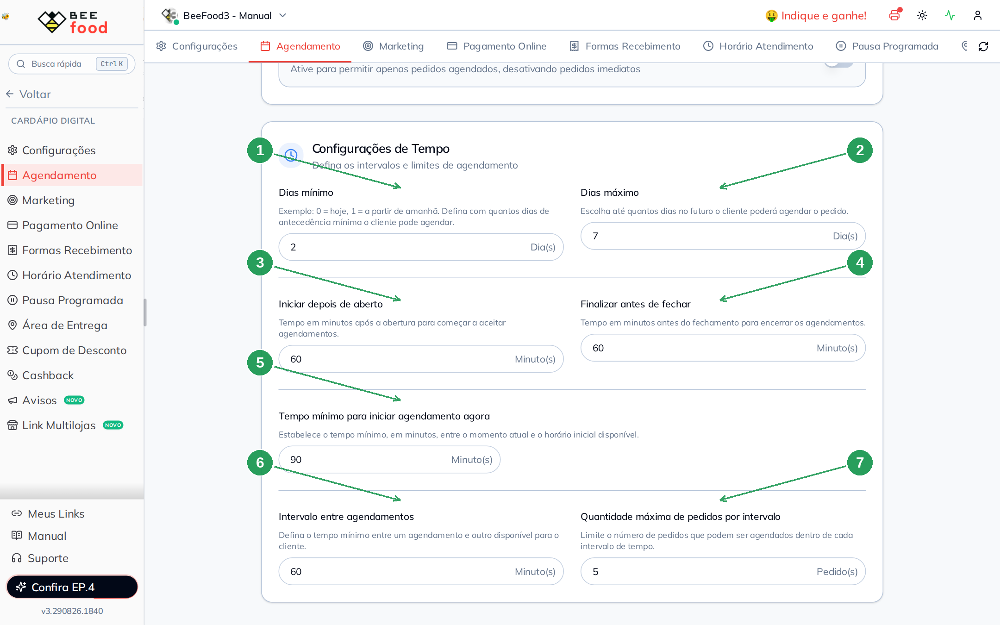

# Agendamento do cardápio digital

No cardápio digital o cliente pode **marcar data e hora** em vez de
pedir para agora. Você decide se aceita, até quando aceita e de quanto
em quanto tempo aparecem os horários.

O cliente escolhe isso na **sacola**, depois da modalidade (Entrega ou
Retirada). A tela se chama **AGENDAR PEDIDO**: em cima os **dias**,
embaixo a **Hora Aproximada**.

> As imagens têm **setas com números** (1, 2, 3…). No texto, cada
> número indica o campo ou botão correspondente na tela.

---

## Antes de começar

1. Menu **Cardápio Digital → Agendamento**.
2. A grade de **Horário de Atendimento** já precisa existir. Os
   horários da lista do cliente saem dela — esta aba só recorta e
   espaça.
3. **Não existe botão SALVAR.** A tela grava sozinha (*Salvo
   automaticamente*). Campo vazio ou fora da faixa **não grava**.
4. Vale **só para Delivery** (Entrega e Retirada). Não existe
   agendamento no presencial (QR Code / mesa).

Depois de gravar, o cardápio do cliente pode levar **até 5 minutos**.

Não clique em switch “só para ver”: cada toque grava.

---

## Parte 1 — Onde fica e as três chaves

No menu: **Cardápio Digital → Agendamento** (1). O aviso amarelo (2)
repete: o agendamento **não vale para o salão**.

Os três switches:

| Nº | Campo | O que faz no cardápio |
|----|--------|------------------------|
| 1. | **Agendamento** (menu) | Abre esta aba |
| 2. | Aviso | Só Entrega / Retirada |
| 3. | **Agendamento** | Chave geral. Ligado: na sacola, depois de escolher Entrega ou Retirada, aparecem **Hoje** e **Agendar**. Desligado: some o **Agendar** — o cliente só pede para agora |
| 4. | **Agendamento com o Cardápio Digital fechado** | Fora do horário o cliente ainda consegue tocar **Agendar**. Sem isto, loja fechada = não pede. Depende do (3) ligado |
| 5. | **Só aceita agendamento** | Some o **Hoje**. Só resta **Agendar**. Útil para encomenda. Deixe **desligado** se ainda quiser pedido imediato |

O card **Configurações de Tempo** só aparece com o (3) ligado.

---

## Parte 2 — Cada campo e a tela AGENDAR PEDIDO

Estes números recortam o calendário e a lista de horários. No exemplo
didático: **2 / 7 dias**, **60 / 60 / 90 / 60 minutos**, **5 pedidos**.

| Nº | Campo (faixa) | Onde aparece no AGENDAR PEDIDO |
|----|----------------|--------------------------------|
| 1. | **Dias mínimo** (0–30) | Primeira bolinha de **Dia**. `0` = **HOJE**. `1` = amanhã. `2` = depois de amanhã (some HOJE e o dia seguinte) |
| 2. | **Dias máximo** (1–60) | Quantas bolinhas cabem na faixa, **a contar do primeiro dia permitido**. `2` e `7` → de **TER 01** até **SEG 07** (sete dias). Não é “hoje + 7” |
| 3. | **Iniciar depois de aberto** (0–720 min) | Primeiro horário do dia = abertura da grade + estes minutos. `60` e loja às 01:00 → a lista começa em **02:00 – 02:30** |
| 4. | **Finalizar antes de fechar** (0–720 min) | Último horário = fechamento − estes minutos. `60` e fecha às 23:59 → a última faixa é **22:00 – 22:30** |
| 5. | **Tempo mínimo para iniciar agendamento agora** (0–1440 min) | **Só no dia de hoje.** O primeiro slot fica pelo menos N minutos à frente do relógio. Com dias mínimo `2` o cliente **não vê hoje**, então este campo não mexe na lista. Se o mínimo for `0`, `90` empurra o primeiro horário de hoje (ex.: 16:35 + 90 min → 18:05) |
| 6. | **Intervalo entre agendamentos** (1–240 min) | Espaço entre o **começo** de uma faixa e o da próxima. `60` → `02:00 – 02:30`, depois `03:00 – 03:30`. A faixa em si, neste cardápio, dura **30 minutos** |
| 7. | **Quantidade máxima de pedidos por intervalo** (1–999) | Quantos pedidos cabem em **uma** faixa. Quando enche, aquele horário **some** da lista. Não cria faixa nova |

A conta dos horários usa a grade de **Horário de Atendimento** da
sub-aba **Delivery**. Mude a grade e a lista muda. Dois turnos no
mesmo dia viram dois blocos na lista (almoço e jantar).

`0` em (3) = começa na abertura. `0` em (4) = vai até o fechamento.
`0` em (5) = no dia de hoje, o próximo intervalo já aparece.

---

## Parte 3 — O que o cliente vê

Na sacola: **Continuar** → modalidade → **Retirar no estabelecimento**
(ou Entrega). Não toque **Retirada** na home — abre o mapa.

Com o agendamento ligado e **Só aceita** desligado (1): **Hoje** é o
pedido imediato (tempo de retirada da grade). **Agendar** abre o
**AGENDAR PEDIDO**.

A faixa **Dia** (2) começa no dias mínimo. No exemplo (`2` e `7`,
hoje domingo 30/08): a primeira bolinha é **TER 01** e a última,
rolando a faixa, é **SEG 07**. Não aparece HOJE nem SEG 31.

A lista **Hora Aproximada** (3) são faixas, não um relógio livre. No
exemplo a primeira é **02:00 – 02:30** e a última **22:00 – 22:30**.
O cliente marca uma e toca **AGENDAR PEDIDO**.

| Nº | O que o cliente vê |
|----|--------------------|
| 1. | **Hoje** (agora) e **Agendar**. Com **Só aceita agendamento**, some o Hoje |
| 2. | Bolinhas de **Dia** — primeira e última saem dos dias mínimo / máximo |
| 3. | **Hora Aproximada** — primeira, última e o tamanho da faixa saem dos minutos (3), (4) e (6) da Parte 2 |

Pode levar **até 5 minutos**. **Não finalize** o pedido de teste. Se
aparecer cashback, use **CANCELAR**.

**Consumir no local** não agenda — o aviso da aba vale.

---

## Problemas comuns

| Sintoma | O que verificar |
|---------|-----------------|
| Cliente não vê **Agendar** | Switch **Agendamento** ligado? Modalidade é Entrega ou Retirada? Esperou **5 minutos**? |
| Loja fechada e ninguém pede | Falta **Agendamento com o Cardápio Digital fechado** |
| Some o **Hoje** | **Só aceita agendamento** está ligado |
| Calendário começa depois de amanhã | **Dias mínimo** maior que 0 |
| Poucos dias na faixa | **Dias máximo** |
| Primeiro horário tarde demais | **Iniciar depois de aberto** + abertura da grade; no dia de hoje, some o **Tempo mínimo… agora** |
| Lista acaba cedo | **Finalizar antes de fechar** + fechamento da grade |
| Faixas de 30 min em vez de 1 h | **Intervalo entre agendamentos** |
| Um horário some no meio do dia | Aquele intervalo já chegou na **quantidade máxima** |
| Cliente agenda no presencial | Não existe. Só Delivery |
| Procurou o botão Salvar | Não tem. Grava sozinha |

---

## O que esta tela não é

- **Horário de Atendimento:** a grade da semana (abre / fecha). Sem
  ela esta aba não tem de onde tirar horário.
- **Pausa temporária / programada:** fecha a loja agora ou numa data.
  Não monta calendário. Está no manual **Fechar a loja fora do
  horário**.
- **Só aceita agendamento** no cadastro do **produto:** outro
  interruptor, item a item. Não é esta aba.
- Filtro de pedidos agendados no **Delivery** (operar a fila): outra
  tela, outro assunto.

---

*Última atualização: agosto/2026 — BeeFood · Agendamento do cardápio digital*
