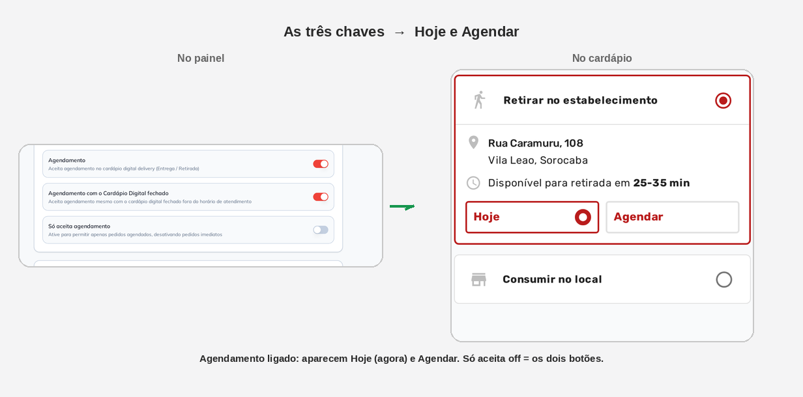
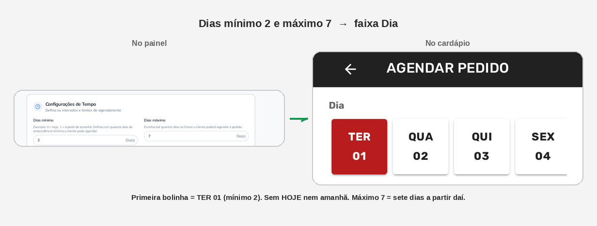
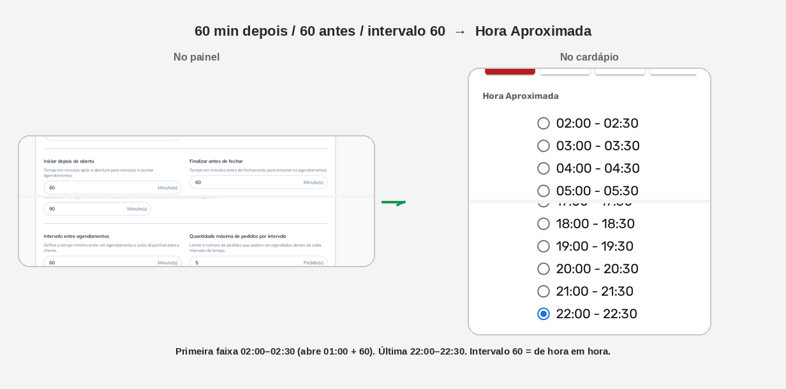
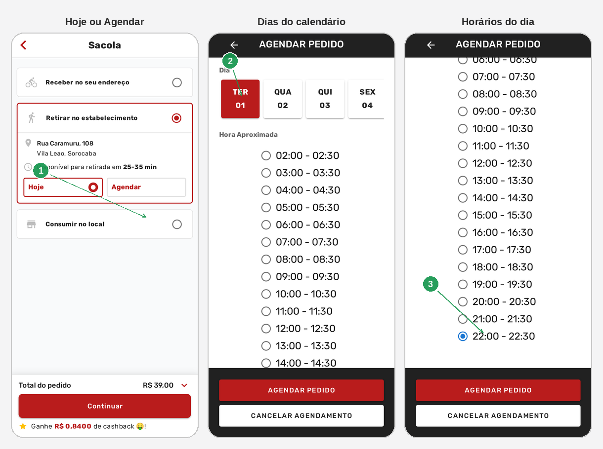

# Agendamento do cardápio digital

No cardápio digital o cliente pode **marcar data e hora** em vez de
pedir para agora. Você decide se aceita, até quando aceita e de quanto
em quanto tempo aparecem os horários.

O cliente escolhe isso na **sacola**, depois da modalidade (Entrega ou
Retirada). A tela se chama **AGENDAR PEDIDO**: em cima os **dias**,
embaixo a **Hora Aproximada**.

Nas imagens da Parte 2, o recorte da **esquerda** é o painel; o da
**direita** é o cardápio. A seta é o que aquele campo muda.

---

## Antes de começar

1. Menu **Cardápio Digital → Agendamento**.
2. A grade de **Horário de Atendimento** já precisa existir. Os
   horários da lista do cliente saem dela — esta aba só recorta e
   espaça.
3. **Não existe botão SALVAR.** A tela grava sozinha (*Salvo
   automaticamente*). Campo vazio ou fora da faixa **não grava**.
4. Vale **só para Delivery** (Entrega e Retirada). Não existe
   agendamento no presencial (QR Code / mesa).

Depois de gravar, o cardápio do cliente pode levar **até 5 minutos**.

Não clique em switch “só para ver”: cada toque grava.

---

## Parte 1 — Onde fica

No menu: **Cardápio Digital → Agendamento** (1). O aviso amarelo (2)
repete: o agendamento **não vale para o salão**.

| Nº | Campo | O que faz |
|----|--------|-----------|
| 1. | **Agendamento** (menu) | Abre esta aba |
| 2. | Aviso | Só Entrega / Retirada |
| 3. | **Agendamento** | Chave geral |
| 4. | **… com o Cardápio Digital fechado** | Pede fora do horário |
| 5. | **Só aceita agendamento** | Some o pedido imediato |

O card **Configurações de Tempo** só aparece com o (3) ligado.

---

## Parte 2 — Do painel para o cardápio

Cada figura é um recorte: **o que você liga ou digita** → **o que o
cliente vê**. Exemplo didático: mínimo **2**, máximo **7**, **60** min
depois de abrir, **60** antes de fechar, intervalo **60**, **5**
pedidos por faixa.

### As três chaves

**Agendamento** ligado solta os botões **Hoje** e **Agendar** na
retirada (e na entrega). **Hoje** = pedido imediato (25–35 min da
grade). **Agendar** abre o calendário.

**Só aceita agendamento** desligado = os dois botões. Se ligar, some
o **Hoje**. O segundo switch (loja fechada) não muda esses botões —
ele só deixa o **Agendar** funcionar fora do horário.

### Dias mínimo e máximo

`2` some **HOJE** e o dia seguinte. A primeira bolinha vira
**TER 01** (hoje é domingo 30/08). `7` é quantas bolinhas cabem **a
partir dessa primeira**, não “hoje + 7”: a faixa vai até **SEG 07**.
Role para o lado para ver os últimos dias.

`0` no mínimo = a primeira bolinha é **HOJE**. `1` = amanhã.

### Primeiro horário, último e o intervalo

A lista **Hora Aproximada** não é um relógio livre. Cada linha é uma
faixa. A conta usa a grade de **Horário de Atendimento**:

- **Iniciar depois de aberto 60** + loja às 01:00 → primeira faixa
  **02:00 – 02:30**
- **Finalizar antes de fechar 60** + fecha às 23:59 → última faixa
  **22:00 – 22:30**
- **Intervalo 60** → o *começo* da próxima faixa anda 1 hora
  (02:00, 03:00, 04:00…). A faixa em si, neste cardápio, dura
  **30 minutos**

**Tempo mínimo para iniciar agendamento agora** (90 min) só mexe no
**dia de hoje**. Com mínimo `2` o cliente não vê hoje, então este
campo não aparece na lista. Se o mínimo for `0`, o primeiro horário
de hoje fica pelo menos 90 minutos à frente do relógio.

**Quantidade máxima** (5) = quantos pedidos cabem numa faixa. Quando
enche, aquele horário **some**. Não cria faixa nova.

`0` em iniciar = começa na abertura. `0` em finalizar = vai até o
fechamento.

Dois turnos na grade (almoço e jantar) viram dois blocos na lista.

---

## Parte 3 — O fluxo inteiro no celular

Na sacola: **Continuar** → **Retirar no estabelecimento** (ou
Entrega). Não toque **Retirada** na home — abre o mapa.

(1) **Hoje** ou **Agendar**. (2) A faixa **Dia**. (3) A
**Hora Aproximada** — o cliente marca uma e toca **AGENDAR PEDIDO**.

| Nº | O que o cliente vê |
|----|--------------------|
| 1. | **Hoje** e **Agendar** — saem das três chaves |
| 2. | Bolinhas de **Dia** — saem dos dias mínimo / máximo |
| 3. | **Hora Aproximada** — saem da grade + iniciar / finalizar / intervalo |

Pode levar **até 5 minutos**. **Não finalize** o pedido de teste. Se
aparecer cashback, use **CANCELAR**.

**Consumir no local** não agenda.

---

## Problemas comuns

| Sintoma | O que verificar |
|---------|-----------------|
| Cliente não vê **Agendar** | Switch **Agendamento** ligado? Modalidade é Entrega ou Retirada? Esperou **5 minutos**? |
| Loja fechada e ninguém pede | Falta **Agendamento com o Cardápio Digital fechado** |
| Some o **Hoje** | **Só aceita agendamento** está ligado |
| Calendário começa depois de amanhã | **Dias mínimo** maior que 0 |
| Poucos dias na faixa | **Dias máximo** |
| Primeiro horário tarde demais | **Iniciar depois de aberto** + abertura da grade; no dia de hoje, some o **Tempo mínimo… agora** |
| Lista acaba cedo | **Finalizar antes de fechar** + fechamento da grade |
| Faixas de 30 min em vez de 1 h | **Intervalo** é o passo entre os *inícios*, não a duração da faixa |
| Um horário some no meio do dia | Aquele intervalo já chegou na **quantidade máxima** |
| Cliente agenda no presencial | Não existe. Só Delivery |
| Procurou o botão Salvar | Não tem. Grava sozinha |

---

## O que esta tela não é

- **Horário de Atendimento:** a grade da semana (abre / fecha). Sem
  ela esta aba não tem de onde tirar horário.
- **Pausa temporária / programada:** fecha a loja agora ou numa data.
  Está no manual **Fechar a loja fora do horário**.
- **Só aceita agendamento** no cadastro do **produto:** outro
  interruptor, item a item.
- Filtro de pedidos agendados no **Delivery**: outra tela.

---

*Última atualização: agosto/2026 — BeeFood · Agendamento do cardápio digital*
