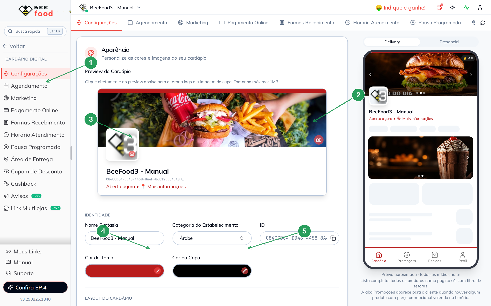
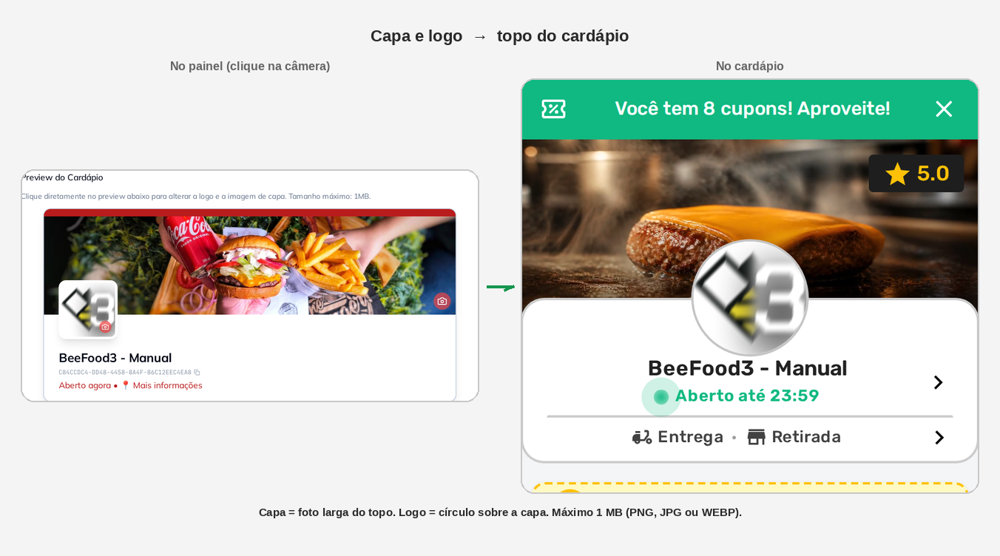
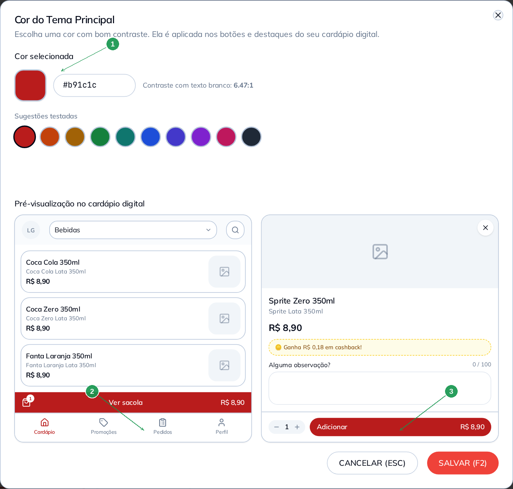
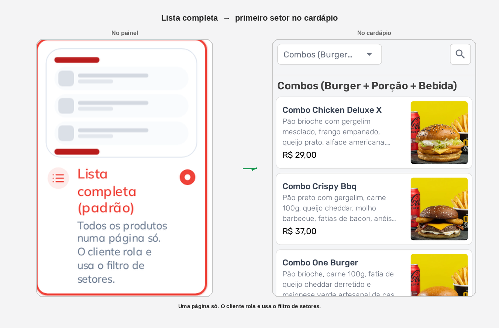
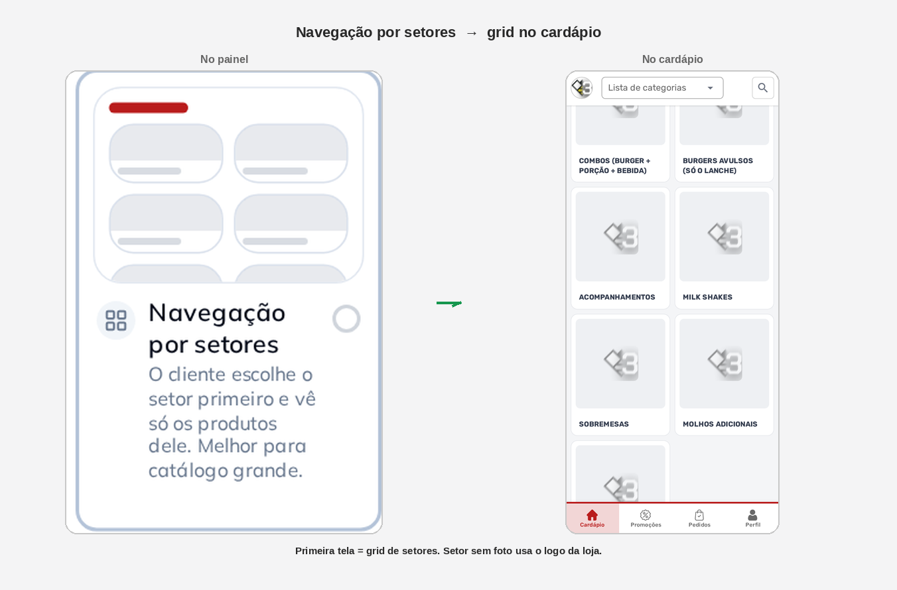
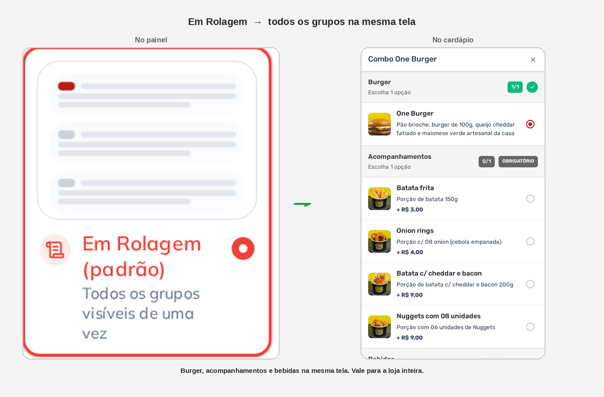
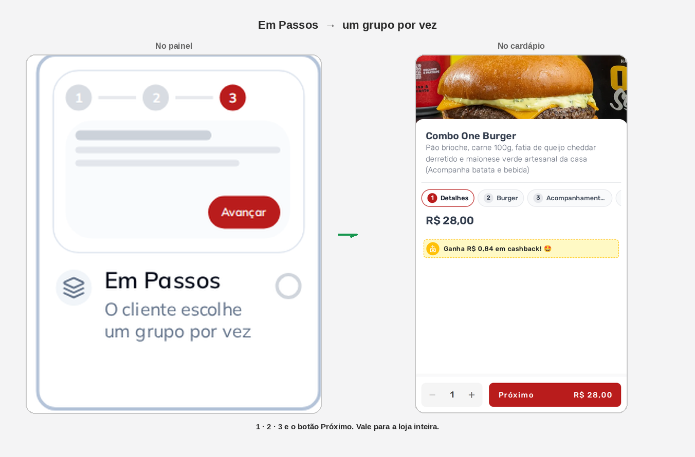
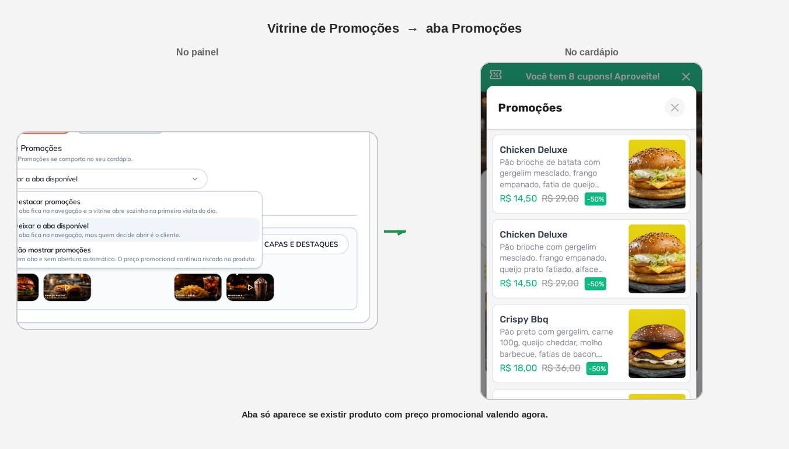

# Aparência e layout do cardápio digital

No cardápio digital você escolhe **a cara da loja** (capa, logo e
cores) e **como o cliente navega** (lista ou setores, rolagem ou
passos, aba de promoções).

Tudo fica no mesmo card: **Cardápio Digital → Configurações →
Aparência**. Nas figuras da Parte 2 em diante, o recorte da
**esquerda** é o painel; o da **direita** é o cardápio. A seta é o
que aquele campo muda.

> Capas **com vídeo e carrossel** são outro assunto — manual
> **Capas e Destaques**. Aqui a capa é a **foto fixa** do preview.

---

## Antes de começar

1. Menu **Cardápio Digital → Configurações**.
2. **Não existe botão SALVAR.** A tela grava sozinha (*Salvo
   automaticamente*). Não clique numa opção “só para ver”.
3. Capa e logo: **PNG, JPG ou WEBP**, até **1 MB**. O sistema
   otimiza. Sem recorte — a foto entra como `object-cover`.
4. Foto do **setor** (usada na navegação por setores) se cadastra em
   **Cardápio → Setores**, não nesta tela.

Depois de gravar, o cardápio do cliente pode levar **até 1 minuto**.

---

## Parte 1 — Onde fica

No menu: **Cardápio Digital → Configurações** (1). O card
**Aparência** abre com o preview. Clique na **capa** (2) ou na
**logo** (3) — o ícone de câmera vermelho marca o alvo. Embaixo
ficam **Cor do Tema** (4) e **Cor da Capa** (5).

À direita, no computador, um aparelho mostra a prévia na hora.

| Nº | Campo | O que faz |
|----|--------|-----------|
| 1. | **Configurações** | Aba desta tela |
| 2. | **Capa** | Foto larga do topo. Clique para trocar |
| 3. | **Logo** | Quadrado sobre a capa. Clique para trocar |
| 4. | **Cor do Tema** | Abre o modal da cor (botões, aba ativa) |
| 5. | **Cor da Capa** | Fundo da capa quando não há imagem |

**Nome Fantasia** e **Categoria do Estabelecimento** ficam em
**Identidade**. O **ID** é só leitura — serve para o suporte.

---

## Parte 2 — Capa e logo no cardápio

Clique direto no preview. Não há outro botão de upload. No hover
aparecem enviar e o **X** para remover.

A capa fixa é o **primeiro slide** do carrossel. Os banners do
manual **Capas e Destaques** entram **depois**. Capa fixa aceita
só imagem; vídeo mora naquele outro modal.

---

## Parte 3 — Cor do Tema

Clique na barra **Cor do Tema**. Abre o modal **Cor do Tema
Principal**. Escolha na paleta ou cole o hexadecimal (1). O próprio
modal já mostra o cardápio: **Ver sacola** (2) e **Adicionar** (3)
na cor nova.

Contraste com texto branco abaixo de **4,5:1** gera aviso. Use uma
cor mais escura da paleta.

| Nº | Campo | O que faz |
|----|--------|-----------|
| 1. | Cor + hexadecimal | A cor dos botões e da aba ativa |
| 2. | **Ver sacola** | Prévia no rodapé da lista |
| 3. | **Adicionar** | Prévia no produto |

**SALVAR (F2)** só confirma no modal. A aba grava sozinha em
seguida. **Cor da Capa** é o seletor preto ao lado — fundo quando
a capa não tem foto.

---

## Parte 4 — Lista completa ou setores

**Layout do cardápio** decide a primeira tela que o cliente vê.

**Lista completa (padrão)** — todos os produtos numa página. O
cliente rola e usa o filtro de setores. No exemplo o filtro está
em *Combos* e já aparecem os produtos daquele setor.

**Navegação por setores** — o cliente escolhe o setor primeiro e
só então vê os produtos. Melhor para catálogo grande. Setor **sem
foto** usa o logo da loja no card: cadastre a imagem em
**Cardápio → Setores**.

---

## Parte 5 — Rolagem ou passos no produto

**Layout de seleção das opções no produto** vale para a **loja
inteira**. Exemplo: **Combo One Burger** (burger + acompanhamento +
bebida).

**Em Rolagem (padrão)** — os três grupos na mesma tela. O cliente
rola até o fim e toca **Adicionar**.

**Em Passos** — um grupo por vez, com **1 · 2 · 3** (Detalhes,
Burger, acompanhamentos…) e o botão **Próximo**. Quem prefere ir
direto ao total usa a rolagem.

---

## Parte 6 — Vitrine de Promoções

Três jeitos da aba **Promoções** no rodapé. A aba **só existe** se
houver produto com preço promocional valendo naquele horário
(preço programado, por exemplo).

| Opção | O que o cliente vê |
|-------|-------------------|
| **Destacar promoções** | A aba fica no rodapé e a vitrine **abre sozinha** na primeira visita do dia |
| **Deixar a aba disponível** | A aba fica no rodapé; quem abre é o cliente |
| **Não mostrar promoções** | Sem aba. O preço riscado **continua** no produto |

No exemplo do sandbox: **Deixar a aba disponível**. O cliente toca
**Promoções** e vê a lista (Milk Shake, burgers em oferta…).

---

## Problemas comuns

| Sintoma | O que verificar |
|---------|-----------------|
| Capa/logo não mudou | Esperou **1 minuto**? Arquivo até **1 MB**? Recarregou o cardápio? |
| Procurou o botão Salvar | Não tem. Grava sozinha |
| Setor sem foto no grid | Falta imagem em **Cardápio → Setores** (o card usa o logo) |
| Aba Promoções sumiu | Não há produto em promoção **agora**, ou a opção é **Não mostrar** |
| “Mudei a cor e o botão não mudou” | Confirme no modal e espere o auto-save + 1 minuto |
| Queria vídeo na capa | Isso é **Capas e Destaques**, não o clique do preview |
| Clicou a opção só para ver | Já gravou. Volte à opção anterior |

---

## O que esta tela não é

- **Capas e Destaques:** carrossel e vitrine com imagem **ou vídeo**.
- **Avisos:** recado (feriado, salão fechado), sem vender produto.
- **Agendamento:** data e hora do pedido.
- **Horário de Atendimento:** abre / fecha a loja.

---

*Última atualização: agosto/2026 — BeeFood · Aparência e layout do cardápio digital*
