# Manual de Avisos do Cardápio Digital

Este manual ensina a colocar um **recado no cardápio** — feriado, horário novo, salão
fechado — sem cadastrar um produto de R$ 0,00.

O aviso **não vende**. Ele não abre o combo, não vai para o carrinho e não tem botão de
pedir. Quem quer mostrar um produto usa **Destaques**, na aba Configurações.

> As imagens têm **setas numeradas** (1, 2, 3…). Cada número indica o campo ou botão
> correspondente na tela.

---

## Duas coisas para saber antes de começar

**1. Não existe data de calendário.** Os chips são dia da semana (domingo a sábado), não
“7 de setembro”. Num feriado você liga o aviso e, no dia seguinte, **pausa** ou **apaga**.
Se deixar só na segunda, ele volta a aparecer em toda segunda.

**2. Não existe botão Salvar na aba.** Cada ação grava na hora: enviar a imagem, salvar o
modal, arrastar a ordem, apagar. Fechar o modal sem salvar **descarta** o aviso recém-enviado
(o título é obrigatório).

> ⚠️ Depois de gravar, o cardápio do cliente pode levar **até 1 minuto** para atualizar.
> Não é instantâneo, e isso é normal.

---

## Onde fica

No menu lateral: **Cardápio Digital → Avisos** (1). A aba ainda está marcada como *Novo*.

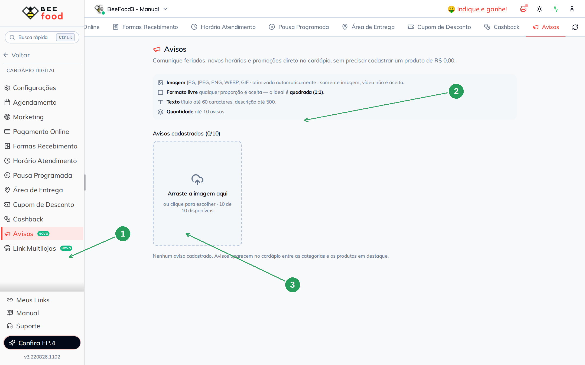

| Nº | Item | Para que serve |
|----|------|----------------|
| 1 | **Avisos** | A tela deste manual. |
| 2 | **Bloco de regras** | Imagem só (sem vídeo), formato ideal **quadrado (1:1)**, título até 60, descrição até 500, no máximo **10** avisos. |
| 3 | **Arraste a imagem aqui** | É por aqui que o aviso nasce. Sem imagem o card não entra. |

O texto da tela ainda fala em “promoções”. Ignore: promoção de produto é **destaque**. Aviso
é recado.

---

## Parte 1 — Enviar a imagem (o cartaz)

O cliente lê o aviso **no celular**. A imagem **é** a mensagem: texto grande, alto contraste,
quadrado. Foto de fachada com um papelzinho na porta some na tela pequena.

Arraste o arquivo ou clique na área pontilhada (a seta 3 da imagem acima). Vale JPG, PNG,
WEBP ou GIF. Vídeo é recusado — para vídeo, use Capas e Destaques.

O sistema otimiza a imagem sozinho. Se a proporção não for perto de 1:1, aparece um aviso
de que pode cortar em alguns aparelhos.

Assim que a imagem sobe, abre o modal **Editar aviso**. O título vem vazio e é
**obrigatório** (1). Sem título, o aviso não grava. A descrição (2) é opcional: sem ela, o
cliente vê o cartaz mas **não abre o detalhe** ao tocar.

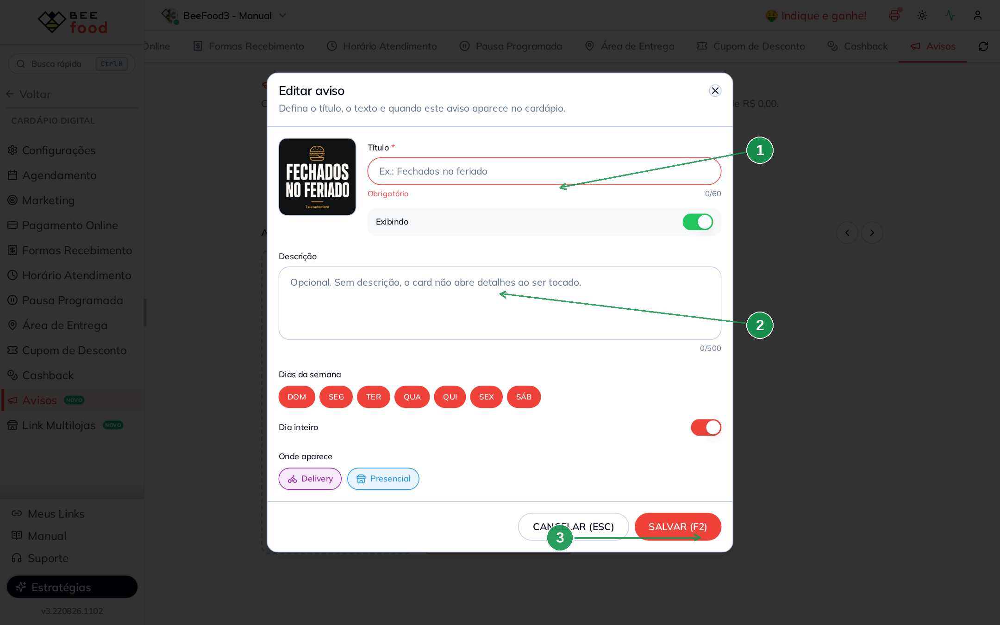

| Nº | Item | O que fazer |
|----|------|-------------|
| 1 | **Título \*** | Obrigatório. Ex.: *Fechados no feriado*. |
| 2 | **Descrição** | Opcional. É o texto do modal no cardápio. |
| 3 | **SALVAR (F2)** | Grava. **CANCELAR (ESC)** descarta este aviso novo. |

---

## Parte 2 — O recado do feriado

No exemplo da hamburgueria, o primeiro aviso é só isto: a loja não abre no 7 de setembro.

O cartaz (1) já carrega a mensagem. O título (2) e a descrição (3) repetem o recado para
quem toca o card. Os dias (4) ficam todos ligados e **Dia inteiro** ligado — no feriado
você liga o aviso e depois pausa. **SALVAR (F2)** (5).

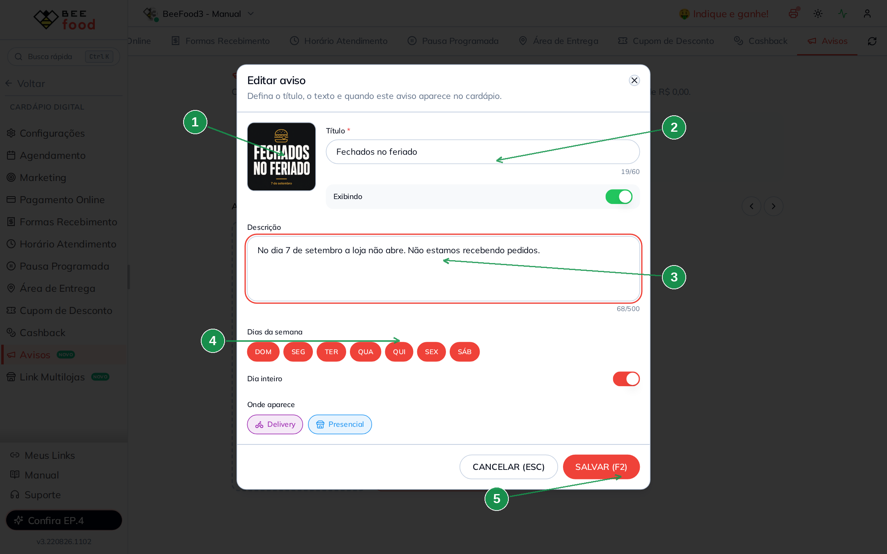

| Nº | Item | O que fazer |
|----|------|-------------|
| 1 | **Cartaz** | A imagem que o cliente lê no celular. |
| 2 | **Título** | *Fechados no feriado*. |
| 3 | **Descrição** | *No dia 7 de setembro a loja não abre. Não estamos recebendo pedidos.* |
| 4 | **Dias da semana** | Todos, neste exemplo. Não dá para marcar uma data. |
| 5 | **SALVAR (F2)** | Grava. O switch **Exibindo** já vem ligado. |

O switch **Exibindo / Pausado** (ao lado do título) desliga o aviso sem apagar. Use no dia
seguinte ao feriado.

---

## Parte 3 — Horário novo, só de noite

Quando o recado vale só numa faixa, desligue **Dia inteiro** (2). Aparecem **Início** (3) e
**Fim** (4). No exemplo: segunda a sábado, 18:00 às 23:00. O domingo (1) ficou de fora.

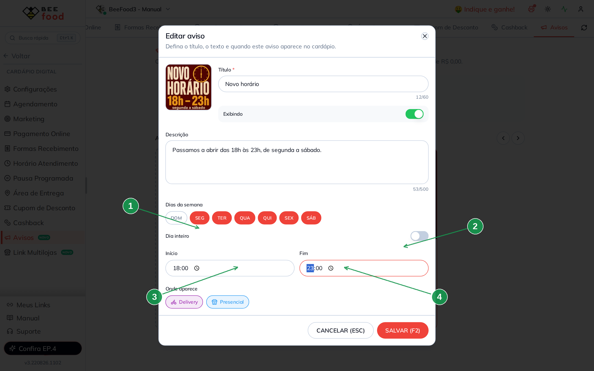

| Nº | Item | O que fazer |
|----|------|-------------|
| 1 | **DOM** | Desmarcado. O aviso não aparece no domingo. |
| 2 | **Dia inteiro** | Desligado, para valer só a faixa. |
| 3 | **Início** | 18:00. |
| 4 | **Fim** | 23:00. O início precisa ser menor que o fim. A faixa **não cruza meia-noite**. |

Quem decide se o aviso está no ar é o **relógio do celular do cliente**. Fora da faixa, o
card some sozinho.

---

## Parte 4 — Só no delivery

Cada aviso escolhe o canal: **Delivery**, **Presencial** ou os dois. Não dá para desmarcar
os dois.

No terceiro exemplo o salão está fechado: só **Delivery** (1) fica ligado. **Presencial**
(2) fica de fora — quem pede pela mesa não vê este recado.

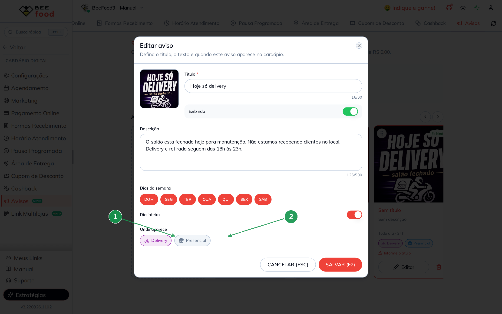

| Nº | Item | O que fazer |
|----|------|-------------|
| 1 | **Delivery** | Ligado. Roxo, com o ícone da moto. |
| 2 | **Presencial** | Desligado. Azul, com o ícone da loja. |

---

## Parte 5 — Os três avisos na aba

A lista é um carrossel. A ordem da esquerda para a direita é a ordem no cardápio. Arraste
pela alça do card para reordenar — grava na hora.

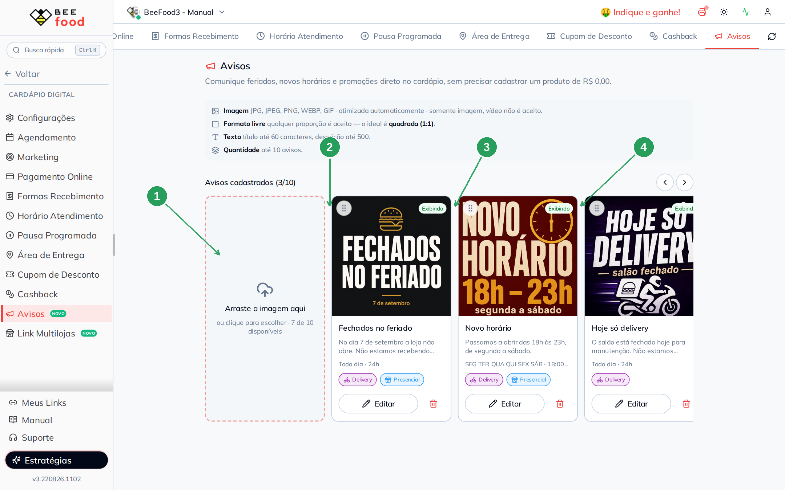

| Nº | Item | O que é |
|----|------|---------|
| 1 | **Dropzone** | Ainda cabem 7. O limite é 10. |
| 2 | **Fechados no feriado** | Todo dia · 24h · Delivery e Presencial. |
| 3 | **Novo horário** | Seg a sáb · a faixa que você gravou. |
| 4 | **Hoje só delivery** | Todo dia · 24h · só Delivery. |

O selo verde **Exibindo** fica no canto do cartaz. **Editar** reabre o modal. A lixeira
pede confirmação e grava na hora:

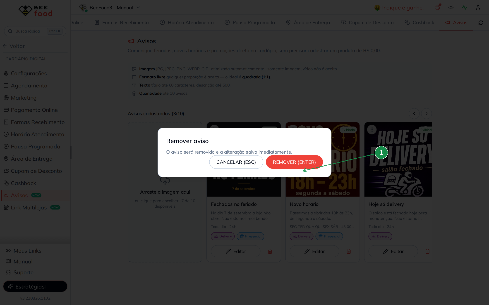

| Nº | Botão | O que fazer |
|----|-------|-------------|
| 1 | **REMOVER (ENTER)** | Apaga. **CANCELAR (ESC)** mantém. |

---

## Parte 6 — O que o cliente vê no computador

Espere até 1 minuto e abra o cardápio. Os avisos entram **entre o filtro de categorias e
os produtos** — não misturam com o combo.

No desktop cabem os três cards lado a lado. Toque em qualquer um com descrição para ler
o detalhe. Não existe botão de pedir.

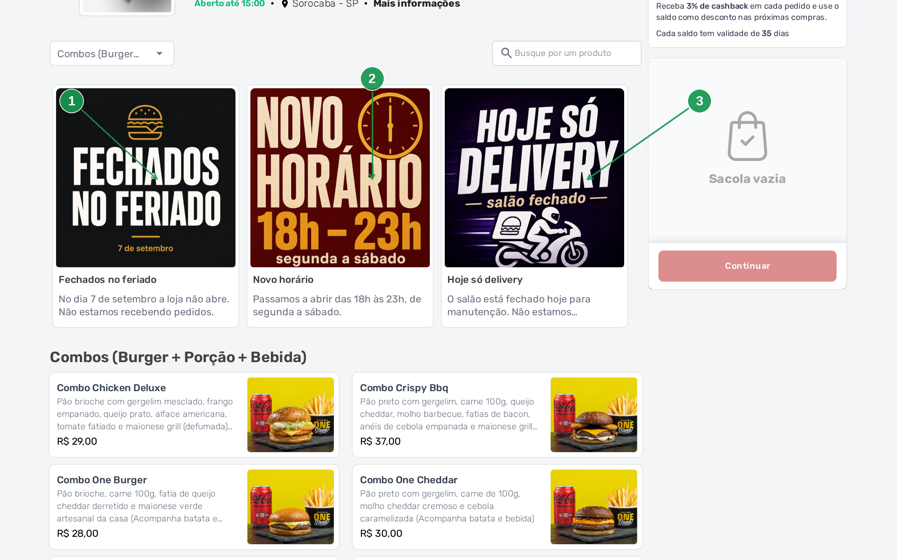

| Nº | Aviso | Recado |
|----|-------|--------|
| 1 | **Fechados no feriado** | A loja não abre no 7 de setembro. |
| 2 | **Novo horário** | 18h às 23h, segunda a sábado. |
| 3 | **Hoje só delivery** | Salão fechado; delivery segue. |

O detalhe abre um modal com o cartaz em cima e o texto embaixo. Só fecha — o X no canto.

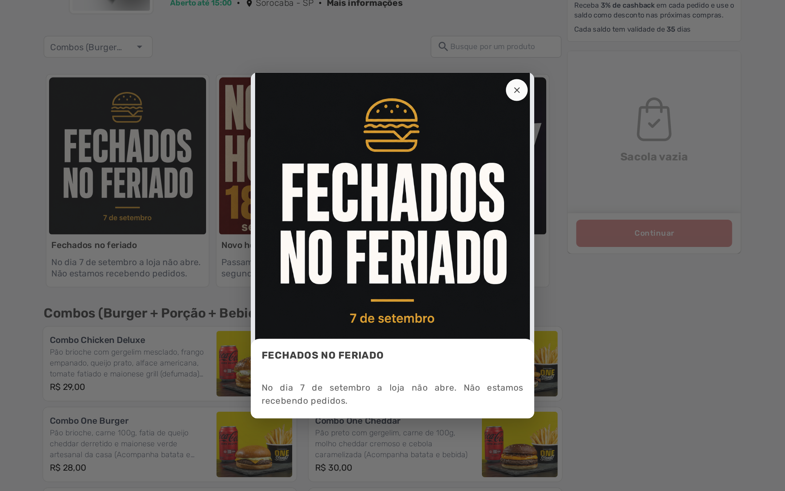

---

## Parte 7 — O que o cliente vê no celular

No celular a faixa vira carrossel: um card e meio, o próximo já espiando. Arraste para o
lado. O cartaz precisa ser lido **assim**, sem zoom — por isso o texto grande na imagem.

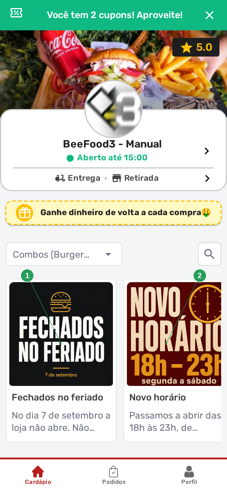

| Nº | Aviso | O que o cliente lê no cartaz |
|----|-------|------------------------------|
| 1 | **Fechados no feriado** | FECHADOS NO FERIADO · 7 de setembro |
| 2 | **Novo horário** | NOVO HORÁRIO · 18h – 23h |

Toque no card (quando há descrição) abre o recado inteiro. O único botão é **FECHAR**.

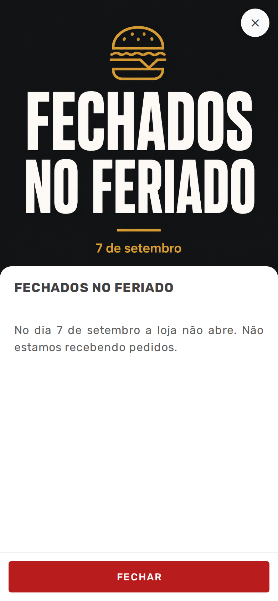

---

## Resumo do caminho

```
1. Cardápio Digital → Avisos
2. Arraste um cartaz quadrado (1:1), com o recado em texto grande
3. Título obrigatório · descrição se quiser que o toque abra detalhe
4. Dias da semana + Dia inteiro ou faixa de hora
5. Delivery, Presencial ou os dois
6. SALVAR (F2)
7. Espere até 1 minuto e confira no cardápio (computador e celular)
```

---

## Perguntas frequentes

**Posso usar o aviso para o combo do dia?**
Não. Combo é produto. Coloque em **Destaques** ou no próprio cardápio. O aviso não tem
call to action e não leva a nenhum item.

**Marquei só o domingo e o aviso não aparece hoje.**
Hoje não é domingo. Quem decide é o dia e a hora **do celular do cliente**.

**Desliguei Dia inteiro, pus 18:00 → 02:00, e o horário sumiu.**
A faixa não cruza meia-noite. O sistema joga de volta para dia inteiro se o início não
for menor que o fim. Para madrugada, use a grade de **Horário de atendimento**.

**Salvei e o cliente ainda não vê.**
Espere até 1 minuto e peça para atualizar a página do cardápio.

**Fechei o modal sem salvar e o aviso sumiu.**
É o esperado no aviso novo: sem título ele não entra na lista.

**Quantos avisos posso ter?**
Até 10. Sem nenhum, a faixa some do cardápio.

**O aviso vale para todas as lojas?**
Não. É por cardápio (filial).

---

## Manuais relacionados

- **Horário de atendimento** — a grade da semana (que horas a loja abre).
- **Fechar a loja fora do horário** — pausa agora ou numa data; é outro caminho.
- **Capas e Destaques** (aba Configurações) — para mostrar produto, com imagem ou vídeo.
