# Manual de Capas e Destaques

Este manual ensina a colocar **banners no cardápio digital**: o carrossel do topo
(as capas) e a vitrine no meio da página (os destaques da loja). A grande
vantagem desta tela é aceitar **vídeo**, não só imagem — o cliente vê a comida
em movimento, no celular e no computador.

> Quem precisa de um **recado** (feriado, horário, salão fechado), sem vender
> nada, usa o manual **Avisos do cardápio digital**. Aviso não aceita vídeo.

> As imagens têm **setas numeradas** (1, 2, 3…). Cada número indica o campo ou
> botão correspondente na tela.

---

## Duas coisas para saber antes de começar

**1. São dois lugares diferentes.** Não é a mesma capa.

| Grupo | Onde o cliente vê |
|-------|-------------------|
| **Destaques da capa** | Carrossel no **topo**, junto com a foto de capa da loja |
| **Destaques da sua loja** | Vitrine **abaixo** do nome, junto das categorias |

Cada grupo aceita até **5** mídias. Imagem e vídeo podem se misturar.

**2. Esta tela não grava sozinha.** Diferente do horário e dos avisos, aqui o
modal acumula as mudanças. Só o **SALVAR (F2)** publica. Fechar com alteração
aberta pede confirmação e **descarta** o que não foi salvo.

> ⚠️ Depois de salvar, o cardápio do cliente pode levar **até 1 minuto** para
> atualizar. Não é instantâneo, e isso é normal.

---

## Onde fica

No menu lateral: **Cardápio Digital → Configurações**. Role até o cartão
**Capas e Destaques** (1), ainda marcado como *Novo*.

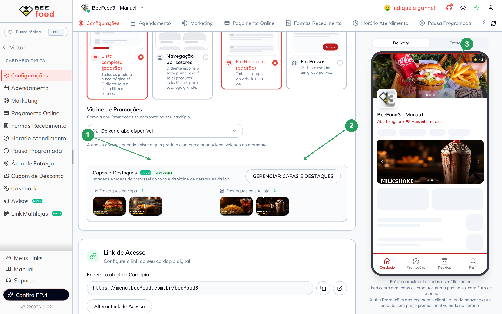

| Nº | Item | Para que serve |
|----|------|----------------|
| 1 | **Capas e Destaques** | O cartão desta tela. Mostra as miniaturas do que já está cadastrado. |
| 2 | **GERENCIAR CAPAS E DESTAQUES** | Abre o modal. Se ainda não houver mídia, o botão diz *Configurar capas e destaques*. |
| 3 | **Prévia do celular** | À direita, um aparelho de verdade — capa, carrossel e vitrine rodando. |

No exemplo da hamburgueria ficaram **4 mídias**: duas no topo (uma imagem e um
vídeo) e duas na vitrine (outra imagem e outro vídeo). A prévia já mostra a
vitrine com o milkshake.

---

## Parte 1 — Abrir o modal e ler as regras

Clique em **GERENCIAR CAPAS E DESTAQUES**. O modal explica o que entra:

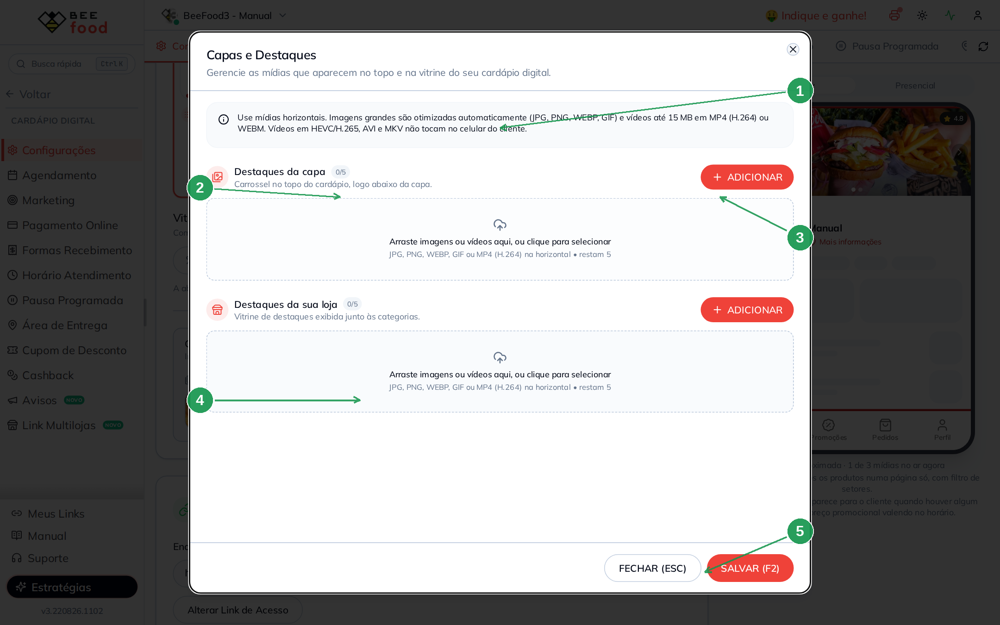

| Nº | Item | O que observar |
|----|------|----------------|
| 1 | **Aviso de formato** | Mídia **horizontal**. Imagem JPG, PNG, WEBP ou GIF (o sistema otimiza). Vídeo até **15 MB** em **MP4 (H.264)** ou WEBM. HEVC/H.265, AVI e MKV **não tocam no celular** do cliente. |
| 2 | **Destaques da capa** | Carrossel do topo. Contador `0/5`. |
| 3 | **ADICIONAR** | Abre o seletor de arquivo. Dá para arrastar para a área pontilhada. |
| 4 | **Destaques da sua loja** | A vitrine. Outro `0/5`, outro **ADICIONAR**. |
| 5 | **SALVAR (F2)** | Só este botão publica. **FECHAR (ESC)** sai sem gravar, se não houver mudança. |

A capa **fixa** da loja (a foto grande no preview do topo da aba) continua
sendo a primeira imagem do carrossel. Os **destaques da capa** entram **depois**
dela, como slides extras. A capa fixa aceita só imagem; vídeo mora neste modal.

---

## Parte 2 — Uma imagem no topo (Combo do dia)

No grupo **Destaques da capa**, clique em **ADICIONAR** (ou arraste o arquivo).
No exemplo, uma foto horizontal do hambúrguer com o texto *COMBO DO DIA*.

A linha nasce já **ligada**, todos os dias, nos dois canais:

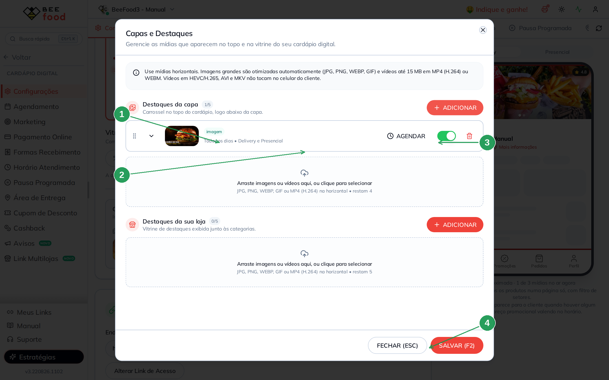

| Nº | Item | O que fazer |
|----|------|-------------|
| 1 | **Miniatura + badge imagem** | Confirma que o arquivo entrou. |
| 2 | **Todos os dias · Delivery e Presencial** | Padrão de fábrica. Mude no **AGENDAR**. |
| 3 | **Interruptor** | Verde = no ar. Desligar **pausa** sem apagar. |
| 4 | **SALVAR (F2)** | Ainda não clique — vamos incluir o vídeo. |

A imagem precisa ser **mais larga do que alta**. Foto de pé é recusada. Arquivo
grande o sistema comprime sozinho (até 2 MB / 1920 px).

---

## Parte 3 — Um vídeo no mesmo carrossel

A vantagem desta tela: no mesmo grupo, **ADICIONAR** de novo e escolha um
**MP4 (H.264)** horizontal. No exemplo, o hambúrguer na chapa — 5 segundos,
sem áudio (o cardápio toca mudo de propósito).

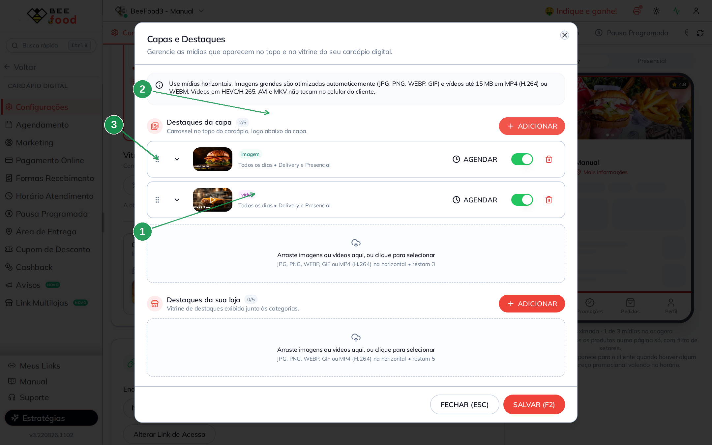

| Nº | Item | O que observar |
|----|------|----------------|
| 1 | **Badge vídeo** (roxo) | Diferente do verde *imagem*. A miniatura ganha o ícone de play. |
| 2 | **Contador 2/5** | Ainda cabem três. |
| 3 | **Ordem** | A alça à esquerda arrasta. O primeiro da lista é o primeiro slide depois da capa fixa. |

**Vídeo na vertical** abre o recorte **Ajustar vídeo**: enquadre em 16:9,
**APLICAR RECORTE (F2)**. Só entra vídeo de até 60 segundos nesse recorte.
Saída: 1280×720, sem som.

Não use HEVC/H.265 (o padrão de muito iPhone). No Android a tela fica **preta**
e o sistema nem avisa erro. Exporte em MP4 H.264. Acima de 5 MB o envio
aceita, mas o 4G do cliente pode demorar — o sistema avisa.

---

## Parte 4 — Agendar dia, hora e canal

Cada mídia tem o próprio calendário. Clique em **AGENDAR**:

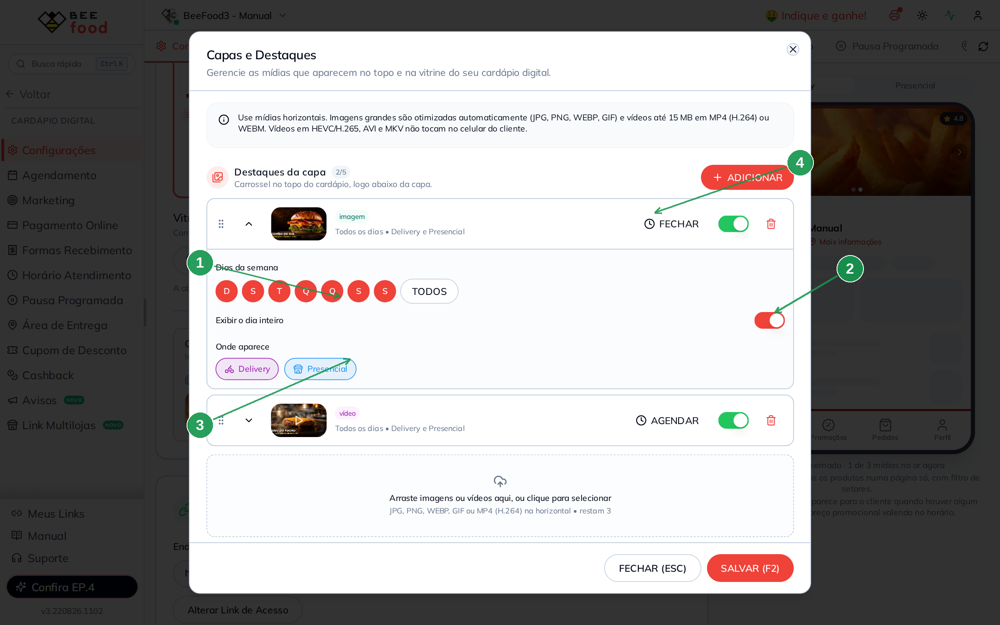

| Nº | Item | O que fazer |
|----|------|-------------|
| 1 | **Dias da semana** | Bolinhas D S T Q Q S S (domingo a sábado). **TODOS** marca a semana. Sem nenhum dia, o sistema recusa o salvamento. |
| 2 | **Exibir o dia inteiro** | Ligado = 24 h naqueles dias. Desligado: aparecem **Início** e **Fim**. |
| 3 | **Onde aparece** | **Delivery** e **Presencial**. Pelo menos um. |
| 4 | **FECHAR** | Recolhe a agenda. A linha resume: *Todos os dias · Delivery e Presencial*. |

Quem decide se está no ar é o **relógio do celular do cliente**. Marcou só
sábado e hoje é sexta — a mídia some, sem aviso.

A faixa de hora **não cruza meia-noite**. 18:00 → 02:00 o painel recusa (início
igual ou depois do fim). No servidor, horário inválido vira dia inteiro — a
mídia aparece o dia todo até você corrigir.

---

## Parte 5 — A vitrine: destaques da loja

Role o modal até **Destaques da sua loja**. É o mesmo mecanismo: **ADICIONAR**,
imagem ou vídeo, agenda, interruptor. No exemplo, *BATATA + REFRI* (imagem) e
*MILKSHAKE* (vídeo).

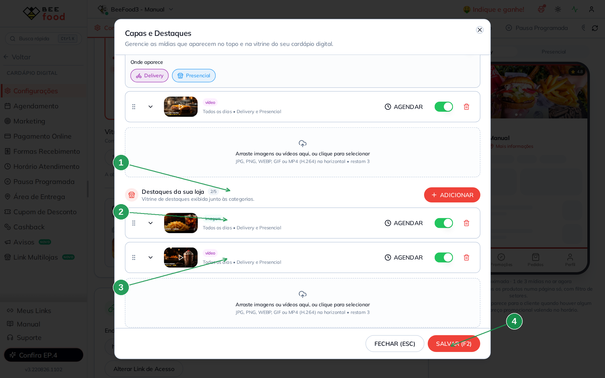

| Nº | Item | O que fazer |
|----|------|-------------|
| 1 | **Destaques da sua loja** | Contador `2/5`. Independente do grupo de cima. |
| 2 | **Imagem** | Primeiro slide da vitrine. |
| 3 | **Vídeo** | Segundo slide. O cliente vê as setas e as bolinhas. |
| 4 | **SALVAR (F2)** | Agora sim: publica os dois grupos de uma vez. |

A lixeira pede confirmação (*OK! (ENTER)*). A mídia só some do cardápio **depois
de salvar**.

---

## Parte 6 — Conferir na prévia do celular

Feche o modal depois de salvar. À direita da aba Configurações (no computador)
o aparelho já reproduz o que está **no ar agora**:

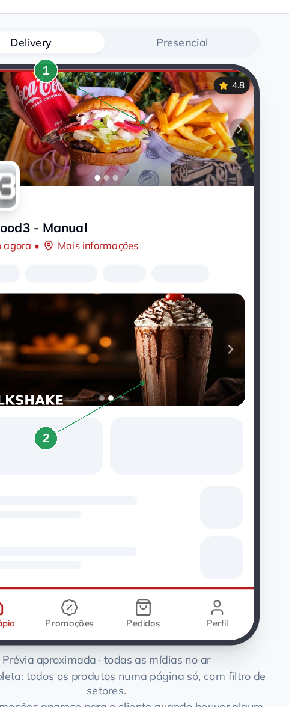

| Nº | Item | O que é |
|----|------|---------|
| 1 | **Carrossel da capa** | A foto fixa mais os destaques da capa. Setas e bolinhas quando há mais de um slide. |
| 2 | **Vitrine** | Os destaques da loja, abaixo do nome. No exemplo, o milkshake. |

Se o presencial estiver ligado, um alternador **Delivery / Presencial** no topo
da prévia mostra o que muda em cada canal. A frase embaixo avisa quantas mídias
estão no ar — as outras estão fora da agenda.

---

## Parte 7 — Como o cliente vê no computador

Espere até 1 minuto e abra o cardápio
(`https://menu.beefood.com.br/seu-link`). No desktop o layout é largo: a capa
ocupa o topo, a vitrine vem logo abaixo do nome.

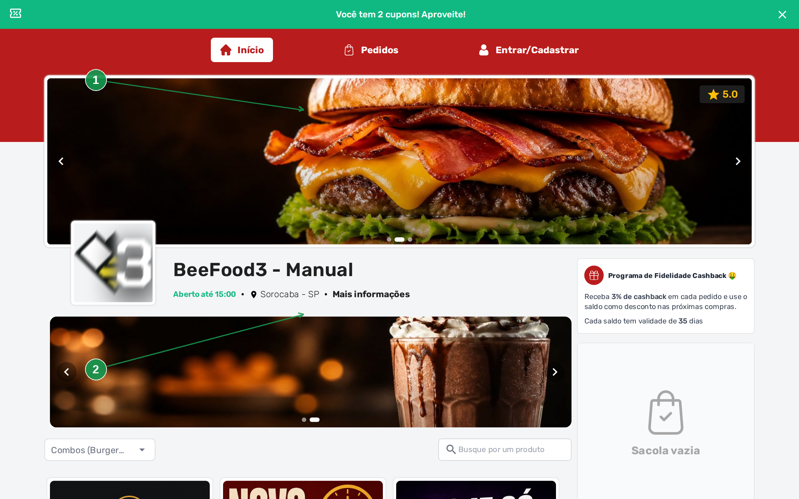

| Nº | Item | O que o cliente vê |
|----|------|--------------------|
| 1 | **Capa** | Foto fixa + slides dos destaques da capa. Setas nas laterais, bolinhas embaixo. Vídeo toca sozinho, sem som. |
| 2 | **Vitrine** | Destaques da loja, no corpo da página. |

Role um pouco e a vitrine fica inteira na tela — no exemplo, *BATATA + REFRI*
(a imagem) no primeiro slide:

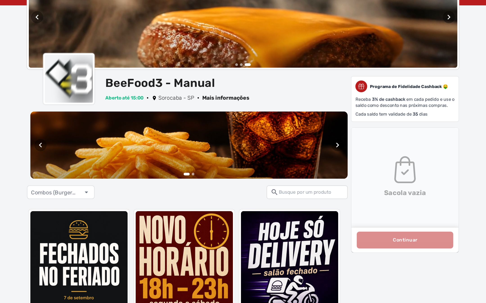

Os cartazes quadrados mais abaixo **não são** destaques: são os **Avisos**
(feriado, horário). Outra aba, outro manual.

---

## Parte 8 — Como o cliente vê no celular

No celular a mesma configuração vira uma coluna só. A capa fica no topo; a
vitrine, no meio — é aí que o vídeo faz diferença, tela cheia, sem clicar em
nada.

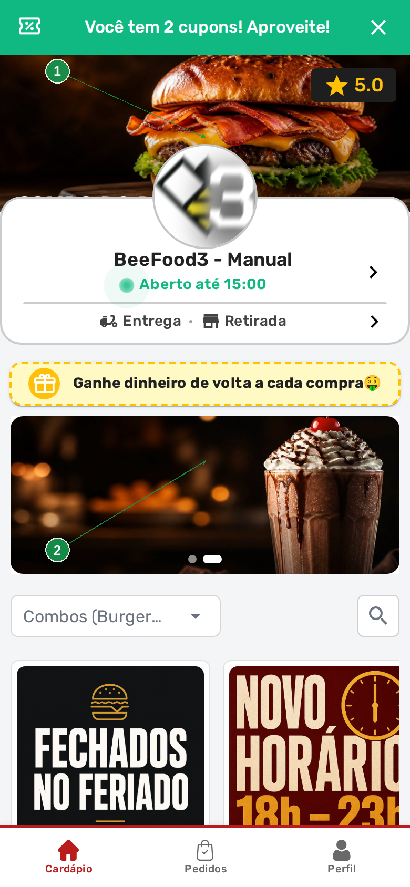

| Nº | Item | O que o cliente vê |
|----|------|--------------------|
| 1 | **Capa** | Mesmo carrossel do desktop, no formato do aparelho. |
| 2 | **Vitrine** | Um banner largo; o próximo slide já espiando nas bolinhas. |

Role até a vitrine para ver o outro destaque (*BATATA + REFRI*) e, embaixo, os
avisos quadrados — de novo, outra coisa:

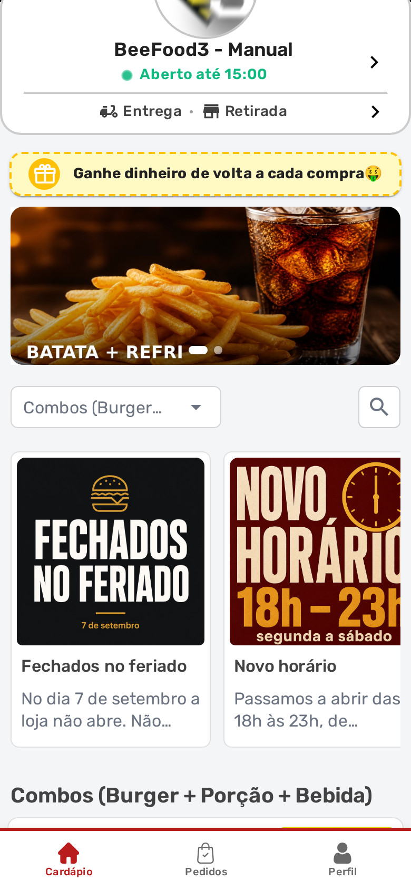

O texto do banner precisa ser **grande**. Foto só de comida, sem frase, some
no aparelho pequeno. Por isso os exemplos deste manual levam *COMBO DO DIA*,
*BATATA + REFRI* e *MILKSHAKE* escritos na própria arte.

---

## Resumo do caminho

```
1. Cardápio Digital → Configurações → Capas e Destaques
2. GERENCIAR CAPAS E DESTAQUES
3. Destaques da capa: imagem e/ou vídeo horizontal (até 5)
4. Destaques da loja: outro grupo, as mesmas regras (até 5)
5. AGENDAR: dias, dia inteiro ou faixa, Delivery e/ou Presencial
6. SALVAR (F2) — sem este clique, nada vai para o cliente
7. Espere até 1 minuto e confira no cardápio (computador e celular)
```

---

## Perguntas frequentes

**Posso usar o aviso para o combo do dia?**
Não. Combo é destaque (esta tela) ou produto. O aviso não tem botão de pedir e
não aceita vídeo.

**Mandei um vídeo do iPhone e no Android fica tela preta.**
Provavelmente está em HEVC/H.265. Converta para **MP4 H.264**. O painel recusa
quando consegue detectar; se passar, o celular do cliente que sofre.

**A imagem é vertical e o sistema recusou.**
Capa e destaque exigem **largura maior que altura**. Vire a arte ou recorte.
Vídeo vertical abre o recorte 16:9 no próprio navegador (Chrome).

**Agendei 18:00 às 02:00 e a faixa sumiu.**
Não cruza meia-noite. Use 18:00–23:59, ou deixe o dia inteiro.

**Salvei e o cliente ainda vê a capa antiga.**
Espere até 1 minuto e peça para atualizar a página do cardápio.

**Fechei o modal e as mídias novas sumiram.**
Não tinha clicado em **SALVAR (F2)**. Diferente dos avisos, aqui não grava a
cada envio.

**Quantas mídias posso ter?**
Até 5 no topo e 5 na vitrine, por cardápio (filial).

**O vídeo tem som?**
Não. O recorte e o cardápio tocam **mudos** de propósito.

**A capa fixa (a foto do preview) também aceita vídeo?**
Não. A capa fixa é só imagem. Vídeo entra em **Destaques da capa** ou
**Destaques da sua loja**.

---

## Manuais relacionados

- **Avisos do cardápio digital** — recado operacional, só imagem quadrada.
- **Horário de atendimento** — que horas a loja abre.
- **Fechar a loja fora do horário** — pausa agora ou numa data.
