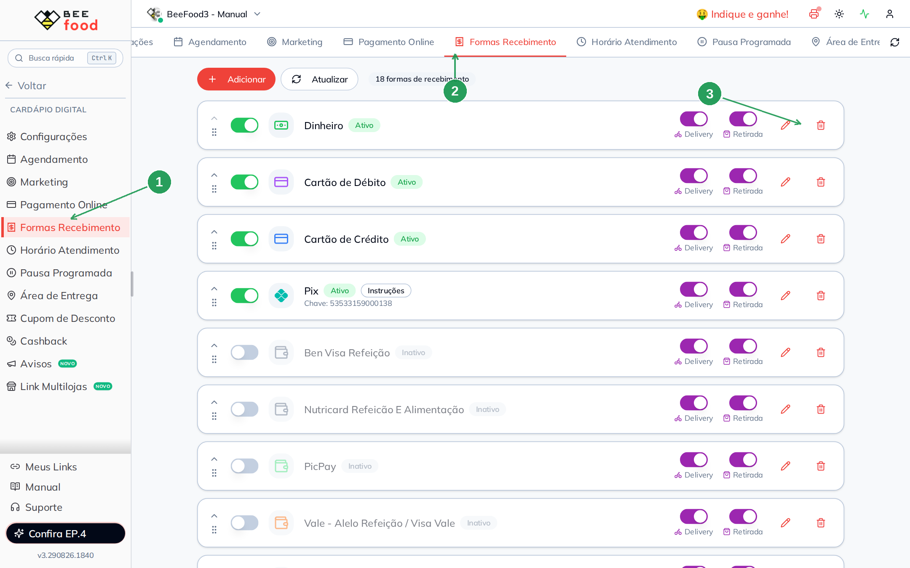
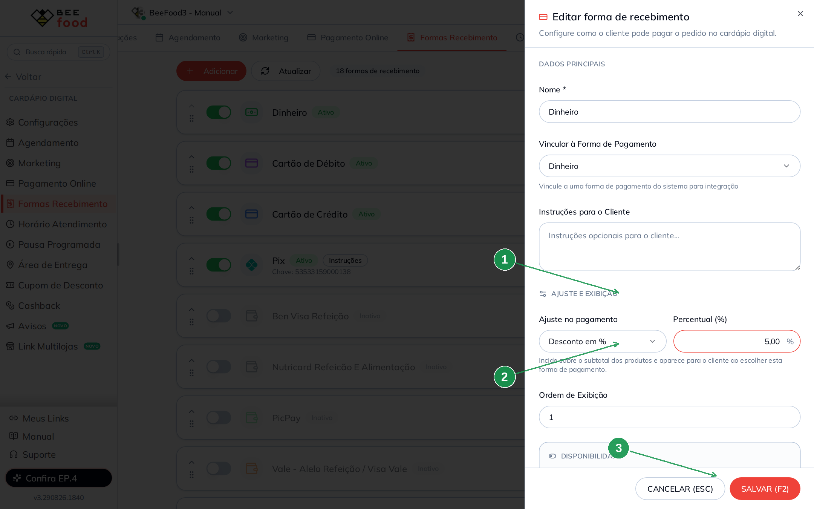
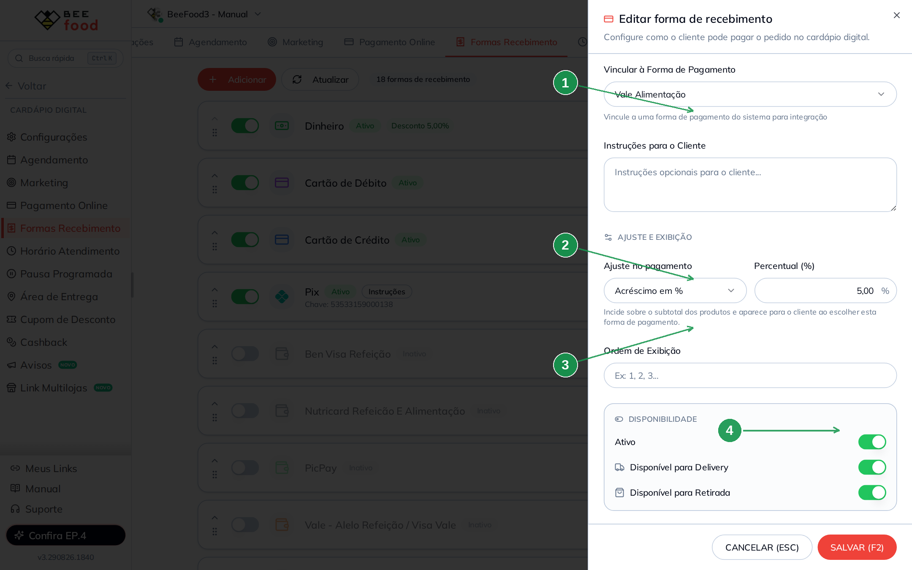
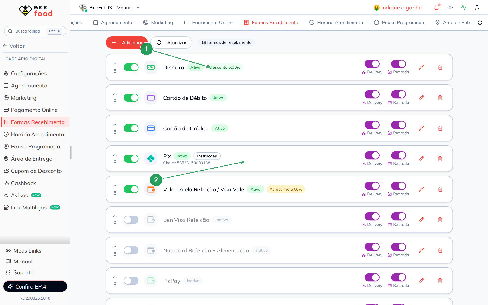
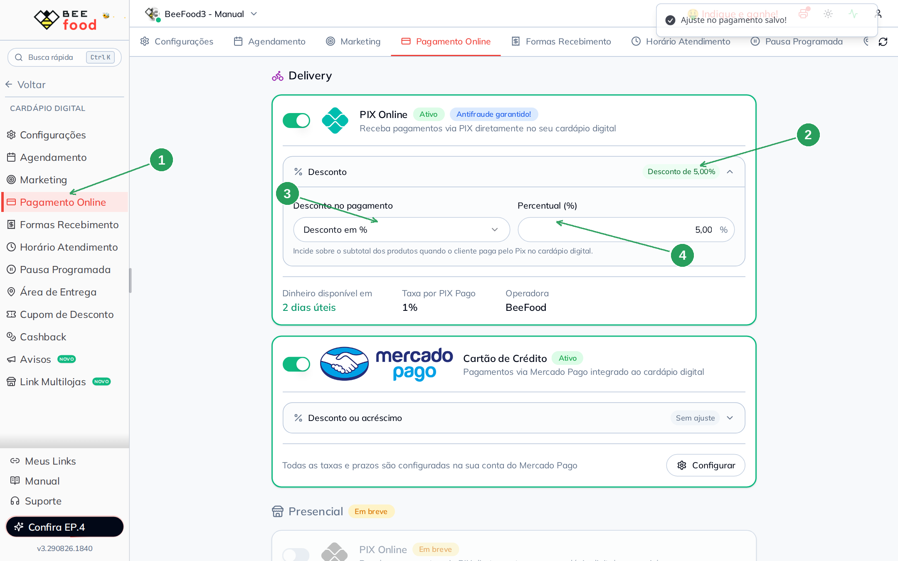
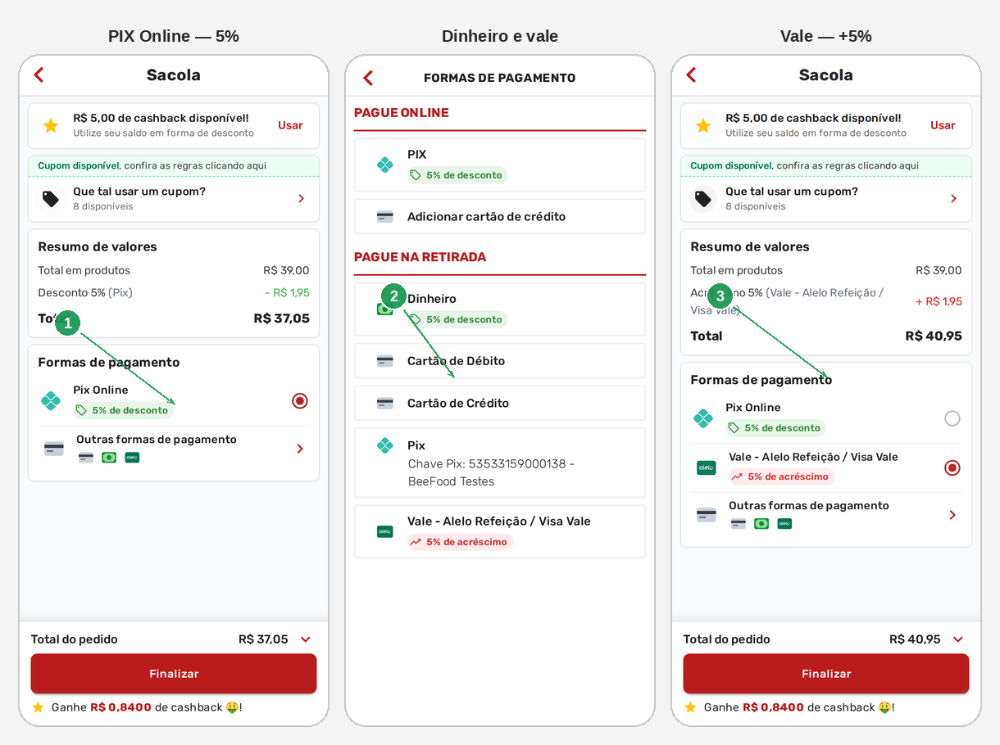

# Desconto e acréscimo nas formas de recebimento

No cardápio digital você pode **baratear** ou **encarecer** o pedido conforme
a forma que o cliente escolhe. O ajuste incide sobre o **subtotal dos
produtos** e aparece na hora, no fechamento da sacola.

Dois lugares, com o mesmo efeito para o cliente:

1. **Pagamento Online** — o **PIX Online** (só desconto) e o cartão Mercado Pago
2. **Formas Recebimento** — dinheiro, cartão na entrega, vale, Pix com chave…

Neste manual: **5% de desconto no PIX Online**, **5% de desconto no dinheiro**
e **5% de acréscimo no vale alimentação** (Alelo).

> As imagens têm **setas com números** (1, 2, 3…). No texto, cada número indica
> o campo ou botão correspondente na tela.

---

## Antes de começar

1. Acesso a **Cardápio Digital**.
2. O **PIX Online** já precisa estar contratado e **Ativo** se você quiser o
   desconto nele. Ligar o PIX é outro assunto; aqui só entra o ajuste.
3. As formas “normais” já existem na lista (Dinheiro, vales…). Este manual
   **não** cria forma nova — só liga e põe desconto ou acréscimo.

A configuração do **PIX Online grava sozinha**. Nas **Formas Recebimento**
existe **SALVAR (F2)**. Não clique em switch “só para ver”.

Depois de gravar, o cardápio do cliente pode levar **até 1 minuto**.

---

## Parte 1 — Onde fica (sem ajuste)

No menu: **Cardápio Digital → Formas Recebimento** (1). A aba de cima é a
mesma (2). Sem ajuste, a lista **não mostra badge** de desconto nem de
acréscimo — só Ativo ou Inativo.

Para configurar uma forma, clique no **lápis** (3). Não use o switch da
lista só para experimentar: ele liga ou desliga a forma no cardápio.

| Nº | Campo | O que faz |
|----|--------|-----------|
| 1. | **Formas Recebimento** | Formas que o cliente vê no fechamento (exceto o PIX Online) |
| 2. | Aba **Formas Recebimento** | A mesma tela |
| 3. | **Lápis** | Abre o editor daquela forma |

**PIX Online** não está nesta lista. Ele fica na aba **Pagamento Online**
(Parte 5). O **Pix** da lista é outro: chave colada, o cliente paga e envia o
comprovante.

---

## Parte 2 — Desconto no dinheiro

No editor da forma **Dinheiro**, a seção **Ajuste e exibição** tem o
**Ajuste no pagamento** (1). As opções:

- **Sem ajuste** — preço cheio
- **Desconto em %** ou **Desconto em R$**
- **Acréscimo em %** ou **Acréscimo em R$**

No exemplo: **Desconto em %** e **5,00** no percentual (2). Grave com
**SALVAR (F2)** (3).

| Nº | Campo | O que faz |
|----|--------|-----------|
| 1. | **Ajuste no pagamento** | Tipo do ajuste. Aqui: **Desconto em %** |
| 2. | **Percentual (%)** | Quanto tira do subtotal. **5,00** |
| 3. | **SALVAR (F2)** | Grava. Cancelar descarta |

O texto da tela lembra: o valor **aparece para o cliente** ao escolher esta
forma.

---

## Parte 3 — Acréscimo no vale alimentação

O caminho é o mesmo. No exemplo usamos o **Vale - Alelo Refeição / Visa Vale**,
já vinculado à forma de pagamento **Vale Alimentação** (1).

**Ajuste no pagamento:** **Acréscimo em %** (2). **Percentual:** **5,00** (3).
Ligue **Ativo** (4) — vale inativo **não aparece** no cardápio. **SALVAR (F2)**.

| Nº | Campo | O que faz |
|----|--------|-----------|
| 1. | **Vincular à Forma de Pagamento** | Liga a opção do cardápio à forma do sistema (aqui: Vale Alimentação) |
| 2. | **Ajuste no pagamento** | **Acréscimo em %** |
| 3. | **Percentual (%)** | Quanto soma no subtotal. **5,00** |
| 4. | **Ativo** | Sem isso, o cliente não vê o vale |

**Disponível para Delivery** e **Disponível para Retirada** controlam o canal.
No exemplo os dois ficam ligados.

---

## Parte 4 — A lista depois de gravar

A lista ganha um badge em cada forma com ajuste: **Desconto 5,00%** no
Dinheiro (1) e **Acréscimo 5,00%** no vale (2).

| Nº | O que conferir |
|----|----------------|
| 1. | **Dinheiro** — Ativo + **Desconto 5,00%** |
| 2. | **Vale - Alelo…** — Ativo + **Acréscimo 5,00%** |

Para **zerar**, abra o lápis, escolha **Sem ajuste** e salve. O badge some.

---

## Parte 5 — Desconto no PIX Online

Aba **Pagamento Online** (1). No card do **PIX Online**, toque em
**Desconto** / **Sem desconto**. Abre o ajuste **na hora** (grava sozinho —
não tem SALVAR).

Opções do PIX Online: **Sem desconto**, **Desconto em %**, **Desconto em R$**.
**Não existe acréscimo** no PIX Online.

No exemplo: **Desconto em %** (3) e **5,00** (4). O badge vira **Desconto de
5,00%** (2). O toast *Ajuste no pagamento salvo!* confirma a gravação.

| Nº | Campo | O que faz |
|----|--------|-----------|
| 1. | **Pagamento Online** | PIX Online e cartão Mercado Pago |
| 2. | Badge **Desconto de 5,00%** | O cliente vai ver “5% de desconto” no PIX |
| 3. | **Desconto no pagamento** | **Desconto em %** |
| 4. | **Percentual (%)** | **5,00** — grava ao sair do campo |

O **cartão Mercado Pago** (abaixo) aceita **desconto ou acréscimo** — as
mesmas cinco opções das formas normais (**Sem ajuste**, % / R$, desconto /
acréscimo). No exemplo ele ficou **Sem ajuste**.

**Presencial** nesta aba ainda está *Em breve*.

---

## Parte 6 — O que o cliente vê

No cardápio (`menu.beefood.com.br/…`), o ajuste só aparece **no fechamento**,
quando o cliente escolhe a forma. Não está na home.

Exemplo: Combo One Burger **R$ 39,00**, retirada. Sem usar cashback nem cupom:

| Forma | Badge | Conta | Total |
|-------|-------|-------|-------|
| **PIX Online** | 5% de desconto | − R$ 1,95 | **R$ 37,05** |
| **Dinheiro** | 5% de desconto | − R$ 1,95 | **R$ 37,05** |
| **Vale Alelo** | 5% de acréscimo | + R$ 1,95 | **R$ 40,95** |

O **PIX Online** fica em destaque. **Dinheiro** e **vale** estão em
**Outras formas de pagamento** (Pague na retirada).

| Nº | O que o cliente vê |
|----|--------------------|
| 1. | **PIX Online** escolhido: linha **Desconto 5% (Pix) − R$ 1,95** e total **R$ 37,05** |
| 2. | Lista **Outras formas**: **Dinheiro** com 5% de desconto e o **vale** com 5% de acréscimo |
| 3. | **Vale** escolhido: linha **Acréscimo 5% … + R$ 1,95** e total **R$ 40,95** |

Pode levar **até 1 minuto** para a mudança do painel chegar aqui.

No teste, **não finalize** o pedido. Se o cliente de teste tiver cashback, use
**CANCELAR** no desconto automático — senão o R$ 5 tapam a conta do ajuste.

---

## Problemas comuns

| Sintoma | O que verificar |
|---------|-----------------|
| Cliente não vê o desconto | Esperou **1 minuto**? A forma está **Ativa**? O canal (Delivery / Retirada) está ligado? |
| PIX Online sem badge | Ajuste está em **Pagamento Online**, não no Pix da lista de Formas |
| Vale não aparece | **Ativo** no editor? Sem isso a forma some do cardápio |
| “Desconto no PDV não mudou” | Este ajuste é **só do cardápio digital**. O desconto do PDV é em **Cadastros → Formas de pagamento** |
| PIX Online não aceita acréscimo | É assim: no PIX Online só existe desconto |
| Total não bate | O ajuste é sobre o **subtotal dos produtos**. Taxa de entrega e cashback entram à parte |

---

## Precisa de ajuda?

Fale com o **suporte BeeFood** com o **link do cardápio**, a **forma** e o
**percentual** configurados, e o que o cliente viu no fechamento.

---

*Última atualização: agosto/2026 — BeeFood · Desconto nas formas de recebimento*
