# Cardápio digital presencial e QR Code

O cliente lê um **QR Code na mesa** (ou na comanda), abre o cardápio
no celular e pede sem chamar o garçom. Este manual ensina a **ligar**
esse canal, os **parâmetros** e a **gerar** os códigos — na
Configurações e em **Meus Links**.

> As imagens têm **setas numeradas** (1, 2, 3…). Cada número indica o
> campo ou botão correspondente na tela.

---

## Antes de começar

1. Menu **Cardápio Digital → Configurações**. Desça até o card
   **Presencial (Mesas/Comandas)**.
2. A loja já precisa ter **link de acesso** (o slug, no BeeFood3 é
   `beefood3`). Sem ele o card não aparece.
3. **Não existe botão SALVAR.** A tela grava sozinha (*Salvo
   automaticamente*). Não clique num switch “só para ver”.
4. A **grade de horário do Presencial** é outro lugar — manual
   **Horário de atendimento**. Sem ela o QR abre, mas a loja pode
   aparecer fechada.

Depois de gravar, o cardápio do cliente pode levar **até 1 minuto**.

---

## Duas coisas para não misturar

**1. Presencial não é Consumo no Local.** Consumo no Local mora no
card **Delivery** (o cliente escolhe “comer aí” pelo mesmo link da
entrega). O QR da mesa é o card **Presencial**.

**2. Existem dois QR Codes com nome parecido.**

| | QR do cardápio digital | Código da Mesa / Comanda |
|--|------------------------|--------------------------|
| Onde | Configurações ou Meus Links → *Cardápio Digital Presencial* | Cadastro de Mesas → *Código da Mesa* |
| O que tem dentro | Um **link** (`menu.beefood.com.br` ou `presencial.beefood.com.br`) | Um texto `empresa_1` |
| Quem lê | A **câmera do celular do cliente** | O PDV ou o tablet |
| Para que | Abrir o cardápio e pedir | Identificar a mesa no caixa |

Este manual é o da **primeira coluna**.

---

## Parte 1 — Ligar o presencial

No menu: **Cardápio Digital → Configurações** (1). O card
**Presencial (Mesas/Comandas)** (2) tem o switch **Presencial Ativo**
(3). Desligado, some o restante do card — o cliente que lê o QR não
consegue pedir.

O **Link de Acesso** (4) já vem montado:
`https://menu.beefood.com.br/beefood3/?tipo=p`. Os botões ao lado
copiam e abrem. Os três botões de QR (5) geram o código para
imprimir.

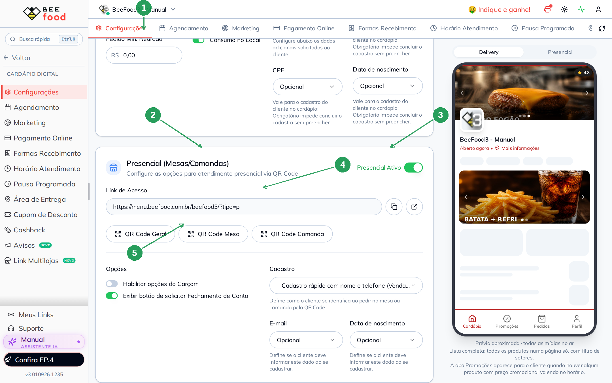

| Nº | Campo | O que faz |
|----|--------|-----------|
| 1. | **Configurações** | Aba desta tela |
| 2. | **Presencial (Mesas/Comandas)** | O card deste manual |
| 3. | **Presencial Ativo** | Liga ou desliga o canal |
| 4. | **Link de Acesso** | URL do presencial (`/?tipo=p`) |
| 5. | **QR Code Geral / Mesa / Comanda** | Abre o gerador |

O atalho do **nome do cardápio**, no topo, também tem o switch
**QR Code Presencial** e o mesmo link. É o mesmo campo.

---

## Parte 2 — Como o cliente se identifica

Ainda no card, o bloco **Cadastro** (1) tem três jeitos. E-mail (2)
e data de nascimento (3) só valem quando o cadastro está ligado.

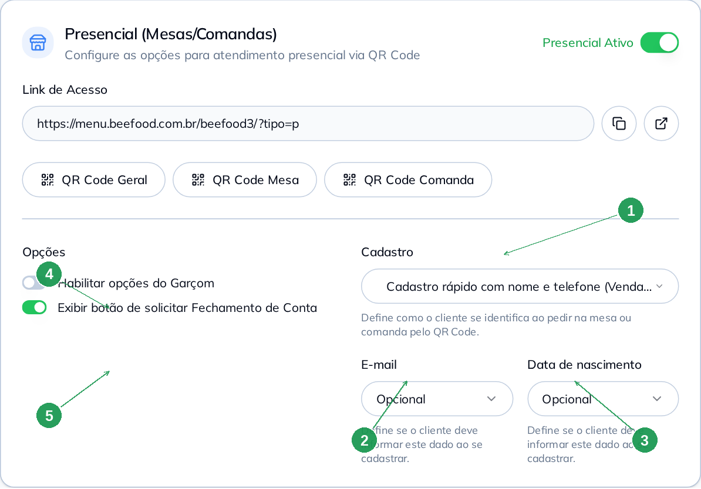

| Nº | Campo | O que faz |
|----|--------|-----------|
| 1. | **Cadastro** | Como o cliente se identifica no QR |
| 2. | **E-mail** | Não exibe · Opcional · Obrigatório |
| 3. | **Data de nascimento** | Idem |
| 4. | **Habilitar opções do Garçom** | Mostra o botão Configurar |
| 5. | **Exibir botão de solicitar Fechamento de Conta** | O cliente pede a conta pelo celular |

### Os três modos de cadastro

| Opção na tela | O que acontece |
|---------------|----------------|
| **Cadastro rápido com nome e telefone (Venda separada por telefone)** | Cada celular vira uma conta. Bom para mesa compartilhada em que cada um paga o seu. |
| **Sem cadastro (Venda única por Mesa/Comanda)** | A conta é da mesa. E-mail e nascimento **somem**. |
| **Cadastro completo com login e senha (Venda separada por cadastro)** | O cliente entra com conta. |

**Obrigatório** no e-mail ou no nascimento trava o cadastro até o
cliente preencher.

### Opções do Garçom

Com o switch (4) ligado, **Configurar** abre a lista do que o
cliente pode pedir ao salão (água, talher, conta…). Cada item grava
na hora. **FECHAR (ESC)** só fecha; não existe Salvar neste modal.

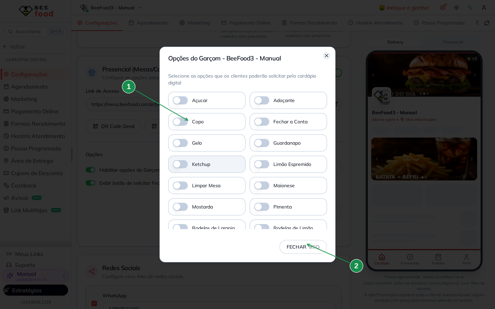

| Nº | Campo | O que faz |
|----|--------|-----------|
| 1. | Cada switch | Liga ou desliga aquele pedido |
| 2. | **FECHAR (ESC)** | Sai do modal |

Isso **não** é o manual do **aplicativo do garçom** — lá você escolhe
quais menus o funcionário vê. Aqui é o que o **cliente** vê no
cardápio.

---

## Parte 3 — Gerar o QR Code (Configurações)

Três botões, o mesmo modal.

### QR Code Geral

Um código só para o salão. O link é o presencial **sem** número de
mesa. O cliente escolhe a mesa depois, no celular.

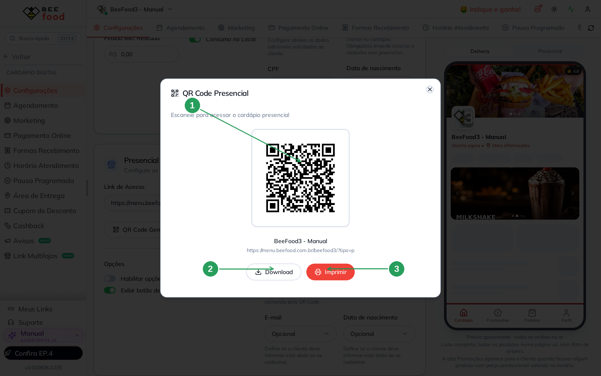

| Nº | Campo | O que faz |
|----|--------|-----------|
| 1. | O QR | Aponta para `…/beefood3/?tipo=p` |
| 2. | **Download** | Baixa o PNG |
| 3. | **Imprimir** | Abre a folha com logo, nome e o código |

### QR Code Mesa (e Comanda)

Informe o intervalo e clique em **Gerar QR Codes**. Cada código leva
`&mesa=N` (ou `&comanda=N`). Padrão da tela: 1 a 10. Teto: **100**
por vez.

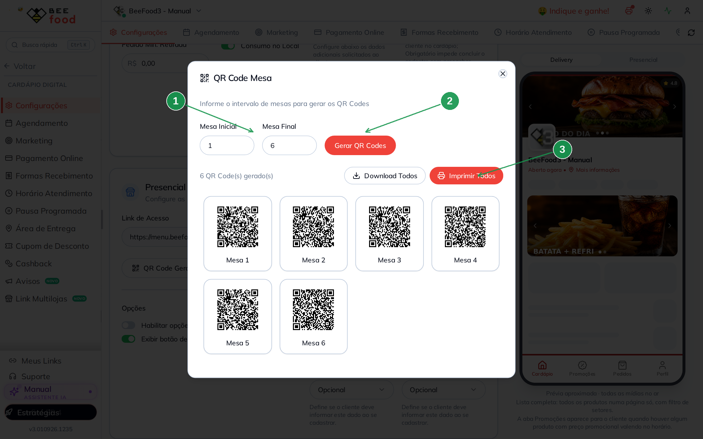

| Nº | Campo | O que faz |
|----|--------|-----------|
| 1. | **Mesa Inicial** / **Mesa Final** | O intervalo |
| 2. | **Gerar QR Codes** | Monta a grade |
| 3. | **Download Todos** / **Imprimir Todos** | Um PNG por mesa, ou a folha |

A Comanda é a mesma tela, com o rótulo **Comanda**.

> Este gerador **não olha** o cadastro de mesas. Se você pedir
> Mesa 1 a 10 e só existirem a 1, a 2 e a 3, os outros sete códigos
> saem assim mesmo — e o cliente cai numa mesa que o salão não tem.
> Cadastre as mesas (ou comandas) **antes** e gere só o intervalo
> que existe.

A folha de impressão coloca o **logo**, o **nome da loja** e o
rótulo (Mesa 3, Comanda 12) em cada cartão, com a marca *Sistema
BeeFood*.

---

## Parte 4 — Meus Links (presencial)

No rodapé do menu lateral: **Meus Links** (1). Abre um painel à
direita. Desça até **Cardápios Presencial** (2).

Há **três peças** neste grupo: o link para **pedir** na mesa/comanda,
o cardápio de **visualização** (só olhar) e o **gerador** em passos.
O botão do gerador fica no **fim** do painel — role até ele.

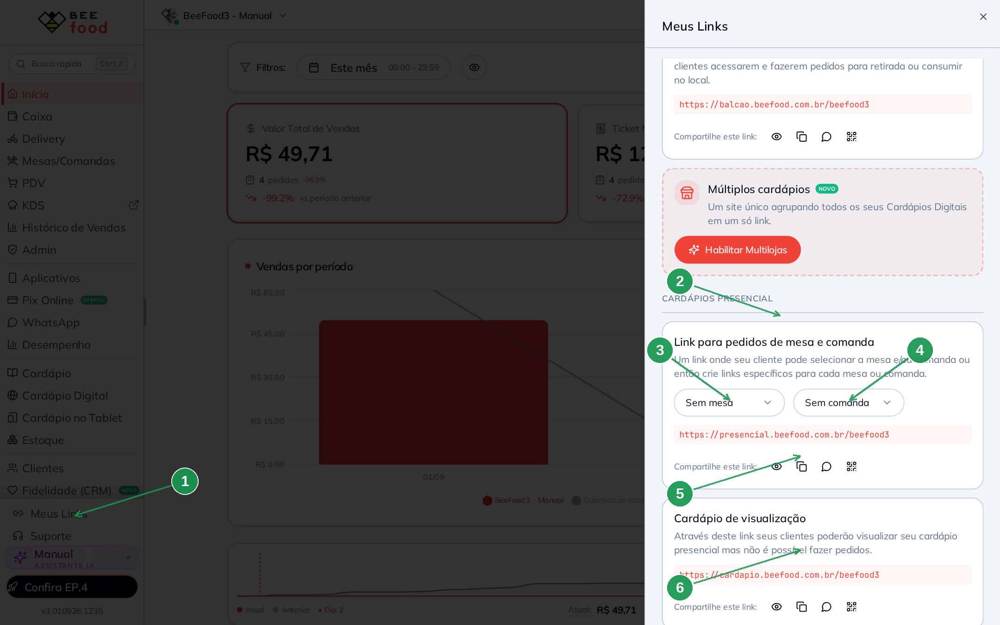

| Nº | Campo | O que faz |
|----|--------|-----------|
| 1. | **Meus Links** | Abre o painel |
| 2. | **Cardápios Presencial** | O grupo deste manual |
| 3. | **Sem mesa** | Select da mesa (aqui: link genérico) |
| 4. | **Sem comanda** | Select da comanda |
| 5. | Olho · copiar · WhatsApp · QR | Abrir, copiar, mandar, gerar **um** QR deste link |
| 6. | **Cardápio de visualização** | Só ver o cardápio, **sem pedir** |

O grupo de cima (**Cardápios Delivery**) é o link da entrega, o do
balcão e o multilojas. Não entra aqui.

Os quatro ícones valem para **o link que está na caixa**:

- **Olho** — abre numa aba nova
- **Copiar** — *Link copiado!*
- **WhatsApp** — monta `Olá! Acesse nosso cardápio digital:` + a URL
- **QR** — um código só, deste link (não é o intervalo da Parte 3)

### Um link por mesa

Na lista só entram as mesas e comandas **cadastradas**. No BeeFood3
a primeira é a **Mesa 2** (não existe Mesa 1). Deixe **Sem comanda**
e escolha **Mesa 2** (1). A URL ganha `?mesa=2` (2). Os quatro
ícones (3) já saem amarrados nessa mesa.

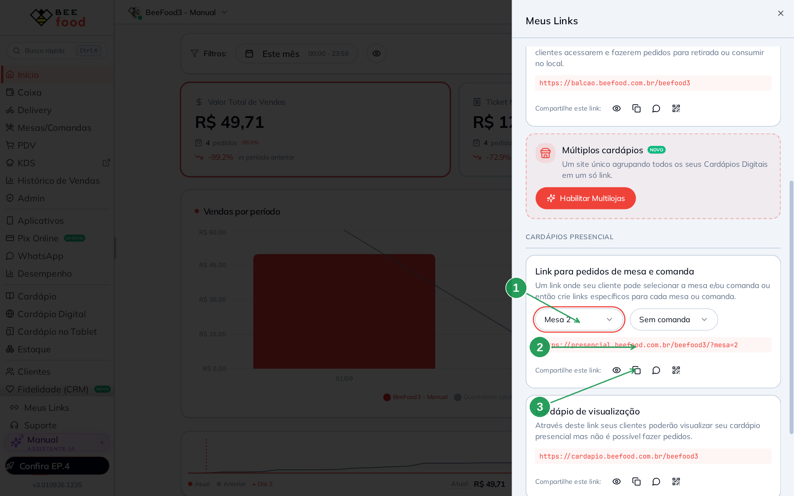

| Nº | Campo | O que faz |
|----|--------|-----------|
| 1. | **Mesa 2** | Select da mesa cadastrada |
| 2. | A URL | `presencial.beefood.com.br/beefood3/?mesa=2` |
| 3. | Os quatro ícones | Vale para **este** link |

Dá para marcar mesa **e** comanda ao mesmo tempo: a URL fica
`?mesa=2&comanda=N`.

Se a loja já tem **comanda cadastrada** e você gera o QR **só com
mesa** (ícone QR deste card **ou** o gerador no passo *Cardápio
Digital Presencial*), o sistema abre o aviso abaixo. Vários
clientes na mesma mesa não deveriam cair na mesma conta. Nos três
botões da Configurações **esse aviso não aparece**.

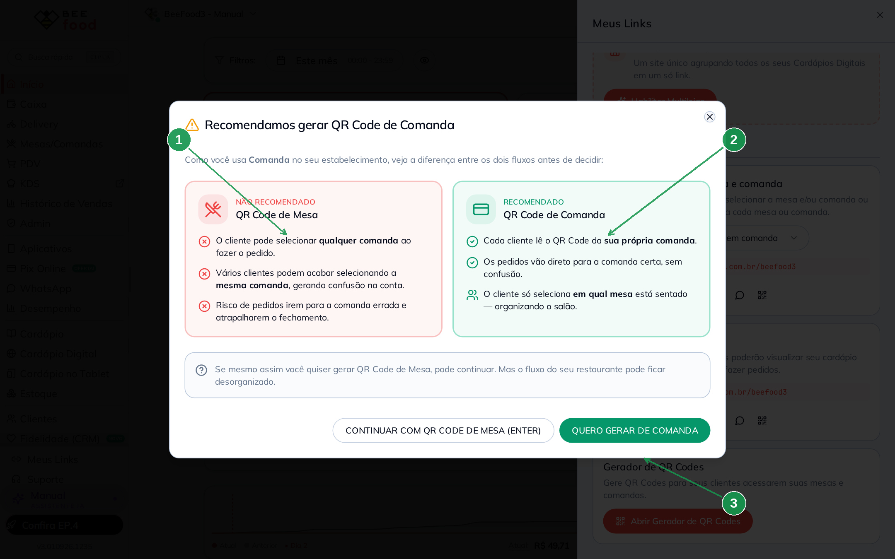

| Nº | Campo | O que faz |
|----|--------|-----------|
| 1. | **QR Code de Mesa** | O caminho que o sistema **não** recomenda quando já existe comanda |
| 2. | **QR Code de Comanda** | Cada cliente lê o código da própria comanda; a mesa só organiza a entrega |
| 3. | **QUERO GERAR DE COMANDA** | Segue o fluxo da comanda. *Continuar com QR Code de Mesa* ignora o aviso |

### Cardápio de visualização

`https://cardapio.beefood.com.br/beefood3` — o cliente **vê** o
cardápio e **não pede**. No celular some a aba **Pedidos**. Serve
para TV, totem só de consulta ou mandar o cardápio sem abrir venda.

### O gerador em passos

No fim do painel: **Abrir Gerador de QR Codes**. Primeiro pergunta
**mesas** ou **comandas**.

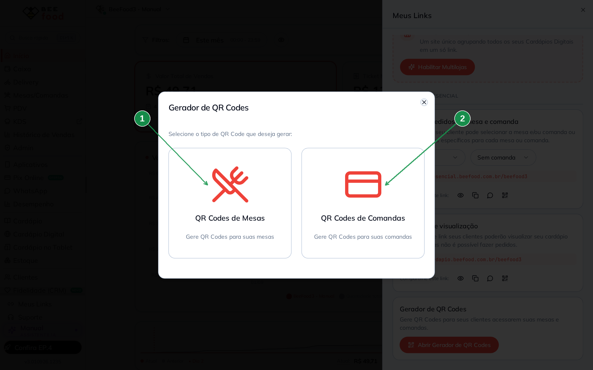

| Nº | Campo | O que faz |
|----|--------|-----------|
| 1. | **QR Codes de Mesas** | Intervalo de mesas |
| 2. | **QR Codes de Comandas** | Intervalo de comandas |

No passo seguinte, escolha **o que** o código faz:

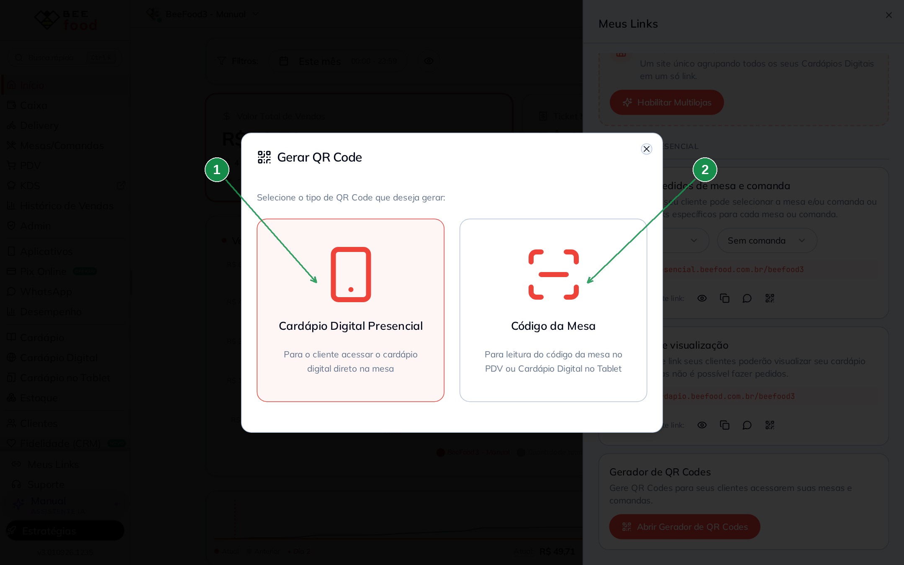

| Nº | Campo | O que faz |
|----|--------|-----------|
| 1. | **Cardápio Digital Presencial** | Link do cardápio (este manual) |
| 2. | **Código da Mesa** | Código para o PDV / tablet (outro QR) |

**Cardápio Digital Presencial** abre o mesmo modal da Parte 3
(intervalo, gerar, baixar, imprimir). Se você pediu **mesas** e a
loja tem comanda, cai no aviso da imagem anterior.

---

## Parte 5 — O que o cliente vê

Dois jeitos de abrir o presencial no celular:

- Pedir: `https://menu.beefood.com.br/beefood3/?tipo=p` (é o link da
  Configurações) — o de **Meus Links** (`presencial.beefood.com.br`)
  chega no mesmo lugar.
- Só olhar: `https://cardapio.beefood.com.br/beefood3`.

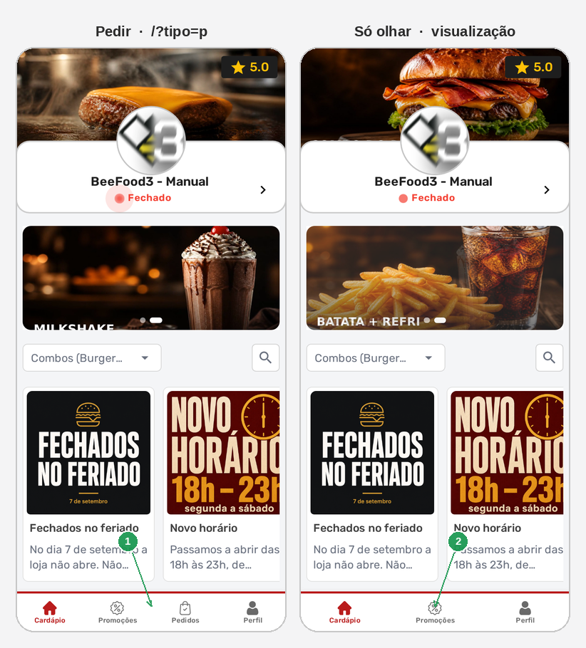

| Nº | Campo | O que faz |
|----|--------|-----------|
| 1. | Aba **Pedidos** | O link de pedir (`/?tipo=p` ou `presencial.beefood.com.br`) |
| 2. | Sem aba **Pedidos** | O de visualização (`cardapio.beefood.com.br`) |

O QR da **Mesa 2** já chega com a mesa preenchida. O QR **Geral**
pede para o cliente escolher.

A loja pode aparecer **Fechado** no celular se a grade do
Presencial estiver fechada agora — o QR abre, o pedido é que
não entra. Veja o manual **Horário de atendimento**.

---

## Perguntas frequentes

**Desliguei o Presencial e o delivery parou.**
Não deveria: são cards independentes. Confira se não há uma **pausa**
cobrindo os dois canais (manual **Fechar a loja fora do horário**).

**O QR abre, mas a loja aparece fechada.**
A grade do **Presencial** está fechada agora, ou existe pausa. O
horário do Delivery **não** vale para o QR.

**Gerei Mesa 1 a 20 e o cliente caiu numa mesa que não existe.**
O gerador da Configurações não confere o cadastro. Gere só o
intervalo que você cadastrou, ou use **Meus Links** e escolha a mesa
na lista — ali só aparecem as que existem (no BeeFood3, a primeira
é a Mesa 2).

**Qual link eu imprimo na mesa?**
Para o cliente **pedir**: o da Configurações (`/?tipo=p`) ou o de
Meus Links (`presencial.beefood.com.br`), com a mesa no parâmetro.
Para o cliente **só ver**: o de visualização
(`cardapio.beefood.com.br`).

**O WhatsApp de Meus Links manda o quê?**
A frase pronta *Olá! Acesse nosso cardápio digital:* mais a URL
que está na caixa — inclusive com `?mesa=` se você escolheu a mesa.

**O QR do PDV não abre o cardápio.**
É o **Código da Mesa** (`empresa_1`). A câmera do celular não sabe o
que fazer com isso. Use o QR **Cardápio Digital Presencial**.

**As opções do garçom não aparecem no celular.**
O switch **Habilitar opções do Garçom** precisa estar ligado **e**
pelo menos um item ligado no **Configurar**. Cache de até 1 minuto.

---

## Manuais relacionados

| Manual | O que traz |
|--------|------------|
| **Horário de atendimento** | A grade semanal do Presencial |
| **Fechar a loja fora do horário** | Pausa e o switch QR Code Presencial |
| **App do Garçom (parâmetros)** | Os menus do aplicativo do funcionário |
| **Taxa e obrigatoriedades de mesa** | Taxa % e mesa obrigatória no salão |
