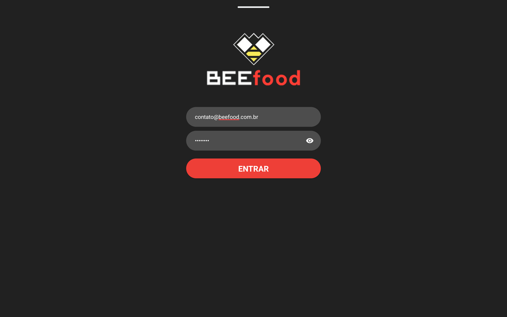
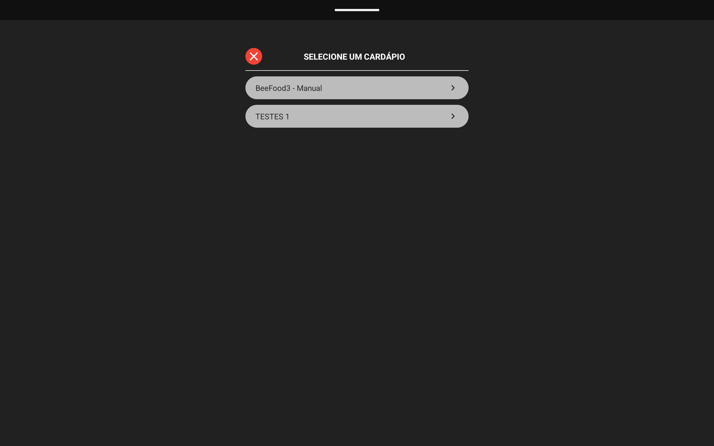

# Manual do Modo Kiosk — travar o tablet no cardápio

Este manual mostra, passo a passo, como deixar o tablet preso no aplicativo do cardápio digital, de forma que o cliente possa fazer pedidos mas não consiga sair do aplicativo, abrir outros aplicativos ou mexer nas configurações do aparelho.

Todas as imagens deste manual são telas reais do aplicativo (versão 1.0.2.8) em um tablet Android 15.

---

## Antes de começar

Você vai precisar de:

- O tablet com o aplicativo **Cardápio Mesa/Comanda** já instalado.
- O **usuário e a senha** que você usa para entrar no aplicativo.
- Cerca de 5 minutos com o tablet em mãos.

Dois avisos importantes:

- A senha que você digita na tela de login é a mesma senha que protege a tela de **Administração** do aplicativo. Guarde-a bem: é ela que permite destravar o tablet depois.
- Os botões físicos de **volume** e de **ligar/desligar** continuam funcionando. O Android não permite bloqueá-los sem apagar completamente o tablet e configurá-lo como aparelho corporativo. Todos os outros caminhos de saída ficam bloqueados.

---

## Visão geral do processo

1. Entrar no aplicativo com usuário e senha.
2. Abrir a tela de Administração.
3. Conceder duas permissões do Android (o aplicativo guia você em cada uma).
4. Ativar a trava.
5. Conferir se o tablet está realmente travado.

Você só precisa fazer os passos 1 a 3 uma única vez em cada tablet. Depois disso, travar e destravar é questão de dois toques.

---

## Parte 1 — Entrar no aplicativo

Digite o usuário e a senha do estabelecimento e toque em **ENTRAR**.

Se o seu acesso tiver mais de um cardápio (mais de uma loja ou filial), o aplicativo pergunta qual deles usar. Toque no cardápio deste tablet.

O aplicativo carrega o cardápio e abre a tela de **Administração** automaticamente logo após o login. Se ela já estiver aberta na sua tela, pule direto para a Parte 3.

---

## Parte 2 — Abrir a tela de Administração

Sempre que precisar voltar nessa tela, toque no **logo do estabelecimento**, no canto superior esquerdo da barra do topo.

O aplicativo pede a senha. Digite a **mesma senha que você usou no login** e toque em **ACESSAR**.

Esta é a tela de Administração. Os dois botões que interessam aqui são **TRAVAR** e **CONFIGURAR TRAVA AVANÇADA**.

A diferença entre os dois é simples:

| Botão | Quando usar |
|---|---|
| **CONFIGURAR TRAVA AVANÇADA** | Na primeira vez, para conceder as permissões com calma sem travar nada ainda. |
| **TRAVAR** | No dia a dia, para travar o tablet. |

Na primeira configuração, toque em **CONFIGURAR TRAVA AVANÇADA**.

---

## Parte 3 — Conceder as duas permissões

O aplicativo abre um assistente que mostra as duas permissões necessárias e quantas já foram concedidas. No começo aparece "0 de 2 permissões concedidas".

O texto amarelo em cada quadro é a instrução do que fazer dentro das configurações do Android. Vamos concedê-las uma por vez.

### Permissão 1 de 2 — Acessibilidade

Toque em **CONCEDER** no primeiro quadro (Acessibilidade). O aplicativo mostra um aviso explicando para que serve essa permissão, o que ela faz e que nenhum dado pessoal é coletado.

Leia e toque em **CONCORDAR E CONTINUAR**. Nada é solicitado ao Android antes desse toque. Se preferir deixar para depois, toque em **AGORA NÃO** e o assistente continua aberto.

O Android abre a tela de Acessibilidade. Toque em **Cardápio Mesa/Comanda — Modo Kiosk**, na seção "Apps baixados".

Ative a chave **Usar Cardápio Mesa/Comanda — Modo Kiosk**.

O Android pede uma confirmação. Toque em **Permitir**.

A chave fica azul, indicando que o serviço está ativo.

Volte ao aplicativo usando o botão **Voltar** do Android (pode ser necessário tocar duas vezes). O assistente já reconhece a permissão e mostra "1 de 2 permissões concedidas", com o primeiro quadro marcado em verde.

### Permissão 2 de 2 — Tela inicial padrão

Toque em **CONCEDER** no segundo quadro (Launcher padrão). O Android pergunta qual aplicativo deve ser a tela inicial do tablet.

Selecione **Cardápio Mesa/Comanda**.

Toque em **Definir como padrão**. A partir daqui, apertar o botão Início do tablet passa a abrir o cardápio em vez da tela do Android.

---

## Parte 4 — Ativar a trava

Abra a tela de Administração novamente (logo no canto superior esquerdo e senha) e toque em **TRAVAR**. O assistente aparece com "2 de 2 permissões concedidas" e o botão verde de ativação.

Toque em **ATIVAR MODO KIOSK**. O aplicativo confirma com a mensagem "Tablet bloqueado (Modo Kiosk)".

Toque em **OK**. O Android também mostra um aviso próprio, "O app está fixado", explicando que o aplicativo ficará sempre à vista. Toque em **Entendi**.

Pronto: o tablet está travado no cardápio.

---

## Parte 5 — Conferir se está travado

Faça este teste rápido antes de entregar o tablet ao salão. Aperte o botão **Início** do tablet e tente arrastar a barra de notificações para baixo. O tablet deve continuar no cardápio, como na imagem.

Se em algum momento outra tela aparecer, ela é fechada em menos de um segundo e o cardápio volta sozinho.

---

## Parte 6 — Destravar o tablet

Toque no logo no canto superior esquerdo, digite a senha e toque em **DESTRAVAR**. Enquanto o tablet está travado, esse é o único botão disponível no lugar de TRAVAR.

O tablet é liberado na hora e a tela de Administração volta a mostrar **TRAVAR** e **CONFIGURAR TRAVA AVANÇADA**, prontos para travar de novo quando quiser.

As permissões continuam concedidas, então nas próximas vezes basta tocar em **TRAVAR** e depois em **ATIVAR MODO KIOSK**.

---

## Alternativa: trava básica (sem permissões)

Se você tocar em **TRAVAR** sem ter concedido as duas permissões, o assistente oferece a opção **PULAR E USAR TRAVA BÁSICA AGORA**, em laranja.

A trava básica usa apenas o recurso de fixar aplicativo do próprio Android. Ela funciona sem nenhuma permissão, mas é menos segura: o cliente consegue sair segurando os botões **Voltar** e **Recentes** ao mesmo tempo. Use como solução temporária e configure a trava avançada quando puder.

---

## Perguntas frequentes

**Preciso repetir tudo isso todos os dias?**
Não. As permissões são concedidas uma única vez por tablet. No dia a dia é só Administração e **TRAVAR**.

**Se o tablet reiniciar ou ficar sem bateria, ele volta travado?**
Sim. A trava é restaurada automaticamente quando o tablet liga de novo.

**Esqueci a senha da tela de Administração.**
É a mesma senha do login do aplicativo. Se ela foi alterada no sistema, use a senha nova para entrar no aplicativo, e ela passa a valer também na tela de Administração.

**O cliente conseguiu sair do aplicativo. O que aconteceu?**
Provavelmente o tablet está com a trava básica, e não com a avançada. Abra a tela de Administração, toque em **CONFIGURAR TRAVA AVANÇADA** e verifique se as duas permissões aparecem em verde. Se a permissão de acessibilidade foi desativada nas configurações do Android, conceda-a novamente.

**Os botões de volume e de ligar/desligar continuam funcionando. Isso é normal?**
Sim. Essa é uma limitação do Android e está avisada na própria tela do assistente. Se o menu de desligar aparecer, ele é fechado automaticamente em seguida.

**O tablet é Xiaomi, Motorola ou similar e a trava cai sozinha depois de um tempo.**
Alguns fabricantes encerram aplicativos em segundo plano para economizar bateria. Nas configurações do Android, procure a economia ou otimização de bateria e marque o aplicativo Cardápio Mesa/Comanda como sem restrição.

**Quero usar o tablet para outra coisa por alguns minutos.**
Destrave pela tela de Administração, use o tablet e depois trave de novo. Não é preciso reconfigurar nada.
