# Manual do Modo Kiosk — travar o tablet no cardápio

Este manual mostra, passo a passo, como deixar o tablet preso no aplicativo do cardápio digital, de forma que o cliente possa fazer pedidos mas não consiga sair do aplicativo, abrir outros aplicativos ou mexer nas configurações do aparelho.

Todas as imagens deste manual são telas reais do aplicativo (versão 1.0.2.8) em um tablet Android 15. Os **números em verde** nas imagens são os mesmos números citados no texto ao lado de cada uma.

---

## Antes de começar

Você vai precisar de:

- O tablet com o aplicativo **Cardápio Mesa/Comanda** já instalado e com o cardápio da loja carregado.
- A **senha de administrador**, que é a mesma senha usada para entrar no aplicativo. Guarde-a bem: é ela que abre a tela de Administração e, mais tarde, destrava o tablet.
- Cerca de 5 minutos com o tablet em mãos.

Um aviso importante antes de tudo: os botões físicos de **volume** e de **ligar/desligar** continuam funcionando. O Android não permite bloqueá-los sem apagar completamente o tablet e configurá-lo como aparelho corporativo. Todos os outros caminhos de saída ficam bloqueados.

---

## Visão geral do processo

1. Abrir a tela de Administração.
2. Conceder duas permissões do Android (o aplicativo guia você em cada uma).
3. Ativar a trava.
4. Conferir se o tablet está realmente travado.

Os passos 1 e 2 você faz uma única vez em cada tablet. Depois disso, travar e destravar é questão de dois toques.

---

## Parte 1 — Abrir a tela de Administração

Toque no **logo do estabelecimento** (1), no canto superior esquerdo da barra do topo. Esse logo é a única porta de entrada da Administração — não existe menu para ela em nenhum outro lugar do cardápio.

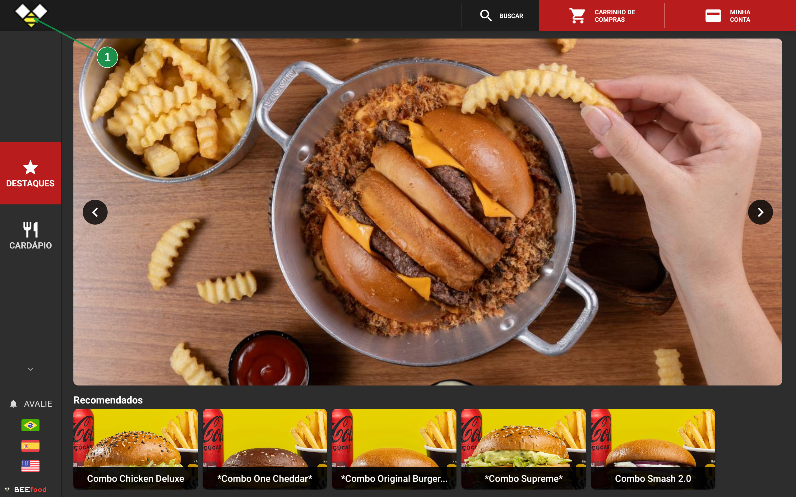

O aplicativo pede a senha.

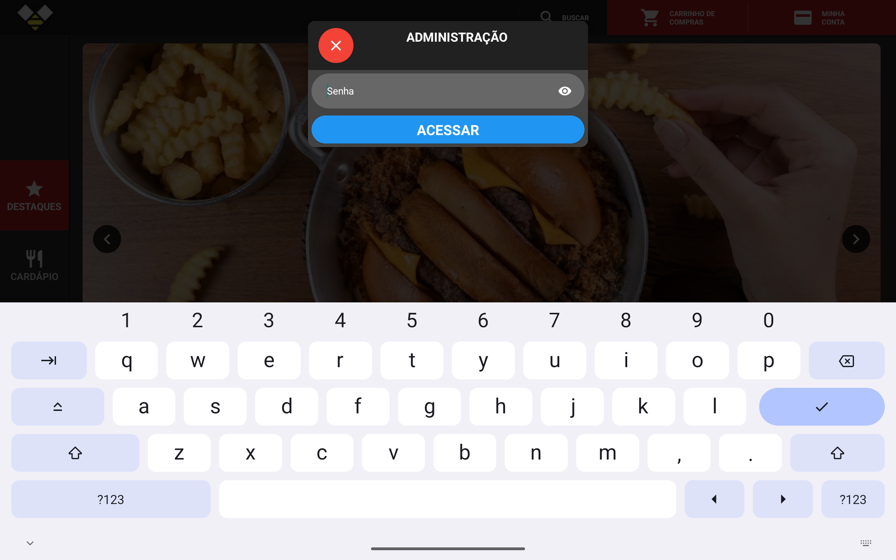

| Nº | Onde | O que fazer |
|---|---|---|
| 1 | Campo **Senha** | Digite a mesma senha que você usa para entrar no aplicativo. |
| 2 | **ACESSAR** | Confirme. |

Logo depois do login, o aplicativo abre essa tela por conta própria. Se ela já estiver na sua frente, comece daqui.

Esta é a tela de Administração. Dos botões dela, dois interessam para a trava.

| Nº | Botão | Quando usar |
|---|---|---|
| 1 | **TRAVAR** | No dia a dia, para travar o tablet. |
| 2 | **CONFIGURAR TRAVA AVANÇADA** | Na primeira vez, para conceder as permissões com calma sem travar nada ainda. |

Na primeira configuração, toque em **CONFIGURAR TRAVA AVANÇADA** (2).

---

## Parte 2 — Conceder as duas permissões

O aplicativo abre um assistente que reúne as duas permissões necessárias.

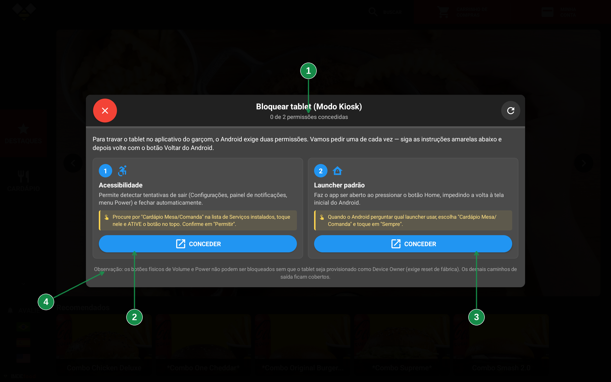

| Nº | O que é | Por que olhar |
|---|---|---|
| 1 | Contador de permissões | Começa em "0 de 2" e é o seu termômetro: quando chegar a "2 de 2", a trava pode ser ativada. |
| 2 | **CONCEDER** da Acessibilidade | Primeira permissão — faça esta antes da outra. |
| 3 | **CONCEDER** do Launcher padrão | Segunda permissão. |
| 4 | Observação no rodapé | É o limite dos botões de volume e ligar/desligar, repetido aqui na própria tela. |

O texto amarelo dentro de cada quadro é a instrução do que fazer depois, já dentro das configurações do Android. Vamos conceder uma permissão por vez.

### Permissão 1 de 2 — Acessibilidade

Toque em **CONCEDER** (2), no quadro Acessibilidade. O aplicativo mostra um aviso explicando para que serve essa permissão, o que ela faz e que nenhum dado pessoal é coletado.

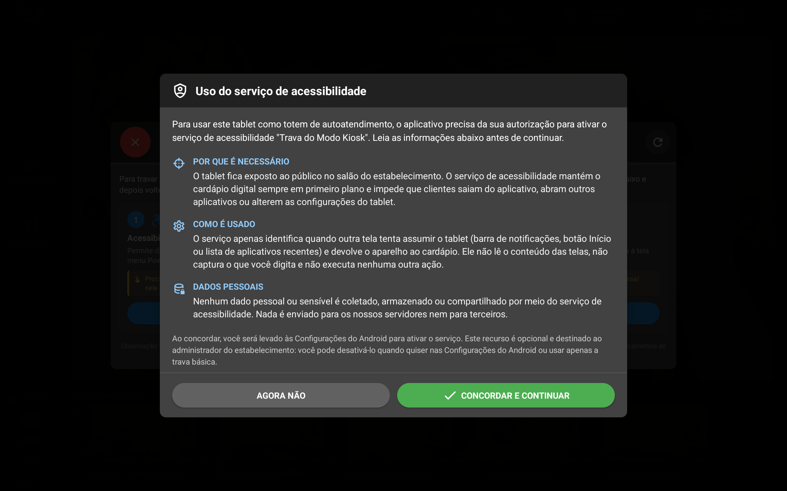

| Nº | Botão | O que acontece |
|---|---|---|
| 1 | **CONCORDAR E CONTINUAR** | Leva você às configurações do Android. Nada é pedido ao Android antes desse toque. |
| 2 | **AGORA NÃO** | Fecha só o aviso; o assistente continua aberto para você voltar depois. |

Toque em **CONCORDAR E CONTINUAR** (1). O Android abre a tela de Acessibilidade — nela, toque em **Cardápio Mesa/Comanda — Modo Kiosk** (1), na seção "Apps baixados".

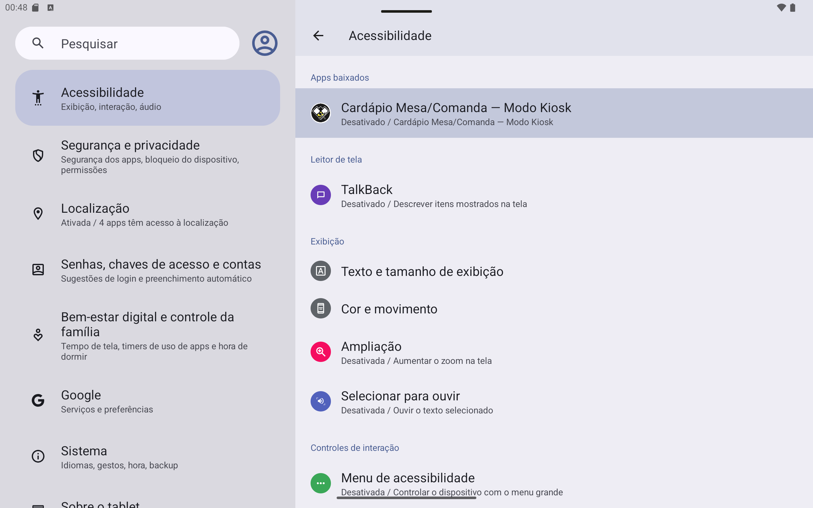

Ative a chave **Usar Cardápio Mesa/Comanda — Modo Kiosk** (1). Ela começa desligada, em cinza.

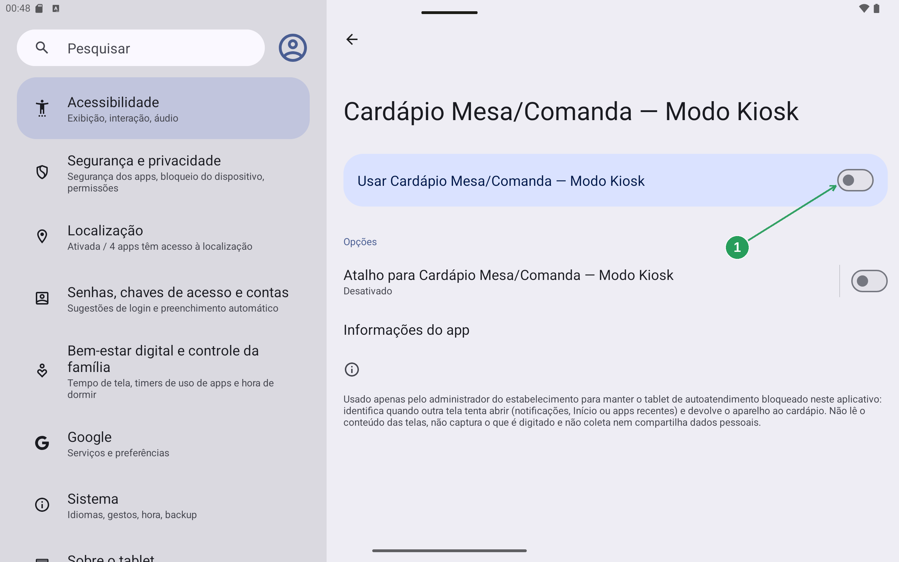

O Android pede uma confirmação. Toque em **Permitir** (1).

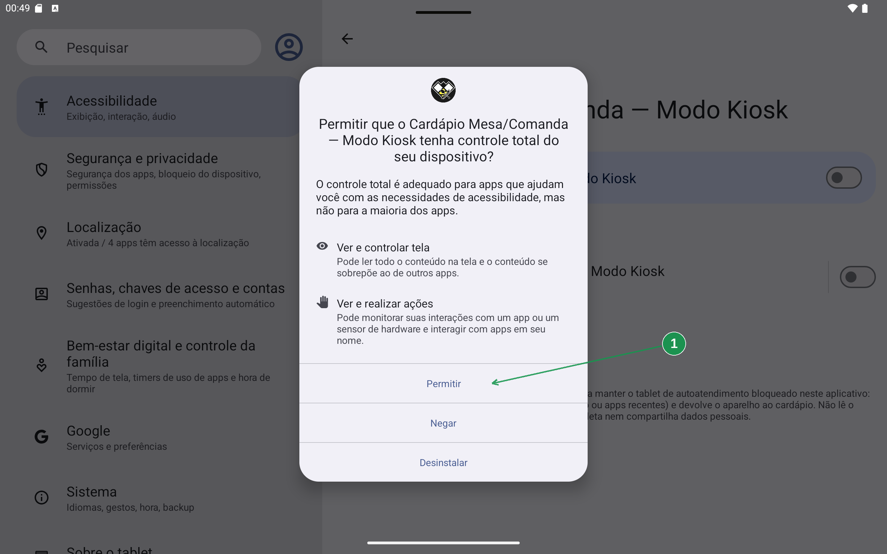

A chave (1) fica azul: o serviço está ativo.

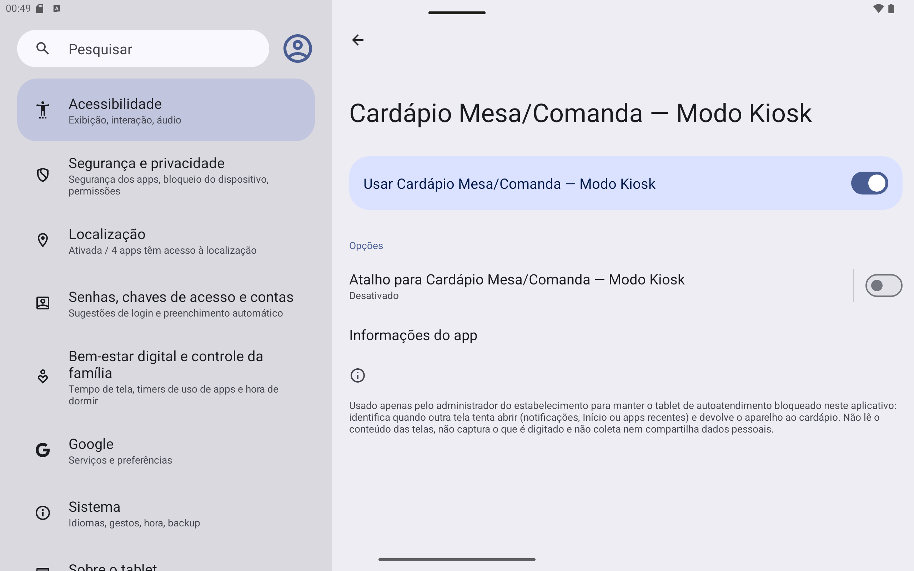

Volte ao aplicativo usando o botão **Voltar** do Android (pode ser necessário tocar duas vezes). O assistente reconhece a permissão sozinho.

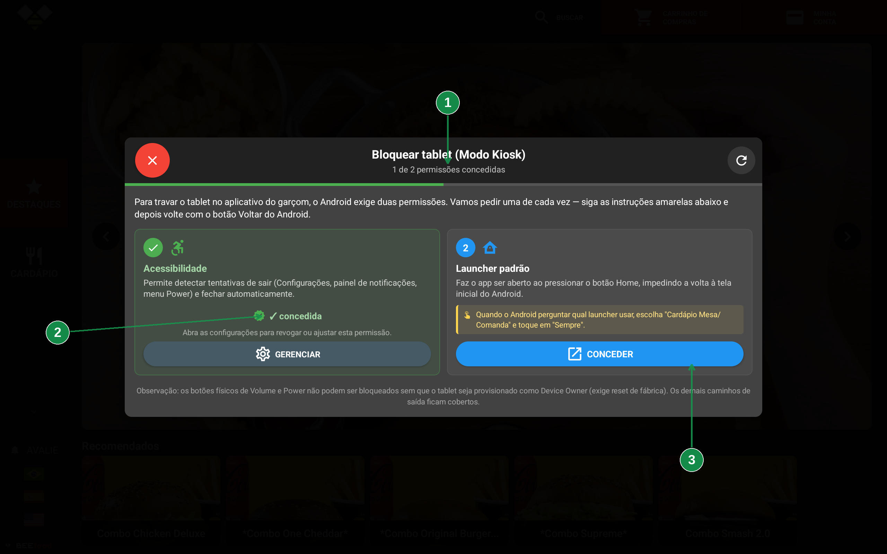

| Nº | O que conferir |
|---|---|
| 1 | O contador virou "1 de 2 permissões concedidas". |
| 2 | O quadro da Acessibilidade ficou verde, com o selo "concedida". |
| 3 | Agora é a vez do **CONCEDER** do Launcher padrão. |

Se o contador não mudou, toque no ícone de recarregar — o círculo com a seta, no canto superior direito do assistente.

### Permissão 2 de 2 — Tela inicial padrão

Toque em **CONCEDER** (3), no quadro Launcher padrão. O Android pergunta qual aplicativo deve ser a tela inicial do tablet, e vem marcada a tela de início do próprio Android (no tablet das imagens, "Tela de início do Pixel").

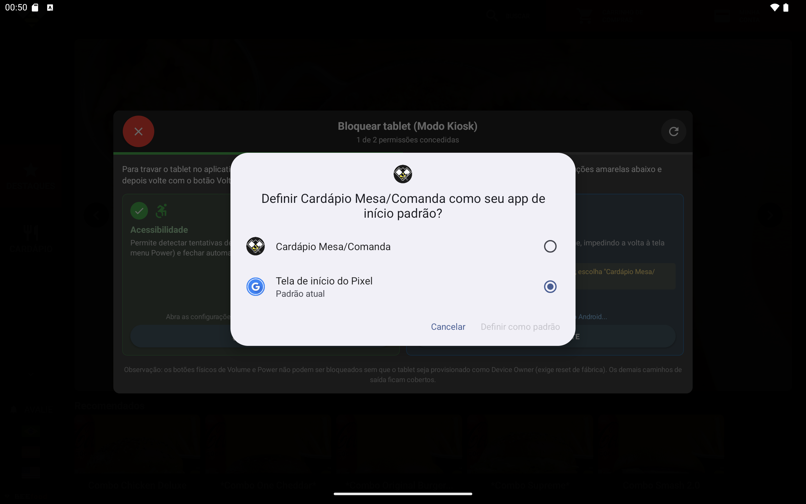

Toque no seletor do **Cardápio Mesa/Comanda** (1).

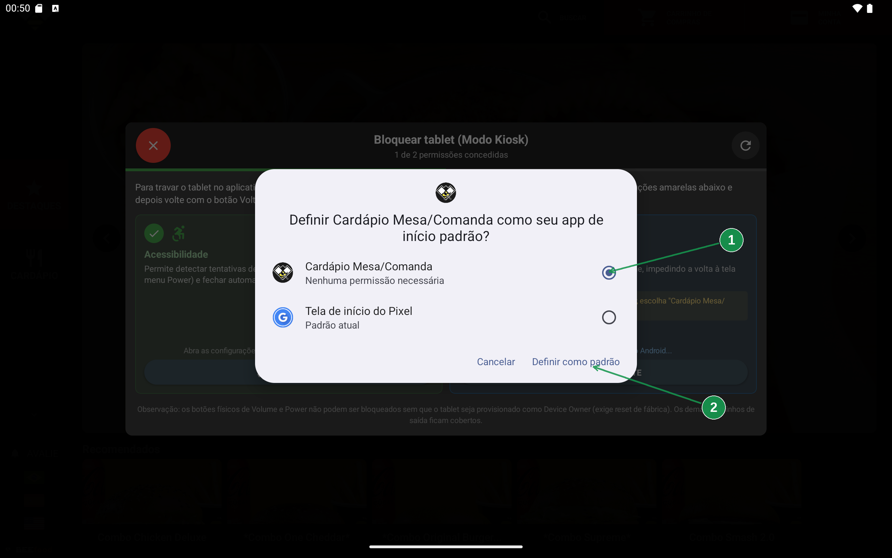

| Nº | O que fazer |
|---|---|
| 1 | Confira que o seletor do **Cardápio Mesa/Comanda** ficou marcado. |
| 2 | Toque em **Definir como padrão**. |

A partir daqui, apertar o botão Início do tablet passa a abrir o cardápio em vez da tela do Android.

---

## Parte 3 — Ativar a trava

Abra a tela de Administração novamente (logo no canto superior esquerdo e senha) e toque em **TRAVAR**. O assistente aparece pronto para ativar.

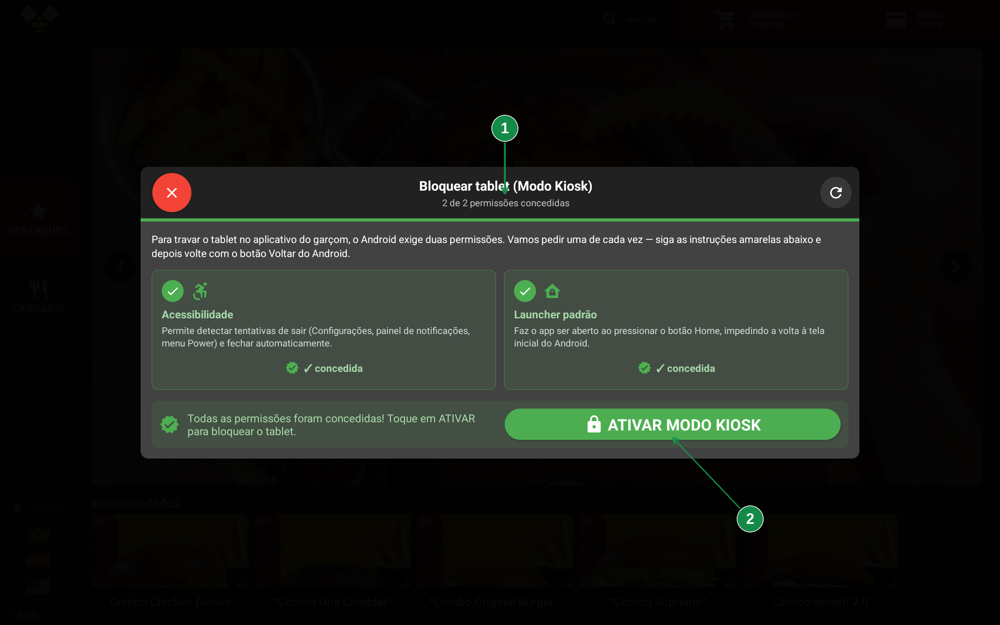

| Nº | O que fazer |
|---|---|
| 1 | Confira que o contador está em "2 de 2 permissões concedidas", com os dois quadros verdes. |
| 2 | Toque em **ATIVAR MODO KIOSK**. |

O aplicativo confirma com a mensagem "Tablet bloqueado (Modo Kiosk)".

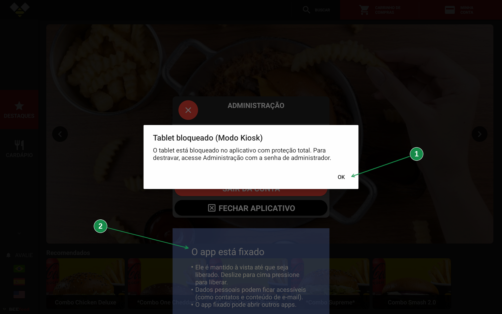

| Nº | O que é |
|---|---|
| 1 | **OK** — fecha a confirmação do aplicativo. |
| 2 | O aviso do próprio Android, "O app está fixado", que aparece atrás. Se ele trouxer um botão de confirmação (**Entendi**), toque nele também. |

Em seguida o Android mostra por um instante o aviso "App fixado" (1) na parte de baixo da tela. Ele desaparece sozinho, sem precisar de nenhum toque.

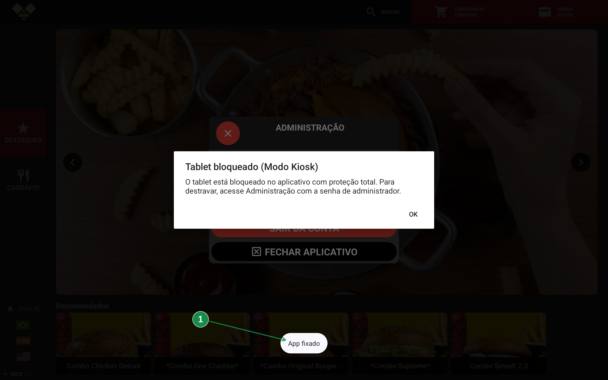

Pronto: o tablet está travado no cardápio.

---

## Parte 4 — Conferir se está travado

Faça este teste rápido antes de entregar o tablet ao salão. Aperte o botão **Início** e tente arrastar a barra de notificações para baixo. O tablet deve continuar no cardápio, igual a antes — é justamente por isso que a imagem abaixo não tem marcação nenhuma: a prova é a tela não ter mudado.

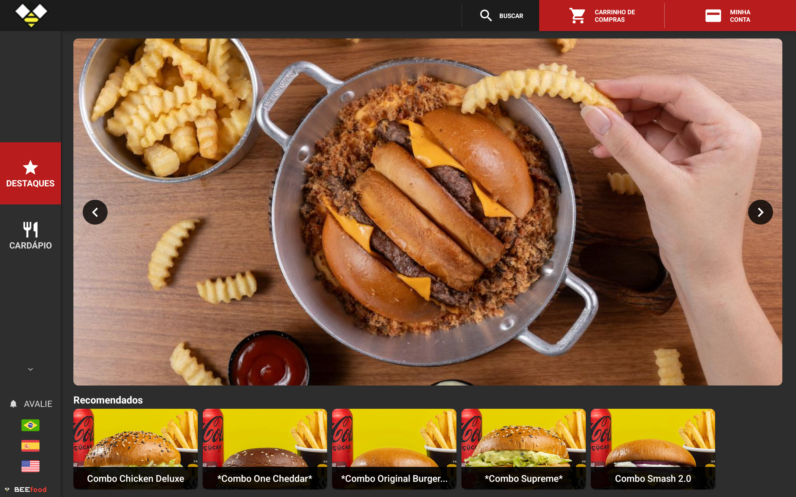

Se em algum momento outra tela aparecer, ela é fechada em menos de um segundo e o cardápio volta sozinho.

---

## Parte 5 — Destravar o tablet

Toque no logo no canto superior esquerdo, digite a senha e toque em **DESTRAVAR** (1). Enquanto o tablet está travado, esse é o único botão disponível no lugar de TRAVAR.

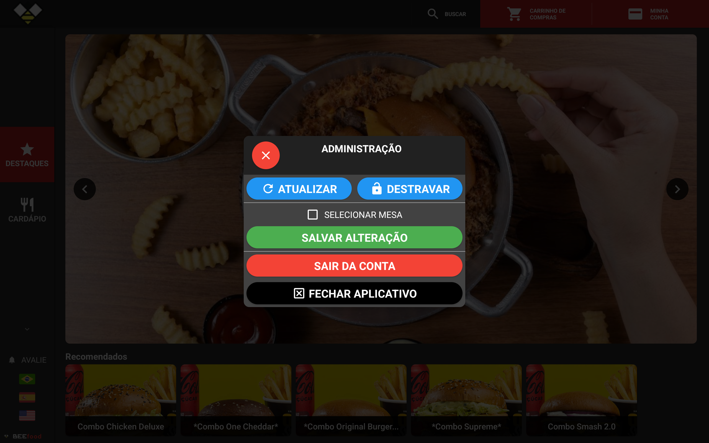

O tablet é liberado na hora e a tela de Administração volta ao estado de antes, com **TRAVAR** e **CONFIGURAR TRAVA AVANÇADA** prontos para travar de novo quando quiser — nada a apontar aqui, é a mesma tela da Parte 1.

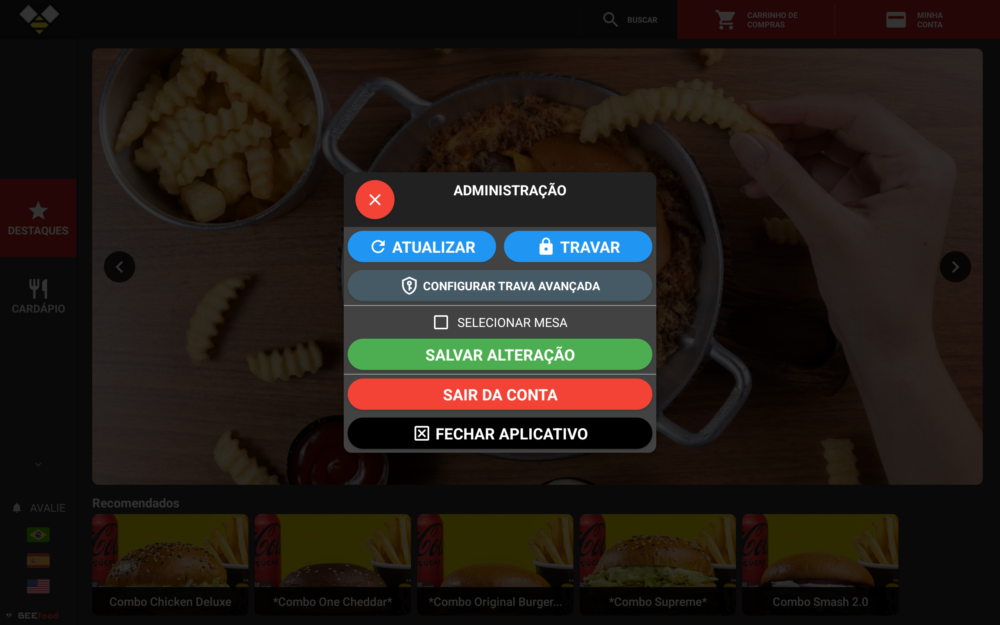

As permissões continuam concedidas, então nas próximas vezes basta tocar em **TRAVAR** e depois em **ATIVAR MODO KIOSK**.

---

## Alternativa: trava básica (sem permissões)

Se você tocar em **TRAVAR** sem ter concedido as duas permissões, o assistente oferece a trava básica, em laranja.

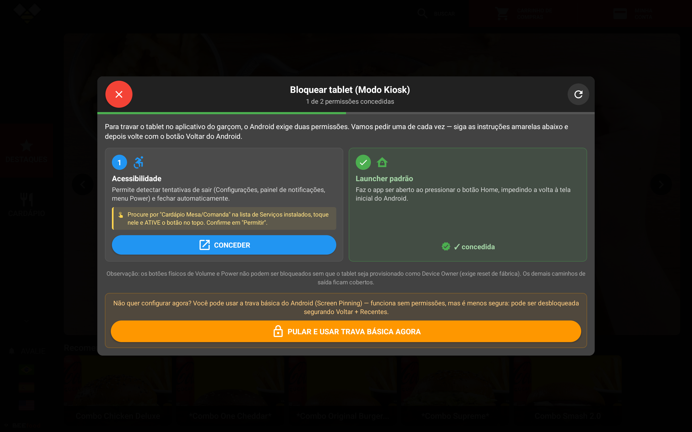

| Nº | O que é |
|---|---|
| 1 | O aviso do limite: funciona sem permissão nenhuma, mas é menos segura. |
| 2 | **PULAR E USAR TRAVA BÁSICA AGORA** — ativa a trava básica na hora. |

A trava básica usa apenas o recurso de fixar aplicativo do próprio Android. Ela funciona sem nenhuma permissão, mas é menos segura: o cliente consegue sair segurando os botões **Voltar** e **Recentes** ao mesmo tempo. Use como solução temporária e configure a trava avançada quando puder.

---

## Perguntas frequentes

**Preciso repetir tudo isso todos os dias?**
Não. As permissões são concedidas uma única vez por tablet. No dia a dia é só Administração e **TRAVAR**.

**Se o tablet reiniciar ou ficar sem bateria, ele volta travado?**
Sim. A trava é restaurada automaticamente quando o tablet liga de novo.

**Esqueci a senha da tela de Administração.**
É a mesma senha do login do aplicativo. Se ela foi alterada no sistema, use a senha nova para entrar no aplicativo, e ela passa a valer também na tela de Administração.

**O cliente conseguiu sair do aplicativo. O que aconteceu?**
Provavelmente o tablet está com a trava básica, e não com a avançada. Abra a tela de Administração, toque em **CONFIGURAR TRAVA AVANÇADA** e verifique se as duas permissões aparecem em verde. Se a permissão de acessibilidade foi desativada nas configurações do Android, conceda-a novamente.

**Os botões de volume e de ligar/desligar continuam funcionando. Isso é normal?**
Sim. Essa é uma limitação do Android e está avisada na própria tela do assistente. Se o menu de desligar aparecer, ele é fechado automaticamente em seguida.

**O tablet é Xiaomi, Motorola ou similar e a trava cai sozinha depois de um tempo.**
Alguns fabricantes encerram aplicativos em segundo plano para economizar bateria. Nas configurações do Android, procure a economia ou otimização de bateria e marque o aplicativo Cardápio Mesa/Comanda como sem restrição.

**Quero usar o tablet para outra coisa por alguns minutos.**
Destrave pela tela de Administração, use o tablet e depois trave de novo. Não é preciso reconfigurar nada.
