# Manual do Cardápio — Fundamentos

Este manual ensina a montar um cardápio no BeeFood do zero: cadastrar **complementos**, criar
um **grupo de opções**, cadastrar o **produto**, ligar as duas coisas e conferir o resultado
na venda. No fim, você aprende a **reajustar preços de várias opções de uma vez**.

É o manual base do cardápio. Os manuais de **hambúrguer**, **pizza**, **açaí** e **comida
japonesa** partem daqui e só montam o cenário de cada segmento.

> As imagens têm **setas numeradas** (1, 2, 3…). Cada número indica o campo ou botão
> correspondente na tela. Campos com **\*** são **obrigatórios**.

---

## As três peças do cardápio

O cardápio do BeeFood se monta com três cadastros que se encaixam nesta ordem:

| Peça | O que é | Exemplo |
|------|---------|---------|
| **Complemento** | Um item que **só existe dentro de um grupo de opções**. Não é vendido sozinho. | Bacon, Queijo Extra, Ovo |
| **Grupo de Opções** | A **regra de escolha**: quantas opções o cliente pode marcar e como o preço é somado. | "Adicionais", de 0 a 3 itens |
| **Produto** | O que o cliente compra. Recebe um ou mais grupos vinculados. | Sanduíche Natural, R$ 15,00 |

O caminho é sempre o mesmo:

```
Complemento  →  entra como opção no Grupo  →  Grupo é vinculado ao Produto  →  aparece na venda
```

Neste manual montamos um exemplo completo:

| Item | Valor |
|------|-------|
| Setor | Lanches |
| Produto | Sanduíche Natural — R$ 15,00 |
| Grupo | Adicionais — de 0 a 3 opções, preço **Normal** |
| Opções | Bacon R$ 3,00 · Queijo Extra R$ 2,00 · Ovo R$ 4,00 |

---

## Pré-requisitos

- Sessão iniciada em `https://beefood.app`.
- Permissão de menu **Cardápio** no seu grupo de acesso.
- Para a Parte 8 (edição em lote), a permissão de **editar em lote**.

---

## Parte 1 — Onde tudo acontece

No menu lateral, abra **Cardápio**. A tela tem três abas, e é bom saber para que serve cada
uma antes de começar: a aba Produtos (1), a aba Grupo de Opções (2) e a aba Complementos (3).

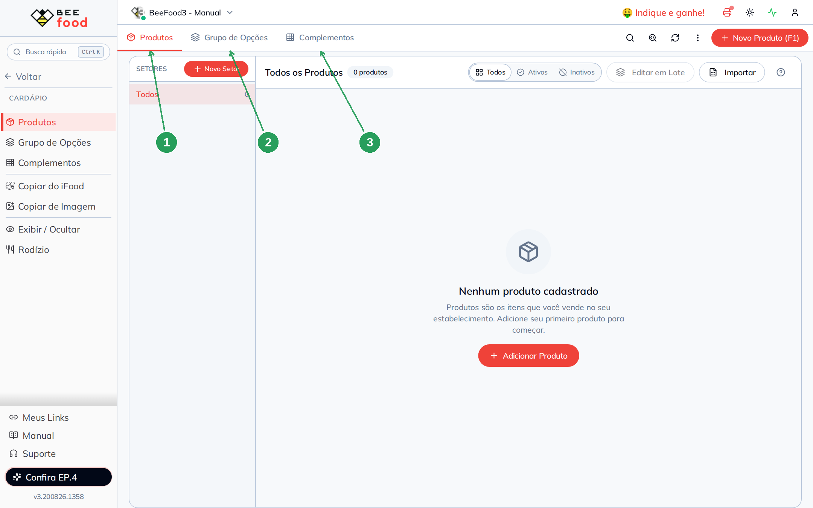

| Nº | Aba | Para que serve |
|----|-----|----------------|
| 1 | **Produtos** | O que o cliente compra. É aqui que ficam preço, foto, setor e os grupos vinculados. |
| 2 | **Grupo de Opções** | As regras de escolha e, dentro delas, as opções. Tem duas sub-abas: **Grupos** e **Opções**. |
| 3 | **Complementos** | O catálogo de itens que só são vendidos dentro de um grupo. |

> **Comece pelos complementos.** Assim, quando você for montar o grupo, os itens já existem e
> basta selecioná-los. Dá para fazer na ordem inversa, mas você acaba cadastrando item por
> item dentro do grupo, o que é mais lento.

---

## Parte 2 — Cadastrar os complementos

Abra a aba **Complementos** e clique em **Novo Complemento (F1)** (1).

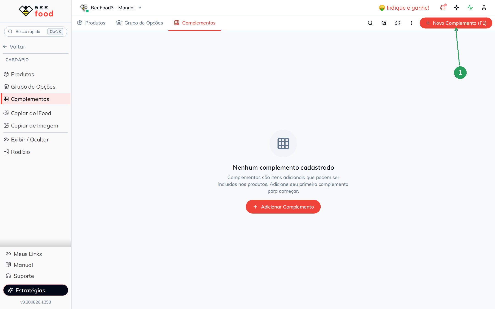

| Nº | Item | O que fazer |
|----|------|-------------|
| 1 | **Novo Complemento (F1)** | Abre o cadastro de um complemento novo. |

O aviso azul na tela resume bem a regra: complementos são itens **para uso exclusivo em Grupos
de Opções** e não podem ser vendidos separadamente.

### Preencher o complemento

Preencha o **Nome** (1) e o **Preço de Venda** (2). Depois clique em **ADICIONAR FOTO** (3) e,
por último, em **SALVAR E SAIR (F2)** (4).

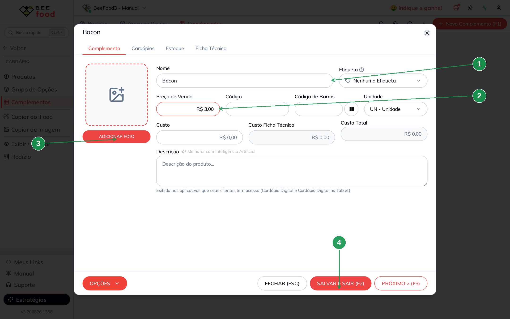

| Nº | Campo | O que fazer |
|----|-------|-------------|
| 1 | **Nome\*** | Único campo obrigatório. No exemplo, `Bacon`. Sem ele o botão de salvar fica desativado. |
| 2 | **Preço de Venda** | Quanto o adicional custa. No exemplo, `R$ 3,00`. Deixe R$ 0,00 se o item for grátis. |
| 3 | **ADICIONAR FOTO** | Abre o editor de imagem. Ver abaixo. |
| 4 | **SALVAR E SAIR (F2)** | Grava e fecha. |

> **A foto vale a pena.** Ela aparece na opção dentro do grupo, na tela de venda do PDV e no
> cardápio digital — você cadastra uma vez e ela é reaproveitada em todos esses lugares.

> ⚠️ **Preencha o Nome antes de clicar em ADICIONAR FOTO.** Em item novo, o sistema **salva o
> cadastro** antes de abrir o editor de imagem. Com o nome em branco ele avisa
> *"Digite um nome para o produto antes de adicionar foto"*.

### O editor de imagem

Escolha o arquivo e ajuste o enquadramento com os controles (1). Confirme em **SALVAR (F2)** (2).

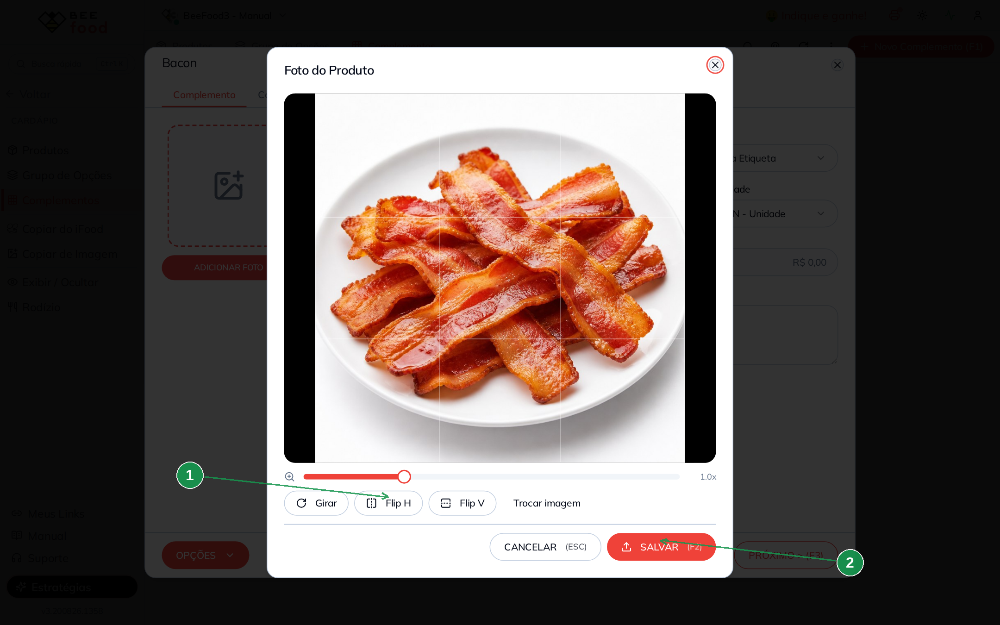

| Nº | Item | O que fazer |
|----|------|-------------|
| 1 | **Girar · Flip H · Flip V · Trocar imagem** | Ajustes de enquadramento. A barra à esquerda dá zoom. |
| 2 | **SALVAR (F2)** | Envia a imagem e volta ao cadastro. |

> Aceita **PNG, JPG e WebP**, até **5 MB**.

Repita o cadastro para os outros dois complementos. No exemplo ficaram três:

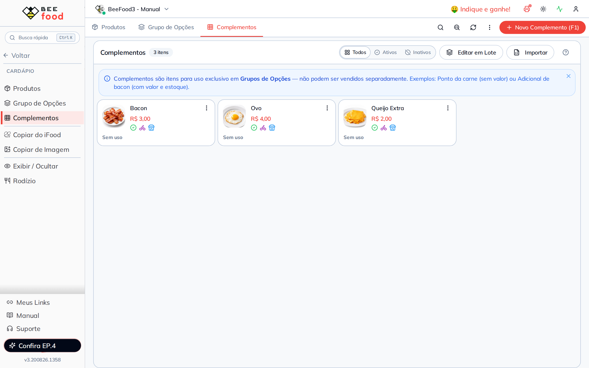

Repare no rodapé de cada card: **Sem uso**. É o sistema dizendo que o complemento ainda não
entrou em nenhum grupo — o que é normal neste ponto. Quando entrar, o texto passa a
**Usado 1 vez(es)** com o nome do grupo.

---

## Parte 3 — Criar o grupo de opções

Abra a aba **Grupo de Opções** e clique em **Novo Grupo (F1)** (1).

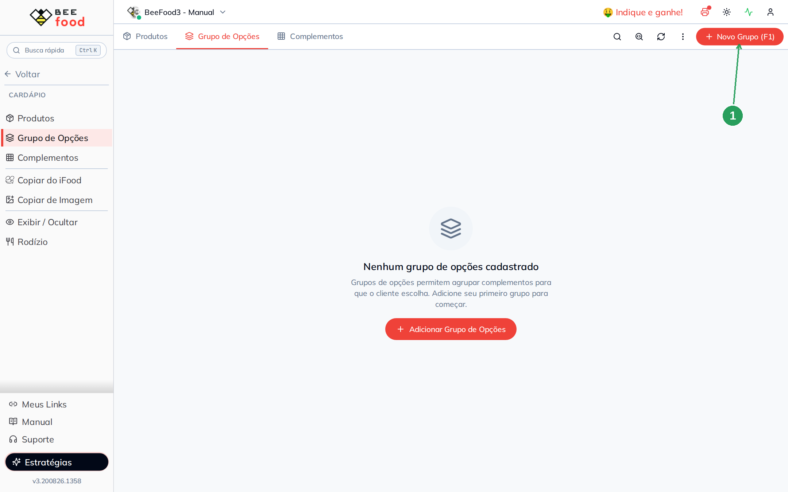

| Nº | Item | O que fazer |
|----|------|-------------|
| 1 | **Novo Grupo (F1)** | Abre o cadastro de um grupo novo. |

> Use o **botão**, não a tecla F1: nessa aba o atalho abre o cadastro de produto.

### Detalhes do Grupo

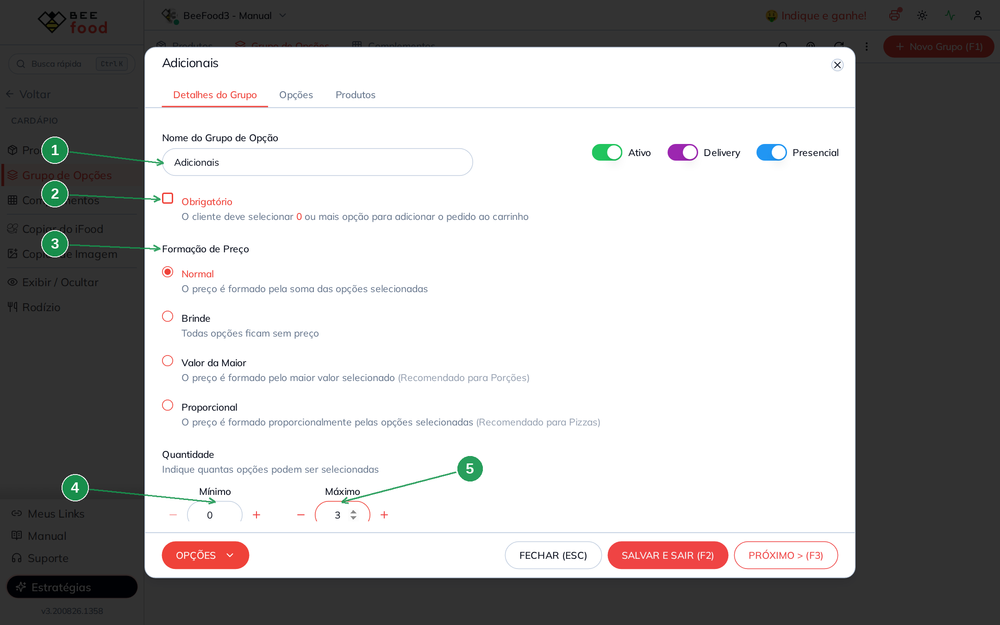

| Nº | Campo | O que fazer |
|----|-------|-------------|
| 1 | **Nome do Grupo de Opção\*** | O título que o cliente vê na hora de escolher. No exemplo, `Adicionais`. |
| 2 | **Obrigatório** | Marque se o cliente **precisa** escolher para fechar o pedido. No exemplo fica desmarcado — adicional é opcional. |
| 3 | **Formação de Preço** | Como o preço das opções entra na conta. No exemplo, **Normal**. Explicado na Parte 7. |
| 4 | **Mínimo** | Quantas opções o cliente precisa marcar. No exemplo, `0`. |
| 5 | **Máximo** | Quantas ele pode marcar no total. No exemplo, `3`. |

Os switches **Ativo**, **Delivery** e **Presencial** já vêm ligados: o grupo vale para os dois
canais de venda. Desligue **Delivery** ou **Presencial** se o grupo só deve valer num deles.

> **Mínimo e Máximo são a regra que o cliente vê.** Com 0 e 3, ele lê *"Escolha 0 a 3"* e pode
> passar sem marcar nada. Com 1 e 1, ele é obrigado a escolher exatamente uma opção — é assim
> que se monta tamanho, ponto da carne ou sabor único.

---

## Parte 4 — Incluir as opções no grupo

Ainda no grupo, abra a aba **Opções** (o sistema destaca em vermelho a aba ativa).

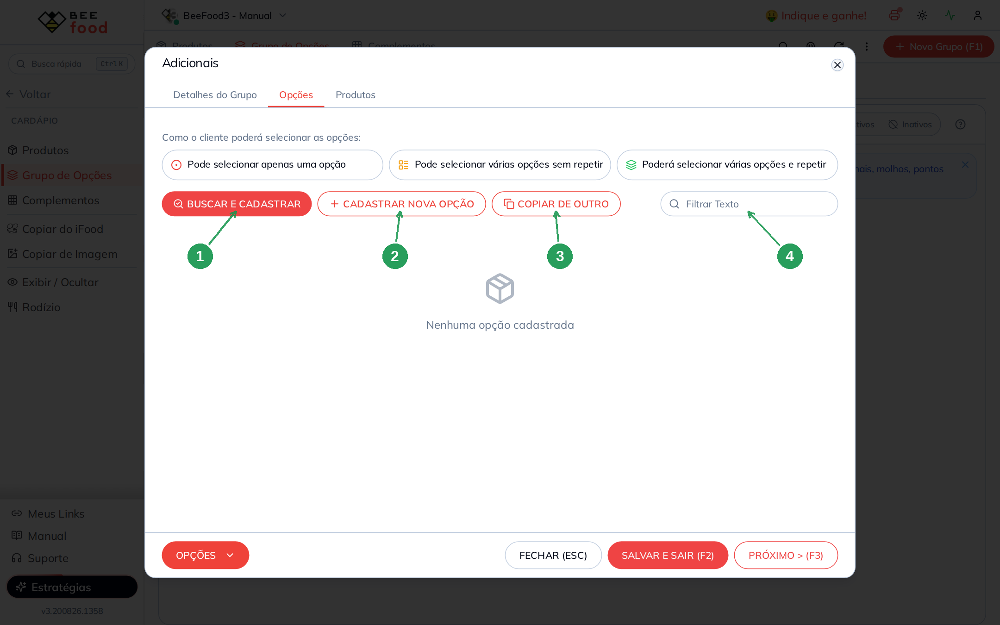

| Nº | Item | O que fazer |
|----|------|-------------|
| 1 | **BUSCAR E CADASTRAR** | Busca complementos e produtos já cadastrados e inclui vários de uma vez. **É o caminho mais rápido.** |
| 2 | **CADASTRAR NOVA OPÇÃO** | Cria uma opção do zero, linha por linha. |
| 3 | **COPIAR DE OUTRO** | Traz as opções de outro grupo que você já montou. |
| 4 | **Filtrar Texto** | Filtra a lista de opções. Útil quando o grupo tem muitas. |

Os três botões do topo (*Pode selecionar apenas uma opção*, *Pode selecionar várias opções sem
repetir*, *Poderá selecionar várias opções e repetir*) são atalhos que ajustam Mínimo e Máximo
do grupo **e** de todas as opções de uma vez. Servem para acertar a regra sem preencher número
por número.

### Selecionar os complementos

Clique em **BUSCAR E CADASTRAR**. A janela lista tudo que pode virar opção — complementos e
produtos, com foto e preço.

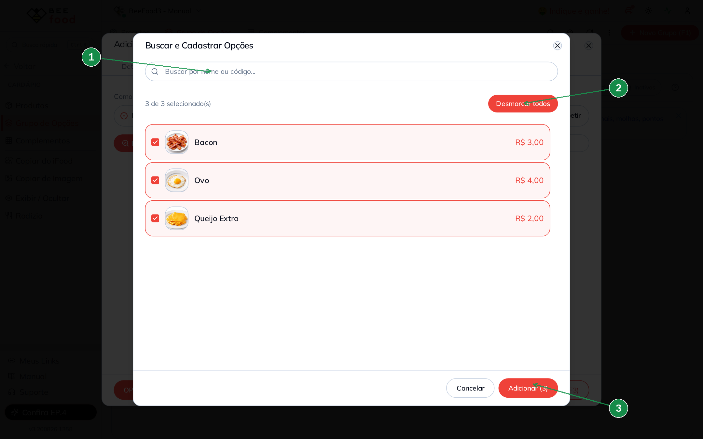

| Nº | Item | O que fazer |
|----|------|-------------|
| 1 | **Buscar por nome ou código** | Filtra a lista. Com poucos itens, nem precisa. |
| 2 | **Selecionar todos** | Marca todos de uma vez. Ou marque um por um na caixinha à esquerda. |
| 3 | **Adicionar** | Inclui os marcados no grupo. |

### Conferir as opções incluídas

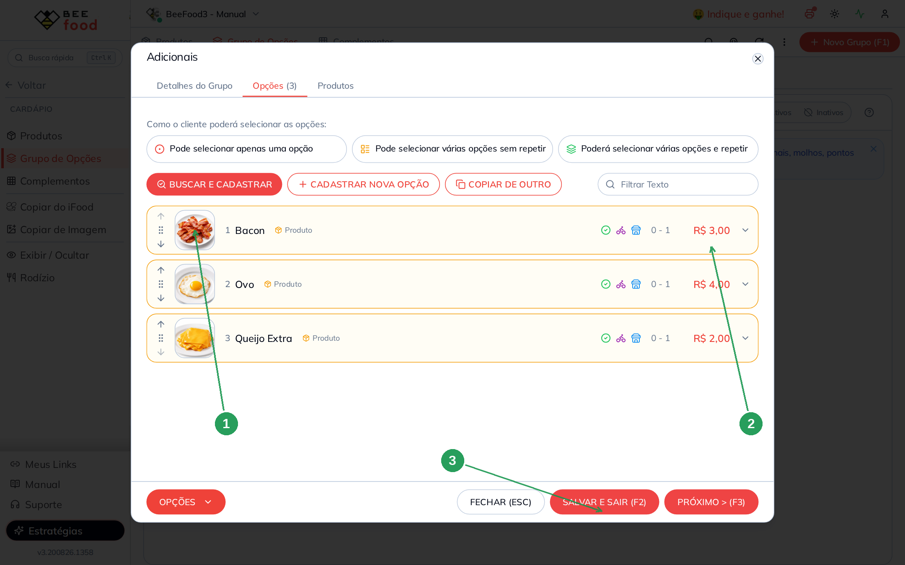

| Nº | Item | O que observar |
|----|------|----------------|
| 1 | **Opção** | Nome e foto vêm do complemento — você não cadastra de novo. |
| 2 | **Valor** | O preço herdado do complemento. Para mudar, clique na linha e ela se expande. |
| 3 | **SALVAR E SAIR (F2)** | Grava o grupo com as opções. **Não esqueça deste passo.** |

O contador da aba passa a mostrar **Opções (3)**, e a coluna do meio indica *0 - 1* — o mínimo
e o máximo **de cada opção** (diferente do mínimo e máximo do grupo).

> **Para alterar o preço de uma opção**, clique na linha: ela abre e libera **Valor**,
> **V. Delivery**, **V. Presencial**, **Ativo**, **Mínimo** e **Máximo**. Para alterar **várias
> opções de uma vez**, use a Parte 8.

---

## Parte 5 — Cadastrar o produto

Volte para a aba **Produtos**.

### Antes: criar o setor

Setor é a categoria que agrupa os produtos no cardápio (Lanches, Bebidas, Sobremesas). Clique
em **Novo Setor** na coluna da esquerda.

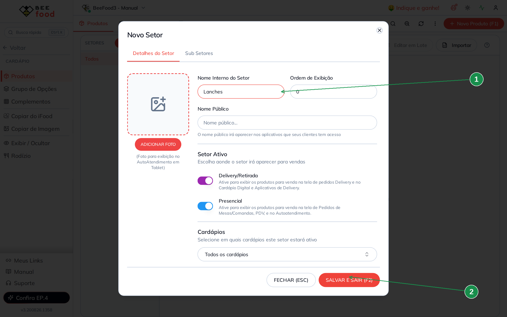

| Nº | Campo | O que fazer |
|----|-------|-------------|
| 1 | **Nome Interno do Setor\*** | Nome que aparece para a sua equipe. No exemplo, `Lanches`. |
| 2 | **SALVAR E SAIR (F2)** | Grava o setor. |

Os switches **Delivery/Retirada** e **Presencial** já vêm ligados. **Nome Público** é opcional
— preencha só se o cliente deve ver um nome diferente do interno.

### O cadastro do produto

Clique em **Novo Produto (F1)** e preencha:

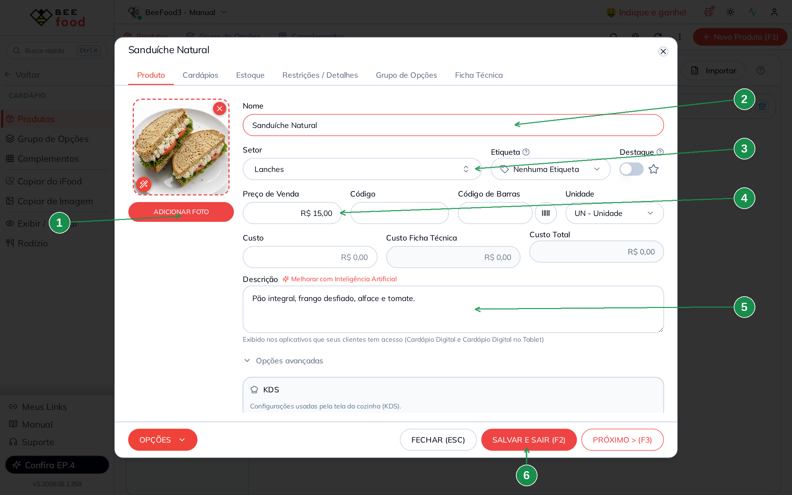

| Nº | Campo | O que fazer |
|----|-------|-------------|
| 1 | **ADICIONAR FOTO** | Mesmo editor da Parte 2. A foto aparece no PDV e no cardápio digital. |
| 2 | **Nome\*** | Único campo obrigatório. No exemplo, `Sanduíche Natural`. |
| 3 | **Setor** | Onde o produto aparece no cardápio. No exemplo, `Lanches`. |
| 4 | **Preço de Venda** | O preço base, **sem** os adicionais. No exemplo, `R$ 15,00`. |
| 5 | **Descrição** | Texto que o cliente lê no cardápio digital e no PDV. |
| 6 | **SALVAR E SAIR (F2)** | Grava o produto. |

> **Preço de Venda é o preço base.** O que vem dos grupos de opções é somado em cima dele na
> hora da venda — você não precisa criar um produto para cada combinação de adicional.

---

## Parte 6 — Vincular o grupo ao produto

É o passo que liga as duas metades. Ainda no produto, abra a aba **Grupo de Opções** (1).

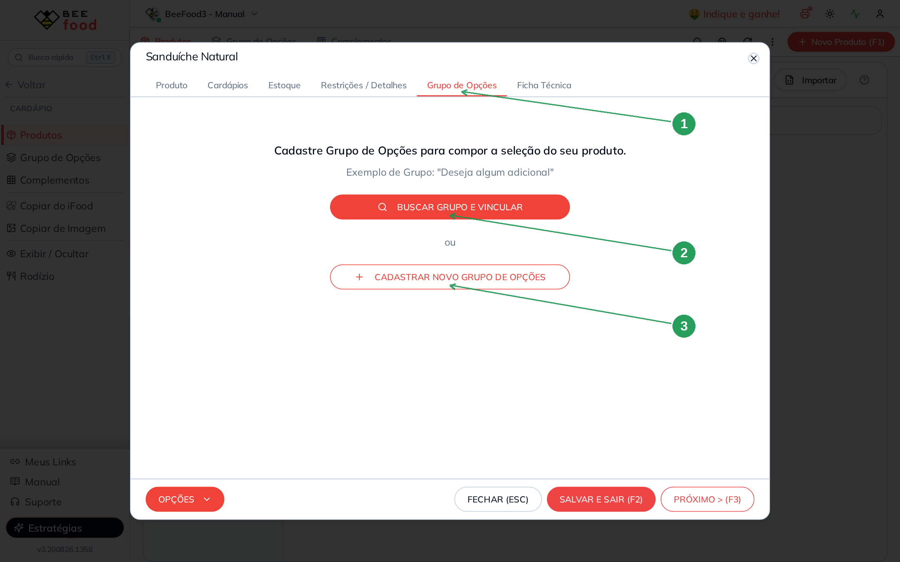

| Nº | Item | O que fazer |
|----|------|-------------|
| 1 | **Grupo de Opções** | Aba do produto onde ficam os grupos vinculados. |
| 2 | **BUSCAR GRUPO E VINCULAR** | Usa um grupo que já existe. É o nosso caso. |
| 3 | **CADASTRAR NOVO GRUPO DE OPÇÕES** | Cria um grupo do zero e já vincula. Atalho para quando você pulou a Parte 3. |

Clique em **BUSCAR GRUPO E VINCULAR**:

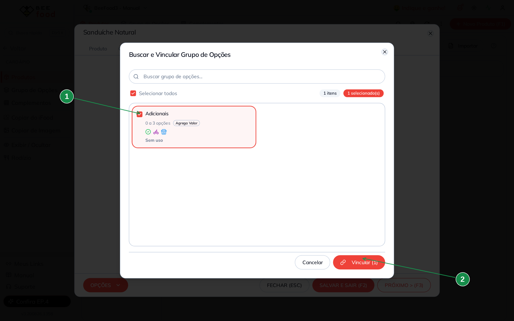

| Nº | Item | O que fazer |
|----|------|-------------|
| 1 | **Marcar o grupo** | Marque a caixinha do grupo desejado. O card mostra o resumo (*0 a 3 opções*) e o selo da formação de preço (*Agrega Valor*). |
| 2 | **Vincular** | Liga o grupo ao produto. |

### Conferir o vínculo

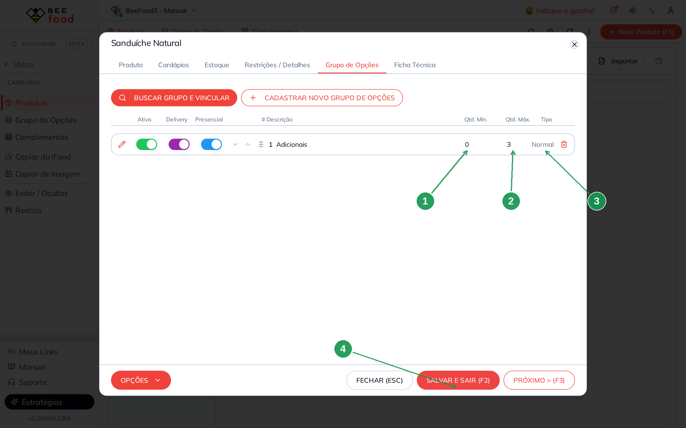

| Nº | Coluna | O que confere |
|----|--------|---------------|
| 1 | **Qtd. Mín.** | O mínimo do grupo. No exemplo, `0`. |
| 2 | **Qtd. Máx.** | O máximo do grupo. No exemplo, `3`. |
| 3 | **Tipo** | A formação de preço traduzida. No exemplo, `Normal`. |
| 4 | **SALVAR E SAIR (F2)** | Grava o produto com o vínculo. |

Os switches da linha (**Ativo**, **Delivery**, **Presencial**) permitem valer o grupo só num
canal, **para este produto**. As setas ao lado mudam a ordem em que os grupos aparecem na
venda, quando há mais de um.

> ⚠️ **O grupo é compartilhado.** Se você vincular o mesmo grupo "Adicionais" a dez produtos,
> qualquer mudança nele (preço, mínimo, máximo, opções) vale para os dez. Isso é ótimo para
> reajuste — e perigoso se você esquecer. Quando um produto precisa de uma regra própria,
> **clone o grupo** e edite a cópia.

Pronto. O produto aparece no cardápio, dentro do setor, com foto e preço:

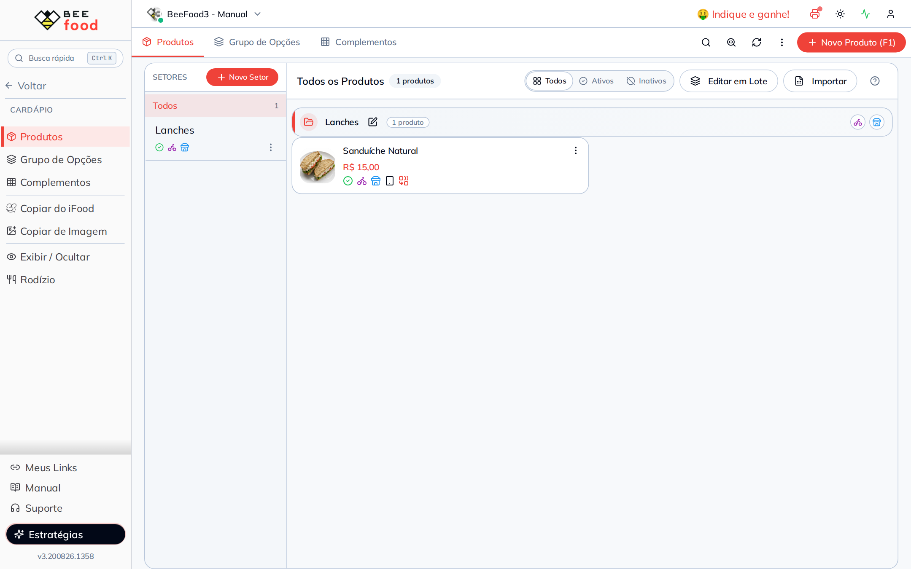

O selo **COMBO** no card indica que o produto tem grupo de opções vinculado.

---

## Parte 7 — Conferir na venda (PDV)

Nunca considere o cadastro pronto sem ver como ele chega na tela de venda. Abra o **PDV** e
clique no produto.

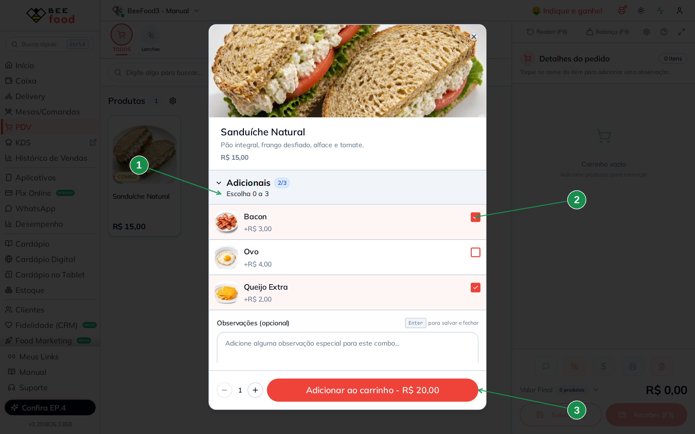

| Nº | Item | O que confere |
|----|------|---------------|
| 1 | **Nome do grupo, contador e regra** | Mostra `Adicionais`, o contador `2/3` e a frase *Escolha 0 a 3* — exatamente o Mínimo e o Máximo da Parte 3. |
| 2 | **Opção marcada** | Cada opção traz a foto e o acréscimo (*+R$ 3,00*), vindos do complemento. |
| 3 | **Adicionar ao carrinho** | O botão recalcula o total a cada clique. |

Com **Bacon** e **Queijo Extra** marcados, o botão mostra **R$ 20,00**:

```
R$ 15,00 (produto)  +  R$ 3,00 (Bacon)  +  R$ 2,00 (Queijo Extra)  =  R$ 20,00
```

Essa soma é a **Formação de Preço Normal** funcionando. Confirme e veja o carrinho:

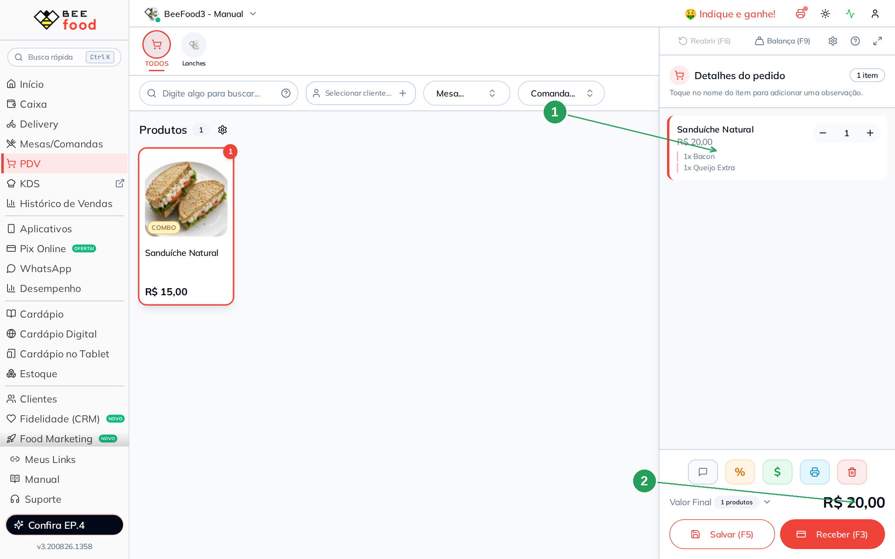

| Nº | Item | O que confere |
|----|------|---------------|
| 1 | **Item no carrinho** | O produto sai com os adicionais listados abaixo (`1x Bacon`, `1x Queijo Extra`). |
| 2 | **Valor Final** | R$ 20,00, igual ao previsto. |

### As quatro Formações de Preço

Este é o campo que mais gera dúvida, e ele muda completamente a conta. São quatro modos, todos
no mesmo lugar (grupo → **Detalhes do Grupo** → **Formação de Preço**):

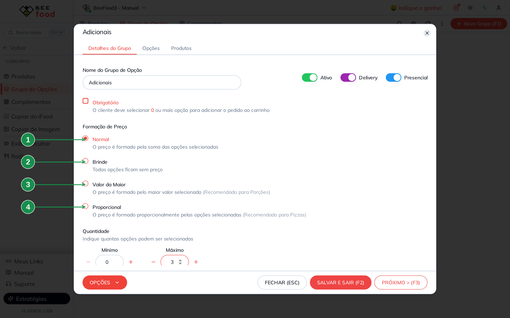

| Nº | Modo | Como calcula | Quando usar |
|----|------|--------------|-------------|
| 1 | **Normal** | **Soma** o preço de cada opção escolhida. | Adicionais, extras, coberturas. É o padrão e o usado neste manual. |
| 2 | **Brinde** | Todas as opções ficam **sem preço**. | Escolhas que não mudam o valor: ponto da carne, retirar ingrediente, tipo de talher. |
| 3 | **Valor da Maior** | Cobra **apenas a opção mais cara** selecionada. | Porções e combos em que o cliente escolhe entre alternativas de preço diferente. Também é o caminho mais simples para pizza meio a meio. |
| 4 | **Proporcional** | **Soma as opções** e, por dentro, divide o valor igualmente entre elas no rateio da venda. | Pizza em que cada opção representa uma **fração** (meia pizza), com o preço da fração cadastrado na opção. |

Um exemplo com duas opções de R$ 40,00 e R$ 45,00 deixa a diferença clara:

| Modo | Conta | Total |
|------|-------|-------|
| Normal | 40 + 45 | R$ 85,00 |
| Brinde | — | R$ 0,00 (só o preço base do produto) |
| Valor da Maior | o maior entre 40 e 45 | **R$ 45,00** |
| Proporcional | 40 + 45 | **R$ 85,00** |

> ⚠️ **Proporcional não faz média do preço que você cadastrou.** Ele **soma**, como o Normal. A
> "proporção" acontece no rateio interno da venda (cada opção contabiliza o mesmo valor nos
> relatórios), e não como desconto para o cliente. Para uma pizza meio a meio sair pela média,
> o preço cadastrado em cada opção precisa ser o de **meia pizza** — aí duas metades de
> R$ 20,00 e R$ 22,50 fecham em R$ 42,50, que é a média de R$ 40,00 e R$ 45,00.

> No PDV, o modo **Valor da Maior** exibe um aviso ao operador explicando que só a opção mais
> cara será cobrada — ele não precisa decorar a regra. O **Proporcional não tem aviso**.

O manual de **pizza** monta os modos **Proporcional** e **Valor da Maior** lado a lado, com
dois produtos, e mostra o preço que cada um cobra na tela de venda.

---

## Parte 8 — Filtrar, editar e reajustar preços em lote

Cadastrar é a parte fácil; **manter** é o trabalho de todo mês. Quando o custo sobe, você não
precisa abrir opção por opção: existe uma tela que lista **todas as opções do cardápio** e
permite alterá-las em lote.

Vá em **Cardápio → Grupo de Opções** e abra a sub-aba **Opções** (1).

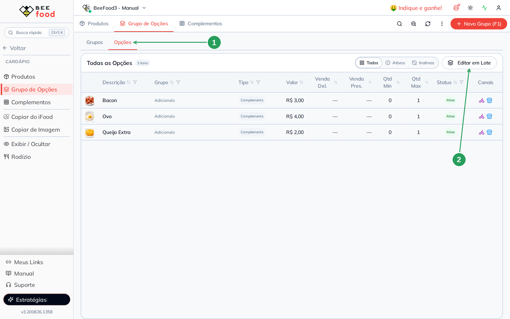

| Nº | Item | O que faz |
|----|------|-----------|
| 1 | **Opções** | Sub-aba com **todas** as opções do cardápio, de todos os grupos — não só de um. |
| 2 | **Editar em Lote** | Abre o assistente de alteração em massa. |

A tabela mostra, para cada opção: **Descrição**, **Grupo** a que pertence, **Tipo**, **Valor**,
**Venda Del.**, **Venda Pres.**, **Qtd Min**, **Qtd Max**, **Status** e **Canais**. Cada
cabeçalho tem o ícone de **ordenação**; e **Descrição**, **Grupo**, **Tipo** e **Status** têm
também o ícone de **funil**, para filtrar.

### Filtrar antes de alterar

Clique no funil ao lado do nome da coluna. No exemplo, filtramos a coluna **Descrição** por
`Queijo`:

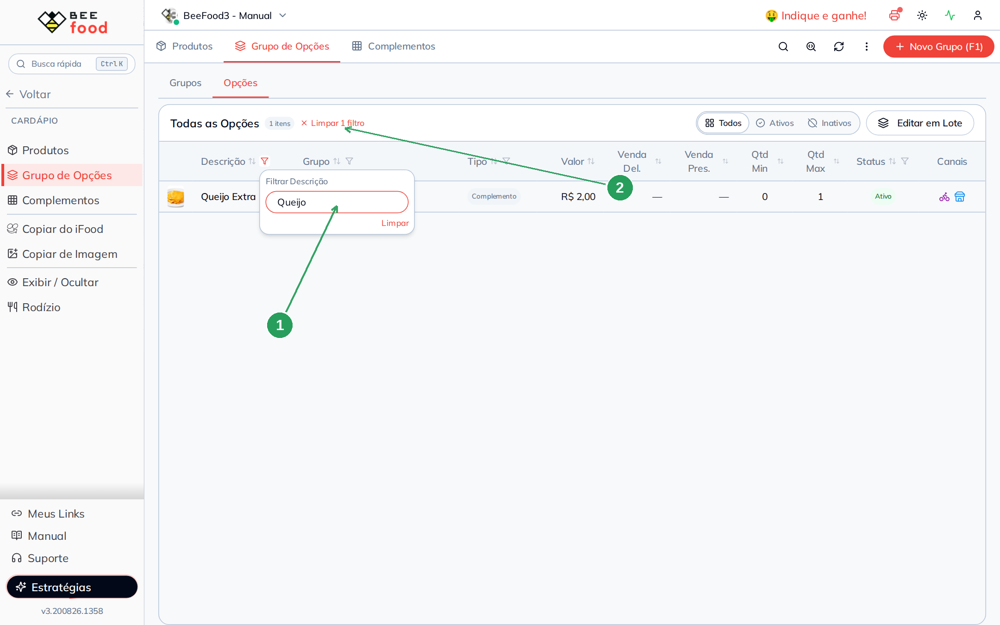

| Nº | Item | O que faz |
|----|------|-----------|
| 1 | **Digite para filtrar...** | Filtra a coluna. A lista já responde enquanto você digita — de 3 itens para 1. |
| 2 | **Limpar 1 filtro** | Remove os filtros ativos. O contador ao lado do título mostra quantos itens sobraram. |

> **Filtre primeiro, depois altere em lote.** Se você quer reajustar só as coberturas, filtre
> pelo grupo "Coberturas" e trabalhe apenas com elas. Em cardápio grande, isso é a diferença
> entre um reajuste seguro e um acidente.

### Etapa 1 — escolher as opções

Clique em **Editar em Lote**. O assistente tem três etapas, e ele avisa em qual você está
(*Etapa 1 de 3*).

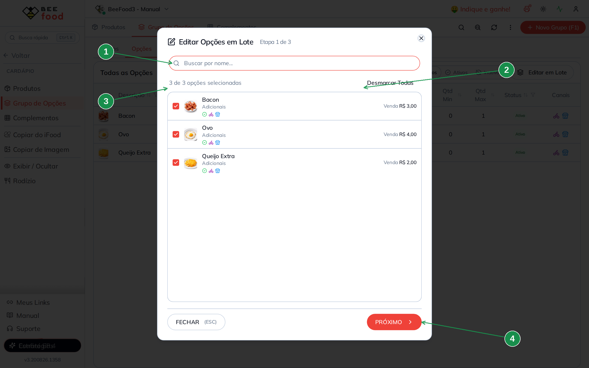

| Nº | Item | O que fazer |
|----|------|-------------|
| 1 | **Buscar por nome...** | Filtra a lista dentro do assistente. |
| 2 | **Desmarcar Todas** | Desmarca tudo, para você escolher poucas opções. Quando nada está marcado, o link vira **Marcar Todas**. |
| 3 | **Contador** | Mostra *3 de 3 opções selecionadas*. **Todas já vêm marcadas** — confira antes de seguir. |
| 4 | **PRÓXIMO** | Vai para a configuração. |

### Etapa 2 — dizer o que muda

Aqui você **marca só o que quer alterar**. O que ficar desmarcado não é tocado.

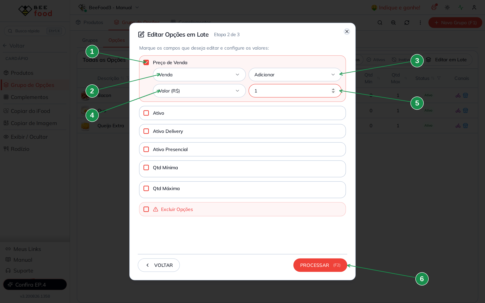

| Nº | Campo | O que fazer |
|----|-------|-------------|
| 1 | **Preço de Venda** | Marque para liberar os quatro campos de preço abaixo. |
| 2 | **Qual preço** | **Venda**, **Delivery** ou **Presencial**. No exemplo, `Venda`. |
| 3 | **Tipo de ajuste** | **Novo Valor** (substitui), **Adicionar** (soma) ou **Subtrair** (desconta). No exemplo, `Adicionar`. |
| 4 | **Unidade** | **Valor (R$)** ou **Porcentagem (%)**. No exemplo, `Valor (R$)`. |
| 5 | **Quanto** | O número do ajuste. No exemplo, `1` — ou seja, +R$ 1,00 em cada opção. |
| 6 | **PROCESSAR (F2)** | Aplica. |

Os outros campos disponíveis nesta etapa:

| Campo | Para que serve |
|-------|----------------|
| **Ativo** / **Ativo Delivery** / **Ativo Presencial** | Ligar ou desligar várias opções de uma vez. |
| **Qtd Mínima** / **Qtd Máxima** | Padronizar as quantidades de várias opções. |
| **Excluir Opções** | Apaga as opções selecionadas. **Não tem volta** — daí o alerta em vermelho. |

> **Adicionar em % ou em R$ dá resultados diferentes.** `Adicionar` + `Porcentagem (%)` + `10`
> sobe 10% sobre o preço atual de cada opção (cada uma sobe um valor diferente).
> `Adicionar` + `Valor (R$)` + `1` sobe exatamente R$ 1,00 em todas.

### Etapa 3 — conferir o resultado

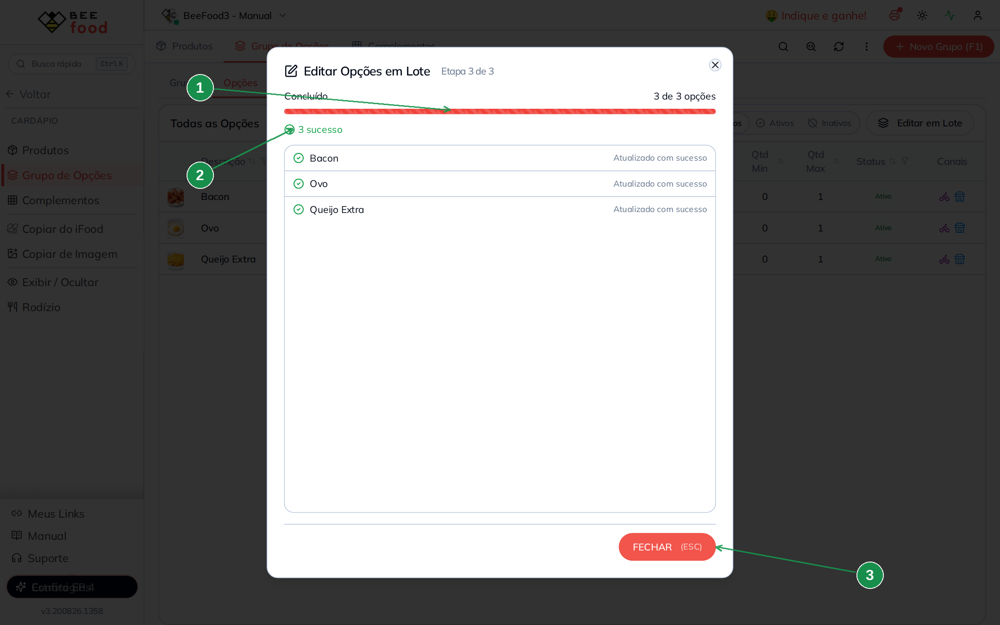

| Nº | Item | O que confere |
|----|------|---------------|
| 1 | **Concluído** | A barra completa e o total processado (*3 de 3 opções*). |
| 2 | **3 sucesso** | Quantas deram certo. Cada linha abaixo mostra *Atualizado com sucesso*. |
| 3 | **FECHAR (ESC)** | Fecha e atualiza a listagem. |

De volta à listagem, os preços já estão reajustados:

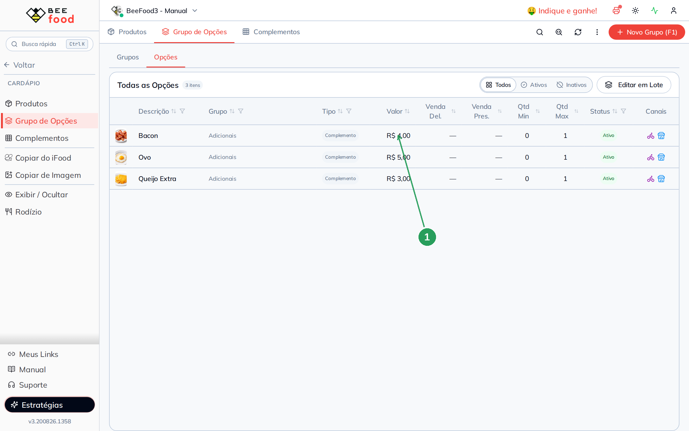

| Nº | Coluna | O que confere |
|----|--------|---------------|
| 1 | **Valor** | Bacon R$ 3,00 → **R$ 4,00**, Ovo R$ 4,00 → **R$ 5,00**, Queijo Extra R$ 2,00 → **R$ 3,00**. |

Cada opção subiu exatamente R$ 1,00, como pedido. As alterações valem **na hora** para todos
os produtos que usam esses grupos.

> **Dica extra — reajustar preços das opções em lote**
>
> Depois de montar complementos e grupos, use **Cardápio → Grupo de Opções → Opções**:
>
> 1. **Filtro** — encontre as opções pelo funil da coluna (Descrição, Grupo, Tipo ou Status).
> 2. **Edição** — para uma opção só, clique na linha dentro do grupo e altere o valor.
> 3. **Edição em lote** — marque várias e aplique o novo preço de uma vez.
>
> Ideal para **reajuste de cardápio** sem abrir produto por produto — por exemplo, subir todos
> os adicionais de R$ 3,00 para R$ 4,00.

---

## Resumo do caminho

```
1. Complementos          → cadastre os itens (com foto e preço)
2. Grupo de Opções       → crie o grupo (nome, mínimo, máximo, formação de preço)
3. Aba Opções do grupo   → inclua os complementos e SALVE
4. Produtos              → crie o setor e o produto (nome, preço base, foto)
5. Aba Grupo de Opções   → vincule o grupo ao produto e SALVE
6. PDV                   → confira o total antes de liberar para venda
7. Sub-aba Opções        → filtre e reajuste preços em lote quando precisar
```

---

## Perguntas frequentes

**Preciso cadastrar complemento ou posso usar produto como opção?**
Os dois funcionam — a busca da aba Opções lista produtos e complementos. Use **complemento**
quando o item não é vendido sozinho (bacon, granola, shoyu). Use **produto** quando ele também
vai para o cardápio por conta própria (uma pizza que é vendida inteira e também entra como
sabor num grupo).

**Mudei o preço do complemento e a opção não mudou. Por quê?**
O preço da opção é gravado no grupo no momento em que ela é incluída. Depois disso, os dois
vivem separados: altere pela linha da opção ou pelo **Editar em Lote**. E quando o complemento
já participa de algum grupo, o campo **Preço de Venda** dele aparece bloqueado, justamente
para deixar isso claro.

**Um grupo pode servir a vários produtos?**
Sim, e é o uso recomendado. Só lembre que **toda alteração vale para todos os vinculados**. Se
um produto precisa de regra própria, use **Clonar** no menu do grupo e edite a cópia.

**Um produto pode ter mais de um grupo?**
Sim. É o normal: um hambúrguer costuma ter "Ponto da carne", "Adicionais" e "Retirar". As
setas na aba Grupo de Opções definem a ordem em que eles aparecem na venda.

**Qual a diferença entre o mínimo/máximo do grupo e o da opção?**
O do **grupo** limita o total de escolhas (*Escolha 0 a 3*). O da **opção** limita cada item
individualmente — com máximo 2, o cliente pode pedir bacon duplo. Os três atalhos no topo da
aba Opções ajustam os dois de uma vez.

**Cadastrei mas não aparece no PDV.**
Confira, nesta ordem: o produto está **Ativo**; o switch **Presencial** está ligado (o PDV é
venda presencial); o **setor** também está ativo para Presencial; e o produto pertence ao
cardápio que está selecionado na tela.

**Onde entram Estoque e Ficha Técnica?**
São as outras abas do modal do produto e ficam para manuais próprios. Nada neste manual
depende delas.

---

## Próximos manuais do cardápio

| Manual | O que acrescenta |
|--------|------------------|
| **Cardápio — hambúrguer** | Ponto da carne (**Brinde**), adicionais (**Normal**) e retirar ingredientes |
| **Cardápio — pizza** | **Proporcional** e **Valor da Maior** lado a lado, com meio a meio e borda |
| **Cardápio — açaí** | Três tamanhos e grupos grandes de acompanhamentos e coberturas |
| **Cardápio — comida japonesa** | Combinado com contagem exata de peças e temaki com adicionais |
