# Manual do Cardápio — Hambúrguer

Este manual monta um hambúrguer completo no BeeFood, com as três perguntas que a hamburgueria
faz em toda venda: **qual o ponto da carne**, **quer algum adicional** e **quer tirar alguma
coisa**. No caminho você aprende a usar a formação **Brinde** — a opção que o cliente escolhe
mas que **não muda o preço**.

> Leia antes o manual **Cardápio — fundamentos**. Ele ensina o fluxo básico (complemento →
> grupo → produto → vínculo) que aqui aparece resumido.

> As imagens têm **setas numeradas** (1, 2, 3…). Cada número indica o campo ou botão
> correspondente na tela. Campos com **\*** são **obrigatórios**.

---

## O que este manual acrescenta

O hambúrguer é o caso em que os três tipos de grupo aparecem juntos:

| Pergunta ao cliente | Grupo | Formação de Preço | O que faz no preço |
|---------------------|-------|-------------------|--------------------|
| Qual o ponto da carne? | Ponto da carne | **Brinde** | nada — só informa a cozinha |
| Quer algum adicional? | Adicionais | **Normal** | **soma** cada item escolhido |
| Quer tirar alguma coisa? | Retirar ingredientes | **Brinde** | nada |

E o cliente é **obrigado** a escolher o ponto: é o checkbox **Obrigatório** do grupo em ação.

---

## O exemplo deste manual

| Item | Valor |
|------|-------|
| Setor | Lanches |
| Produtos | **X-Burger** R$ 28,00 e **X-Salada** R$ 26,00 |
| Ponto da carne | Mal passado · Ao ponto · Bem passado — todos **sem preço** |
| Adicionais | Bacon R$ 3,00 · Cheddar R$ 2,00 · Ovo R$ 4,00 · Cebola caramelizada R$ 5,00 |
| Retirar | Sem cebola · Sem tomate · Sem alface — todos **sem preço** |

A conta que vamos conferir no fim: **R$ 28,00 + Ao ponto + Bacon + Cheddar + Sem cebola =
R$ 33,00**. Só os dois adicionais entram na soma.

---

## Pré-requisitos

- Sessão iniciada em `https://beefood.app`.
- Permissão de menu **Cardápio**.
- Ter lido o manual **Cardápio — fundamentos**.

---

## Parte 1 — Cadastrar os complementos

Todos os itens que o cliente escolhe são **complementos**: os pontos da carne, os adicionais e
as retiradas. Cadastre em **Cardápio → Complementos** (passo a passo no manual de fundamentos).

A diferença entre eles está em duas coisas: **ter preço** e **ter foto**.

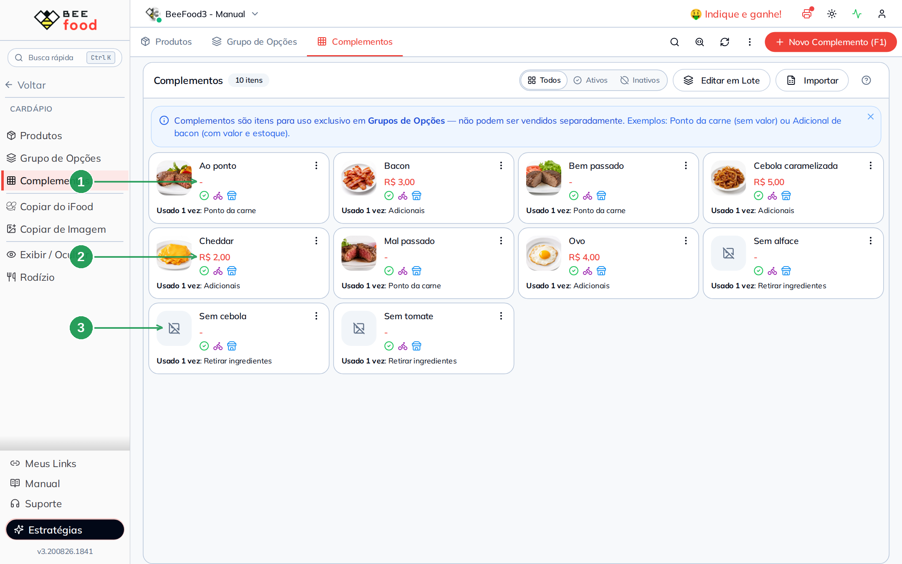

| Nº | Item | Como cadastrar |
|----|------|----------------|
| 1 | **Ponto da carne** | **Sem preço** (deixe R$ 0,00). A foto ajuda o cliente a entender o ponto no cardápio digital. |
| 2 | **Adicional** | **Com preço** — é ele que vai somar na conta. |
| 3 | **Retirada** | **Sem preço** e, aqui, **sem foto**: não existe imagem que faça sentido para "Sem cebola". |

> **Preço zero no complemento é o que garante o preço zero na venda.** Marcar o grupo como
> Brinde declara a intenção, mas o que o sistema soma é o valor da opção. Se o complemento tiver
> preço e o grupo for Brinde, o preço ainda aparece na conta. Deixe em R$ 0,00 e não haverá
> surpresa.

> **A foto é opcional.** Item sem foto aparece com um ícone de imagem riscada. Para retirada
> isso é normal; para ponto da carne e adicionais, vale a pena ter.

---

## Parte 2 — O grupo do ponto da carne (Brinde + Obrigatório)

Crie o grupo em **Cardápio → Grupo de Opções → Novo Grupo (F1)**.

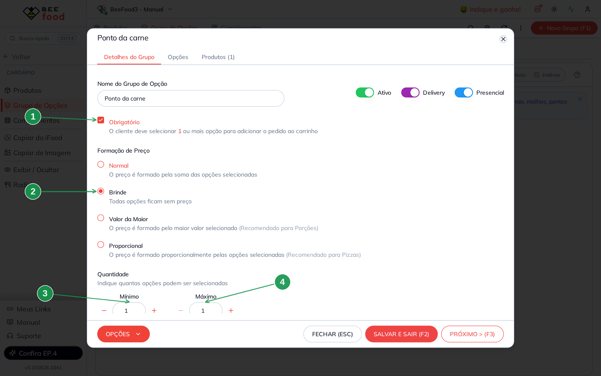

| Nº | Campo | O que preencher |
|----|-------|-----------------|
| 1 | **Obrigatório** | Marque. O cliente **precisa** escolher o ponto para fechar o pedido. |
| 2 | **Brinde** | A escolha não altera o preço. |
| 3 | **Mínimo** | `1`. |
| 4 | **Máximo** | `1` — exatamente um ponto, nunca dois. |

Mínimo e Máximo iguais a 1 é a combinação de "escolha uma e só uma". No PDV, cada opção vira
uma caixa de seleção e o cliente só consegue marcar uma.

> Com **Obrigatório** marcado, se você deixar o Mínimo em 0 o sistema corrige para 1 ao salvar —
> as duas coisas andam juntas.

### As opções ficam com valor zero

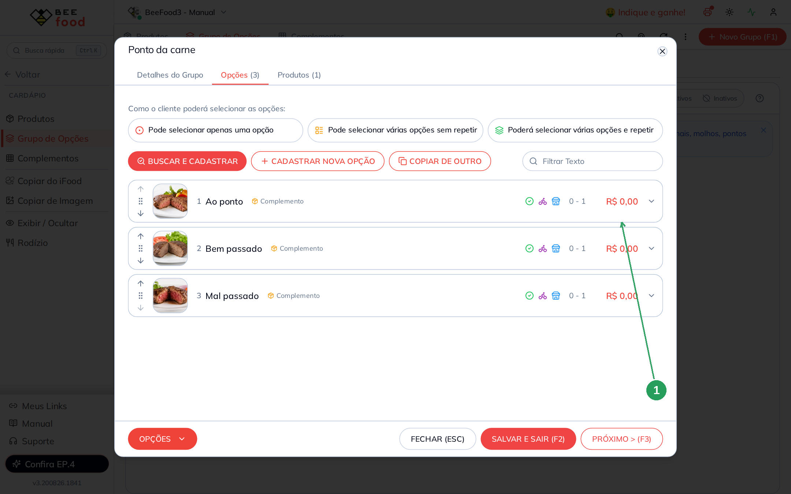

| Nº | Coluna | O que confere |
|----|--------|---------------|
| 1 | **Valor** | **R$ 0,00** nas três opções. É assim que tem de ficar num grupo Brinde. |

---

## Parte 3 — O grupo dos adicionais (Normal)

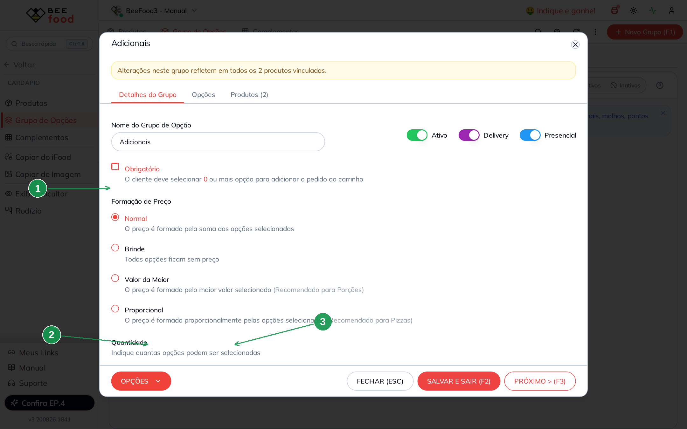

| Nº | Campo | O que preencher |
|----|-------|-----------------|
| 1 | **Normal** | Soma o preço de cada adicional escolhido. |
| 2 | **Mínimo** | `0` — adicional é opcional. |
| 3 | **Máximo** | `5` — até cinco itens. Ajuste ao que a sua cozinha aguenta. |

**Obrigatório fica desmarcado** aqui: ninguém é obrigado a pedir bacon.

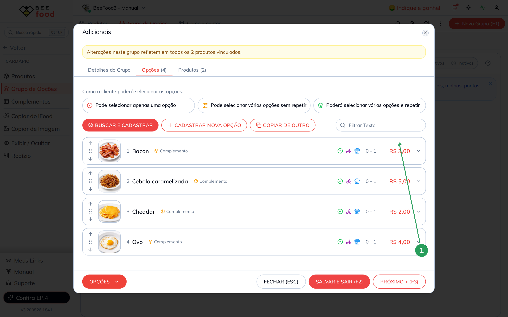

| Nº | Coluna | O que confere |
|----|--------|---------------|
| 1 | **Valor** | O preço de cada adicional: R$ 3,00, R$ 5,00, R$ 2,00 e R$ 4,00. Neste grupo o valor **soma**. |

---

## Parte 4 — O grupo de retirada (Brinde outra vez)

Mesmo Brinde do ponto da carne, com uma diferença: aqui o Mínimo é **0**.

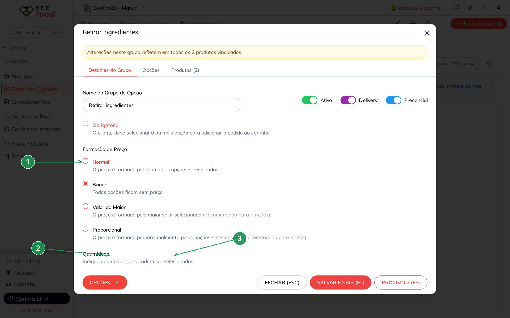

| Nº | Campo | O que preencher |
|----|-------|-----------------|
| 1 | **Brinde** | Retirar ingrediente não muda o preço. |
| 2 | **Mínimo** | `0` — o cliente pode não tirar nada. |
| 3 | **Máximo** | `3`. |

> **Por que não usar o campo de observação em vez deste grupo?** Porque observação é texto
> livre: cada atendente escreve de um jeito e a cozinha precisa ler. Como grupo, a retirada
> aparece sempre igual no pedido e você consegue medir quantas vezes foi pedida.

---

## Parte 5 — Cadastrar o hambúrguer

Em **Cardápio → Produtos**, crie o setor **Lanches** e o produto.

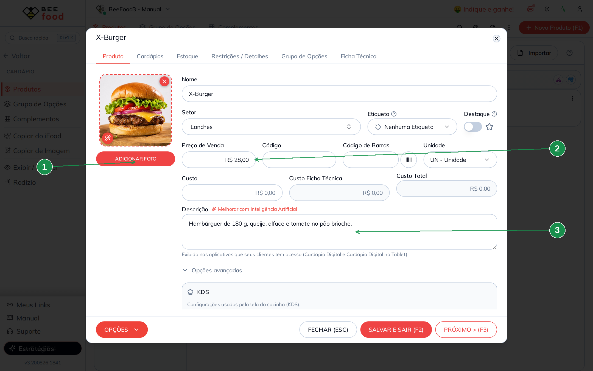

| Nº | Campo | O que preencher |
|----|-------|-----------------|
| 1 | **ADICIONAR FOTO** | A foto aparece grande na tela de venda. |
| 2 | **Preço de Venda** | **R$ 28,00** — o preço do lanche. |
| 3 | **Descrição** | O que vai no lanche. Aparece no cardápio digital e no PDV. |

> **Diferente da pizza, aqui o preço fica no produto.** No manual de pizza o produto tem preço
> R$ 0,00 porque o valor vem dos sabores. No hambúrguer o preço é do lanche, e os grupos apenas
> acrescentam (ou não) valor por cima.

---

## Parte 6 — Vincular os três grupos, na ordem certa

Na aba **Grupo de Opções** do produto, vincule os três.

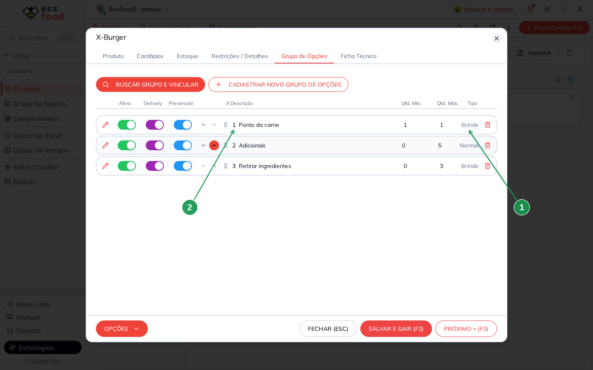

| Nº | Coluna | O que confere |
|----|--------|---------------|
| 1 | **Tipo** | A formação de cada grupo: `Brinde`, `Normal` e `Brinde`. É o resumo do que você configurou — confira aqui antes de liberar a venda. |
| 2 | **Ordem** | O número e as setas ↑↓ definem a ordem em que os grupos aparecem na venda. |

> **A ordem importa.** Ao vincular vários grupos de uma vez, eles entram em ordem alfabética
> (Adicionais primeiro). Use as setas para deixar na ordem em que o atendente pergunta: **ponto
> da carne, adicionais, retirada**. Uma clicada na seta já renumera tudo.

---

## Parte 7 — Conferir no PDV

Abra o **PDV** e clique no X-Burger.

### O grupo obrigatório avisa

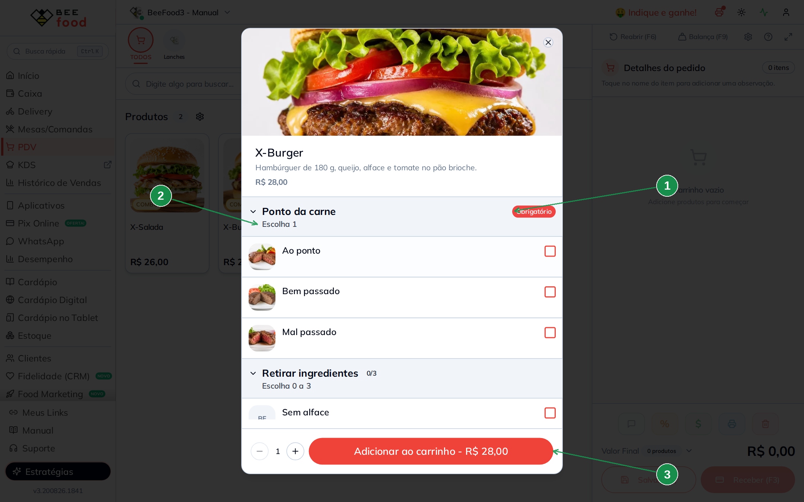

| Nº | Item | O que confere |
|----|------|---------------|
| 1 | **Selo Obrigatório** | Em vermelho, ao lado do nome do grupo. O operador vê que precisa escolher. |
| 2 | **Escolha 1** | A regra de mínimo e máximo que você definiu. |
| 3 | **Total** | R$ 28,00 — só o preço do lanche. |

E se o operador tentar adicionar sem escolher o ponto?

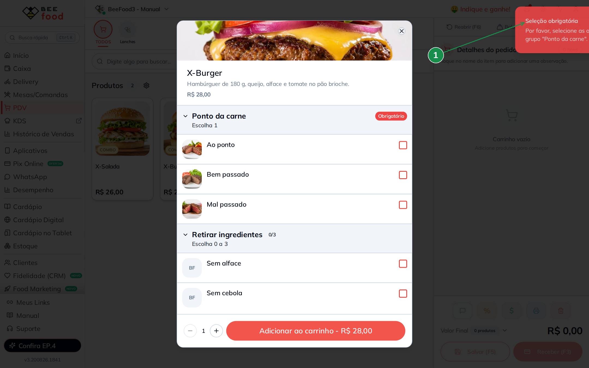

| Nº | Item | O que acontece |
|----|------|----------------|
| 1 | **Aviso Seleção obrigatória** | *Por favor, selecione as opções do grupo "Ponto da carne".* O item **não** vai para o carrinho e a janela continua aberta. |

> Repare que o botão **Adicionar ao carrinho** não fica cinza — ele continua clicável, e a
> checagem acontece no clique. Ou seja: o obrigatório não trava a tela, ele **barra o envio**.

### O Brinde não muda o preço

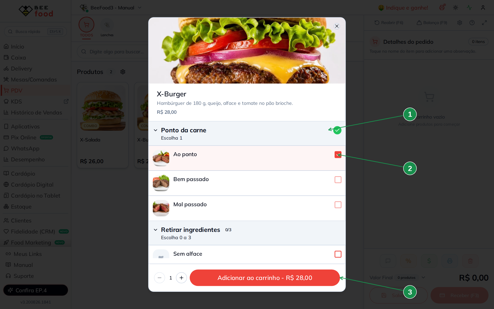

| Nº | Item | O que confere |
|----|------|---------------|
| 1 | **Ícone verde** | O selo vermelho de Obrigatório virou um check verde: a exigência foi cumprida. |
| 2 | **Opção marcada** | *Ao ponto* está selecionado e **não tem `+R$` nenhum** embaixo do nome. |
| 3 | **Total** | Continua **R$ 28,00**. É o Brinde funcionando. |

### Os adicionais somam

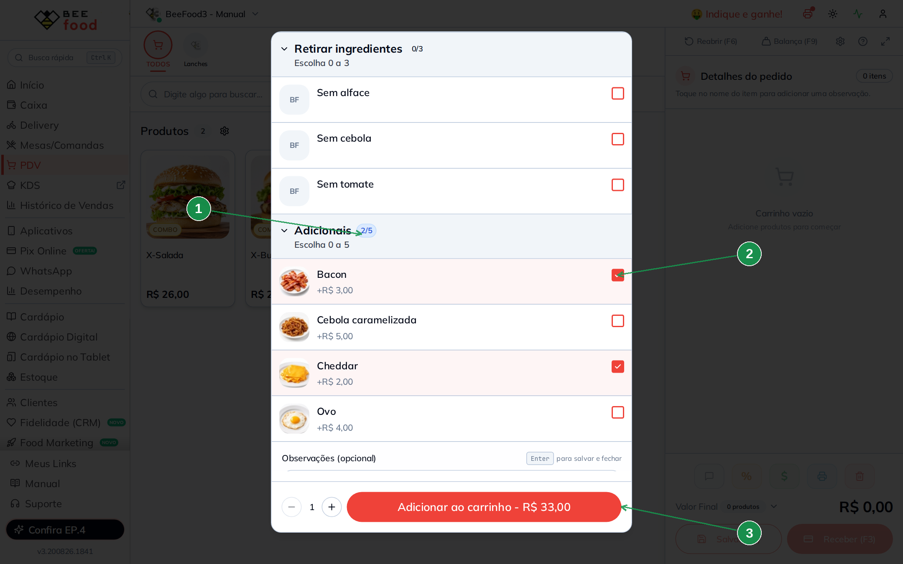

| Nº | Item | O que confere |
|----|------|---------------|
| 1 | **Contador 2/5** | Dois de até cinco adicionais escolhidos. |
| 2 | **Adicional marcado** | Aqui cada opção mostra o acréscimo (*+R$ 3,00*). |
| 3 | **Total** | **R$ 33,00** = R$ 28,00 + R$ 3,00 (Bacon) + R$ 2,00 (Cheddar). |

### A retirada também não muda nada

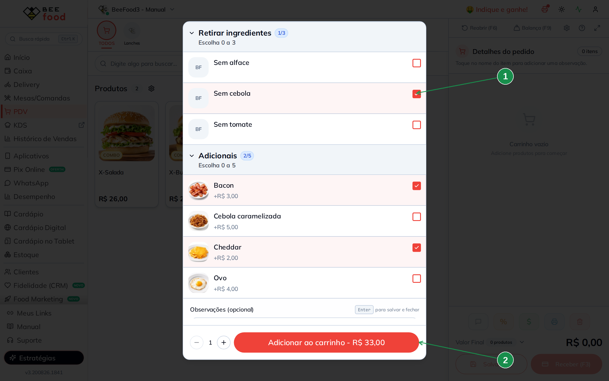

| Nº | Item | O que confere |
|----|------|---------------|
| 1 | **Sem cebola marcado** | Grupo Brinde, sem acréscimo. |
| 2 | **Total** | **R$ 33,00** — igual ao da imagem anterior. |

### E no carrinho aparece tudo

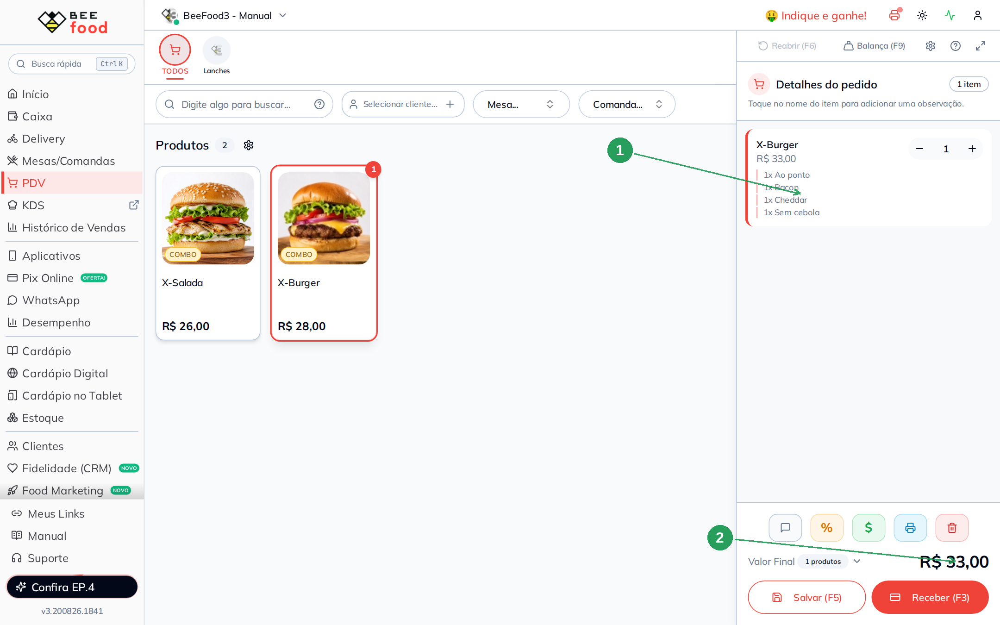

| Nº | Item | O que confere |
|----|------|---------------|
| 1 | **Escolhas listadas** | `1x Ao ponto`, `1x Bacon`, `1x Cheddar`, `1x Sem cebola`. **As opções de Brinde estão no pedido** — elas vão para a cozinha. |
| 2 | **Valor Final** | R$ 33,00. |

Esse é o ponto que resume o Brinde: **a informação chega à cozinha, o valor não chega à conta.**

---

## Parte 8 — Reaproveitar os grupos em outro lanche

O X-Salada é de frango: não tem ponto de carne, mas leva os mesmos adicionais e as mesmas
retiradas. Em vez de cadastrar tudo de novo, **vincule os grupos que já existem**.

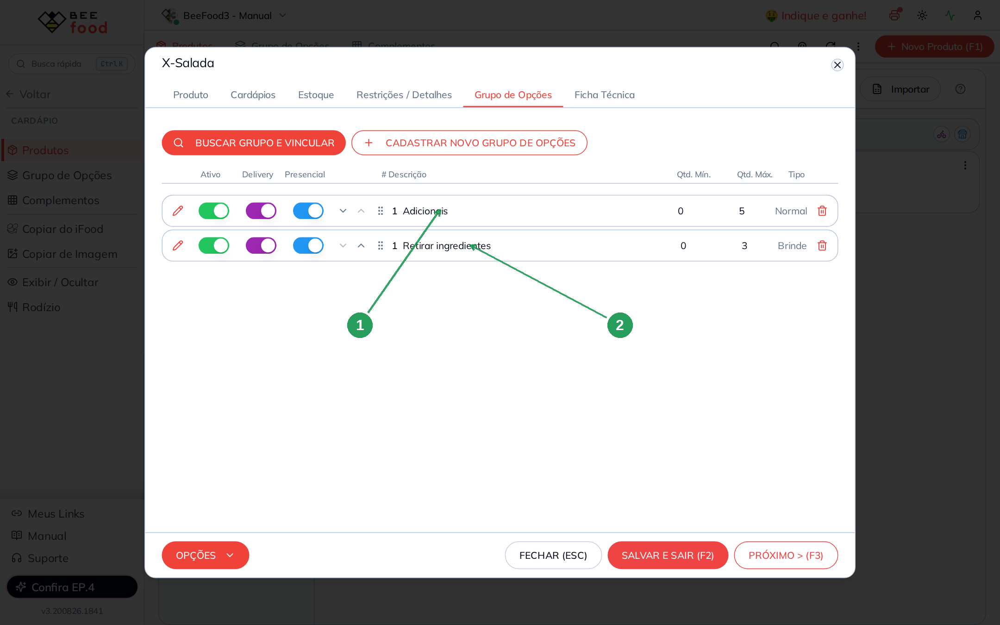

| Nº | Grupo | Observação |
|----|-------|------------|
| 1 | **Adicionais** | O **mesmo** grupo do X-Burger, sem duplicar nada. |
| 2 | **Retirar ingredientes** | Idem. O grupo de ponto da carne ficou de fora, porque não se aplica. |

> ⚠️ **Grupo compartilhado muda os dois de uma vez.** Reajustar o preço do bacon aqui vale para
> o X-Burger também — o que é ótimo para reajuste e perigoso se você esquecer. Quando um lanche
> precisa de uma lista própria de adicionais, use **Clonar** no menu do grupo e edite a cópia. O
> sistema avisa: ao abrir um grupo usado por mais de um produto, aparece uma faixa amarela
> dizendo em quantos produtos a alteração vai refletir.

Os dois lanches ficam assim no cardápio:

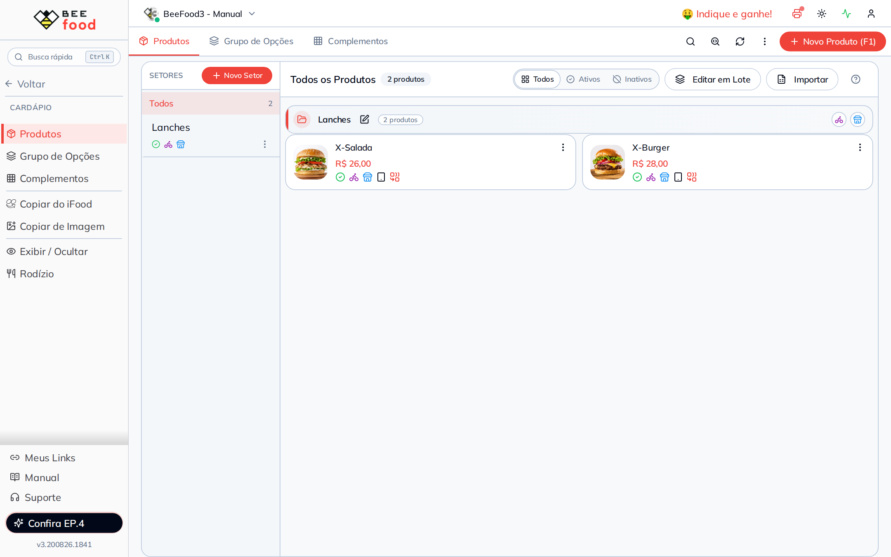

---

## Resumo das contas (conferido no PDV)

| Situação | Conta | Total |
|----------|-------|-------|
| Só o lanche | 28,00 | **R$ 28,00** |
| + Ao ponto (**Brinde**) | 28,00 + 0 | **R$ 28,00** |
| + Bacon e Cheddar (**Normal**) | 28,00 + 3,00 + 2,00 | **R$ 33,00** |
| + Sem cebola (**Brinde**) | 33,00 + 0 | **R$ 33,00** |

---

## Dica extra — Reajustar preços das opções em lote

Depois de montar complementos e grupos, use **Cardápio → Grupo de Opções → Opções**:

1. **Filtro** — encontre as opções pelo funil da coluna (Descrição, Grupo, Tipo ou Status).
2. **Edição** — para uma opção só, clique na linha dentro do grupo e altere o valor.
3. **Edição em lote** — marque várias e aplique o novo preço de uma vez.

Ideal para **reajuste de cardápio** sem abrir produto por produto — por exemplo, reajustar
Bacon, Cheddar e Ovo no grupo Adicionais. Passo a passo com telas: manual
**Cardápio — fundamentos**, Parte 8.

> **Na hamburgueria, filtre pelo grupo Adicionais** antes de aplicar: os grupos de ponto e de
> retirada precisam continuar em R$ 0,00, e um reajuste geral colocaria preço neles.

---

## Perguntas frequentes

**Posso usar Brinde para um adicional que hoje é grátis mas pode virar pago?**
Pode, e é uma boa ideia deixar num grupo separado. Quando for cobrar, você muda o grupo para
**Normal** e coloca o preço nas opções — sem refazer o cadastro dos produtos.

**Como faço combo com batata e refrigerante?**
Mais um grupo, com formação **Normal**, mínimo 1 e máximo 1 para cada escolha (um grupo de
batata e um de bebida), ou um grupo só com máximo 2. Se o combo tem preço fechado, cadastre um
**produto** "X-Burger no combo" com o preço do combo e as opções em Brinde.

**Quero dobrar a carne. Como?**
Um adicional chamado *Carne extra* no grupo Adicionais, com o preço da carne. Se o cliente pode
pedir duas carnes extras, ajuste o **Máximo da opção** para 2 na linha dela — aí o PDV mostra um
contador de quantidade em vez da caixa de seleção. Nesta versão, para aumentar a quantidade é
preciso **clicar na linha** de novo: o botão "+" aparece mas está travado.

**O ponto da carne aparece na impressão da cozinha?**
Sim. As opções de Brinde entram no pedido normalmente — é justamente para isso que elas
existem. O que elas não fazem é somar valor.

**Marquei Brinde e o preço ainda apareceu na conta.**
O complemento tem preço cadastrado. Zere o valor na linha da opção, dentro do grupo, ou pelo
**Editar em Lote**.

**Dá para deixar um grupo obrigatório só no delivery?**
O checkbox **Obrigatório** vale para os dois canais. O que existe por canal são os switches
**Delivery** e **Presencial** do grupo — com eles você pode fazer o grupo simplesmente não
aparecer num dos canais.

**O cliente pode escolher dois pontos de carne?**
Não, com Máximo 1. Se você aumentar o máximo, ele consegue — o que raramente faz sentido para
ponto de carne.

---

## Manuais relacionados

| Manual | O que traz |
|--------|------------|
| **Cardápio — fundamentos** | O fluxo completo, as quatro formações de preço e a edição em lote |
| **Cardápio — pizza** | **Valor da Maior** e **Proporcional** para sabores e meio a meio |
| **Cardápio — açaí** | Tamanhos e grupos grandes de acompanhamentos |
| **Cardápio — comida japonesa** | Combinado com contagem exata de peças |
