# Manual do Cardápio — Comida Japonesa

Este manual monta dois produtos bem diferentes no BeeFood: um **combinado de preço fechado**, em
que o cliente escolhe as peças sem alterar o valor, e um **temaki**, que é um item simples com
adicionais. O caso novo aqui é a **contagem exata**: fazer o cliente montar exatamente 20 peças,
nem mais nem menos.

> Leia antes o manual **Cardápio — fundamentos**. Ele ensina o fluxo básico (complemento →
> grupo → produto → vínculo) que aqui aparece resumido.

> As imagens têm **setas numeradas** (1, 2, 3…). Cada número indica o campo ou botão
> correspondente na tela. Campos com **\*** são **obrigatórios**.

---

## O desafio do combinado

O combinado tem **preço fechado** e o cliente **monta** o conteúdo. São duas exigências ao mesmo
tempo:

| Exigência | Como se resolve |
|-----------|-----------------|
| As escolhas **não podem alterar o preço** | formação **Brinde** |
| O cliente precisa escolher **exatamente** a quantidade certa | **Mínimo = Máximo** no grupo |
| Ele pode querer **duas porções do mesmo** item | **Máximo da opção** maior que 1 |

E há um truque que simplifica muito: em vez de fazer o cliente escolher 20 peças uma a uma,
**cada opção é um bloco de 5 peças**. Aí ele escolhe **4 opções** e fecha as 20.

> **Não tente fazer o cliente clicar 20 vezes.** Com mínimo e máximo 20, o atendente precisaria
> de vinte cliques por combinado. Blocos de 5 (ou de 4, ou de 10 — o que a sua casa usar)
> resolvem em quatro cliques.

---

## O exemplo deste manual

| Item | Valor |
|------|-------|
| Setor | Comida Japonesa |
| Produtos | **Combinado 20 peças** R$ 89,00 e **Temaki Salmão** R$ 24,00 |
| Blocos de peças | Hot Roll · Uramaki Salmão · Niguiri Salmão · Sashimi Salmão — **5 peças cada, sem preço** |
| Extras | Shoyu extra R$ 2,00 · Wasabi extra R$ 2,00 |
| Adicionais do temaki | Cream cheese R$ 4,00 · Cebolinha R$ 2,00 |

As contas que vamos conferir: o combinado fecha em **R$ 89,00** com qualquer combinação de peças,
sobe para **R$ 91,00** com um extra, e o temaki vai de R$ 24,00 para **R$ 28,00** com cream
cheese.

---

## Pré-requisitos

- Sessão iniciada em `https://beefood.app`.
- Permissão de menu **Cardápio**.
- Ter lido o manual **Cardápio — fundamentos**.

---

## Parte 1 — Cadastrar as peças e os extras

Tudo é **complemento**. A diferença está no preço.

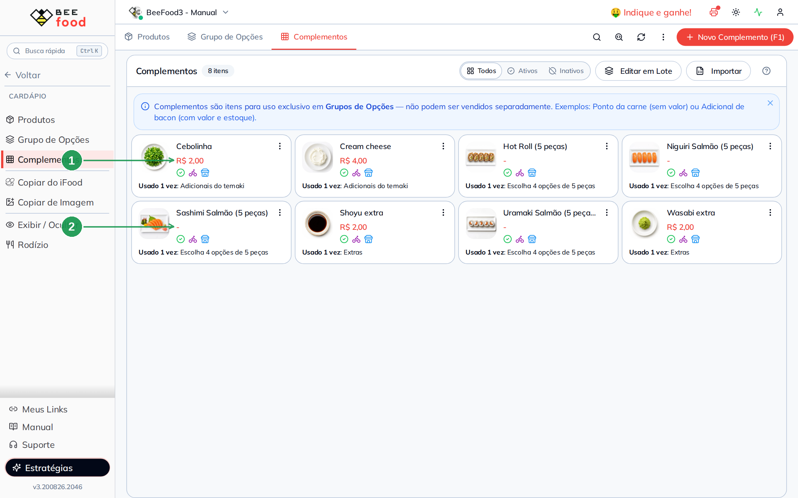

| Nº | Item | Como cadastrar |
|----|------|----------------|
| 1 | **Extra** (shoyu, wasabi, cream cheese) | **Com preço** — soma na conta. |
| 2 | **Bloco de peças** (Sashimi, Hot Roll…) | **Sem preço** (R$ 0,00), porque o combinado já tem preço fechado. |

**Coloque a quantidade no nome:** `Hot Roll (5 peças)`. O cliente e o atendente precisam saber
que cada escolha vale 5 peças — o sistema não tem campo para isso, o nome é que informa.

> A lista aparece em **ordem alfabética**, então peças e extras ficam misturados. Se a sua casa
> tem muitos itens, um prefixo ajuda a agrupar (por exemplo, `Peça — Hot Roll`).

---

## Parte 2 — O grupo da montagem (contagem exata)

Este é o coração do manual. Crie o grupo em **Cardápio → Grupo de Opções → Novo Grupo (F1)**.

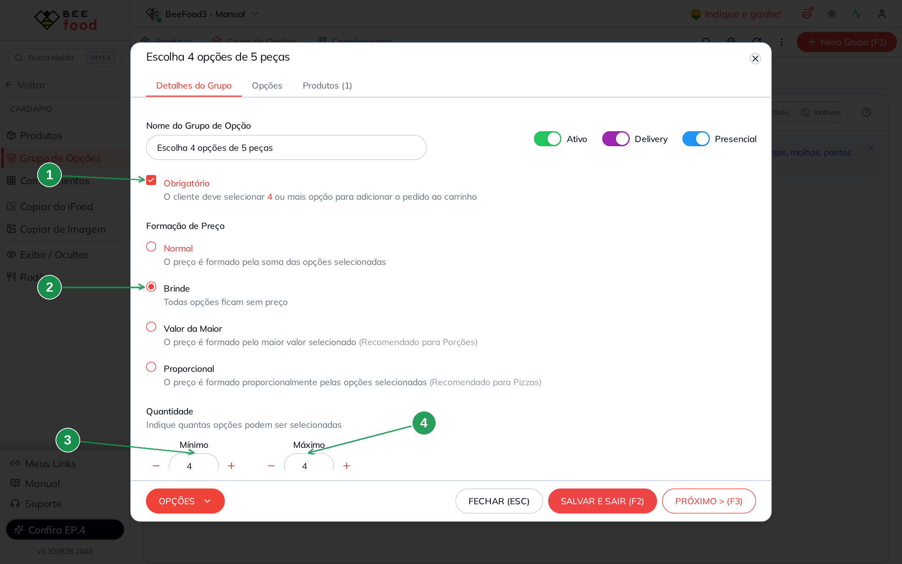

| Nº | Campo | O que preencher |
|----|-------|-----------------|
| 1 | **Obrigatório** | Marque. Sem montar, o pedido não fecha. |
| 2 | **Brinde** | As escolhas **não alteram o preço** — ele é o do combinado. |
| 3 | **Mínimo** | `4`. |
| 4 | **Máximo** | `4` — **igual ao mínimo**. É isso que cria a contagem exata. |

**Mínimo igual ao Máximo é a regra toda.** Com 4 e 4, o cliente é obrigado a escolher quatro e
não consegue escolher cinco. Quatro blocos de 5 peças = as 20 peças do combinado.

Dê ao grupo um nome que explique a conta: **Escolha 4 opções de 5 peças** aparece na tela de
venda e no cardápio digital, e já ensina o cliente.

### As opções

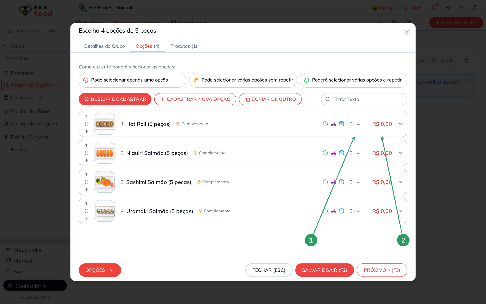

| Nº | Coluna | O que confere |
|----|--------|---------------|
| 1 | **Limite da opção** | `0 - 4`: o cliente pode repetir a **mesma** peça até quatro vezes (um combinado inteiro de hot roll). |
| 2 | **Valor** | **R$ 0,00** em todas — o preço é do combinado. |

O `0 - 4` não vem pronto: o padrão é `0 - 1`, que deixaria o cliente escolher quatro peças
**diferentes** e nada mais. Ajuste opção por opção clicando na linha.

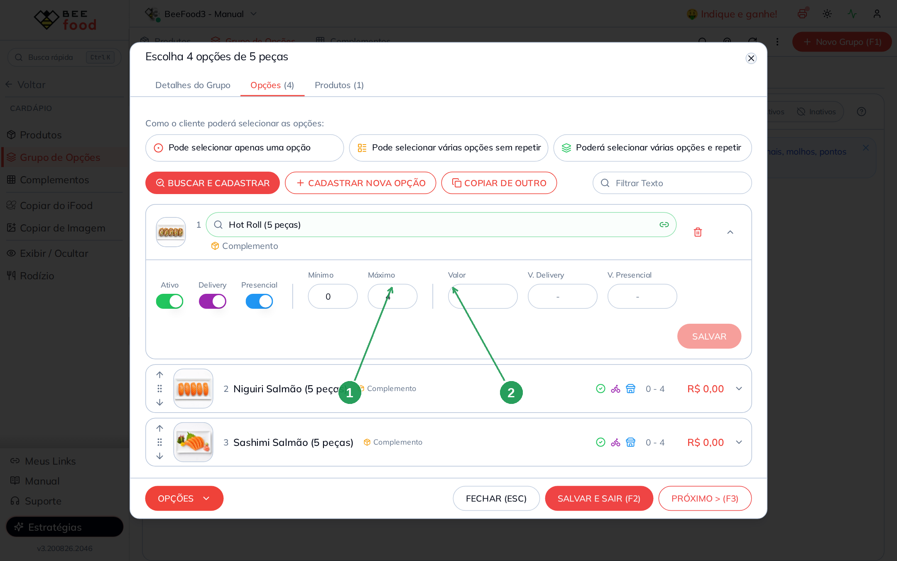

| Nº | Campo | O que preencher |
|----|-------|-----------------|
| 1 | **Máximo** | `4` — quantas vezes a mesma peça pode ser repetida. |
| 2 | **Valor** | Zero. Confirme com o **SALVAR** da própria linha. |

> **Quanto colocar no Máximo da opção?** O mesmo número do Máximo do grupo. Assim o cliente pode
> montar o combinado todo de um único item, se quiser.

---

## Parte 3 — Os extras e os adicionais

O combinado leva um grupo de **Extras**, com formação **Normal**.

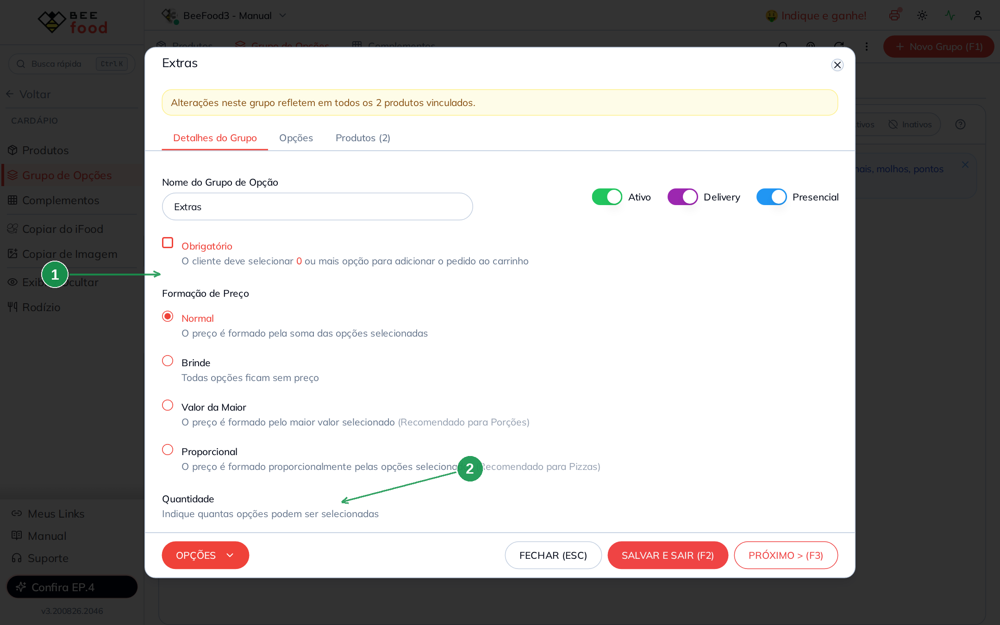

| Nº | Campo | O que preencher |
|----|-------|-----------------|
| 1 | **Normal** | Cada extra soma o seu preço. |
| 2 | **Máximo** | `3`. |

Este grupo vai servir **aos dois produtos** — combinado e temaki. Shoyu e wasabi combinam com os
dois.

O temaki tem um grupo próprio, também **Normal**:

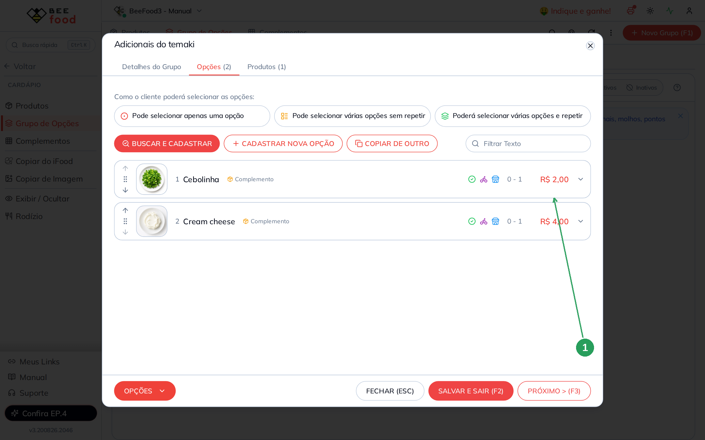

| Nº | Coluna | O que confere |
|----|--------|---------------|
| 1 | **Valor** | Cream cheese R$ 4,00 e Cebolinha R$ 2,00 — aqui o valor **soma**. |

---

## Parte 4 — Cadastrar os produtos

Em **Cardápio → Produtos**, crie o setor **Comida Japonesa** e os dois produtos.

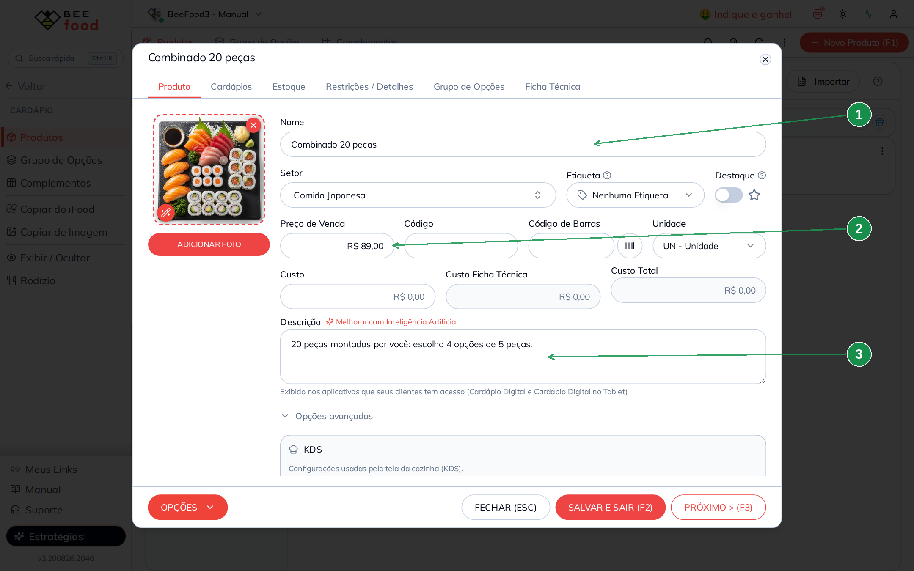

| Nº | Campo | O que preencher |
|----|-------|-----------------|
| 1 | **Nome** | Com a quantidade: `Combinado 20 peças`. |
| 2 | **Preço de Venda** | **R$ 89,00** — o preço fechado, que não muda com a montagem. |
| 3 | **Descrição** | Explique a regra: *20 peças montadas por você: escolha 4 opções de 5 peças.* |

> **A descrição faz parte do cadastro aqui.** Em produto que o cliente monta, ela evita a
> pergunta "quantas peças eu escolho?" — no balcão e no cardápio digital.

### Os grupos do combinado

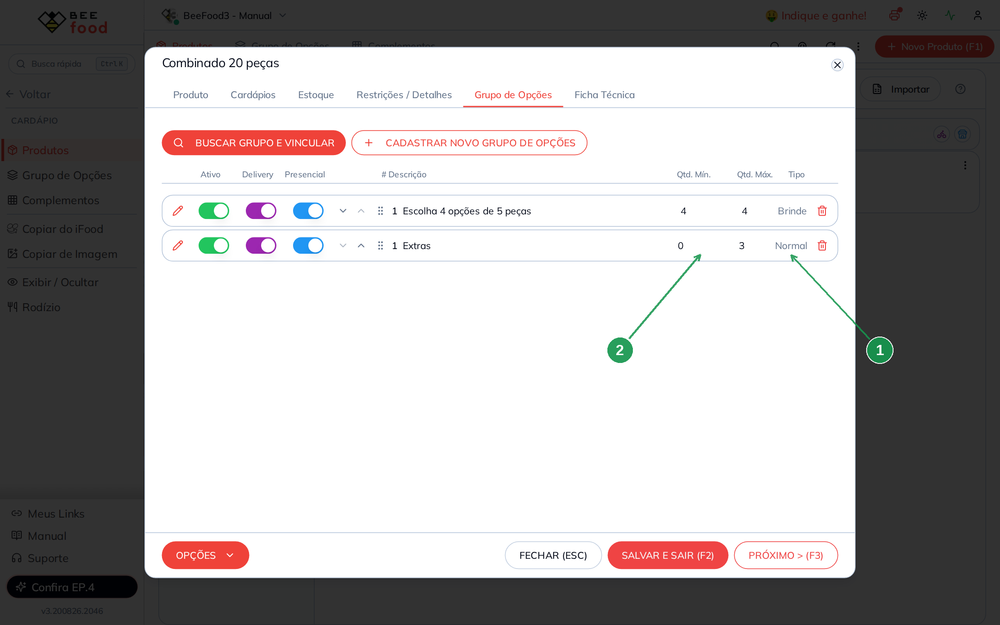

| Nº | Coluna | O que confere |
|----|--------|---------------|
| 1 | **Tipo** | `Brinde` na montagem e `Normal` nos Extras. |
| 2 | **Qtd. Mín.** e **Qtd. Máx.** | `4` e `4` na montagem (a contagem exata) e `0` e `3` nos Extras. |

O **Temaki Salmão** (R$ 24,00) recebe o grupo **Adicionais do temaki** e o mesmo grupo **Extras**
— não duplique o de shoyu e wasabi.

---

## Parte 5 — Conferir no PDV

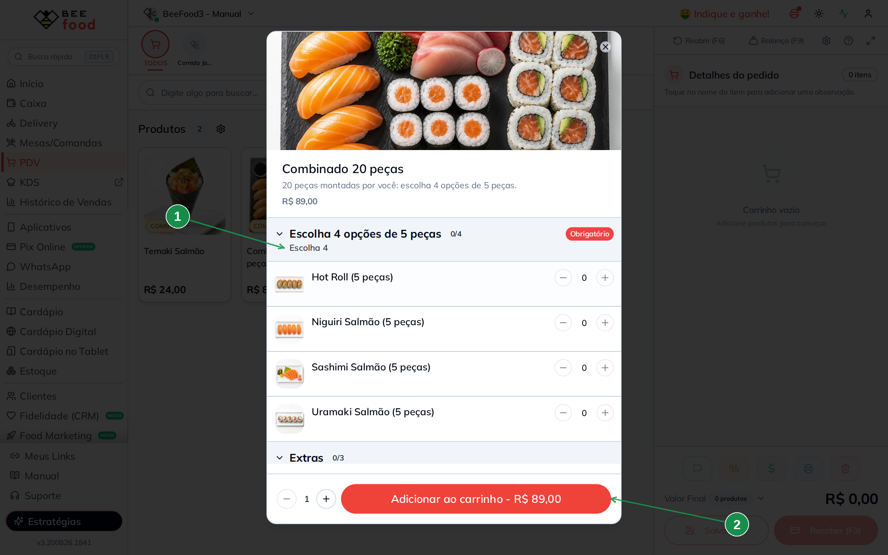

| Nº | Item | O que confere |
|----|------|---------------|
| 1 | **Escolha 4** e selo **Obrigatório** | A regra e a obrigatoriedade aparecem para o operador. |
| 2 | **Total** | R$ 89,00 — o preço fechado. |

### Quatro de quatro: repetida, vazia e preço igual

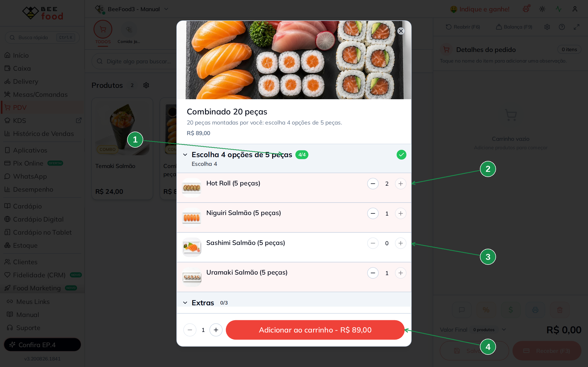

| Nº | Item | O que confere |
|----|------|---------------|
| 1 | **Contador 4/4 e check verde** | Quatro escolhas feitas: o grupo está completo e a exigência cumprida. |
| 2 | **A mesma peça duas vezes** | Hot Roll está em **2** — são 10 peças de hot roll. Foi o `0 - 4` da opção que permitiu. |
| 3 | **A peça que ficou de fora** | Sashimi em **0**: com o grupo cheio, o sistema **ignora** novos cliques. |
| 4 | **Total** | Continua **R$ 89,00**. A montagem não mexeu no preço — é o Brinde. |

A conta fecha: 2 × Hot Roll + 1 × Uramaki + 1 × Niguiri = 4 blocos × 5 peças = **20 peças**.

> **Com o grupo cheio, o clique não faz nada e não aparece aviso.** Nem para escolher uma peça
> nova, nem para repetir uma que já está lá. Se o atendente quiser trocar, precisa **diminuir**
> uma escolha no botão **−** e então escolher outra.

> ⚠️ **O botão "+" do contador não funciona** nesta versão: ele aparece, mas está travado. Para
> aumentar a quantidade de uma peça, **clique na linha** dela. O "−" funciona normalmente.

### Os extras somam

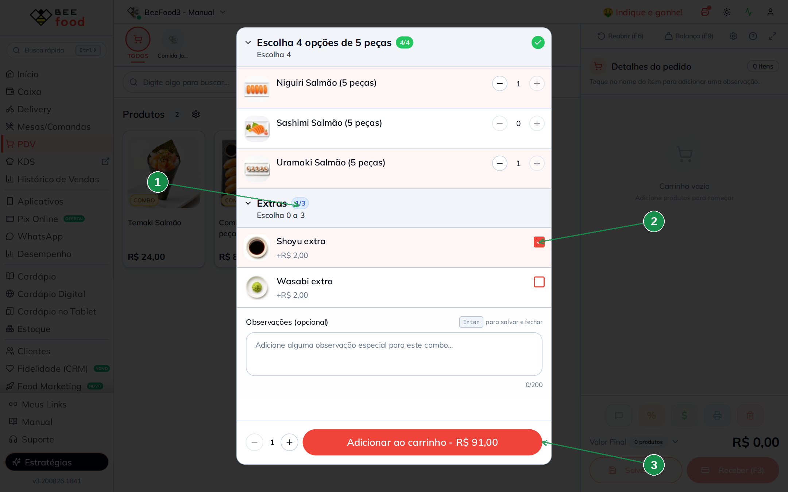

| Nº | Item | O que confere |
|----|------|---------------|
| 1 | **Grupo Extras, 1/3** | Grupo separado, com formação Normal. |
| 2 | **Extra marcado** | Aqui a opção mostra o acréscimo (*+R$ 2,00*). |
| 3 | **Total** | **R$ 91,00** = R$ 89,00 + R$ 2,00 do shoyu. |

### O carrinho mostra a montagem

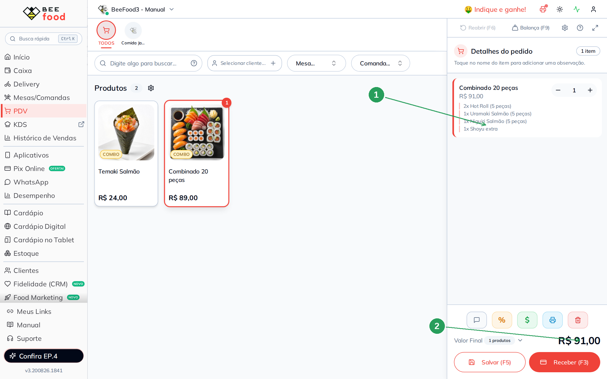

| Nº | Item | O que confere |
|----|------|---------------|
| 1 | **A montagem com as quantidades** | `2x Hot Roll (5 peças)`, `1x Uramaki Salmão (5 peças)`, `1x Niguiri Salmão (5 peças)`, `1x Shoyu extra`. **É isso que o sushiman lê.** |
| 2 | **Valor Final** | R$ 91,00. |

Repare que o `2x` aparece: quem monta o prato sabe que são dez peças de hot roll, não cinco.

### O temaki, do outro lado

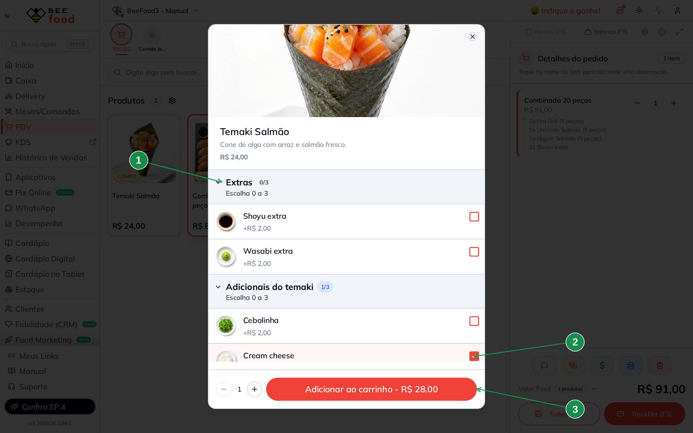

| Nº | Item | O que confere |
|----|------|---------------|
| 1 | **Grupo Extras** | **O mesmo** grupo do combinado, reaproveitado. |
| 2 | **Adicional marcado** | Cream cheese, +R$ 4,00. |
| 3 | **Total** | **R$ 28,00** = R$ 24,00 + R$ 4,00. |

O temaki é o oposto do combinado: produto simples, sem montagem, com adicionais que somam. Os
dois convivem no mesmo cardápio:

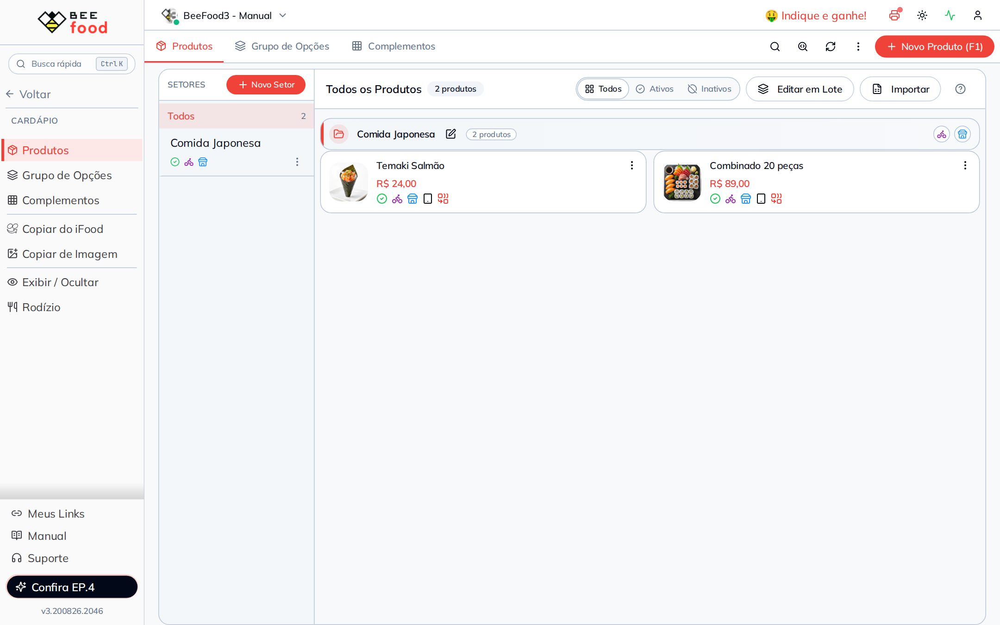

---

## Resumo das contas (conferido no PDV)

| Produto | Situação | Total |
|---------|----------|-------|
| Combinado | 4 blocos escolhidos (**montagem**) | **R$ 89,00** |
| Combinado | + Shoyu extra R$ 2,00 (**Normal**) | **R$ 91,00** |
| Temaki | sozinho | R$ 24,00 |
| Temaki | + Cream cheese R$ 4,00 | **R$ 28,00** |

---

## Dica extra — Reajustar preços das opções em lote

Depois de montar complementos e grupos, use **Cardápio → Grupo de Opções → Opções**:

1. **Filtro** — encontre as opções pelo funil da coluna (Descrição, Grupo, Tipo ou Status).
2. **Edição** — para uma opção só, clique na linha dentro do grupo e altere o valor.
3. **Edição em lote** — marque várias e aplique o novo preço de uma vez.

Ideal para **reajuste de cardápio** sem abrir produto por produto — por exemplo, ajustar shoyu e
wasabi no grupo Extras. Passo a passo com telas: manual **Cardápio — fundamentos**, Parte 8.

> **No japonês, filtre pelo grupo antes de aplicar.** As peças do combinado precisam continuar em
> R$ 0,00; um reajuste geral colocaria preço nelas e o combinado deixaria de ser preço fechado.

---

## Perguntas frequentes

**E se eu quiser combinado de 30 peças também?**
Outro produto, com o seu preço, e um grupo próprio de montagem (mínimo = máximo = 6, se os blocos
forem de 5). O grupo de **Extras** pode ser o mesmo.

**Posso deixar o cliente escolher peça por peça, sem blocos?**
Pode: mínimo = máximo = 20 e o máximo de cada opção em 20. Funciona, mas são vinte cliques por
combinado — pesado no balcão. Blocos são mais práticos.

**Quero cobrar mais por algumas peças (salmão vs kani).**
Aí o grupo da montagem não pode ser **Brinde**. Duas saídas: **(a)** dois grupos, um Brinde com as
peças inclusas e um Normal com as premium (o mesmo padrão do manual de **açaí**); ou **(b)** um
grupo Normal em que as peças básicas ficam com R$ 0,00 e as premium com preço, mas aí o cliente
pode escolher tudo premium — o limite é de quantidade, não de valor.

**Como faço rodízio?**
Não é por aqui: o BeeFood tem uma tela própria de **Rodízio**, no menu Cardápio. Fica para um
manual futuro.

**O combinado pode ter peças fixas mais escolhas?**
Sim, e é comum. As peças fixas ficam só na **descrição** (elas não mudam, não precisam ser
opção), e o grupo de montagem cobre apenas a parte que o cliente escolhe. Ex.: *"Combinado 24
peças: 8 fixas + escolha 4 opções de 4 peças"*.

**A montagem aparece na impressão da cozinha?**
Sim, com as quantidades (`2x Hot Roll`). É justamente o que o sushiman precisa ler.

**Marquei tudo e o cliente pediu para trocar uma peça. Como faço?**
Clique no **−** da peça que sai e depois na linha da peça que entra. Com o grupo cheio (4/4), o
clique direto na peça nova é ignorado.

---

## Manuais relacionados

| Manual | O que traz |
|--------|------------|
| **Cardápio — fundamentos** | O fluxo completo, as quatro formações de preço e a edição em lote |
| **Cardápio — hambúrguer** | **Brinde** para ponto da carne e grupo **Obrigatório** |
| **Cardápio — pizza** | **Valor da Maior** e **Proporcional** para sabores e meio a meio |
| **Cardápio — açaí** | Inclusos com limite e um produto por tamanho |
