# Cardápio em PDF: como gerar o cardápio impresso do restaurante (A4 ou A5, com foto, QR Code e capa)

Você já tem o cardápio cadastrado no BeeFood: setores, produtos, descrições, preços e
fotos. O **Cardápio em PDF** aproveita tudo isso e monta o **cardápio impresso** em
poucos cliques — sem Canva, sem Word, sem designer e sem redigitar preço nenhum.

O resultado é um arquivo PDF pronto para:

- **imprimir na loja** e usar como cardápio de mesa, de balcão ou de retirada;
- **mandar para a gráfica** imprimir em papel bom, plastificado, no tamanho A4 ou A5;
- **enviar para o cliente pelo WhatsApp** ou anexar no e-mail;
- **imprimir um encarte/panfleto com o QR Code** do cardápio digital.

Você escolhe o modelo (clássico, elegante, fotográfico, compacto ou estilo lousa), o
que entra, o que fica de fora, as cores, a capa e baixa o arquivo. O preço, o nome e a
descrição vêm do cadastro: **cardápio impresso e cardápio digital ficam iguais**.

> **O recurso está em liberação.** Se **Cardápio em PDF** ainda não aparece no seu
> menu, fale com o suporte para liberar a sua conta.

---

## Antes de começar

1. **O cardápio precisa estar cadastrado**: os produtos que aparecem no PDF são os
   produtos **ativos** dos seus setores. Produto inativo não sai no impresso.
2. **Quer PDF com foto?** Só sai foto de produto que tem foto cadastrada.
3. **Confira os preços** que você usa no salão (presencial) e no delivery. O gerador
   pergunta qual dos dois vai para o papel.
4. **Uma sessão, um PDF**: o gerador **não salva** as suas escolhas. Se você fechar a
   tela, ele volta ao padrão. Monte e baixe na mesma visita.
5. **Permissão**: o item fica dentro do grupo *Cardápio* e segue a permissão de
   **Produtos** do grupo de acesso do usuário.

---

## 1. Abrir o gerador de cardápio em PDF

No menu lateral, entre em **Cardápio** e clique em **Cardápio em PDF** (1) — é o
último item do grupo, embaixo de *Preço Programado*.

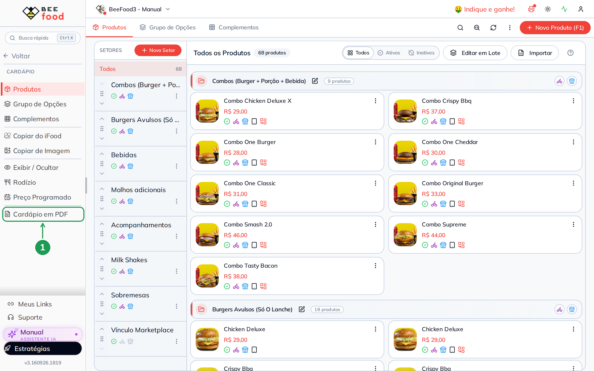

| Nº | Item | O que fazer |
|----|------|-------------|
| 1. | **Cardápio em PDF** | Abre o gerador em tela cheia. Se o item não aparece, o recurso ainda não foi liberado para a sua conta. |

Também dá para abrir sem sair da tela de produtos: em **Cardápio → Produtos**, clique
nos três pontinhos (1) e escolha **Gerar cardápio em PDF** (2).

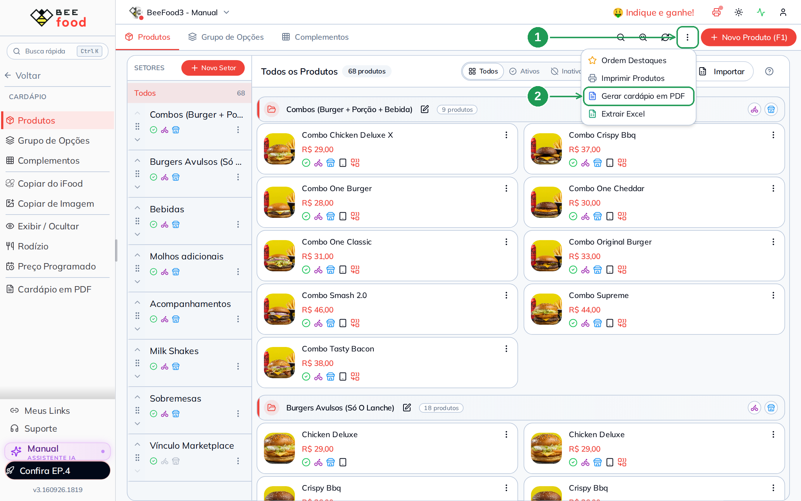

| Nº | Item | O que fazer |
|----|------|-------------|
| 1. | **Três pontinhos** | Menu de ações da tela Cardápio, no canto superior direito. |
| 2. | **Gerar cardápio em PDF** | Abre o mesmo gerador, numa janela sobre a tela de produtos. |

No celular o caminho é o mesmo: **Cardápio → menu de ações → Gerar cardápio em PDF**.
O gerador abre em tela cheia, com a prévia embaixo dos ajustes.

---

## 2. Como o gerador funciona

A tela tem **quatro etapas** no topo e a **prévia do PDF** do lado direito (no celular,
embaixo). Você pode clicar direto na etapa que quiser — não é obrigatório seguir na
ordem.

| Etapa | Para que serve |
|-------|----------------|
| **1. Cardápios e itens** | Quais cardápios, seções e produtos entram, em que ordem e com qual preço. |
| **2. Layout e fotos** | Modelo, tamanho do papel, colunas, fotos e o que aparece em cada item. |
| **3. Marca e capa** | Nome, telefone, endereço, logo, QR Code, cores, fonte, capa e rodapé. |
| **4. Revisar e baixar** | Resumo do que vai sair e o botão **BAIXAR PDF**. |

A prévia é o PDF de verdade, montado página por página. Cada mudança que você faz
aparece nela em alguns segundos (enquanto isso ela mostra *Montando a prévia...*).

Dois atalhos no computador: **F2** baixa o PDF e **ESC** fecha o gerador.

> **Nada é salvo.** As escolhas valem enquanto o gerador está aberto. Ao fechar, tudo
> volta ao padrão — inclusive os nomes e preços que você ajustou na etapa 1.

---

## 3. Etapa 1 — quais itens entram no cardápio impresso

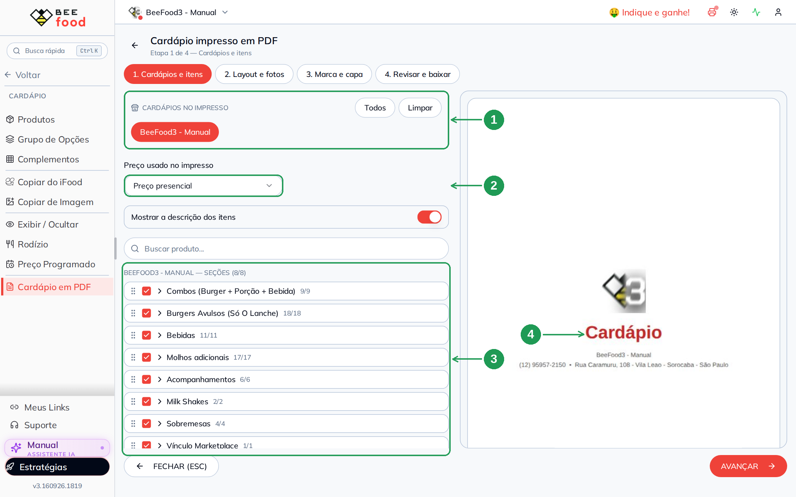

| Nº | Item | O que fazer |
|----|------|-------------|
| 1. | **Cardápios no impresso** | Já vem com o seu cardápio atual marcado. Com mais de uma loja, clique nos nomes para incluir/tirar; **Todos** marca tudo e **Limpar** desmarca. |
| 2. | **Preço usado no impresso** | *Preço presencial* (padrão), *Preço delivery*, *Preço de venda (padrão)* ou *Tabela de preço*. |
| 3. | **Seções** | Todas entram marcadas. Desmarque a caixinha das que não são cardápio de cliente. Arraste pela alça (⣿) para mudar a ordem no papel. |
| 4. | **Prévia** | O cardápio como vai sair impresso, começando pela capa. |

Detalhes desta etapa:

- **Mais de uma loja no mesmo PDF**: ao marcar dois cardápios, aparecem duas opções —
  *Mostrar o nome de cada cardápio* e *Começar cada cardápio em uma página nova*.
- **Preço com tabela**: escolhendo *Tabela de preço*, um segundo campo pede qual
  tabela. Produto que não está na tabela sai com o preço presencial.
- **Seção sem item marcado não aparece** no PDF.
- **Buscar produto** filtra os itens dentro das seções abertas — útil em cardápio
  grande.
- Setores de controle interno (por exemplo o setor que você usa para marketplace)
  costumam ser os primeiros a desmarcar.

### 3.1 Mudar nome, descrição e preço só no impresso

Clique no nome de uma seção para abrir a lista de produtos dela.

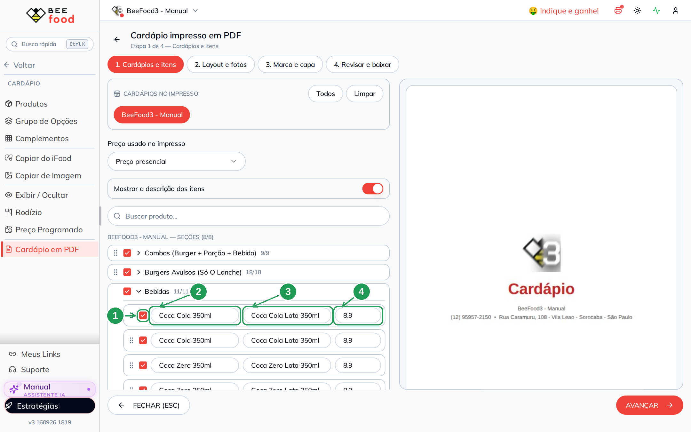

| Nº | Item | O que fazer |
|----|------|-------------|
| 1. | **Caixinha** | Desmarque para tirar aquele item do impresso (ele continua no cardápio digital). |
| 2. | **Nome** | Como o produto vai aparecer no papel. |
| 3. | **Descrição** | Os ingredientes. Encurte aqui o que ficou comprido demais para o impresso. |
| 4. | **Preço** | Valor que vai no papel, com centavos. |

**O que você digita aqui vale só para este PDF.** Nada é gravado no cadastro do
produto: nem nome, nem descrição, nem preço, nem no cardápio digital, nem no PDV. É o
lugar certo para tirar do impresso aquele texto que só serve internamente (tags,
observações de estoque, "não vender") ou para arredondar um preço no papel.

Os produtos também podem ser **arrastados** para trocar a ordem dentro da seção — a
ordem do PDF é a que você monta aqui.

---

## 4. Etapa 2 — modelo, tamanho do papel e fotos

Comece pelo **modelo**. Ele define colunas, fonte dos títulos e o jeitão do cardápio.

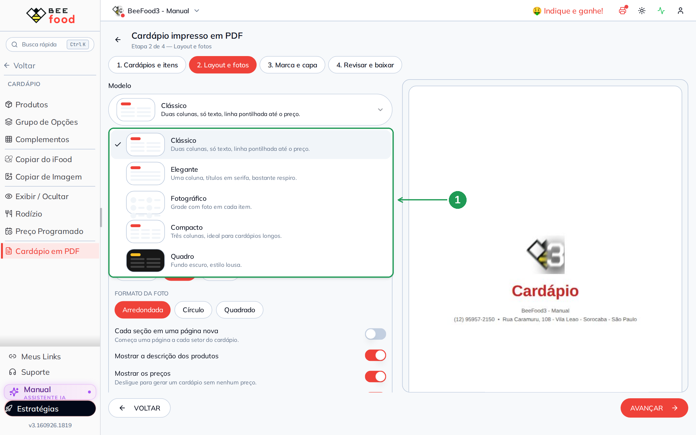

| Nº | Item | O que fazer |
|----|------|-------------|
| 1. | **Modelo** | Abra a lista e escolha. A miniatura mostra o formato antes de aplicar. |

| Modelo | Como sai | Bom para |
|--------|----------|----------|
| **Clássico** | Duas colunas, linha pontilhada até o preço | cardápio de mesa, o formato mais tradicional |
| **Elegante** | Uma coluna, títulos em serifa, bastante respiro | restaurante à la carte, menu de jantar |
| **Fotográfico** | Grade com foto em cada item (foto obrigatória) | hamburgueria, pizzaria, açaí, doces |
| **Compacto** | Três colunas, texto menor | cardápio longo, para caber em menos páginas |
| **Quadro** | Fundo escuro estilo lousa, letras claras | bar, cafeteria, cardápio de parede |

Escolhendo **Quadro**, o gerador já sugere a paleta escura combinando.

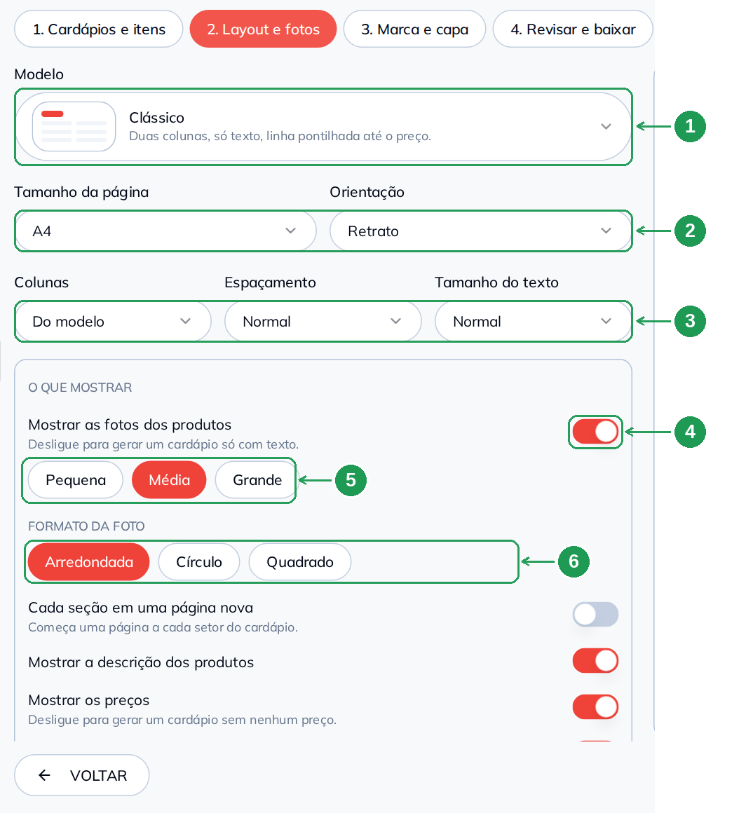

| Nº | Item | O que fazer |
|----|------|-------------|
| 1. | **Modelo** | O modelo escolhido, com a descrição dele. |
| 2. | **Tamanho da página / Orientação** | **A4** (folha inteira) ou **A5** (meia folha, formato de cardápio de mesa); **Retrato** ou **Paisagem**. |
| 3. | **Colunas / Espaçamento / Tamanho do texto** | *Do modelo* mantém o padrão; 1, 2 ou 3 colunas forçam o seu. Espaçamento *Compacto* aperta os itens, *Espaçado* dá mais ar. Texto *Pequeno*, *Normal* ou *Grande*. |
| 4. | **Mostrar as fotos dos produtos** | Ligado sai com foto; desligado sai **só texto** (arquivo muito mais leve). No modelo Fotográfico o botão fica travado ligado. |
| 5. | **Tamanho da foto** | *Pequena*, *Média* ou *Grande*. |
| 6. | **Formato da foto** | *Arredondada*, *Círculo* ou *Quadrado*. |

As fotos são as mesmas do cardápio digital, recortadas no centro para ficarem todas do
mesmo tamanho. Produto sem foto aparece só com nome, descrição e preço. Enquanto as
imagens carregam, o topo da tela mostra *carregando fotos...* — é normal em cardápio
grande.

### 4.1 O que aparece em cada item

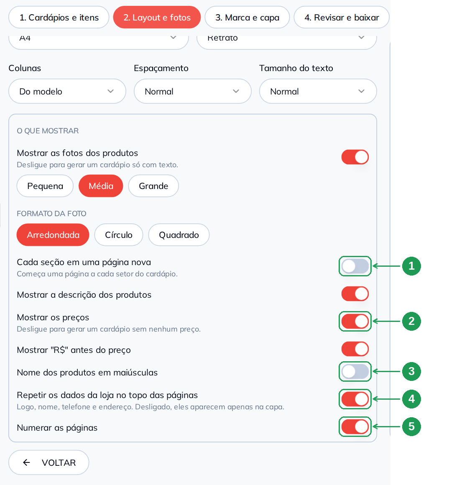

| Nº | Item | O que fazer |
|----|------|-------------|
| 1. | **Cada seção em uma página nova** | Ligue para começar uma página a cada setor — bom para cardápio de gráfica, em cadernos. |
| 2. | **Mostrar os preços** | Desligue para gerar um **cardápio sem preço** (útil para lista de itens, buffet ou quando o preço muda toda semana). |
| 3. | **Nome dos produtos em maiúsculas** | Deixa os nomes em CAIXA ALTA. |
| 4. | **Repetir os dados da loja no topo das páginas** | Ligado, logo, nome, telefone e endereço aparecem no alto de **todas** as páginas. Desligado, só na capa. |
| 5. | **Numerar as páginas** | Liga o `1 / 5` no rodapé. |

No mesmo bloco ficam ainda **Mostrar a descrição dos produtos** (tira os ingredientes,
deixando só nome e preço) e **Mostrar "R$" antes do preço** (desligado sai `29,00`).

---

## 5. Etapa 3 — sua marca, o QR Code e a capa

Os dados da loja já vêm preenchidos com o que está cadastrado no BeeFood. Confira e
ajuste o que for só do impresso.

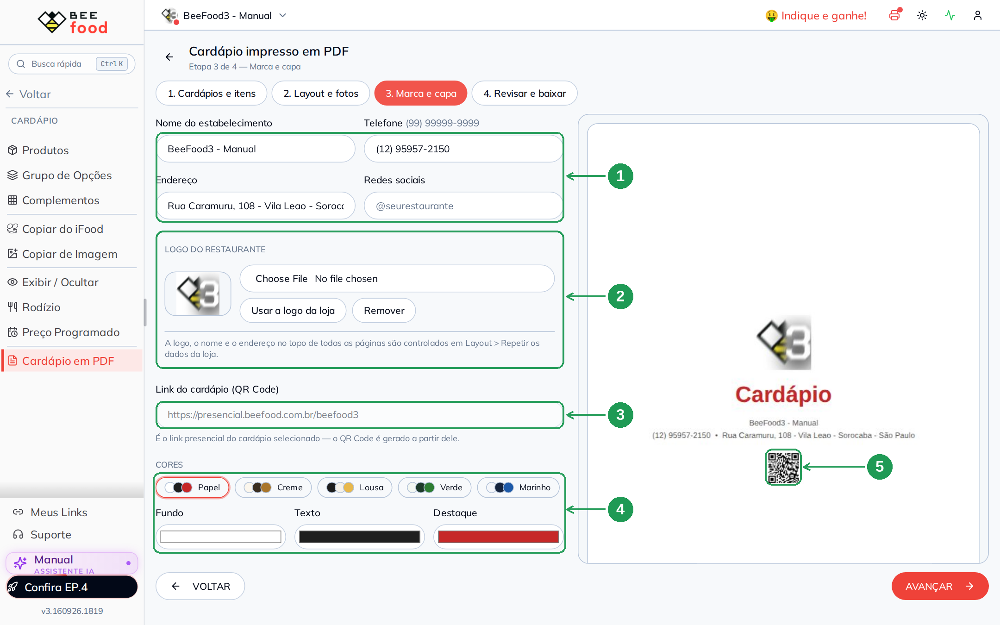

| Nº | Item | O que fazer |
|----|------|-------------|
| 1. | **Nome, telefone, endereço e redes sociais** | Vêm do cadastro da empresa e do cardápio digital. Edite livremente: vale só para este PDF. Em *Redes sociais* costuma entrar o `@` do Instagram. |
| 2. | **Logo do restaurante** | Já entra a logo cadastrada. **Escolher arquivo** troca por outra imagem, **Usar a logo da loja** volta para a original e **Remover** deixa o cardápio sem logo. |
| 3. | **Link do cardápio (QR Code)** | Campo só de leitura: é o link presencial do cardápio escolhido. O QR Code da capa é gerado a partir dele. |
| 4. | **Cores** | Cinco paletas prontas (*Papel*, *Creme*, *Lousa*, *Verde*, *Marinho*) ou escolha à mão o fundo, o texto e a cor de destaque (títulos e preços). |
| 5. | **QR Code na prévia** | O quadradinho que o cliente aponta a câmera para abrir o cardápio digital no celular. |

> **Passe pela etapa 3 antes de baixar.** O QR Code é montado nesta etapa: quem pula da
> etapa 1 direto para o download (ou aperta F2) leva a capa sem o QR.

Um pouco mais abaixo ficam a **fonte** e a **capa**.

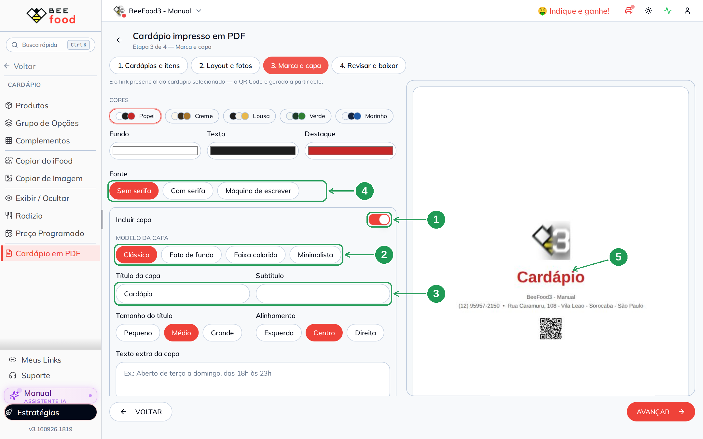

| Nº | Item | O que fazer |
|----|------|-------------|
| 1. | **Incluir capa** | Ligado, o PDF começa por uma capa. Desligue para o arquivo abrir direto nos itens. |
| 2. | **Modelo da capa** | *Clássica* (logo, título e contato centralizados), *Foto de fundo* (imagem ocupando a página), *Faixa colorida* ou *Minimalista*. |
| 3. | **Título e subtítulo** | Padrão *Cardápio*. Troque por *Menu*, *Delivery*, *Cardápio de bebidas*, o nome da casa… |
| 4. | **Fonte** | *Sem serifa*, *Com serifa* ou *Máquina de escrever* — vale para todo o cardápio. |
| 5. | **Prévia da capa** | Como a capa vai sair impressa. |

Ainda na capa você tem **Tamanho do título**, **Alinhamento**, **Texto extra**
(horário de funcionamento, por exemplo), **Imagem da capa** e quatro chaves de
**O que mostrar na capa**: logo, nome do estabelecimento, contato e QR Code.

No fim da etapa fica o **Rodapé**: o texto que se repete no pé de todas as páginas
(*"Wi-Fi liberado • Pedidos pelo QR Code"*, *"Consumo mínimo…"*). Vazio, o rodapé usa
o nome do estabelecimento.

---

## 6. Etapa 4 — revisar e baixar o PDF

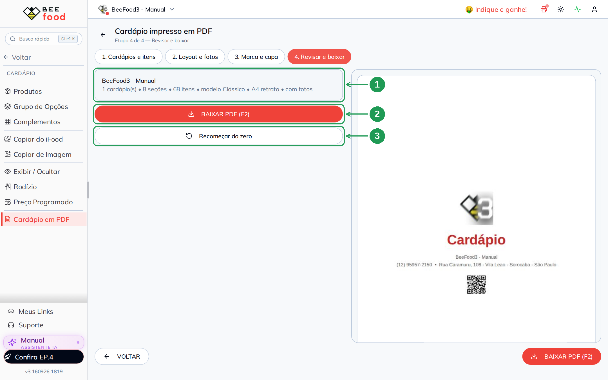

| Nº | Item | O que fazer |
|----|------|-------------|
| 1. | **Resumo** | Confira antes de baixar: quantos cardápios, seções e itens, o modelo, o tamanho do papel e se sai com fotos. |
| 2. | **BAIXAR PDF (F2)** | Gera o arquivo e baixa. Enquanto monta, o botão mostra *GERANDO...*. |
| 3. | **Recomeçar do zero** | Devolve tudo ao padrão (itens, layout e marca). Pede confirmação. |

O arquivo é salvo na pasta de downloads do navegador com o nome
`cardapio_nome-do-seu-restaurante.pdf`, e a mensagem *Cardápio em PDF gerado.* confirma
que deu certo. Abra o arquivo e confira antes de mandar para a gráfica.

Precisa de outra versão (uma com preço para a mesa e outra sem preço para o balcão,
por exemplo)? Mude o que for preciso e clique em **BAIXAR PDF** de novo: cada clique
gera um arquivo novo.

---

## 7. Como fica o PDF pronto

Este é o arquivo gerado no exemplo deste manual — capa e primeira página de itens,
modelo Clássico com fotos, A4 retrato:

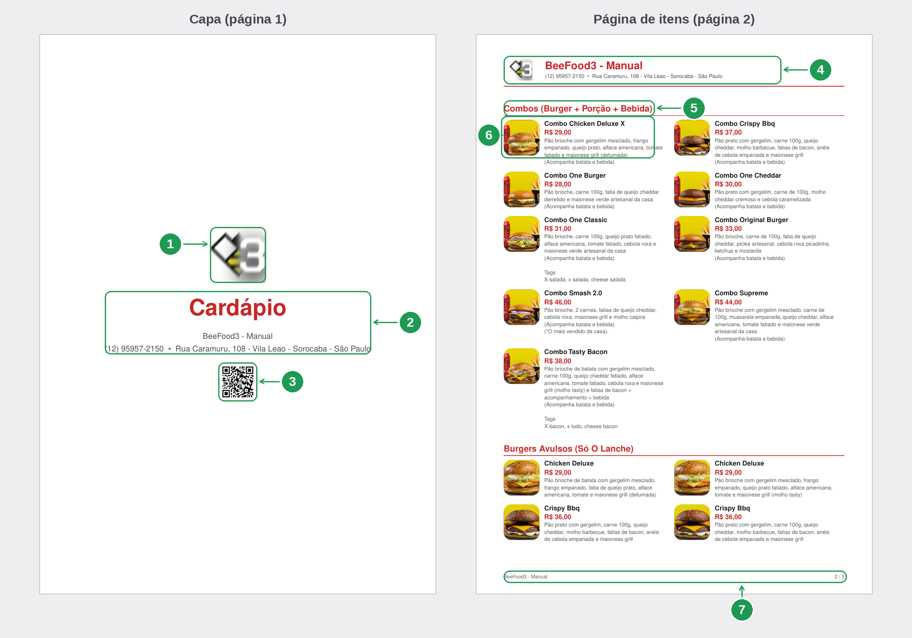

| Nº | Item | Onde é configurado |
|----|------|--------------------|
| 1. | **Logo na capa** | Etapa 3 → *Logo do restaurante* (e a chave *Logo* da capa). |
| 2. | **Título, nome e contato** | Etapa 3 → *Título da capa*, *Nome do estabelecimento*, telefone, endereço e redes. |
| 3. | **QR Code do cardápio** | Etapa 3 → gerado do link presencial; chave *QR Code do cardápio* na capa. |
| 4. | **Dados da loja no topo** | Etapa 2 → *Repetir os dados da loja no topo das páginas*. |
| 5. | **Título da seção** | Nome do setor do cardápio; a cor é a *cor de destaque* da etapa 3. |
| 6. | **Item: foto, nome, preço e descrição** | Etapas 1 e 2 (o que mostrar, tamanho e formato da foto). |
| 7. | **Rodapé e numeração** | Etapa 3 → *Rodapé*; etapa 2 → *Numerar as páginas*. |

---

## 8. O mesmo cardápio em três modelos

Mesmos itens, mesmos preços, três escolhas diferentes na etapa 2:

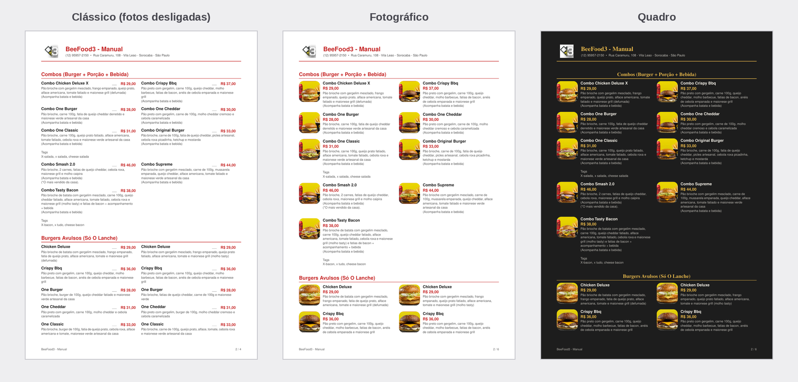

| Modelo | Páginas | Tamanho do arquivo |
|--------|---------|--------------------|
| **Clássico** com as fotos desligadas | 4 | 57 KB |
| **Fotográfico** (com foto em cada item) | 6 | 4,4 MB |
| **Quadro** (fundo escuro, com fotos) | 6 | 4,4 MB |

Foram 68 itens em 8 seções nos três casos. Vale reparar em duas coisas:

- **Cardápio só com texto é muito mais leve** — 57 KB contra 4,4 MB. É a melhor
  versão para mandar no WhatsApp ou anexar no e-mail, e a mais barata de imprimir.
- **Fundo escuro (Quadro) gasta muita tinta.** Fica ótimo em tela e na gráfica, mas
  pense duas vezes antes de imprimir muitas cópias na impressora da loja.

---

## 9. Receitas rápidas

| Você quer | Como montar |
|-----------|-------------|
| **Cardápio de mesa** | Modelo *Clássico* ou *Elegante*, **A5**, retrato, fotos desligadas, capa ligada com o QR Code. |
| **Cardápio com foto para hamburgueria** | Modelo *Fotográfico*, A4, foto *Média* arredondada, descrição ligada. |
| **Cardápio para mandar no WhatsApp** | Fotos desligadas, capa ligada: arquivo leve, abre rápido no celular do cliente. |
| **Cardápio de parede / bar** | Modelo *Quadro*, A4 retrato, texto *Grande*, preços ligados, descrição desligada. |
| **Cardápio longo em poucas páginas** | Modelo *Compacto*, espaçamento *Compacto*, texto *Pequeno*, fotos desligadas. |
| **Cardápio sem preço** | Desligue *Mostrar os preços* na etapa 2. |
| **Caderno para a gráfica** | Ligue *Cada seção em uma página nova* e *Numerar as páginas*. |
| **Encarte com QR Code** | Capa *Faixa colorida* ou *Foto de fundo*, com *QR Code do cardápio* ligado e *Texto extra* com o horário. |
| **Uma loja por vez, várias lojas** | Marque os cardápios na etapa 1, ligue *Mostrar o nome de cada cardápio* e *Começar cada cardápio em uma página nova*. |

---

## Problemas comuns

| Sintoma | O que está acontecendo | O que fazer |
|---------|------------------------|-------------|
| Não encontro **Cardápio em PDF** no menu | o recurso está em liberação por conta | fale com o suporte; o item fica em *Cardápio*, embaixo de *Preço Programado* |
| O botão **BAIXAR PDF** está apagado | nenhum item selecionado | volte à etapa 1 e marque pelo menos uma seção com produtos |
| Um produto não aparece no PDF | ele está inativo no cadastro, foi desmarcado na etapa 1 ou a seção dele está desmarcada | reveja a seção na etapa 1; produto inativo não entra |
| Uma seção inteira ficou de fora | a seção está desmarcada ou todos os itens dela foram desmarcados | marque a seção na etapa 1 |
| Os itens saíram sem foto | *Mostrar as fotos dos produtos* está desligado ou os produtos não têm foto cadastrada | ligue o switch na etapa 2 e cadastre as fotos no produto |
| A capa saiu **sem o QR Code** | o QR é montado na etapa 3 e você baixou sem passar por ela | abra a etapa 3 (*Marca e capa*), veja o QR na prévia e baixe de novo |
| O campo do link do QR está vazio | o cardápio selecionado não tem link de acesso presencial | confira o link do cardápio em *Cardápio Digital*; sem link não há QR Code |
| O preço do papel está diferente do salão | o gerador está usando outra origem de preço | etapa 1 → *Preço usado no impresso* (presencial, delivery, padrão ou tabela) |
| Aparece um texto interno na descrição (tags, observações) | a descrição vem do cadastro do produto | edite a descrição na etapa 1: vale só para o PDF |
| Fechei o gerador e perdi todos os ajustes | as escolhas não são salvas | monte e baixe na mesma sessão; para versões diferentes, baixe uma, ajuste e baixe outra |
| A prévia fica em *Montando a prévia...* | cardápio grande, com muitas fotos para carregar | espere alguns segundos; desligar as fotos deixa tudo mais rápido |
| O arquivo ficou muito grande para o WhatsApp | fotos ligadas pesam o PDF | desligue *Mostrar as fotos dos produtos* ou use foto *Pequena* |
| O título de uma seção ficou sozinho no fim da página | o gerador já evita isso empurrando o título para a página seguinte | se quiser cortes exatos, ligue *Cada seção em uma página nova* |
| A logo saiu com fundo estranho | a logo é achatada sobre a cor de fundo do cardápio | escolha a paleta antes de subir a logo, ou envie a logo já com o fundo certo |

---

## Perguntas frequentes

**Como eu gero o cardápio do meu restaurante em PDF para imprimir?**
Menu **Cardápio → Cardápio em PDF**, escolha as seções (etapa 1), o modelo e o tamanho
do papel (etapa 2), confira a marca e a capa (etapa 3) e clique em **BAIXAR PDF**
(etapa 4).

**Preciso digitar os produtos de novo?**
Não. O gerador usa o cardápio que já está cadastrado — nome, descrição, preço e foto de
cada produto.

**O cardápio em PDF é o mesmo do cardápio digital?**
Os dados são os mesmos. O PDF é a versão para papel/arquivo; o cardápio digital
continua no ar, no link e no QR Code.

**Posso mudar o preço só no cardápio impresso?**
Pode. Na etapa 1, abra a seção e digite outro valor: vale apenas para aquele PDF, sem
alterar o cadastro nem o cardápio digital.

**Consigo um cardápio sem preço?**
Sim. Etapa 2 → desligue *Mostrar os preços*.

**Dá para imprimir em A5, tamanho de cardápio de mesa?**
Sim: etapa 2 → *Tamanho da página* → **A5**. Também existe **A4**, em retrato ou
paisagem.

**O PDF sai com QR Code do cardápio digital?**
Sim, na capa. O QR aponta para o link presencial do cardápio escolhido e é gerado
automaticamente — só passe pela etapa 3 antes de baixar.

**Como faço um cardápio com foto dos produtos?**
Escolha o modelo *Fotográfico* (ou deixe *Mostrar as fotos dos produtos* ligado em
qualquer modelo) e ajuste tamanho e formato da foto.

**Quero um cardápio leve para mandar no WhatsApp. O que faço?**
Desligue as fotos: no exemplo deste manual, o mesmo cardápio caiu de 4,4 MB para
57 KB.

**Posso colocar duas lojas no mesmo arquivo?**
Sim. Na etapa 1, marque os cardápios das lojas e ligue *Mostrar o nome de cada
cardápio* (e, se quiser, *Começar cada cardápio em uma página nova*).

**Onde o arquivo é salvo?**
Na pasta de downloads do navegador, com o nome `cardapio_nome-do-restaurante.pdf`.

**O gerador guarda o cardápio que eu montei?**
Não. Ao fechar, as escolhas voltam ao padrão. Guarde o PDF baixado — ele é o seu
arquivo.

**Posso mandar esse PDF para a gráfica?**
Sim. É um PDF comum, em A4 ou A5. Para caderno, ligue *Cada seção em uma página nova*
e *Numerar as páginas*.

**Como faço um cardápio de parede, estilo lousa?**
Modelo **Quadro**: fundo escuro e letras claras. Lembre que fundo escuro consome muita
tinta na impressora da loja.

**Consigo mudar a ordem dos produtos e das seções no impresso?**
Sim, arrastando pela alça (⣿) na etapa 1. A ordem do papel é independente da ordem do
cardápio digital.

**Posso tirar a capa?**
Pode: etapa 3 → desligue *Incluir capa*. O PDF começa direto na primeira seção.

**O cardápio impresso mostra os complementos e adicionais?**
Não. O PDF lista os produtos (nome, descrição e preço). Adicionais e grupos de opção
continuam no cardápio digital.

---

## Manuais relacionados

- **Cadastro de produtos e setores** — o cardápio que alimenta o PDF.
- **Exibir / Ocultar** — controla o que aparece em cada canal; no PDF, quem manda é a
  seleção da etapa 1.
- **Cardápio digital presencial e QR Code** — o link que vira o QR Code da capa.
- **Aparência e layout do cardápio digital** — a versão de tela do seu cardápio.
- **Tabela de preço** — para imprimir um cardápio com a tabela de outro canal.
