# Manual do Cardápio — Pizza

Este manual monta uma pizza no BeeFood nos **dois modelos de preço** que uma pizzaria pode
usar: **Valor da Maior** e **Proporcional**. Você vai ver os dois cadastrados lado a lado, com
o preço que cada um cobra na tela de venda, e escolher o que combina com a sua casa.

> Leia antes o manual **Cardápio — fundamentos**. Ele ensina o fluxo básico (complemento →
> grupo → produto → vínculo) que aqui aparece resumido.

> As imagens têm **setas numeradas** (1, 2, 3…). Cada número indica o campo ou botão
> correspondente na tela. Campos com **\*** são **obrigatórios**.

---

## Por que pizza dá mais trabalho

Não existe tela de pizza no BeeFood. O que existe é **grupo de opções**, e a pizza sai da
combinação de três coisas:

| O que você quer | Onde se define |
|-----------------|----------------|
| Quantas partes a pizza tem | **Mínimo** e **Máximo** do grupo de sabores |
| Se o cliente pode pedir a pizza toda de um sabor | **Máximo da opção** (dentro da linha do sabor) |
| Quanto o cliente paga pelos sabores | **Formação de Preço** do grupo |

O campo que mais confunde é a **Formação de Preço**. Vamos direto ao ponto.

---

## ⚠️ O que "Proporcional" faz e o que não faz

A tela sugere *Proporcional* para pizzas, e a maior parte das pessoas entende que ele vai tirar
a **média** dos sabores. **Ele não faz isso sozinho.**

Testamos no PDV, com o preço **inteiro** da pizza em cada sabor (Calabresa R$ 40,00 e
Portuguesa R$ 45,00):

| Formação de Preço | Cliente escolhe 2 sabores | Total cobrado |
|-------------------|---------------------------|---------------|
| **Valor da Maior** | Calabresa + Portuguesa | **R$ 45,00** — só o mais caro |
| **Proporcional** | Calabresa + Portuguesa | **R$ 85,00** — a soma dos dois |

Ou seja: **com o preço inteiro em cada sabor, o Proporcional cobra dobrado.** Ele soma, como o
modo Normal. A "proporção" que ele faz é interna — divide o valor entre os sabores nos
relatórios —, e não desconta nada do cliente.

Isso não quer dizer que o Proporcional seja inútil. Quer dizer que ele exige um **cadastro
diferente**: o preço de **meia pizza** em cada sabor. Aí ele funciona perfeitamente, como você
verá na Parte 3.

---

## Os dois modelos

| | **Modelo A — Valor da Maior** | **Modelo B — Proporcional** |
|---|---|---|
| Preço em cada sabor | **inteiro** (R$ 40,00) | **metade** (R$ 20,00) |
| Mínimo / Máximo do grupo | 1 e 2 | 2 e 2 |
| Máximo de cada opção | 1 | **2** |
| Pizza de um sabor | escolhe 1 sabor | escolhe o **mesmo sabor duas vezes** |
| Meio a meio de R$ 40 e R$ 45 | **R$ 45,00** (o mais caro) | **R$ 42,50** (a média) |
| Como o cliente entende | "paga pelo sabor mais caro" | "paga a média dos dois" |
| Trabalho no cadastro | menor | maior (preço da metade em cada sabor) |

**Se você está começando, use o Modelo A.** É o mais comum nas pizzarias brasileiras, o cliente
entende rápido e o PDV avisa o operador sozinho. O Modelo B é para quem cobra a média mesmo.

---

## O exemplo deste manual

| Item | Valor |
|------|-------|
| Setor | Pizzas |
| Sabores | Calabresa R$ 40,00 · Marguerita R$ 42,00 · Portuguesa R$ 45,00 · Quatro Queijos R$ 48,00 |
| Bordas | Catupiry R$ 8,00 · Cheddar R$ 6,00 |
| Produtos | **Pizza Média (Valor da Maior)** e **Pizza Média (Proporcional)** — os dois com preço base **R$ 0,00** |

Os dois produtos existem só para você comparar. **Na sua loja você escolhe um modelo** e chama
o produto simplesmente de *Pizza Média*.

---

## Pré-requisitos

- Sessão iniciada em `https://beefood.app`.
- Permissão de menu **Cardápio**.
- Ter lido o manual **Cardápio — fundamentos**.

---

## Parte 1 — Cadastrar os sabores como complementos

Cada sabor é um **complemento**, com foto e preço. Vá em **Cardápio → Complementos** e cadastre
um por um (o passo a passo do cadastro está no manual de fundamentos).

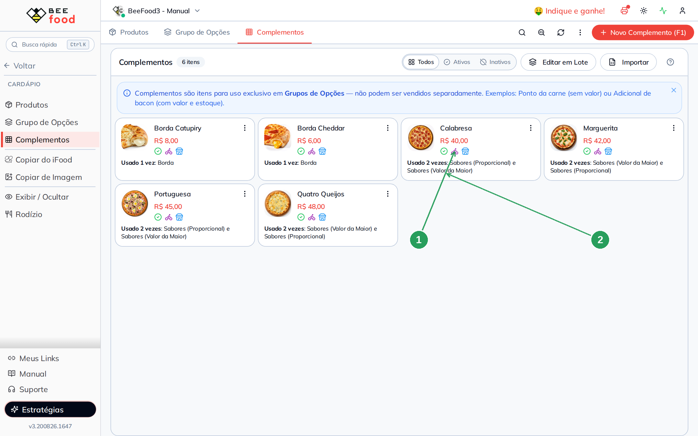

| Nº | Item | O que observar |
|----|------|----------------|
| 1 | **Preço do sabor** | Aqui vai o preço **inteiro** da pizza daquele sabor (Calabresa R$ 40,00). É esse valor que o Modelo A usa direto. |
| 2 | **Usado 2 vezes** | O mesmo sabor serve aos dois grupos de sabores. Um complemento pode entrar em quantos grupos você quiser. |

> **Por que sabor é complemento, e não produto?** Porque sabor não é vendido sozinho — ninguém
> compra "uma calabresa". Se na sua casa a pizza de um sabor específico também é vendida
> inteira e aparece no cardápio, aí cadastre como **produto**: a busca de opções aceita os dois.

> **Bordas também são complementos**, e ficam num grupo separado (Parte 4).

---

## Parte 2 — Modelo A: Valor da Maior

Crie o grupo em **Cardápio → Grupo de Opções → Novo Grupo (F1)**.

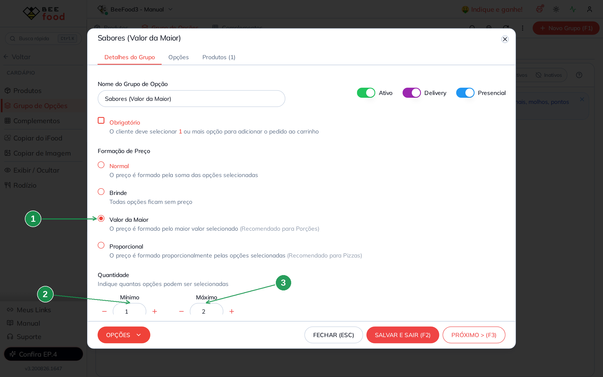

| Nº | Campo | O que preencher |
|----|-------|-----------------|
| 1 | **Valor da Maior** | A regra de preço: só a opção mais cara é cobrada. |
| 2 | **Mínimo** | `1` — o cliente precisa escolher pelo menos um sabor. |
| 3 | **Máximo** | `2` — até dois sabores (meio a meio). Para até três, use `3`. |

Dê ao grupo um nome que a equipe entenda; no exemplo, **Sabores (Valor da Maior)**.

### As opções: preço inteiro

Na aba **Opções**, inclua os quatro sabores com **BUSCAR E CADASTRAR**. Eles entram com o preço
que você cadastrou no complemento — e é assim que deve ficar:

| Nº | Coluna | O que confere |
|----|--------|---------------|
| 1 | **Valor** | O preço **inteiro** da pizza de cada sabor: R$ 40,00, R$ 45,00, R$ 42,00 e R$ 48,00. |
| 2 | **Limite da opção** | `0 - 1`: cada sabor pode ser escolhido **uma vez**. É o padrão e serve para este modelo. |

Salve com **SALVAR E SAIR (F2)**. Pronto — o Modelo A tem só isso.

---

## Parte 3 — Modelo B: Proporcional

Aqui a lógica muda: cada opção representa **meia pizza**. Crie outro grupo.

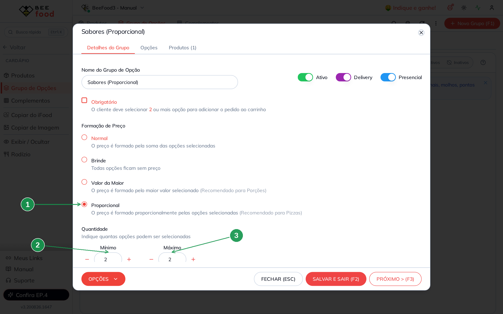

| Nº | Campo | O que preencher |
|----|-------|-----------------|
| 1 | **Proporcional** | A regra de preço. Lembre: ela **soma** as opções — quem divide é o preço que você cadastra. |
| 2 | **Mínimo** | `2` — o cliente escolhe sempre **duas metades**. |
| 3 | **Máximo** | `2` — nunca mais de duas. |

O mínimo 2 é o que faz o modelo funcionar: a pizza é **sempre** montada com duas metades, mesmo
quando as duas são do mesmo sabor.

### As opções: preço de meia pizza

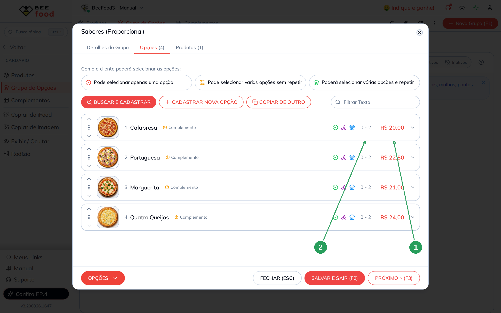

| Nº | Coluna | O que confere |
|----|--------|---------------|
| 1 | **Valor** | A **metade** do preço da pizza: R$ 20,00 (metade de R$ 40,00), R$ 22,50, R$ 21,00 e R$ 24,00. |
| 2 | **Limite da opção** | `0 - 2`: o mesmo sabor pode ser escolhido **duas vezes** — é assim que se pede pizza inteira de um sabor. |

Esses dois números não vêm prontos: você precisa ajustá-los opção por opção. Clique na linha do
sabor para abri-la.

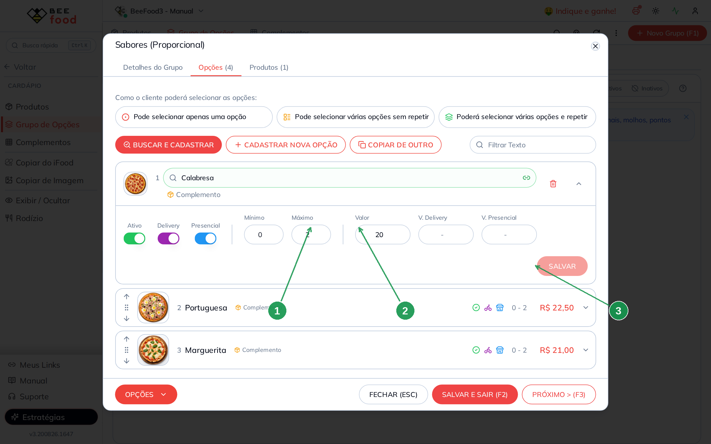

| Nº | Campo | O que preencher |
|----|-------|-----------------|
| 1 | **Máximo** | `2` — libera repetir o mesmo sabor. **Sem isso não existe pizza inteira de um sabor.** |
| 2 | **Valor** | A metade do preço inteiro. Calabresa de R$ 40,00 → `20`. |
| 3 | **SALVAR** | Confirma a linha. Repita para cada sabor e finalize com **SALVAR E SAIR (F2)**. |

> **A conta da metade é simples:** pegue o preço da pizza inteira e divida por 2. Preço ímpar
> como R$ 45,00 vira R$ 22,50 — pode usar centavos sem problema.

---

## Parte 4 — A borda

Borda é um grupo separado, com formação **Normal** (soma), mínimo `0` e máximo `1`. As duas
pizzas usam o **mesmo** grupo.

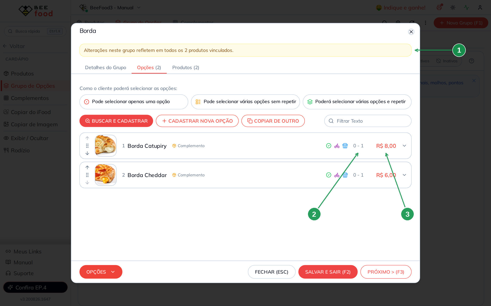

| Nº | Item | O que observar |
|----|------|----------------|
| 1 | **Aviso de grupo compartilhado** | *Alterações neste grupo refletem em todos os 2 produtos vinculados.* Reajustar a borda aqui vale para as duas pizzas de uma vez. |
| 2 | **Limite da opção** | `0 - 1`: uma borda por pizza. |
| 3 | **Valor** | R$ 8,00 e R$ 6,00. Com formação **Normal**, esse valor **soma** ao preço dos sabores. |

> Se a borda for grátis, use a formação **Brinde** em vez de deixar os preços em zero: fica
> explícito para quem cadastra depois.

---

## Parte 5 — Cadastrar a pizza

Em **Cardápio → Produtos**, crie o setor **Pizzas** e depois o produto.

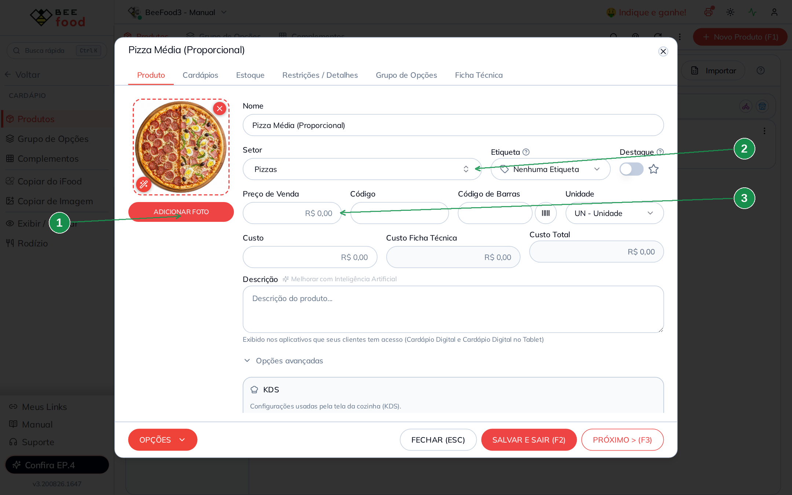

| Nº | Campo | O que preencher |
|----|-------|-----------------|
| 1 | **ADICIONAR FOTO** | A foto aparece grande na tela de venda e no cardápio digital. |
| 2 | **Setor** | `Pizzas`. |
| 3 | **Preço de Venda** | **R$ 0,00.** Este é o ponto mais importante desta parte. |

> ⚠️ **O preço da pizza precisa ficar R$ 0,00.** O preço vem dos **sabores**. Se você colocar
> R$ 40,00 aqui e mais R$ 40,00 no sabor, o sistema **soma os dois** e o cliente paga R$ 80,00.
> O preço base é sempre um acréscimo fixo em cima do que os grupos trazem.

Na listagem, produto com preço zero aparece com um traço (`-`) no lugar do valor. É esperado: o
preço só existe depois que o cliente escolhe os sabores.

---

## Parte 6 — Vincular os grupos

Na aba **Grupo de Opções** do produto, vincule **um** grupo de sabores e o grupo **Borda**.

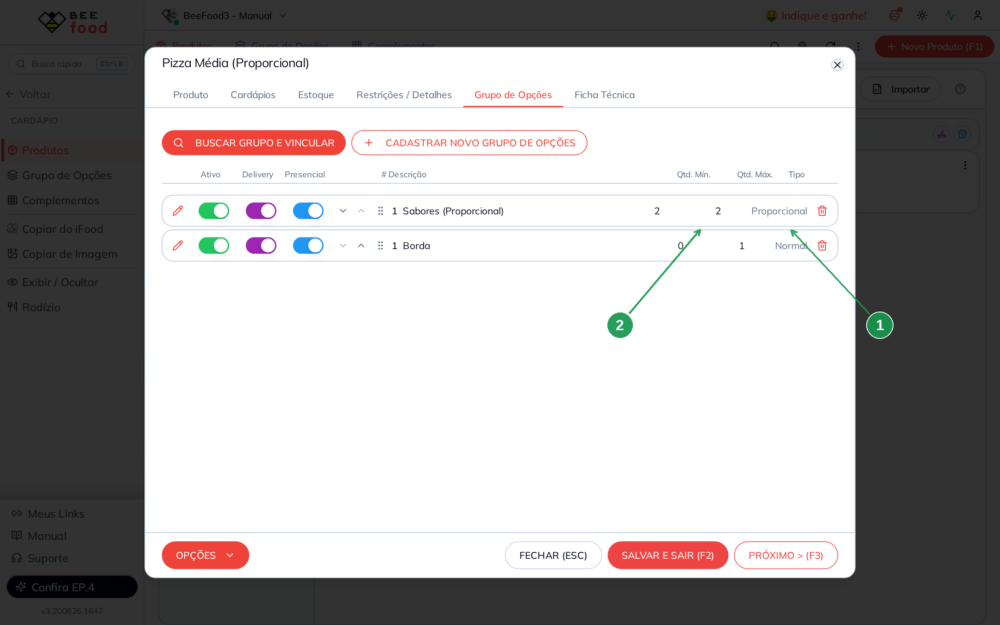

| Nº | Coluna | O que confere |
|----|--------|---------------|
| 1 | **Tipo** | A formação de preço de cada grupo: `Proporcional` na linha dos sabores e `Normal` na linha da Borda (logo abaixo). **Confira aqui antes de liberar a venda** — é o resumo de tudo que você configurou. |
| 2 | **Qtd. Mín.** e **Qtd. Máx.** | `2` e `2` no grupo de sabores (as duas metades) e `0` e `1` na Borda. |

Vincule **só um** grupo de sabores por produto. Os dois juntos fariam o cliente escolher sabor
duas vezes, com duas regras de preço diferentes.

> As setas ao lado do nome mudam a ordem em que os grupos aparecem na venda. Deixe os sabores
> antes da borda: é a ordem em que o atendente pergunta.

---

## Parte 7 — Conferir no PDV

Cadastro de pizza só está pronto depois de você ver o preço na tela de venda. Abra o **PDV** e
clique na pizza.

### Modelo A — um sabor

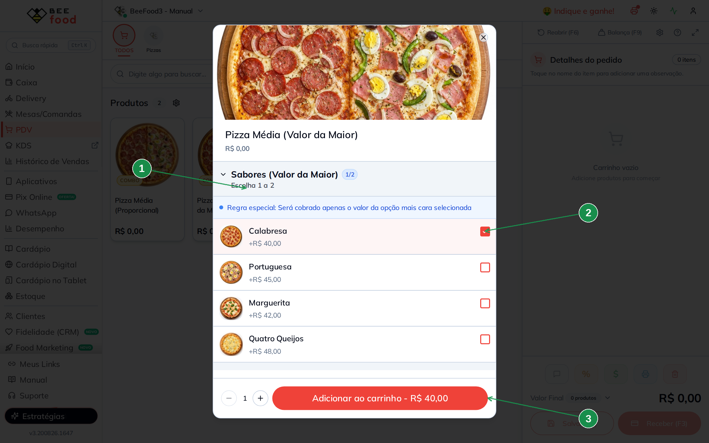

| Nº | Item | O que confere |
|----|------|---------------|
| 1 | **Escolha 1 a 2** | A regra que você definiu no grupo aparece para o operador. |
| 2 | **Sabor marcado** | Cada sabor mostra a foto e o preço inteiro (*+R$ 40,00*). |
| 3 | **Total** | **R$ 40,00** — o preço da pizza de calabresa. |

### Modelo A — meio a meio

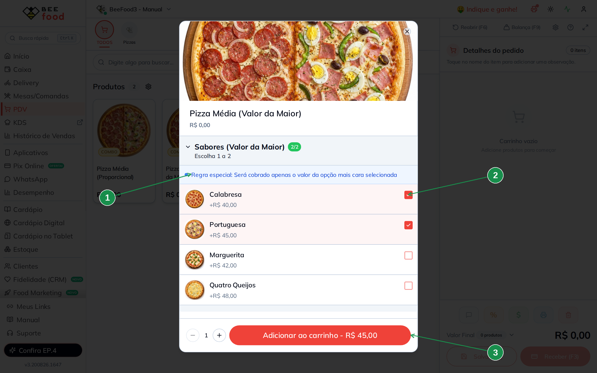

| Nº | Item | O que confere |
|----|------|---------------|
| 1 | **Aviso azul** | *Regra especial: Será cobrado apenas o valor da opção mais cara selecionada.* O sistema explica a regra ao operador — você não precisa treinar ninguém nisso. |
| 2 | **Dois sabores marcados** | Calabresa (R$ 40,00) e Portuguesa (R$ 45,00). |
| 3 | **Total** | **R$ 45,00** — só o mais caro. A calabresa entra sem custo. |

### Modelo B — pizza inteira de um sabor

| Nº | Item | O que confere |
|----|------|---------------|
| 1 | **Escolha 2** e contador **2/2** | O grupo exige duas metades, e as duas já estão escolhidas. |
| 2 | **Quantidade 2 no mesmo sabor** | As duas metades são de calabresa. **Para chegar aqui, clique na linha do sabor duas vezes.** |
| 3 | **Total** | **R$ 40,00** — R$ 20,00 + R$ 20,00, o preço da pizza inteira. |

> ⚠️ **O botão "+" do contador não funciona** nesta versão: ele aparece, mas está travado. Quem
> aumenta a quantidade é o **clique na linha** do sabor. O "−" funciona normalmente para
> diminuir.

### Modelo B — meio a meio

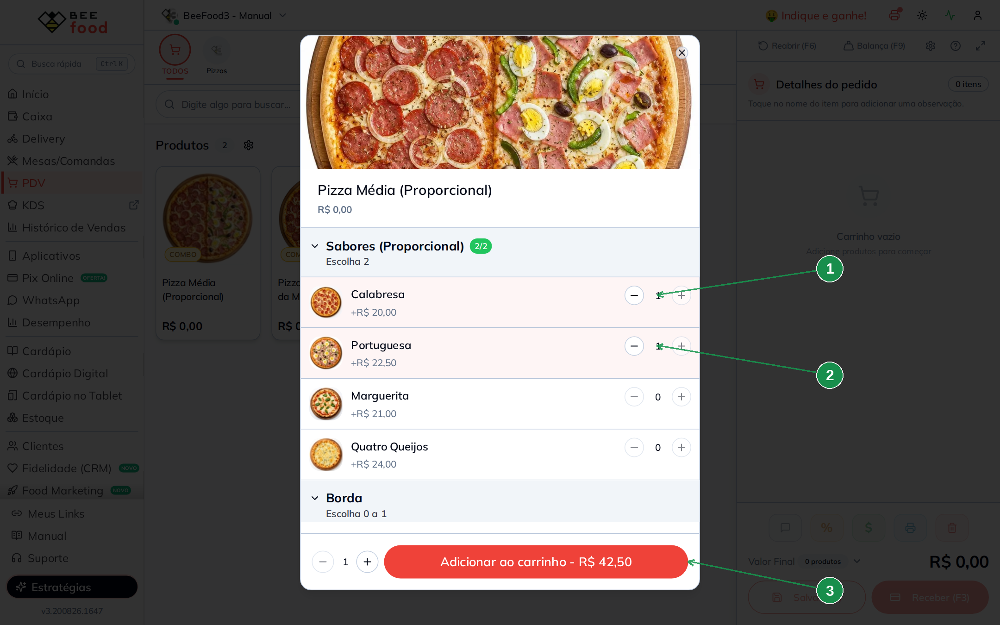

| Nº | Item | O que confere |
|----|------|---------------|
| 1 | **Primeira metade** | Calabresa, 1 (*+R$ 20,00*). |
| 2 | **Segunda metade** | Portuguesa, 1 (*+R$ 22,50*). |
| 3 | **Total** | **R$ 42,50** — a média entre R$ 40,00 e R$ 45,00, que é exatamente o que se espera de um meio a meio. |

### A borda somando

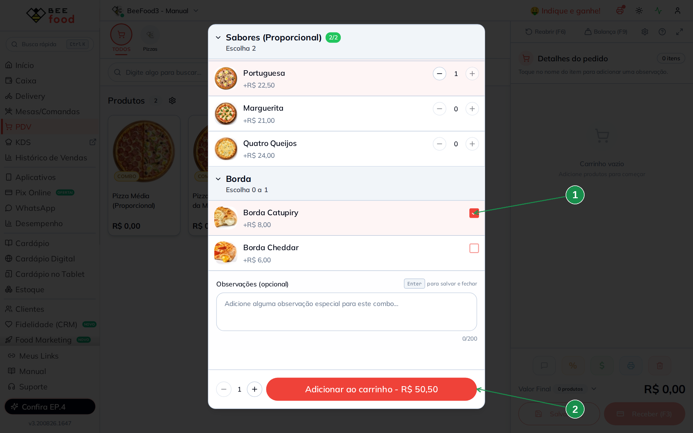

| Nº | Item | O que confere |
|----|------|---------------|
| 1 | **Borda Catupiry marcada** | Grupo com formação **Normal**. |
| 2 | **Total** | **R$ 50,50** = R$ 42,50 dos sabores + R$ 8,00 da borda. |

As duas pizzas ficam assim no cardápio:

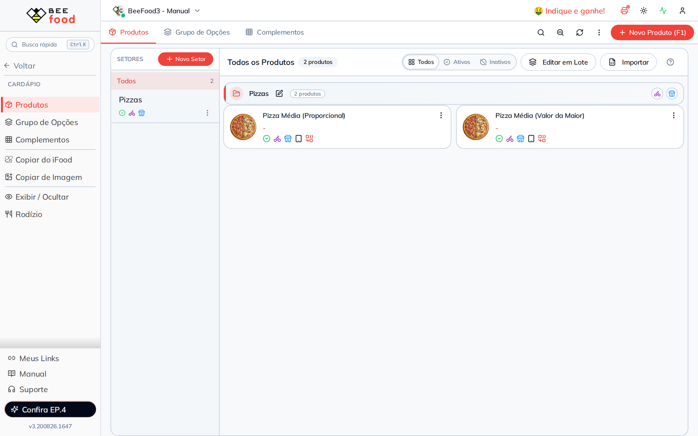

---

## Resumo das contas (tudo conferido no PDV)

| Modelo | Situação | Conta | Total |
|--------|----------|-------|-------|
| **A — Valor da Maior** | 1 sabor (Calabresa) | R$ 40,00 | **R$ 40,00** |
| **A — Valor da Maior** | Calabresa + Portuguesa | o maior entre 40 e 45 | **R$ 45,00** |
| **B — Proporcional** | Calabresa nas duas metades | 20,00 + 20,00 | **R$ 40,00** |
| **B — Proporcional** | Calabresa + Portuguesa | 20,00 + 22,50 | **R$ 42,50** |
| **B — Proporcional** | Meio a meio + Borda Catupiry | 42,50 + 8,00 | **R$ 50,50** |
| ❌ **Erro comum** | Proporcional com preço **inteiro** nos sabores | 40,00 + 45,00 | **R$ 85,00** |

---

## Qual modelo escolher

**Use Valor da Maior se:**

- você quer o cadastro mais simples, com o preço inteiro em cada sabor;
- a sua casa cobra o sabor mais caro no meio a meio (o mais comum no Brasil);
- você quer que o operador veja a regra explicada na tela.

**Use Proporcional se:**

- você cobra a média dos sabores e quer isso no automático;
- você aceita cadastrar o preço da metade em cada sabor;
- você quer que cada metade contabilize o mesmo valor nos relatórios por produto.

Nos dois casos, **três ou mais sabores** funcionam: aumente o Máximo do grupo. No Proporcional,
o preço de cada opção passa a ser a fração correspondente (um terço, um quarto).

---

## Dica extra — Reajustar preços das opções em lote

Depois de montar complementos e grupos, use **Cardápio → Grupo de Opções → Opções**:

1. **Filtro** — encontre as opções pelo funil da coluna (Descrição, Grupo, Tipo ou Status).
2. **Edição** — para uma opção só, clique na linha dentro do grupo e altere o valor.
3. **Edição em lote** — marque várias e aplique o novo preço de uma vez.

Ideal para **reajuste de cardápio** sem abrir produto por produto — por exemplo, corrigir o
preço de Calabresa e Portuguesa no grupo Sabores. Passo a passo com telas: manual
**Cardápio — fundamentos**, Parte 8.

> **Na pizzaria isso pede atenção redobrada:** os dois grupos de sabores têm valores
> diferentes para o mesmo sabor (inteiro num, metade no outro). Filtre **pelo grupo** antes de
> aplicar o lote, ou você reajusta os dois com o mesmo valor.

---

## Perguntas frequentes

**Posso ter tamanhos diferentes (média, grande, família)?**
Sim, e o caminho é **um produto por tamanho**, cada um com o seu grupo de sabores e os preços
daquele tamanho. Não tente resolver com um grupo de "tamanho" junto do de sabores: o preço do
sabor não muda conforme o tamanho escolhido.

**Como faço pizza de três sabores?**
No Modelo A, deixe o Máximo do grupo em `3`. No Modelo B, Mínimo e Máximo `3`, o Máximo de cada
opção em `3` e o preço de cada opção igual a um terço da pizza. Atenção a um detalhe: quando a
divisão não é exata (R$ 133,00 ÷ 3), o total pode fechar com **1 centavo** de diferença.

**O cliente pode pedir meio a meio com sabores de tamanhos de preço muito diferentes?**
Pode. É justamente onde os dois modelos se separam: com sabores de R$ 40,00 e R$ 48,00, o
Modelo A cobra R$ 48,00 e o Modelo B cobra R$ 44,00.

**Onde coloco o refrigerante do combo?**
Em outro grupo, com formação **Normal**. Combo de pizza + bebida é um grupo a mais no mesmo
produto.

**Cadastrei tudo e a pizza aparece sem preço no cardápio.**
É o esperado: o produto tem preço base R$ 0,00 e o valor vem dos sabores. Se você quiser que o
cardápio digital mostre "a partir de", preencha o valor mínimo do produto — mas **não** mexa no
Preço de Venda.

**Mudei o preço do complemento e o sabor continua com o preço antigo.**
O preço da opção é gravado no grupo quando ela é incluída, e depois vive separado do
complemento. Altere pela linha da opção ou pelo **Editar em Lote**.

**Preciso dos dois produtos que aparecem neste manual?**
Não. Eles existem só para comparar os modelos. Escolha um, apague o outro e chame o que ficou
de *Pizza Média*.

---

## Manuais relacionados

| Manual | O que traz |
|--------|------------|
| **Cardápio — fundamentos** | O fluxo completo, as quatro formações de preço e a edição em lote |
| **Cardápio — hambúrguer** | **Brinde** para ponto da carne e retirada de ingredientes |
| **Cardápio — açaí** | Tamanhos e grupos grandes de acompanhamentos |
| **Cardápio — comida japonesa** | Combinado com contagem exata de peças |
