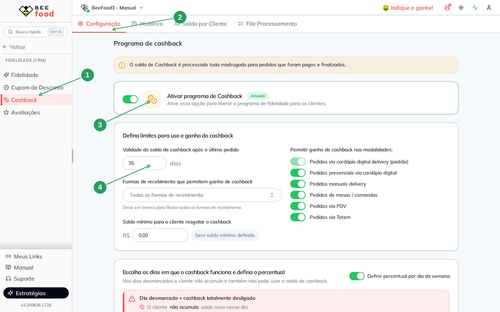
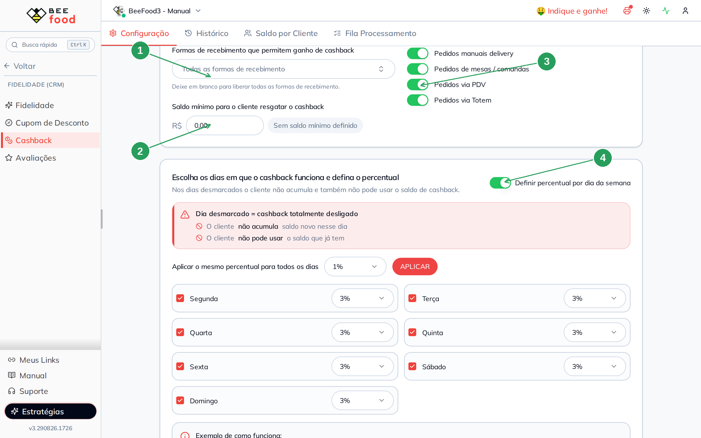
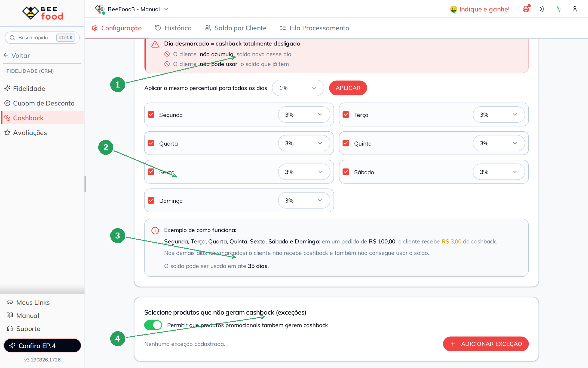
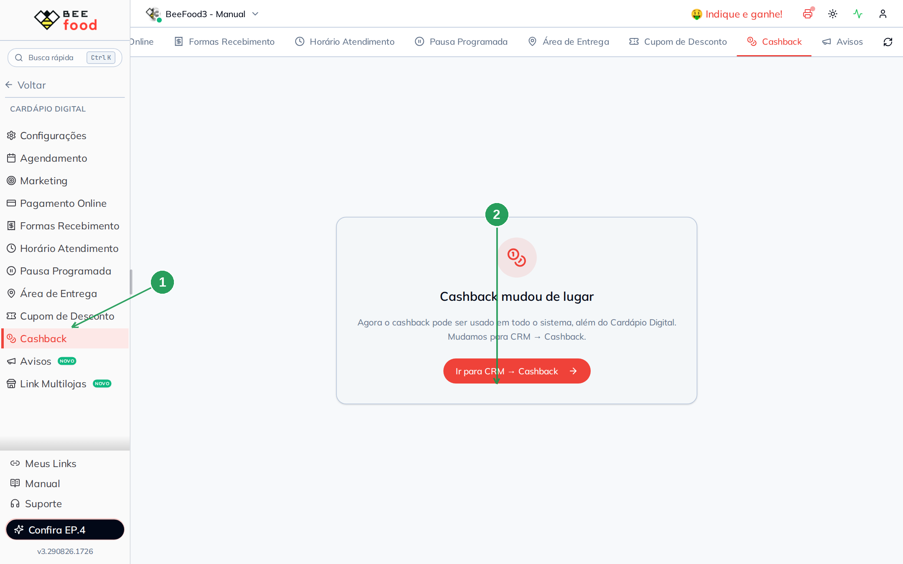
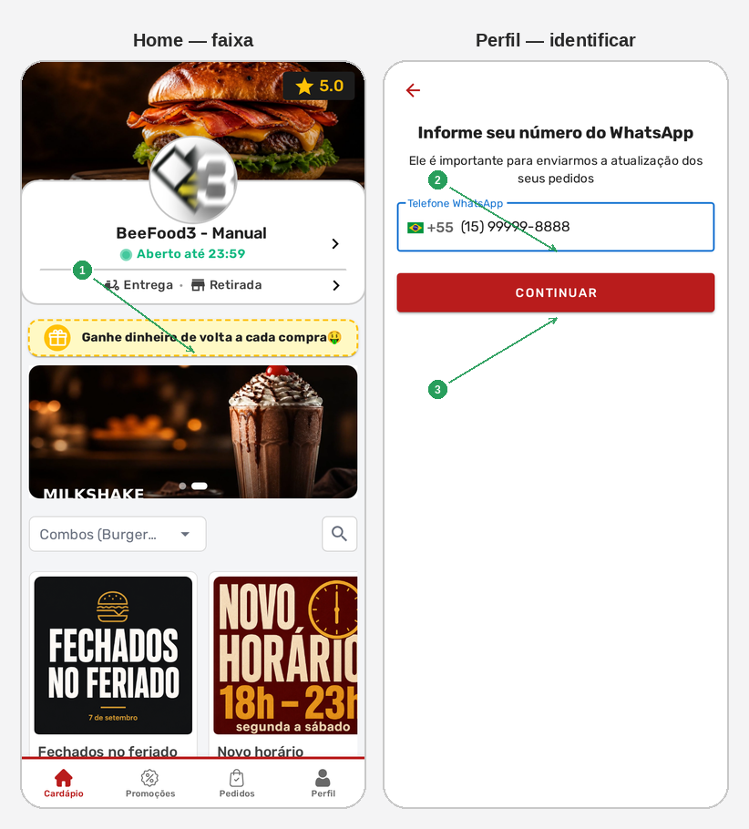

# Cashback — configurar o programa

O cashback devolve ao cliente um **percentual da compra** para usar na próxima.
Ele vale no **cardápio digital**, no **PDV**, nas **Mesas**, no **Delivery manual**
e no **Totem** — desde que você ligue cada canal.

Este manual cobre **só a configuração**. O dia a dia (histórico, saldo, ajuste e
usar na venda) está no manual **Cashback — operar**.

> As imagens têm **setas com números** (1, 2, 3…). No texto, cada número indica
> o campo ou botão correspondente na tela.

---

## Antes de começar

1. Acesso a **Fidelidade (CRM) → Cashback**.
2. O cardápio precisa ter **Cardápio Digital** contratado e **link** configurado.
3. O crédito do cliente **não cai na hora**: o sistema processa **toda madrugada**
   e só em pedido **pago e finalizado**.

O caminho antigo **Cardápio Digital → Cashback** só avisa que a tela mudou.

---

## Parte 1 — Abrir e ativar

No menu, abra **Fidelidade (CRM)** e clique em **Cashback** (1).
A primeira aba é **Configuração** (2). Ligue **Ativar programa de Cashback** (3).
Na mesma tela fica a **Validade do saldo** (4).

| Nº | Campo | O que faz |
|----|--------|-----------|
| 1. | **Cashback** no menu | Abre o programa |
| 2. | Aba **Configuração** | Regras de ganho e uso |
| 3. | **Ativar programa** | Liga ou desliga tudo. Desligado, o cliente não acumula e não usa |
| 4. | **Validade do saldo** | Dias depois do último pedido. **0** = não expira. Máximo 365 |

A faixa amarela lembra: o saldo só é creditado **de madrugada**, em venda quitada.
Pedido em aberto, parcial ou cancelado **não gera** cashback até regularizar.

A configuração grava **sozinha** (não há botão Salvar).

---

## Parte 2 — Limites e canais

Role a tela. Aqui você define **validade**, **quem ganha** e **onde ganha**.

| Nº | Campo | O que faz |
|----|--------|-----------|
| 1. | **Formas de recebimento** | Quais formas **geram** cashback. Vazio = **todas** |
| 2. | **Saldo mínimo para resgatar** | Abaixo desse valor o cliente não consegue usar. **R$ 0,00** = sem mínimo |
| 3. | **Modalidades** | Em quais canais o programa vale (os quatro opcionais) |
| 4. | **Definir percentual por dia** | Liga o modo diário (cada dia com o próprio %) |

**Cardápio digital delivery** fica sempre ligado (é o padrão). Os outros você
escolhe: presencial no cardápio, delivery manual, mesas, PDV e totem.

---

## Parte 3 — Percentual e dias

Há dois modos:

- **Percentual padrão** — o mesmo % todos os dias.
- **Percentual por dia da semana** — cada dia tem o próprio % **e** pode ser
  desligado.

No sandbox o modo **por dia** está ligado, com **3%** de segunda a domingo.

| Nº | Campo | O que faz |
|----|--------|-----------|
| 1. | Aviso vermelho | Dia **desmarcado** = cashback **totalmente desligado** naquele dia |
| 2. | Grade dos dias | Marque o dia e escolha o % (presets ou personalizado) |
| 3. | **Exemplo** | Pedido de R$ 100,00 com o % atual e a validade |
| 4. | **Exceções** | Produtos que **não geram** cashback; switch de itens em promoção |

**Armadilha:** dia desmarcado **não acumula e também não deixa usar** o saldo
que o cliente já tem. Não é só “hoje não ganha”.

O quadro **Exemplo de como funciona** calcula um pedido de R$ 100,00 com o %
atual e lembra a validade.

**APLICAR** o mesmo % em todos os dias preenchidos poupa clique — não mexe nos
dias desmarcados.

**Permitir que produtos promocionais também gerem cashback:** ligado = item em
promoção entra na base do cálculo. Desligado = promoção não gera.

**Adicionar exceção** tira um produto específico do ganho. Sem exceção, todos
os produtos (dentro das outras regras) geram.

---

## Parte 4 — A tela antiga do Cardápio Digital

Se alguém ainda abrir **Cardápio Digital → Cashback**, o sistema avisa:

| Nº | O que fazer |
|----|-------------|
| 1. | Item **Cashback** no menu do Cardápio Digital — só o aviso |
| 2. | **Ir para CRM → Cashback** — a tela certa |

---

## Parte 5 — O que o cliente vê no cardápio

O cardápio público (`menu.beefood.com.br/…`) mostra a faixa amarela assim que
o programa está ativo. Pode levar **até 1 minuto** para refletir uma mudança
de configuração.

Para o saldo aparecer no pedido, o cliente se identifica pelo WhatsApp.
Use um **telefone de teste** da loja (nunca o de um cliente real nas capturas
e nos testes). No sandbox: **(15) 99999-8888**. No rodapé, toque em **Perfil**.

| Nº | O que o cliente vê |
|----|--------------------|
| 1. | Faixa **Ganhe dinheiro de volta a cada compra** — o programa está ligado |
| 2. | **Telefone WhatsApp** — o número de teste |
| 3. | **CONTINUAR** — entra com esse telefone |

Identificado, o saldo aparece no **fechamento da sacola** (não na home):
**“R$ … de cashback disponível”** e o botão **Usar**. O sistema pode aplicar
sozinho. O print dessa etapa está no manual **Cashback — operar**.

No painel, o operador aplica o mesmo saldo no PDV ou nas Mesas.

---

## Problemas comuns

| Sintoma | O que verificar |
|---------|-----------------|
| Cliente não vê a faixa | Programa **Ativado**? Esperou **1 minuto**? Link do cardápio certo? |
| Ganhou no PDV mas não no cardápio | Canal **Cardápio digital delivery** (sempre ligado) vs o canal da venda |
| “Hoje não usa o saldo” | O **dia da semana** está desmarcado? |
| Pedido de hoje sem crédito | Só cai **de madrugada**, e só se estiver **pago e finalizado** |
| Produto não gerou | Está nas **exceções**? É promoção e o switch está desligado? |

---

## Precisa de ajuda?

Fale com o **suporte BeeFood** com o **cardápio**, o **telefone de teste** usado
e o que o cliente viu (faixa, saldo ou recusa).

---

*Última atualização: agosto/2026 — BeeFood · Cashback (configurar o programa)*
