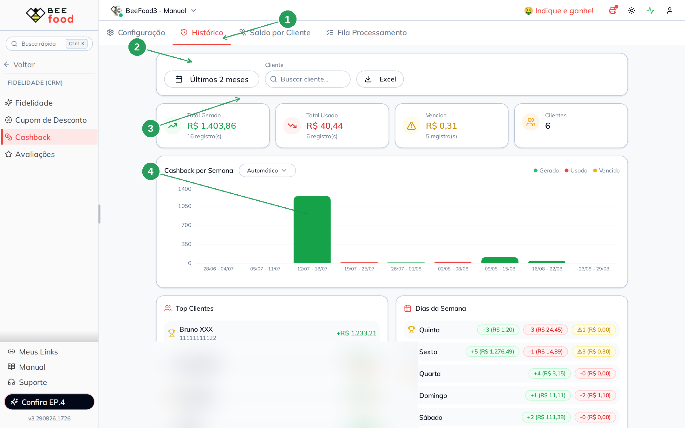
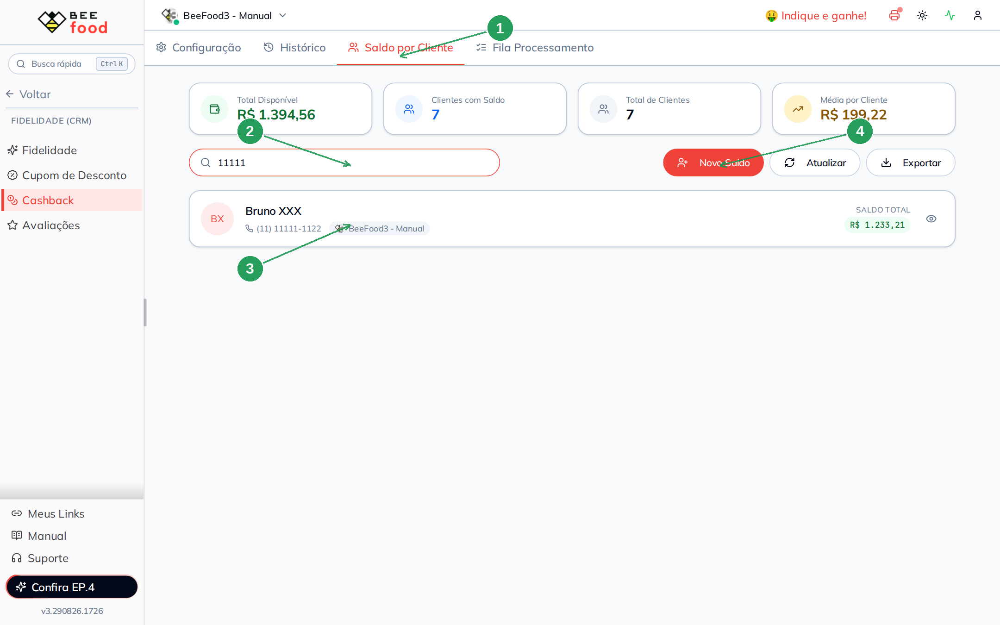
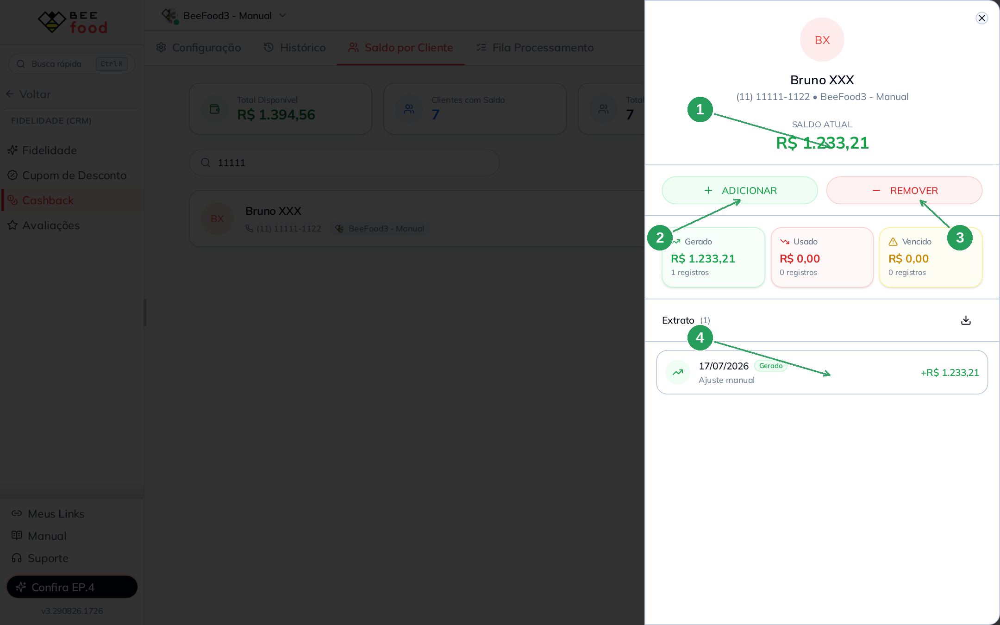
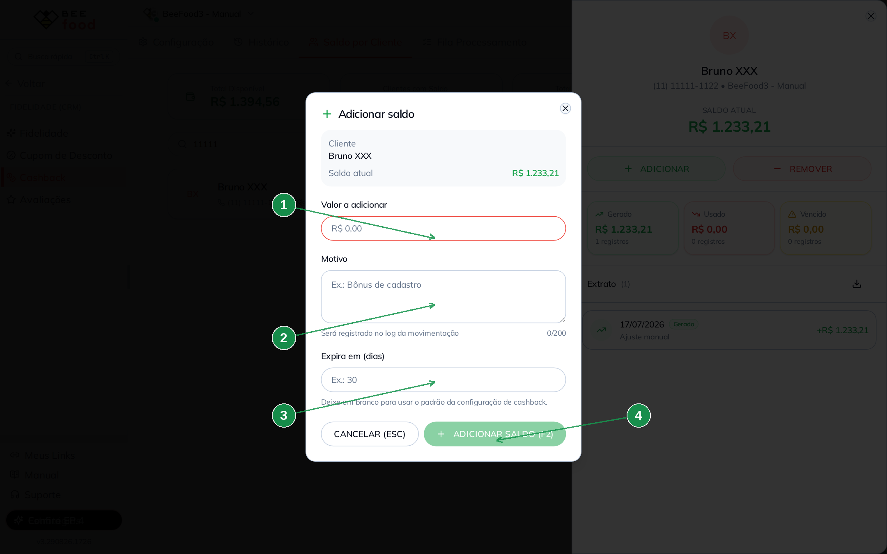
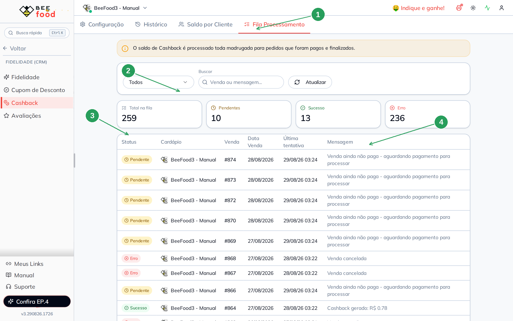
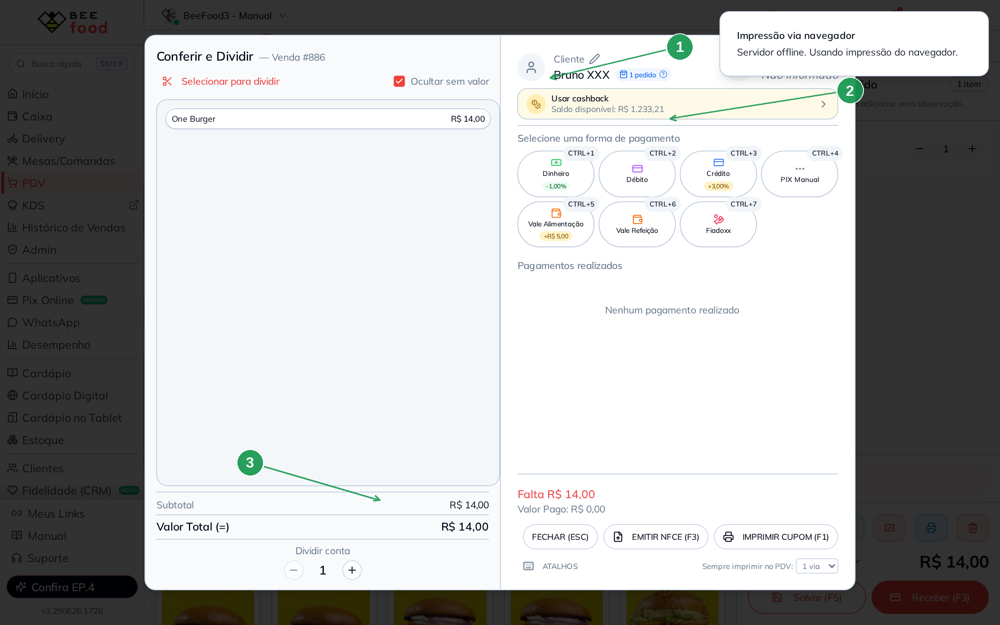
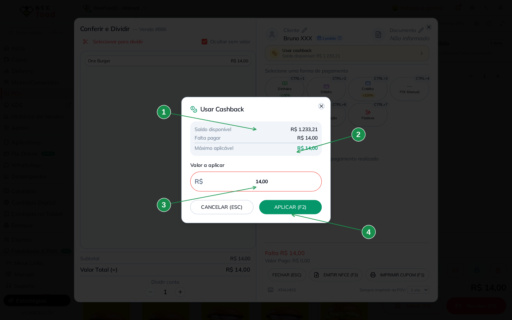
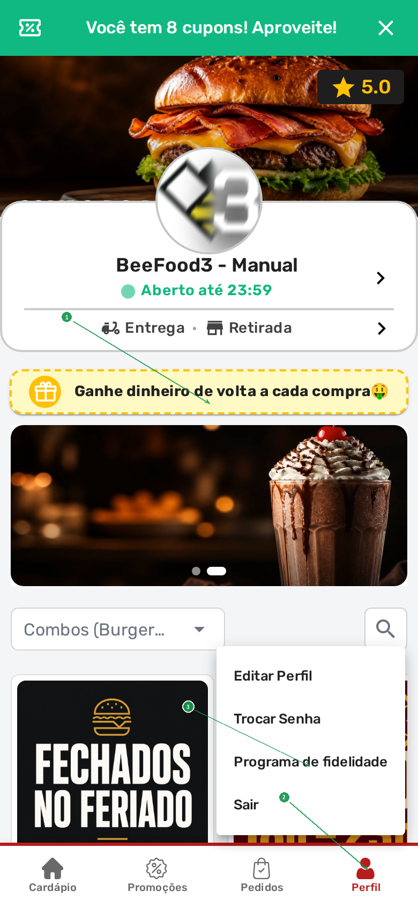

# Cashback — operar no dia a dia

Com o programa **ligado** (manual **Cashback — configurar**), este manual ensina
a **acompanhar**, **ajustar saldo** e **usar** o cashback na venda.

Três lugares:

1. **CRM → Cashback** — histórico, saldo por cliente e fila da madrugada
2. **PDV / Mesas / Delivery** — o operador aplica o saldo no pagamento
3. **Cardápio digital** — o cliente se identifica e usa sozinho

> As imagens têm **setas com números** (1, 2, 3…). No texto, cada número indica
> o campo ou botão correspondente na tela.

---

## Antes de começar

1. Programa **ativado** em **CRM → Cashback → Configuração**.
2. Cliente identificado (no painel ou no cardápio).
3. Nos testes, use o telefone fake **(11) 11111-1122** (Bruno XXX). Não use
   telefone de cliente real.

O crédito novo só entra **de madrugada**, em pedido **pago e finalizado**.
O **uso** na venda é na hora.

---

## Parte 1 — Histórico

Aba **Histórico**: quanto foi gerado, usado e vencido no período.

| Nº | Campo | O que faz |
|----|--------|-----------|
| 1. | Aba **Histórico** | Abre o resumo do período |
| 2. | Período e busca | Filtra por data e por cliente |
| 3. | Cartões | Total gerado, usado, vencido e quantos clientes |
| 4. | Gráfico | Cashback por semana (ou dia / mês) |

**Excel** exporta a lista. **Top clientes** mostra quem mais gerou e quem mais
usou. Telefone e nome de cliente real não devem ir para material público —
nas capturas de teste use o número fake.

---

## Parte 2 — Saldo por cliente

Aba **Saldo por Cliente**. Busque pelo telefone de teste:

| Nº | Campo | O que faz |
|----|--------|-----------|
| 1. | Aba **Saldo por Cliente** | Lista quem tem saldo |
| 2. | Busca | Nome ou telefone. Aqui: `11111` |
| 3. | Cartão do cliente | Nome, telefone e **saldo total** |
| 4. | **Novo Saldo** | Atalho para creditar sem abrir o cartão |

Toque no cartão para ver o extrato e ajustar.

| Nº | Campo | O que faz |
|----|--------|-----------|
| 1. | **Saldo atual** | Quanto o cliente pode usar agora |
| 2. | **Adicionar** | Credita (ajuste manual, com motivo) |
| 3. | **Remover** | Debita do saldo, também com motivo |
| 4. | **Extrato** | Gerado, usado e vencido, linha a linha |

**Adicionar** pede valor, motivo (obrigatório, vai para o log) e, se quiser,
validade em dias. Em branco, usa a validade da configuração.

| Nº | Campo | O que faz |
|----|--------|-----------|
| 1. | **Valor a adicionar** \* | Quanto creditar |
| 2. | **Motivo** \* | Ex.: bônus de cadastro. Fica no extrato |
| 3. | **Expira em (dias)** | Vazio = padrão do programa |
| 4. | **Adicionar saldo (F2)** | Grava. **Cancelar** não mexe em nada |

O mesmo fluxo existe no **cadastro do cliente** (aba Cashback).

---

## Parte 3 — Fila da madrugada

Aba **Fila Processamento**. Toda noite o sistema tenta creditar as vendas
quitadas.

| Nº | Campo | O que faz |
|----|--------|-----------|
| 1. | Aba **Fila Processamento** | Acompanha o lote da madrugada |
| 2. | Cartões | Total, pendentes, sucesso e erro |
| 3. | Status na tabela | **Pendente**, **Sucesso** ou **Erro** |
| 4. | Mensagem | Por que ainda não creditou (ou o valor gerado) |

Exemplos de mensagem:

- **Pendente:** *Venda ainda não paga — aguardando pagamento*
- **Erro:** *Venda cancelada*
- **Sucesso:** *Cashback gerado: R$ …*

Não adianta “forçar” na hora: a fila roda de madrugada. Regularize o pagamento
e espere o próximo processamento.

---

## Parte 4 — Usar no PDV (e nas Mesas)

No PDV, selecione o cliente (telefone fake **11111-1122**), coloque o item e
abra **Receber (F3)**.

| Nº | Campo | O que faz |
|----|--------|-----------|
| 1. | Cliente na venda | Sem cliente, o botão de cashback **não aparece** |
| 2. | **Usar cashback** | Mostra o saldo disponível |
| 3. | Total da venda | O cashback não pode passar desse valor |

Toque em **Usar cashback**:

| Nº | Campo | O que faz |
|----|--------|-----------|
| 1. | **Saldo disponível** | Quanto o cliente tem |
| 2. | **Máximo aplicável** | O menor entre saldo e o que falta pagar |
| 3. | **Valor a aplicar** | Já vem no máximo; você pode diminuir |
| 4. | **Aplicar (F2)** | Entra como desconto. **Cancelar** não usa |

O mesmo painel existe no pagamento das **Mesas** e do **Delivery**.
Respeita saldo mínimo e o dia da semana configurados.

Neste manual o modal foi aberto e **cancelado** — o saldo do teste não foi
gasto.

---

## Parte 5 — O cliente no cardápio digital

No celular, depois de se identificar (telefone fake), o **Perfil** mostra
**Programa de fidelidade**. A faixa amarela **Ganhe dinheiro de volta** já
aparece na home com o programa ligado.

| Nº | O que o cliente faz |
|----|---------------------|
| 1. | Faixa de cashback na home — o programa está ativo |
| 2. | **Perfil** no rodapé |
| 3. | **Programa de fidelidade** — saldo e regras (pode pedir a senha da conta) |

No **fechamento do pedido**, o cliente decide se aplica o saldo. No Totem e no
tablet o fluxo é o mesmo: quem usa é o cliente, não o operador.

Se a faixa não atualizar depois de você ligar o programa, espere **1 minuto**
e recarregue o cardápio.

---

## Problemas comuns

| Sintoma | O que verificar |
|---------|-----------------|
| Botão **Usar cashback** some | Cliente selecionado? Canal do PDV/Mesas ligado? Dia da semana marcado? |
| Não aplica o valor | Saldo abaixo do **mínimo**? Valor maior que a venda? |
| Pedido de ontem sem crédito | Entrou na **fila**? Está **pago**? Olhe a mensagem |
| Cliente no cardápio sem saldo | Identificou o telefone certo? Esperou a madrugada do crédito? |

---

## Precisa de ajuda?

Fale com o **suporte BeeFood** com o **número da venda**, o **telefone de teste**
e um print da fila ou do modal **Usar cashback**.

---

*Última atualização: agosto/2026 — BeeFood · Cashback (operar no dia a dia)*
