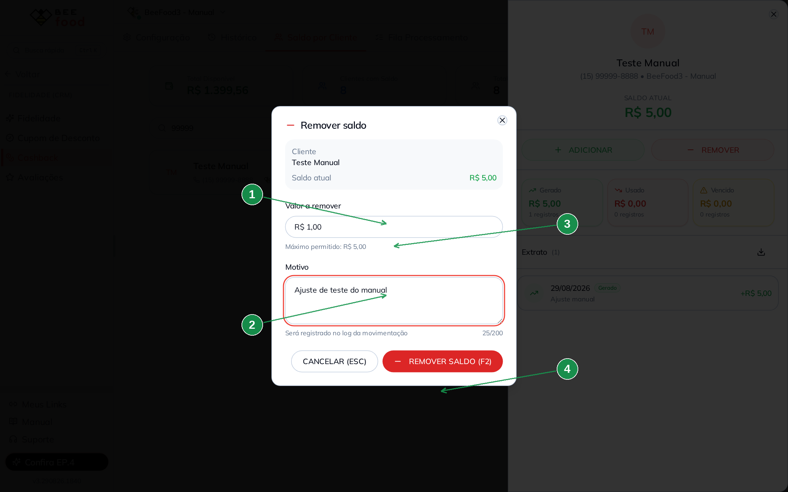
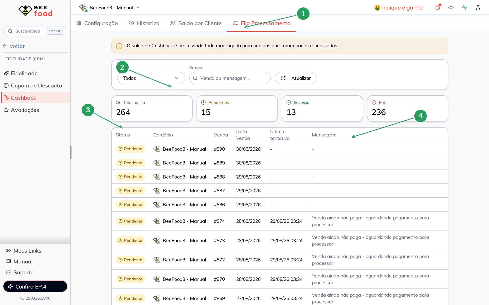
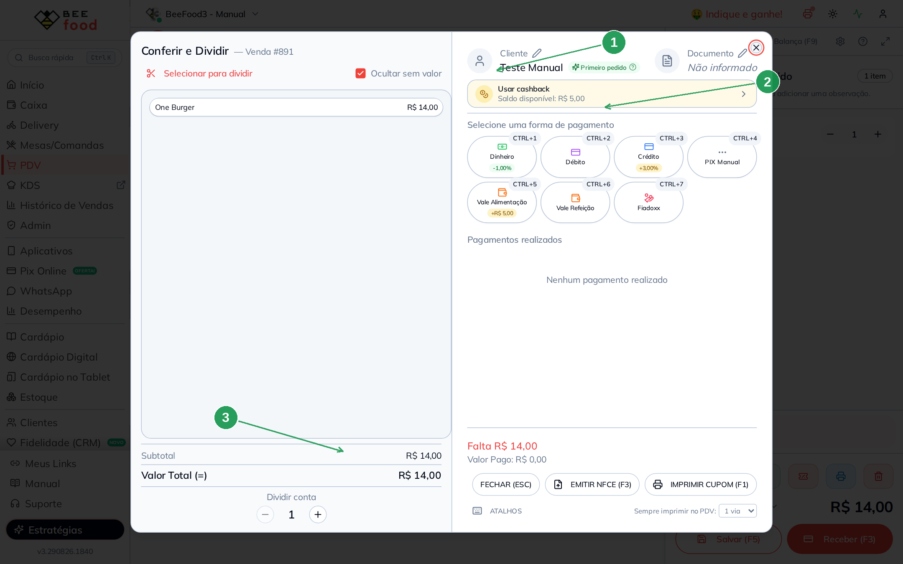
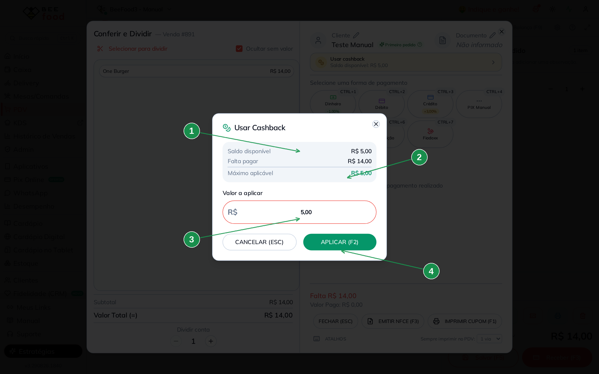
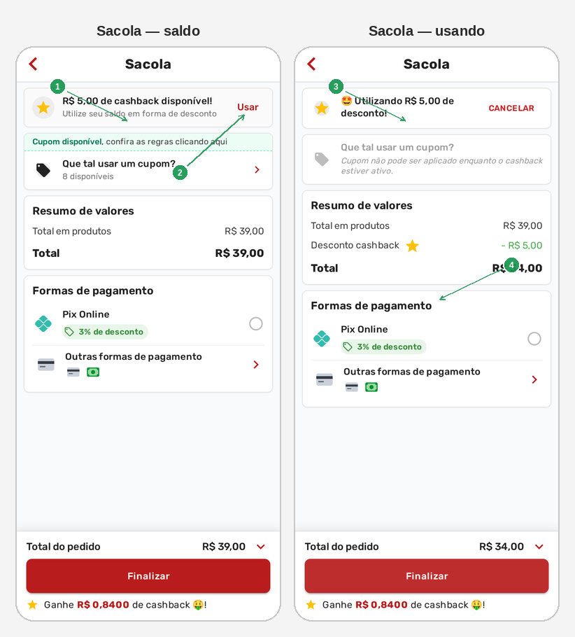

# Cashback — operar no dia a dia

Com o programa **ligado** (manual **Cashback — configurar**), este manual ensina
a **acompanhar**, **colocar ou tirar saldo na mão** e **usar** o cashback na venda.

Três lugares:

1. **CRM → Cashback** — histórico, saldo por cliente, ajuste manual e fila
2. **PDV / Mesas / Delivery** — o operador aplica o saldo no pagamento
3. **Cardápio digital** — o cliente se identifica e usa sozinho

> As imagens têm **setas com números** (1, 2, 3…). No texto, cada número indica
> o campo ou botão correspondente na tela.

---

## Antes de começar

1. Programa **ativado** em **CRM → Cashback → Configuração**.
2. Cliente identificado (no painel ou no cardápio).
3. Nos testes, use o telefone **(15) 99999-8888** (Teste Manual). Não use
   telefone de cliente real.

O crédito **automático** (da venda) só entra **de madrugada**, em pedido
**pago e finalizado**. O **ajuste manual** e o **uso** na venda são na hora.

---

## Parte 1 — Histórico

Aba **Histórico**: quanto foi gerado, usado e vencido no período.
Busque pelo telefone de teste para ver só aquele cliente.

| Nº | Campo | O que faz |
|----|--------|-----------|
| 1. | Aba **Histórico** | Abre o resumo do período |
| 2. | Período e busca | Filtra por data e por cliente. Aqui: `99999` |
| 3. | Cartões | Total gerado, usado, vencido e quantos clientes |
| 4. | Gráfico | Cashback por semana (ou dia / mês) |

**Excel** exporta a lista. **Top clientes** e a tabela de transações mostram
quem gerou e quem usou. Telefone e nome de cliente real não devem ir para
material público — nas capturas use o número de teste.

Neste exemplo o **Teste Manual** tem **R$ 5,00** gerados por **ajuste manual**
(não veio de uma venda).

---

## Parte 2 — Saldo por cliente

Aba **Saldo por Cliente**. Busque pelo telefone de teste:

| Nº | Campo | O que faz |
|----|--------|-----------|
| 1. | Aba **Saldo por Cliente** | Lista quem tem saldo |
| 2. | Busca | Nome ou telefone. Aqui: `99999` |
| 3. | Cartão do cliente | Nome, telefone e **saldo total** — **R$ 5,00** |
| 4. | **Novo Saldo** | Atalho para creditar sem abrir o cartão |

Toque no cartão para ver o extrato e os botões de ajuste.

| Nº | Campo | O que faz |
|----|--------|-----------|
| 1. | **Saldo atual** | Quanto o cliente pode usar agora |
| 2. | **Adicionar** | Coloca saldo na mão (com motivo) |
| 3. | **Remover** | Tira saldo na mão (com motivo) |
| 4. | **Extrato** | Gerado, usado e vencido, linha a linha |

O **R$ 5,00** deste cliente entrou por **Adicionar**: no extrato aparece
**Ajuste manual +R$ 5,00**. Sem esse clique, o saldo ficaria zerado até a
madrugada processar uma venda quitada.

O mesmo fluxo existe no **cadastro do cliente** (aba Cashback).

---

## Parte 3 — Colocar e tirar saldo na mão

### Adicionar

**Adicionar** pede valor, motivo (obrigatório, vai para o log) e, se quiser,
validade em dias. Em branco, usa a validade da configuração.

| Nº | Campo | O que faz |
|----|--------|-----------|
| 1. | **Valor a adicionar** \* | Quanto creditar. Ex.: **R$ 5,00** |
| 2. | **Motivo** \* | Ex.: bônus de cadastro, crédito de teste. Fica no extrato |
| 3. | **Expira em (dias)** | Vazio = padrão do programa |
| 4. | **Adicionar saldo (F2)** | Grava de verdade. **Cancelar** não mexe em nada |

Use um valor pequeno de teste. Motivo vazio o sistema não deixa gravar.

### Remover

**Remover** é o caminho inverso: tira do saldo atual, também com motivo.
O valor não pode passar do que o cliente tem.

| Nº | Campo | O que faz |
|----|--------|-----------|
| 1. | **Valor a remover** \* | Quanto debitar. Ex.: **R$ 1,00** |
| 2. | **Motivo** \* | Ex.: ajuste de conferência. Fica no extrato |
| 3. | **Máximo permitido** | O saldo atual — não passa disso |
| 4. | **Remover saldo (F2)** | Grava. **Cancelar** mantém o saldo |

No extrato, o crédito aparece como **Gerado / Ajuste manual**; a retirada,
como **Usado**.

---

## Parte 4 — Fila da madrugada

Aba **Fila Processamento**. Toda noite o sistema tenta creditar as vendas
quitadas. Isso é o crédito **automático** — diferente do ajuste da Parte 3.

| Nº | Campo | O que faz |
|----|--------|-----------|
| 1. | Aba **Fila Processamento** | Acompanha o lote da madrugada |
| 2. | Cartões | Total, pendentes, sucesso e erro |
| 3. | Status na tabela | **Pendente**, **Sucesso** ou **Erro** |
| 4. | Mensagem | Por que ainda não creditou (ou o valor gerado) |

Exemplos de mensagem:

- **Pendente:** *Venda ainda não paga — aguardando pagamento*
- **Erro:** *Venda cancelada*
- **Sucesso:** *Cashback gerado: R$ …*

Não adianta “forçar” na hora: a fila roda de madrugada. Regularize o pagamento
e espere o próximo processamento. Se precisar de saldo **agora**, use
**Adicionar** na Parte 3.

---

## Parte 5 — Usar no PDV (e nas Mesas)

No PDV, selecione o cliente **Teste Manual** (telefone **99999-8888**),
coloque o item e abra **Receber (F3)**.

| Nº | Campo | O que faz |
|----|--------|-----------|
| 1. | Cliente na venda | Sem cliente, o botão de cashback **não aparece** |
| 2. | **Usar cashback** | Mostra o saldo disponível — aqui **R$ 5,00** |
| 3. | Total da venda | O cashback não pode passar desse valor |

Toque em **Usar cashback**:

| Nº | Campo | O que faz |
|----|--------|-----------|
| 1. | **Saldo disponível** | Quanto o cliente tem (**R$ 5,00**) |
| 2. | **Máximo aplicável** | O menor entre saldo e o que falta pagar |
| 3. | **Valor a aplicar** | Já vem no máximo; você pode diminuir |
| 4. | **Aplicar (F2)** | Entra como desconto. **Cancelar** não usa |

Nesta venda o lanche é **R$ 14,00** e o saldo é **R$ 5,00**: o máximo
aplicável é **R$ 5,00** (não zera a conta). O mesmo painel existe no
pagamento das **Mesas** e do **Delivery**. Respeita saldo mínimo e o dia
da semana configurados.

Neste manual o modal foi aberto e **cancelado** — o saldo de teste
não foi gasto.

---

## Parte 6 — O cliente no cardápio digital

Identificado com o telefone de teste, o cliente monta o pedido e abre a
**Sacola**. No **fechamento** (depois de escolher Entrega ou Retirada) o
saldo aparece. O sistema já tenta usar o cashback sozinho; **CANCELAR**
mostra o saldo de novo.

| Nº | O que o cliente vê |
|----|--------------------|
| 1. | **R$ 5,00 de cashback disponível** — o saldo do telefone de teste |
| 2. | **Usar** — aplica como desconto (não pode passar do total) |
| 3. | **Utilizando R$ 5,00 de desconto** — o saldo entrou no pedido |
| 4. | **Total R$ 34,00** — combo de R$ 39,00 menos os R$ 5,00 |

Embaixo de cada tela: **Ganhe R$ … de cashback** (o que esta compra ainda vai
creditar de madrugada). **CANCELAR** tira o desconto e volta o total cheio.

Cupom **não combina** com cashback ativo. **Finalizar** neste manual **não foi
tocado** — o saldo de teste continua **R$ 5,00**.

Se a faixa da home não atualizar depois de ligar o programa, espere **1 minuto**.

---

## Problemas comuns

| Sintoma | O que verificar |
|---------|-----------------|
| Botão **Usar cashback** some | Cliente selecionado? Canal do PDV/Mesas ligado? Dia da semana marcado? |
| Não aplica o valor | Saldo abaixo do **mínimo**? Valor maior que a venda? |
| Pedido de ontem sem crédito | Entrou na **fila**? Está **pago**? Olhe a mensagem |
| Cliente no cardápio sem saldo | Identificou o telefone certo? Esperou a madrugada — ou falta o **ajuste manual**? |

---

## Precisa de ajuda?

Fale com o **suporte BeeFood** com o **número da venda**, o **telefone de teste**
e um print da fila, do extrato ou do modal **Usar cashback**.

---

*Última atualização: agosto/2026 — BeeFood · Cashback (operar no dia a dia)*
