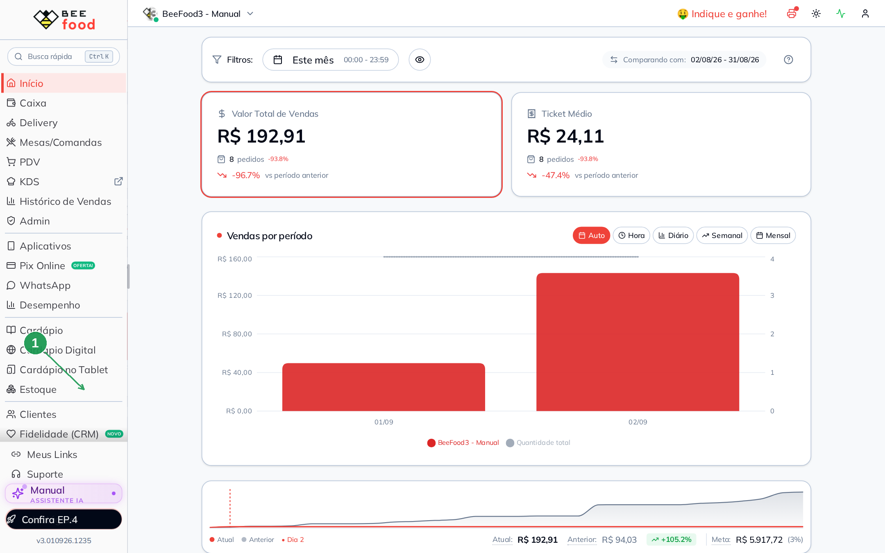
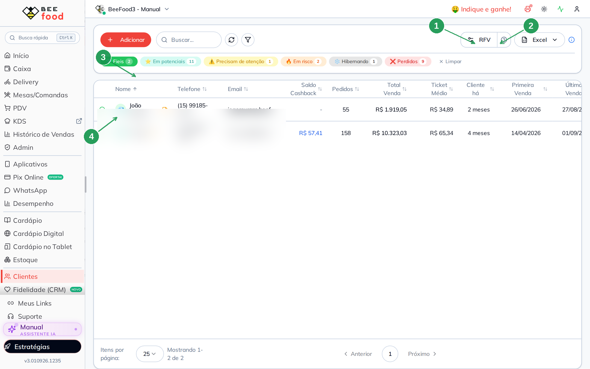
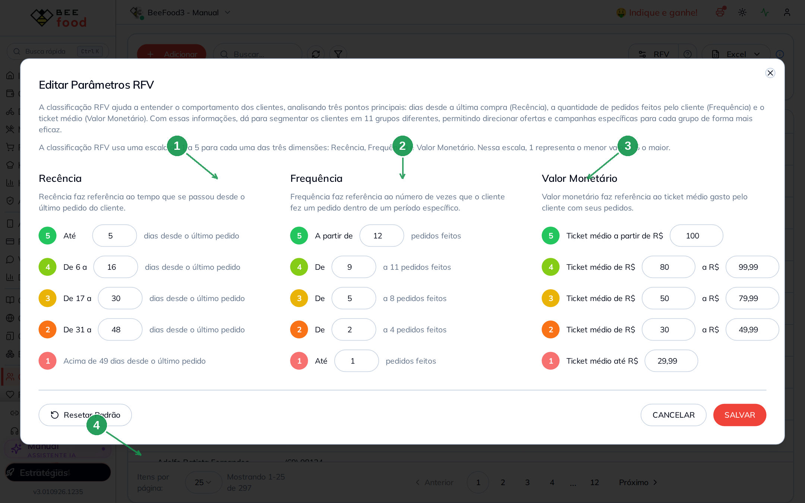
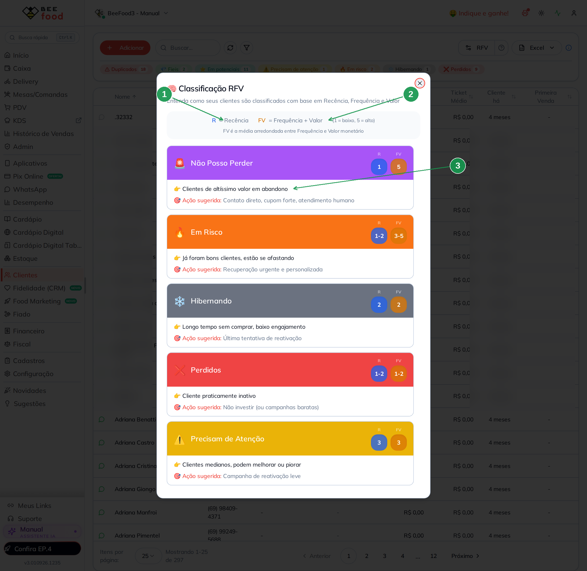
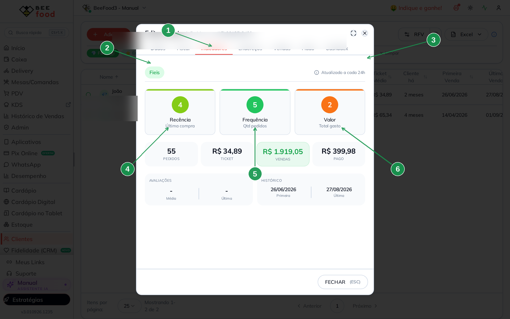
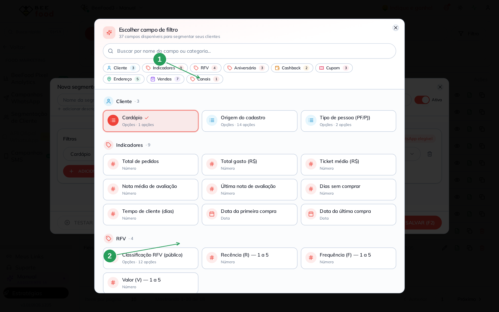
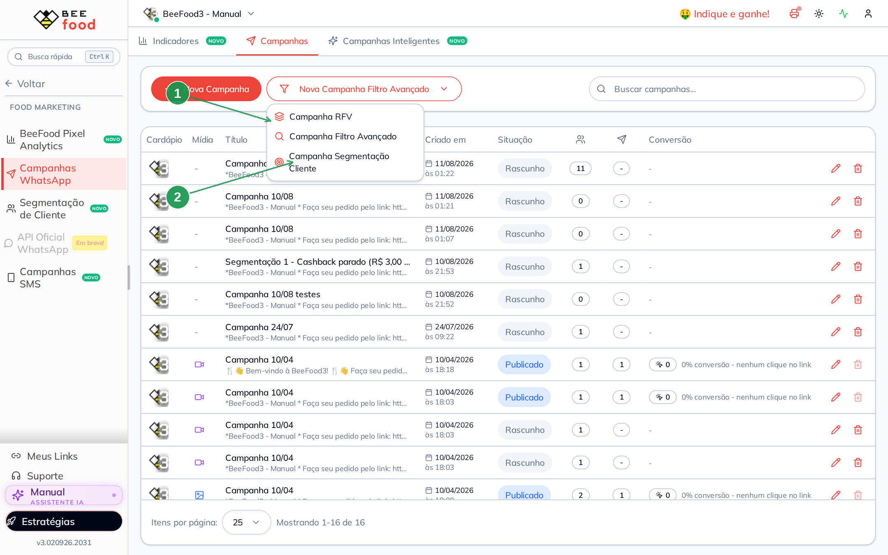
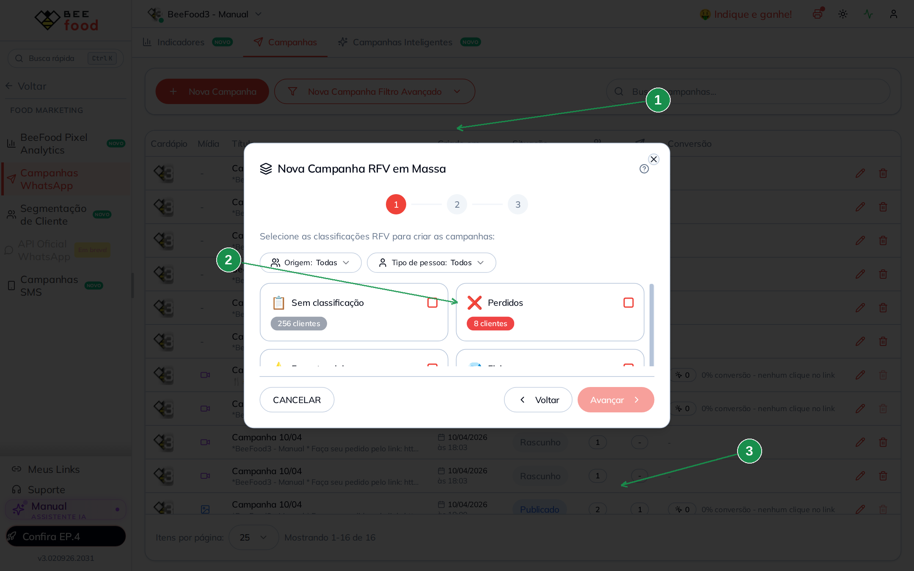
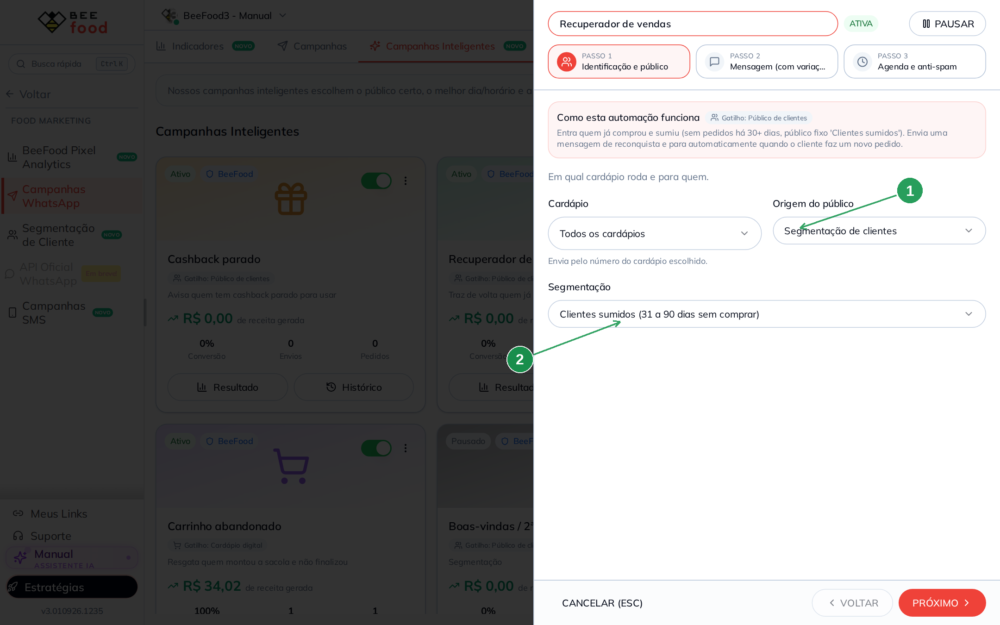
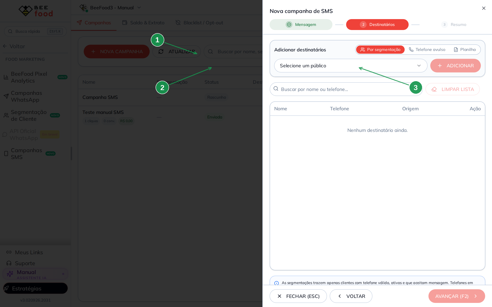

# Manual — Classificação RFV

A loja não tem um cliente só. Tem quem pediu ontem, quem some há três meses, quem
gasta pouco e aparece toda semana, quem gasta muito e sumiu. **Mandar a mesma
mensagem para todo mundo** gasta crédito, queima o WhatsApp e ainda fala a coisa
errada: o Campeão de ontem não precisa de “sentimos sua falta”; o Perdido de 90
dias não precisa do lançamento VIP.

O BeeFood segmenta para a loja **falar com a pessoa certa, no tom certo**. A
classificação RFV é o jeito automático de fazer isso: o sistema olha o
comportamento de compra de cada cliente e coloca ele num grupo. Você não escolhe
o grupo na ficha. Você configura os **limites** — e o resto do Food Marketing
usa esse grupo para montar o público da campanha.

RFV responde três perguntas sobre cada cliente:

| | Pergunta | Em uma palavra |
|---|---|---|
| **R** Recência | Quando foi o último pedido? | Ainda está perto — ou já esfriou? |
| **F** Frequência | Quantas vezes pediu? | É de casa — ou veio uma vez? |
| **V** Valor | Qual o ticket médio? | Pede o combo — ou o item mais barato? |

Com essas três notas o sistema junta a base em **11 grupos** (Campeão, Fiel, Em
risco, Perdido…). Esse grupo é o que a **segmentação** filtra. E a segmentação
é o público das campanhas.

Este manual explica:

1. O que são R, F e V e os 11 grupos
2. Como editar os limites (a única tela em que você mexe)
3. Onde a classificação aparece (lista e ficha)
4. **Onde o RFV é usado** — Campanhas WhatsApp, Segmentação, Campanhas
   Inteligentes e Campanhas SMS

O passo a passo de cada campanha e da segmentação já está nos manuais dessas
telas. Aqui o assunto é o elo: **de onde o grupo nasce e para onde ele vai**.

> As imagens têm **setas numeradas** (1, 2, 3…). Cada número indica o campo
> correspondente na tela.

---

## Onde encontrar

No menu lateral, abra **Clientes**. A classificação mora aqui, não em
Configuração → Parâmetros.



1. **Clientes**

No topo da lista estão o botão **RFV**, o ponto de interrogação da ajuda e os
chips de cada grupo.



1. **RFV** — edita os limites das notas 1 a 5
2. **?** — explica os 11 grupos (Recência × FV)
3. Os **chips** — um por grupo que tem pelo menos um cliente; clique para filtrar
4. O **emoji** na linha — o grupo daquele cliente

O chip só aparece quando aquele grupo tem alguém. Na loja da imagem não há
Campeão nem Novo Cliente, então esses chips não mostram.

---

## O que o sistema mede

Três notas, cada uma de **1 (baixo) a 5 (alto)**:

| Letra | Nome | O que mede | Nota 5 significa |
|-------|------|------------|------------------|
| **R** | Recência | Dias desde o **último pedido** | Comprou faz pouco tempo |
| **F** | Frequência | **Quantidade de pedidos** | Pediu muitas vezes |
| **V** | Valor | **Ticket médio** dos pedidos | O pedido médio é alto |

O grupo **não** usa as três notas soltas. O sistema junta F e V numa nota só,
chamada **FV** — a média arredondada das duas. Depois cruza **R × FV** e cai num
dos 11 grupos.

---

## Os limites das notas

Clique em **RFV**. Esta é a única tela em que você mexe.



1. **Recência** — até quantos dias desde o último pedido valem cada nota
2. **Frequência** — a partir de quantos pedidos vale cada nota
3. **Valor monetário** — a partir de qual **ticket médio** vale cada nota
4. **Resetar Padrão** — volta os números de fábrica da BeeFood

A loja da imagem está no padrão:

| Nota | Recência (dias) | Frequência (pedidos) | Ticket médio |
|------|-----------------|----------------------|--------------|
| 5 | até 5 | a partir de 12 | a partir de R$ 100,00 |
| 4 | 6 a 16 | 9 a 11 | R$ 80,00 a R$ 99,99 |
| 3 | 17 a 30 | 5 a 8 | R$ 50,00 a R$ 79,99 |
| 2 | 31 a 48 | 2 a 4 | R$ 30,00 a R$ 49,99 |
| 1 | acima de 49 | até 1 | até R$ 29,99 |

Ao mudar um limite, o vizinho se ajusta sozinho para não ficar buraco nem
sobreposição. Depois de **Salvar**, a classificação **não muda na hora**: o
sistema recalcula **uma vez por dia**. Espere até o dia seguinte para ver o
grupo novo na lista, na ficha e nas campanhas.

Não existe botão “recalcular agora”.

---

## Os 11 grupos

No **?** ao lado de RFV o sistema mostra cada grupo, com a faixa de R e de FV
e uma sugestão de ação.



1. **R** — a nota de recência (1 a 5)
2. **FV** — a média arredondada de Frequência e Valor
3. O **card do grupo** — quem entra e o que o sistema sugere fazer

A janela rola. Os 11 grupos, do mais urgente ao mais frio:

| Grupo | R | FV | Em uma frase |
|-------|---|----|--------------|
| 🚨 Não posso perder | 1 | 5 | Altíssimo valor, sumiu |
| 🔥 Em risco | 1–2 | 3–5 | Era bom cliente e está se afastando |
| ❄️ Hibernando | 2 | 2 | Sumiu e já comprava pouco |
| ❌ Perdidos | 1–2 | 1–2 | Praticamente inativo |
| ⚠️ Precisam de atenção | 3 | 3 | Mediano: pode melhorar ou piorar |
| 💤 Quase dormentes | 3 | 1–2 | Recência média, pouco pedido e pouco ticket |
| 🏆 Campeões | 5 | 5 | Comprou agora, pede muito e gasta bem |
| 💎 Fiéis | 3–5 | 4–5 | Cliente constante de bom valor |
| ⭐ Em potenciais | 4–5 | 2–3 | Comprou recente e ainda pode crescer |
| 🌱 Promissores | 4 | 1 | Compra recente, ainda pouco engajado |
| 🆕 Novos | 5 | 1 | Primeira compra bem recente |

**Em potenciais** e **Potenciais fiéis** são o mesmo quadrado — dois nomes para
o mesmo cruzamento. A lista pode mostrar qualquer um dos dois.

Você **não atribui** Campeão ou Perdido na mão. Se o grupo parece errado, o
caminho é rever os **limites** da tela RFV — e esperar o recálculo do dia.

Quem ainda não tem histórico de pedido suficiente aparece como **Sem
classificação**. Esse grupo também entra na campanha de WhatsApp, se você
marcar.

---

## A ficha do cliente (só leitura)

Abra um cliente e vá na aba **Indicadores**. As notas e o grupo estão lá, sem
campo para editar.



1. Aba **Indicadores**
2. O **selo do grupo** (aqui, Fiéis)
3. **Atualizado a cada 24h** — as notas não são ao vivo
4. **Recência** — nota da última compra
5. **Frequência** — nota da quantidade de pedidos
6. **Valor** — nota do ticket médio

O cliente da imagem tem Recência 4, Frequência 5 e Valor 2. A média de 5 e 2
arredonda para FV 4; com R 4 isso cai em **Fiéis**.

O círculo do Valor traz o rótulo “Total gasto”, mas a **nota** segue o
**ticket médio** da tela de parâmetros. Neste cliente o ticket é R$ 34,89
(nota 2) e o total de vendas é R$ 1.919,05 — se a nota usasse o total, seria 5.

---

## Onde o RFV é usado

O grupo gravado no cliente alimenta quatro telas de Food Marketing — de dois
jeitos diferentes.

```
Limites RFV (Clientes → RFV)
        ↓  recálculo diário
Notas + grupo no cliente
        │
        ├── direto ──────► Campanhas WhatsApp  (Campanha RFV / Adicionar por RFV)
        │
        └── Segmentação ─► Campanhas WhatsApp  (Campanha Segmentação Cliente)
                         ► Campanhas Inteligentes
                         ► Campanhas SMS
```

| Onde | Como o RFV entra | Manual |
|------|------------------|--------|
| **Clientes** | Ver, filtrar pelos chips, exportar Excel; editar os limites | este |
| **Segmentação de Cliente** | Quatro filtros: grupo, Recência, Frequência, Valor | [Segmentação](../segmentacao-clientes/segmentacao-clientes.md) |
| **Campanhas WhatsApp** | **Direto** (escolhe o grupo) **ou** via uma segmentação | #15 *(aprovado, ainda sem pasta)* |
| **Campanhas Inteligentes** | **Só** via segmentação (campo *Origem do público*) | [Campanhas Inteligentes](../campanhas-inteligentes/campanhas-inteligentes.md) |
| **Campanhas SMS** | **Só** via segmentação (passo 2, *Por segmentação*) | [Campanhas SMS](../campanhas-sms/campanhas-sms.md) |
| **Desempenho → Análise RFV** | Só leitura: o mesmo grupo em gráfico | — |

A regra prática:

- Precisa só do grupo RFV (todos os Perdidos, todos os Fiéis) → **Campanha RFV**
  no WhatsApp, ou o filtro da segmentação.
- Precisa misturar RFV com outra coisa (Perdidos **e** bairro X, Fiéis **que**
  têm cashback) → crie a **segmentação** e use ela no WhatsApp, na inteligente
  ou no SMS.

### 1. Segmentação de Cliente

Em **Food Marketing → Segmentação de Cliente**, ao montar um público, a
categoria **RFV** tem quatro filtros.



1. A categoria **RFV** (4 filtros)
2. **Classificação RFV (público)** — o grupo (Campeões, Fiéis, Perdidos…). Também
   dá para filtrar pela nota 1 a 5 de Recência, Frequência ou Valor

Uma segmentação **Ativa** fica disponível para as três campanhas abaixo. Se o
botão Ativa estiver desligado, o público continua salvo, mas some da hora de
montar campanha.

O passo a passo (E/OU, testar o tamanho, modelos prontos) está no manual de
[Segmentação de clientes](../segmentacao-clientes/segmentacao-clientes.md).

### 2. Campanhas WhatsApp — dois caminhos

Em **Food Marketing → Campanhas WhatsApp**, aba **Campanhas**, o botão
**Nova Campanha Filtro Avançado** abre três atalhos. Dois deles usam o RFV.



1. **Campanha RFV** — escolhe o grupo na hora; o sistema monta a lista com quem
   está classificado assim
2. **Campanha Segmentação Cliente** — usa um público que você já salvou (e esse
   público *pode* filtrar RFV, sozinho ou misturado com outro filtro)

**Campanha RFV** abre a escolha das classificações:



1. **Nova Campanha RFV em Massa** — um disparo por grupo que você marcar
2. Os **cards** — cada classificação e quantos clientes tem agora. **Sem
   classificação** são os que ainda não caíram em grupo (pouco histórico)
3. **Avançar** — segue para a mensagem. Não confirme se estiver só olhando

Dentro de uma campanha já aberta existe o mesmo atalho: **Adicionar → RFV**,
para completar a lista sem criar campanha nova.

O editor da mensagem, as variações e o resultado ficam no manual de Campanhas
WhatsApp (#15).

### 3. Campanhas Inteligentes — pela segmentação

A campanha inteligente **não lê o grupo RFV direto**. No passo 1, a origem do
público é **Segmentação de clientes**.



1. **Origem do público** — aqui, Segmentação de clientes
2. **Segmentação** — qual público a campanha avalia todo dia

Quatro das seis campanhas padrão falam com um público: Recuperador de vendas,
Cashback parado, Aniversário e Boas-vindas. Elas já vêm com um público da
BeeFood (sumidos, cashback, aniversariantes, novos) — **não** são filtro de
classificação RFV. Troque o campo Segmentação por um público seu que filtre
**Em risco** ou **Não posso perder**, se for isso que você quer.

Carrinho abandonado e “Recebeu o cardápio e não pediu” disparam por **evento**,
não por segmentação: o RFV não entra.

O detalhe dos seis modelos está no manual de
[Campanhas Inteligentes](../campanhas-inteligentes/campanhas-inteligentes.md).

### 4. Campanhas SMS — pela segmentação

O SMS **também não tem atalho RFV**. No passo 2 dos destinatários, o caminho é
**Por segmentação**.



1. **Por segmentação** — o modo que usa o público salvo
2. **Selecione um público** + **ADICIONAR** — só entram segmentações **Ativas**.
   Se essa segmentação filtrar RFV, o SMS fala com esse grupo. A segmentação já
   traz só cliente com telefone válido, ativo e que aceita mensagem

Os outros dois modos (telefone avulso e planilha) não passam pelo RFV.
Créditos, UCS-2 e blacklist estão no manual de
[Campanhas SMS](../campanhas-sms/campanhas-sms.md).

### Relatório

Em **Desempenho → Clientes → Análise RFV** o sistema mostra a mesma
classificação em gráfico. Não se edita limite por lá — só se lê o resultado.

A exportação Excel da lista de **Clientes** e a da **segmentação** também
trazem a coluna Classificação.

---

## O que lembrar

- O BeeFood segmenta para a loja **não falar a mesma coisa com todo mundo**.
- O grupo é **calculado**. Não se marca Campeão na ficha.
- Você edita só os **limites** das notas 1 a 5, em **Clientes → RFV**.
- Depois de salvar, espere o recálculo do **dia seguinte**.
- **WhatsApp** usa RFV de dois jeitos: direto (**Campanha RFV**) ou via
  segmentação.
- **Campanha inteligente** e **SMS** usam RFV **só pela segmentação**.
- Segmentação, WhatsApp, inteligente e SMS já têm manual próprio; aqui o
  assunto é o elo.

---

## Referências internas

- Código: [`fluxo-codigo.md`](fluxo-codigo.md)
- Memória: [`MEMORIA.md`](MEMORIA.md)
