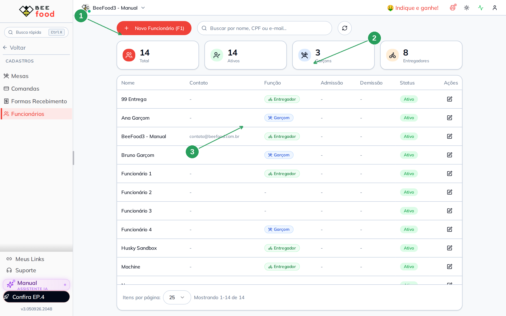
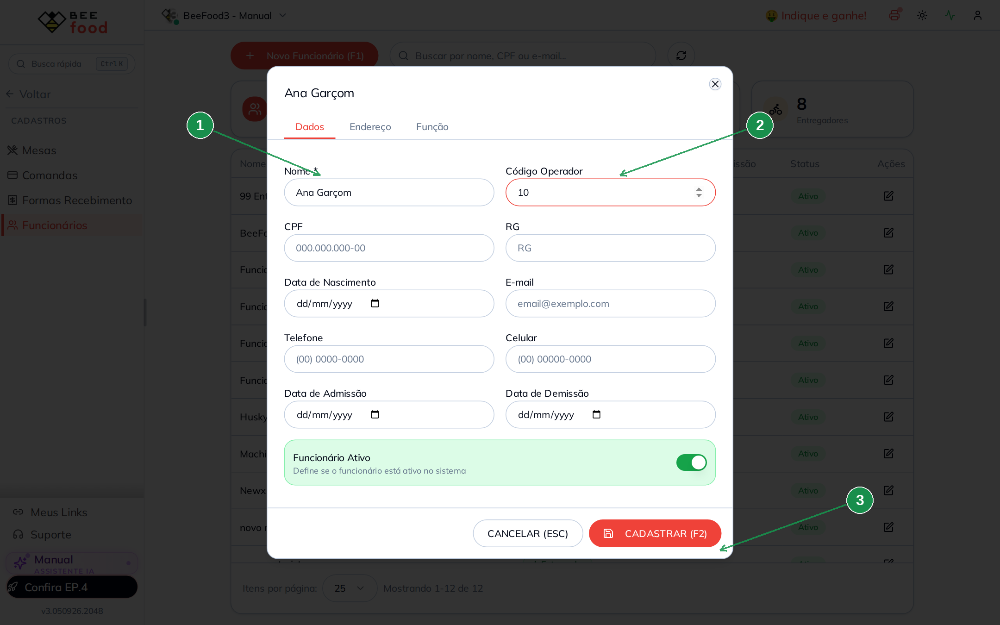
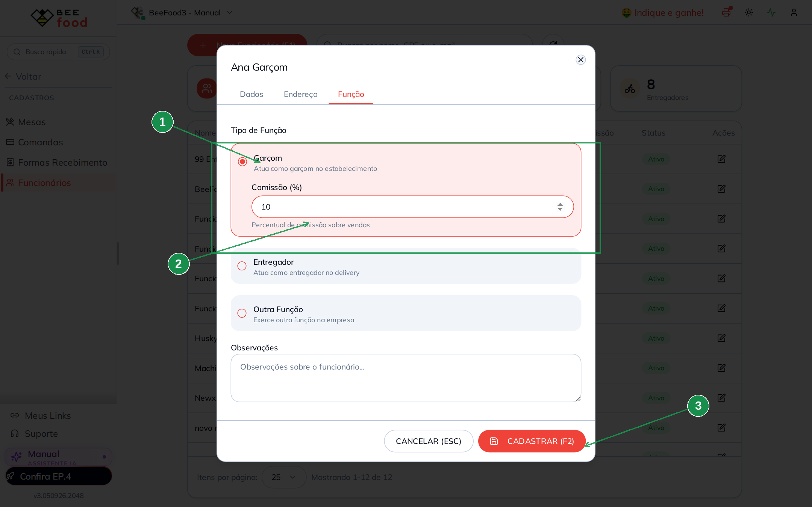
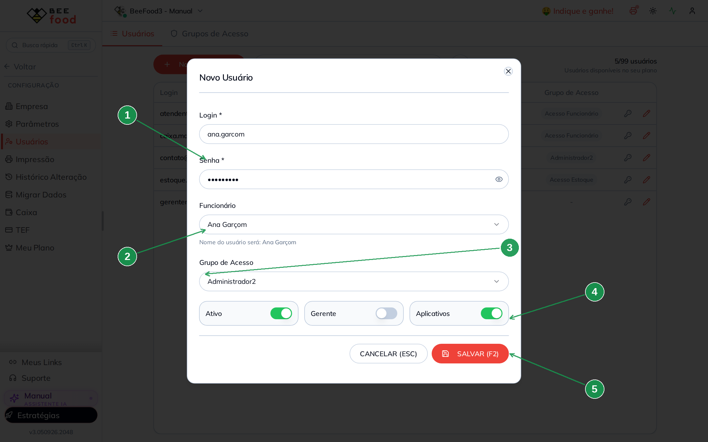
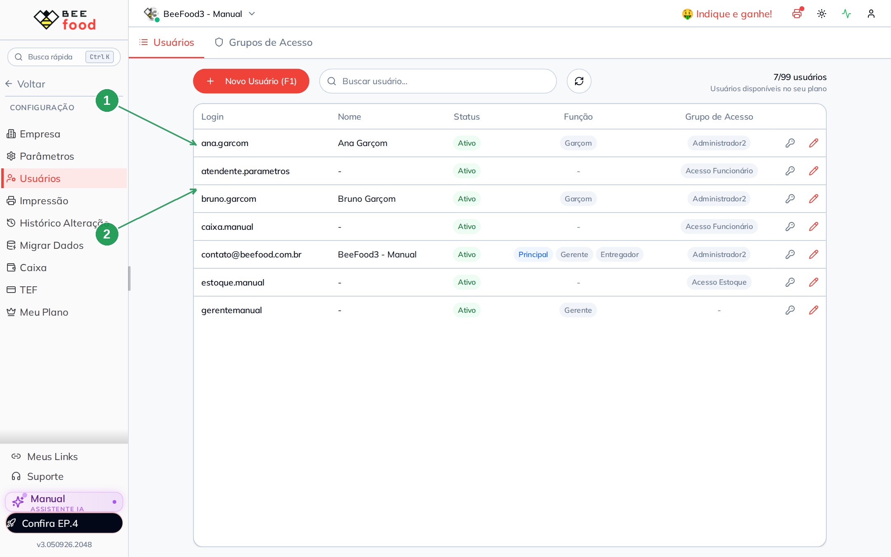
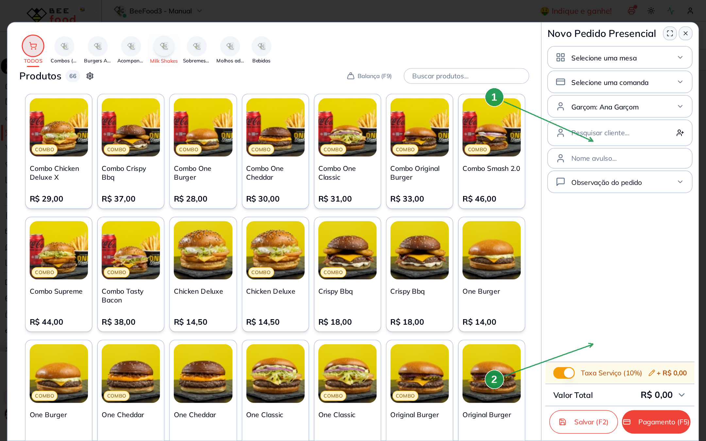
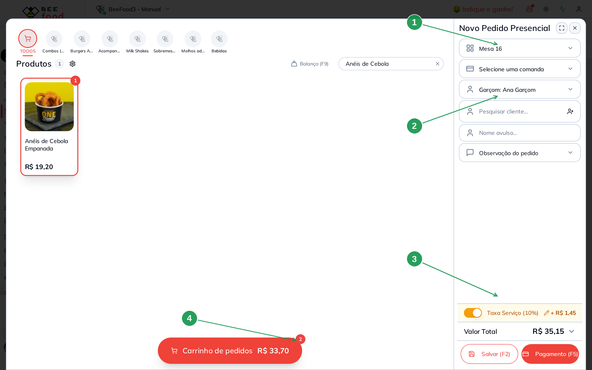
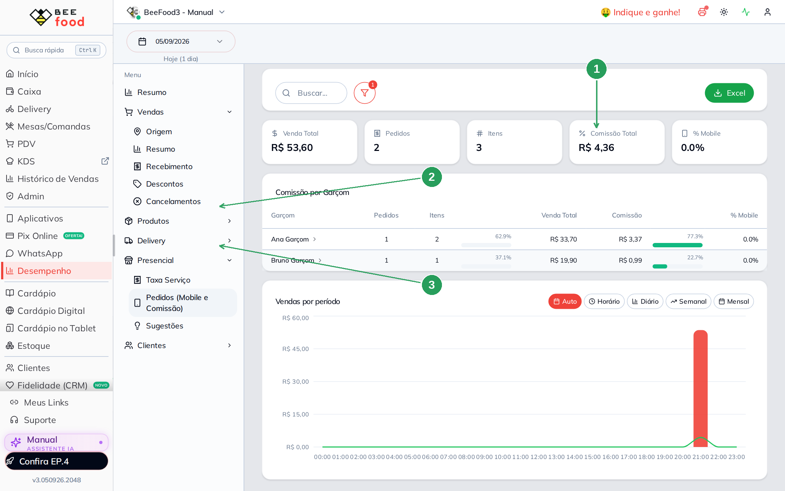

# Comissão do garçom: cadastrar e lançar

Este manual mostra como o garçom passa a ganhar **um percentual em cada produto que ele
lança**. O % mora no **cadastro do funcionário**, não no produto.

> As imagens têm **setas numeradas** (1, 2, 3…). Cada número indica o campo ou botão
> correspondente na tela.

---

## Comissão só existe quando o sistema sabe quem lançou

Não basta selecionar o nome do garçom na mesa. A comissão nasce quando o item é lançado
de um destes três jeitos:

1. **Aplicativo do garçom** — o celular já identifica quem está logado. A configuração
   dos menus do app está no manual [App Garçom (parâmetros)](https://ajuda.beefood.com.br/app-garcom-parametros).
2. **Painel web com o usuário do garçom** — a pessoa entra com o login vinculado ao
   funcionário (é o caminho deste manual).
3. **Código do operador** — várias pessoas no mesmo computador. O parâmetro pede o código
   cadastrado no funcionário antes de abrir o pedido. Isso já tem manual próprio:
   [Código do operador](https://ajuda.beefood.com.br/parametros-codigo-operador).

Se o pedido for lançado com o usuário da loja, **sem** funcionário no login e **sem**
código de operador, o item entra sem comissão.

Comissão **não** é taxa de serviço (gorjeta de 10%). São dois dinheiros. A gorjeta é o
próximo manual, [Relatório de taxa de serviço](https://ajuda.beefood.com.br/relatorio-taxa-servico).

---

## 1. Cadastrar o garçom e o percentual

**Cadastros → Funcionários**. O botão **+ Novo Funcionário (F1)** abre o cadastro.

| Nº | Item | O que observar |
|----|------|----------------|
| 1 | **+ Novo Funcionário (F1)** | Abre o cadastro. |
| 2 | O card **Garçons** | Conta quantos estão com a função Garçom. |
| 3 | A coluna **Função** | O selo azul **Garçom** aparece depois de salvar a aba Função. |

Na aba **Dados**, o nome e o código de operador bastam para este fluxo. O código só entra
em cena se a casa usar o parâmetro Operador — não é obrigatório para o login próprio.

| Nº | Campo | O que fazer |
|----|-------|-------------|
| 1 | **Nome \*** | Obrigatório. Use o nome da pessoa, não um apelido genérico. |
| 2 | **Código Operador** | Número curto (aqui: **10**). Serve para o teclado do operador. |
| 3 | **CADASTRAR (F2)** | Grava. Sem a aba Função, ainda não há comissão. |

A comissão fica na aba **Função**. Marque **Garçom** — o campo **Comissão (%)** só aparece
depois disso.

| Nº | Campo | O que fazer |
|----|-------|-------------|
| 1 | **Garçom** | Marca a função. Entregador e Outra Função são outro assunto. |
| 2 | **Comissão (%)** | O percentual sobre **cada item** que essa pessoa lançar. Aqui: **10**. |
| 3 | **CADASTRAR (F2)** | Grava os dois: função e percentual. |

No exemplo deste manual há dois garçons, para o relatório do dia seguinte ficar óbvio:

| Garçom | Comissão |
|--------|----------|
| **Ana Garçom** | 10% |
| **Bruno Garçom** | 5% |

Não existe campo de comissão no cadastro do produto. O mesmo lanche paga 10% se a Ana
lançar e 5% se o Bruno lançar.

---

## 2. Vincular o usuário ao funcionário

Quem vai lançar pelo painel precisa de um **usuário** ligado a esse funcionário.
**Configuração → Usuários → + Novo Usuário (F1)**. O campo Funcionário e o grupo já foram
ensinados no [Criar usuário e montar grupo de acesso](https://ajuda.beefood.com.br/criar-usuario-e-montar-grupo-de-acesso).

| Nº | Campo | O que fazer |
|----|-------|-------------|
| 1 | **Login** e **Senha** | É o que a pessoa digita para entrar. |
| 2 | **Funcionário** | Escolha **Ana Garçom**. Sem isso, o pedido web não carrega a comissão dela. |
| 3 | **Grupo de Acesso** | Escolha um grupo (aqui: Administrador2). Não deixe Nenhum. |
| 4 | **Aplicativos** | Ligue se ela também usa o app do garçom. |
| 5 | **SALVAR (F2)** | Clique no botão. O atalho F2 desta tela não grava sozinho. |

Na lista, o login passa a mostrar o nome do funcionário e o selo **Garçom**.

| Nº | Item | O que observar |
|----|------|----------------|
| 1 | **ana.garcom** | Nome **Ana Garçom**, função Garçom, grupo preenchido. |
| 2 | **bruno.garcom** | O segundo garçom, com os 5%. |

---

## 3. Lançar logado como o garçom

Saia da conta da loja e entre com `ana.garcom`. Em **Mesas/Comandas → Novo Pedido (F1)**,
o campo **Garçom** já vem preenchido com o funcionário do login.

| Nº | Item | O que observar |
|----|------|----------------|
| 1 | **Garçom: Ana Garçom** | Veio do usuário. Não precisa escolher na mão. |
| 2 | **Taxa Serviço (10%)** | Gorjeta da casa — outro dinheiro, outro relatório. |

Escolha a mesa, lance os produtos e salve (**Salvar F2**) ou receba (**Pagamento F5**).

No exemplo, a Ana lançou dois itens na **Mesa 16**: Chicken Deluxe (R$ 14,50) e Anéis de
Cebola Empanada (R$ 19,20). A taxa de 10% incidiu só no lanche — o anel está marcado
**Sem taxa de serviço** (detalhe do relatório de taxa).

| Nº | Item | O que observar |
|----|------|----------------|
| 1 | **Mesa 16** | O pedido ficou nesta mesa. |
| 2 | **Garçom: Ana Garçom** | Continua o do login. |
| 3 | **Taxa Serviço (10%)** | + R$ 1,45 — 10% só da base que cobra taxa. |
| 4 | **Carrinho** | Os dois itens. A comissão usa o valor de **cada produto**, não o total com taxa. |

O Bruno faz o mesmo no próprio login, com outro produto e os 5%. Não precisa repetir o
cadastro: o % já está no funcionário.

---

## 4. A prova: a linha do produto no relatório

**Desempenho → Presencial → Pedidos (Mobile e Comissão)**. Filtre o dia das vendas (não
deixe os últimos 30 dias — o caixa aberto mistura movimento antigo). Clique no nome da
Ana: a grade é **item a item**.

| Nº | Item | O que conferir |
|----|------|----------------|
| 1 | **Comissão Total** | Soma das linhas. Aqui: **R$ 4,36**. |
| 2 | **Ana Garçom** | 2 itens, venda R$ 33,70, comissão **R$ 3,37** (10%). |
| 3 | **Bruno Garçom** | 1 item, venda R$ 19,90, comissão **R$ 0,99** (5%). |

Conta da Ana, linha a linha: 10% de R$ 14,50 = **R$ 1,45** e 10% de R$ 19,20 = **R$ 1,92**.
O **% Mobile** ficou 0,0% porque o lançamento foi no painel web, não no celular — e mesmo
assim a comissão entrou. O relatório não é “só do app”.

O fechamento completo (KPIs, Excel, Resumo Presencial do caixa) está no
[Relatório de comissão do garçom](https://ajuda.beefood.com.br/relatorio-comissao-garcom).

---

## Perguntas rápidas

**O produto tem um campo de comissão?** Não. O % é do garçom.

**Escolhi o garçom na mesa, mas lancei com o usuário da loja. Tem comissão?** Não. O
sistema precisa do usuário vinculado, do app ou do [código do operador](https://ajuda.beefood.com.br/parametros-codigo-operador).

**A taxa de 10% entra na base da comissão?** Não. A comissão usa o valor do item. A taxa
é gorjeta, conferida no [relatório de taxa de serviço](https://ajuda.beefood.com.br/relatorio-taxa-servico).
